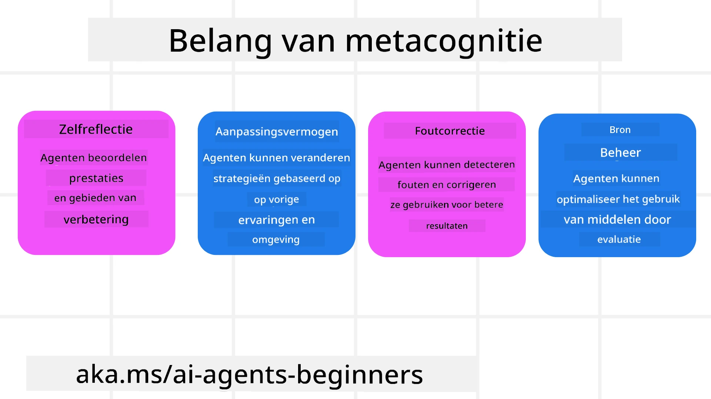
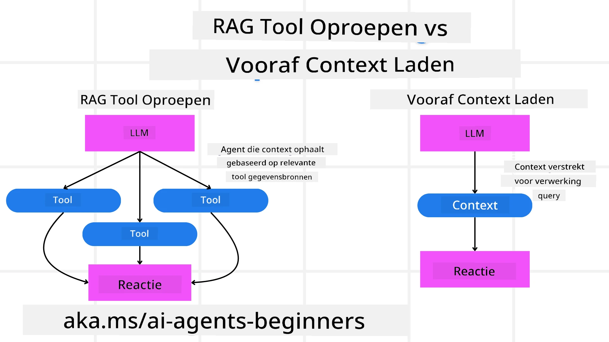

[](https://youtu.be/His9R6gw6Ec?si=3_RMb8VprNvdLRhX)

> _(Klik op de afbeelding hierboven om de video van deze les te bekijken)_
# Metacognitie in AI-agents

## Introductie

Welkom bij de les over metacognitie in AI-agents! Dit hoofdstuk is bedoeld voor beginners die nieuwsgierig zijn naar hoe AI-agents kunnen nadenken over hun eigen denkprocessen. Aan het einde van deze les begrijp je belangrijke concepten en ben je uitgerust met praktische voorbeelden om metacognitie toe te passen in het ontwerp van AI-agents.

## Leerdoelen

Na het voltooien van deze les kun je:

1. De implicaties van redeneerloops in agentdefinities begrijpen.
2. Plannings- en evaluatietechnieken gebruiken om zelfcorrigerende agents te helpen.
3. Je eigen agents creëren die code kunnen manipuleren om taken uit te voeren.

## Introductie tot metacognitie

Metacognitie verwijst naar de hogere-orde cognitieve processen die inhouden dat men nadenkt over het eigen denken. Voor AI-agents betekent dit dat ze hun acties kunnen evalueren en aanpassen op basis van zelfbewustzijn en ervaringen uit het verleden. Metacognitie, of "nadenken over denken," is een belangrijk concept in de ontwikkeling van agentische AI-systemen. Het houdt in dat AI-systemen zich bewust zijn van hun eigen interne processen en in staat zijn om hun gedrag te monitoren, reguleren en aanpassen. Net zoals wij doen wanneer we de situatie inschatten of naar een probleem kijken. Dit zelfbewustzijn kan AI-systemen helpen betere beslissingen te nemen, fouten te identificeren en hun prestaties in de loop van de tijd te verbeteren — wederom gerelateerd aan de Turing-test en het debat over of AI de overhand zal krijgen.

In de context van agentische AI-systemen kan metacognitie helpen bij het aanpakken van verschillende uitdagingen, zoals:
- Transparantie: Zorgen dat AI-systemen hun redeneringen en beslissingen kunnen uitleggen.
- Redeneren: Verbeteren van het vermogen van AI-systemen om informatie te synthetiseren en weloverwogen beslissingen te nemen.
- Adaptatie: Het mogelijk maken dat AI-systemen zich aanpassen aan nieuwe omgevingen en veranderende omstandigheden.
- Perceptie: Verbeteren van de nauwkeurigheid van AI-systemen bij het herkennen en interpreteren van gegevens uit hun omgeving.

### Wat is metacognitie?

Metacognitie, of "nadenken over denken," is een hogere-orde cognitief proces dat zelfbewustzijn en zelfregulatie van iemands cognitieve processen omvat. In het domein van AI stelt metacognitie agents in staat hun strategieën en acties te evalueren en aan te passen, wat leidt tot verbeterde probleemoplossings- en besluitvormingscapaciteiten. Door metacognitie te begrijpen, kun je AI-agents ontwerpen die niet alleen intelligenter maar ook beter aanpasbaar en efficiënter zijn. In echte metacognitie zie je dat de AI expliciet redeneert over haar eigen redenering.

Voorbeeld: “Ik heb prioriteit gegeven aan goedkopere vluchten omdat… ik misschien directe vluchten mis, dus laat ik het opnieuw controleren.”.
Bijhouden hoe of waarom het een bepaalde route koos.
- Opmerken dat het fouten maakte omdat het te veel vertrouwde op gebruikersvoorkeuren van de vorige keer, waardoor het zijn besluitvormingsstrategie aanpast en niet alleen de uiteindelijke aanbeveling.
- Patronen diagnosticeren zoals: “Telkens wanneer ik de gebruiker 'te druk' hoor zeggen, moet ik niet alleen bepaalde attracties verwijderen, maar ook beseffen dat mijn methode om 'topattracties' te kiezen gebrekkig is als ik altijd op populariteit rangschik.”

### Belang van metacognitie in AI-agents

Metacognitie speelt een cruciale rol in het ontwerp van AI-agents om verschillende redenen:



- Zelfreflectie: Agents kunnen hun eigen prestaties beoordelen en verbeterpunten identificeren.
- Aanpasbaarheid: Agents kunnen hun strategieën wijzigen op basis van ervaringen uit het verleden en veranderende omgevingen.
- Foutcorrectie: Agents kunnen fouten autonoom detecteren en corrigeren, wat leidt tot nauwkeurigere resultaten.
- Middelenbeheer: Agents kunnen het gebruik van middelen, zoals tijd en rekenkracht, optimaliseren door hun acties te plannen en evalueren.

## Componenten van een AI-agent

Voordat je dieper ingaat op metacognitieve processen, is het essentieel om de basiscomponenten van een AI-agent te begrijpen. Een AI-agent bestaat doorgaans uit:

- Persona: De persoonlijkheid en kenmerken van de agent, die bepalen hoe het met gebruikers omgaat.
- Tools: De mogelijkheden en functies die de agent kan uitvoeren.
- Vaardigheden: De kennis en expertise waarover de agent beschikt.

Deze componenten werken samen om een “expertiseenheid” te creëren die specifieke taken kan uitvoeren.

**Voorbeeld**:
Denk aan een reisagent, agentdiensten die niet alleen je vakantie plannen maar ook hun route aanpassen op basis van realtime data en eerdere klantreiservaringen.

### Voorbeeld: Metacognitie in een reisagentdienst

Stel je voor dat je een door AI aangedreven reisagentdienst ontwerpt. Deze agent, “Reisagent,” helpt gebruikers bij het plannen van hun vakanties. Om metacognitie te integreren, moet Reisagent zijn acties evalueren en aanpassen op basis van zelfbewustzijn en ervaringen uit het verleden. Zo kan metacognitie een rol spelen:

#### Huidige taak

De huidige taak is een gebruiker te helpen een reis naar Parijs te plannen.

#### Stappen om de taak te voltooien

1. **Gebruikersvoorkeuren verzamelen**: Vraag de gebruiker naar reisdata, budget, interesses (bijv. musea, cuisine, winkelen) en eventuele specifieke wensen.
2. **Informatie ophalen**: Zoek naar vluchtopties, accommodaties, attracties en restaurants die overeenkomen met de voorkeuren van de gebruiker.
3. **Aanbevelingen genereren**: Bied een gepersonaliseerde route aan met vluchtgegevens, hotelreserveringen en voorgestelde activiteiten.
4. **Aanpassen op basis van feedback**: Vraag de gebruiker om feedback over de aanbevelingen en breng indien nodig aanpassingen aan.

#### Benodigde middelen

- Toegang tot databases voor vlucht- en hotelreserveringen.
- Informatie over Parijse attracties en restaurants.
- Gebruikersfeedback van eerdere interacties.

#### Ervaring en zelfreflectie

Reisagent gebruikt metacognitie om zijn prestaties te evalueren en te leren van eerdere ervaringen. Bijvoorbeeld:

1. **Analyseren van gebruikersfeedback**: Reisagent bekijkt gebruikersfeedback om te bepalen welke aanbevelingen goed werden ontvangen en welke niet. Het past toekomstige suggesties hierop aan.
2. **Aanpasbaarheid**: Als een gebruiker eerder aangaf een hekel te hebben aan drukke plekken, zal Reisagent in de toekomst populaire toeristische locaties tijdens piekuren vermijden.
3. **Foutcorrectie**: Als Reisagent een fout heeft gemaakt bij een vorige boeking, zoals het voorstellen van een hotel dat volgeboekt was, leert hij beschikbaarheid strenger te controleren voordat aanbevelingen worden gedaan.

#### Praktisch voorbeeld voor ontwikkelaars

Hier is een vereenvoudigd voorbeeld van hoe de code van Reisagent eruit kan zien bij het integreren van metacognitie:

```python
class Travel_Agent:
    def __init__(self):
        self.user_preferences = {}
        self.experience_data = []

    def gather_preferences(self, preferences):
        self.user_preferences = preferences

    def retrieve_information(self):
        # Zoek naar vluchten, hotels en attracties op basis van voorkeuren
        flights = search_flights(self.user_preferences)
        hotels = search_hotels(self.user_preferences)
        attractions = search_attractions(self.user_preferences)
        return flights, hotels, attractions

    def generate_recommendations(self):
        flights, hotels, attractions = self.retrieve_information()
        itinerary = create_itinerary(flights, hotels, attractions)
        return itinerary

    def adjust_based_on_feedback(self, feedback):
        self.experience_data.append(feedback)
        # Analyseer feedback en pas toekomstige aanbevelingen aan
        self.user_preferences = adjust_preferences(self.user_preferences, feedback)

# Voorbeeldgebruik
travel_agent = Travel_Agent()
preferences = {
    "destination": "Paris",
    "dates": "2025-04-01 to 2025-04-10",
    "budget": "moderate",
    "interests": ["museums", "cuisine"]
}
travel_agent.gather_preferences(preferences)
itinerary = travel_agent.generate_recommendations()
print("Suggested Itinerary:", itinerary)
feedback = {"liked": ["Louvre Museum"], "disliked": ["Eiffel Tower (too crowded)"]}
travel_agent.adjust_based_on_feedback(feedback)
```

#### Waarom metacognitie belangrijk is

- **Zelfreflectie**: Agents kunnen hun prestaties analyseren en verbeterpunten identificeren.
- **Aanpasbaarheid**: Agents kunnen strategieën aanpassen op basis van feedback en veranderende omstandigheden.
- **Foutcorrectie**: Agents kunnen fouten autonoom detecteren en corrigeren.
- **Middelenbeheer**: Agents kunnen het gebruik van middelen optimaliseren, zoals tijd en rekenkracht.

Door metacognitie te integreren, kan Reisagent meer gepersonaliseerde en nauwkeurige reisaanbevelingen doen, wat de algehele gebruikerservaring verbetert.

---

## 2. Plannen in agents


Planning is een cruciaal onderdeel van het gedrag van AI-agents. Het houdt in dat de stappen worden uitgestippeld die nodig zijn om een doel te bereiken, met inachtneming van de huidige staat, middelen en mogelijke obstakels.

### Elementen van Planning

- **Huidige Taak**: Definieer de taak duidelijk.
- **Stappen om de Taak te Voltooien**: Breek de taak op in beheersbare stappen.
- **Benodigde Middelen**: Identificeer de benodigde middelen.
- **Ervaring**: Maak gebruik van eerdere ervaringen om de planning te informeren.

**Voorbeeld**:
Hier zijn de stappen die Travel Agent moet nemen om een gebruiker effectief te helpen bij het plannen van hun reis:

### Stappen voor Travel Agent

1. **Verzamel Gebruikersvoorkeuren**
   - Vraag de gebruiker naar details over hun reisdata, budget, interesses en specifieke wensen.
   - Voorbeelden: "Wanneer ben je van plan te reizen?" "Wat is je budgetbereik?" "Welke activiteiten vind je leuk tijdens je vakantie?"

2. **Verzamel Informatie**
   - Zoek naar relevante reisopties op basis van de voorkeuren van de gebruiker.
   - **Vluchten**: Zoek naar beschikbare vluchten binnen het budget en de gewenste reisdata van de gebruiker.
   - **Accommodaties**: Vind hotels of huurwoningen die passen bij de voorkeuren van de gebruiker qua locatie, prijs en voorzieningen.
   - **Attracties en Restaurants**: Identificeer populaire attracties, activiteiten en eetgelegenheden die aansluiten bij de interesses van de gebruiker.

3. **Genereer Aanbevelingen**
   - Stel de verzamelde informatie samen in een gepersonaliseerde reisroute.
   - Geef details zoals vluchtopties, hotelreserveringen en voorgestelde activiteiten, waarbij de aanbevelingen worden afgestemd op de voorkeuren van de gebruiker.

4. **Presenteer Reisschema aan de Gebruiker**
   - Deel het voorgestelde reisschema met de gebruiker ter beoordeling.
   - Voorbeeld: "Hier is een voorgesteld reisschema voor je reis naar Parijs. Het bevat vluchtgegevens, hotelboekingen en een lijst met aanbevolen activiteiten en restaurants. Laat me weten wat je ervan vindt!"

5. **Verzamel Feedback**
   - Vraag de gebruiker om feedback over het voorgestelde reisschema.
   - Voorbeelden: "Vind je de vluchtopties goed?" "Is het hotel geschikt voor je behoeften?" "Zijn er activiteiten die je wilt toevoegen of verwijderen?"

6. **Pas aan op Basis van Feedback**
   - Pas het reisschema aan op basis van de feedback van de gebruiker.
   - Breng de nodige wijzigingen aan in vlucht-, accommodatie- en activiteit-aanbevelingen om beter aan te sluiten bij de voorkeuren van de gebruiker.

7. **Definitieve Bevestiging**
   - Presenteer het bijgewerkte reisschema aan de gebruiker voor definitieve goedkeuring.
   - Voorbeeld: "Ik heb de aanpassingen gedaan op basis van je feedback. Hier is het bijgewerkte reisschema. Ziet alles er goed uit?"

8. **Boek en Bevestig Reserveringen**
   - Zodra de gebruiker het reisschema goedkeurt, ga je over tot het boeken van vluchten, accommodaties en eventuele vooraf geplande activiteiten.
   - Stuur de bevestigingsgegevens naar de gebruiker.

9. **Bied Doorlopende Ondersteuning**
   - Blijf beschikbaar om de gebruiker te helpen met wijzigingen of aanvullende verzoeken voor en tijdens hun reis.
   - Voorbeeld: "Als je tijdens je reis nog hulp nodig hebt, neem dan gerust op elk moment contact met me op!"

### Voorbeeldinteractie

```python
class Travel_Agent:
    def __init__(self):
        self.user_preferences = {}
        self.experience_data = []

    def gather_preferences(self, preferences):
        self.user_preferences = preferences

    def retrieve_information(self):
        flights = search_flights(self.user_preferences)
        hotels = search_hotels(self.user_preferences)
        attractions = search_attractions(self.user_preferences)
        return flights, hotels, attractions

    def generate_recommendations(self):
        flights, hotels, attractions = self.retrieve_information()
        itinerary = create_itinerary(flights, hotels, attractions)
        return itinerary

    def adjust_based_on_feedback(self, feedback):
        self.experience_data.append(feedback)
        self.user_preferences = adjust_preferences(self.user_preferences, feedback)

# Voorbeeldgebruik binnen een boekingsverzoek
travel_agent = Travel_Agent()
preferences = {
    "destination": "Paris",
    "dates": "2025-04-01 to 2025-04-10",
    "budget": "moderate",
    "interests": ["museums", "cuisine"]
}
travel_agent.gather_preferences(preferences)
itinerary = travel_agent.generate_recommendations()
print("Suggested Itinerary:", itinerary)
feedback = {"liked": ["Louvre Museum"], "disliked": ["Eiffel Tower (too crowded)"]}
travel_agent.adjust_based_on_feedback(feedback)
```

## 3. Correctief RAG-systeem

Laten we eerst beginnen met het begrijpen van het verschil tussen RAG Tool en Pre-emptive Context Load



### Retrieval-Augmented Generation (RAG)

RAG combineert een retrieval-systeem met een generatief model. Wanneer er een zoekopdracht wordt gedaan, haalt het retrieval-systeem relevante documenten of gegevens op uit een externe bron, en deze opgehaalde informatie wordt gebruikt om de invoer voor het generatieve model aan te vullen. Dit helpt het model om nauwkeurigere en contextueel relevante antwoorden te genereren.

In een RAG-systeem haalt de agent relevante informatie op uit een kennisbasis en gebruikt deze om gepaste reacties of acties te genereren.

### Correctieve RAG-benadering

De Correctieve RAG-benadering richt zich op het gebruik van RAG-technieken om fouten te corrigeren en de nauwkeurigheid van AI-agents te verbeteren. Dit omvat:

1. **Prompting-techniek**: Gebruik van specifieke aanwijzingen om de agent te begeleiden bij het ophalen van relevante informatie.
2. **Tool**: Implementatie van algoritmes en mechanismen die de agent in staat stellen de relevantie van de opgehaalde informatie te evalueren en nauwkeurige antwoorden te genereren.
3. **Evaluatie**: Het continu beoordelen van de prestaties van de agent en het aanbrengen van aanpassingen om de nauwkeurigheid en efficiëntie te verbeteren.

#### Voorbeeld: Correctieve RAG in een Zoekagent

Beschouw een zoekagent die informatie van het web haalt om gebruikersvragen te beantwoorden. De Correctieve RAG-aanpak zou kunnen bestaan uit:

1. **Prompting-techniek**: Formuleren van zoekopdrachten op basis van de input van de gebruiker.
2. **Tool**: Gebruik van natuurlijke taalverwerking en machine learning-algoritmen om zoekresultaten te rangschikken en filteren.
3. **Evaluatie**: Analyse van gebruikersfeedback om onjuistheden in de opgehaalde informatie te identificeren en te corrigeren.

### Correctieve RAG in Travel Agent

Correctieve RAG (Retrieval-Augmented Generation) verbetert het vermogen van een AI om informatie op te halen en te genereren terwijl onjuistheden worden gecorrigeerd. Laten we zien hoe Travel Agent de Correctieve RAG-benadering kan gebruiken om nauwkeurigere en relevantere reissuggesties te bieden.

Dit omvat:

- **Prompting-techniek:** Gebruik maken van specifieke prompts om de agent te begeleiden bij het ophalen van relevante informatie.
- **Tool:** Implementeren van algoritmen en mechanismen die de agent in staat stellen de relevantie van opgehaalde informatie te evalueren en nauwkeurige antwoorden te genereren.
- **Evaluatie:** Continu beoordelen van de prestaties van de agent en aanpassingen maken om de nauwkeurigheid en efficiëntie te verbeteren.

#### Stappen voor het implementeren van Correctieve RAG in Travel Agent

1. **Initiële Gebruikersinteractie**
   - Travel Agent verzamelt de eerste voorkeuren van de gebruiker, zoals bestemming, reisdata, budget en interesses.
   - Voorbeeld:

     ```python
     preferences = {
         "destination": "Paris",
         "dates": "2025-04-01 to 2025-04-10",
         "budget": "moderate",
         "interests": ["museums", "cuisine"]
     }
     ```

2. **Informatie Ophalen**
   - Travel Agent haalt informatie op over vluchten, accommodaties, attracties en restaurants op basis van de voorkeuren van de gebruiker.
   - Voorbeeld:

     ```python
     flights = search_flights(preferences)
     hotels = search_hotels(preferences)
     attractions = search_attractions(preferences)
     ```

3. **Genereren van Initiële Aanbevelingen**
   - Travel Agent gebruikt de opgehaalde informatie om een gepersonaliseerd reisschema te genereren.
   - Voorbeeld:

     ```python
     itinerary = create_itinerary(flights, hotels, attractions)
     print("Suggested Itinerary:", itinerary)
     ```

4. **Verzamelen van Gebruikersfeedback**
   - Travel Agent vraagt de gebruiker om feedback op de initiële aanbevelingen.
   - Voorbeeld:

     ```python
     feedback = {
         "liked": ["Louvre Museum"],
         "disliked": ["Eiffel Tower (too crowded)"]
     }
     ```

5. **Correctieve RAG-Proces**
   - **Prompting-techniek**: Travel Agent formuleert nieuwe zoekopdrachten gebaseerd op gebruikersfeedback.
     - Voorbeeld:

       ```python
       if "disliked" in feedback:
           preferences["avoid"] = feedback["disliked"]
       ```

   - **Tool**: Travel Agent gebruikt algoritmen om nieuwe zoekresultaten te rangschikken en filteren, met nadruk op relevantie op basis van gebruikersfeedback.
     - Voorbeeld:

       ```python
       new_attractions = search_attractions(preferences)
       new_itinerary = create_itinerary(flights, hotels, new_attractions)
       print("Updated Itinerary:", new_itinerary)
       ```

   - **Evaluatie**: Travel Agent beoordeelt continu de relevantie en nauwkeurigheid van zijn aanbevelingen door gebruikersfeedback te analyseren en waar nodig aanpassingen te doen.
     - Voorbeeld:

       ```python
       def adjust_preferences(preferences, feedback):
           if "liked" in feedback:
               preferences["favorites"] = feedback["liked"]
           if "disliked" in feedback:
               preferences["avoid"] = feedback["disliked"]
           return preferences

       preferences = adjust_preferences(preferences, feedback)
       ```

#### Praktisch Voorbeeld

Hier is een vereenvoudigd Python-codevoorbeeld dat de Correctieve RAG-benadering in Travel Agent integreert:

```python
class Travel_Agent:
    def __init__(self):
        self.user_preferences = {}
        self.experience_data = []

    def gather_preferences(self, preferences):
        self.user_preferences = preferences

    def retrieve_information(self):
        flights = search_flights(self.user_preferences)
        hotels = search_hotels(self.user_preferences)
        attractions = search_attractions(self.user_preferences)
        return flights, hotels, attractions

    def generate_recommendations(self):
        flights, hotels, attractions = self.retrieve_information()
        itinerary = create_itinerary(flights, hotels, attractions)
        return itinerary

    def adjust_based_on_feedback(self, feedback):
        self.experience_data.append(feedback)
        self.user_preferences = adjust_preferences(self.user_preferences, feedback)
        new_itinerary = self.generate_recommendations()
        return new_itinerary

# Voorbeeldgebruik
travel_agent = Travel_Agent()
preferences = {
    "destination": "Paris",
    "dates": "2025-04-01 to 2025-04-10",
    "budget": "moderate",
    "interests": ["museums", "cuisine"]
}
travel_agent.gather_preferences(preferences)
itinerary = travel_agent.generate_recommendations()
print("Suggested Itinerary:", itinerary)
feedback = {"liked": ["Louvre Museum"], "disliked": ["Eiffel Tower (too crowded)"]}
new_itinerary = travel_agent.adjust_based_on_feedback(feedback)
print("Updated Itinerary:", new_itinerary)
```

### Pre-emptive Context Load


Pre-emptive Context Load houdt in dat relevante context of achtergrondinformatie in het model wordt geladen voordat een vraag wordt verwerkt. Dit betekent dat het model vanaf het begin toegang heeft tot deze informatie, wat kan helpen om beter geïnformeerde antwoorden te genereren zonder tijdens het proces extra gegevens te hoeven opvragen.

Hier is een vereenvoudigd voorbeeld van hoe een pre-emptive context load eruit zou kunnen zien voor een reisagent-applicatie in Python:

```python
class TravelAgent:
    def __init__(self):
        # Vooraf populaire bestemmingen en hun informatie laden
        self.context = {
            "Paris": {"country": "France", "currency": "Euro", "language": "French", "attractions": ["Eiffel Tower", "Louvre Museum"]},
            "Tokyo": {"country": "Japan", "currency": "Yen", "language": "Japanese", "attractions": ["Tokyo Tower", "Shibuya Crossing"]},
            "New York": {"country": "USA", "currency": "Dollar", "language": "English", "attractions": ["Statue of Liberty", "Times Square"]},
            "Sydney": {"country": "Australia", "currency": "Dollar", "language": "English", "attractions": ["Sydney Opera House", "Bondi Beach"]}
        }

    def get_destination_info(self, destination):
        # Bestemmingsinformatie ophalen uit vooraf geladen context
        info = self.context.get(destination)
        if info:
            return f"{destination}:\nCountry: {info['country']}\nCurrency: {info['currency']}\nLanguage: {info['language']}\nAttractions: {', '.join(info['attractions'])}"
        else:
            return f"Sorry, we don't have information on {destination}."

# Voorbeeldgebruik
travel_agent = TravelAgent()
print(travel_agent.get_destination_info("Paris"))
print(travel_agent.get_destination_info("Tokyo"))
```

#### Uitleg

1. **Initialisatie (`__init__` methode)**: De `TravelAgent`-klasse laadt vooraf een woordenboek met informatie over populaire bestemmingen zoals Parijs, Tokio, New York en Sydney. Dit woordenboek bevat details zoals het land, de valuta, de taal en belangrijke attracties voor elke bestemming.

2. **Informatie opvragen (`get_destination_info` methode)**: Wanneer een gebruiker een specifieke bestemming opvraagt, haalt de `get_destination_info`-methode de relevante informatie uit het vooraf geladen contextwoordenboek op.

Door de context vooraf te laden, kan de reisagent-applicatie snel reageren op gebruikersvragen zonder deze informatie in realtime uit een externe bron te hoeven halen. Dit maakt de applicatie efficiënter en responsiever.

### Een plan opzetten met een doel vóór het itereren

Een plan opzetten met een doel houdt in dat je begint met een duidelijk doel of gewenste uitkomst voor ogen. Door dit doel van tevoren te definiëren, kan het model dit gebruiken als leidraad gedurende het iteratieve proces. Dit helpt ervoor te zorgen dat elke iteratie dichter bij het bereiken van het gewenste resultaat komt, waardoor het proces efficiënter en gerichter wordt.

Hier is een voorbeeld van hoe je een reisplan met een doel kunt opzetten vóór het itereren voor een reisagent in Python:

### Scenario

Een reisagent wil een gepersonaliseerde vakantie plannen voor een klant. Het doel is om een reisroute te creëren die de tevredenheid van de klant maximaliseert op basis van hun voorkeuren en budget.

### Stappen

1. Definieer de voorkeuren en het budget van de klant.
2. Zet het initiële plan op op basis van deze voorkeuren.
3. Itereer om het plan te verfijnen, optimaliserend voor de tevredenheid van de klant.

#### Python-code

```python
class TravelAgent:
    def __init__(self, destinations):
        self.destinations = destinations

    def bootstrap_plan(self, preferences, budget):
        plan = []
        total_cost = 0

        for destination in self.destinations:
            if total_cost + destination['cost'] <= budget and self.match_preferences(destination, preferences):
                plan.append(destination)
                total_cost += destination['cost']

        return plan

    def match_preferences(self, destination, preferences):
        for key, value in preferences.items():
            if destination.get(key) != value:
                return False
        return True

    def iterate_plan(self, plan, preferences, budget):
        for i in range(len(plan)):
            for destination in self.destinations:
                if destination not in plan and self.match_preferences(destination, preferences) and self.calculate_cost(plan, destination) <= budget:
                    plan[i] = destination
                    break
        return plan

    def calculate_cost(self, plan, new_destination):
        return sum(destination['cost'] for destination in plan) + new_destination['cost']

# Voorbeeldgebruik
destinations = [
    {"name": "Paris", "cost": 1000, "activity": "sightseeing"},
    {"name": "Tokyo", "cost": 1200, "activity": "shopping"},
    {"name": "New York", "cost": 900, "activity": "sightseeing"},
    {"name": "Sydney", "cost": 1100, "activity": "beach"},
]

preferences = {"activity": "sightseeing"}
budget = 2000

travel_agent = TravelAgent(destinations)
initial_plan = travel_agent.bootstrap_plan(preferences, budget)
print("Initial Plan:", initial_plan)

refined_plan = travel_agent.iterate_plan(initial_plan, preferences, budget)
print("Refined Plan:", refined_plan)
```

#### Uitleg van de code

1. **Initialisatie (`__init__` methode)**: De `TravelAgent`-klasse wordt geïnitialiseerd met een lijst van potentiële bestemmingen, elk met attributen zoals naam, kosten en type activiteit.

2. **Het plan opzetten (`bootstrap_plan` methode)**: Deze methode maakt een eerste reisplan op basis van de voorkeuren en het budget van de klant. Het loopt de lijst met bestemmingen door en voegt ze toe aan het plan als ze overeenkomen met de voorkeuren van de klant en binnen het budget passen.

3. **Voorkeuren matchen (`match_preferences` methode)**: Deze methode controleert of een bestemming overeenkomt met de voorkeuren van de klant.

4. **Het plan itereren (`iterate_plan` methode)**: Deze methode verfijnt het initiële plan door te proberen elke bestemming in het plan te vervangen door een betere match, rekening houdend met de voorkeuren en budgetbeperkingen van de klant.

5. **Kosten berekenen (`calculate_cost` methode)**: Deze methode berekent de totale kosten van het huidige plan, inclusief een eventuele nieuwe bestemming.

#### Voorbeeldgebruik

- **Initieel Plan**: De reisagent maakt een initieel plan gebaseerd op de voorkeuren van de klant voor sightseeing en een budget van $2000.
- **Verfijnd Plan**: De reisagent iterereert het plan, optimaliserend voor de voorkeuren en het budget van de klant.

Door het plan op te zetten met een duidelijk doel (bijv. maximale klanttevredenheid) en te itereren om het plan te verfijnen, kan de reisagent een gepersonaliseerde en geoptimaliseerde reisroute maken voor de klant. Deze aanpak zorgt ervoor dat het reisplan vanaf het begin aansluit bij de voorkeuren en het budget van de klant, en verbetert met elke iteratie.

### Gebruikmaken van LLM voor herordenen en scoren

Grote Taalmodellen (LLM's) kunnen worden gebruikt voor herordenen en scoren door de relevantie en kwaliteit van opgehaalde documenten of gegenereerde antwoorden te evalueren. Zo werkt het:

**Ophalen:** De eerste stap haalt een set kandidaat-documenten of antwoorden op basis van de query.

**Herordenen:** Het LLM evalueert deze kandidaten en herordent ze op basis van hun relevantie en kwaliteit. Deze stap zorgt ervoor dat de meest relevante en kwalitatieve informatie als eerste wordt gepresenteerd.

**Scoren:** Het LLM kent scores toe aan elke kandidaat, die hun relevantie en kwaliteit weerspiegelen. Dit helpt bij het selecteren van de beste reactie of het beste document voor de gebruiker.

Door LLM's te gebruiken voor herordenen en scoren kan het systeem nauwkeuriger en contextueel relevantere informatie bieden, waardoor de algehele gebruikerservaring verbetert.

Hier is een voorbeeld van hoe een reisagent een Grote Taalmodel (LLM) kan gebruiken voor herordenen en scoren van reisbestemmingen op basis van gebruikersvoorkeuren in Python:

#### Scenario - Reizen gebaseerd op voorkeuren

Een reisagent wil de beste reisbestemmingen aanbevelen aan een klant op basis van hun voorkeuren. Het LLM helpt bij het herordenen en scoren van de bestemmingen om de meest relevante opties te presenteren.

#### Stappen:

1. Verzamel gebruikersvoorkeuren.
2. Haal een lijst potentiële reisbestemmingen op.
3. Gebruik het LLM om de bestemmingen te herordenen en scoren op basis van gebruikersvoorkeuren.

Hier zie je hoe je het vorige voorbeeld kunt aanpassen om Azure OpenAI Services te gebruiken:

#### Vereisten

1. Je moet een Azure-abonnement hebben.
2. Maak een Azure OpenAI-resource aan en haal je API-sleutel op.

#### Voorbeeld van Python-code

```python
import requests
import json

class TravelAgent:
    def __init__(self, destinations):
        self.destinations = destinations

    def get_recommendations(self, preferences, api_key, endpoint):
        # Genereer een prompt voor de Azure OpenAI
        prompt = self.generate_prompt(preferences)
        
        # Definieer headers en payload voor het verzoek
        headers = {
            'Content-Type': 'application/json',
            'Authorization': f'Bearer {api_key}'
        }
        payload = {
            "prompt": prompt,
            "max_tokens": 150,
            "temperature": 0.7
        }
        
        # Roep de Azure OpenAI API aan om de hergerangschikte en beoordeelde bestemmingen te krijgen
        response = requests.post(endpoint, headers=headers, json=payload)
        response_data = response.json()
        
        # Extraheer en retourneer de aanbevelingen
        recommendations = response_data['choices'][0]['text'].strip().split('\n')
        return recommendations

    def generate_prompt(self, preferences):
        prompt = "Here are the travel destinations ranked and scored based on the following user preferences:\n"
        for key, value in preferences.items():
            prompt += f"{key}: {value}\n"
        prompt += "\nDestinations:\n"
        for destination in self.destinations:
            prompt += f"- {destination['name']}: {destination['description']}\n"
        return prompt

# Voorbeeldgebruik
destinations = [
    {"name": "Paris", "description": "City of lights, known for its art, fashion, and culture."},
    {"name": "Tokyo", "description": "Vibrant city, famous for its modernity and traditional temples."},
    {"name": "New York", "description": "The city that never sleeps, with iconic landmarks and diverse culture."},
    {"name": "Sydney", "description": "Beautiful harbour city, known for its opera house and stunning beaches."},
]

preferences = {"activity": "sightseeing", "culture": "diverse"}
api_key = 'your_azure_openai_api_key'
endpoint = 'https://your-endpoint.com/openai/deployments/your-deployment-name/completions?api-version=2022-12-01'

travel_agent = TravelAgent(destinations)
recommendations = travel_agent.get_recommendations(preferences, api_key, endpoint)
print("Recommended Destinations:")
for rec in recommendations:
    print(rec)
```

#### Uitleg van de code - Voorkeurboeker

1. **Initialisatie**: De `TravelAgent`-klasse wordt geïnitialiseerd met een lijst van potentiële reisbestemmingen, elk met attributen zoals naam en beschrijving.

2. **Aanbevelingen ophalen (`get_recommendations` methode)**: Deze methode genereert een prompt voor de Azure OpenAI-service gebaseerd op de voorkeuren van de gebruiker en maakt een HTTP POST-aanvraag naar de Azure OpenAI API om herordende en gescoorde bestemmingen te krijgen.

3. **Prompt genereren (`generate_prompt` methode)**: Deze methode stelt een prompt op voor Azure OpenAI, inclusief de voorkeuren van de gebruiker en de lijst met bestemmingen. De prompt stuurt het model om de bestemmingen te herordenen en te scoren op basis van de opgegeven voorkeuren.

4. **API-aanroep**: De `requests`-bibliotheek wordt gebruikt om een HTTP POST-aanvraag te doen naar de Azure OpenAI API-endpoint. De respons bevat de herordende en gescoorde bestemmingen.

5. **Voorbeeldgebruik**: De reisagent verzamelt gebruikersvoorkeuren (bijv. interesse in sightseeing en diverse cultuur) en gebruikt de Azure OpenAI-service om herordende en gescoorde aanbevelingen voor reisbestemmingen te krijgen.

Vervang `your_azure_openai_api_key` door je eigen Azure OpenAI API-sleutel en `https://your-endpoint.com/...` door het daadwerkelijke endpoint-URL van je Azure OpenAI-implementatie.

Door gebruik te maken van het LLM voor herordenen en scoren kan de reisagent meer gepersonaliseerde en relevante reisaanbevelingen aan klanten bieden, wat hun algehele ervaring verbetert.

### RAG: Prompting-techniek versus hulpmiddel

Retrieval-Augmented Generation (RAG) kan zowel een prompting-techniek als een hulpmiddel zijn in de ontwikkeling van AI-agenten. Het begrijpen van het onderscheid kan je helpen RAG effectiever te benutten in je projecten.

#### RAG als prompting-techniek

**Wat is het?**

- Als prompting-techniek omvat RAG het formuleren van specifieke vragen of prompts om het ophalen van relevante informatie uit een grote verzameling of database te sturen. Deze informatie wordt vervolgens gebruikt om antwoorden of acties te genereren.

**Hoe het werkt:**

1. **Prompts formuleren**: Maak goed gestructureerde prompts of vragen op basis van de taak of de input van de gebruiker.
2. **Informatie ophalen**: Gebruik de prompts om relevante gegevens uit een bestaande kennisbank of dataset te zoeken.
3. **Antwoord genereren**: Combineer de opgehaalde informatie met generatieve AI-modellen om een uitgebreid en coherent antwoord te produceren.

**Voorbeeld bij reisagent**:

- Gebruikersinput: "Ik wil musea bezoeken in Parijs."
- Prompt: "Vind topmusea in Parijs."
- Opgehaalde informatie: Details over het Louvre, Musée d'Orsay, enzovoort.
- Gegeneerd antwoord: "Hier zijn enkele topmusea in Parijs: het Louvre, Musée d'Orsay en Centre Pompidou."

#### RAG als hulpmiddel

**Wat is het?**

- Als hulpmiddel is RAG een geïntegreerd systeem dat het ophalen en genereren automatiseert, waardoor ontwikkelaars complexe AI-functionaliteiten kunnen implementeren zonder voor elke query handmatig prompts te moeten maken.

**Hoe het werkt:**

1. **Integratie**: Embed RAG in de architectuur van de AI-agent, zodat deze automatisch het ophalen en genereren afhandelt.
2. **Automatisering**: Het hulpmiddel beheert het hele proces, van het ontvangen van gebruikersinput tot het genereren van het eindantwoord, zonder dat expliciete prompts per stap nodig zijn.
3. **Efficiëntie**: Verbetert de prestaties van de agent door het ophalen en genereren te stroomlijnen, wat snellere en nauwkeurigere antwoorden mogelijk maakt.

**Voorbeeld bij reisagent**:

- Gebruikersinput: "Ik wil musea bezoeken in Parijs."
- RAG-hulpmiddel: Haalt automatisch informatie over musea op en genereert een antwoord.
- Gegeneerd antwoord: "Hier zijn enkele topmusea in Parijs: het Louvre, Musée d'Orsay en Centre Pompidou."

### Vergelijking

| Aspect                 | Prompting-techniek                                   | Hulpmiddel                                               |
|------------------------|-----------------------------------------------------|----------------------------------------------------------|
| **Handmatig vs Automatisch** | Handmatige formulering van prompts voor elke query. | Geautomatiseerd proces voor ophalen en genereren.        |
| **Controle**            | Biedt meer controle over het ophaalproces.          | Stroomlijnt en automatiseert het ophalen en genereren.  |
| **Flexibiliteit**        | Maakt aangepaste prompts op basis van specifieke behoeften mogelijk. | Efficiënter voor grootschalige implementaties.          |
| **Complexiteit**         | Vereist het maken en bijstellen van prompts.         | Makkelijker te integreren binnen de architectuur van een AI-agent. |

### Praktische voorbeelden

**Voorbeeld prompting-techniek:**

```python
def search_museums_in_paris():
    prompt = "Find top museums in Paris"
    search_results = search_web(prompt)
    return search_results

museums = search_museums_in_paris()
print("Top Museums in Paris:", museums)
```

**Voorbeeld hulpmiddel:**

```python
class Travel_Agent:
    def __init__(self):
        self.rag_tool = RAGTool()

    def get_museums_in_paris(self):
        user_input = "I want to visit museums in Paris."
        response = self.rag_tool.retrieve_and_generate(user_input)
        return response

travel_agent = Travel_Agent()
museums = travel_agent.get_museums_in_paris()
print("Top Museums in Paris:", museums)
```

### Relevantie evalueren

Het evalueren van relevantie is een cruciaal aspect van de prestaties van AI-agenten. Het zorgt ervoor dat de informatie die door de agent wordt opgehaald en gegenereerd passend, accuraat en nuttig is voor de gebruiker. Laten we verkennen hoe relevantie kan worden geëvalueerd bij AI-agenten, inclusief praktische voorbeelden en technieken.

#### Belangrijke concepten bij het evalueren van relevantie

1. **Contextbewustzijn**:
   - De agent moet de context van de gebruikersvraag begrijpen om relevante informatie op te halen en te genereren.
   - Voorbeeld: Als een gebruiker vraagt naar "beste restaurants in Parijs," moet de agent rekening houden met de voorkeuren van de gebruiker, zoals het type keuken en budget.

2. **Nauwkeurigheid**:
   - De door de agent geleverde informatie moet feitelijk correct en up-to-date zijn.
   - Voorbeeld: Het aanbevelen van momenteel geopende restaurants met goede recensies in plaats van verouderde of gesloten opties.

3. **Gebruikersintentie**:
   - De agent moet de intentie van de gebruiker achter de vraag afleiden om de meest relevante informatie te bieden.
   - Voorbeeld: Als een gebruiker vraagt naar "budgetvriendelijke hotels," moet de agent betaalbare opties prioriteren.

4. **Feedbackloop**:
   - Het continu verzamelen en analyseren van gebruikersfeedback helpt de agent om het evaluatieproces van relevantie te verbeteren.
   - Voorbeeld: Het incorporeren van gebruikersbeoordelingen en feedback op eerdere aanbevelingen om toekomstige antwoorden te verbeteren.

#### Praktische technieken voor het evalueren van relevantie

1. **Relevantie-score**:
   - Ken aan elk opgehaald item een scores toe op basis van hoe goed het overeenkomt met de vraag en voorkeuren van de gebruiker.
   - Voorbeeld:

     ```python
     def relevance_score(item, query):
         score = 0
         if item['category'] in query['interests']:
             score += 1
         if item['price'] <= query['budget']:
             score += 1
         if item['location'] == query['destination']:
             score += 1
         return score
     ```

2. **Filtering en rangschikking**:
   - Filter irrelevante items eruit en rangschik de overgebleven op basis van hun relevatiescore.
   - Voorbeeld:

     ```python
     def filter_and_rank(items, query):
         ranked_items = sorted(items, key=lambda item: relevance_score(item, query), reverse=True)
         return ranked_items[:10]  # Geef de top 10 relevante items terug
     ```

3. **Natuurlijke taalverwerking (NLP)**:
   - Gebruik NLP-technieken om de vraag van de gebruiker te begrijpen en relevante informatie op te halen.
   - Voorbeeld:

     ```python
     def process_query(query):
         # Gebruik NLP om kerninformatie uit de query van de gebruiker te halen
         processed_query = nlp(query)
         return processed_query
     ```

4. **Integratie van gebruikersfeedback**:
   - Verzamel gebruikersfeedback over de gegeven aanbevelingen en gebruik deze om toekomstige relevantiebeoordelingen bij te stellen.
   - Voorbeeld:

     ```python
     def adjust_based_on_feedback(feedback, items):
         for item in items:
             if item['name'] in feedback['liked']:
                 item['relevance'] += 1
             if item['name'] in feedback['disliked']:
                 item['relevance'] -= 1
         return items
     ```

#### Voorbeeld: Relevantie evalueren in reisagent

Hier is een praktisch voorbeeld van hoe een reisagent de relevantie van reisaanbevelingen kan evalueren:

```python
class Travel_Agent:
    def __init__(self):
        self.user_preferences = {}
        self.experience_data = []

    def gather_preferences(self, preferences):
        self.user_preferences = preferences

    def retrieve_information(self):
        flights = search_flights(self.user_preferences)
        hotels = search_hotels(self.user_preferences)
        attractions = search_attractions(self.user_preferences)
        return flights, hotels, attractions

    def generate_recommendations(self):
        flights, hotels, attractions = self.retrieve_information()
        ranked_hotels = self.filter_and_rank(hotels, self.user_preferences)
        itinerary = create_itinerary(flights, ranked_hotels, attractions)
        return itinerary

    def filter_and_rank(self, items, query):
        ranked_items = sorted(items, key=lambda item: self.relevance_score(item, query), reverse=True)
        return ranked_items[:10]  # Retourneer de top 10 relevante items

    def relevance_score(self, item, query):
        score = 0
        if item['category'] in query['interests']:
            score += 1
        if item['price'] <= query['budget']:
            score += 1
        if item['location'] == query['destination']:
            score += 1
        return score

    def adjust_based_on_feedback(self, feedback, items):
        for item in items:
            if item['name'] in feedback['liked']:
                item['relevance'] += 1
            if item['name'] in feedback['disliked']:
                item['relevance'] -= 1
        return items

# Voorbeeldgebruik
travel_agent = Travel_Agent()
preferences = {
    "destination": "Paris",
    "dates": "2025-04-01 to 2025-04-10",
    "budget": "moderate",
    "interests": ["museums", "cuisine"]
}
travel_agent.gather_preferences(preferences)
itinerary = travel_agent.generate_recommendations()
print("Suggested Itinerary:", itinerary)
feedback = {"liked": ["Louvre Museum"], "disliked": ["Eiffel Tower (too crowded)"]}
updated_items = travel_agent.adjust_based_on_feedback(feedback, itinerary['hotels'])
print("Updated Itinerary with Feedback:", updated_items)
```

### Zoeken met intentie

Zoeken met intentie houdt in dat je de onderliggende bedoeling of het doel achter een gebruikersvraag begrijpt en interpreteert om de meest relevante en nuttige informatie op te halen en te genereren. Deze benadering gaat verder dan alleen sleutelwoorden matchen en richt zich op het begrijpen van de werkelijke behoeften en context van de gebruiker.

#### Belangrijke concepten bij zoeken met intentie

1. **Begrip van gebruikersintentie**:
   - Gebruikersintentie kan worden ingedeeld in drie hoofdcategorieën: informatief, navigerend en transactioneel.
     - **Informatieve intentie**: De gebruiker zoekt informatie over een onderwerp (bijv. "Wat zijn de beste musea in Parijs?").
     - **Navigerende intentie**: De gebruiker wil naar een specifieke website of pagina navigeren (bijv. "Officiële website Louvre Museum").
     - **Transactionele intentie**: De gebruiker wil een transactie uitvoeren, zoals een vlucht boeken of een aankoop doen (bijv. "Boek een vlucht naar Parijs").

2. **Contextbewustzijn**:
   - Het analyseren van de context van de gebruikersvraag helpt bij het nauwkeurig identificeren van hun intentie. Dit omvat het meenemen van eerdere interacties, gebruikersvoorkeuren en specifieke details van de huidige vraag.

3. **Natuurlijke taalverwerking (NLP)**:
   - NLP-technieken worden ingezet om de natuurlijke taalvragen van gebruikers te begrijpen en te interpreteren. Dit omvat taken zoals entiteitherkenning, sentimentanalyse en queryparsing.

4. **Personalisatie**:
   - Het personaliseren van zoekresultaten op basis van de geschiedenis, voorkeuren en feedback van de gebruiker verhoogt de relevantie van de opgehaalde informatie.

#### Praktisch voorbeeld: Zoeken met intentie in reisagent

Laten we Travel Agent als voorbeeld nemen om te zien hoe zoeken met intentie kan worden geïmplementeerd.

1. **Gebruikersvoorkeuren verzamelen**

   ```python
   class Travel_Agent:
       def __init__(self):
           self.user_preferences = {}

       def gather_preferences(self, preferences):
           self.user_preferences = preferences
   ```

2. **Gebruikersintentie begrijpen**

   ```python
   def identify_intent(query):
       if "book" in query or "purchase" in query:
           return "transactional"
       elif "website" in query or "official" in query:
           return "navigational"
       else:
           return "informational"
   ```

3. **Contextbewustzijn**


   ```python
   def analyze_context(query, user_history):
       # Combineer de huidige zoekopdracht met de gebruikersgeschiedenis om de context te begrijpen
       context = {
           "current_query": query,
           "user_history": user_history
       }
       return context
   ```

4. **Zoeken en Resultaten Personaliseren**

   ```python
   def search_with_intent(query, preferences, user_history):
       intent = identify_intent(query)
       context = analyze_context(query, user_history)
       if intent == "informational":
           search_results = search_information(query, preferences)
       elif intent == "navigational":
           search_results = search_navigation(query)
       elif intent == "transactional":
           search_results = search_transaction(query, preferences)
       personalized_results = personalize_results(search_results, user_history)
       return personalized_results

   def search_information(query, preferences):
       # Voorbeeld zoeklogica voor informatieve intentie
       results = search_web(f"best {preferences['interests']} in {preferences['destination']}")
       return results

   def search_navigation(query):
       # Voorbeeld zoeklogica voor navigatie-intentie
       results = search_web(query)
       return results

   def search_transaction(query, preferences):
       # Voorbeeld zoeklogica voor transactionele intentie
       results = search_web(f"book {query} to {preferences['destination']}")
       return results

   def personalize_results(results, user_history):
       # Voorbeeld personalisatielogica
       personalized = [result for result in results if result not in user_history]
       return personalized[:10]  # Geef de top 10 gepersonaliseerde resultaten terug
   ```

5. **Voorbeeldgebruik**

   ```python
   travel_agent = Travel_Agent()
   preferences = {
       "destination": "Paris",
       "interests": ["museums", "cuisine"]
   }
   travel_agent.gather_preferences(preferences)
   user_history = ["Louvre Museum website", "Book flight to Paris"]
   query = "best museums in Paris"
   results = search_with_intent(query, preferences, user_history)
   print("Search Results:", results)
   ```

---

## 4. Code Genereren als Hulpmiddel

Codegenererende agenten gebruiken AI-modellen om code te schrijven en uit te voeren, complexe problemen op te lossen en taken te automatiseren.

### Codegenererende Agenten

Codegenererende agenten gebruiken generatieve AI-modellen om code te schrijven en uit te voeren. Deze agenten kunnen complexe problemen oplossen, taken automatiseren en waardevolle inzichten bieden door code te genereren en uit te voeren in verschillende programmeertalen.

#### Praktische Toepassingen

1. **Geautomatiseerde Codegeneratie**: Genereer codesnippets voor specifieke taken, zoals data-analyse, webscraping of machine learning.
2. **SQL als een RAG**: Gebruik SQL-query's om data uit databases op te halen en te manipuleren.
3. **Probleemoplossing**: Maak en voer code uit om specifieke problemen op te lossen, zoals het optimaliseren van algoritmen of het analyseren van data.

#### Voorbeeld: Codegenererende Agent voor Data-analyse

Stel je voor dat je een codegenererende agent ontwerpt. Zo zou het kunnen werken:

1. **Taak**: Een dataset analyseren om trends en patronen te identificeren.
2. **Stappen**:
   - Laad de dataset in een data-analysetool.
   - Genereer SQL-query's om data te filteren en samen te vatten.
   - Voer de query's uit en haal de resultaten op.
   - Gebruik de resultaten om visualisaties en inzichten te genereren.
3. **Benodigde Bronnen**: Toegang tot de dataset, data-analysetools en SQL-mogelijkheden.
4. **Ervaring**: Gebruik eerdere analyseresultaten om de nauwkeurigheid en relevantie van toekomstige analyses te verbeteren.

### Voorbeeld: Codegenererende Agent voor Reisagent

In dit voorbeeld ontwerpen we een codegenererende agent, Reisagent, om gebruikers te helpen bij het plannen van hun reis door code te genereren en uit te voeren. Deze agent kan taken aan zoals het ophalen van reismogelijkheden, het filteren van resultaten en het samenstellen van een reisschema met behulp van generatieve AI.

#### Overzicht van de Codegenererende Agent

1. **Verzamelen van Gebruikersvoorkeuren**: Verzamelt gebruikersinvoer zoals bestemming, reisdata, budget en interesses.
2. **Genereren van Code om Data op te Halen**: Genereert codesnippets om gegevens over vluchten, hotels en bezienswaardigheden op te halen.
3. **Uitvoeren van de Gegeneerde Code**: Voert de gegenereerde code uit om real-time informatie op te halen.
4. **Genereren van Reisschema**: Stelt de opgehaalde gegevens samen tot een persoonlijk reisplan.
5. **Aanpassen op Basis van Feedback**: Ontvangt gebruikersfeedback en genereert indien nodig code opnieuw om de resultaten te verfijnen.

#### Stapsgewijze Implementatie

1. **Verzamelen van Gebruikersvoorkeuren**

   ```python
   class Travel_Agent:
       def __init__(self):
           self.user_preferences = {}

       def gather_preferences(self, preferences):
           self.user_preferences = preferences
   ```

2. **Genereren van Code om Data op te Halen**

   ```python
   def generate_code_to_fetch_data(preferences):
       # Voorbeeld: Genereer code om te zoeken naar vluchten op basis van gebruikersvoorkeuren
       code = f"""
       def search_flights():
           import requests
           response = requests.get('https://api.example.com/flights', params={preferences})
           return response.json()
       """
       return code

   def generate_code_to_fetch_hotels(preferences):
       # Voorbeeld: Genereer code om te zoeken naar hotels
       code = f"""
       def search_hotels():
           import requests
           response = requests.get('https://api.example.com/hotels', params={preferences})
           return response.json()
       """
       return code
   ```

3. **Uitvoeren van Gegeneerde Code**

   ```python
   def execute_code(code):
       # Voer de gegenereerde code uit met exec
       exec(code)
       result = locals()
       return result

   travel_agent = Travel_Agent()
   preferences = {
       "destination": "Paris",
       "dates": "2025-04-01 to 2025-04-10",
       "budget": "moderate",
       "interests": ["museums", "cuisine"]
   }
   travel_agent.gather_preferences(preferences)
   
   flight_code = generate_code_to_fetch_data(preferences)
   hotel_code = generate_code_to_fetch_hotels(preferences)
   
   flights = execute_code(flight_code)
   hotels = execute_code(hotel_code)

   print("Flight Options:", flights)
   print("Hotel Options:", hotels)
   ```

4. **Genereren van Reisschema**

   ```python
   def generate_itinerary(flights, hotels, attractions):
       itinerary = {
           "flights": flights,
           "hotels": hotels,
           "attractions": attractions
       }
       return itinerary

   attractions = search_attractions(preferences)
   itinerary = generate_itinerary(flights, hotels, attractions)
   print("Suggested Itinerary:", itinerary)
   ```

5. **Aanpassen op Basis van Feedback**

   ```python
   def adjust_based_on_feedback(feedback, preferences):
       # Pas voorkeuren aan op basis van gebruikersfeedback
       if "liked" in feedback:
           preferences["favorites"] = feedback["liked"]
       if "disliked" in feedback:
           preferences["avoid"] = feedback["disliked"]
       return preferences

   feedback = {"liked": ["Louvre Museum"], "disliked": ["Eiffel Tower (too crowded)"]}
   updated_preferences = adjust_based_on_feedback(feedback, preferences)
   
   # Genereer en voer code uit met bijgewerkte voorkeuren
   updated_flight_code = generate_code_to_fetch_data(updated_preferences)
   updated_hotel_code = generate_code_to_fetch_hotels(updated_preferences)
   
   updated_flights = execute_code(updated_flight_code)
   updated_hotels = execute_code(updated_hotel_code)
   
   updated_itinerary = generate_itinerary(updated_flights, updated_hotels, attractions)
   print("Updated Itinerary:", updated_itinerary)
   ```

### Gebruikmaken van omgevingsbewustzijn en redeneren

Het baseren op het schema van de tabel kan inderdaad het proces van querygeneratie verbeteren door gebruik te maken van omgevingsbewustzijn en redeneren.

Hier is een voorbeeld van hoe dit kan worden gedaan:

1. **Begrijpen van het Schema**: Het systeem begrijpt het schema van de tabel en gebruikt deze informatie om de querygeneratie te baseren.
2. **Aanpassen op Basis van Feedback**: Het systeem past de gebruikersvoorkeuren aan op basis van feedback en redeneert welke velden in het schema bijgewerkt moeten worden.
3. **Genereren en Uitvoeren van Query's**: Het systeem genereert en voert query's uit om bijgewerkte vlucht- en hotelgegevens op te halen op basis van de nieuwe voorkeuren.

Hier is een bijgewerkt Python-codevoorbeeld dat deze concepten integreert:

```python
def adjust_based_on_feedback(feedback, preferences, schema):
    # Voorkeuren aanpassen op basis van gebruikersfeedback
    if "liked" in feedback:
        preferences["favorites"] = feedback["liked"]
    if "disliked" in feedback:
        preferences["avoid"] = feedback["disliked"]
    # Redeneren op basis van schema om andere gerelateerde voorkeuren aan te passen
    for field in schema:
        if field in preferences:
            preferences[field] = adjust_based_on_environment(feedback, field, schema)
    return preferences

def adjust_based_on_environment(feedback, field, schema):
    # Aangepaste logica om voorkeuren aan te passen op basis van schema en feedback
    if field in feedback["liked"]:
        return schema[field]["positive_adjustment"]
    elif field in feedback["disliked"]:
        return schema[field]["negative_adjustment"]
    return schema[field]["default"]

def generate_code_to_fetch_data(preferences):
    # Genereer code om vluchtgegevens op te halen op basis van bijgewerkte voorkeuren
    return f"fetch_flights(preferences={preferences})"

def generate_code_to_fetch_hotels(preferences):
    # Genereer code om hotelgegevens op te halen op basis van bijgewerkte voorkeuren
    return f"fetch_hotels(preferences={preferences})"

def execute_code(code):
    # Simuleer uitvoering van code en retourneer nepgegevens
    return {"data": f"Executed: {code}"}

def generate_itinerary(flights, hotels, attractions):
    # Genereer reisschema op basis van vluchten, hotels en attracties
    return {"flights": flights, "hotels": hotels, "attractions": attractions}

# Voorbeeldschema
schema = {
    "favorites": {"positive_adjustment": "increase", "negative_adjustment": "decrease", "default": "neutral"},
    "avoid": {"positive_adjustment": "decrease", "negative_adjustment": "increase", "default": "neutral"}
}

# Voorbeeldgebruik
preferences = {"favorites": "sightseeing", "avoid": "crowded places"}
feedback = {"liked": ["Louvre Museum"], "disliked": ["Eiffel Tower (too crowded)"]}
updated_preferences = adjust_based_on_feedback(feedback, preferences, schema)

# Genereer opnieuw en voer code uit met bijgewerkte voorkeuren
updated_flight_code = generate_code_to_fetch_data(updated_preferences)
updated_hotel_code = generate_code_to_fetch_hotels(updated_preferences)

updated_flights = execute_code(updated_flight_code)
updated_hotels = execute_code(updated_hotel_code)

updated_itinerary = generate_itinerary(updated_flights, updated_hotels, feedback["liked"])
print("Updated Itinerary:", updated_itinerary)
```

#### Uitleg - Boeken op Basis van Feedback

1. **Schema-bewustzijn**: Het `schema` woordenboek definieert hoe voorkeuren moeten worden aangepast op basis van feedback. Het bevat velden zoals `favorites` en `avoid` met bijbehorende aanpassingen.
2. **Voorkeuren Aanpassen (`adjust_based_on_feedback` methode)**: Deze methode past de voorkeuren aan op basis van gebruikersfeedback en het schema.
3. **Omgevingsgebaseerde Aanpassingen (`adjust_based_on_environment` methode)**: Deze methode personaliseert de aanpassingen op basis van het schema en feedback.
4. **Genereren en Uitvoeren van Query's**: Het systeem genereert code om bijgewerkte vlucht- en hotelgegevens op te halen op basis van de aangepaste voorkeuren en simuleert de uitvoering van deze query's.
5. **Genereren van Reisschema**: Het systeem maakt een bijgewerkt reisschema op basis van de nieuwe vlucht-, hotel- en attractiegegevens.

Door het systeem omgevingsbewust te maken en te redeneren op basis van het schema, kan het meer nauwkeurige en relevante query's genereren, wat leidt tot betere reisaanbevelingen en een meer gepersonaliseerde gebruikerservaring.

### Gebruik van SQL als Retrieval-Augmented Generation (RAG) Techniek

SQL (Structured Query Language) is een krachtig hulpmiddel voor interactie met databases. Wanneer het wordt gebruikt als onderdeel van een Retrieval-Augmented Generation (RAG) aanpak, kan SQL relevante data uit databases ophalen om antwoorden of acties in AI-agenten te informeren en te genereren. Laten we verkennen hoe SQL kan worden gebruikt als een RAG-techniek binnen de context van Reisagent.

#### Belangrijke Concepten

1. **Database Interactie**:
   - SQL wordt gebruikt om databases te queryen, relevante informatie op te halen en data te manipuleren.
   - Voorbeeld: Ophalen van vluchtgegevens, hotelinformatie en attracties uit een reisdatabase.

2. **Integratie met RAG**:
   - SQL-query's worden gegenereerd op basis van gebruikersinvoer en voorkeuren.
   - De opgehaalde data wordt vervolgens gebruikt om gepersonaliseerde aanbevelingen of acties te genereren.

3. **Dynamische Querygeneratie**:
   - De AI-agent genereert dynamische SQL-query's op basis van context en gebruikersbehoeften.
   - Voorbeeld: SQL-query's aanpassen om resultaten te filteren op basis van budget, data en interesses.

#### Toepassingen

- **Geautomatiseerde Codegeneratie**: Genereer code snippets voor specifieke taken.
- **SQL als een RAG**: Gebruik SQL-query's om data te manipuleren.
- **Probleemoplossing**: Maak en voer code uit om problemen op te lossen.

**Voorbeeld**:
Een data-analyse agent:

1. **Taak**: Een dataset analyseren om trends te ontdekken.
2. **Stappen**:
   - Laad de dataset.
   - Genereer SQL-query's om data te filteren.
   - Voer query's uit en haal resultaten op.
   - Genereer visualisaties en inzichten.
3. **Middelen**: Toegang tot datasets, SQL-mogelijkheden.
4. **Ervaring**: Gebruik eerdere resultaten om toekomstige analyses te verbeteren.

#### Praktisch Voorbeeld: SQL gebruiken in Reisagent

1. **Verzamelen van Gebruikersvoorkeuren**

   ```python
   class Travel_Agent:
       def __init__(self):
           self.user_preferences = {}

       def gather_preferences(self, preferences):
           self.user_preferences = preferences
   ```

2. **Genereren van SQL-query's**

   ```python
   def generate_sql_query(table, preferences):
       query = f"SELECT * FROM {table} WHERE "
       conditions = []
       for key, value in preferences.items():
           conditions.append(f"{key}='{value}'")
       query += " AND ".join(conditions)
       return query
   ```

3. **Uitvoeren van SQL-query's**

   ```python
   import sqlite3

   def execute_sql_query(query, database="travel.db"):
       connection = sqlite3.connect(database)
       cursor = connection.cursor()
       cursor.execute(query)
       results = cursor.fetchall()
       connection.close()
       return results
   ```

4. **Genereren van Aanbevelingen**

   ```python
   def generate_recommendations(preferences):
       flight_query = generate_sql_query("flights", preferences)
       hotel_query = generate_sql_query("hotels", preferences)
       attraction_query = generate_sql_query("attractions", preferences)
       
       flights = execute_sql_query(flight_query)
       hotels = execute_sql_query(hotel_query)
       attractions = execute_sql_query(attraction_query)
       
       itinerary = {
           "flights": flights,
           "hotels": hotels,
           "attractions": attractions
       }
       return itinerary

   travel_agent = Travel_Agent()
   preferences = {
       "destination": "Paris",
       "dates": "2025-04-01 to 2025-04-10",
       "budget": "moderate",
       "interests": ["museums", "cuisine"]
   }
   travel_agent.gather_preferences(preferences)
   itinerary = generate_recommendations(preferences)
   print("Suggested Itinerary:", itinerary)
   ```

#### Voorbeeld SQL-query's

1. **Vlucht Query**

   ```sql
   SELECT * FROM flights WHERE destination='Paris' AND dates='2025-04-01 to 2025-04-10' AND budget='moderate';
   ```

2. **Hotel Query**

   ```sql
   SELECT * FROM hotels WHERE destination='Paris' AND budget='moderate';
   ```

3. **Attractie Query**

   ```sql
   SELECT * FROM attractions WHERE destination='Paris' AND interests='museums, cuisine';
   ```

Door SQL te gebruiken als onderdeel van de Retrieval-Augmented Generation (RAG) techniek, kunnen AI-agenten zoals Reisagent dynamisch relevante data ophalen en gebruiken om nauwkeurige en gepersonaliseerde aanbevelingen te bieden.

### Voorbeeld van Metacognitie

Om een implementatie van metacognitie te demonstreren, laten we een eenvoudige agent maken die *reflecteert op haar besluitvormingsproces* terwijl ze een probleem oplost. Voor dit voorbeeld bouwen we een systeem waarin een agent probeert de keuze van een hotel te optimaliseren, maar vervolgens haar eigen redenering evalueert en haar strategie aanpast wanneer ze fouten of suboptimale keuzes maakt.

We simuleren dit met een basisvoorbeeld waarbij de agent hotels selecteert op basis van een combinatie van prijs en kwaliteit, maar "reflecteert" op haar beslissingen en zich hierop aanpast.

#### Hoe dit metacognitie illustreert:

1. **Initiële Beslissing**: De agent kiest het goedkoopste hotel zonder het kwaliteitsimpact te begrijpen.
2. **Reflectie en Evaluatie**: Na de initiële keuze controleert de agent of het hotel een “slechte” keuze is op basis van gebruikersfeedback. Als blijkt dat de kwaliteit te laag was, reflecteert ze op haar redenering.
3. **Strategie Aanpassen**: De agent past haar strategie aan op basis van deze reflectie en gaat van "goedkoopste" naar "hoogste kwaliteit", waarmee haar besluitvormingsproces in toekomstige iteraties wordt verbeterd.

Hier is een voorbeeld:

```python
class HotelRecommendationAgent:
    def __init__(self):
        self.previous_choices = []  # Slaat de eerder gekozen hotels op
        self.corrected_choices = []  # Slaat de gecorrigeerde keuzes op
        self.recommendation_strategies = ['cheapest', 'highest_quality']  # Beschikbare strategieën

    def recommend_hotel(self, hotels, strategy):
        """
        Recommend a hotel based on the chosen strategy.
        The strategy can either be 'cheapest' or 'highest_quality'.
        """
        if strategy == 'cheapest':
            recommended = min(hotels, key=lambda x: x['price'])
        elif strategy == 'highest_quality':
            recommended = max(hotels, key=lambda x: x['quality'])
        else:
            recommended = None
        self.previous_choices.append((strategy, recommended))
        return recommended

    def reflect_on_choice(self):
        """
        Reflect on the last choice made and decide if the agent should adjust its strategy.
        The agent considers if the previous choice led to a poor outcome.
        """
        if not self.previous_choices:
            return "No choices made yet."

        last_choice_strategy, last_choice = self.previous_choices[-1]
        # Laten we aannemen dat we gebruikersfeedback hebben die ons vertelt of de laatste keuze goed was of niet
        user_feedback = self.get_user_feedback(last_choice)

        if user_feedback == "bad":
            # Pas de strategie aan als de vorige keuze onbevredigend was
            new_strategy = 'highest_quality' if last_choice_strategy == 'cheapest' else 'cheapest'
            self.corrected_choices.append((new_strategy, last_choice))
            return f"Reflecting on choice. Adjusting strategy to {new_strategy}."
        else:
            return "The choice was good. No need to adjust."

    def get_user_feedback(self, hotel):
        """
        Simulate user feedback based on hotel attributes.
        For simplicity, assume if the hotel is too cheap, the feedback is "bad".
        If the hotel has quality less than 7, feedback is "bad".
        """
        if hotel['price'] < 100 or hotel['quality'] < 7:
            return "bad"
        return "good"

# Simuleer een lijst met hotels (prijs en kwaliteit)
hotels = [
    {'name': 'Budget Inn', 'price': 80, 'quality': 6},
    {'name': 'Comfort Suites', 'price': 120, 'quality': 8},
    {'name': 'Luxury Stay', 'price': 200, 'quality': 9}
]

# Maak een agent aan
agent = HotelRecommendationAgent()

# Stap 1: De agent raadt een hotel aan met de "goedkoopste" strategie
recommended_hotel = agent.recommend_hotel(hotels, 'cheapest')
print(f"Recommended hotel (cheapest): {recommended_hotel['name']}")

# Stap 2: De agent denkt na over de keuze en past indien nodig de strategie aan
reflection_result = agent.reflect_on_choice()
print(reflection_result)

# Stap 3: De agent raadt opnieuw aan, dit keer met de aangepaste strategie
adjusted_recommendation = agent.recommend_hotel(hotels, 'highest_quality')
print(f"Adjusted hotel recommendation (highest_quality): {adjusted_recommendation['name']}")
```

#### Metacognitieve Vermogens van Agenten

Het belangrijkste is het vermogen van de agent om:
- Haar eerdere keuzes en besluitvormingsproces te evalueren.
- Haar strategie aan te passen op basis van die reflectie, oftewel metacognitie in actie.

Dit is een eenvoudige vorm van metacognitie waarbij het systeem zijn redeneerproces kan aanpassen op basis van interne feedback.

### Conclusie

Metacognitie is een krachtige tool die de mogelijkheden van AI-agenten aanzienlijk kan versterken. Door metacognitieve processen te integreren, kunt u agenten ontwerpen die slimmer, aanpasbaarder en efficiënter zijn. Gebruik de aanvullende bronnen om de fascinerende wereld van metacognitie in AI-agenten verder te verkennen.

### Meer Vragen over het Metacognitie Ontwerppatroon?

Word lid van de [Microsoft Foundry Discord](https://discord.com/invite/ATgtXmAS5D) om andere leerlingen te ontmoeten, office hours bij te wonen en antwoord te krijgen op je AI Agents-vragen.

## Vorige Les

[Multi-Agent Ontwerppatroon](../08-multi-agent/README.md)

## Volgende Les

[AI Agents in Productie](../10-ai-agents-production/README.md)

---

<!-- CO-OP TRANSLATOR DISCLAIMER START -->
**Disclaimer**:
Dit document is vertaald met behulp van de AI vertaaldienst [Co-op Translator](https://github.com/Azure/co-op-translator). Hoewel we streven naar nauwkeurigheid, dient u er rekening mee te houden dat geautomatiseerde vertalingen fouten of onnauwkeurigheden kunnen bevatten. Het originele document in de oorspronkelijke taal moet worden beschouwd als de gezaghebbende bron. Voor kritieke informatie wordt professionele menselijke vertaling aanbevolen. Wij zijn niet aansprakelijk voor eventuele misverstanden of verkeerde interpretaties die voortvloeien uit het gebruik van deze vertaling.
<!-- CO-OP TRANSLATOR DISCLAIMER END -->