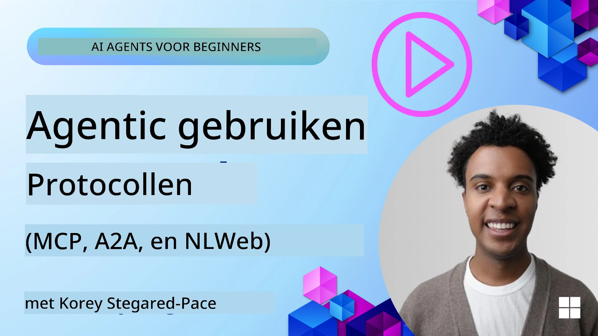
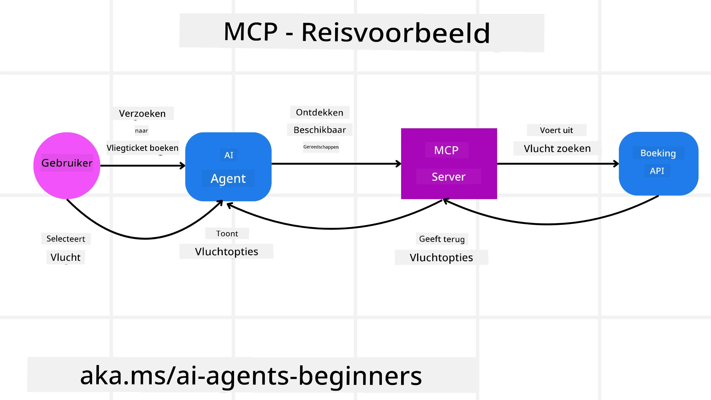
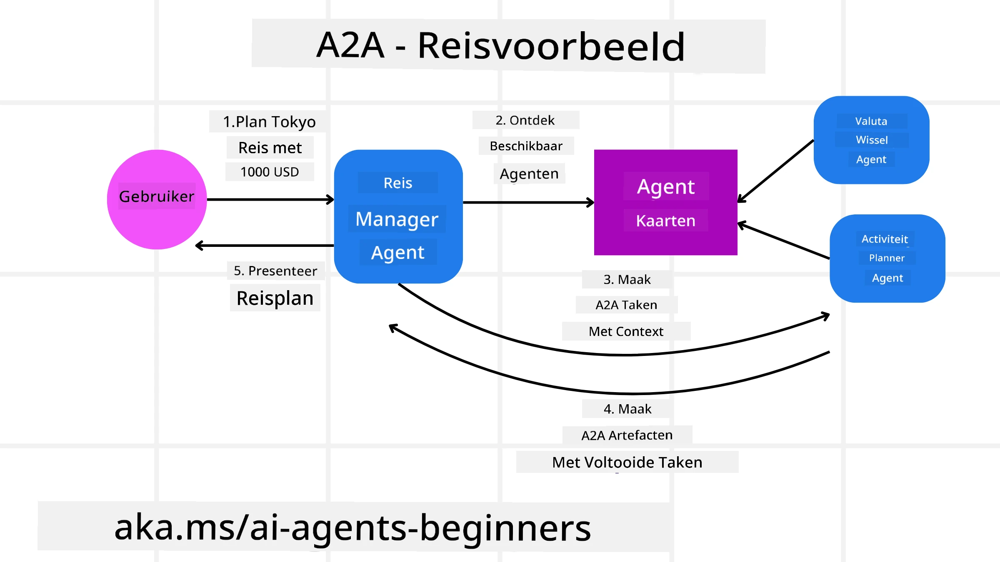
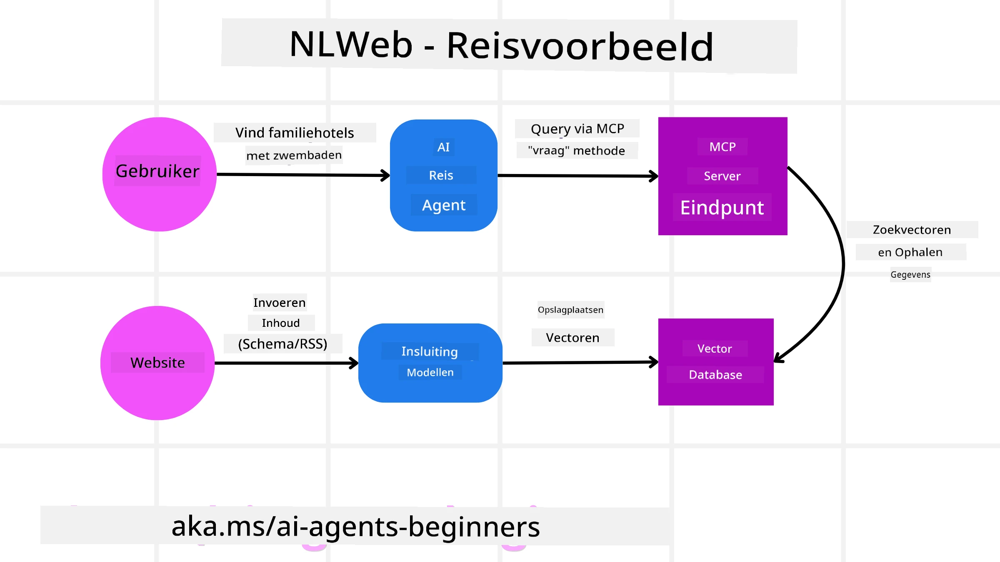

# Gebruik van Agentische Protocollen (MCP, A2A en NLWeb)

> _(Klik op de afbeelding hierboven om de video van deze les te bekijken)_

Naarmate het gebruik van AI-agenten groeit, neemt ook de behoefte toe aan protocollen die standaardisatie, beveiliging en open innovatie ondersteunen. In deze les behandelen we 3 protocollen die deze behoefte proberen te vervullen - Model Context Protocol (MCP), Agent to Agent (A2A) en Natural Language Web (NLWeb).

## Inleiding

In deze les behandelen we:

• Hoe **MCP** AI-agenten in staat stelt toegang te krijgen tot externe tools en gegevens om gebruikerstaken te voltooien.  
•  Hoe **A2A** communicatie en samenwerking tussen verschillende AI-agenten mogelijk maakt.  
• Hoe **NLWeb** natuurlijke-taalinterfaces naar elke website brengt, waardoor AI-agenten de inhoud kunnen ontdekken en ermee kunnen interacteren.

## Leerdoelen

• **Identificeer** het hoofddoel en de voordelen van MCP, A2A en NLWeb in de context van AI-agenten.  
• **Leg uit** hoe elk protocol communicatie en interactie tussen LLMs, tools en andere agenten faciliteert.  
• **Herken** de verschillende rollen die elk protocol speelt bij het bouwen van complexe agentische systemen.

## Model Context Protocol

Het **Model Context Protocol (MCP)** is een open standaard die een gestandaardiseerde manier biedt voor applicaties om context en tools aan LLMs te verstrekken. Dit maakt een "universele adapter" mogelijk voor verschillende gegevensbronnen en tools waar AI-agenten op een consistente manier verbinding mee kunnen maken.

Laten we kijken naar de componenten van MCP, de voordelen ten opzichte van direct API-gebruik, en een voorbeeld van hoe AI-agenten mogelijk een MCP-server zouden gebruiken.

### Kerncomponenten van MCP

MCP werkt op een **client-serverarchitectuur** en de kerncomponenten zijn:

• **Hosts** zijn LLM-applicaties (bijvoorbeeld een code-editor zoals VSCode) die de verbindingen met een MCP-server starten.  
• **Clients** zijn componenten binnen de hostapplicatie die één-op-één verbindingen met servers onderhouden.  
• **Servers** zijn lichtgewicht programma's die specifieke mogelijkheden aanbieden.

In het protocol zijn drie kernprimitieven opgenomen, die de mogelijkheden van een MCP-server vormen:

• **Tools**: Dit zijn afzonderlijke acties of functies die een AI-agent kan aanroepen om iets uit te voeren. Bijvoorbeeld, een weerservice zou een "get weather"-tool kunnen aanbieden, of een e-commerceserver een "purchase product"-tool. MCP-servers adverteren de naam, beschrijving en input/output-schema van elke tool in hun capabilities-lijst.

• **Resources**: Dit zijn alleen-lezen gegevensitems of documenten die een MCP-server kan leveren, en die clients op aanvraag kunnen ophalen. Voorbeelden zijn bestandsinhoud, database-records of logbestanden. Resources kunnen tekst zijn (zoals code of JSON) of binair (zoals afbeeldingen of PDF's).

• **Prompts**: Dit zijn vooraf gedefinieerde sjablonen die voorgestelde prompts bieden, waardoor complexere workflows mogelijk zijn.

### Voordelen van MCP

MCP biedt aanzienlijke voordelen voor AI-agenten:

• **Dynamic Tool Discovery**: Agenten kunnen dynamisch een lijst van beschikbare tools van een server ontvangen, samen met beschrijvingen van wat ze doen. Dit staat in contrast met traditionele API's, die vaak statische codering voor integraties vereisen, wat betekent dat elke API-wijziging code-updates noodzakelijk maakt. MCP biedt een "integreer-eens"-benadering, wat leidt tot grotere aanpasbaarheid.

• **Interoperability Across LLMs**: MCP werkt met verschillende LLMs, wat flexibiliteit biedt om kernmodellen te wisselen om betere prestaties te evalueren.

• **Standardized Security**: MCP bevat een gestandaardiseerde authenticatiemethode, wat de schaalbaarheid verbetert bij het toevoegen van toegang tot extra MCP-servers. Dit is eenvoudiger dan het beheren van verschillende sleutels en authenticatietypen voor diverse traditionele API's.

### MCP Voorbeeld

Stel je voor dat een gebruiker een vlucht wil boeken met een AI-assistent die MCP gebruikt.

1. **Verbinding**: De AI-assistent (de MCP-client) maakt verbinding met een MCP-server die door een luchtvaartmaatschappij wordt aangeboden.

2. **Tool Discovery**: De client vraagt aan de MCP-server van de luchtvaartmaatschappij: "Welke tools heeft u beschikbaar?" De server reageert met tools zoals "search flights" en "book flights".

3. **Tool Invocation**: U vraagt vervolgens de AI-assistent: "Zoek alstublieft een vlucht van Portland naar Honolulu." De AI-assistent, met behulp van zijn LLM, identificeert dat hij de "search flights"-tool moet aanroepen en geeft de relevante parameters (vertrekplaats, bestemming) door aan de MCP-server.

4. **Execution and Response**: De MCP-server, optredend als wrapper, doet de daadwerkelijke oproep naar de interne boekings-API van de luchtvaartmaatschappij. Daarna ontvangt hij de vluchtinformatie (bijv. JSON-gegevens) en stuurt deze terug naar de AI-assistent.

5. **Further Interaction**: De AI-assistent presenteert de vluchtopties. Zodra u een vlucht selecteert, kan de assistent de "book flight"-tool op dezelfde MCP-server aanroepen en de boeking voltooien.

## Agent-to-Agent Protocol (A2A)

Terwijl MCP zich richt op het verbinden van LLMs met tools, gaat het **Agent-to-Agent (A2A) protocol** een stap verder door communicatie en samenwerking tussen verschillende AI-agenten mogelijk te maken.  A2A verbindt AI-agenten over verschillende organisaties, omgevingen en technologiestacks om een gedeelde taak te voltooien.

We bekijken de componenten en voordelen van A2A, samen met een voorbeeld van hoe het kan worden toegepast in onze reisapplicatie.

### Kerncomponenten van A2A

A2A richt zich op het mogelijk maken van communicatie tussen agenten en het laten samenwerken om een deeltaak van een gebruiker te voltooien. Elke component van het protocol draagt hieraan bij:

#### Agent Card

- De naam van de agent .  
- Een **beschrijving van de algemene taken** die het uitvoert.  
- Een **lijst van specifieke vaardigheden** met beschrijvingen om andere agenten (of zelfs menselijke gebruikers) te helpen begrijpen wanneer en waarom ze die agent zouden willen aanroepen.  
- De **huidige Endpoint-URL** van de agent  
- De **versie** en **mogelijkheden** van de agent zoals streaming-antwoorden en pushmeldingen.

#### Agent Executor

De Agent Executor is verantwoordelijk voor het **doorgeven van de context van de gebruikerschat aan de externe agent**, de externe agent heeft dit nodig om de taak die voltooid moet worden te begrijpen. In een A2A-server gebruikt een agent zijn eigen Large Language Model (LLM) om binnenkomende verzoeken te parseren en taken uit te voeren met zijn eigen interne tools.

#### Artifact

Zodra een externe agent de gevraagde taak heeft afgerond, wordt het resultaat als een artifact aangemaakt.  Een artifact **bevat het resultaat van het werk van de agent**, een **beschrijving van wat is voltooid**, en de **tekstcontext** die via het protocol wordt verzonden. Nadat het artifact is verzonden, wordt de verbinding met de externe agent gesloten totdat deze weer nodig is.

#### Event Queue

Deze component wordt gebruikt voor **het afhandelen van updates en het doorgeven van berichten**. Het is met name belangrijk in productieomgevingen voor agentische systemen om te voorkomen dat de verbinding tussen agenten wordt gesloten voordat een taak is voltooid, vooral wanneer taken langere tijd kunnen duren.

### Voordelen van A2A

• **Enhanced Collaboration**: Het maakt het mogelijk dat agenten van verschillende leveranciers en platforms met elkaar interacteren, context delen en samenwerken, wat naadloze automatisering mogelijk maakt over traditioneel losgekoppelde systemen heen.

• **Model Selection Flexibility**: Elke A2A-agent kan beslissen welke LLM hij gebruikt om zijn verzoeken te verwerken, waardoor geoptimaliseerde of fijn-afgestelde modellen per agent mogelijk zijn, in tegenstelling tot een enkele LLM-verbinding in sommige MCP-scenario's.

• **Built-in Authentication**: Authenticatie is direct in het A2A-protocol geïntegreerd, wat een robuust beveiligingskader voor agentinteracties biedt.

### A2A Voorbeeld

Laten we ons reisboekingsscenario uitbreiden, maar deze keer met A2A.

1. **Gebruikersverzoek aan multi-agent**: Een gebruiker communiceert met een "Travel Agent" A2A-client/agent, bijvoorbeeld door te zeggen: "Boek alsjeblieft een volledige reis naar Honolulu voor volgende week, inclusief vluchten, een hotel en een huurauto".

2. **Orkestratie door Travel Agent**: De Travel Agent ontvangt dit complexe verzoek. Hij gebruikt zijn LLM om over de taak na te denken en bepaalt dat hij met andere gespecialiseerde agenten moet interacteren.

3. **Inter-agentcommunicatie**: De Travel Agent gebruikt vervolgens het A2A-protocol om verbinding te maken met downstream-agenten, zoals een "Airline Agent", een "Hotel Agent" en een "Car Rental Agent" die door verschillende bedrijven zijn gemaakt.

4. **Gedelegeerde taakuitvoering**: De Travel Agent stuurt specifieke taken naar deze gespecialiseerde agenten (bijv. "Zoek vluchten naar Honolulu", "Boek een hotel", "Huur een auto"). Elk van deze gespecialiseerde agenten, die hun eigen LLMs draaien en hun eigen tools gebruiken (die zelf MCP-servers kunnen zijn), voert hun specifieke deel van de boeking uit.

5. **Geconsolideerd antwoord**: Zodra alle downstream-agenten hun taken hebben voltooid, stelt de Travel Agent de resultaten samen (vluchtgegevens, hotelbevestiging, huurautoboeking) en stuurt een uitgebreid, chatstijl antwoord terug naar de gebruiker.

## Natural Language Web (NLWeb)

Websites zijn al lange tijd de primaire manier voor gebruikers om toegang te krijgen tot informatie en data op het internet.

Laten we kijken naar de verschillende componenten van NLWeb, de voordelen van NLWeb en een voorbeeld van hoe onze NLWeb werkt door naar onze reisapplicatie te kijken.

### Componenten van NLWeb

- **NLWeb Application (Core Service Code)**: Het systeem dat natuurlijke-taalvragen verwerkt. Het verbindt de verschillende delen van het platform om antwoorden te creëren. Je kunt het zien als de **motor die de natuurlijke-taalfunctionaliteit** van een website aandrijft.

- **NLWeb Protocol**: Dit is een **basisset regels voor natuurlijke-taalinteractie** met een website. Het stuurt antwoorden terug in JSON-formaat (vaak met Schema.org). Het doel is om een eenvoudige basis voor het "AI Web" te creëren, op dezelfde manier als HTML het mogelijk maakte om documenten online te delen.

- **MCP Server (Model Context Protocol Endpoint)**: Elke NLWeb-opzet fungeert ook als een **MCP-server**. Dit betekent dat het **tools (zoals een “ask”-methode) en data kan delen** met andere AI-systemen. In de praktijk maakt dit de inhoud en mogelijkheden van de website bruikbaar voor AI-agenten, waardoor de site onderdeel kan worden van het bredere “agent-ecosysteem”.

- **Embedding Models**: Deze modellen worden gebruikt om **website-inhoud om te zetten in numerieke representaties die vectors worden genoemd** (embeddings). Deze vectors vangen betekenis op een manier waarop computers kunnen vergelijken en zoeken. Ze worden opgeslagen in een speciale database, en gebruikers kunnen kiezen welk embedding-model ze willen gebruiken.

- **Vector Database (Retrieval Mechanism)**: Deze database **slaat de embeddings van de website-inhoud op**. Wanneer iemand een vraag stelt, controleert NLWeb de vectordatabase om snel de meest relevante informatie te vinden. Het geeft een snelle lijst met mogelijke antwoorden, gerangschikt op gelijkenis. NLWeb werkt met verschillende vectoropslagsystemen zoals Qdrant, Snowflake, Milvus, Azure AI Search en Elasticsearch.

### NLWeb aan de hand van een voorbeeld

Neem opnieuw onze reisboekingswebsite, maar deze keer aangedreven door NLWeb.

1. **Data Ingestion**: De bestaande productcatalogi van de reiswebsite (bijv. vluchtvermeldingen, hotelbeschrijvingen, tourpakketten) worden geformatteerd met Schema.org of geladen via RSS-feeds. De tools van NLWeb nemen deze gestructureerde gegevens op, maken embeddings en slaan ze op in een lokale of externe vectordatabase.

2. **Natural Language Query (Human)**: Een gebruiker bezoekt de website en typt in plaats van door menu's te navigeren in een chatinterface: "Vind een gezinsvriendelijk hotel in Honolulu met een zwembad voor volgende week".

3. **NLWeb Processing**: De NLWeb-toepassing ontvangt deze zoekvraag. Ze stuurt de query naar een LLM voor begrip en doorzoekt tegelijkertijd haar vectordatabase naar relevante hotelvermeldingen.

4. **Accurate Results**: De LLM helpt de zoekresultaten uit de database te interpreteren, identificeert de beste overeenkomsten op basis van de criteria "gezinsvriendelijk", "zwembad" en "Honolulu", en formatteert vervolgens een antwoord in natuurlijke taal. Cruciaal is dat het antwoord verwijst naar daadwerkelijke hotels uit de catalogus van de website, waardoor gefantaseerde informatie wordt vermeden.

5. **AI Agent Interaction**: Omdat NLWeb fungeert als een MCP-server, kan een externe AI-reisagent ook verbinding maken met de NLWeb-instantie van deze website. De AI-agent kan dan de `ask("Are there any vegan-friendly restaurants in the Honolulu area recommended by the hotel?")` MCP-methode gebruiken om rechtstreeks de website te bevragen. De NLWeb-instantie zou dit verwerken, gebruikmakend van haar database met restaurantinformatie (indien geladen), en een gestructureerd JSON-antwoord teruggeven.

### Nog meer vragen over MCP/A2A/NLWeb?

Sluit je aan bij de [Microsoft Foundry Discord](https://aka.ms/ai-agents/discord) om andere leerlingen te ontmoeten, deel te nemen aan inloopspreekuren en je vragen over AI-agenten beantwoord te krijgen.

## Bronnen

- [MCP voor beginners](https://aka.ms/mcp-for-beginners)  
- [MCP-documentatie](https://learn.microsoft.com/python/api/overview/azure/ai-projects-readme)
- [NLWeb-repo](https://github.com/nlweb-ai/NLWeb)
- [Microsoft Agent Framework](https://aka.ms/ai-agents-beginners/agent-framewrok)

---

<!-- CO-OP TRANSLATOR DISCLAIMER START -->
Disclaimer:
Dit document is vertaald met behulp van de AI-vertalingsdienst Co-op Translator (https://github.com/Azure/co-op-translator). Hoewel we naar nauwkeurigheid streven, moet u er rekening mee houden dat geautomatiseerde vertalingen fouten of onnauwkeurigheden kunnen bevatten. Het originele document in de oorspronkelijke taal dient als de gezaghebbende bron te worden beschouwd. Voor cruciale informatie wordt professionele menselijke vertaling aanbevolen. Wij zijn niet aansprakelijk voor eventuele misverstanden of verkeerde interpretaties die voortvloeien uit het gebruik van deze vertaling.
<!-- CO-OP TRANSLATOR DISCLAIMER END -->