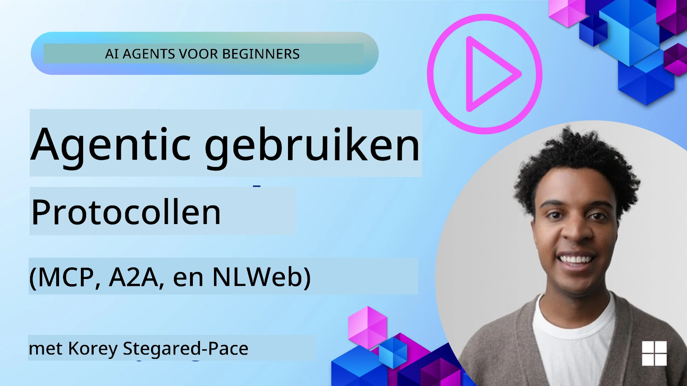
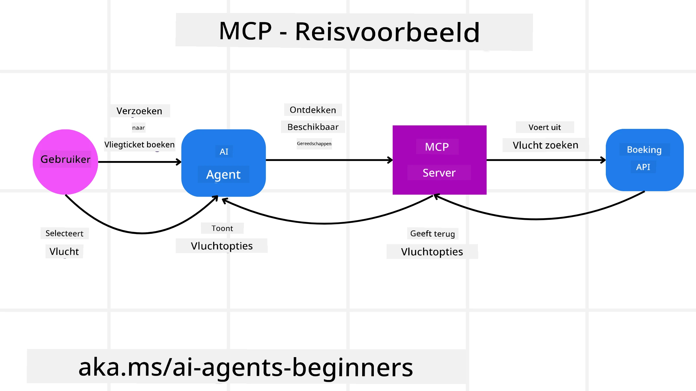
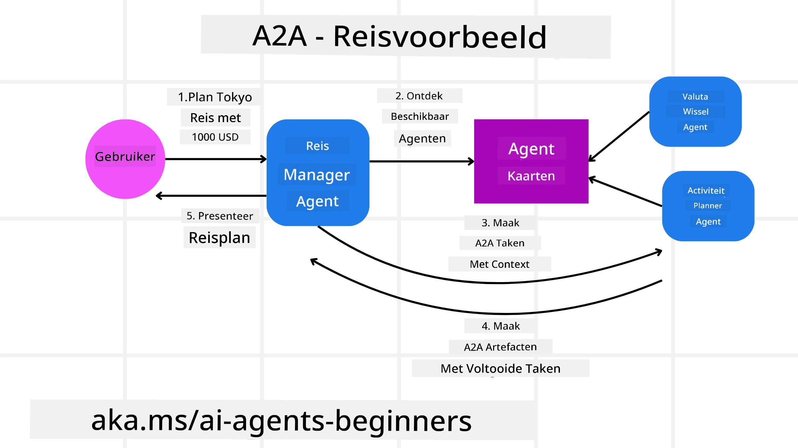
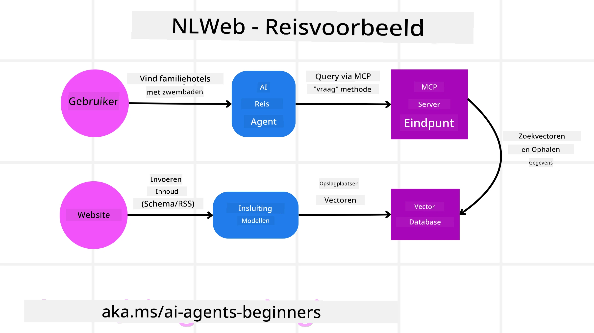

# Gebruik van Agentic Protocols (MCP, A2A en NLWeb)

> _(Klik op de afbeelding hierboven om de video van deze les te bekijken)_

Naarmate het gebruik van AI-agenten toeneemt, groeit ook de behoefte aan protocollen die standaardisatie, veiligheid en ondersteuning voor open innovatie garanderen. In deze les behandelen we 3 protocollen die aan deze behoefte willen voldoen - Model Context Protocol (MCP), Agent to Agent (A2A) en Natural Language Web (NLWeb).

## Inleiding

In deze les behandelen we:

• Hoe **MCP** AI-agenten toegang geeft tot externe tools en data om gebruikersopdrachten te voltooien.

• Hoe **A2A** communicatie en samenwerking tussen verschillende AI-agenten mogelijk maakt.

• Hoe **NLWeb** natuurlijke taalinterfaces naar elke website brengt waardoor AI-agenten de inhoud kunnen ontdekken en ermee kunnen communiceren.

## Leerdoelen

• **Identificeren** van het hoofddoel en de voordelen van MCP, A2A en NLWeb in de context van AI-agenten.

• **Uitleggen** hoe elk protocol communicatie en interactie tussen LLM's, tools en andere agenten faciliteert.

• **Herkennen** van de verschillende rollen die elk protocol speelt bij het bouwen van complexe agentische systemen.

## Model Context Protocol

Het **Model Context Protocol (MCP)** is een open standaard die een gestandaardiseerde manier biedt voor applicaties om context en tools aan LLM's te leveren. Dit maakt een "universele adapter" mogelijk voor verschillende databronnen en tools waarmee AI-agenten op een consistente manier kunnen verbinden.

Laten we de componenten van MCP bekijken, de voordelen ten opzichte van direct API-gebruik en een voorbeeld van hoe AI-agenten een MCP-server kunnen gebruiken.

### Kerncomponenten van MCP

MCP werkt op een **client-serverarchitectuur** en de kerncomponenten zijn:

• **Hosts** zijn LLM-applicaties (bijvoorbeeld een code-editor zoals VSCode) die de verbindingen met een MCP-server starten.

• **Clients** zijn componenten binnen de hostapplicatie die één-op-één verbindingen met servers onderhouden.

• **Servers** zijn lichtgewicht programma's die specifieke functionaliteiten blootstellen.

In het protocol zijn drie kernprimitieven opgenomen die de mogelijkheden van een MCP-server zijn:

• **Tools**: Dit zijn discrete acties of functies die een AI-agent kan aanroepen om een actie uit te voeren. Bijvoorbeeld, een weerservice kan een tool "get weather" aanbieden, of een e-commerce server een "purchase product" tool. MCP-servers adverteren de naam, beschrijving en input/output-schema van elke tool in hun overzicht van mogelijkheden.

• **Resources**: Dit zijn alleen-lezen data-items of documenten die een MCP-server kan leveren en die clients op aanvraag kunnen ophalen. Voorbeelden zijn bestandsinhoud, database-records of logbestanden. Resources kunnen tekst zijn (zoals code of JSON) of binair (zoals afbeeldingen of PDF's).

• **Prompts**: Dit zijn vooraf gedefinieerde sjablonen die voorgestelde prompts bieden, wat complexere workflows mogelijk maakt.

### Voordelen van MCP

MCP biedt aanzienlijke voordelen voor AI-agenten:

• **Dynamische Tooldetectie**: Agenten kunnen dynamisch een lijst met beschikbare tools ontvangen van een server, inclusief beschrijvingen van wat ze doen. Dit contrasteert met traditionele API's, die vaak statische codering voor integraties vereisen, wat betekent dat elke API-wijziging code-updates noodzakelijk maakt. MCP biedt een "eenmaal integreren" benadering, wat meer aanpasbaarheid oplevert.

• **Interopereerbaarheid tussen LLM's**: MCP werkt over verschillende LLM's heen, wat flexibiliteit biedt om kernmodellen te wisselen en betere prestaties te evalueren.

• **Gestandaardiseerde beveiliging**: MCP bevat een standaard authenticatiemethode, wat de schaalbaarheid verbetert bij het toevoegen van toegang tot extra MCP-servers. Dit is eenvoudiger dan het beheren van verschillende sleutels en authenticatietypes voor diverse traditionele API's.

### MCP Voorbeeld

Stel je voor dat een gebruiker een vlucht wil boeken met een AI-assistent die door MCP wordt aangedreven.

1. **Verbinding**: De AI-assistent (de MCP-client) maakt verbinding met een MCP-server geleverd door een luchtvaartmaatschappij.

2. **Tooldetectie**: De client vraagt aan de MCP-server van de luchtvaartmaatschappij: "Welke tools zijn er beschikbaar?" De server antwoordt met tools zoals "search flights" en "book flights".

3. **Toolaanroep**: Vervolgens vraag je de AI-assistent: "Zoek alsjeblieft een vlucht van Portland naar Honolulu." De AI-assistent gebruikt zijn LLM om te bepalen dat hij de "search flights" tool moet aanroepen en geeft de relevante parameters (vertrekpunt, bestemming) door aan de MCP-server.

4. **Uitvoering en reactie**: De MCP-server, die fungeert als omhulselsysteem, maakt de daadwerkelijke oproep naar de interne boekings-API van de luchtvaartmaatschappij. Daarna ontvangt hij de vluchtinformatie (bijvoorbeeld JSON-data) en stuurt dit terug naar de AI-assistent.

5. **Verdere interactie**: De AI-assistent toont de vluchtopties. Nadat je een vlucht hebt gekozen, roept de assistent mogelijk de "book flight" tool op dezelfde MCP-server aan om de boeking te voltooien.

## Agent-to-Agent Protocol (A2A)

Terwijl MCP zich richt op het verbinden van LLM's met tools, gaat het **Agent-to-Agent (A2A) protocol** een stap verder door communicatie en samenwerking tussen verschillende AI-agenten mogelijk te maken. A2A verbindt AI-agenten over verschillende organisaties, omgevingen en tech stacks om een gezamenlijke taak te voltooien.

We bekijken de componenten en voordelen van A2A, evenals een voorbeeld van hoe het toegepast kan worden in onze reisapplicatie.

### Kerncomponenten van A2A

A2A richt zich op het mogelijk maken van communicatie tussen agenten en het samenwerken om een ondertaak van de gebruiker te voltooien. Elke component van het protocol draagt hieraan bij:

#### Agentkaart

Net zoals een MCP-server een lijst met tools deelt, bevat een Agentkaart:
- De naam van de agent.
- Een **beschrijving van de algemene taken** die de agent uitvoert.
- Een **lijst met specifieke vaardigheden** met beschrijvingen om andere agenten (of zelfs menselijke gebruikers) te helpen begrijpen wanneer en waarom ze die agent zouden willen aanroepen.
- De **huidige Endpoint-URL** van de agent.
- De **versie** en **mogelijkheden** van de agent zoals streaming responses en pushmeldingen.

#### Agent Executor

De Agent Executor is verantwoordelijk voor het **doorgeven van de context van het gebruikersgesprek aan de externe agent**; de externe agent heeft dit nodig om de taak te begrijpen die voltooid moet worden. In een A2A-server gebruikt een agent zijn eigen Large Language Model (LLM) om binnenkomende verzoeken te parseren en taken uit te voeren met zijn eigen interne tools.

#### Artefact

Nadat een externe agent de gevraagde taak heeft voltooid, wordt zijn werkproduct gecreëerd als een artefact. Een artefact **bevat het resultaat van het werk van de agent**, een **beschrijving van wat er is afgerond**, en de **tekstcontext** die via het protocol is verzonden. Nadat het artefact is verstuurd, wordt de verbinding met de externe agent gesloten totdat deze weer nodig is.

#### Event Queue

Deze component wordt gebruikt voor **het afhandelen van updates en het doorgeven van berichten**. Het is vooral belangrijk in productie voor agentische systemen om te voorkomen dat de verbinding tussen agenten wordt verbroken voordat een taak is voltooid, vooral wanneer het voltooien van taken langer kan duren.

### Voordelen van A2A

• **Verbeterde samenwerking**: Het stelt agenten van verschillende leveranciers en platforms in staat te communiceren, context te delen en samen te werken, wat naadloze automatisering over traditioneel gescheiden systemen heen faciliteert.

• **Flexibiliteit in modelselectie**: Elke A2A-agent kan zelf bepalen welke LLM hij gebruikt om zijn verzoeken te bedienen, wat optimalisatie of fijn afgestelde modellen per agent mogelijk maakt, in tegenstelling tot een enkele LLM-verbinding in sommige MCP-scenario's.

• **Ingebouwde authenticatie**: Authenticatie is direct geïntegreerd in het A2A-protocol, wat een robuust beveiligingskader biedt voor agentinteracties.

### A2A Voorbeeld

Laten we ons reisboekingsscenario uitbreiden, maar dan met het gebruik van A2A.

1. **Gebruikersverzoek aan Multi-Agent**: Een gebruiker communiceert met een "Travel Agent" A2A client/agent, bijvoorbeeld met de zin: "Boek alsjeblieft een complete reis naar Honolulu voor volgende week, inclusief vluchten, hotel en huurauto".

2. **Orkestratie door Travel Agent**: De Travel Agent ontvangt dit complexe verzoek. Hij gebruikt zijn LLM om over de taak na te denken en te bepalen dat hij met andere gespecialiseerde agenten moet samenwerken.

3. **Inter-agent Communicatie**: De Travel Agent gebruikt het A2A-protocol om verbinding te maken met onderliggende agenten, zoals een "Airline Agent," een "Hotel Agent," en een "Car Rental Agent" die door verschillende bedrijven zijn gemaakt.

4. **Gedecentraliseerde Taakuitvoering**: De Travel Agent stuurt specifieke taken naar deze gespecialiseerde agenten (bijvoorbeeld "Vind vluchten naar Honolulu," "Boek een hotel," "Huur een auto"). Elk van deze gespecialiseerde agenten, die hun eigen LLM's draaien en gebruikmaken van hun eigen tools (die mogelijk zelf MCP-servers zijn), voert zijn specifieke deel van de boeking uit.

5. **Samengevoegde Respons**: Zodra alle onderliggende agenten hun taken hebben voltooid, bundelt de Travel Agent de resultaten (vluchtgegevens, hotelbevestiging, huurautoboeking) en stuurt een uitgebreide, chatstijl reactie terug naar de gebruiker.

## Natural Language Web (NLWeb)

Websites zijn al lang de primaire manier voor gebruikers om toegang te krijgen tot informatie en data op het internet.

Laten we de verschillende componenten van NLWeb bekijken, de voordelen van NLWeb en een voorbeeld hoe onze NLWeb werkt aan de hand van onze reisapplicatie.

### Componenten van NLWeb

- **NLWeb Applicatie (Kernservicecode)**: Het systeem dat natuurlijke taal vragen verwerkt. Het verbindt de verschillende onderdelen van het platform om antwoorden te creëren. Je kunt het zien als de **motor die de natuurlijke taal functies van een website aandrijft**.

- **NLWeb Protocol**: Dit is een **basisset regels voor natuurlijke taalinteractie** met een website. Het stuurt reacties terug in JSON-formaat (vaak gebruikmakend van Schema.org). Het doel is om een eenvoudige basis te leggen voor het “AI Web,” op dezelfde manier waarop HTML documenten online deelbaar maakte.

- **MCP Server (Model Context Protocol Endpoint)**: Elke NLWeb-configuratie werkt ook als een **MCP-server**. Dit betekent dat het **tools (zoals een "ask" methode) en data kan delen** met andere AI-systemen. In de praktijk maakt dit de inhoud en mogelijkheden van de website bruikbaar voor AI-agenten, waardoor de site een deel wordt van het bredere “agent ecosysteem.”

- **Embedding Modellen**: Deze modellen worden gebruikt om **website-inhoud om te zetten in numerieke representaties genaamd vectors** (embeddings). Deze vectors vangen betekenis op een manier die computers kunnen vergelijken en doorzoeken. Ze worden opgeslagen in een speciale database, en gebruikers kunnen kiezen welk embeddingmodel ze willen gebruiken.

- **Vector Database (Ophaalmechanisme)**: Deze database **slaat de embeddings van de website-inhoud op**. Wanneer iemand een vraag stelt, zoekt NLWeb in de vectordatabase om snel de meest relevante informatie te vinden. Het geeft een snelle lijst met mogelijke antwoorden, gerangschikt op overeenkomst. NLWeb werkt met verschillende vectoropslagsystemen zoals Qdrant, Snowflake, Milvus, Azure AI Search en Elasticsearch.

### NLWeb Aan De Hand Van Een Voorbeeld

Kijk nog eens naar onze reisboekingswebsite, maar dan aangedreven door NLWeb.

1. **Data-inname**: De bestaande productcatalogi van de reiswebsite (zoals vluchtlijsten, hotelbeschrijvingen, toerpakketten) worden geformatteerd met Schema.org of geladen via RSS-feeds. De tools van NLWeb nemen deze gestructureerde data op, maken embeddings aan en slaan ze op in een lokale of externe vectordatabase.

2. **Natuurlijke Taal Vraag (Mens)**: Een gebruiker bezoekt de website en typt in een chatinterface: "Vind een gezinsvriendelijk hotel in Honolulu met een zwembad voor volgende week".

3. **NLWeb Verwerking**: De NLWeb-applicatie ontvangt deze vraag. Het stuurt de vraag naar een LLM voor begrip en doorzoekt tegelijkertijd de vectordatabase naar relevante hotelvermeldingen.

4. **Nauwkeurige Resultaten**: De LLM helpt bij het interpreteren van de zoekresultaten uit de database, identificeert de beste overeenkomsten op basis van "gezinsvriendelijk", "zwembad" en "Honolulu" criteria, en formatteert vervolgens een natuurlijke taalantwoord. Dit antwoord verwijst cruciaal naar daadwerkelijke hotels uit de catalogus van de website en voorkomt verzonnen informatie.

5. **AI-Agent Interactie**: Omdat NLWeb fungeert als een MCP-server, kan een externe AI-reisagent ook verbinding maken met deze NLWeb-instantie van de website. De AI-agent kan dan de `ask` MCP-methode gebruiken om rechtstreeks aan de website te vragen: `ask("Zijn er veganistische restaurants in de buurt van Honolulu aanbevolen door het hotel?")`. De NLWeb-instantie verwerkt dit, maakt gebruik van de database met restaurantinformatie (indien geladen), en retourneert een gestructureerd JSON-antwoord.

### Meer vragen over MCP/A2A/NLWeb?

Sluit je aan bij de [Microsoft Foundry Discord](https://discord.com/invite/ATgtXmAS5D) om andere deelnemers te ontmoeten, deel te nemen aan kantooruren en je vragen over AI-agenten beantwoord te krijgen.

## Bronnen

- [MCP voor Beginners](https://aka.ms/mcp-for-beginners)  
- [MCP Documentatie](https://learn.microsoft.com/python/api/overview/azure/ai-projects-readme)
- [NLWeb Repo](https://github.com/nlweb-ai/NLWeb)
- [Microsoft Agent Framework](https://learn.microsoft.com/en-us/agent-framework/overview/?wt.mc_id=youtube_26688_organicsocial_reactor&pivots=programming-language-python)

## Vorige Les

[AI Agents in Production](../10-ai-agents-production/README.md)

## Volgende Les

[Context Engineering for AI Agents](../12-context-engineering/README.md)

---

<!-- CO-OP TRANSLATOR DISCLAIMER START -->
**Disclaimer**:
Dit document is vertaald met behulp van de AI vertaaldienst [Co-op Translator](https://github.com/Azure/co-op-translator). Hoewel we streven naar nauwkeurigheid, dient u er rekening mee te houden dat geautomatiseerde vertalingen fouten of onnauwkeurigheden kunnen bevatten. Het originele document in de oorspronkelijke taal moet worden beschouwd als de gezaghebbende bron. Voor kritieke informatie wordt professionele menselijke vertaling aanbevolen. Wij zijn niet aansprakelijk voor eventuele misverstanden of verkeerde interpretaties die voortvloeien uit het gebruik van deze vertaling.
<!-- CO-OP TRANSLATOR DISCLAIMER END -->