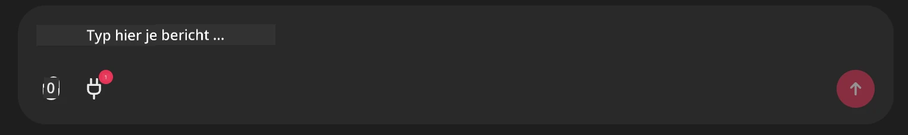

# Github MCP Server Voorbeeld

## Beschrijving

Dit was een demo gemaakt voor de AI Agents Hackathon georganiseerd via de Microsoft Reactor.

De tools worden gebruikt om hackathonprojecten aan te bevelen op basis van de Github-repos van een gebruiker.
Dit gebeurt door:

1. **Github Agent** - Gebruikt de Github MCP Server om repos en informatie over die repos op te halen.
2. **Hackathon Agent** - Neemt de gegevens van de Github Agent en bedenkt creatieve hackathonprojectideeën op basis van de projecten, de door de gebruiker gebruikte programmeertalen en de projecttracks voor de AI Agents hackathon.
3. **Events Agent** - Gebaseerd op de suggestie van de Hackathon Agent zal de Events Agent relevante evenementen uit de AI Agent Hackathon-serie aanbevelen.
## Code uitvoeren 

### Omgevingsvariabelen

Deze demo gebruikt Microsoft Agent Framework, Azure OpenAI Service, de Github MCP Server en Azure AI Search.

Zorg ervoor dat je de juiste omgevingsvariabelen hebt ingesteld om deze tools te gebruiken:

```python
AZURE_AI_PROJECT_ENDPOINT=""
AZURE_AI_MODEL_DEPLOYMENT_NAME=""
AZURE_SEARCH_SERVICE_ENDPOINT=""
AZURE_SEARCH_API_KEY=""
``` 

## De Chainlit-server uitvoeren

Om verbinding te maken met de MCP-server gebruikt deze demo Chainlit als chatinterface. 

Om de server te starten, gebruik het volgende commando in je terminal:

```bash
chainlit run app.py -w
```

Hierdoor zou je Chainlit-server moeten starten op `localhost:8000` en ook je Azure AI Search-index vullen met de inhoud van `event-descriptions.md`. 

## Verbinden met de MCP-server

Om verbinding te maken met de Github MCP Server, selecteer het "plug"-pictogram onder het chatvak "Typ hier je bericht..":



Daar kun je vervolgens op "Verbind een MCP" klikken om het commando toe te voegen om verbinding te maken met de Github MCP Server:

```bash
npx -y @modelcontextprotocol/server-github --env GITHUB_PERSONAL_ACCESS_TOKEN=[YOUR PERSONAL ACCESS TOKEN]
```

Vervang "[YOUR PERSONAL ACCESS TOKEN]" door je daadwerkelijke Personal Access Token. 

Na het verbinden zou je een (1) naast het plug-pictogram moeten zien ter bevestiging dat het verbonden is. Zo niet, probeer dan de chainlit server opnieuw te starten met `chainlit run app.py -w`.

## De demo gebruiken 

Om de agent-workflow te starten voor het aanbevelen van hackathonprojecten, kun je een bericht typen zoals: 

"Beveel hackathonprojecten aan voor de Github-gebruiker koreyspace"

De Router Agent zal je verzoek analyseren en bepalen welke combinatie van agents (GitHub, Hackathon, en Events) het meest geschikt is om je vraag te behandelen. De agents werken samen om uitgebreide aanbevelingen te bieden op basis van GitHub-repositoryanalyse, projectideeën en relevante tech-evenementen.

---

<!-- CO-OP TRANSLATOR DISCLAIMER START -->
Vrijwaring:
Dit document is vertaald met behulp van de AI-vertalingsdienst [Co-op Translator](https://github.com/Azure/co-op-translator). Hoewel we streven naar nauwkeurigheid, dient u er rekening mee te houden dat automatische vertalingen fouten of onjuistheden kunnen bevatten. Het oorspronkelijke document in de oorspronkelijke taal dient als gezaghebbende bron te worden beschouwd. Voor cruciale informatie wordt professionele menselijke vertaling aanbevolen. Wij zijn niet aansprakelijk voor misverstanden of verkeerde interpretaties die voortvloeien uit het gebruik van deze vertaling.
<!-- CO-OP TRANSLATOR DISCLAIMER END -->