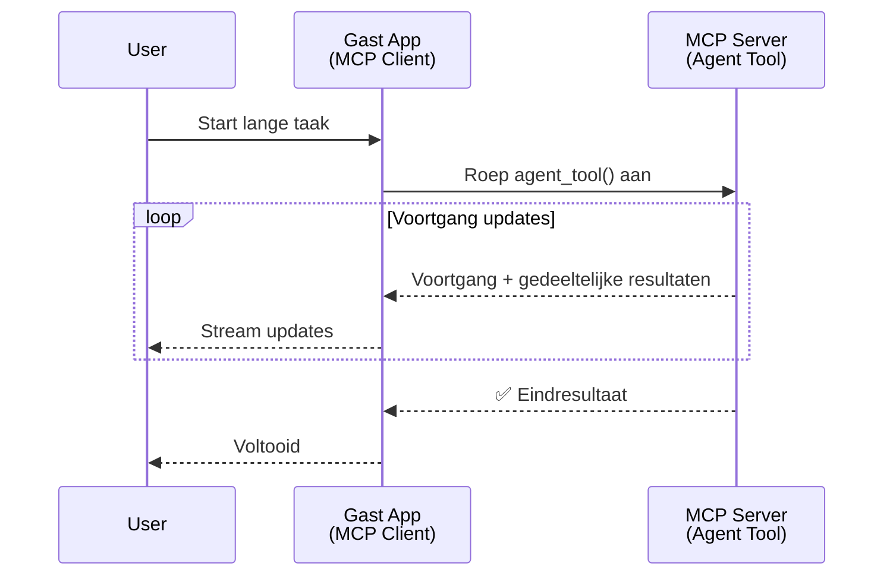
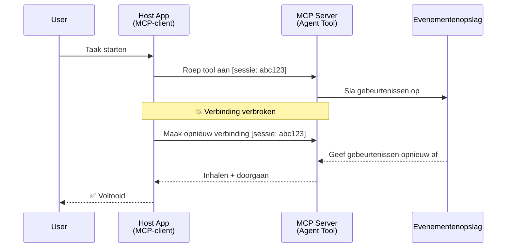
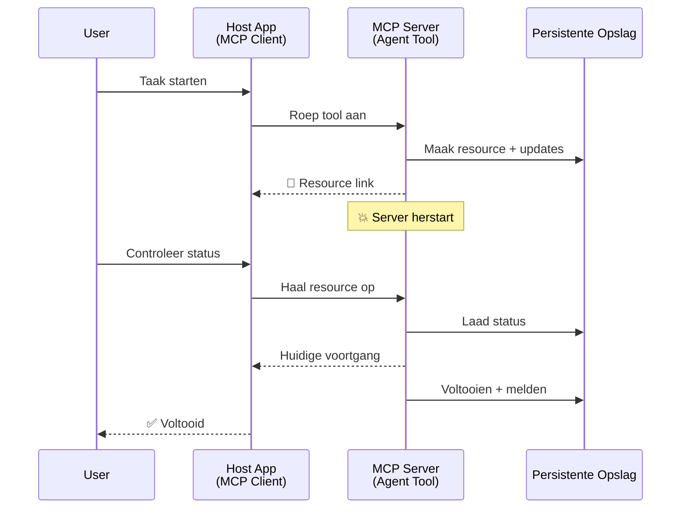
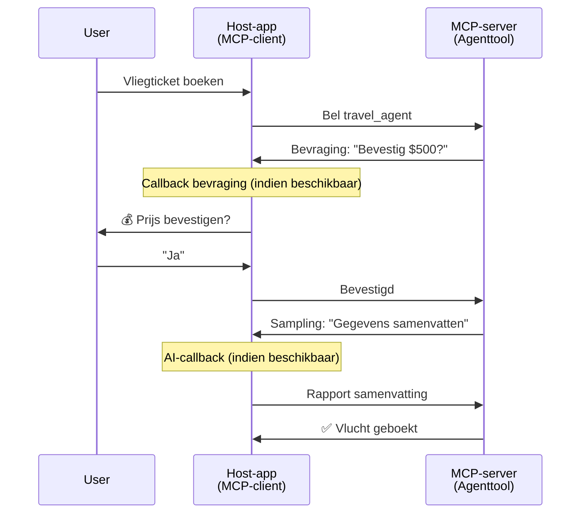
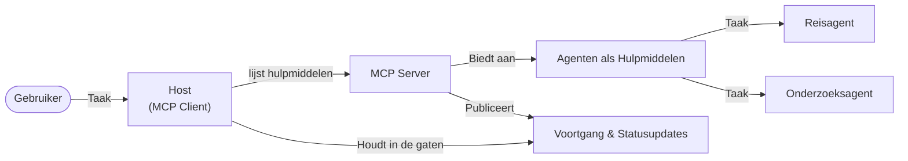

# Agent-naar-Agent Communicatiesystemen Bouwen met MCP

> TL;DR - Kun je Agent2Agent-communicatie op MCP bouwen? Ja!

MCP is aanzienlijk geëvolueerd voorbij zijn oorspronkelijke doel van "context bieden aan LLM's". Met recente verbeteringen waaronder [hersteldbare streams](https://modelcontextprotocol.io/docs/concepts/transports#resumability-and-redelivery), [elicitation](https://modelcontextprotocol.io/specification/2025-06-18/client/elicitation), [sampling](https://modelcontextprotocol.io/specification/2025-06-18/client/sampling), en notificaties ([voortgang](https://modelcontextprotocol.io/specification/2025-06-18/basic/utilities/progress) en [middelen](https://modelcontextprotocol.io/specification/2025-06-18/schema#resourceupdatednotification)), biedt MCP nu een robuuste basis voor het bouwen van complexe agent-naar-agent communicatiesystemen.

## De Agent/Gereedschap Misvatting

Naarmate meer ontwikkelaars tools met agent-gedrag onderzoeken (lange looptijden, mogelijk extra input halverwege nodig, etc.), bestaat een veelvoorkomende misvatting dat MCP ongeschikt is omdat vroege voorbeelden van zijn tools primitief gericht waren op eenvoudige request-response patronen.

Deze perceptie is achterhaald. De MCP-specificatie is de afgelopen maanden aanzienlijk verbeterd met mogelijkheden die de kloof dichten voor het bouwen van langlopende agent-gedrag:

- **Streaming & Gedeeltelijke Resultaten**: Real-time voortgangsupdates tijdens uitvoering
- **Herstelbaarheid**: Clients kunnen opnieuw verbinden en doorgaan na een onderbreking
- **Duurzaamheid**: Resultaten overleven serverherstarts (bijv. via resource links)
- **Multi-turn**: Interactieve input halverwege uitvoering via elicitation en sampling

Deze functies kunnen worden gecombineerd om complexe agent- en multi-agent applicaties mogelijk te maken, allemaal geïmplementeerd op het MCP-protocol.

Voor de duidelijkheid noemen we een agent een "tool" die beschikbaar is op een MCP-server. Dit impliceert het bestaan van een hostapplicatie die een MCP-client implementeert die een sessie met de MCP-server tot stand brengt en de agent kan aanroepen.

## Wat Maakt een MCP Tool "Agentisch"?

Voordat we in de implementatie duiken, laten we vaststellen welke infrastructuurmogelijkheden nodig zijn om langlopende agenten te ondersteunen.

> We definiëren een agent als een entiteit die autonoom kan functioneren over langere periodes, in staat om complexe taken aan te pakken die meerdere interacties of aanpassingen vereisen op basis van realtime feedback.

### 1. Streaming & Gedeeltelijke Resultaten

Traditionele request-response patronen werken niet voor langlopende taken. Agenten moeten bieden:

- Real-time voortgangsupdates
- Tussentijdse resultaten

**MCP-ondersteuning**: Resource update notificaties maken streaming van gedeeltelijke resultaten mogelijk, hoewel dit een zorgvuldige opzet vereist om conflicten met het 1:1 request/response-model van JSON-RPC te voorkomen.

| Kenmerk                   | Gebruikssituatie                                                                                                                                                               | MCP-ondersteuning                                                                           |
| ------------------------- | ------------------------------------------------------------------------------------------------------------------------------------------------------------------------------ | ------------------------------------------------------------------------------------------- |
| Real-time Voortgangsupdates | Een gebruiker vraagt een codebase migratietaak aan. De agent streamt voortgang: "10% - Afhankelijkheden analyseren... 25% - Typescript-bestanden converteren... 50% - Imports bijwerken..." | ✅ Voortgangsnotificaties                                                                   |
| Gedeeltelijke Resultaten   | "Genereer een boek" taak streamt gedeeltelijke resultaten, bv. 1) Verhaallijn overzicht, 2) Hoofdstukkenlijst, 3) Elk hoofdstuk bij voltooiing. Host kan op elk moment inspecteren, annuleren, of wijzigen. | ✅ Notificaties kunnen worden "uitgebreid" om gedeeltelijke resultaten op te nemen, zie voorstellen in PR 383, 776 |

<div align="center" style="font-style: italic; font-size: 0.95em; margin-bottom: 0.5em;">
<strong>Figuur 1:</strong> Dit diagram illustreert hoe een MCP-agent realtime voortgangsupdates en gedeeltelijke resultaten naar de hostapplicatie streamt tijdens een langlopende taak, waardoor de gebruiker de uitvoering realtime kan volgen.
</div>



### 2. Herstelbaarheid

Agenten moeten netwerkinstallaties gracieus afhandelen:

- Opnieuw verbinden na (client) disconnectie
- Doorgaan vanaf waar ze zijn gestopt (herlevering van berichten)

**MCP-ondersteuning**: De MCP StreamableHTTP transport ondersteunt momenteel sessieherstel en berichtherlevering met sessie-ID's en laatste event-ID's. Belangrijk is dat de server een EventStore implementeert die event-replays bij client-herverbinding mogelijk maakt.
Let op: er is een communityvoorstel (PR #975) dat transport-agnostische hersteldbare streams onderzoekt.

| Kenmerk       | Gebruikssituatie                                                                                                                                      | MCP-ondersteuning                                                         |
| ------------- | ----------------------------------------------------------------------------------------------------------------------------------------------------- | ------------------------------------------------------------------------- |
| Herstelbaarheid | Client wordt verbroken tijdens langlopende taak. Bij herverbinding wordt de sessie hervat met herhaalde gemiste events, naadloos voortgaand vanaf waar het stopte. | ✅ StreamableHTTP transport met sessie-ID's, event replay, en EventStore |

<div align="center" style="font-style: italic; font-size: 0.95em; margin-bottom: 0.5em;">
<strong>Figuur 2:</strong> Dit diagram laat zien hoe MCP's StreamableHTTP-transport en event store naadloos sessieherstel mogelijk maken: als de client wordt verbroken, kan deze opnieuw verbinden en gemiste evenementen afspelen, en de taak zonder verlies van voortgang voortzetten.
</div>



### 3. Duurzaamheid

Langlopende agenten hebben een persistent staat nodig:

- Resultaten overleven serverherstarts
- Status kan buiten bandbreedte worden opgevraagd
- Voortgangsbewaking over sessies heen

**MCP-ondersteuning**: MCP ondersteunt nu een Resource link return type voor tool-aanroepen. Een gangbaar patroon is een tool ontwerpen die een resource aanmaakt en direct een resource link retourneert. De tool kan de taak op de achtergrond verder uitvoeren en de resource bijwerken. De client kan deze status opvragen door de resource te poll'en voor gedeeltelijke of volledige resultaten (afhankelijk van welke resource-updates de server levert) of zich abonneren op de resource voor update notificaties.

Een beperking is dat het poll'en van resources of abonneren op updates middelen kan verbruiken met consequenties op schaalniveau. Er is een open communityvoorstel (inclusief #992) dat de mogelijkheid onderzoekt voor webhooks of triggers die de server kan aanroepen om de client/hostapplicatie van updates te informeren.

| Kenmerk   | Gebruikssituatie                                                                                                                                                  | MCP-ondersteuning                                                       |
| --------- | ---------------------------------------------------------------------------------------------------------------------------------------------------------------- | --------------------------------------------------------------------- |
| Duurzaamheid | Server crasht tijdens data-migratietaak. Resultaten en voortgang overleven herstart, client kan status checken en doorgaan met persistente resource. | ✅ Resource links met persistente opslag en statusnotificaties        |

Het gangbare patroon is om een tool te ontwerpen die een resource aanmaakt en onmiddellijk een resource link retourneert. De tool adresseert de taak op de achtergrond, geeft resource notificaties die dienen als voortgangsupdates of gedeeltelijke resultaten, en werkt de inhoud in de resource bij wanneer nodig.

<div align="center" style="font-style: italic; font-size: 0.95em; margin-bottom: 0.5em;">
<strong>Figuur 3:</strong> Dit diagram toont hoe MCP-agents gebruikmaken van persistente resources en statusnotificaties om te garanderen dat langlopende taken serverherstarts overleven, waardoor clients voortgang kunnen controleren en resultaten kunnen ophalen zelfs na fouten.
</div>



### 4. Multi-Turn Interacties

Agenten hebben vaak extra input halverwege nodig:

- Menselijke verduidelijking of goedkeuring
- AI assistentie voor complexe beslissingen
- Dynamische parameter aanpassing

**MCP-ondersteuning**: Volledig ondersteund via sampling (voor AI-input) en elicitation (voor menselijke input).

| Kenmerk                | Gebruikssituatie                                                                                                                                           | MCP-ondersteuning                                      |
| ---------------------- | ---------------------------------------------------------------------------------------------------------------------------------------------------------- | ------------------------------------------------------ |
| Multi-Turn Interacties  | Reisbureau agent vraagt prijsbevestiging aan gebruiker, vraagt vervolgens AI om reisgegevens samen te vatten vóór het afronden van de boeking.            | ✅ Elicitation voor menselijke input, sampling voor AI-input |

<div align="center" style="font-style: italic; font-size: 0.95em; margin-bottom: 0.5em;">
<strong>Figuur 4:</strong> Dit diagram toont hoe MCP-agents interactief menselijke input kunnen eliciteren of AI-hulp kunnen vragen halverwege uitvoering, wat complexe, multi-turn workflows ondersteunt zoals bevestigingen en dynamische besluitvorming.
</div>



## Implementeren van Langlopende Agenten op MCP - Codeoverzicht

Als onderdeel van dit artikel bieden we een [code repository](https://github.com/victordibia/ai-tutorials/tree/main/MCP%20Agents) die een volledige implementatie bevat van langlopende agenten met de MCP Python SDK en StreamableHTTP transport voor sessieherstel en berichtherlevering. De implementatie toont hoe MCP-mogelijkheden kunnen worden gecombineerd om geavanceerde agentachtige gedragingen te ondersteunen.

We implementeren specifiek een server met twee primaire agentalgereedschappen:

- **Travel Agent** - Simuleert een reisboekingservice met prijsbevestiging via elicitation
- **Research Agent** - Voert onderzoekstaken uit met AI-ondersteunde samenvattingen via sampling

Beide agenten demonstreren realtime voortgangsupdates, interactieve bevestigingen en volledige sessieherstelcapaciteiten.

### Belangrijke Implementatieconcepten

De volgende secties tonen server-side agentimplementatie en client-side hostafhandeling voor elke capaciteit:

#### Streaming & Voortgangsupdates - Real-time Taakstatus

Streaming maakt het mogelijk dat agenten realtime voortgangsupdates geven tijdens langlopende taken, waardoor gebruikers op de hoogte blijven van taakstatus en tussentijdse resultaten.

**Serverimplementatie (agent stuurt voortgangsnotificaties):**

```python
# Van server/server.py - Reisagent die voortgangsupdates verzendt
for i, step in enumerate(steps):
    await ctx.session.send_progress_notification(
        progress_token=ctx.request_id,
        progress=i * 25,
        total=100,
        message=step,
        related_request_id=str(ctx.request_id)
    )
    await anyio.sleep(2)  # Werk simuleren

# Alternatief: Logberichten voor gedetailleerde stap-voor-stap updates
await ctx.session.send_log_message(
    level="info",
    data=f"Processing step {current_step}/{steps} ({progress_percent}%)",
    logger="long_running_agent",
    related_request_id=ctx.request_id,
)
```

**Clientimplementatie (host ontvangt voortgangsupdates):**

```python
# Vanuit client/client.py - Client die real-time meldingen afhandelt
async def message_handler(message) -> None:
    if isinstance(message, types.ServerNotification):
        if isinstance(message.root, types.LoggingMessageNotification):
            console.print(f"📡 [dim]{message.root.params.data}[/dim]")
        elif isinstance(message.root, types.ProgressNotification):
            progress = message.root.params
            console.print(f"🔄 [yellow]{progress.message} ({progress.progress}/{progress.total})[/yellow]")

# Registreer berichtverwerker bij het aanmaken van een sessie
async with ClientSession(
    read_stream, write_stream,
    message_handler=message_handler
) as session:
```

#### Elicitation - Gebruikersinput aanvragen

Elicitation stelt agenten in staat om halverwege uitvoering gebruikersinput aan te vragen. Dit is essentieel voor bevestigingen, verduidelijkingen of goedkeuringen tijdens langlopende taken.

**Serverimplementatie (agent vraagt om bevestiging):**

```python
# Van server/server.py - Reisagent vraagt prijsbevestiging
elicit_result = await ctx.session.elicit(
    message=f"Please confirm the estimated price of $1200 for your trip to {destination}",
    requestedSchema=PriceConfirmationSchema.model_json_schema(),
    related_request_id=ctx.request_id,
)

if elicit_result and elicit_result.action == "accept":
    # Ga door met boeken
    logger.info(f"User confirmed price: {elicit_result.content}")
elif elicit_result and elicit_result.action == "decline":
    # Annuleer de boeking
    booking_cancelled = True
```

**Clientimplementatie (host voorziet elicitation callback):**

```python
# Van client/client.py - Client die verzoeken tot opheldering afhandelt
async def elicitation_callback(context, params):
    console.print(f"💬 Server is asking for confirmation:")
    console.print(f"   {params.message}")

    response = console.input("Do you accept? (y/n): ").strip().lower()

    if response in ['y', 'yes']:
        return types.ElicitResult(
            action="accept",
            content={"confirm": True, "notes": "Confirmed by user"}
        )
    else:
        return types.ElicitResult(
            action="decline",
            content={"confirm": False, "notes": "Declined by user"}
        )

# Registreer de callback bij het aanmaken van de sessie
async with ClientSession(
    read_stream, write_stream,
    elicitation_callback=elicitation_callback
) as session:
```

#### Sampling - AI-assistentie aanvragen

Sampling maakt het mogelijk dat agenten LLM-assistentie aanvragen voor complexe beslissingen of contentgeneratie tijdens uitvoering. Dit ondersteunt hybride mens-AI workflows.

**Serverimplementatie (agent vraagt AI-assistentie):**

```python
# Van server/server.py - Onderzoeksagent die AI-samenvatting opvraagt
sampling_result = await ctx.session.create_message(
    messages=[
        SamplingMessage(
            role="user",
            content=TextContent(type="text", text=f"Please summarize the key findings for research on: {topic}")
        )
    ],
    max_tokens=100,
    related_request_id=ctx.request_id,
)

if sampling_result and sampling_result.content:
    if sampling_result.content.type == "text":
        sampling_summary = sampling_result.content.text
        logger.info(f"Received sampling summary: {sampling_summary}")
```

**Clientimplementatie (host voorziet sampling callback):**

```python
# Van client/client.py - Client die sampling verzoeken afhandelt
async def sampling_callback(context, params):
    message_text = params.messages[0].content.text if params.messages else 'No message'
    console.print(f"🧠 Server requested sampling: {message_text}")

    # In een echte applicatie zou dit een LLM API kunnen aanroepen
    # Voor demonstratiedoeleinden geven we een mock antwoord
    mock_response = "Based on current research, MCP has evolved significantly..."

    return types.CreateMessageResult(
        role="assistant",
        content=types.TextContent(type="text", text=mock_response),
        model="interactive-client",
        stopReason="endTurn"
    )

# Registreer de callback bij het aanmaken van de sessie
async with ClientSession(
    read_stream, write_stream,
    sampling_callback=sampling_callback,
    elicitation_callback=elicitation_callback
) as session:
```

#### Herstelbaarheid - Sessietrouw bij Verbrekingen

Herstelbaarheid zorgt ervoor dat langlopende agenttaken clientverbrekingen kunnen overleven en na herverbinding naadloos kunnen doorgaan. Dit wordt geïmplementeerd met event stores en herstel tokens.

**Event Store implementatie (server houdt sessiestatus bij):**

```python
# Van server/event_store.py - Eenvoudige in-memory gebeurtenisopslag
class SimpleEventStore(EventStore):
    def __init__(self):
        self._events: list[tuple[StreamId, EventId, JSONRPCMessage]] = []
        self._event_id_counter = 0

    async def store_event(self, stream_id: StreamId, message: JSONRPCMessage) -> EventId:
        """Store an event and return its ID."""
        self._event_id_counter += 1
        event_id = str(self._event_id_counter)
        self._events.append((stream_id, event_id, message))
        return event_id

    async def replay_events_after(self, last_event_id: EventId, send_callback: EventCallback) -> StreamId | None:
        """Replay events after the specified ID for resumption."""
        start_index = None
        stream_id = None
        for index, (event_stream_id, event_id, _) in enumerate(self._events):
            if event_id == last_event_id:
                start_index = index + 1
                stream_id = event_stream_id
                break

        if start_index is None:
            return None

        # Speel alleen latere gebeurtenissen af van de oorspronkelijke stroom van de sessie.
        for event_stream_id, event_id, message in self._events[start_index:]:
            if event_stream_id != stream_id:
                continue
            await send_callback(EventMessage(message, event_id))

        return stream_id

# Van server/server.py - Doorgeven van gebeurtenisopslag aan sessiebeheerder
def create_server_app(event_store: Optional[EventStore] = None) -> Starlette:
    server = ResumableServer()

    # Maak een sessiebeheerder aan met gebeurtenisopslag voor hervatting
    session_manager = StreamableHTTPSessionManager(
        app=server,
        event_store=event_store,  # Gebeurtenisopslag maakt sessiehervatting mogelijk
        json_response=False,
        security_settings=security_settings,
    )

    return Starlette(routes=[Mount("/mcp", app=session_manager.handle_request)])

# Gebruik: Initialiseer met gebeurtenisopslag
event_store = SimpleEventStore()
app = create_server_app(event_store)
```

**Client Metadata met Herstel Token (client verbindt opnieuw met opgeslagen status):**

```python
# Vanuit client/client.py - Client hervatting met metadata
if existing_tokens and existing_tokens.get("resumption_token"):
    # Gebruik bestaand hervattings-token om door te gaan waar we gestopt zijn
    metadata = ClientMessageMetadata(
        resumption_token=existing_tokens["resumption_token"],
    )
else:
    # Maak een callback om het hervattings-token op te slaan wanneer ontvangen
    def enhanced_callback(token: str):
        protocol_version = getattr(session, 'protocol_version', None)
        token_manager.save_tokens(session_id, token, protocol_version, command, args)

    metadata = ClientMessageMetadata(
        on_resumption_token_update=enhanced_callback,
    )

# Verzend verzoek met hervattingsmetadata
result = await session.send_request(
    types.ClientRequest(
        types.CallToolRequest(
            method="tools/call",
            params=types.CallToolRequestParams(name=command, arguments=args)
        )
    ),
    types.CallToolResult,
    metadata=metadata,
)
```

De hostapplicatie bewaart sessie-ID's en herstel tokens lokaal, waardoor deze kan reconnecten met bestaande sessies zonder voortgang of status te verliezen.

### Code-organisatie

<div align="center" style="font-style: italic; font-size: 0.95em; margin-bottom: 0.5em;">
<strong>Figuur 5:</strong> MCP-gebaseerde agent-systeemarchitectuur
</div>



**Belangrijke Bestanden:**

- **`server/server.py`** - Herstelbare MCP-server met reis- en onderzoekagents die elicitation, sampling en voortgangsupdates demonstreren
- **`client/client.py`** - Interactieve hostapplicatie met ondersteuning voor herstel, callbackhandlers en tokenbeheer
- **`server/event_store.py`** - Event store implementatie die sessieherstel en berichtherlevering mogelijk maakt

## Uitbreiding naar Multi-Agent Communicatie op MCP

De bovenstaande implementatie kan worden uitgebreid naar multi-agent systemen door de intelligentie en reikwijdte van de hostapplicatie te vergroten:

- **Intelligente Taakdecompositie**: Host analyseert complexe gebruikersverzoeken en verdeelt ze in subtaken voor verschillende gespecialiseerde agents
- **Multi-Server Coördinatie**: Host onderhoudt verbindingen met meerdere MCP-servers, elke met verschillende agentmogelijkheden
- **Taak Statusbeheer**: Host volgt voortgang over meerdere gelijktijdige agenttaken, beheert afhankelijkheden en volgorde
- **Veerkracht & Herhalingen**: Host beheert fouten, implementeert herhaal-logica en herleidt taken wanneer agents niet beschikbaar zijn
- **Resultaatsynthese**: Host combineert outputs van meerdere agents tot coherente eindresultaten

De host evolueert van een simpele client naar een intelligente orkestrator, die gedistribueerde agentmogelijkheden coördineert terwijl de MCP-protocolbasis behouden blijft.

## Conclusie

De verbeterde mogelijkheden van MCP - resource notificaties, elicitation/sampling, hersteldbare streams en persistente resources - maken complexe agent-naar-agent interacties mogelijk zonder complexiteit van het protocol te verliezen.

## Aan de Slag

Klaar om je eigen agent2agent systeem te bouwen? Volg deze stappen:

### 1. Start de Demo

```bash
# Start de server met event store voor hervatting
python -m server.server --port 8006

# Voer in een andere terminal de interactieve client uit
python -m client.client --url http://127.0.0.1:8006/mcp
```

**Beschikbare commando's in interactieve modus:**

- `travel_agent` - Boek reizen met prijsbevestiging via elicitation
- `research_agent` - Onderzoek onderwerpen met AI-ondersteunde samenvattingen via sampling
- `list` - Toon alle beschikbare tools
- `clean-tokens` - Maak hersteltokens leeg
- `help` - Toon gedetailleerde commandohelp
- `quit` - Verlaat de client

### 2. Test Herstelmogelijkheden

- Start een langlopende agent (bijv. `travel_agent`)
- Onderbreek de client tijdens uitvoering (Ctrl+C)
- Herstart de client - hij hervat automatisch vanaf waar het stopte

### 3. Verken en Breid Uit

- **Verken de voorbeelden**: Bekijk deze [mcp-agents](https://github.com/victordibia/ai-tutorials/tree/main/MCP%20Agents)
- **Word lid van de community**: Neem deel aan MCP-discussies op GitHub
- **Experimenteer**: Begin met een eenvoudige langlopende taak en voeg geleidelijk streaming, herstelbaarheid en multi-agent coördinatie toe

Dit demonstreert hoe MCP intelligente agentgedragingen mogelijk maakt terwijl het eenvoud behoudt gebaseerd op tools.

Over het geheel genomen ontwikkelt de MCP-protocolspec snel; de lezer wordt aangemoedigd de officiële documentatiewebsite te raadplegen voor de meest recente updates - https://modelcontextprotocol.io/introduction

---

<!-- CO-OP TRANSLATOR DISCLAIMER START -->
**Disclaimer**:
Dit document is vertaald met behulp van de AI vertaaldienst [Co-op Translator](https://github.com/Azure/co-op-translator). Hoewel we streven naar nauwkeurigheid, dient u er rekening mee te houden dat geautomatiseerde vertalingen fouten of onnauwkeurigheden kunnen bevatten. Het originele document in de oorspronkelijke taal moet worden beschouwd als de gezaghebbende bron. Voor kritieke informatie wordt professionele menselijke vertaling aanbevolen. Wij zijn niet aansprakelijk voor eventuele misverstanden of verkeerde interpretaties die voortvloeien uit het gebruik van deze vertaling.
<!-- CO-OP TRANSLATOR DISCLAIMER END -->