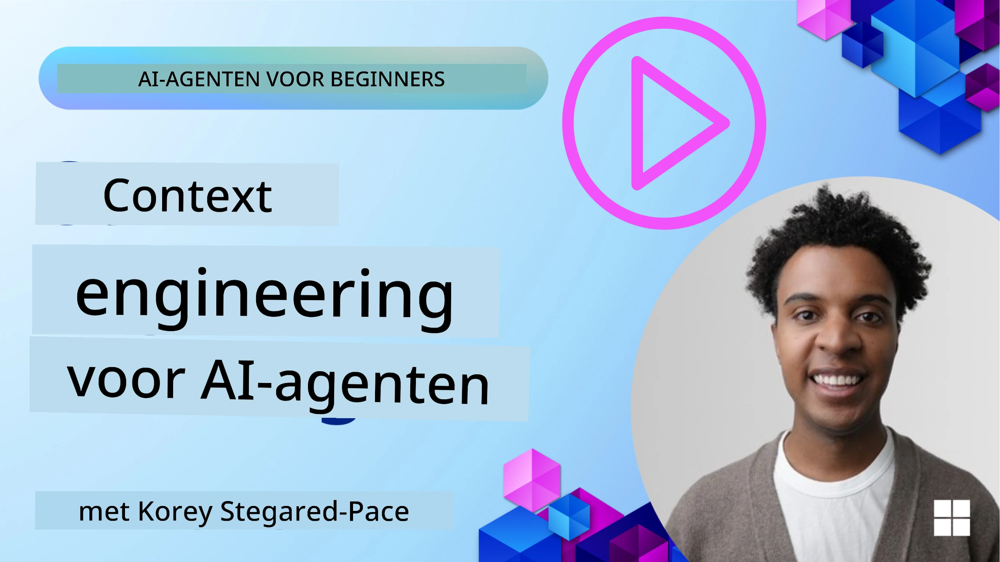
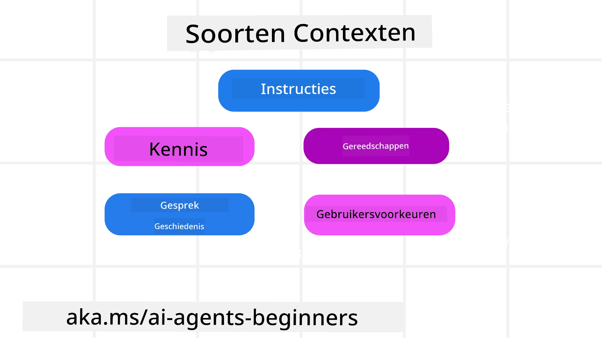
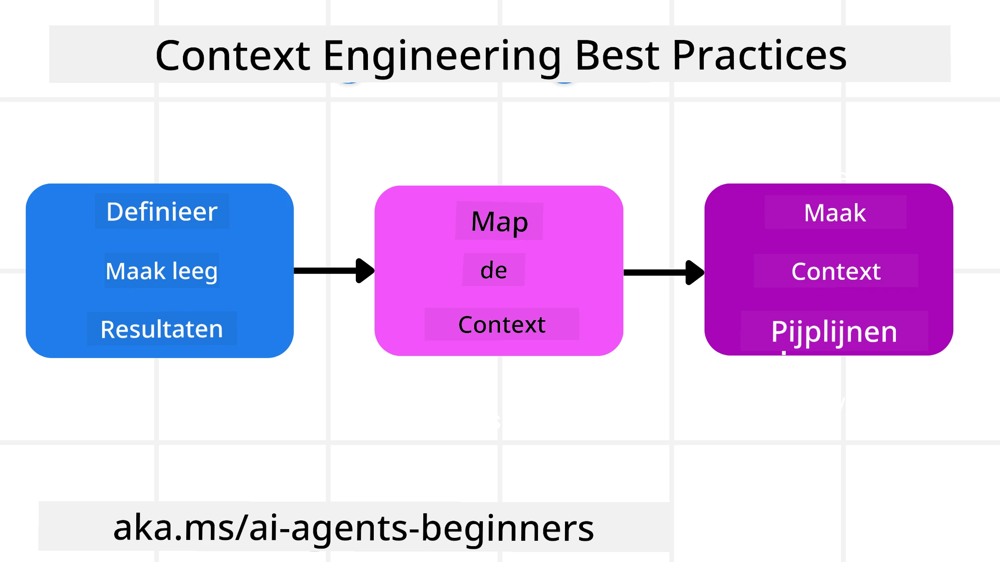

# Context Engineeren voor AI-Agenten

> _(Klik op de afbeelding hierboven om de video van deze les te bekijken)_

Het begrijpen van de complexiteit van de toepassing waarvoor je een AI-agent bouwt, is belangrijk om een betrouwbare agent te maken. We moeten AI-agenten bouwen die effectief omgaan met informatie om complexe behoeften aan te pakken, voorbij prompt-engineering.

In deze les bekijken we wat contextengineering is en welke rol het speelt bij het bouwen van AI-agenten.

## Introductie

Deze les behandelt:

• **Wat Context Engineering is** en waarom het verschilt van prompt-engineering.

• **Strategieën voor effectieve Context Engineering**, inclusief hoe je informatie schrijft, selecteert, comprimeert en isoleert.

• **Veelvoorkomende Context Fouten** die je AI-agent kunnen doen ontsporen en hoe je deze kunt oplossen.

## Leerdoelen

Na het afronden van deze les ga je begrijpen hoe je:

• **Context engineering definieert** en onderscheidt van prompt-engineering.

• **De belangrijkste componenten van context** in toepassingen met Large Language Models (LLM) identificeert.

• **Strategieën toepast voor het schrijven, selecteren, comprimeren en isoleren van context** om de prestaties van agenten te verbeteren.

• **Veelvoorkomende contextfouten herkent** zoals vergiftiging, afleiding, verwarring en conflicten en mitigatietechnieken implementeert.

## Wat is Context Engineering?

Voor AI-agenten is context wat de planning van een AI-agent stuurt om bepaalde acties te ondernemen. Context Engineering is de praktijk om ervoor te zorgen dat de AI-agent over de juiste informatie beschikt om de volgende stap van de taak te voltooien. Het contextvenster is beperkt in grootte, dus als agentbouwers moeten we systemen en processen opzetten om informatie toe te voegen, te verwijderen en samen te vatten in het contextvenster.

### Prompt Engineering versus Context Engineering

Prompt-engineering richt zich op een enkele set statische instructies om AI-agenten effectief te begeleiden met een reeks regels. Context-engineering gaat over het beheren van een dynamische set van informatie, inclusief de initiële prompt, om ervoor te zorgen dat de AI-agent heeft wat hij nodig heeft in de loop van de tijd. Het belangrijkste idee achter context-engineering is om dit proces herhaalbaar en betrouwbaar te maken.

### Soorten Context

Het is belangrijk te onthouden dat context niet slechts één ding is. De informatie die de AI-agent nodig heeft, kan uit verschillende bronnen komen en het is aan ons om ervoor te zorgen dat de agent toegang heeft tot deze bronnen:

De soorten context die een AI-agent mogelijk moet beheren, zijn onder andere:

• **Instructies:** Dit zijn als de "regels" van de agent – prompts, systeemberichten, few-shot voorbeelden (waarmee de AI leert hoe iets te doen), en beschrijvingen van tools die hij kan gebruiken. Dit is waar de focus van prompt-engineering samenkomt met context-engineering.

• **Kennis:** Dit omvat feiten, informatie opgehaald uit databases, of langetermijnherinneringen die de agent heeft opgebouwd. Dit kan ook het integreren van een Retrieval Augmented Generation (RAG) systeem omvatten als een agent toegang nodig heeft tot verschillende kennisbronnen en databases.

• **Tools:** Dit zijn definities van externe functies, API's en MCP-servers die de agent kan aanroepen, samen met de feedback (resultaten) die hij krijgt van het gebruik ervan.

• **Gespreksgeschiedenis:** De lopende dialoog met een gebruiker. Na verloop van tijd worden deze gesprekken langer en complexer, wat betekent dat ze ruimte innemen in het contextvenster.

• **Gebruikersvoorkeuren:** Informatie die geleerd is over de voorkeuren of afkeuren van een gebruiker in de loop van de tijd. Deze kunnen worden opgeslagen en opgeroepen bij het maken van belangrijke beslissingen om de gebruiker te helpen.

## Strategieën voor Effectieve Context Engineering

### Planningsstrategieën

Goede context-engineering begint met goede planning. Hier is een aanpak die je helpt na te denken over hoe je het concept van context-engineering kunt toepassen:

1. **Definieer Duidelijke Resultaten** - De resultaten van de taken die AI-agenten krijgen toegewezen moeten duidelijk worden gedefinieerd. Beantwoord de vraag – "Hoe ziet de wereld eruit als de AI-agent klaar is met zijn taak?" Met andere woorden, welke verandering, informatie of reactie moet de gebruiker hebben na interactie met de AI-agent.
2. **Breng de Context In Kaart** - Zodra je de resultaten van de AI-agent hebt gedefinieerd, moet je de vraag beantwoorden: "Welke informatie heeft de AI-agent nodig om deze taak te voltooien?". Zo kun je de context in kaart brengen waar die informatie zich bevindt.
3. **Maak Context-Pijplijnen** - Nu je weet waar de informatie is, moet je de vraag beantwoorden: "Hoe krijgt de agent deze informatie?". Dit kan op verschillende manieren worden gedaan, inclusief RAG, het gebruik van MCP-servers en andere tools.

### Praktische Strategieën

Planning is belangrijk, maar zodra de informatie begint binnen te komen in het contextvenster van onze agent, hebben we praktische strategieën nodig om deze te beheren:

#### Context Beheren

Hoewel sommige informatie automatisch aan het contextvenster wordt toegevoegd, draait context-engineering om een actievere rol in deze informatie, wat gedaan kan worden met een paar strategieën:

 1. **Agent Krabbelblok**  
 Hiermee kan een AI-agent notities maken van relevante informatie over de huidige taken en gebruikersinteracties tijdens een enkele sessie. Dit moet buiten het contextvenster bestaan in een bestand of runtime-object dat de agent later tijdens deze sessie kan ophalen indien nodig.

 2. **Herinneringen**  
 Krabbelblokken zijn geschikt om informatie buiten het contextvenster van een enkele sessie te beheren. Herinneringen stellen agenten in staat relevante informatie op te slaan en op te halen over meerdere sessies heen. Dit kan samenvattingen, gebruikersvoorkeuren en feedback voor toekomstige verbeteringen omvatten.

 3. **Context Comprimeren**  
 Zodra het contextvenster groeit en zijn limiet nadert, kunnen technieken zoals samenvatten en inkorten worden gebruikt. Dit betekent dat je alleen de meest relevante informatie bewaart of oudere berichten verwijdert.
  
 4. **Multi-Agent Systemen**  
 Het ontwikkelen van multi-agent systemen is een vorm van context-engineering omdat elke agent zijn eigen contextvenster heeft. Hoe die context wordt gedeeld en doorgegeven aan verschillende agenten is iets anders om uit te plannen bij het bouwen van deze systemen.
  
 5. **Sandbox-omgevingen**  
 Als een agent code moet uitvoeren of grote hoeveelheden informatie in een document moet verwerken, kan dit veel tokens kosten om de resultaten te verwerken. In plaats van dit alles op te slaan in het contextvenster, kan de agent een sandbox-omgeving gebruiken die deze code kan uitvoeren en alleen de resultaten en andere relevante informatie leest.
  
 6. **Runtime State Objects**  
   Dit wordt gedaan door containers van informatie te creëren om situaties te beheren waarin de agent toegang moet hebben tot bepaalde informatie. Voor een complexe taak stelt dit een agent in staat de resultaten van elke subtak stap voor stap op te slaan, waardoor de context verbonden blijft met alleen die specifieke subtak.

#### Context Inspecteren

Nadat je een van deze strategieën hebt toegepast, is het de moeite waard te controleren wat de volgende modelaanroep daadwerkelijk ontving. Een nuttige debugvraag is:

> Heeft de agent te veel context geladen, de verkeerde context, of context gemist die nodig was?

Je hoeft niet ruwe prompts, tooluitvoer of geheugeninhoud te loggen om die vraag te beantwoorden. In productie heeft de voorkeur kleine contextinspecties die aantallen, ID's, hashes en beleidslabels vastleggen:

- **Selectie:** Volg hoeveel kandidaatstukken, tools of herinneringen zijn overwogen, hoeveel geselecteerd en welke regel of score de anderen eruit filterde.
- **Compressie:** Registreer het bronbereik of trace-ID, het samenvattings-ID, een geschat tokenaantal voor en na compressie, en of de ruwe inhoud is uitgesloten van de volgende oproep.
- **Isolatie:** Noteer welke subtak in een aparte agent, sessie of sandbox draaide, welke gebonden samenvatting werd geretourneerd, en of grote tooluitvoer buiten de context van de hoofdagent bleef.
- **Geheugen en RAG:** Bewaar retrieval-document-ID's, geheugen-ID's, scores, geselecteerde ID's en redactie-status in plaats van volledige opgehaalde tekst.
- **Veiligheid en privacy:** Geef de voorkeur aan hashes, ID's, token buckets en beleidslabels boven gevoelige prompttekst, toolargumenten, toolresultaten of gebruikersgeheugeninhoud.

Het doel is niet om meer context te bewaren. Het is om voldoende bewijs achter te laten zodat een ontwikkelaar kan zien welke contextstrategie werd uitgevoerd en of deze de volgende modelaanroep op de bedoelde manier veranderde.

### Voorbeeld van Context Engineering

Stel dat we een AI-agent willen die **"Boek mij een reis naar Parijs."**

• Een eenvoudige agent die alleen prompt-engineering gebruikt, zou simpelweg kunnen antwoorden: **"Oké, wanneer wil je naar Parijs gaan?"**. Hij verwerkte alleen je directe vraag op het moment dat de gebruiker het vroeg.

• Een agent die de besproken context-engineeringstrategieën gebruikt, zou veel meer doen. Zelfs voordat hij reageert, kan zijn systeem:

  ◦ **Je agenda controleren** op beschikbare data (live data ophalen).

 ◦ **Reisvoorkeuren uit het verleden herinneren** (uit het langetermijngeheugen), zoals je favoriete luchtvaartmaatschappij, budget of of je directe vluchten prefereert.

 ◦ **Beschikbare tools identificeren** voor het boeken van vlucht en hotel.

- Dan zou een voorbeeldantwoord kunnen zijn: "Hey [Je Naam]! Ik zie dat je de eerste week van oktober vrij bent. Zal ik zoeken naar directe vluchten naar Parijs met [Voorkeursluchtvaartmaatschappij] binnen je gebruikelijke budget van [Budget]?" Deze rijkere, contextbewuste reactie toont de kracht van context-engineering.

## Veelvoorkomende Context Fouten

### Context Vergiftiging

**Wat het is:** Wanneer een hallucinatie (valse informatie gegenereerd door het LLM) of een fout in de context komt en herhaaldelijk wordt aangehaald, waardoor de agent onmogelijke doelen nastreeft of onzinstrategieën ontwikkelt.

**Wat te doen:** Implementeer **contextvalidatie** en **quarantaine**. Valideer informatie voordat deze aan het langetermijngeheugen wordt toegevoegd. Als mogelijke vergiftiging wordt gedetecteerd, begin dan frisse contextdraden om te voorkomen dat de slechte informatie zich verspreidt.

**Reisboekvoorbeeld:** Je agent hallucineren een **directe vlucht van een kleine lokale luchthaven naar een verre internationale stad** die geen internationale vluchten aanbiedt. Dit niet-bestaande vluchtdetail wordt opgeslagen in de context. Later, wanneer je de agent vraagt te boeken, blijft hij proberen tickets voor deze onmogelijke route te vinden, wat leidt tot herhaalde fouten.

**Oplossing:** Implementeer een stap die **vluchtbestaan en routes valideert met een realtime API** _voordat_ de vluchtgegevens aan de werkcontext van de agent worden toegevoegd. Als de validatie faalt, wordt de foutieve informatie "gecorrigeerd" en niet verder gebruikt.

### Context Afleiding

**Wat het is:** Wanneer de context zo groot wordt dat het model te veel focust op de opgebouwde geschiedenis in plaats van te gebruiken wat het tijdens training heeft geleerd, wat leidt tot repetitieve of niet-helpende acties. Modellen kunnen fouten maken zelfs voordat het contextvenster vol is.

**Wat te doen:** Gebruik **contextsamenvattingen**. Periodegewijs geaccumuleerde informatie comprimeren tot kortere samenvattingen, belangrijke details bewaren en redundante geschiedenis verwijderen. Dit helpt de focus te resetten.

**Reisboekvoorbeeld:** Je hebt lange tijd allerlei droomreizen besproken, inclusief een gedetailleerd verslag van je backpackreis van twee jaar geleden. Wanneer je eindelijk vraagt om **"een goedkope vlucht voor volgende maand te vinden,"** raakt de agent verstrikt in oude, irrelevante details en vraagt hij steeds naar je backpackuitrusting of oude reisschema's, terwijl hij je huidige verzoek negeert.

**Oplossing:** Na een bepaald aantal beurten of wanneer de context te groot wordt, moet de agent **de meest recente en relevante delen van het gesprek samenvatten** – gericht op je huidige reisdata en bestemming – en die samenvatting gebruiken voor de volgende LLM-aanroep, terwijl de minder relevante historische chat wordt weggegooid.

### Context Verwarring

**Wat het is:** Wanneer onnodige context, vaak in de vorm van te veel beschikbare tools, het model doet slechte antwoorden genereren of irrelevante tools laat aanroepen. Kleinere modellen zijn hier vooral gevoelig voor.

**Wat te doen:** Implementeer **toolloadoutbeheer** met RAG-technieken. Sla toolbeschrijvingen op in een vectordatabase en selecteer _alleen_ de meest relevante tools voor elke specifieke taak. Onderzoek toont aan dat het beperken van tools tot minder dan 30 het beste werkt.

**Reisboekvoorbeeld:** Je agent heeft toegang tot tientallen tools: `book_flight`, `book_hotel`, `rent_car`, `find_tours`, `currency_converter`, `weather_forecast`, `restaurant_reservations`, enzovoort. Je vraagt: **"Wat is de beste manier om je in Parijs te verplaatsen?"** Door het grote aantal tools raakt de agent in de war en probeert `book_flight` aan te roepen _binnen_ Parijs, of `rent_car` ook al prefereer je het openbaar vervoer, omdat toolbeschrijvingen overlappen of hij gewoonweg niet kan bepalen welke de beste is.

**Oplossing:** Gebruik **RAG over toolbeschrijvingen**. Wanneer je vraagt hoe je je in Parijs kunt verplaatsen, haalt het systeem dynamisch _alleen_ de meest relevante tools op zoals `rent_car` of `public_transport_info` op basis van je vraag, en presenteert een gefocuste "loadout" van tools aan het LLM.

### Context Conflict

**Wat het is:** Wanneer tegenstrijdige informatie in de context aanwezig is, wat leidt tot inconsistente redeneringen of slechte eindantwoorden. Dit gebeurt vaak wanneer informatie in fasen binnenkomt en vroege, onjuiste aannames in de context blijven staan.

**Wat te doen:** Gebruik **context snoeien** en **offloading**. Snoeien betekent verouderde of conflicterende informatie verwijderen zodra nieuwe details binnenkomen. Offloading geeft het model een apart "krabbelvlak" om informatie te verwerken zonder het hoofdcontext te vervuilen.
**Voorbeeld van reisboeking:** Je vertelt je agent aanvankelijk: **"Ik wil economy class vliegen."** Later in het gesprek verander je van mening en zeg je: **"Eigenlijk, voor deze reis, laten we business class nemen."** Als beide instructies in de context blijven, kan de agent tegenstrijdige zoekresultaten krijgen of in de war raken over welke voorkeur prioriteit heeft.

**Oplossing:** Implementeer **context pruning**. Wanneer een nieuwe instructie een oude tegenspreekt, wordt de oudere instructie verwijderd of expliciet overschreven in de context. Alternatief kan de agent een **scratchpad** gebruiken om tegenstrijdige voorkeuren te verzoenen voordat er een beslissing wordt genomen, zodat alleen de laatste, consistente instructie de handelingen stuurt.

## Meer vragen over Context Engineering?

Word lid van de [Microsoft Foundry Discord](https://aka.ms/ai-agents/discord) om andere cursisten te ontmoeten, deel te nemen aan spreekuren en je vragen over AI Agents beantwoord te krijgen.

---

<!-- CO-OP TRANSLATOR DISCLAIMER START -->
**Disclaimer**:
Dit document is vertaald met behulp van de AI vertaaldienst [Co-op Translator](https://github.com/Azure/co-op-translator). Hoewel we streven naar nauwkeurigheid, dient u er rekening mee te houden dat geautomatiseerde vertalingen fouten of onnauwkeurigheden kunnen bevatten. Het originele document in de oorspronkelijke taal moet worden beschouwd als de gezaghebbende bron. Voor kritieke informatie wordt professionele menselijke vertaling aanbevolen. Wij zijn niet aansprakelijk voor eventuele misverstanden of verkeerde interpretaties die voortvloeien uit het gebruik van deze vertaling.
<!-- CO-OP TRANSLATOR DISCLAIMER END -->