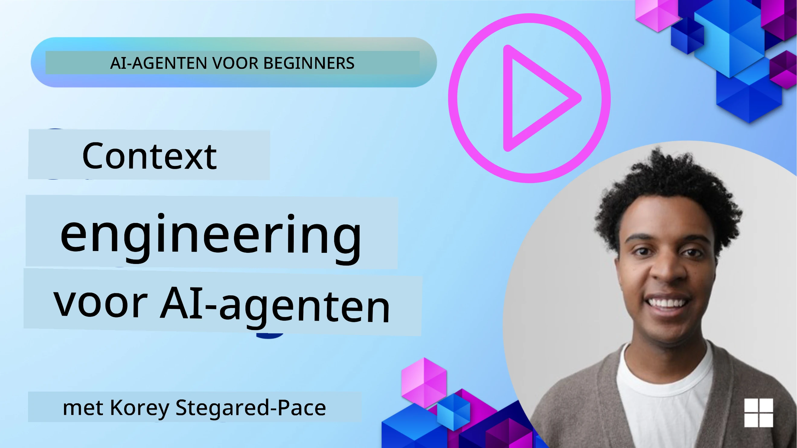
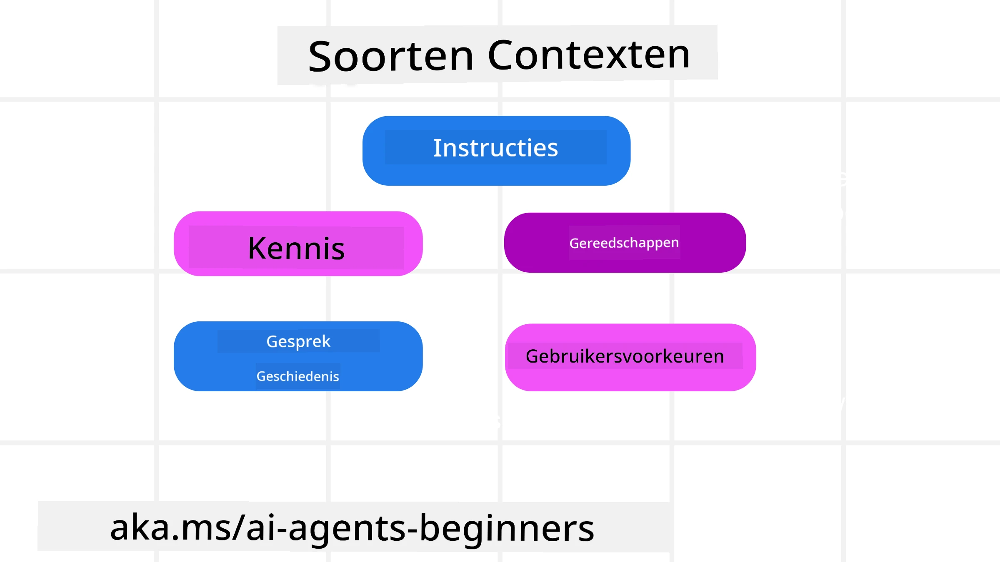
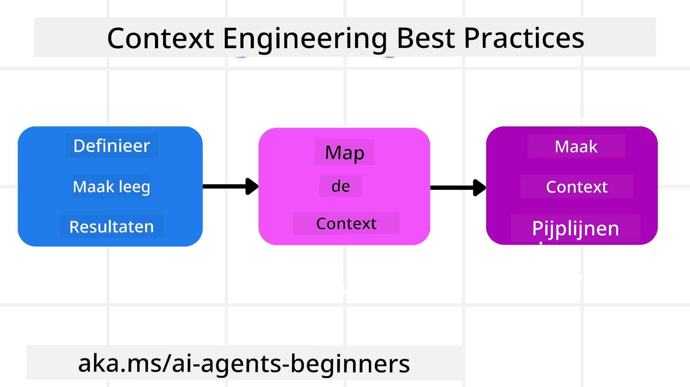

# Context Engineering voor AI-agenten

> _(Klik op de bovenstaande afbeelding om de video van deze les te bekijken)_

Het begrijpen van de complexiteit van de toepassing waarvoor je een AI-agent bouwt, is belangrijk om een betrouwbare agent te maken. We moeten AI-agenten bouwen die effectief informatie beheren om complexe behoeften aan te pakken, voorbij prompt engineering.

In deze les bekijken we wat context engineering is en welke rol het speelt bij het bouwen van AI-agenten.

## Introductie

Deze les behandelt:

• **Wat context engineering is** en waarom het anders is dan prompt engineering.

• **Strategieën voor effectieve context engineering**, waaronder hoe je informatie schrijft, selecteert, comprimeert en isoleert.

• **Veelvoorkomende contextfouten** die je AI-agent kunnen dwarsbomen en hoe je deze kunt oplossen.

## Leerdoelen

Na het afronden van deze les begrijp je hoe je:

• **Context engineering definieert** en het onderscheidt van prompt engineering.

• **De belangrijkste componenten van context identificeert** in toepassingen van Large Language Models (LLM).

• **Strategieën toepast voor het schrijven, selecteren, comprimeren en isoleren van context** om de prestaties van de agent te verbeteren.

• **Veelvoorkomende contextfouten herkent** zoals vergiftiging, afleiding, verwarring en conflicten, en mitigerende technieken implementeert.

## Wat is Context Engineering?

Voor AI-agenten is context wat het plannen van een AI-agent aanstuurt om bepaalde acties te ondernemen. Context engineering is de praktijk om ervoor te zorgen dat de AI-agent de juiste informatie heeft om de volgende stap van de taak te voltooien. Het contextvenster is beperkt in grootte, dus als agentbouwers moeten we systemen en processen maken om informatie aan het contextvenster toe te voegen, te verwijderen en samen te vatten.

### Prompt Engineering versus Context Engineering

Prompt engineering richt zich op een enkele set statische instructies om de AI-agenten effectief te begeleiden met regels. Context engineering gaat over het beheren van een dynamische set informatie, inclusief de initiële prompt, om ervoor te zorgen dat de AI-agent in de loop van de tijd heeft wat hij nodig heeft. Het hoofdidee achter context engineering is om dit proces herhaalbaar en betrouwbaar te maken.

### Soorten Context

Het is belangrijk om te onthouden dat context niet slechts één ding is. De informatie die de AI-agent nodig heeft, kan uit verschillende bronnen komen en het is aan ons om ervoor te zorgen dat de agent toegang heeft tot deze bronnen:

De soorten context die een AI-agent mogelijk moet beheren zijn onder andere:

• **Instructies:** Dit zijn als de "regels" van de agent – prompts, systeemberichten, few-shot voorbeelden (die de AI laten zien hoe iets moet), en beschrijvingen van tools die hij kan gebruiken. Hier komt de focus van prompt engineering samen met context engineering.

• **Kennis:** Dit omvat feiten, informatie opgehaald uit databases, of langetermijnherinneringen die de agent heeft verzameld. Dit kan het integreren van een Retrieval Augmented Generation (RAG) systeem omvatten als een agent toegang nodig heeft tot verschillende kennisopslagplaatsen en databases.

• **Tools:** Dit zijn de definities van externe functies, API's en MCP-servers die de agent kan aanroepen, samen met de feedback (resultaten) die hij krijgt bij het gebruik ervan.

• **Gespreksgeschiedenis:** De lopende dialoog met een gebruiker. Naarmate de tijd verstrijkt, worden deze gesprekken langer en complexer, wat ruimte inneemt in het contextvenster.

• **Gebruikersvoorkeuren:** Informatie over iemands voorkeuren of afkeuren, geleerd in de loop van de tijd. Deze kunnen worden opgeslagen en geraadpleegd bij het nemen van belangrijke beslissingen om de gebruiker te helpen.

## Strategieën voor Effectieve Context Engineering

### Planningsstrategieën

Goede context engineering begint met goede planning. Hier is een aanpak die je helpt nadenken over hoe je het concept context engineering toepast:

1. **Duidelijke Resultaten Definiëren** – De resultaten van de taken die AI-agenten moeten uitvoeren, moeten duidelijk worden gedefinieerd. Beantwoord de vraag - "Hoe ziet de wereld eruit wanneer de AI-agent klaar is met zijn taak?" Met andere woorden, welke verandering, informatie of reactie zou de gebruiker moeten hebben na interactie met de AI-agent.
2. **De Context In kaart brengen** – Zodra je de resultaten van de AI-agent hebt gedefinieerd, moet je de vraag beantwoorden "Welke informatie heeft de AI-agent nodig om deze taak te voltooien?". Zo kun je beginnen de context in kaart te brengen waar die informatie kan worden gevonden.
3. **Contextpijplijnen Maken** – Nu je weet waar de informatie is, moet je de vraag beantwoorden "Hoe krijgt de agent deze informatie?". Dit kan op diverse manieren, waaronder RAG, gebruik van MCP-servers en andere tools.

### Praktische Strategieën

Planning is belangrijk, maar zodra de informatie begint binnen te komen in het contextvenster van onze agent, hebben we praktische strategieën nodig om deze te beheren:

#### Context beheren

Hoewel sommige informatie automatisch aan het contextvenster wordt toegevoegd, gaat context engineering over een actievere rol in het beheer van deze informatie, wat met een paar strategieën kan worden gedaan:

 1. **Agent Krabbelschrift**
 Hiermee kan een AI-agent relevante informatie noteren over de huidige taken en gebruikersinteracties tijdens een enkele sessie. Dit moet buiten het contextvenster bestaan, bijvoorbeeld in een bestand of runtime-object dat de agent later tijdens deze sessie kan ophalen indien nodig.

 2. **Herinneringen**
 Krabbelschriften zijn goed voor het beheren van informatie buiten het contextvenster van een enkele sessie. Herinneringen stellen agenten in staat relevante informatie over meerdere sessies op te slaan en op te halen. Dit kan samenvattingen, gebruikersvoorkeuren en feedback voor toekomstige verbeteringen omvatten.

 3. **Context Comprimeren**
  Zodra het contextvenster groeit en de limiet nadert, kunnen technieken zoals samenvatten en inkorten worden toegepast. Dit omvat het alleen bewaren van de meest relevante informatie of het verwijderen van oudere berichten.
  
 4. **Multi-Agent Systemen**
  Het ontwikkelen van multi-agent systemen is een vorm van context engineering omdat elke agent zijn eigen contextvenster heeft. Hoe die context wordt gedeeld en doorgegeven aan verschillende agenten is iets anders om uit te plannen bij het bouwen van deze systemen.
  
 5. **Sandbox-omgevingen**
  Als een agent code moet uitvoeren of grote hoeveelheden informatie in een document moet verwerken, kan dit veel tokens kosten om de resultaten te verwerken. In plaats van alles in het contextvenster te bewaren, kan de agent een sandbox-omgeving gebruiken die deze code kan uitvoeren en alleen de resultaten en andere relevante informatie leest.
  
 6. **Runtime State Objecten**
   Dit wordt gedaan door containers te maken van informatie om situaties te beheren waarin de agent toegang tot bepaalde informatie moet hebben. Voor een complexe taak zou dit een agent in staat stellen de resultaten van elke subtaken stap voor stap op te slaan, zodat de context verbonden blijft met alleen die specifieke subtaken.

#### Context Inspecteren

Nadat je een van deze strategieën hebt toegepast, is het de moeite waard te controleren wat de volgende modelaanroep eigenlijk ontving. Een nuttige debug-vraag is:

> Heeft de agent te veel context geladen, verkeerde context, of context gemist die nodig was?

Je hoeft niet ruwe prompts, tooloutputs of geheugeninhoud te loggen om die vraag te beantwoorden. In productie hebben kleine contextinspectie-records de voorkeur die tellingen, id's, hashes en beleidslabels vastleggen:

- **Selectie:** Houd bij hoeveel kandidaatstukken, tools of herinneringen werden overwogen, hoeveel werden geselecteerd, en welke regel of score de anderen filterde.
- **Compressie:** Noteer het bronbereik of trace-id, het samenvattings-id, een geschat aantal tokens vóór en na compressie, en of de ruwe inhoud werd uitgesloten van de volgende aanroep.
- **Isolatie:** Noteer welke subtaken in een aparte agent, sessie of sandbox liepen, welke begrensde samenvatting werd teruggegeven, en of grote tooluitvoer buiten de context van de bovenliggende agent bleef.
- **Geheugen en RAG:** Sla retrieval-document-id's, geheugen-id's, scores, geselecteerde id's en redactiestatus op in plaats van volledige opgehaalde tekst.
- **Veiligheid en privacy:** Geef de voorkeur aan hashes, id's, tokenbuckets en beleidslabels boven gevoelige prompttekst, toolargumenten, toolresultaten of gebruikersgeheugeninhoud.

Het doel is niet om meer context te behouden, maar voldoende bewijs achter te laten zodat een ontwikkelaar kan zien welke contextstrategie werd uitgevoerd en of die de volgende modelaanroep op de bedoelde manier veranderde.

### Voorbeeld van Context Engineering

Stel dat we een AI-agent willen die **"Boek een reis voor mij naar Parijs."**

• Een eenvoudige agent die alleen prompt engineering gebruikt, reageert misschien gewoon: **"Oké, wanneer zou je naar Parijs willen gaan?"**. Hij verwerkte alleen je directe vraag op het moment dat de gebruiker vroeg.

• Een agent die de behandelde context engineering strategieën gebruikt, zou veel meer doen. Voordat hij überhaupt reageert, zou het systeem:

  ◦ **Je agenda controleren** op beschikbare data (realtime data ophalen).

 ◦ **Eerdere reisvoorkeuren ophalen** (uit langetermijngeheugen) zoals je voorkeur voor luchtvaartmaatschappij, budget, of dat je direct vluchten verkiest.

 ◦ **Beschikbare tools identificeren** voor het boeken van vluchten en hotels.

- Dan zou een voorbeeldantwoord kunnen zijn:  "Hey [Je Naam]! Ik zie dat je de eerste week van oktober vrij bent. Zal ik zoeken naar directe vluchten naar Parijs met [Voorkeursluchtvaartmaatschappij] binnen je gebruikelijke budget van [Budget]?" Dit rijkere, contextbewuste antwoord toont de kracht van context engineering aan.

## Veelvoorkomende Contextproblemen

### Contextvergiftiging

**Wat het is:** Wanneer een hallucinatie (valse informatie gegenereerd door het LLM) of een fout de context binnendringt en herhaaldelijk wordt gerefereerd, waardoor de agent onmogelijke doelen nastreeft of onzinnige strategieën ontwikkelt.

**Wat te doen:** Implementeer **contextvalidatie** en **quarantaine**. Valideer informatie voordat deze aan het langetermijngeheugen wordt toegevoegd. Als mogelijke vergiftiging wordt gedetecteerd, start dan nieuwe contextthreads om te voorkomen dat de slechte informatie zich verspreidt.

**Reisboekvoorbeeld:** Je agent hallucinaties een **directe vlucht van een kleine lokale luchthaven naar een verre internationale stad** die eigenlijk geen internationale vluchten aanbiedt. Deze niet-bestaande vlucht wordt opgeslagen in de context. Later, wanneer je de agent vraagt om te boeken, blijft hij proberen tickets te vinden voor deze onmogelijke route, wat leidt tot terugkerende fouten.

**Oplossing:** Implementeer een stap die **vluchten en routes valideert met een realtime API** _voordat_ de vluchtgegevens aan de werkcontext van de agent worden toegevoegd. Als de validatie faalt, wordt de foutieve informatie "geïnterneerd" en verder niet gebruikt.

### Contextafleiding

**Wat het is:** Wanneer de context zo groot wordt dat het model te veel focust op de opgebouwde geschiedenis in plaats van te gebruiken wat het tijdens training heeft geleerd, wat leidt tot repetitieve of nutteloze acties. Modellen kunnen fouten gaan maken nog voor het contextvenster vol is.

**Wat te doen:** Gebruik **contextsamentrekking**. Periode gewijs geaccumuleerde informatie samenvatten in kortere versies, waarbij belangrijke details behouden blijven en overbodige geschiedenis wordt verwijderd. Dit helpt om de focus "te resetten".

**Reisboekvoorbeeld:** Je hebt het lang gehad over verschillende droombestemmingen, inclusief een gedetailleerd verslag van je rugzakreis van twee jaar geleden. Wanneer je eindelijk vraagt om **"vind een goedkope vlucht voor volgende maand,"** raakt de agent verstrikt in oude, irrelevante details en blijft hij vragen stellen over je rugzakuitrusting of eerdere reisschema’s, waardoor je actuele verzoek wordt genegeerd.

**Oplossing:** Na een bepaald aantal interacties of als de context te groot wordt, moet de agent **de meest recente en relevante delen van het gesprek samenvatten** – met focus op jouw huidige reisdata en bestemming – en die samenvatting gebruiken voor de volgende LLM-aanroep, terwijl minder relevante historische gesprekken worden weggegooid.

### Contextverwarring

**Wat het is:** Wanneer onnodige context, vaak in de vorm van te veel beschikbare tools, het model doet verkeerde antwoorden genereren of irrelevante tools laat aanroepen. Kleinere modellen zijn hier vooral gevoelig voor.

**Wat te doen:** Implementeer **toolloadoutbeheer** met RAG-technieken. Sla toolbeschrijvingen op in een vectordatabase en selecteer _alleen_ de meest relevante tools voor elke specifieke taak. Onderzoek toont aan dat het beperken tot minder dan 30 tools het beste werkt.

**Reisboekvoorbeeld:** Je agent heeft toegang tot tientallen tools: `book_flight`, `book_hotel`, `rent_car`, `find_tours`, `currency_converter`, `weather_forecast`, `restaurant_reservations`, enzovoort. Je vraagt: **"Wat is de beste manier om in Parijs rond te reizen?"** Door het enorme aantal tools raakt de agent in de war en probeert `book_flight` _binnen_ Parijs aan te roepen, of `rent_car` hoewel je openbaar vervoer verkiest, omdat de toolbeschrijvingen overlappen of hij simpelweg niet kan bepalen welke het beste is.

**Oplossing:** Gebruik **RAG over toolbeschrijvingen**. Wanneer je vraagt naar de manier om in Parijs rond te reizen, haalt het systeem dynamisch _alleen_ de meest relevante tools zoals `rent_car` of `public_transport_info` op basis van je vraag, en presenteert een gerichte "loadout" tools aan het LLM.

### Contextconflict

**Wat het is:** Wanneer conflicterende informatie binnen de context bestaat, wat leidt tot inconsistente redenering of slechte eindantwoorden. Dit gebeurt vaak wanneer informatie in fasen binnenkomt en vroege, incorrecte aannames in de context blijven staan.

**Wat te doen:** Gebruik **context snoeien** en **offloading**. Snoeien betekent het verwijderen van verouderde of conflicterende informatie wanneer nieuwe details binnenkomen. Offloading geeft het model een aparte "krabbelschrift"-werkruimte om informatie te verwerken zonder het hoofdcontext te verontreinigen.

**Voorbeeld Reisboeking:** Je vertelt je agent aanvankelijk, **"Ik wil in economy class vliegen."** Later in het gesprek verander je van gedachte en zeg je, **"Eigenlijk, voor deze reis, gaan we voor business class."** Als beide instructies in de context blijven, kan de agent tegenstrijdige zoekresultaten ontvangen of in de war raken over welke voorkeur prioriteit moet krijgen.

**Oplossing:** Implementeer **context pruning**. Wanneer een nieuwe instructie een oude tegenspreekt, wordt de oudere instructie verwijderd of expliciet overschreven in de context. Als alternatief kan de agent een **scratchpad** gebruiken om tegenstrijdige voorkeuren te verzoenen voordat er een beslissing wordt genomen, waardoor alleen de uiteindelijke, consistente instructie zijn acties stuurt.

## Meer vragen over Context Engineering?

Word lid van de [Microsoft Foundry Discord](https://discord.com/invite/ATgtXmAS5D) om andere lerenden te ontmoeten, deel te nemen aan office hours en antwoorden te krijgen op je AI Agents-vragen.

---

<!-- CO-OP TRANSLATOR DISCLAIMER START -->
**Disclaimer**:
Dit document is vertaald met behulp van de AI vertaaldienst [Co-op Translator](https://github.com/Azure/co-op-translator). Hoewel we streven naar nauwkeurigheid, dient u er rekening mee te houden dat geautomatiseerde vertalingen fouten of onnauwkeurigheden kunnen bevatten. Het originele document in de oorspronkelijke taal moet worden beschouwd als de gezaghebbende bron. Voor kritieke informatie wordt professionele menselijke vertaling aanbevolen. Wij zijn niet aansprakelijk voor eventuele misverstanden of verkeerde interpretaties die voortvloeien uit het gebruik van deze vertaling.
<!-- CO-OP TRANSLATOR DISCLAIMER END -->