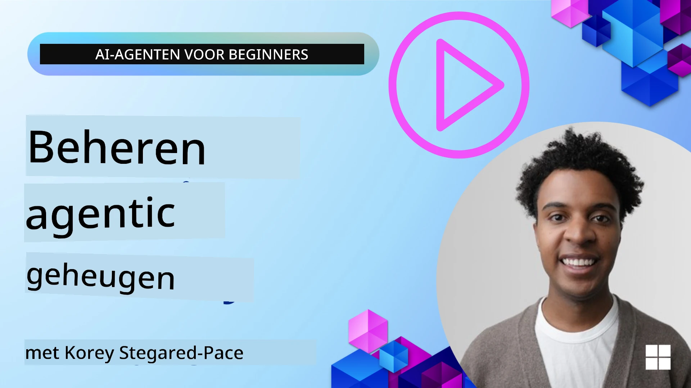

# Geheugen voor AI-agenten 

When discussing the unique benefits of creating AI Agents, two things are mainly discussed: the ability to call tools to complete tasks and the ability to improve over time. Memory is at the foundation of creating self-improving agent that can create better experiences for our users.

In this lesson, we will look at what memory is for AI Agents and how we can manage it and use it for the benefit of our applications.

## Introductie

This lesson will cover:

• **Begrijpen van geheugen voor AI-agenten**: Wat geheugen is en waarom het essentieel is voor agenten.

• **Implementatie en opslag van geheugen**: Praktische methoden om geheugenfunctionaliteit toe te voegen aan je AI-agenten, met focus op kortetermijn- en langetermijngeheugen.

• **AI-agenten zelfverbeterend maken**: Hoe geheugen agenten in staat stelt te leren van eerdere interacties en in de loop van de tijd te verbeteren.

## Beschikbare implementaties

This lesson includes two comprehensive notebook tutorials:

• **[13-agent-memory.ipynb](./13-agent-memory.ipynb)**: Implementeert geheugen met Mem0 en Azure AI Search met Microsoft Agent Framework

• **[13-agent-memory-cognee.ipynb](./13-agent-memory-cognee.ipynb)**: Implementeert gestructureerd geheugen met Cognee, dat automatisch een kennisgrafiek opbouwt ondersteund door embeddings, de grafiek visualiseert en intelligente ophalen biedt

## Leerdoelen

After completing this lesson, you will know how to:

• **Onderscheid maken tussen verschillende typen geheugen voor AI-agenten**, inclusief werkgeheugen, kortetermijngeheugen en langetermijngeheugen, evenals gespecialiseerde vormen zoals persona- en episodisch geheugen.

• **Kortetermijn- en langetermijngeheugen implementeren en beheren voor AI-agenten** met Microsoft Agent Framework, gebruikmakend van tools zoals Mem0, Cognee, Whiteboard-geheugen en integratie met Azure AI Search.

• **De principes achter zelfverbeterende AI-agenten begrijpen** en hoe robuuste geheugensystemen bijdragen aan continu leren en aanpassen.

## Begrijpen van geheugen voor AI-agenten

At its core, **memory for AI agents refers to the mechanisms that allow them to retain and recall information**. This information can be specific details about a conversation, user preferences, past actions, or even learned patterns.

Without memory, AI applications are often stateless, meaning each interaction starts from scratch. This leads to a repetitive and frustrating user experience where the agent "forgets" previous context or preferences.

### Waarom is geheugen belangrijk?

De intelligentie van een agent is nauw verbonden met zijn vermogen om eerdere informatie te herinneren en te gebruiken. Geheugen stelt agenten in staat om:

• **Reflectief**: Leren van eerdere acties en uitkomsten.

• **Interactief**: Context behouden gedurende een lopend gesprek.

• **Proactief en reactief**: Behoeften voorspellen of passend reageren op basis van historische gegevens.

• **Autonoom**: Meer zelfstandig functioneren door gebruik te maken van opgeslagen kennis.

Het doel van het implementeren van geheugen is om agenten betrouwbaarder en bekwaamder te maken.

### Soorten geheugen

#### Werkgeheugen

Zie dit als een stuk krantenpapier dat een agent gebruikt tijdens een enkele, lopende taak of gedachtegang. Het bevat directe informatie die nodig is om de volgende stap te berekenen.

Voor AI-agenten legt werkgeheugen vaak de meest relevante informatie van een gesprek vast, zelfs als de volledige chatgeschiedenis lang of afgekapt is. Het richt zich op het extraheren van sleutelonderdelen zoals vereisten, voorstellen, beslissingen en acties.

**Voorbeeld Werkgeheugen**

In een reisboekingsagent kan het werkgeheugen de huidige aanvraag van de gebruiker vastleggen, zoals "Ik wil een reis naar Parijs boeken". Deze specifieke vereiste wordt in de directe context van de agent gehouden om de huidige interactie te sturen.

#### Kortetermijngeheugen

Dit type geheugen bewaart informatie gedurende de duur van een enkel gesprek of sessie. Het is de context van de huidige chat, waardoor de agent kan terugverwijzen naar eerdere beurten in de dialoog.

**Voorbeeld Kortetermijngeheugen**

Als een gebruiker vraagt: "Hoeveel kost een vlucht naar Parijs?" en later doorgaat met "En accommodatie daar?", zorgt het kortetermijngeheugen ervoor dat de agent weet dat "daar" verwijst naar "Parijs" binnen hetzelfde gesprek.

#### Langetermijngeheugen

Dit zijn gegevens die blijven bestaan over meerdere gesprekken of sessies heen. Het stelt agenten in staat om gebruikersvoorkeuren, historische interacties of algemene kennis over langere periodes te onthouden. Dit is belangrijk voor personalisatie.

**Voorbeeld Langetermijngeheugen**

Een langetermijngeheugen kan opslaan dat "Ben van skiën en buitenactiviteiten houdt, graag koffie drinkt met uitzicht op de bergen, en geavanceerde skipistes wil vermijden vanwege een eerdere blessure". Deze informatie, geleerd uit eerdere interacties, beïnvloedt aanbevelingen in toekomstige reisplanningssessies en maakt ze zeer persoonlijk.

#### Persona-geheugen

Dit gespecialiseerde geheugentype helpt een agent een consistente "persoonlijkheid" of "persona" te ontwikkelen. Het stelt de agent in staat zich details over zichzelf of zijn beoogde rol te herinneren, waardoor interacties vloeiender en gerichter worden.

**Voorbeeld Persona-geheugen**
Als de reisagent is ontworpen als een "expert ski-planner", kan het persona-geheugen deze rol versterken en de reacties laten aansluiten bij de toon en kennis van een expert.

#### Workflow/Episodisch geheugen

Dit geheugen slaat de reeks stappen op die een agent neemt tijdens een complexe taak, inclusief successen en mislukkingen. Het is alsof je specifieke "episodes" of eerdere ervaringen onthoudt om ervan te leren.

**Voorbeeld Episodisch Geheugen**

Als de agent heeft geprobeerd een specifieke vlucht te boeken maar dit mislukte vanwege onbeschikbaarheid, kan het episodisch geheugen deze mislukking registreren, zodat de agent alternatieve vluchten kan proberen of de gebruiker bij een volgende poging beter kan informeren over het probleem.

#### Entiteitengeheugen

Dit omvat het extraheren en onthouden van specifieke entiteiten (zoals personen, plaatsen of dingen) en gebeurtenissen uit gesprekken. Het stelt de agent in staat een gestructureerd begrip op te bouwen van belangrijke elementen die besproken worden.

**Voorbeeld Entiteitengeheugen**

Uit een gesprek over een eerdere reis kan de agent "Parijs", "Eiffeltoren" en "diner bij restaurant Le Chat Noir" extraheren als entiteiten. In een toekomstige interactie kan de agent "Le Chat Noir" herinneren en aanbieden daar een nieuwe reservering te maken.

#### Gestructureerde RAG (Retrieval Augmented Generation)

Hoewel RAG een bredere techniek is, wordt "Gestructureerde RAG" benadrukt als een krachtige geheugentechnologie. Het extraheert dichte, gestructureerde informatie uit verschillende bronnen (gesprekken, e-mails, afbeeldingen) en gebruikt deze om nauwkeurigheid, terughaalbaarheid en snelheid in antwoorden te verbeteren. In tegenstelling tot klassieke RAG die uitsluitend op semantische gelijkenis vertrouwt, werkt Gestructureerde RAG met de inherente structuur van informatie.

**Voorbeeld Gestructureerde RAG**

In plaats van alleen trefwoorden te matchen, kan Gestructureerde RAG vluchtdetails (bestemming, datum, tijd, luchtvaartmaatschappij) uit een e-mail parseren en deze op een gestructureerde manier opslaan. Dit maakt precieze vragen mogelijk zoals "Welke vlucht heb ik naar Parijs geboekt op dinsdag?"

## Implementatie en opslag van geheugen

Het implementeren van geheugen voor AI-agenten omvat een systematisch proces van **geheugenbeheer**, dat het genereren, opslaan, ophalen, integreren, bijwerken en zelfs "vergeten" (of verwijderen) van informatie omvat. Ophalen is een bijzonder cruciaal aspect.

### Gespecialiseerde geheugentools

#### Mem0

Een manier om het geheugen van agenten op te slaan en te beheren is het gebruik van gespecialiseerde tools zoals Mem0. Mem0 functioneert als een persistente geheugenlaag, waardoor agenten relevante interacties kunnen herinneren, gebruikersvoorkeuren en feitelijke context kunnen opslaan en kunnen leren van successen en mislukkingen in de loop van de tijd. Het idee is dat stateless agenten veranderen in stateful agenten.

Het werkt via een **tweepasig geheugenproces: extractie en bijwerken**. Eerst worden berichten die aan een agentthread worden toegevoegd naar de Mem0-service gestuurd, die een Large Language Model (LLM) gebruikt om de gespreksgeschiedenis samen te vatten en nieuwe herinneringen te extraheren. Vervolgens bepaalt een door een LLM aangedreven updatefase of deze herinneringen moeten worden toegevoegd, gewijzigd of verwijderd, en slaat ze op in een hybride datastore die vector-, graf- en key-value-databases kan omvatten. Dit systeem ondersteunt ook verschillende geheugentypen en kan grafgeheugen opnemen voor het beheren van relaties tussen entiteiten.

#### Cognee

Een andere krachtige benadering is het gebruik van **Cognee**, een open-source semantisch geheugen voor AI-agenten dat gestructureerde en ongestructureerde gegevens transformeert in doorzoekbare kennisgrafieken ondersteund door embeddings. Cognee biedt een **dual-store-architectuur** die vectorgelijkeniszoeking combineert met grafrelaties, waardoor agenten niet alleen begrijpen welke informatie vergelijkbaar is, maar ook hoe concepten zich tot elkaar verhouden.

Het blinkt uit in **hybride retrieval** die vectorgelijkenis, grafstructuur en LLM-redenering mengt - van ruwe chunk-lookup tot grafbewuste vraagbeantwoording. Het systeem onderhoudt **levend geheugen** dat zich ontwikkelt en groeit terwijl het doorzoekbaar blijft als één verbonden graf, en ondersteunt zowel kortetermijnsessiecontext als langetermijn persistent geheugen.

De Cognee-notebooktutorial ([13-agent-memory-cognee.ipynb](./13-agent-memory-cognee.ipynb)) demonstreert het bouwen van deze verenigde geheugenlaag, met praktische voorbeelden van het inlezen van diverse gegevensbronnen, het visualiseren van de kennisgrafiek en het queryen met verschillende zoekstrategieën die zijn afgestemd op specifieke agentbehoeften.

### Geheugen opslaan met RAG

Beyond specialized memory tools like mem0 , you can leverage robust search services like **Azure AI Search as a backend for storing and retrieving memories**, especially for structured RAG.

This allows you to ground your agent's responses with your own data, ensuring more relevant and accurate answers. Azure AI Search can be used to store user-specific travel memories, product catalogs, or any other domain-specific knowledge.

Azure AI Search supports capabilities like **Structured RAG**, which excels at extracting and retrieving dense, structured information from large datasets like conversation histories, emails, or even images. This provides "superhuman precision and recall" compared to traditional text chunking and embedding approaches.

## AI-agenten zelfverbeterend maken

A common pattern for self-improving agents involves introducing a **"knowledge agent"**. This separate agent observes the main conversation between the user and the primary agent. Its role is to:

1. **Identify valuable information**: Determine if any part of the conversation is worth saving as general knowledge or a specific user preference.

2. **Extract and summarize**: Distill the essential learning or preference from the conversation.

3. **Store in a knowledge base**: Persist this extracted information, often in a vector database, so it can be retrieved later.

4. **Augment future queries**: When the user initiates a new query, the knowledge agent retrieves relevant stored information and appends it to the user's prompt, providing crucial context to the primary agent (similar to RAG).

### Optimalisaties voor geheugen

• **Latency Management**: To avoid slowing down user interactions, a cheaper, faster model can be used initially to quickly check if information is valuable to store or retrieve, only invoking the more complex extraction/retrieval process when necessary.

• **Knowledge Base Maintenance**: For a growing knowledge base, less frequently used information can be moved to "cold storage" to manage costs.

## Nog vragen over agentgeheugen?

Sluit je aan bij de [Microsoft Foundry Discord](https://aka.ms/ai-agents/discord) om andere leerlingen te ontmoeten, deel te nemen aan spreekuren en je vragen over AI-agenten beantwoord te krijgen.

---

<!-- CO-OP TRANSLATOR DISCLAIMER START -->
**Disclaimer**:
Dit document is vertaald met behulp van de AI-vertalingsservice [Co-op Translator](https://github.com/Azure/co-op-translator). Hoewel we streven naar nauwkeurigheid, houd er rekening mee dat geautomatiseerde vertalingen fouten of onjuistheden kunnen bevatten. Het originele document in de oorspronkelijke taal dient als de gezaghebbende bron te worden beschouwd. Voor kritieke informatie wordt een professionele menselijke vertaling aanbevolen. Wij zijn niet aansprakelijk voor misverstanden of verkeerde interpretaties die voortvloeien uit het gebruik van deze vertaling.
<!-- CO-OP TRANSLATOR DISCLAIMER END -->