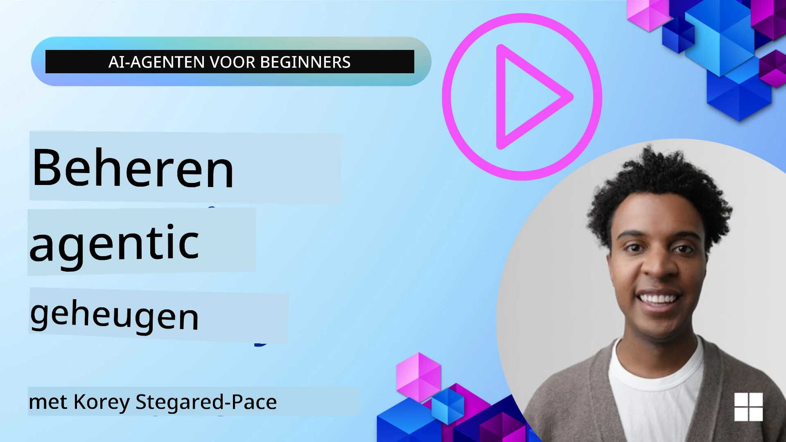

# Geheugen voor AI Agents 

Bij het bespreken van de unieke voordelen van het creëren van AI Agents, worden voornamelijk twee dingen besproken: het vermogen om tools aan te roepen om taken te voltooien en het vermogen om in de loop van de tijd te verbeteren. Geheugen ligt aan de basis van het creëren van een zelfverbeterende agent die betere ervaringen voor onze gebruikers kan creëren.

In deze les bekijken we wat geheugen is voor AI Agents en hoe we dit kunnen beheren en gebruiken voor het voordeel van onze applicaties.

## Introductie

Deze les behandelt:

• **Begrip van AI Agent Geheugen**: Wat geheugen is en waarom het essentieel is voor agents.

• **Implementeren en Opslaan van Geheugen**: Praktische methoden om geheugencapaciteiten toe te voegen aan je AI agents, met de focus op kortetermijn- en langetermijngeheugen.

• **AI Agents Zelfverbeterend Maken**: Hoe geheugen agents in staat stelt te leren van eerdere interacties en in de loop van de tijd te verbeteren.

## Beschikbare Implementaties

Deze les bevat twee uitgebreide notebook tutorials:

• **[13-agent-memory.ipynb](./13-agent-memory.ipynb)**: Implementeert geheugen met Mem0 en Azure AI Search met Microsoft Agent Framework

• **[13-agent-memory-cognee.ipynb](./13-agent-memory-cognee.ipynb)**: Implementeert gestructureerd geheugen met Cognee, dat automatisch kennisgrafieken bouwt op basis van embeddings, visualiseert de grafiek en intelligent ophalen.

## Leerdoelen

Na het voltooien van deze les weet je hoe je:

• **Verschillende soorten geheugen voor AI agents onderscheidt**, inclusief werkgeheugen, kortetermijngeheugen en langetermijngeheugen, evenals gespecialiseerde vormen zoals persona en episodisch geheugen.

• **Kortetermijn- en langetermijngeheugen voor AI agents implementeert en beheert** met Microsoft Agent Framework, gebruikmakend van tools zoals Mem0, Cognee, Whiteboard-geheugen en integratie met Azure AI Search.

• **De principes achter zelfverbeterende AI agents begrijpt** en hoe robuuste geheugensystemen bijdragen aan continu leren en aanpassen.

## Begrip van AI Agent Geheugen

In de kern verwijst **geheugen voor AI agents naar de mechanismen die hen in staat stellen informatie vast te houden en terug te halen**. Deze informatie kan specifieke details over een gesprek zijn, gebruikersvoorkeuren, eerdere handelingen of zelfs geleerde patronen.

Zonder geheugen zijn AI-toepassingen vaak stateless, wat betekent dat elke interactie opnieuw begint. Dit leidt tot een repetitieve en frustrerende gebruikerservaring waarbij de agent de vorige context of voorkeuren "vergeet".

### Waarom is Geheugen Belangrijk?

De intelligentie van een agent is diep verbonden met zijn vermogen om eerdere informatie terug te halen en te gebruiken. Geheugen stelt agents in staat om:

• **Reflectief te zijn**: Leren van eerdere acties en uitkomsten.

• **Interactief te zijn**: Context te behouden tijdens een lopend gesprek.

• **Proactief en reactief te zijn**: Behoeften anticiperen of passend reageren op basis van historische gegevens.

• **Autonoom te zijn**: Onafhankelijker opereren door gebruik te maken van opgeslagen kennis.

Het doel van het implementeren van geheugen is om agents betrouwbaarder en capabeler te maken.

### Soorten Geheugen

#### Werkgeheugen

Zie dit als een kladpapiertje dat een agent gebruikt tijdens een enkele, lopende taak of denkproces. Het houdt directe informatie vast die nodig is om de volgende stap te berekenen.

Voor AI agents legt werkgeheugen vaak de meest relevante informatie vast van een gesprek, zelfs als de volledige chatgeschiedenis lang of afgekapt is. Het richt zich op het extraheren van belangrijke elementen zoals eisen, voorstellen, beslissingen en acties.

**Werkgeheugen Voorbeeld**

Bij een reisboekingsagent kan werkgeheugen de huidige aanvraag van de gebruiker vastleggen, zoals "Ik wil een reis naar Parijs boeken". Deze specifieke eis wordt vastgehouden in de directe context van de agent om de huidige interactie te sturen.

#### Kortetermijngeheugen

Dit type geheugen bewaart informatie gedurende de duur van een enkel gesprek of sessie. Het is de context van de huidige chat, waardoor de agent kan terugverwijzen naar eerdere beurten in de dialoog.

In de [Microsoft Agent Framework](https://github.com/microsoft/agent-framework) Python SDK voorbeelden, komt dit overeen met `AgentSession`, gemaakt met `agent.create_session()`. De sessie is het ingebouwde kortetermijngeheugen van het framework: het houdt de conversatiecontext beschikbaar terwijl dezelfde sessie wordt hergebruikt, maar die context wordt niet opgeslagen wanneer de sessie eindigt of de applicatie herstart. Gebruik langetermijngeheugen voor feiten en voorkeuren die sessies moeten overleven, typisch via een database, vectorindex of een andere persistente opslag.

**Kortetermijngeheugen Voorbeeld**

Als een gebruiker vraagt: "Hoeveel kost een vlucht naar Parijs?" en vervolgens vraagt: "En wat is de accommodatie daar?", zorgt kortetermijngeheugen ervoor dat de agent weet dat "daar" verwijst naar "Parijs" binnen hetzelfde gesprek.

#### Langetermijngeheugen

Dit is informatie die meegaat over meerdere gesprekken of sessies. Het stelt agents in staat om gebruikersvoorkeuren, historische interacties of algemene kennis over langere tijd te onthouden. Dit is belangrijk voor personalisatie.

**Langetermijngeheugen Voorbeeld**

Een langetermijngeheugen kan opslaan dat "Ben van skiën en buitenactiviteiten houdt, graag koffie drinkt met uitzicht op de bergen, en geavanceerde skipistes wil vermijden vanwege een eerdere blessure". Deze informatie, geleerd uit eerdere interacties, beïnvloedt aanbevelingen in toekomstige reisplanningssessies en maakt deze zeer gepersonaliseerd.

#### Persona Geheugen

Dit gespecialiseerde geheugentype helpt een agent een consistente "persoonlijkheid" of "persona" te ontwikkelen. Het stelt de agent in staat details over zichzelf of zijn bedoelde rol te onthouden, waardoor interacties vloeiender en gerichter verlopen.

**Persona Geheugen Voorbeeld**
Als de reisagent ontworpen is als een "expert ski-planner", kan persona-geheugen deze rol versterken, waardoor de antwoorden aansluiten bij de toon en kennis van een expert.

#### Workflow/Episodisch Geheugen

Dit geheugen slaat de reeks stappen op die een agent neemt tijdens een complexe taak, inclusief successen en mislukkingen. Het is alsof het specifieke "episodes" of ervaringen uit het verleden onthoudt om ervan te leren.

**Episodisch Geheugen Voorbeeld**

Als de agent probeerde een specifieke vlucht te boeken maar dit mislukte vanwege onbeschikbaarheid, kan episodisch geheugen deze mislukking registreren, waardoor de agent alternatieve vluchten kan proberen of de gebruiker beter kan informeren bij een volgende poging.

#### Entiteit Geheugen

Dit omvat het extraheren en onthouden van specifieke entiteiten (zoals mensen, plaatsen of dingen) en gebeurtenissen uit gesprekken. Het stelt de agent in staat om een gestructureerd begrip van belangrijke besproken elementen op te bouwen.

**Entiteit Geheugen Voorbeeld**

Uit een gesprek over een eerdere reis kan de agent "Parijs", "Eiffeltoren" en "diner in Le Chat Noir restaurant" als entiteiten extraheren. Bij een volgende interactie kan de agent "Le Chat Noir" herinneren en aanbieden om daar een nieuwe reservering te maken.

#### Gestructureerde RAG (Retrieval Augmented Generation)

Hoewel RAG een bredere techniek is, wordt "Gestructureerde RAG" benadrukt als een krachtige geheugentechnologie. Het extraheert dichte, gestructureerde informatie uit diverse bronnen (gesprekken, e-mails, afbeeldingen) en gebruikt dit om precisie, recall en snelheid in antwoorden te verbeteren. In tegenstelling tot klassieke RAG die alleen op semantische gelijkenis vertrouwt, werkt Gestructureerde RAG met de inherente structuur van informatie.

**Gestructureerde RAG Voorbeeld**

In plaats van alleen trefwoorden te matchen, kan Gestructureerde RAG vluchtgegevens (bestemming, datum, tijd, luchtvaartmaatschappij) uit een e-mail parseren en ze op een gestructureerde manier opslaan. Dit maakt precieze vragen mogelijk zoals "Welke vlucht heb ik naar Parijs geboekt op dinsdag?"

## Implementeren en Opslaan van Geheugen

Het implementeren van geheugen voor AI agents omvat een systematisch proces van **geheugenbeheer**, wat betreft het genereren, opslaan, ophalen, integreren, bijwerken en zelfs "vergeten" (of verwijderen) van informatie. Ophalen is een bijzonder cruciaal aspect.

### Gespecialiseerde Geheugentools

#### Mem0

Een manier om agentgeheugen op te slaan en te beheren, is door gebruik te maken van gespecialiseerde tools zoals Mem0. Mem0 werkt als een persistent geheugenniveau, waarmee agents relevante interacties kunnen ophalen, gebruikersvoorkeuren en feitelijke context kunnen opslaan en kunnen leren van successen en mislukkingen in de loop der tijd. Het idee hier is dat stateless agents veranderen in stateful agents.

Het werkt via een **twee-fase geheugenpipeline: extractie en update**. Eerst worden berichten toegevoegd aan een agentdraad en verzonden naar de Mem0-service, die een Large Language Model (LLM) gebruikt om conversatiegeschiedenis samen te vatten en nieuwe herinneringen te extraheren. Daarna bepaalt een door LLM gedreven updatefase of deze herinneringen toegevoegd, gewijzigd of verwijderd moeten worden, waarna ze worden opgeslagen in een hybride datastore die vector-, graaf- en key-value databases kan bevatten. Dit systeem ondersteunt ook diverse geheugentypes en kan graafgeheugen opnemen voor het beheren van relaties tussen entiteiten.

#### Cognee

Een andere krachtige benadering is het gebruik van **Cognee**, een open-source semantisch geheugen voor AI agents dat gestructureerde en ongestructureerde data transformeert in doorzoekbare kennisgrafieken ondersteund door embeddings. Cognee biedt een **dual-store architectuur** die vector similarity search combineert met graafrelaties, waardoor agents niet alleen begrijpen welke informatie vergelijkbaar is, maar ook hoe concepten aan elkaar gerelateerd zijn.

Het blinkt uit in **hybride retrieval** die vector similarity, graafstructuur en LLM-redenering mengt - van raw chunk lookup tot graafbewuste vraagbeantwoording. Het systeem onderhoudt **levend geheugen** dat evolueert en groeit terwijl het doorzoekbaar blijft als één verbonden grafiek, ondersteunt zowel kortetermijn sessiecontext als langetermijn persistent geheugen.

De Cognee notebook tutorial ([13-agent-memory-cognee.ipynb](./13-agent-memory-cognee.ipynb)) demonstreert het bouwen van deze eengemaakte geheugenslaag, met praktische voorbeelden van het opnemen van diverse databronnen, het visualiseren van de kennisgrafiek en het opvragen met verschillende zoekstrategieën afgestemd op specifieke agentbehoeften.

### Geheugen Opslaan met RAG

Naast gespecialiseerde geheugentools zoals Mem0, kun je robuuste zoekdiensten zoals **Azure AI Search gebruiken als backend voor het opslaan en ophalen van herinneringen**, vooral voor gestructureerde RAG.

Dit maakt het mogelijk om de antwoorden van je agent te baseren op je eigen data, waardoor relevantere en nauwkeurigere antwoorden worden gegarandeerd. Azure AI Search kan worden gebruikt om gebruikersspecifieke reisherinneringen, productcatalogi of andere domeinspecifieke kennis op te slaan.

Azure AI Search ondersteunt mogelijkheden zoals **Gestructureerde RAG**, dat uitblinkt in het extraheren en ophalen van dichte, gestructureerde informatie uit grote datasets zoals gesprekshistorieën, e-mails of zelfs afbeeldingen. Dit biedt "supermenselijke precisie en recall" vergeleken met traditionele tekstsegmentatie en embedding methoden.

## AI Agents Zelfverbeterend Maken

Een veelvoorkomend patroon voor zelfverbeterende agents omvat het introduceren van een **"kennisagent"**. Deze aparte agent observeert het hoofdgesprek tussen de gebruiker en de primaire agent. Zijn rol is om:

1. **Waardevolle informatie identificeren**: Bepalen of een deel van het gesprek de moeite waard is om op te slaan als algemene kennis of een specifieke gebruikersvoorkeur.

2. **Extraheren en samenvatten**: De essentiële leer of voorkeur uit het gesprek destilleren.

3. **Opslaan in een kennisbasis**: Deze geëxtraheerde informatie persistent opslaan, vaak in een vectordatabase, zodat deze later kan worden opgehaald.

4. **Toekomstige queries uitbreiden**: Wanneer de gebruiker een nieuwe query start, haalt de kennisagent relevante opgeslagen informatie op en voegt deze toe aan de prompt van de gebruiker, waardoor cruciale context aan de primaire agent wordt gegeven (vergelijkbaar met RAG).

### Optimalisaties voor Geheugen

• **Latentiebeheer**: Om vertraging in gebruikersinteracties te voorkomen, kan aanvankelijk een goedkopere, snellere model gebruikt worden om snel te controleren of informatie waardevol is om op te slaan of op te halen, en alleen indien nodig het complexere extractie-/ophaalproces te starten.

• **Onderhoud van de kennisbasis**: Voor een groeiende kennisbasis kan minder vaak gebruikte informatie naar "koude opslag" worden verplaatst om kosten te beheren.

## Meer Vragen over Agentgeheugen?

Word lid van de [Microsoft Foundry Discord](https://discord.com/invite/ATgtXmAS5D) om andere leerlingen te ontmoeten, spreekuren bij te wonen en je vragen over AI Agents beantwoord te krijgen.

---

<!-- CO-OP TRANSLATOR DISCLAIMER START -->
**Disclaimer**:
Dit document is vertaald met behulp van de AI vertaaldienst [Co-op Translator](https://github.com/Azure/co-op-translator). Hoewel we streven naar nauwkeurigheid, dient u er rekening mee te houden dat geautomatiseerde vertalingen fouten of onnauwkeurigheden kunnen bevatten. Het originele document in de oorspronkelijke taal moet worden beschouwd als de gezaghebbende bron. Voor kritieke informatie wordt professionele menselijke vertaling aanbevolen. Wij zijn niet aansprakelijk voor eventuele misverstanden of verkeerde interpretaties die voortvloeien uit het gebruik van deze vertaling.
<!-- CO-OP TRANSLATOR DISCLAIMER END -->