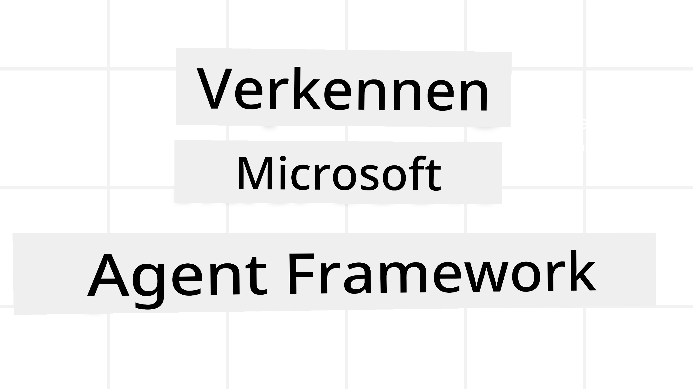
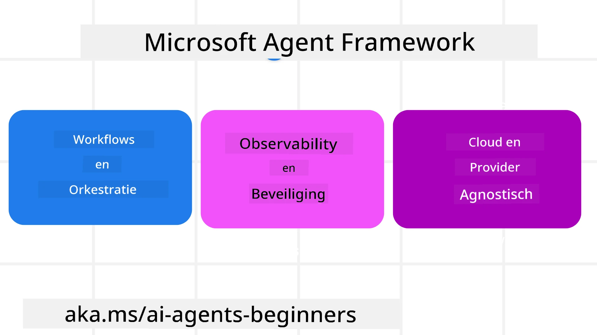
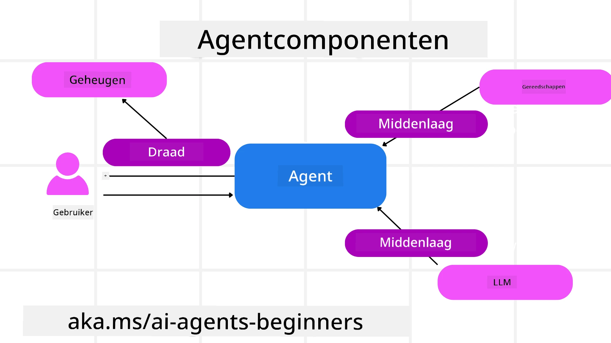

# Verkenning van Microsoft Agent Framework



### Inleiding

Deze les behandelt:

- Begrip van Microsoft Agent Framework: Belangrijkste functies en waarde  
- Verkenning van de kernconcepten van Microsoft Agent Framework
- Geavanceerde MAF-patronen: Workflows, Middleware en Geheugen

## Leerdoelen

Na het voltooien van deze les weet je hoe je:

- Productieklaar AI-agenten bouwt met Microsoft Agent Framework
- De kernfuncties van Microsoft Agent Framework toepast op jouw agentische use-cases
- Geavanceerde patronen gebruikt, waaronder workflows, middleware en observability

## Codevoorbeelden

Codevoorbeelden voor [Microsoft Agent Framework (MAF)](https://aka.ms/ai-agents-beginners/agent-framewrok) zijn te vinden in deze repository onder de bestanden `xx-python-agent-framework` en `xx-dotnet-agent-framework`.

## Microsoft Agent Framework begrijpen



[Microsoft Agent Framework (MAF)](https://aka.ms/ai-agents-beginners/agent-framewrok) is het uniforme framework van Microsoft voor het bouwen van AI-agenten. Het biedt de flexibiliteit om de uiteenlopende agentische use-cases aan te pakken die zowel in productie- als onderzoeksomgevingen voorkomen, waaronder:

- **Sequentiële agentorchestratie** in scenario's waar stap-voor-staphandleidingen nodig zijn.
- **Gelijktijdige orchestratie** in scenario's waar agenten taken tegelijk moeten voltooien.
- **Groepschatorchestratie** in scenario's waar agenten samenwerken aan één taak.
- **Overdrachtsorchestratie** in scenario's waar agenten taken aan elkaar overdragen zodra subtaken voltooid zijn.
- **Magnetische Orchestratie** in scenario's waar een manager-agent een takenlijst aanmaakt en wijzigt en de coördinatie van subagenten beheert om de taak te voltooien.

Om AI-agenten in productie te leveren, bevat MAF ook functies voor:

- **Observability** door gebruik te maken van OpenTelemetry waarbij elke actie van de AI-agent wordt gevolgd, inclusief tool-aanroepen, orchestratiestappen, redeneerstromen en prestatiemonitoring via Microsoft Foundry dashboards.
- **Beveiliging** door agenten native te hosten op Microsoft Foundry, met beveiligingscontroles zoals op rollen gebaseerde toegang, privégegevensverwerking en ingebouwde inhoudsveiligheid.
- **Duurzaamheid** doordat agentdraden en workflows kunnen pauzeren, hervatten en herstellen van fouten, wat langere processen mogelijk maakt.
- **Controle** omdat workflows met menselijke tussenkomst worden ondersteund, waarbij taken als menselijk goedkeuringsverplicht worden gemarkeerd.

Microsoft Agent Framework richt zich ook op interoperabiliteit door:

- **Cloud-agnostisch te zijn** - Agenten kunnen draaien in containers, on-premises en in meerdere verschillende clouds.
- **Provider-agnostisch te zijn** - Agenten kunnen worden gemaakt via jouw voorkeurs-SDK, waaronder Azure OpenAI en OpenAI
- **Open standaarden te integreren** - Agenten kunnen protocollen gebruiken zoals Agent-to-Agent (A2A) en Model Context Protocol (MCP) om andere agenten en tools te vinden en te gebruiken.
- **Plugins en Connectors** - Verbindingen kunnen worden gemaakt met data- en geheugendiensten zoals Microsoft Fabric, SharePoint, Pinecone en Qdrant.

Laten we bekijken hoe deze functies worden toegepast op enkele kernconcepten van Microsoft Agent Framework.

## Kernconcepten van Microsoft Agent Framework

### Agenten



**Agenten maken**

Het maken van een agent gebeurt door de inferentiedienst (LLM-provider), een
set instructies voor de AI-agent om te volgen, en een toegewezen `naam` te definiëren:

```python
agent = AzureOpenAIChatClient(credential=AzureCliCredential()).create_agent( instructions="You are good at recommending trips to customers based on their preferences.", name="TripRecommender" )
```

Bovenstaand gebruikt `Azure OpenAI` maar agenten kunnen worden gemaakt met verschillende diensten, waaronder `Microsoft Foundry Agent Service`:

```python
AzureAIAgentClient(async_credential=credential).create_agent( name="HelperAgent", instructions="You are a helpful assistant." ) as agent
```

OpenAI `Responses`, `ChatCompletion` API's

```python
agent = OpenAIResponsesClient().create_agent( name="WeatherBot", instructions="You are a helpful weather assistant.", )
```

```python
agent = OpenAIChatClient().create_agent( name="HelpfulAssistant", instructions="You are a helpful assistant.", )
```

of remote agenten met behulp van het A2A-protocol:

```python
agent = A2AAgent( name=agent_card.name, description=agent_card.description, agent_card=agent_card, url="https://your-a2a-agent-host" )
```

**Agenten uitvoeren**

Agenten worden uitgevoerd met de `.run` of `.run_stream` methoden voor respectievelijk niet-streaming of streaming antwoorden.

```python
result = await agent.run("What are good places to visit in Amsterdam?")
print(result.text)
```

```python
async for update in agent.run_stream("What are the good places to visit in Amsterdam?"):
    if update.text:
        print(update.text, end="", flush=True)

```

Elke agentuitvoering kan ook opties hebben om parameters aan te passen, zoals de door de agent gebruikte `max_tokens`, `tools` die de agent kan aanroepen, en zelfs het `model` dat voor de agent wordt gebruikt.

Dit is nuttig in gevallen waar specifieke modellen of tools nodig zijn om de taak van de gebruiker te voltooien.

**Tools**

Tools kunnen zowel bij het definiëren van de agent worden gedefinieerd:

```python
def get_attractions( location: Annotated[str, Field(description="The location to get the top tourist attractions for")], ) -> str: """Get the top tourist attractions for a given location.""" return f"The top attractions for {location} are." 


# Bij het direct aanmaken van een ChatAgent

agent = ChatAgent( chat_client=OpenAIChatClient(), instructions="You are a helpful assistant", tools=[get_attractions]

```

als ook tijdens het uitvoeren van de agent:

```python

result1 = await agent.run( "What's the best place to visit in Seattle?", tools=[get_attractions] # Hulpmiddel alleen voor deze run beschikbaar )
```

**Agent Threads**

Agent Threads worden gebruikt om multi-turn gesprekken te beheren. Threads kunnen worden gemaakt door:

- Gebruik te maken van `get_new_thread()` waarmee de thread in de loop van de tijd kan worden opgeslagen
- Een thread automatisch te creëren bij het uitvoeren van een agent waarbij de thread alleen tijdens die run bestaat.

Om een thread te maken ziet de code er als volgt uit:

```python
# Maak een nieuwe thread aan.
thread = agent.get_new_thread() # Voer de agent uit met de thread.
response = await agent.run("Hello, I am here to help you book travel. Where would you like to go?", thread=thread)

```

Je kunt de thread vervolgens serialiseren om deze later op te slaan:

```python
# Maak een nieuwe thread aan.
thread = agent.get_new_thread() 

# Voer de agent uit met de thread.

response = await agent.run("Hello, how are you?", thread=thread) 

# Seriëleer de thread voor opslag.

serialized_thread = await thread.serialize() 

# Deserialiseer de threadstatus na het laden uit opslag.

resumed_thread = await agent.deserialize_thread(serialized_thread)
```

**Agent Middleware**

Agenten communiceren met tools en LLM's om taken van gebruikers te voltooien. In bepaalde scenario's willen we tussen deze interacties acties uitvoeren of volgen. Agent middleware maakt dit mogelijk door:

*Function Middleware*

Deze middleware stelt ons in staat een actie uit te voeren tussen de agent en een functie/tool die wordt aangeroepen. Een voorbeeld van gebruik is het loggen van de functieaanroep.

In de onderstaande code bepaalt `next` of de volgende middleware of de eigenlijke functie wordt aangeroepen.

```python
async def logging_function_middleware(
    context: FunctionInvocationContext,
    next: Callable[[FunctionInvocationContext], Awaitable[None]],
) -> None:
    """Function middleware that logs function execution."""
    # Voorverwerking: Loggen vóór functietoepassing
    print(f"[Function] Calling {context.function.name}")

    # Ga door naar de volgende middleware of functietoepassing
    await next(context)

    # Naverwerking: Loggen na functietoepassing
    print(f"[Function] {context.function.name} completed")
```

*Chat Middleware*

Deze middleware stelt ons in staat een actie uit te voeren of te loggen tussen de agent en de aanvragen aan de LLM.

Dit bevat belangrijke informatie zoals de `messages` die naar de AI-service worden verzonden.

```python
async def logging_chat_middleware(
    context: ChatContext,
    next: Callable[[ChatContext], Awaitable[None]],
) -> None:
    """Chat middleware that logs AI interactions."""
    # Voorbewerking: Loggen voor AI-aanroep
    print(f"[Chat] Sending {len(context.messages)} messages to AI")

    # Ga door naar volgende middleware of AI-service
    await next(context)

    # Nabewerking: Loggen na AI-respons
    print("[Chat] AI response received")

```

**Agent Memory**

Zoals behandeld in de les `Agentic Memory`, is geheugen een belangrijk element om de agent in staat te stellen te opereren over verschillende contexten. MAF biedt verschillende types geheugen:

*In-Memory Opslag*

Dit is het geheugen dat tijdens de applicatierun in threads wordt opgeslagen.

```python
# Maak een nieuwe thread aan.
thread = agent.get_new_thread() # Voer de agent uit met de thread.
response = await agent.run("Hello, I am here to help you book travel. Where would you like to go?", thread=thread)
```

*Persistent Messages*

Dit geheugen wordt gebruikt voor het opslaan van gesprekshistorie over verschillende sessies. Het wordt gedefinieerd met behulp van de `chat_message_store_factory`:

```python
from agent_framework import ChatMessageStore

# Maak een aangepaste berichtopslag
def create_message_store():
    return ChatMessageStore()

agent = ChatAgent(
    chat_client=OpenAIChatClient(),
    instructions="You are a Travel assistant.",
    chat_message_store_factory=create_message_store
)

```

*Dynamic Memory*

Dit geheugen wordt aan de context toegevoegd voordat agenten worden uitgevoerd. Deze geheugens kunnen worden opgeslagen in externe services zoals mem0:

```python
from agent_framework.mem0 import Mem0Provider

# Mem0 gebruiken voor geavanceerde geheugenmogelijkheden
memory_provider = Mem0Provider(
    api_key="your-mem0-api-key",
    user_id="user_123",
    application_id="my_app"
)

agent = ChatAgent(
    chat_client=OpenAIChatClient(),
    instructions="You are a helpful assistant with memory.",
    context_providers=memory_provider
)

```

**Agent Observability**

Observability is belangrijk voor het bouwen van betrouwbare en onderhoudbare agentische systemen. MAF integreert met OpenTelemetry om tracing en metingen te bieden voor betere observability.

```python
from agent_framework.observability import get_tracer, get_meter

tracer = get_tracer()
meter = get_meter()
with tracer.start_as_current_span("my_custom_span"):
    # doe iets
    pass
counter = meter.create_counter("my_custom_counter")
counter.add(1, {"key": "value"})
```

### Workflows

MAF biedt workflows die vooraf gedefinieerde stappen zijn om een taak te voltooien en AI-agenten als componenten in die stappen omvatten.

Workflows bestaan uit verschillende componenten die zorgen voor betere controleflow. Workflows maken ook **multi-agent orchestratie** en **checkpointing** mogelijk om de workflowstatussen op te slaan.

De kerncomponenten van een workflow zijn:

**Executors**

Executors ontvangen inputberichten, voeren hun toegewezen taken uit en produceren vervolgens een outputbericht. Dit verplaatst de workflow vooruit naar het voltooien van de grotere taak. Executors kunnen AI-agenten of aangepaste logica zijn.

**Edges**

Edges worden gebruikt om de stroom van berichten in een workflow te definiëren. Dit kunnen zijn:

*Direct Edges* - Simpele één-op-één verbindingen tussen executors:

```python
from agent_framework import WorkflowBuilder

builder = WorkflowBuilder()
builder.add_edge(source_executor, target_executor)
builder.set_start_executor(source_executor)
workflow = builder.build()
```

*Conditional Edges* - Geactiveerd nadat aan een bepaalde voorwaarde is voldaan. Bijvoorbeeld, wanneer hotelkamers niet beschikbaar zijn, kan een executor andere opties voorstellen.

*Switch-case Edges* - Richten berichten naar verschillende executors op basis van gedefinieerde voorwaarden. Bijvoorbeeld, als een reiziger prioritaire toegang heeft, worden hun taken via een andere workflow afgehandeld.

*Fan-out Edges* - Sturen één bericht naar meerdere doelen.

*Fan-in Edges* - Verzamelen meerdere berichten van verschillende executors en sturen naar één doel.

**Events**

Om betere observability van workflows te bieden, biedt MAF ingebouwde events voor uitvoering, waaronder:

- `WorkflowStartedEvent`  - Workflowuitvoering begint
- `WorkflowOutputEvent` - Workflow produceert een output
- `WorkflowErrorEvent` - Workflow ondervindt een fout
- `ExecutorInvokeEvent`  - Executor begint met verwerken
- `ExecutorCompleteEvent`  -  Executor voltooit verwerking
- `RequestInfoEvent` - Er wordt een aanvraag gedaan

## Gevorderde MAF-patronen

De bovenstaande secties behandelen de kernconcepten van Microsoft Agent Framework. Naarmate je complexere agenten bouwt, zijn hier enkele gevorderde patronen om te overwegen:

- **Middleware-samenstelling**: Koppel meerdere middleware-handlers (logging, authenticatie, rate-limiting) met function- en chat-middleware voor fijne controle over agentgedrag.
- **Workflow-checkpointing**: Gebruik workflow-events en serialisatie om langlopende agentprocessen op te slaan en te hervatten.
- **Dynamische toolselectie**: Combineer RAG over toolbeschrijvingen met MAF's toolregistratie om alleen relevante tools per query aan te bieden.
- **Multi-agent overdracht**: Gebruik workflow-edges en conditionele routering om overdrachten tussen gespecialiseerde agenten te orkestreren.

## Codevoorbeelden

Codevoorbeelden voor Microsoft Agent Framework zijn te vinden in deze repository onder de bestanden `xx-python-agent-framework` en `xx-dotnet-agent-framework`.

## Meer vragen over Microsoft Agent Framework?

Doe mee aan de [Microsoft Foundry Discord](https://aka.ms/ai-agents/discord) om andere leerlingen te ontmoeten, office hours bij te wonen en antwoorden te krijgen op je AI Agents-vragen.

---

<!-- CO-OP TRANSLATOR DISCLAIMER START -->
**Disclaimer**:
Dit document is vertaald met behulp van de AI-vertalingsdienst [Co-op Translator](https://github.com/Azure/co-op-translator). Hoewel we streven naar nauwkeurigheid, dient u er rekening mee te houden dat geautomatiseerde vertalingen fouten of onnauwkeurigheden kunnen bevatten. Het oorspronkelijke document in de oorspronkelijke taal wordt beschouwd als de gezaghebbende bron. Voor kritieke informatie wordt professionele menselijke vertaling aanbevolen. Wij zijn niet aansprakelijk voor eventuele misverstanden of verkeerde interpretaties die voortkomen uit het gebruik van deze vertaling.
<!-- CO-OP TRANSLATOR DISCLAIMER END -->