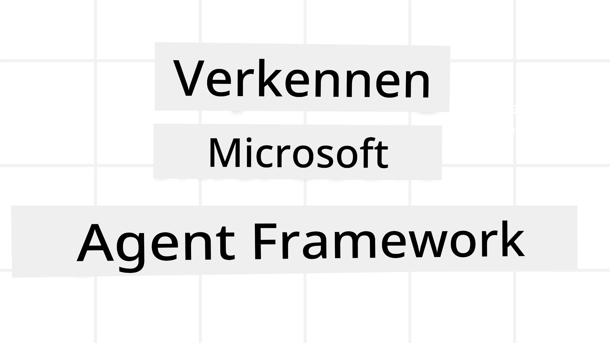
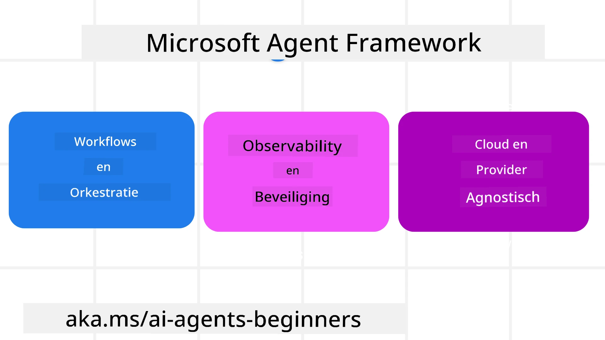
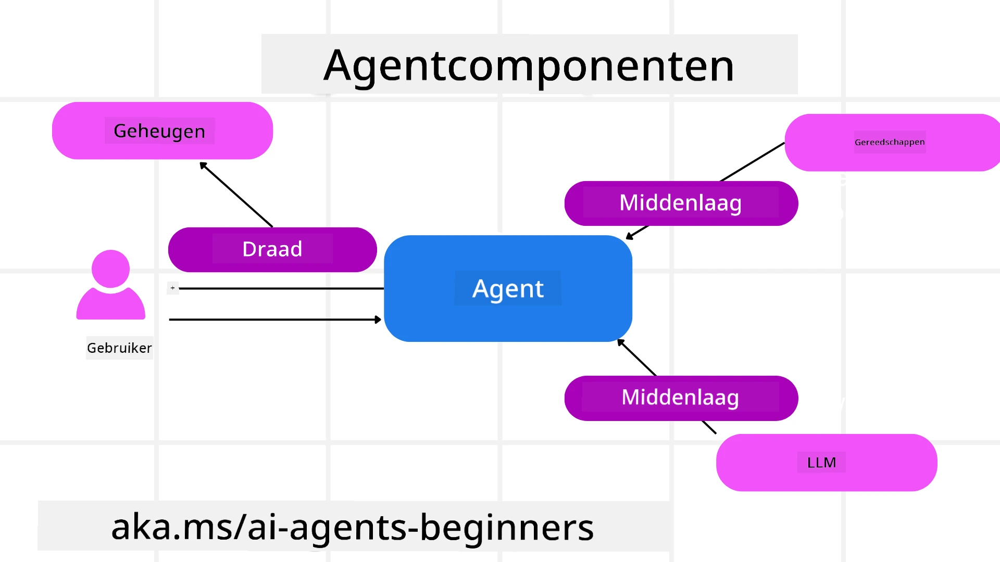

# Verkennen van Microsoft Agent Framework



### Inleiding

Deze les behandelt:

- Begrijpen van Microsoft Agent Framework: Belangrijkste kenmerken en waarde  
- Verkennen van de kernconcepten van Microsoft Agent Framework
- Geavanceerde MAF-patronen: Workflows, middleware en geheugen

## Leerdoelen

Na het voltooien van deze les weet je hoe je:

- Productieklaar AI-agents bouwt met Microsoft Agent Framework
- De kernfuncties van Microsoft Agent Framework toepast op jouw agentuse-cases
- Geavanceerde patronen gebruikt, waaronder workflows, middleware en observability

## Codevoorbeelden

Codevoorbeelden voor [Microsoft Agent Framework (MAF)](https://learn.microsoft.com/en-us/agent-framework/overview/?wt.mc_id=youtube_26688_organicsocial_reactor&pivots=programming-language-python) zijn te vinden in deze repository onder `xx-python-agent-framework` en `xx-dotnet-agent-framework` bestanden.

## Begrip van Microsoft Agent Framework



[Microsoft Agent Framework (MAF)](https://learn.microsoft.com/en-us/agent-framework/overview/?wt.mc_id=youtube_26688_organicsocial_reactor&pivots=programming-language-python) is Microsofts uniform framework voor het bouwen van AI-agents. Het biedt de flexibiliteit om de grote verscheidenheid aan agentuse-cases aan te pakken die zowel in productie als onderzoeksomgevingen voorkomen, waaronder:

- **Sequentiële agent-orkestratie** in scenario's waar stapsgewijze workflows nodig zijn.
- **Gelijktijdige orkestratie** in scenario's waar agents taken tegelijkertijd moeten uitvoeren.
- **Groepschat-orkestratie** in scenario's waar agents samenwerken aan één taak.
- **Overdracht Orkestratie** in scenario's waar agents taken aan elkaar overdragen na het voltooien van subtaken.
- **Magnetische Orkestratie** in scenario's waar een manager-agent een takenlijst maakt en wijzigt en de coördinatie van subagents beheert om de taak te voltooien.

Om AI-agents in productie te leveren, heeft MAF ook functies voor:

- **Observability** via OpenTelemetry waarbij elke actie van de AI-agent wordt gevolgd, inclusief toolaanroepen, orkestratiestappen, redeneerstromen en prestatiebewaking via Microsoft Foundry dashboards.
- **Beveiliging** door agents native te hosten op Microsoft Foundry, met beveiligingscontroles zoals rolgebaseerde toegang, vertrouwelijke gegevensverwerking en ingebouwde inhoudsveiligheid.
- **Duurzaamheid** doordat agent-threads en workflows kunnen pauzeren, hervatten en herstellen van fouten, wat langere processen mogelijk maakt.
- **Controle** doordat workflows met mens in de lus worden ondersteund waarbij taken als goedkeuringsplichtig kunnen worden gemarkeerd.

Microsoft Agent Framework richt zich ook op interoperabiliteit door:

- **Cloud-neutraal te zijn** - Agents kunnen draaien in containers, on-premises, en over meerdere verschillende clouds.
- **Provider-onafhankelijk te zijn** - Agents kunnen worden gemaakt via jouw favoriete SDK, waaronder Azure OpenAI en OpenAI
- **Open standaarden te integreren** - Agents kunnen protocollen als Agent-to-Agent (A2A) en Model Context Protocol (MCP) gebruiken om andere agents en tools te ontdekken en te gebruiken.
- **Plugins en connectors** - Verbindingen kunnen worden gemaakt met data- en geheugendiensten zoals Microsoft Fabric, SharePoint, Pinecone en Qdrant.

Laten we bekijken hoe deze functies worden toegepast op enkele kernconcepten van Microsoft Agent Framework.

## Kernconcepten van Microsoft Agent Framework

### Agents



**Agents maken**

Het maken van een agent gebeurt door het definiëren van de inferentieservice (LLM-provider), een
set instructies voor de AI-agent om te volgen, en een toegewezen `naam`:

```python
agent = AzureOpenAIChatClient(credential=AzureCliCredential()).create_agent( instructions="You are good at recommending trips to customers based on their preferences.", name="TripRecommender" )
```

Bovenstaand voorbeeld gebruikt `Azure OpenAI` maar agents kunnen worden gemaakt met diverse services, waaronder `Microsoft Foundry Agent Service`:

```python
AzureAIAgentClient(async_credential=credential).create_agent( name="HelperAgent", instructions="You are a helpful assistant." ) as agent
```

OpenAI `Responses`, `ChatCompletion` API's

```python
agent = OpenAIResponsesClient().create_agent( name="WeatherBot", instructions="You are a helpful weather assistant.", )
```

```python
agent = OpenAIChatClient().create_agent( name="HelpfulAssistant", instructions="You are a helpful assistant.", )
```

of [MiniMax](https://platform.minimaxi.com/), dat een OpenAI-compatibele API levert met grote contextvensters (tot 204.000 tokens):

```python
agent = OpenAIChatClient(base_url="https://api.minimax.io/v1", api_key=os.environ["MINIMAX_API_KEY"], model_id="MiniMax-M3").create_agent( name="HelpfulAssistant", instructions="You are a helpful assistant.", )
```

of externe agents via het A2A-protocol:

```python
agent = A2AAgent( name=agent_card.name, description=agent_card.description, agent_card=agent_card, url="https://your-a2a-agent-host" )
```

**Agents uitvoeren**

Agents worden uitgevoerd via de `.run` of `.run_stream` methoden voor respectievelijk niet-streamende of streamende antwoorden.

```python
result = await agent.run("What are good places to visit in Amsterdam?")
print(result.text)
```

```python
async for update in agent.run_stream("What are the good places to visit in Amsterdam?"):
    if update.text:
        print(update.text, end="", flush=True)

```

Elke agent-run kan ook opties bevatten om parameters aan te passen zoals `max_tokens` gebruikt door de agent, `tools` die de agent kan aanroepen, en zelfs het gebruikte `model`.

Dit is nuttig in situaties waar specifieke modellen of tools vereist zijn om een taak van de gebruiker te voltooien.

**Tools**

Tools kunnen worden gedefinieerd zowel bij het definiëren van de agent:

```python
def get_attractions( location: Annotated[str, Field(description="The location to get the top tourist attractions for")], ) -> str: """Get the top tourist attractions for a given location.""" return f"The top attractions for {location} are." 


# Bij het direct aanmaken van een ChatAgent

agent = ChatAgent( chat_client=OpenAIChatClient(), instructions="You are a helpful assistant", tools=[get_attractions]

```

en ook bij het uitvoeren van de agent:

```python

result1 = await agent.run( "What's the best place to visit in Seattle?", tools=[get_attractions] # Tool alleen voor deze uitvoering beschikbaar )
```

**Agent Threads**

Agent Threads worden gebruikt om gesprekken met meerdere beurten te behandelen. Threads kunnen worden gemaakt door:

- Gebruik te maken van `get_new_thread()`, wat het opslaan van de thread in de tijd mogelijk maakt
- Automatisch een thread te creëren bij het uitvoeren van een agent, waarbij de thread alleen tijdens de huidige run bestaat.

Om een thread te maken ziet de code er zo uit:

```python
# Maak een nieuwe thread aan.
thread = agent.get_new_thread() # Voer de agent uit met de thread.
response = await agent.run("Hello, I am here to help you book travel. Where would you like to go?", thread=thread)

```

Je kunt de thread daarna serialiseren om later op te slaan:

```python
# Maak een nieuwe thread aan.
thread = agent.get_new_thread() 

# Voer de agent uit met de thread.

response = await agent.run("Hello, how are you?", thread=thread) 

# Seriëleer de thread voor opslag.

serialized_thread = await thread.serialize() 

# Deserialiseer de thread status na het laden uit opslag.

resumed_thread = await agent.deserialize_thread(serialized_thread)
```

**Agent Middleware**

Agents interacteren met tools en LLMs om taken van gebruikers te voltooien. In bepaalde scenario's willen we tussen deze interacties acties uitvoeren of volgen. Agent middleware maakt dit mogelijk door:

*Function Middleware*

Deze middleware laat ons toe een actie uit te voeren tussen de agent en een functie/tool die wordt aangeroepen. Een voorbeeld is het loggen van de functieaanroep.

In onderstaande code bepaalt `next` of de volgende middleware of de eigenlijke functie moet worden aangeroepen.

```python
async def logging_function_middleware(
    context: FunctionInvocationContext,
    next: Callable[[FunctionInvocationContext], Awaitable[None]],
) -> None:
    """Function middleware that logs function execution."""
    # Voorbewerking: Log voor de functieverwerking
    print(f"[Function] Calling {context.function.name}")

    # Ga verder naar de volgende middleware of functie-uitvoering
    await next(context)

    # Naverwerking: Log na de functieverwerking
    print(f"[Function] {context.function.name} completed")
```

*Chat Middleware*

Deze middleware laat ons toe een actie uit te voeren of te loggen tussen de agent en de verzoeken richting de LLM.

Dit bevat belangrijke informatie zoals de `messages` die naar de AI-service worden gezonden.

```python
async def logging_chat_middleware(
    context: ChatContext,
    next: Callable[[ChatContext], Awaitable[None]],
) -> None:
    """Chat middleware that logs AI interactions."""
    # Voorbewerking: Loggen vóór AI-aanroep
    print(f"[Chat] Sending {len(context.messages)} messages to AI")

    # Ga door naar de volgende middleware of AI-service
    await next(context)

    # Naverwerking: Loggen na AI-respons
    print("[Chat] AI response received")

```

**Agent Geheugen**

Zoals behandeld in de `Agentic Memory` les, is geheugen een belangrijk element om de agent over verschillende contexten te laten werken. MAF biedt verschillende soorten geheugen:

*In-Memory Opslag*

Dit is het geheugen dat in threads wordt opgeslagen tijdens het draaien van de applicatie.

```python
# Maak een nieuwe thread aan.
thread = agent.get_new_thread() # Voer de agent uit met de thread.
response = await agent.run("Hello, I am here to help you book travel. Where would you like to go?", thread=thread)
```

*Persistente berichten*

Dit geheugen wordt gebruikt om gespreksgeschiedenis op te slaan over verschillende sessies heen. Het wordt gedefinieerd met de `chat_message_store_factory` :

```python
from agent_framework import ChatMessageStore

# Maak een aangepaste berichtenopslag
def create_message_store():
    return ChatMessageStore()

agent = ChatAgent(
    chat_client=OpenAIChatClient(),
    instructions="You are a Travel assistant.",
    chat_message_store_factory=create_message_store
)

```

*Dynamisch geheugen*

Dit geheugen wordt aan de context toegevoegd voordat agents worden uitgevoerd. Deze geheugen kunnen worden opgeslagen in externe diensten zoals mem0:

```python
from agent_framework.mem0 import Mem0Provider

# Gebruik van Mem0 voor geavanceerde geheugencapaciteiten
memory_provider = Mem0Provider(
    api_key="your-mem0-api-key",
    user_id="user_123",
    application_id="my_app"
)

agent = ChatAgent(
    chat_client=OpenAIChatClient(),
    instructions="You are a helpful assistant with memory.",
    context_providers=memory_provider
)

```

**Agent Observability**

Observability is belangrijk om betrouwbare en onderhoudbare agentische systemen te bouwen. MAF integreert met OpenTelemetry om tracing en meters voor betere observability te bieden.

```python
from agent_framework.observability import get_tracer, get_meter

tracer = get_tracer()
meter = get_meter()
with tracer.start_as_current_span("my_custom_span"):
    # doe iets
    pass
counter = meter.create_counter("my_custom_counter")
counter.add(1, {"key": "value"})
```

### Workflows

MAF biedt workflows die vooraf gedefinieerde stappen zijn om een taak te voltooien en AI-agents als componenten in die stappen bevatten.

Workflows bestaan uit verschillende componenten die een betere controle over de stroom mogelijk maken. Workflows maken ook **multi-agent orkestratie** en **checkpointing** mogelijk om workflow-staten op te slaan.

De kerncomponenten van een workflow zijn:

**Executors**

Executors ontvangen inputberichten, voeren hun toegewezen taken uit, en produceren dan een outputbericht. Dit brengt de workflow vooruit richting het voltooien van de grotere taak. Executors kunnen AI-agents of aangepaste logica zijn.

**Edges**

Edges worden gebruikt om de stroom van berichten in een workflow te definiëren. Deze kunnen zijn:

*Directe Edges* - Eenvoudige één-op-één verbindingen tussen executors:

```python
from agent_framework import WorkflowBuilder

builder = WorkflowBuilder()
builder.add_edge(source_executor, target_executor)
builder.set_start_executor(source_executor)
workflow = builder.build()
```

*Conditionele Edges* - Geactiveerd nadat aan een bepaalde voorwaarde is voldaan. Bijvoorbeeld, als hotelkamers niet beschikbaar zijn, kan een executor andere opties voorstellen.

*Switch-case Edges* - Sturen berichten naar verschillende executors op basis van gedefinieerde voorwaarden. Bijvoorbeeld als een reisklant prioriteitstoegang heeft en hun taken via een andere workflow worden afgehandeld.

*Fan-out Edges* - Stuur één bericht naar meerdere doelen.

*Fan-in Edges* - Verzamel meerdere berichten van verschillende executors en stuur naar één doel.

**Events**

Om betere observability in workflows te bieden, heeft MAF ingebouwde events voor uitvoering, waaronder:

- `WorkflowStartedEvent`  - Workflow-executie begint
- `WorkflowOutputEvent` - Workflow produceert een output
- `WorkflowErrorEvent` - Workflow ondervindt een fout
- `ExecutorInvokeEvent`  - Executor start verwerking
- `ExecutorCompleteEvent`  -  Executor beëindigt verwerking
- `RequestInfoEvent` - Een verzoek wordt gedaan

## Geavanceerde MAF-patronen

De bovenstaande secties behandelen de kernconcepten van Microsoft Agent Framework. Naarmate je complexere agents bouwt, zijn hier enkele geavanceerde patronen om te overwegen:

- **Middleware Samenstelling**: Keten meerdere middleware handlers (logging, authenticatie, rate-limiting) met function en chat middleware voor fijne controle over agentgedrag.
- **Workflow Checkpointing**: Gebruik workflow-events en serialisatie om langlopende agentprocessen op te slaan en te hervatten.
- **Dynamische toolselectie**: Combineer RAG over toolbeschrijvingen met MAF's toolregistratie om alleen relevante tools per query te tonen.
- **Multi-agent overdracht**: Gebruik workflow-edges en conditionele routering om overdrachten tussen gespecialiseerde agents te orkestreren.

## Hosting van LangChain / LangGraph Agents op Microsoft Foundry

Microsoft Agent Framework is **framework-interopabel** — je bent niet beperkt tot agents geschreven met MAF. Als je al een agent hebt gebouwd met **LangChain** of **LangGraph**, kun je deze als **Microsoft Foundry hosted agent** draaien zodat Foundry runtime, sessies, scaling, identiteit en protocolendpoints voor je beheert, terwijl je agentlogica in LangGraph blijft.

Dit gebeurt met het `langchain_azure_ai.agents.hosting` pakket, dat een gecompileerde LangGraph-grafiek exposeert over dezelfde protocollen die Foundry hosted agents gebruiken.

**1. Installeer de hosting extra:**

```bash
pip install -U "langchain-azure-ai[hosting]>=1.2.4" azure-identity
```

De `hosting` extra installeert de Foundry protocol bibliotheken: `azure-ai-agentserver-responses` (de OpenAI-compatibele `/responses` endpoint) en `azure-ai-agentserver-invocations` (de generieke `/invocations` endpoint).

**2. Kies een hosting protocol:**

| Protocol | Hostklasse | Endpoint | Gebruik wanneer |
|----------|------------|----------|--------------|
| **Responses** | `ResponsesHostServer` | `/responses` | Je wilt OpenAI-compatibele chat, streaming, antwoordgeschiedenis, en conversatiedraden — de aanbevolen standaard voor conversatieagents. |
| **Invocations** | `InvocationsHostServer` | `/invocations` | Je hebt een aangepaste JSON-vorm nodig, een webhook-achtige endpoint, of niet-conversationale verwerking. |

Omdat de **Responses API de primaire API is voor agent-ontwikkeling in Foundry**, begin je voor de meeste agents met `ResponsesHostServer`.

**3. Configureer omgevingsvariabelen** (`az login` eerst, zodat `DefaultAzureCredential` kan authenticeren):

```bash
export FOUNDRY_PROJECT_ENDPOINT="https://<resource>.services.ai.azure.com/api/projects/<project>"
export FOUNDRY_MODEL_NAME="gpt-5-mini"
```

Wanneer de agent later draait als hosted agent in Foundry, injecteert het platform automatisch `FOUNDRY_PROJECT_ENDPOINT`.

**4. Exposeer een LangGraph agent over het Responses-protocol:**

```python
import os

from azure.ai.projects import AIProjectClient
from azure.identity import DefaultAzureCredential, get_bearer_token_provider
from langchain.agents import create_agent
from langchain_openai import ChatOpenAI
from langchain_azure_ai.agents.hosting import ResponsesHostServer

_AZURE_AI_SCOPE = "https://ai.azure.com/.default"


def build_chat_model() -> ChatOpenAI:
    project_endpoint = os.environ["FOUNDRY_PROJECT_ENDPOINT"].rstrip("/")
    deployment = os.environ.get("FOUNDRY_MODEL_NAME", "gpt-5-mini")
    credential = DefaultAzureCredential()
    project = AIProjectClient(endpoint=project_endpoint, credential=credential)
    openai_client = project.get_openai_client()
    token_provider = get_bearer_token_provider(credential, _AZURE_AI_SCOPE)

    # ChatOpenAI richt zich hier op het OpenAI-compatibele (Responses) eindpunt van het Foundry-project.
    return ChatOpenAI(
        model=deployment,
        base_url=str(openai_client.base_url),
        api_key=token_provider,
    )


def main() -> None:
    graph = create_agent(build_chat_model(), tools=[])
    port = int(os.environ.get("PORT", "8088"))
    ResponsesHostServer(graph).run(port=port)


if __name__ == "__main__":
    main()
```

Draai het lokaal met `python main.py`, en stuur dan een Responses-verzoek naar `http://localhost:8088/responses`.

**Belangrijke eigenschappen:**

- **Gesprekken**: Clients zetten een gesprek voort door `previous_response_id` of een `conversation` ID mee te geven. Als je grafiek gecompileerd is met een LangGraph checkpointer, koppelt Foundry de conversatiestatus aan de checkpoint (gebruik een duurzame checkpointer in productie; `MemorySaver` is prima voor lokaal testen).
- **Mens-in-de-lus**: Als jouw grafiek LangGraph `interrupt()` gebruikt, toont `ResponsesHostServer` de openstaande interrupt als een Responses `function_call`/`mcp_approval_request` item, en hervatten clients met een bijpassende `function_call_output` / `mcp_approval_response`.
- **Deployen naar Foundry**: Gebruik de Azure Developer CLI — `azd ext install azure.ai.agents`, `azd ai agent init -m <manifest>`, `azd ai agent run` (lokaal, vereist Docker), daarna `azd provision` en `azd deploy`. Hosted-agent deployment vereist de **Foundry Project Manager** rol.

Een uitvoerbare versie van dit voorbeeld staat in [code-samples/14-langchain-hosted-agent.py](../../../14-microsoft-agent-framework/code-samples/14-langchain-hosted-agent.py). Voor de volledige walkthrough (Invocations-protocol, aangepaste verzoekschema's, en probleemoplossing), zie [Host LangGraph agents as Foundry hosted agents](https://learn.microsoft.com/azure/foundry/how-to/develop/langchain-hosted-agents).

## Codevoorbeelden

Codevoorbeelden voor Microsoft Agent Framework zijn te vinden in deze repository onder `xx-python-agent-framework` en `xx-dotnet-agent-framework` bestanden.

## Meer vragen over Microsoft Agent Framework?

Word lid van de [Microsoft Foundry Discord](https://discord.com/invite/ATgtXmAS5D) om andere leerlingen te ontmoeten, kantooruren bij te wonen en je vragen over AI Agents beantwoord te krijgen.
## Vorige les

[Geheugen voor AI Agents](../13-agent-memory/README.md)

## Volgende les

[Bouwen van Computer Gebruik Agents (CUA)](../15-browser-use/README.md)

---

<!-- CO-OP TRANSLATOR DISCLAIMER START -->
**Disclaimer**:
Dit document is vertaald met behulp van de AI vertaaldienst [Co-op Translator](https://github.com/Azure/co-op-translator). Hoewel we streven naar nauwkeurigheid, dient u er rekening mee te houden dat geautomatiseerde vertalingen fouten of onnauwkeurigheden kunnen bevatten. Het originele document in de oorspronkelijke taal moet worden beschouwd als de gezaghebbende bron. Voor kritieke informatie wordt professionele menselijke vertaling aanbevolen. Wij zijn niet aansprakelijk voor eventuele misverstanden of verkeerde interpretaties die voortvloeien uit het gebruik van deze vertaling.
<!-- CO-OP TRANSLATOR DISCLAIMER END -->