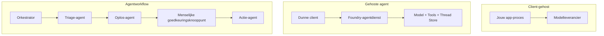
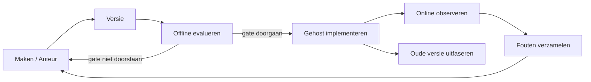
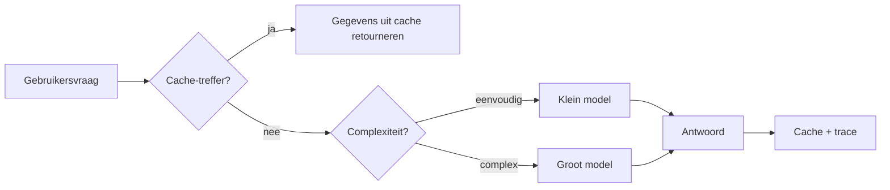
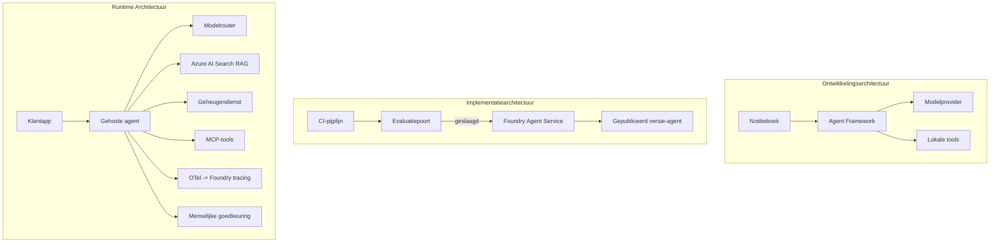

# Implementatie van schaalbare agents met Microsoft Foundry


Tot nu toe in de cursus heb je agents gebouwd die draaien op je laptop, binnen een notebook, aangestuurd door `az login` en een handvol omgevingsvariabelen. Dat is precies de juiste manier om te leren. Het is niet de juiste manier om een agent te laten draaien waar duizenden klanten om 3 uur 's nachts op vertrouwen.

Deze les gaat over de kloof tussen "het werkt op mijn machine" en "het werkt betrouwbaar en betaalbaar in productie." We overbruggen die kloof met behulp van **Microsoft Foundry** en de **Microsoft Foundry Agent Service**, en we doen dat door een echte klantenondersteuningsagent te bouwen die beschikt over tools, ophalen, geheugen, evaluatie en monitoring.

## Introductie

Deze les behandelt:

- Het verschil tussen een **prototype agent** en een **geïmplementeerde agent**, en waarom de overgang vooral gaat over alles *rondom* het model.
- **Implementatiepatronen** voor agents: client-gehost, service-gehost (Hosted Agents), en workflow-georkestreerd.
- De **agent levenscyclus** op Microsoft Foundry — aanmaken, versioneren, implementeren, evalueren, observeren, uitfaseren.
- **Schaalstrategieën**: modelroutering, caching, gelijktijdigheid en stateless ontwerp.
- **Observeerbaarheid** met OpenTelemetry en Foundry tracing.
- **Kostenoptimalisatie** via modelselectie, routering en evaluatiepoorten.
- **Enterprise overwegingen**: governance, menselijke goedkeuring, en het veilig draaien van MCP-servers in productie.

## Leerdoelen

Na het voltooien van deze les weet je hoe je:

- Het juiste implementatiepatroon kiest voor een bepaalde agent workload.
- Een agent implementeert op de Microsoft Foundry Agent Service zodat deze genummerd, beheerd en observeerbaar is.
- Een agent instrumenteert voor tracing en een evaluatiepipeline koppelt die vóór elke release draait.
- Modelroutering en caching toepast om latentie en kosten onder controle te houden op schaal.
- Een menselijke goedkeuringspoort toevoegt voor risicovolle acties en een MCP-server op een productie-veilige manier integreert.

## Vereisten

Deze les gaat ervan uit dat je eerdere lessen hebt afgerond en vertrouwd bent met:

- Het bouwen van agents met het [Microsoft Agent Framework](../14-microsoft-agent-framework/README.md) (Les 14).
- [Toolgebruik](../04-tool-use/README.md) (Les 4) en [Agentic RAG](../05-agentic-rag/README.md) (Les 5).
- [Agent geheugen](../13-agent-memory/README.md) (Les 13) en [Agentic Protocols / MCP](../11-agentic-protocols/README.md) (Les 11).
- [Observeerbaarheid en evaluatie](../10-ai-agents-production/README.md) (Les 10) — deze les bouwt hier direct op voort.

Je hebt ook nodig:

- Een **Azure-abonnement** en een **Microsoft Foundry-project** met ten minste één geïmplementeerd chatmodel.
- De **Azure CLI** is geauthenticeerd (`az login`).
- Python 3.12+ en de pakketten in de repository [`requirements.txt`](../../../requirements.txt).

## Van prototype naar productie: wat verandert er eigenlijk

Een prototype agent en een productie-agent delen dezelfde kernlus — redeneer, roep tools aan, reageer. Wat verandert is alles dat om die lus heen zit. Het model is misschien 20% van een productie-agent; de overige 80% is het operationele skelet.

| Aandachtspunt | Prototype | Productie |
| --- | --- | --- |
| **Hosting** | Draait in je notebook | Draait als een gehoste service, versioneerd en uitgerold |
| **Identiteit** | Je `az login` token | Beheerde identiteit met afgebakende RBAC |
| **Status** | In het geheugen, verloren bij herstart | Uitgelokaliseerd (thread store, geheugenservice) |
| **Foutafhandeling** | Je ziet de traceback | Herhalingen, fallback, dead-letter, waarschuwingen |
| **Kosten** | "Het kost een paar cent" | Bijgehouden per verzoek, gerouteerd, gecached, begroot |
| **Kwaliteit** | Je bekijkt de output visueel | Automatisch geëvalueerd vóór elke release |
| **Vertrouwen** | Je keurt elke actie goed | Beleid + menselijke-in-de-lus voor risicovolle acties |

Houd deze tabel in gedachten. Elke hieronder genoemde sectie correspondeert met een van deze rijen.

## Agent implementatiepatronen

Er zijn drie patronen die je zult gebruiken, vaak in combinatie.

### 1. Client-gehoste Agents

Het agent-object draait binnen *jouw* applicatieproces. Je code roept de modelprovider direct aan; de redeneerlus draait in je service. Dit is wat elke vorige les heeft gedaan.

- **Gebruik dit wanneer** je volledige controle over de lus nodig hebt, aangepaste middleware of als je de agent in een bestaande backend insluit.
- **Nadeel**: je bent zelf verantwoordelijk voor schaalbaarheid, status en veerkracht.

### 2. Gehoste Agents (Foundry Agent Service)

De agent is *geregistreerd als een resource* in Microsoft Foundry. Foundry host de redeneerlus, slaat threads op, handhaaft contentveiligheid en RBAC, en maakt de agent zichtbaar in de Foundry-portal. Je app wordt een dunne client die threads aanmaakt en antwoorden leest.

- **Gebruik dit wanneer** je duurzaamheid, ingebouwde observeerbaarheid, governance en minder operationele complexiteit wilt.
- **Nadeel**: minder controle op laag niveau in ruil voor een beheerde runtime.

### 3. Agent Workflows

Meerdere agents (en tools) worden samengesteld in een graaf met expliciete controleflow — sequentiële stappen, vertakkingen, nodes voor menselijke goedkeuring en duurzame checkpoints die pauzeren en hervatten mogelijk maken. Dit is de Microsoft Agent Framework **Workflows**-functionaliteit toegepast op implementatieschaal.

- **Gebruik dit wanneer** een enkele taak meerdere gespecialiseerde agents omvat of een goedkeuringsstap in het midden vereist.
- **Nadeel**: meer bewegende onderdelen; vereist observatie op orkestratieniveau.



## De agent levenscyclus op Microsoft Foundry

Het implementeren van een agent is geen eenmalige `push`. Het is een lus, en het lijkt erg op een software releasecyclus want dat is het ook.



Het sleutelidee, overgenomen van [Les 10](../10-ai-agents-production/README.md): **offline evaluatie is een poort, geen bijzaak.** Een nieuwe agentversie gaat pas uit als deze aan je evaluatiedrempels voldoet. Online observeerbaarheid voedt daarna echte fouten terug in je offline testset. Dat is de hele lus.

## Schaalsstrategieën

Het schalen van een agent is anders dan het schalen van een stateless web API, omdat elk verzoek meerdere dure model- en tool-aanroepen kan triggeren. Vier technieken dragen het grootste deel van de last.

**Stateless verzoekafhandeling.** Bewaar geen per-gebruiker status in je procesgeheugen. Bewaar conversatiedraden in de Foundry thread store of een geheugenservice zodat elke instantie elk verzoek kan afhandelen. Dit maakt horizontaal schalen mogelijk — voeg instanties toe, geen sticky sessions.

**Modelroutering.** Niet elk verzoek vereist je meest capabele (en duurste) model. Route eenvoudige verzoeken — intentclassificatie, korte feitelijke antwoorden — naar een klein, snel model, en reserveer het grote model voor echte redenering. Foundry's **Model Router** kan dit voor je doen, of je kunt zelf een lichte classifier implementeren. Je bouwt de doe-het-zelf versie in de lab.

**Response caching.** Veel ondersteuningsvragen zijn bijna-dubbelen ("hoe reset ik mijn wachtwoord?"). Cache antwoorden op veelgestelde vragen en serveer ze zonder het model te raadplegen. Zelfs een bescheiden cache-hitpercentage verlaagt kosten en latentie aanzienlijk.

**Gelijktijdigheid en backpressure.** Modelproviders hebben snelheidslimieten. Beperk je gelijktijdigheid, gebruik herhalingen met exponentiële backoff en faal gracieus (een in de wachtrij geplaatste "we zijn ermee bezig"-reactie is beter dan een 500-fout).



## Observeerbaarheid in productie

Je kunt niet beheren wat je niet kunt zien. Zoals behandeld in Les 10, zendt het Microsoft Agent Framework **OpenTelemetry** traces native uit — elke modelaanroep, tool-aanroep en orkestratiestap wordt een span. In productie exporteer je die spans naar Microsoft Foundry (of een andere OTel-compatibele backend) zodat je kunt:

- Een enkele klantklacht end-to-end traceren over elke model- en toolaanroep.
- p50/p95 latentie en kosten per verzoek in de tijd volgen.
- Waarschuwen bij foutpercentagepieken en kostenafwijkingen voordat je gebruikers (of je financiële team) het merken.

```python
from agent_framework.observability import get_tracer

tracer = get_tracer()

with tracer.start_as_current_span("support_request") as span:
    span.set_attribute("customer.tier", "enterprise")
    span.set_attribute("routed.model", "gpt-5-nano")
    # agentuitvoering wordt automatisch gevolgd binnen deze span
```

Attributen zoals `customer.tier` en `routed.model` veranderen een muur van traces in beantwoordbare vragen ("worden zakelijke klanten te vaak naar het kleine model gerouteerd?").

## Kostenoptimalisatie

Kosten bij productie-agents worden vooral bepaald door tokens. Drie hefbomen, gerangschikt op impact:

1. **Het model passend maken.** Een klein model dat door je evaluatiepoort komt, is bijna altijd goedkoper dan een groot model dat ook doorkomt. Gebruik evaluatie om te *bewijzen* dat het kleine model goed genoeg is in plaats van standaard voor het grootste model te kiezen uit voorzorg.
2. **Routering op complexiteit.** Zoals hierboven — betaal alleen de prijs van het grote model voor verzoeken die echt redenering met het grote model nodig hebben.
3. **Aggressief cachen.** De goedkoopste modelaanroep is degene die je nooit doet.

Evaluatiepoorten en kostenbeheersing zijn hetzelfde vakgebied bekeken vanuit twee kanten: evaluatie geeft je de *kwaliteitsbodem*, routering en caching houden je zo dicht mogelijk bij die bodem qua *kosten*.

## Enterprise-implementatieoverwegingen

**Governance.** Gehoste Agents erven Foundry's RBAC, contentveiligheid en audit logging. Geef elke agent een beheerde identiteit met de minste rechten die nodig zijn — lees-only toegang tot de kennisbank, afgebakende toegang tot de ticket-API, en niets meer.

**Mens-in-de-lus.** Sommige acties zijn te ingrijpend om volledig te automatiseren — een terugbetaling uitvoeren, een account verwijderen, escaleren naar een juridisch team. Het Microsoft Agent Framework ondersteunt **tools die goedkeuring vereisen**: de agent stelt de actie voor, de uitvoering pauzeert, een mens keurt goed of wijst af, en de workflow gaat verder. Je zag dit primitief al in [Les 6](../06-building-trustworthy-agents/README.md); hier implementeer je het.

**MCP in productie.** [MCP](../11-agentic-protocols/README.md) laat je agent externe tools gebruiken via een standaardinterface. Behandel in productie elke MCP-server als een niet-vertrouwde grens: pin de serverversie, draai deze met een afgebakende identiteit, valideer de outputs, en geef nooit geheimen bloot aan de server. Een MCP-server is een afhankelijkheid, en afhankelijkheden moeten gepatcht, gecontroleerd en rate-limited worden.



Die drie diagrammen — ontwikkeling, implementatie, runtime — zijn dezelfde agent in drie fasen van zijn leven. De volgende lab leidt je door het bouwen ervan.

## Praktische lab: Een productieklare klantenondersteuningsagent

Open [`code_samples/16-python-agent-framework.ipynb`](./code_samples/16-python-agent-framework.ipynb) en doorloop deze van begin tot eind. Je assembleert een **Contoso klantenondersteuningsagent** met alle productiezorg erin:

1. **Tool aanroepen** — orderstatus opzoeken en supporttickets openen.
2. **RAG** — beleidsvragen beantwoorden uit een kennisbank (Azure AI Search, met een in-memory fallback zodat de notebook draait zonder een Search-resource).
3. **Geheugen** — de klant onthouden over meerdere gespreksturns.
4. **Modelroutering** — een complexiteitsclassificator routet elk verzoek naar een klein of groot model.
5. **Response caching** — herhaalde vragen worden uit de cache bediend.
6. **Menselijke goedkeuring** — terugbetalingen boven een drempel pauzeren voor handtekening door een mens.
7. **Evaluatiepipeline** — een kleine offline testset scoret de agent en fungeert als releasepoort.
8. **Observeerbaarheid** — OpenTelemetry tracing rond elk verzoek.

### Stapsgewijze uitleg

De notebook is zo georganiseerd dat elke productiezorg een zelfstandige, uitvoerbare sectie is. De kern is de routering-plus-caching verzoekhandler:

```python
async def handle_support_request(query: str, customer_id: str) -> str:
    # 1. Serveren vanuit de cache wanneer mogelijk.
    cached = response_cache.get(normalize(query))
    if cached:
        return cached

    # 2. Routeren op complexiteit om de kosten te beheersen.
    model = "gpt-5-nano" if is_simple(query) else "gpt-5-mini"

    # 3. Voer de agent uit binnen een trace-spanne voor observeerbaarheid.
    with tracer.start_as_current_span("support_request") as span:
        span.set_attribute("routed.model", model)
        span.set_attribute("customer.id", customer_id)
        response = await support_agent.run(query, model=model)

    # 4. Cache en retourneer.
    response_cache.set(normalize(query), response.text)
    return response.text
```

De evaluatiepoort die een release bewaakt ziet er zo uit:

```python
async def evaluation_gate(agent, test_cases, threshold: float = 0.8) -> bool:
    passed = 0
    for case in test_cases:
        result = await agent.run(case["input"])
        if score_response(result.text, case["expected"]) >= 0.8:
            passed += 1
    pass_rate = passed / len(test_cases)
    print(f"Evaluation pass rate: {pass_rate:.0%} (gate: {threshold:.0%})")
    return pass_rate >= threshold  # alleen uitrollen als de poort slaagt
```

Lees elke regel — de notebook houdt de primitieve bewust klein zodat niets verborgen is achter een framework-aanroep.

## Een geïmplementeerde agent valideren met smoke tests

De evaluatiepoort hierboven draait *offline* tegen je agent-object. Zodra de agent als Hosted Agent is geïmplementeerd, heb je nog één goedkopere check nodig: **antwoordt de geïmplementeerde endpoint daadwerkelijk?**

Een "geslaagde" implementatie bewijst alleen dat de control plane de definitie accepteert — het bewijst niet dat de agent reageert. Een ontbrekende afhankelijkheid, een slechte modelroutering of een verlopen verbinding kan leiden tot een groene implementatie die niets teruggeeft. Een **smoke test** vangt dat binnen enkele seconden, bij elke implementatie, zonder de kosten van een volledige evaluatie.

Deze repository levert een kant-en-klare smoke-test pipeline, gebaseerd op de [AI Smoke Test](https://github.com/marketplace/actions/ai-smoke-test) GitHub Action:

- **Catalogus** — [`tests/lesson-16-smoke-tests.json`](../../../tests/lesson-16-smoke-tests.json) bevat prompts en asserties voor de Contoso support agent (gebaseerde beleidsantwoorden, een orderopzoeking, thematrouw, en multi-turn thread continuïteit). Catalogi voor andere lessen staan ernaast — zie [`tests/README.md`](../tests/README.md).
- **Workflow** — [`.github/workflows/smoke-test.yml`](../../../.github/workflows/smoke-test.yml) logt in met Azure OIDC en stuurt elke prompt per POST naar de Responses endpoint van de agent, waarbij de taak faalt bij elke assertie die niet klopt.

```yaml
- name: Smoke-test hosted agent
  uses: JFolberth/ai-smoketest@v1
  with:
    project_endpoint: ${{ inputs.project_endpoint }}
    agent_name: ContosoSupportAgent
    tests_file: tests/lesson-16-smoke-tests.json
```


Voer het uit vanaf het **Actions**-tabblad zodra je agent is ingezet, waarbij je je Foundry-projectendpoint en agentnaam meegeeft. De federatieve identiteit heeft de rol **Azure AI User** nodig binnen de scope van het Foundry-project. Zie de lagen als een piramide: smoke tests (bereikbaar en reagerend?) worden bij elke uitrol uitgevoerd, offline evaluatie (goed genoeg om te verzenden?) vóór promotie, en online evaluatie (hoe doet het het in de praktijk?) draait continu.

## Kenniscontrole

Test je begrip voordat je naar de opdracht gaat.

**1. Hoeveel van een productie-agent is ruwweg "het model" en wat is de rest?**

<details>
<summary>Antwoord</summary>

Het model is een minderheid van het systeem — vaak rond de 20%. De rest is het operationele skelet: hosting en versiebeheer, identiteit en RBAC, extern beheer van status, foutafhandeling, kostenmonitoring, evaluatie en menselijke tussenkomst. Productie halen gaat vooral over het bouwen van alles *rondom* de redeneerlus.
</details>

**2. Wanneer kies je voor een Hosted Agent boven een client-hosted agent?**

<details>
<summary>Antwoord</summary>

Wanneer je een beheerde runtime wilt met ingebouwde duurzaamheid (threads die blijven bestaan en kunnen worden hervat), observeerbaarheid, inhoudsveiligheid, en RBAC, en je bereid bent iets minder lage-level controle over de redeneerlus te accepteren voor minder operationeel oppervlak. Client-hosted is beter als je volledige controle over de lus nodig hebt of de agent in een bestaande backend integreert.
</details>

**3. Waarom moet een schaalbare agent stateless zijn in het eigen process geheugen?**

<details>
<summary>Antwoord</summary>

Zodat elke instantie elke aanvraag kan verwerken, wat horizontale schaalbaarheid zonder sticky sessions mogelijk maakt. De gespreksstatus per gebruiker wordt extern beheerd via een thread store of geheugenservice. Als status in process geheugen zou leven, verlies je die bij herstart en kun je de load niet vrij verdelen.
</details>

**4. Welk probleem lost modelrouting op, en hoe hangt dat samen met evaluatie?**

<details>
<summary>Antwoord</summary>

Routing stuurt eenvoudige requests naar een klein, goedkoop, snel model en reserveert het grote model voor echte redenering, zo wordt zowel latentie als kost beheerst. Het hangt samen met evaluatie omdat evaluatie aantoont dat het kleine model goed genoeg is voor een bepaalde klasse aanvragen — routing zonder evaluatie is speculatie.
</details>

**5. Wat is een "evaluatiepoort" en waar zit die in de levenscyclus?**

<details>
<summary>Antwoord</summary>

Een evaluatiepoort runt een offline testset tegen een nieuwe agentversie en blokkeert uitrol tenzij de slaagfrequentie een drempel passeert. Hij zit tussen "versie" en "uitrol" in de levenscyclus, waardoor kwaliteit een voorwaarde is voor release in plaats van iets dat je na verzending controleert.
</details>

**6. Waarom moet een MCP-server in productie als een niet-vertrouwde grens worden behandeld?**

<details>
<summary>Antwoord</summary>

Omdat het een externe afhankelijkheid is waar je agent naartoe oproept. Je moet de versie vastpinnen, het met een gescopeerde identiteit draaien, de output valideren, het rate-limitten en nooit geheimen onthullen — dezelfde discipline als elke derde-partij afhankelijkheid. De output beïnvloedt de redenatie van je agent, ongeteste vertrouwen is een beveiligingsrisico.
</details>

**7. Welke enkele wijziging heeft doorgaans de grootste impact op de kosten van een productieagent, en waarom?**

<details>
<summary>Antwoord</summary>

Het juist dimensioneren van het model — gebruik het kleinste model dat nog steeds je evaluatiepoort passeert. Kosten worden gedomineerd door tokens, en een kleiner model dat aan de kwaliteitsnorm voldoet is bijna altijd goedkoper dan een groter. Caching en routing verlagen de kosten verder, maar het kiezen van het juiste basismodel heeft het grootste eerste-orde effect.
</details>

**8. Welke rol spelen span-attributen zoals `customer.tier` en `routed.model` bij observeerbaarheid?**

<details>
<summary>Antwoord</summary>

Ze veranderen ruwe traces in beantwoordbare bedrijfsvragen. Zonder attributen heb je een stapel spans; met attributen kun je vragen als “worden enterprise klanten te vaak naar het kleine model gestuurd?” of “welk model verwerkt onze traagste queries?” Attributen zijn hoe je telemetrie snijdt langs dimensies die voor jouw operatie belangrijk zijn.
</details>

## Opdracht

Neem de klantenservice-agent uit de lab en versterk deze voor een specifiek scenario: **een abonnement-factureringsondersteuningsagent voor een SaaS-bedrijf.**

Je inzending moet:

1. **Vervang de tools** door factureringsrelevante tools: `get_subscription_status`, `get_invoice`, en `issue_credit` (credits boven $50 vereisen menselijke goedkeuring).
2. **Voeg drie RAG-documenten toe** met betrekking tot het restitutiebeleid, de factureringscyclus en het annuleringsbeleid van het bedrijf.
3. **Breid de evaluatieset uit** tot ten minste acht gevallen, waaronder minstens twee die *de goedkeuringsroute door een mens* moeten activeren, en bevestig dat je evaluatiepoort correct slaagt of faalt.
4. **Voeg één kostenrapport toe**: na het verwerken van tien gemengde queries via de agent, print hoeveel naar het kleine model gingen, hoeveel naar het grote model, en hoeveel uit cache werden geserveerd.

Schrijf een korte alinea (in een markdown-cel) die uitlegt welke modelrouteringsregel je koos en hoe je die met echt verkeer zou valideren. Er is geen enkel correct antwoord — je wordt beoordeeld op of de productiezorgen coherent zijn verbonden.

## Samenvatting

In deze les heb je een agent van prototype naar productie gebracht met Microsoft Foundry:

- De sprong naar productie gaat vooral over het **operationele skelet** rond het model — hosting, identiteit, status, foutafhandeling, kosten, kwaliteit en vertrouwen.
- Je leerde de drie **uitrolpatronen** — client-hosted, Hosted Agents, en Agent Workflows — en wanneer elk passend is.
- Je doorliep de **agent-levenscyclus**, waarbij offline **evaluatie dient als releasepoort** en online observeerbaarheid fouten terugvoert naar de testset.
- Je paste **schaalstrategieën** toe — stateless ontwerp, modelrouting, caching, en begrensde gelijktijdigheid — en koppelde ze aan **kostenoptimalisatie**.
- Je implementeerde **enterprise controls**: RBAC, menselijke goedkeuring, en productieveilige MCP-integratie.
- Je bouwde een **productieklaar klantenserviceagent** die al deze zorgen samenbrengt in uitvoerbare code.

De volgende les maakt de omgekeerde reis: in plaats van agents grootschalig in de cloud te zetten, breng je ze *omlaag* naar een enkele ontwikkelaarsmachine en draai je ze helemaal lokaal.

## Aanvullende bronnen

- <a href="https://learn.microsoft.com/azure/ai-foundry/what-is-azure-ai-foundry" target="_blank">Microsoft Foundry-documentatie</a>
- <a href="https://learn.microsoft.com/azure/ai-foundry/agents/overview" target="_blank">Microsoft Foundry Agent Service overzicht</a>
- <a href="https://learn.microsoft.com/en-us/agent-framework/overview/?wt.mc_id=youtube_26688_organicsocial_reactor&pivots=programming-language-python" target="_blank">Microsoft Agent Framework</a>
- <a href="https://learn.microsoft.com/azure/ai-foundry/concepts/model-router" target="_blank">Model Router in Microsoft Foundry</a>
- <a href="https://learn.microsoft.com/azure/search/search-what-is-azure-search" target="_blank">Azure AI Search</a>
- <a href="https://opentelemetry.io/" target="_blank">OpenTelemetry</a>
- <a href="https://github.com/marketplace/actions/ai-smoke-test" target="_blank">AI Smoke Test GitHub Action</a>
- <a href="https://modelcontextprotocol.io/" target="_blank">Model Context Protocol (MCP)</a>

## Vorige les

[Building Computer Use Agents (CUA)](../15-browser-use/README.md)

## Volgende les

[Creating Local AI Agents](../17-creating-local-ai-agents/README.md)

---

<!-- CO-OP TRANSLATOR DISCLAIMER START -->
**Disclaimer**:
Dit document is vertaald met behulp van de AI vertaaldienst [Co-op Translator](https://github.com/Azure/co-op-translator). Hoewel we streven naar nauwkeurigheid, dient u er rekening mee te houden dat geautomatiseerde vertalingen fouten of onnauwkeurigheden kunnen bevatten. Het originele document in de oorspronkelijke taal moet worden beschouwd als de gezaghebbende bron. Voor kritieke informatie wordt professionele menselijke vertaling aanbevolen. Wij zijn niet aansprakelijk voor eventuele misverstanden of verkeerde interpretaties die voortvloeien uit het gebruik van deze vertaling.
<!-- CO-OP TRANSLATOR DISCLAIMER END -->