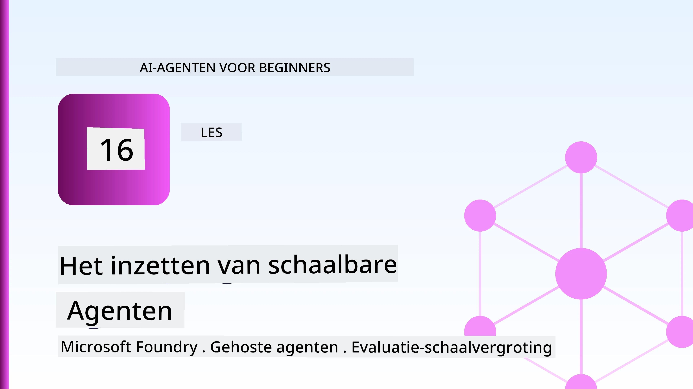
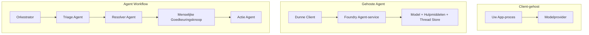
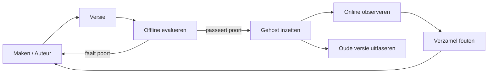
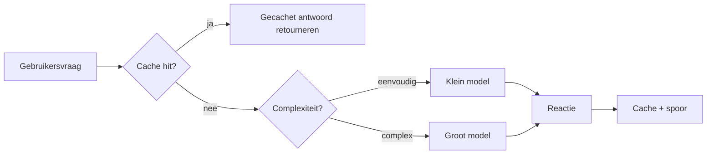
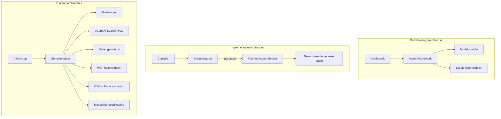

# Het Uitrollen van Schaalbare Agents met Microsoft Foundry



Tot nu toe in de cursus heb je agents gebouwd die draaien op je laptop, binnen een notebook, gestuurd door `az login` en een handvol omgevingsvariabelen. Dat is precies de juiste manier om te leren. Het is niet de juiste manier om een agent te draaien waarop duizenden klanten om 3 uur 's nachts vertrouwen.

Deze les gaat over de kloof tussen "het werkt op mijn machine" en "het werkt betrouwbaar en betaalbaar in productie." We dichten die kloof met behulp van **Microsoft Foundry** en de **Microsoft Foundry Agent Service**, en we doen dat door een echte klantenservice-agent te bouwen die beschikt over tools, ophalen, geheugen, evaluatie en monitoring.

## Inleiding

Deze les behandelt:

- Het verschil tussen een **prototype-agent** en een **uitgerolde agent**, en waarom de overgang vooral gaat over alles *rondom* het model.
- **Uitrolpatronen** voor agents: client-hosted, service-hosted (Hosted Agents) en workflow-georkestreerd.
- De **agent levenscyclus** op Microsoft Foundry — creëren, versiebeheer, uitrollen, evalueren, observeren, afvoeren.
- **Schaalstrategieën**: modelroutering, caching, gelijktijdigheid en stateless ontwerp.
- **Observability** met OpenTelemetry en Foundry tracering.
- **Kostenoptimalisatie** door modelselectie, routering en evaluatiedrempels.
- **Enterprise overwegingen**: governance, menselijke goedkeuring en het veilig draaien van MCP-servers in productie.

## Leerdoelen

Na het voltooien van deze les weet je hoe je:

- Het juiste uitrolpatroon kiest voor een gegeven agentwerkbelasting.
- Een agent uitrolt naar de Microsoft Foundry Agent Service zodat deze versiebeheer, governance en observability heeft.
- Een agent instrumenteert voor tracing en een evaluatiepipeline inricht die voor elke release draait.
- Modelroutering en caching toepast om latentie en kosten onder controle te houden op schaal.
- Een menselijke goedkeuringspoort toevoegt voor risicovolle acties en een MCP-server integreert op een productieveilige manier.

## Vereisten

Deze les veronderstelt dat je de eerdere lessen hebt voltooid en vertrouwd bent met:

- Agents bouwen met het [Microsoft Agent Framework](../14-microsoft-agent-framework/README.md) (Les 14).
- [Tool Gebruik](../04-tool-use/README.md) (Les 4) en [Agentic RAG](../05-agentic-rag/README.md) (Les 5).
- [Agent Memory](../13-agent-memory/README.md) (Les 13) en [Agentic Protocols / MCP](../11-agentic-protocols/README.md) (Les 11).
- [Observability en Evaluatie](../10-ai-agents-production/README.md) (Les 10) — deze les bouwt er direct op voort.

Je hebt ook nodig:

- Een **Azure subscription** en een **Microsoft Foundry project** met minstens één uitgerold chatmodel.
- De **Azure CLI** die geauthenticeerd is (`az login`).
- Python 3.12+ en de pakketten in de repository [`requirements.txt`](../../../requirements.txt).

## Van Prototype naar Productie: Wat Verandert Er Eigenlijk

Een prototype-agent en een productie-agent delen dezelfde kernlus — redeneren, tools aanroepen, reageren. Wat verandert is alles wat rond die lus zit. Het model is misschien 20% van een productie-agent; de overige 80% is het operationele skelet.

| Aspect | Prototype | Productie |
| --- | --- | --- |
| **Hosting** | Draait in je notebook | Draait als een gehoste service, versiebeheer en uitgerold |
| **Identiteit** | Je `az login` token | Managed identity met gescopeerde RBAC |
| **Toestand** | In-geheugen, kwijt na herstart | Geëxternaliseerd (thread store, geheugenservice) |
| **Foutafhandeling** | Je ziet de traceback | Herhalingen, fallbacks, dead-letter, meldingen |
| **Kosten** | "Het is een paar centen" | Gevolgd per verzoek, gerouteerd, gecachet, begroot |
| **Kwaliteit** | Je bekijkt de output visueel | Automatisch geëvalueerd voor elke release |
| **Vertrouwen** | Je keurt elke actie goed | Beleid + mens-in-de-lus voor risicovolle acties |

Onthoud deze tabel. Elke sectie hieronder correspondeert met een rij in deze tabel.

## Agent Uitrolpatronen

Er zijn drie patronen die je gebruikt, vaak in combinatie.

### 1. Client-Hosted Agents

Het agent-object leeft binnen *jouw* applicatieproces. Je code roept direct de modelprovider aan; de redeneringslus draait in jouw service. Dit is wat elke eerdere les heeft gedaan.

- **Gebruik het wanneer** je volledige controle over de lus nodig hebt, aangepaste middleware, of je embedt de agent binnen een bestaande backend.
- **Nadeel**: je bent zelf verantwoordelijk voor schaalbaarheid, status en veerkracht.

### 2. Hosted Agents (Foundry Agent Service)

De agent wordt *geregistreerd als een resource* in Microsoft Foundry. Foundry host de redeneringslus, slaat threads op, handhaaft contentveiligheid en RBAC, en maakt de agent zichtbaar in de Foundry-portal. Je app wordt een dunne client die threads maakt en antwoorden leest.

- **Gebruik het wanneer** je duurzaamheid, ingebouwde observability, governance en minder operationeel beheer wilt.
- **Nadeel**: minder laag-niveau controle in ruil voor een beheerde runtime.

### 3. Agent Workflows

Meerdere agents (en tools) worden samengesteld in een grafiek met expliciete controleflow — sequentiële stappen, vertakkingen, menselijke goedkeuringsknopen, en duurzame checkpoints die kunnen pauzeren en hervatten. Dit is de Microsoft Agent Framework **Workflows**-functionaliteit toegepast op uitrolschaal.

- **Gebruik het wanneer** een enkele taak meerdere gespecialiseerde agents overspant of een goedkeuringsstap in het midden vereist.
- **Nadeel**: meer bewegende delen; vereist observability op orkestratieniveau.



## De Levenscyclus van een Agent op Microsoft Foundry

Het uitrollen van een agent is geen eenmalige `push`. Het is een lus die sterk lijkt op een software release cyclus, want precies dat is het ook.



Het kernidee, overgenomen van [Les 10](../10-ai-agents-production/README.md): **offline evaluatie is een poort, geen bijzaak.** Een nieuwe agentversie wordt niet uitgebracht tenzij deze je evaluatiedrempels haalt. Online observability voert vervolgens echte fouten terug naar je offline testset. Dat is de hele lus.

## Schaalsstrategieën

Het schalen van een agent is anders dan het schalen van een stateless web-API, omdat elk verzoek meerdere dure model- en tool-aanroepen kan triggeren. Vier technieken dragen het meeste gewicht.

**Stateless request handling.** Houd geen per-gebruiker status in je geheugen in het proces. Bewaar conversatiedraden in de Foundry thread store of een geheugenservice zodat elke instantie elk verzoek kan afhandelen. Dit maakt horizontaal schalen mogelijk — instanties toevoegen zonder sticky sessions.

**Modelroutering.** Niet elk verzoek heeft jouw meest capabele (en dus duurste) model nodig. Router simpele verzoeken — intentclassificatie, korte feitelijke antwoorden — naar een klein, snel model, en reserveer het grote model voor echte redenering. Foundry's **Model Router** kan dit voor je doen, of je bouwt zelf een lichte classifier. Je bouwt de doe-het-zelf versie in het lab.

**Response caching.** Veel supportvragen zijn bijna duplicaten ("hoe reset ik mijn wachtwoord?"). Cache antwoorden op veelgestelde vragen en serveer die zonder het model te hoeven aanspreken. Zelfs een bescheiden cache-hit rate verlaagt kosten en latentie aanzienlijk.

**Gelijktijdigheid en backpressure.** Modelproviders hebben snelheidslimieten. Beperk je gelijktijdigheid, gebruik retries met exponentiële backoff, en faal gracieus (een in de wachtrij geplaatste "we zijn ermee bezig" respons is beter dan een 500 fout).



## Observability in Productie

Je kunt niet beheren wat je niet kunt zien. Zoals behandeld in Les 10, genereert het Microsoft Agent Framework **OpenTelemetry** traces native — elke modelaanroep, tool-aanroep en orkestratiestap wordt een span. In productie exporteer je die spans naar Microsoft Foundry (of een andere OTel-compatibele backend) zodat je kunt:

- Een enkele klantenklacht end-to-end traceren over elk model- en tool-aanroep.
- p50/p95 latentie en kosten per verzoek in de tijd monitoren.
- Alarm slaan bij foutpercentagepieken en kostenafwijkingen voordat je gebruikers (of je financiële team) het opmerken.

```python
from agent_framework.observability import get_tracer

tracer = get_tracer()

with tracer.start_as_current_span("support_request") as span:
    span.set_attribute("customer.tier", "enterprise")
    span.set_attribute("routed.model", "gpt-5-nano")
    # agentuitvoering wordt automatisch gevolgd binnen deze span
```

Attributen zoals `customer.tier` en `routed.model` veranderen een muur van traces in beantwoordbare vragen ("worden enterpriseklanten te vaak naar het kleine model gerouteerd?").

## Kostenoptimalisatie

Kosten in productie-agents worden gedomineerd door tokens. Drie hefbomen, in volgorde van impact:

1. **Kies het juiste modelformaat.** Een klein model dat door je evaluatiepoort komt is bijna altijd goedkoper dan een groot model dat ook goedgekeurd wordt. Gebruik evaluatie om *aantonen* dat het kleine model goed genoeg is in plaats van standaard voor het grootste model te kiezen uit voorzorg.
2. **Routeren op complexiteit.** Zoals hierboven — betaal de prijs van het grote model alleen voor verzoeken die grote modelredenering nodig hebben.
3. **Voer agressieve caching uit.** De goedkoopste modelaanroep is degene die je nooit doet.

Evaluatiepoorten en kostencontrole zijn dezelfde discipline bekeken vanuit twee hoeken: evaluatie bepaalt de *kwaliteitsvloer*, routering en caching houden je zo dicht mogelijk bij het *kostenniveau* van die vloer.

## Enterprise Overwegingen bij Uitrol

**Governance.** Hosted Agents erven Foundry's RBAC, contentveiligheid en auditlogging. Geef elke agent een beheerste identiteit met de minste rechten die nodig zijn — alleen-lezen toegang tot de kennisbank, beperkte toegang tot de ticket-API, niet meer.

**Mens-in-de-lus.** Sommige acties zijn te ingrijpend om volledig te automatiseren — terugbetaling uitgeven, een account verwijderen, escaleren naar een juridisch team. Het Microsoft Agent Framework ondersteunt **goedkeuring-verplichte** tools: de agent stelt de actie voor, uitvoering pauzeert, een mens keurt goed of wijst af, en de workflow gaat door. Je zag het primitief in [Les 6](../06-building-trustworthy-agents/README.md); hier rol je het uit.

**MCP in productie.** [MCP](../11-agentic-protocols/README.md) laat je agent externe tools gebruiken via een standaardinterface. In productie behandel je elke MCP-server als een niet-vertrouwde grens: pin de serverversie, draai die met een gescopeerde identiteit, valideer de outputs, en blootstel nooit geheime gegevens aan de server. Een MCP-server is een afhankelijkheid, en afhankelijkheden worden gepatcht, gecontroleerd en rate-limiet toegepast.



Die drie diagrammen — ontwikkeling, uitrol, runtime — zijn dezelfde agent in drie fasen van zijn leven. Het lab dat volgt leidt je door het bouwen ervan.

## Hands-On Lab: Een Productieklaar Klantenservice-agent

Open [`code_samples/16-python-agent-framework.ipynb`](./code_samples/16-python-agent-framework.ipynb) en werk het helemaal door. Je zult een **Contoso klantenservice-agent** assembleren met elke productie kwestie ingebouwd:

1. **Tool aanroepen** — bestelstatus opzoeken en supporttickets openen.
2. **RAG** — beantwoording van beleidsvragen vanuit een kennisbank (Azure AI Search, met een in-geheugen fallback zodat het notebook draait zonder een Search resource).
3. **Geheugen** — onthoud de klant over meerdere beurten in het gesprek.
4. **Modelroutering** — een complexiteitsclassificator routeert elk verzoek naar een klein of groot model.
5. **Response caching** — herhaalde vragen worden uit de cache geserveerd.
6. **Menselijke goedkeuring** — terugbetalingen boven een drempel pauzeren voor menselijke goedkeuring.
7. **Evaluatiepipeline** — een kleine offline testset beoordeelt de agent en functioneert als releasepoort.
8. **Observability** — OpenTelemetry tracing rond elk verzoek.

### Stapsgewijze uitleg

Het notebook is georganiseerd zodat elke productieaandachtspunt een op zichzelf staande, uitvoerbare sectie is. Het hart ervan is de routering-plus-caching verzoekafhandelaar:

```python
async def handle_support_request(query: str, customer_id: str) -> str:
    # 1. Server vanaf cache wanneer mogelijk.
    cached = response_cache.get(normalize(query))
    if cached:
        return cached

    # 2. Routeer op complexiteit om kosten te beheersen.
    model = "gpt-5-nano" if is_simple(query) else "gpt-5-mini"

    # 3. Voer de agent uit binnen een trace span voor observeerbaarheid.
    with tracer.start_as_current_span("support_request") as span:
        span.set_attribute("routed.model", model)
        span.set_attribute("customer.id", customer_id)
        response = await support_agent.run(query, model=model)

    # 4. Cache en retourneer.
    response_cache.set(normalize(query), response.text)
    return response.text
```

De evaluatiepoort die een release bewaakt ziet er zo uit:

```python
async def evaluation_gate(agent, test_cases, threshold: float = 0.8) -> bool:
    passed = 0
    for case in test_cases:
        result = await agent.run(case["input"])
        if score_response(result.text, case["expected"]) >= 0.8:
            passed += 1
    pass_rate = passed / len(test_cases)
    print(f"Evaluation pass rate: {pass_rate:.0%} (gate: {threshold:.0%})")
    return pass_rate >= threshold  # alleen implementeren als de poort slaagt
```

Lees elke regel — het notebook houdt de primitieve onderdelen bewust klein zodat niets verborgen zit achter een framework-aanroep.

## Een Uitgerolde Agent Valideren met Smoke Tests

De evaluatiepoort hierboven draait *offline* tegen je agent-object. Zodra de agent uitgerold is als een Hosted Agent heb je nog een goedkopere controle nodig: **geeft de uitgerolde endpoint daadwerkelijk antwoord?**

"Succesvol" uitrollen bewijst alleen dat de control plane de definitie accepteerde — het bewijst niet dat de agent reageert. Een ontbrekende afhankelijkheid, slechte modelroutering of een verlopen verbinding kan een groene uitrol opleveren die niets teruggeeft. Een **smoke test** vangt dat binnen seconden, bij elke uitrol, zonder de kosten van een volledige evaluatie.

Deze repository bevat een kant-en-klare smoke-test pipeline gebouwd op de [AI Smoke Test](https://github.com/marketplace/actions/ai-smoke-test) GitHub Action:

- **Catalogus** — [`tests/lesson-16-smoke-tests.json`](../../../tests/lesson-16-smoke-tests.json) bevat prompts en assertions voor de Contoso ondersteuningsagent (gegrond op beleidsantwoorden, een order lookup, onderwerpconsistentie en multi-turn draad continuïteit). Catalogi voor agents van andere lessen staan ernaast — zie [`tests/README.md`](../tests/README.md).
- **Workflow** — [`.github/workflows/smoke-test.yml`](../../../.github/workflows/smoke-test.yml) logt in met Azure OIDC en POST elke prompt naar de Responses endpoint van de agent, en faalt de taak bij elke assertion miss.

```yaml
- name: Smoke-test hosted agent
  uses: JFolberth/ai-smoketest@v1
  with:
    project_endpoint: ${{ inputs.project_endpoint }}
    agent_name: ContosoSupportAgent
    tests_file: tests/lesson-16-smoke-tests.json
```


Voer het uit vanaf het **Actions** tabblad zodra je agent is gedeployed, waarbij je je Foundry project endpoint en agentnaam opgeeft. De gefedereerde identiteit heeft de rol **Azure AI User** nodig op foundry projectniveau. Zie de lagen als een piramide: smoke tests (bereikbaar en reagerend?) worden bij elke uitrol uitgevoerd, offline evaluatie (goed genoeg om te leveren?) vindt plaats vóór promotie, en online evaluatie (hoe doet het het in de praktijk?) draait continu.

## Kennis Check

Test je begrip voordat je naar de opdracht gaat.

**1. Hoeveel van een productieagent is ruwweg "het model," en wat is de rest?**

<details>
<summary>Antwoord</summary>

Het model is een minderheid van het systeem — vaak wordt ongeveer 20% genoemd. De rest is het operationele skelet: hosting en versiebeheer, identiteit en RBAC, geëxternaliseerde staat, foutafhandeling, kostenbewaking, evaluatie en controles met mens in de lus. Productie bereiken gaat vooral over het bouwen van alles *rondom* de redeneerlus.
</details>

**2. Wanneer zou je kiezen voor een Hosted Agent boven een client-hosted agent?**

<details>
<summary>Antwoord</summary>

Wanneer je een beheerde runtime wilt met ingebouwde duurzaamheid (threads die blijven bestaan en kunnen worden hervat), observeerbaarheid, contentveiligheid en RBAC, en je bereid bent wat laag-niveau controle over de redeneerlus in te leveren voor minder operationeel oppervlak. Client-hosted is de voorkeur wanneer je volledige controle over de lus nodig hebt of de agent in een bestaande backend integreert.
</details>

**3. Waarom moet een schaalbare agent stateless zijn in zijn eigen process geheugen?**

<details>
<summary>Antwoord</summary>

Zodat elke instantie elke aanvraag kan afhandelen, wat horizontale schaalbaarheid zonder plakkerige sessies mogelijk maakt. Per-gebruiker conversatiestatus wordt geëxternaliseerd naar een thread store of geheugenservice. Als status in process geheugen zou leven, verlies je het bij herstart en kun je de belasting niet vrij verdelen.
</details>

**4. Welk probleem lost model routing op en hoe verhoudt het zich tot evaluatie?**

<details>
<summary>Antwoord</summary>

Routing stuurt eenvoudige aanvragen naar een klein, goedkoop, snel model en reserveert het grote model voor echte redenering, waardoor zowel latentie als kosten worden gecontroleerd. Het heeft te maken met evaluatie omdat evaluatie bewijst dat het kleine model goed genoeg is voor een klasse aanvragen — routing zonder evaluatie is giswerk.
</details>

**5. Wat is een "evaluatiepoort" en waar zit die in de levenscyclus?**

<details>
<summary>Antwoord</summary>

Een evaluatiepoort voert een offline testset uit tegen een nieuwe agentversie en blokkeert implementatie tenzij het slagingspercentage boven een drempel ligt. Het zit tussen "versie" en "uitrol" in de levenscyclus, waardoor kwaliteit een voorwaarde voor release wordt in plaats van iets dat je pas na levering controleert.
</details>

**6. Waarom moet een MCP-server in productie als een niet-vertrouwde grens worden behandeld?**

<details>
<summary>Antwoord</summary>

Omdat het een externe afhankelijkheid is waar je agent mee communiceert. Je moet de versie vastzetten, het draaien met een beperkte identiteit, de output valideren, beperken hoeveel het kan, en nooit geheimen aan het blootstellen — dezelfde discipline als bij elke derde-partij afhankelijkheid. De output stroomt naar de redeneerfunctie van je agent, dus ongeteste vertrouwen vormt een beveiligingsrisico.
</details>

**7. Welke enkele wijziging heeft meestal de grootste impact op de productiekosten van een agent, en waarom?**

<details>
<summary>Antwoord</summary>

Het juist dimensioneren van het model — het gebruik van het kleinste model dat nog door je evaluatiepoort komt. Kosten worden gedomineerd door tokens, en een kleiner model dat aan de kwaliteitsnorm voldoet is bijna altijd goedkoper dan een groter. Caching en routing verlagen kosten nog verder, maar het kiezen van het juiste basismodel heeft het grootste effect.
</details>

**8. Welke rol spelen span-attributen zoals `customer.tier` en `routed.model` in observeerbaarheid?**

<details>
<summary>Antwoord</summary>

Ze transformeren ruwe traces in beantwoordbare zakelijke vragen. Zonder attributen heb je een muur van spans; met attributen kun je vragen zoals "worden enterprise klanten te vaak naar het kleine model gestuurd?" of "welk model verwerkt onze langzaamste aanvragen?" Attributen zijn hoe je telemetrie kunt segmenteren op dimensies die voor jouw operatie belangrijk zijn.
</details>

## Opdracht

Neem de customer support agent uit het lab en versterk deze voor een specifiek scenario: **een abonnement facturatie ondersteuningsagent voor een SaaS-bedrijf.**

Je inzending moet:

1. **De tools vervangen** door facturatie-gerelateerde: `get_subscription_status`, `get_invoice` en `issue_credit` (credits boven $50 vragen goedkeuring door een mens).
2. **Drie RAG-documenten toevoegen** die het restitutiebeleid, de factureringscyclus en het annuleringsbeleid van het bedrijf behandelen.
3. **De evaluatieset uitbreiden** tot minimaal acht gevallen, inclusief minstens twee die *de* goedkeuringsroute door een mens moeten triggeren, en bevestigen dat je evaluatiepoort correct slaagt of faalt.
4. **Een kostenrapport toevoegen**: nadat je tien gemengde queries door de agent hebt gestuurd, print hoeveel er naar het kleine model gingen, hoeveel naar het grote model en hoeveel uit de cache werden bediend.

Schrijf een korte paragraaf (in een markdown cel) waarin je uitlegt welke model-routingregel je hebt gekozen en hoe je deze met echt verkeer zou valideren. Er is geen enkel correct antwoord — je wordt beoordeeld op of de productieoverwegingen logisch zijn samengebracht.

## Samenvatting

In deze les bracht je een agent van prototype naar productie met Microsoft Foundry:

- De overstap naar productie gaat vooral over het **operationele skelet** rond het model — hosting, identiteit, status, foutafhandeling, kosten, kwaliteit en vertrouwen.
- Je leerde de drie **uitrolpatronen** — client-hosted, Hosted Agents en Agent Workflows — en wanneer elk geschikt is.
- Je doorliep de **agent levenscyclus**, waarin offline **evaluatie fungeert als releasepoort** en online observeerbaarheid fouten terugvoert in de testset.
- Je paste **schaalstrategieën** toe — stateless ontwerp, modelrouting, caching en begrensde gelijktijdigheid — en verbond deze met **kostenoptimalisatie**.
- Je integreerde **enterprise controles**: RBAC, menselijke goedkeuring, en productie-veilige MCP integratie.
- Je bouwde een **productieklaar klantenondersteuningsagent** die al deze aspecten in uitvoerbare code samenbrengt.

De volgende les maakt de omgekeerde reis: in plaats van agents in de cloud te schalen, breng je ze *naar beneden* op een enkele ontwikkelaarsmachine en laat je ze volledig lokaal draaien.

## Aanvullende Bronnen

- <a href="https://learn.microsoft.com/azure/ai-foundry/what-is-azure-ai-foundry" target="_blank">Microsoft Foundry documentatie</a>
- <a href="https://learn.microsoft.com/azure/ai-foundry/agents/overview" target="_blank">Microsoft Foundry Agent Service overzicht</a>
- <a href="https://learn.microsoft.com/en-us/agent-framework/overview/?wt.mc_id=youtube_26688_organicsocial_reactor&pivots=programming-language-python" target="_blank">Microsoft Agent Framework</a>
- <a href="https://learn.microsoft.com/azure/ai-foundry/concepts/model-router" target="_blank">Model Router in Microsoft Foundry</a>
- <a href="https://learn.microsoft.com/azure/search/search-what-is-azure-search" target="_blank">Azure AI Search</a>
- <a href="https://opentelemetry.io/" target="_blank">OpenTelemetry</a>
- <a href="https://github.com/marketplace/actions/ai-smoke-test" target="_blank">AI Smoke Test GitHub Action</a>
- <a href="https://modelcontextprotocol.io/" target="_blank">Model Context Protocol (MCP)</a>

## Vorige Les

[Computer Use Agents bouwen (CUA)](../15-browser-use/README.md)

## Volgende Les

[Lokale AI agents creëren](../17-creating-local-ai-agents/README.md)

---

<!-- CO-OP TRANSLATOR DISCLAIMER START -->
**Disclaimer**:
Dit document is vertaald met behulp van de AI vertaaldienst [Co-op Translator](https://github.com/Azure/co-op-translator). Hoewel we streven naar nauwkeurigheid, dient u er rekening mee te houden dat geautomatiseerde vertalingen fouten of onnauwkeurigheden kunnen bevatten. Het originele document in de oorspronkelijke taal moet worden beschouwd als de gezaghebbende bron. Voor kritieke informatie wordt professionele menselijke vertaling aanbevolen. Wij zijn niet aansprakelijk voor eventuele misverstanden of verkeerde interpretaties die voortvloeien uit het gebruik van deze vertaling.
<!-- CO-OP TRANSLATOR DISCLAIMER END -->