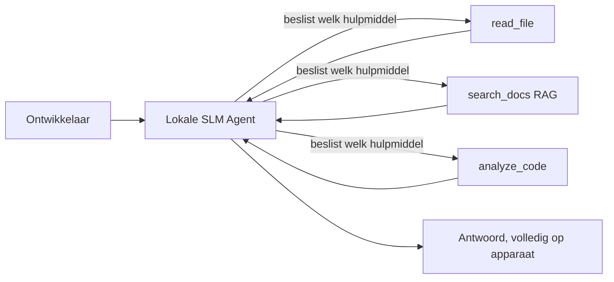
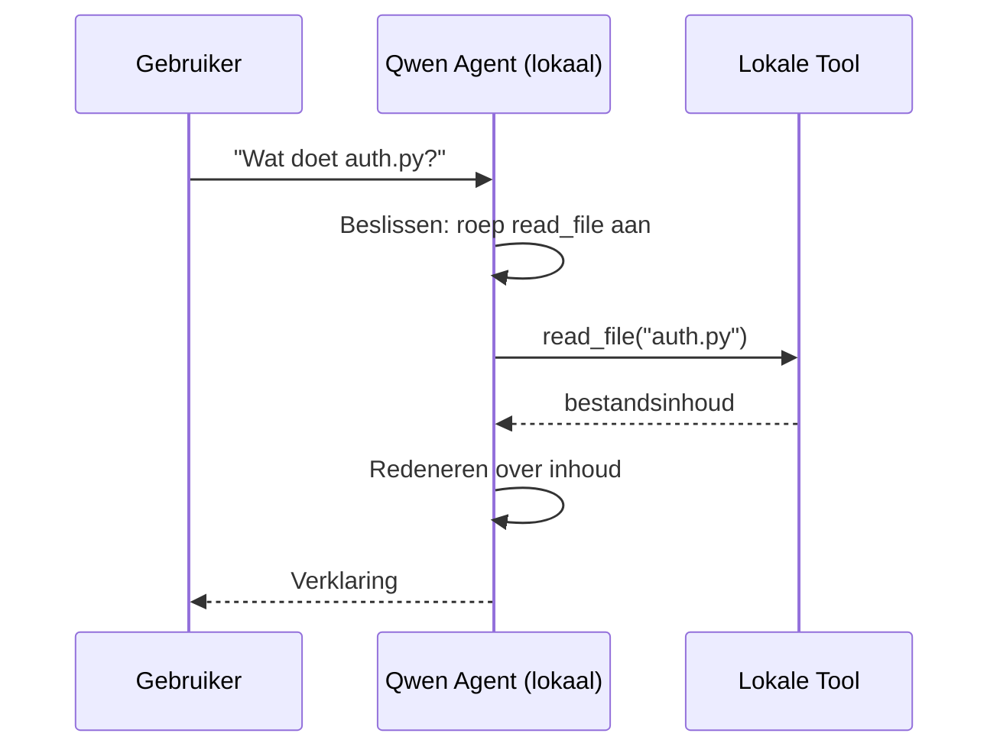
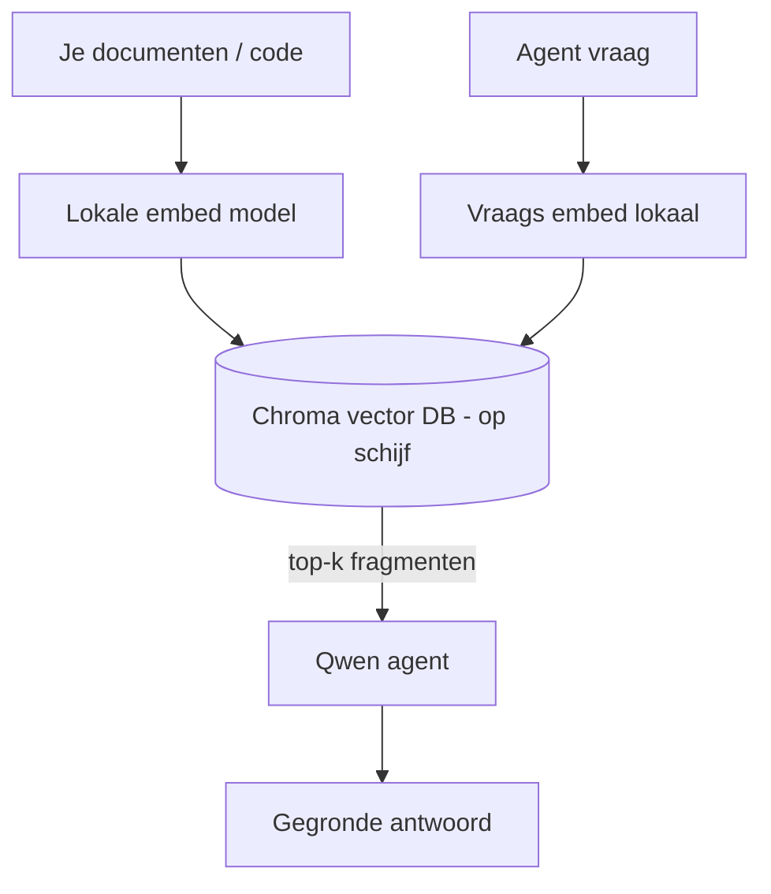
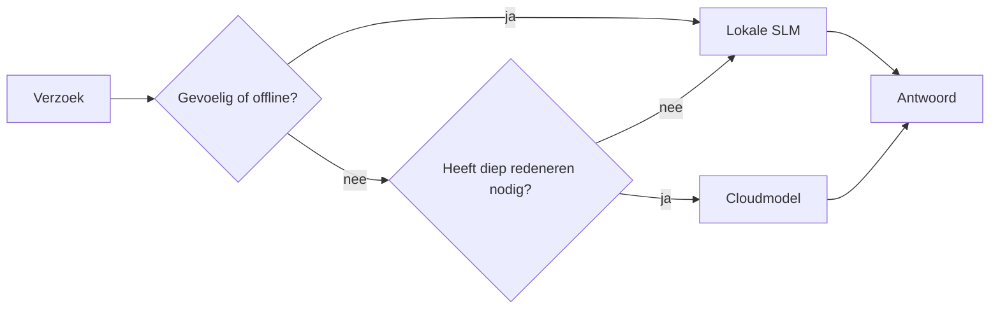

# Lokale AI-agenten maken met Microsoft Foundry Local en Qwen


De vorige les schaalde agenten *omhoog* naar de cloud. Deze brengt ze *omlaag* naar een enkele machine. Aan het einde heb je een werkende engineering-assistent die redeneert, tools aanroept, je bestanden leest en je documentatie doorzoekt — **zonder ook maar één cloud-inferentie-aanroep.**

Waarom zou je dat willen? Drie redenen die voortdurend terugkomen in echte engineering-werkzaamheden:

- **Privacy.** De code en documenten verlaten nooit de machine. Geen prompt, geen fragment, geen klantgegevens passeren de netwerkgrens.
- **Kosten.** Lokale inferentie brengt geen kosten per token in rekening. Je kunt de hele dag itereren voor de prijs van elektriciteit.
- **Offline.** In een vliegtuig, in een beveiligde faciliteit of tijdens een storing blijft de agent werken.

De kanttekening is dat je een toonaangevend cloudmodel inruilt voor een **Klein Taalmodel (SLM)** dat draait op je CPU, GPU of NPU. Deze les gaat over het bouwen van agenten die *goed* functioneren binnen die beperking in plaats van te doen alsof de beperking er niet is.

## Introductie

Deze les behandelt:

- **Kleine Taalmodellen (SLM's)** — wat ze zijn, waar ze uitblinken en waar niet.
- **Microsoft Foundry Local** — een runtime die modellen downloadt en op het apparaat serveert via een **OpenAI-compatibele API**.
- **Qwen functie-aanroepmodellen** — SLM's die betrouwbaar tool-aanroepen produceren, wat lokale *agenten* (niet alleen lokale chat) mogelijk maakt.
- **Lokale tools, lokale RAG en lokale MCP** — die de agent mogelijkheden geven zonder de cloud.
- **Hybride patronen** — wanneer je dingen lokaal houdt en wanneer je de cloud inschakelt.

## Leerdoelen

Na afronding van deze les weet je hoe je:

- De afwegingen van SLM's uitleggen en geschikte gebruikssituaties voor lokale agenten kiezen.
- Een Qwen-model lokaal te serveren met Foundry Local en hier via de OpenAI-compatibele endpoint verbinding mee te maken.
- Een tool-aanroepende agent bouwen die volledig op je werkstation draait.
- Lokale RAG toevoegen over je eigen documenten met een lokale vectordatabase (Chroma).
- De agent verbinden met een lokale MCP-server en nadenken over hybride lokaal/cloudontwerpen.

## Vereisten

Deze les gaat ervan uit dat je de voorgaande lessen hebt afgerond en vertrouwd bent met:

- [Toolgebruik](../04-tool-use/README.md) (Les 4) en [Agentic RAG](../05-agentic-rag/README.md) (Les 5).
- [Agentic Protocols / MCP](../11-agentic-protocols/README.md) (Les 11).
- Het [Microsoft Agent Framework](../14-microsoft-agent-framework/README.md) (Les 14).

Je hebt ook nodig:

- Een ontwikkelaarswerkstation. **8 GB RAM is een realistische minimumvereiste**; 16 GB+ is comfortabel. Een GPU of NPU helpt, maar is niet verplicht.
- **Microsoft Foundry Local** geïnstalleerd (zie de setup-sectie hieronder).
- Python 3.12+ en de pakketten in de repository [`requirements.txt`](../../../requirements.txt), plus `foundry-local-sdk`, `openai` en `chromadb` voor deze les.

## Kleine Taalmodellen: Het juiste gereedschap voor lokaal werk

Een toonaangevend cloudmodel heeft honderden miljarden parameters en een datacenter erachter. Een SLM heeft een paar miljard parameters en moet in het RAM van je laptop passen. Dat verschil zet duidelijke verwachtingen.

**SLM's zijn goed in:**

- Gestructureerde, begrensde taken — classificatie, extractie, samenvatting van een bekend document.
- **Tool-aanroepen** — beslissen welke functie aan te roepen en met welke argumenten.
- Snelle, goedkope, private iteratie op je eigen data.

**SLM's zijn zwakker in:**

- Open-eindig, meerstaps redeneren over een grote context.
- Brede wereldkennis (ze hebben minder gezien, en vergeten meer).

De winnende strategie voor lokale agenten is daarom: **laat de SLM orkestreren, en laat tools het zware werk doen.** Het model hoeft je codebase niet te *kennen* — het moet weten wanneer `read_file` en `search_docs` aan te roepen. Dat speelt direct in op de sterke punten van een SLM.



## Microsoft Foundry Local

**Microsoft Foundry Local** is een lichtgewicht runtime die modellen volledig op je machine downloadt, beheert en serveert. De belangrijkste functie voor ons is dat het een **OpenAI-compatibele HTTP-endpoint** aanbiedt — wat betekent dat de OpenAI SDK en de Microsoft Agent Framework OpenAI-client ermee werken met slechts een aanpassing van `base_url`. Alles wat je hebt geleerd over het bouwen van agenten gaat direct mee; alleen de endpoint verplaatst zich van de cloud naar `localhost`.

Foundry Local kiest ook automatisch de beste build van een model voor je hardware — een CPU-build, een CUDA/GPU-build of een NPU-build — zodat je niet per machine handmatig hoeft te optimaliseren.

### Setup

Installeer Foundry Local (zie de [documentatie](https://learn.microsoft.com/azure/ai-foundry/foundry-local/) voor jouw OS), en controleer dan of het werkt:

```bash
# Installeren (voorbeeld; volg de documentatie voor uw platform)
winget install Microsoft.FoundryLocal      # Windows
# brew install microsoft/foundrylocal/foundrylocal   # macOS

# Download en voer een Qwen-model uit, en start vervolgens de lokale service
foundry model run qwen2.5-7b-instruct
foundry service status
```

Zodra de service draait, heb je een lokale, OpenAI-compatibele endpoint (meestal `http://localhost:PORT/v1`). De notebook gebruikt de `foundry-local-sdk` om de endpoint automatisch te vinden, dus je hoeft de poort niet hard te coderen.

## Qwen functie-aanroepen: Waarom het ertoe doet

Een agent is alleen een agent als hij tools kan aanroepen. Veel SLM's kunnen chatten maar produceren onbetrouwbare, malformed tool-aanroepen. **Qwen**-modellen zijn getraind voor functie-aanroepen en geven consequent goed gevormde tool-aanroepstructuren weer — precies wat een lokaal chatmodel tot een lokale *agent* maakt.

De flow is de standaard tool-aanroeplus die je al kent, alleen draait die op het apparaat:



## Lokale RAG

Documentatiezoekfunctie is waar lokale agenten zichzelf bewijzen. In plaats van te hopen dat het SLM je framework-docs heeft onthouden, embed je die docs in een **lokale vectordatabase** en laat je de agent de relevante stukken op aanvraag ophalen.

We gebruiken **Chroma**, een embedded vectoropslag die in-proces draait zonder serverbeheer. De pijplijn is volledig lokaal: lokaal embeddingmodel → lokale vectors → lokale retrieval → lokaal SLM.



Dit is hetzelfde Agentic RAG-patroon als bij Les 5 — de enige wijziging is dat elk onderdeel op jouw machine draait.

## Lokale MCP-servers

[MCP](../11-agentic-protocols/README.md) is een transport, geen cloudservice. Een MCP-server kan draaien als lokaal proces op `stdio`, en tools via het standaardprotocol exposen aan je agent. Hiermee hergebruik je de groeiende ecosysteem van MCP-servers — toegang tot filesysteem, git-operaties, databasequery's — volledig offline.

De beveiligingshouding verschilt van die in de cloud, maar is niet afwezig: een lokale MCP-server draait nog steeds met de permissies van je gebruiker, dus begrens waar hij bij kan (bijvoorbeeld een projectdirectory, niet je hele homefolder) en behandel de outputs als invoer om te valideren.

## Hybride cloud-en-lokale patronen

Lokaal eerst betekent niet alleen lokaal. Volwassen systemen routeren op gevoeligheid en moeilijkheid:

| Situatie | Waar het draait |
| --- | --- |
| Gevoelige code/data, of offline | **Lokale SLM** |
| Eenvoudige, begrensde taak | **Lokale SLM** (goedkoop, snel) |
| Moeilijk multi-hop redeneren over niet-gevoelige data | **Cloudmodel** |
| Alles, tijdens een storing | **Lokale SLM** (graceful degradatie) |

Dit weerspiegelt het **modelroutering**-idee uit Les 16 — behalve dat een van de "modellen" nu je eigen machine is. Een robuust ontwerp valt terug op lokaal als de cloud onbeschikbaar is, zodat de agent degradeert in kwaliteit in plaats van volledig faalt.



## Praktijk: Een lokale engineering-assistent

Open [`code_samples/17-local-agent-foundry-local.ipynb`](./code_samples/17-local-agent-foundry-local.ipynb) en werk het door. Je bouwt een **lokale engineering-assistent** die volledig op je werkstation draait en kan:

1. **Tools aanroepen** — via Qwen functie-aanroepen door Foundry Local.
2. **Lokale bestandsbewerkingen uitvoeren** — bestanden in een projectdirectory opnoemen en lezen.
3. **Code analyseren** — basisstatistieken op een bronbestand rapporteren.
4. **Documentatie doorzoeken** — lokale RAG over een map met docs met Chroma.
5. **MCP gebruiken** — verbinden met een lokale MCP-server (met een gracieus overslaan als er geen is geconfigureerd).

Er wordt op geen enkel moment cloud-inferentie gebruikt.

### Uitleg

De assistent maakt verbinding met Foundry Local via de OpenAI-compatibele endpoint, dus de agentcode lijkt bijna identiek aan de cloudlessen — alleen de client verandert:

```python
from foundry_local import FoundryLocalManager
from openai import OpenAI

# Foundry Local ontdekt/downloadt het model en geeft ons een lokaal eindpunt.
manager = FoundryLocalManager(\"qwen2.5-7b-instruct\")
client = OpenAI(base_url=manager.endpoint, api_key=manager.api_key)  # api_key is een lokale tijdelijke aanduiding
```

De tools zijn gewone Python-functies die begrensd zijn tot een projectdirectory:

```python
def read_file(path: str) -> str:
    \"\"\"Read a file, but only inside the sandboxed project directory.\"\"\"
    full = (PROJECT_ROOT / path).resolve()
    if PROJECT_ROOT not in full.parents and full != PROJECT_ROOT:
        return \"Access denied: path is outside the project directory.\"
    return full.read_text(encoding=\"utf-8\")
```

Let op de sandbox-controle — zelfs lokaal is een tool die willekeurige paden leest een risico. De notebook houdt elke tool begrensd tot een enkele projectroot.

## Kenniscontrole

Test je begrip voordat je verdergaat naar de opdracht.

**1. Noem twee concrete redenen om een agent lokaal te draaien in plaats van in de cloud.**

<details>
<summary>Antwoord</summary>

Twee van de volgende: **privacy** (code en data verlaten nooit de machine), **kosten** (geen facturering per token), en **offline capaciteit** (werkt zonder netwerk — in een vliegtuig, in een beveiligde faciliteit of tijdens een storing). Regelgevende of compliance-beperkingen die het verzenden van data buiten het apparaat verbieden, zijn een veelvoorkomende reden voor privacy.
</details>

**2. Wat is de aanbevolen taakverdeling tussen een SLM en zijn tools in een lokale agent, en waarom?**

<details>
<summary>Antwoord</summary>

Laat de SLM **orkestreren** (beslissen welke tool aan te roepen en met welke argumenten) en laat **tools het zware werk doen** (bestanden lezen, documenten ophalen, resultaten berekenen). SLM's zijn sterk in begrensde beslissingen zoals toolselectie maar zwakker in brede kennis en langdurig multi-hop redeneren, dus vertrouwen op tools speelt in op hun sterke punten.
</details>

**3. Wat maakt het mogelijk om cloud-agentcode te hergebruiken met Foundry Local?**

<details>
<summary>Antwoord</summary>

Foundry Local exposeert een **OpenAI-compatibele HTTP-endpoint**. De OpenAI SDK en de OpenAI-client van het Agent Framework werken ermee door alleen de `base_url` te wijzigen (en een lokale placeholder API-sleutel te gebruiken). Verder blijft alles over de agentcode hetzelfde.
</details>

**4. Waarom gebruiken we specifiek een Qwen functie-aanroepmodel in plaats van een willekeurige SLM?**

<details>
<summary>Antwoord</summary>

Omdat een agent betrouwbare, goedgevormde **tool-aanroepen** moet maken. Veel SLM's kunnen chatten maar produceren malformed of inconsistente tool-aanroepstructuren. Qwen-modellen zijn getraind voor functie-aanroepen en produceren consistente tool-aanroepen, wat een lokaal chatmodel tot een werkende lokale agent maakt.
</details>

**5. Welke componenten draaien er op de machine in de lokale RAG-pijplijn?**

<details>
<summary>Antwoord</summary>

Alle componenten: het embeddingmodel, de vectordatabase (Chroma, op schijf), de retrieval-stap, en de SLM. Documenten worden lokaal embedded, lokaal opgeslagen, lokaal opgehaald en door een lokaal model bewerkt — geen enkel onderdeel raakt de cloud.
</details>

**6. Een lokale MCP-server draait op jouw machine. Maakt dat het automatisch veilig? Welke voorzorgsmaatregel moet je nog nemen?**

<details>
<summary>Antwoord</summary>

Nee. Een lokale MCP-server draait met de permissies van jouw gebruiker, dus hij kan overal bij waar jij bij kunt. Beperk hem tot wat hij nodig heeft (bijv. een enkele projectdirectory in plaats van je hele homefolder) en behandel zijn output als input die je moet valideren voordat je erop handelt.
</details>

**7. Beschrijf een verstandige hybride routeringsregel die een lokaal model omvat.**

<details>
<summary>Antwoord</summary>

Routeer gevoelige of offline verzoeken naar de lokale SLM; routeer eenvoudige, beperkte taken ook naar de lokale SLM voor snelheid en kostenbesparing; routeer moeilijk multi-hop redeneren over niet-gevoelige data naar een cloudmodel; en val terug op de lokale SLM als de cloud onbeschikbaar is zodat de agent gracieus degradeert in plaats van faalt. Dit is modelroutering (Les 16) met de lokale machine als een van de modellen.
</details>

**8. Wat is een realistisch minimum RAM bedrag om de lokale agent in deze les te draaien, en wat koop je extra met meer RAM?**

<details>
<summary>Antwoord</summary>

Ongeveer **8 GB** is een realistisch minimum; 16 GB+ is comfortabel. Meer RAM stelt je in staat om grotere, capabele modellen te draaien en meer context in het geheugen te houden. Een GPU of NPU versnelt inferentie maar is niet vereist — Foundry Local kiest een CPU-build als er geen versneller beschikbaar is.
</details>

## Opdracht

Breid de lokale engineering-assistent uit tot een **lokale documentatie-reviewer** voor een klein project naar keuze (gebruik gerust een van de lesmappen van deze repo).

Je inzending moet:

1. Een echte docs-/code-map **indexeren in Chroma** (minimaal vijf bestanden).
2. Een `find_todos` tool **toevoegen** die het project scant op `TODO`/`FIXME`-commentaar en die teruggeeft met bestand en regelnummers — met dezelfde sandbox-check als `read_file`.

3. **Stel de agent drie vragen** die hem dwingen om tools te combineren: één pure RAG-vraag, één die vereist dat een specifiek bestand wordt gelezen, en één die vereist dat TODO's worden gevonden.
4. **Meet het**: meet de tijd van elk van de drie antwoorden en noteer deze in een markdown-cel. Geef commentaar op of de latency acceptabel is voor jouw bedoelde workflow.

Schrijf daarna een korte paragraaf over **wat je naar de cloud zou verplaatsen en wat je lokaal zou houden** voor deze beoordelaar, en waarom. Je wordt beoordeeld op of de lokale componenten correct zijn gekoppeld en of je hybride redenering logisch is — niet op modelkwaliteit.

## Samenvatting

In deze les bouwde je een agent die volledig op je eigen machine draait:

- **SLM's** ruilen breedte in voor privacy, kosten en offline werking — en blinken uit wanneer ze **tools orkestreren** in plaats van alle kennis zelf te dragen.
- **Foundry Local** serveert modellen op het apparaat achter een **OpenAI-compatibele endpoint**, zodat je cloud-agentcode overgaat met een wijziging van één regel.
- **Qwen function-calling modellen** maken betrouwbare lokale tool-aanroepen mogelijk — en daardoor ook lokale *agents*.
- **Local RAG** (Chroma) en **lokaal MCP** geven de agent capaciteit zonder het apparaat te verlaten.
- **Hybride patronen** laten je routeren naar gevoeligheid en moeilijkheid, met lokaal als een elegante fallback.

Dit maakt de implementatiecyclus compleet: Les 16 schaalde agents op in Microsoft Foundry, en deze les schaalde ze af naar één werkstation. De volgende les richt zich op het beveiligen van gedeployde agents.

## Aanvullende bronnen

- <a href="https://learn.microsoft.com/azure/ai-foundry/foundry-local/" target="_blank">Microsoft Foundry Local documentatie</a>
- <a href="https://learn.microsoft.com/azure/ai-foundry/what-is-azure-ai-foundry" target="_blank">Microsoft Foundry documentatie</a>
- <a href="https://learn.microsoft.com/en-us/agent-framework/overview/?wt.mc_id=youtube_26688_organicsocial_reactor&pivots=programming-language-python" target="_blank">Microsoft Agent Framework</a>
- <a href="https://qwen.readthedocs.io/en/latest/framework/function_call.html" target="_blank">Qwen function-calling documentatie</a>
- <a href="https://modelcontextprotocol.io/" target="_blank">Model Context Protocol (MCP)</a>
- <a href="https://docs.trychroma.com/" target="_blank">Chroma vector database</a>

## Vorige les

[Deploying Scalable Agents](../16-deploying-scalable-agents/README.md)

## Volgende les

[Securing AI Agents](../18-securing-ai-agents/README.md)

---

<!-- CO-OP TRANSLATOR DISCLAIMER START -->
**Disclaimer**:
Dit document is vertaald met behulp van de AI vertaaldienst [Co-op Translator](https://github.com/Azure/co-op-translator). Hoewel we streven naar nauwkeurigheid, dient u er rekening mee te houden dat geautomatiseerde vertalingen fouten of onnauwkeurigheden kunnen bevatten. Het originele document in de oorspronkelijke taal moet worden beschouwd als de gezaghebbende bron. Voor kritieke informatie wordt professionele menselijke vertaling aanbevolen. Wij zijn niet aansprakelijk voor eventuele misverstanden of verkeerde interpretaties die voortvloeien uit het gebruik van deze vertaling.
<!-- CO-OP TRANSLATOR DISCLAIMER END -->