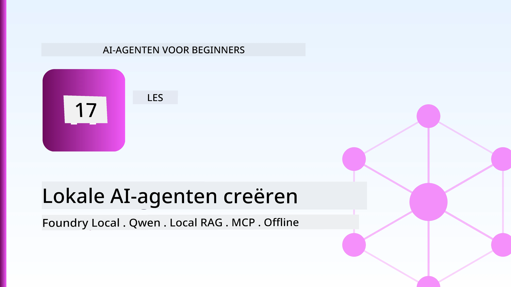
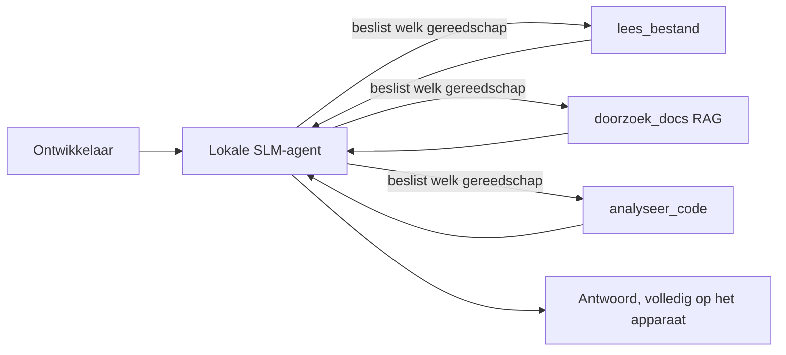
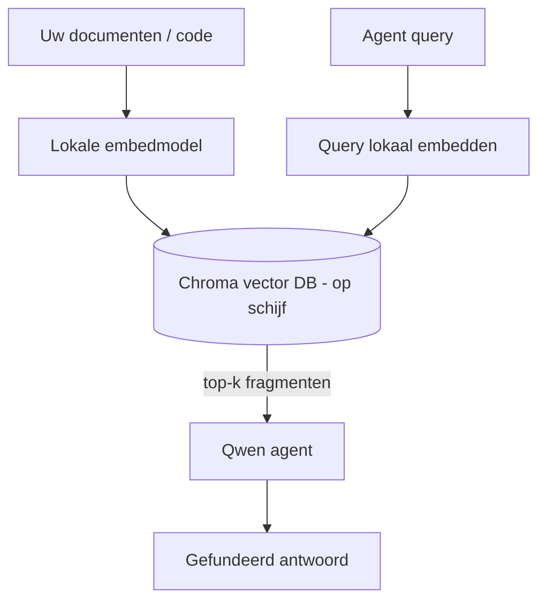
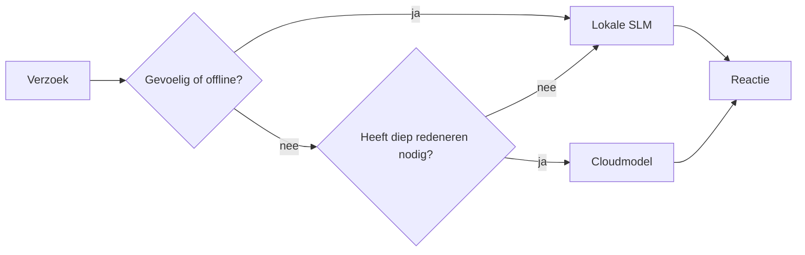

# Lokale AI-agenten maken met Microsoft Foundry Local en Qwen



De vorige les schaalde agenten *omhoog* naar de cloud. Deze brengt ze *omlaag* naar één machine. Aan het einde heb je een werkende engineering-assistent die redeneert, tools aanroept, je bestanden leest en je documentatie doorzoekt — **zonder een enkele cloud inference-aanroep.**

Waarom zou je dat willen? Drie redenen die voortdurend opkomen in echt technisch werk:

- **Privacy.** De code en documenten verlaten nooit de machine. Geen prompt, geen snippet, geen klantgegevens passeren de netwerkgrens.
- **Kosten.** Lokale inference brengt geen kosten per token met zich mee. Je kunt de hele dag itereren voor de prijs van elektriciteit.
- **Offline.** In een vliegtuig, in een beveiligde faciliteit of tijdens een storing werkt de agent nog steeds.

Het nadeel is dat je een frontlinie-cloudmodel inruilt voor een **Small Language Model (SLM)** dat draait op je CPU, GPU of NPU. Deze les gaat over het bouwen van agenten die *goed* presteren binnen die beperking in plaats van te doen alsof die beperking er niet is.

## Introductie

Deze les behandelt:

- **Small Language Models (SLM's)** — wat ze zijn, waar ze uitblinken, en waar niet.
- **Microsoft Foundry Local** — een runtime die modellen downloadt en on-device serveert via een **OpenAI-compatibele API**.
- **Qwen function-calling modellen** — SLM's die betrouwbaar tool-aanroepen produceren, wat lokale *agenten* (niet alleen lokale chat) mogelijk maakt.
- **Lokale tools, lokale RAG en lokale MCP** — die de agent functionaliteit geven zonder de cloud.
- **Hybride patronen** — wanneer je lokaal blijft en wanneer je een beroep doet op de cloud.

## Leerdoelen

Na het voltooien van deze les weet je hoe je:

- De afwegingen van SLM's uitlegt en passende gebruikssituaties voor lokale agenten kiest.
- Een Qwen-model lokaal serveert met Foundry Local en ermee verbindt via het OpenAI-compatibele eindpunt.
- Een tool-aanroepende agent bouwt die volledig op je werkstation draait.
- Lokale RAG toevoegt over je eigen documenten met behulp van een lokale vector-database (Chroma).
- De agent verbindt met een lokale MCP-server en redeneert over hybride lokale/cloudontwerpen.

## Vereisten

Deze les gaat ervan uit dat je de eerdere lessen hebt afgerond en vertrouwd bent met:

- [Tool Use](../04-tool-use/README.md) (Les 4) en [Agentic RAG](../05-agentic-rag/README.md) (Les 5).
- [Agentic Protocols / MCP](../11-agentic-protocols/README.md) (Les 11).
- Het [Microsoft Agent Framework](../14-microsoft-agent-framework/README.md) (Les 14).

Je hebt ook nodig:

- Een ontwikkelaarswerkstation. **8 GB RAM is een realistisch minimum**; 16 GB+ is comfortabel. Een GPU of NPU helpt, maar is niet verplicht.
- **Microsoft Foundry Local** geïnstalleerd (zie de setupsectie hieronder).
- Python 3.12+ en de pakketten in de repository [`requirements.txt`](../../../requirements.txt), plus `foundry-local-sdk`, `openai` en `chromadb` voor deze les.

## Small Language Models: Het juiste gereedschap voor lokaal werk

Een frontlinie-cloudmodel heeft honderden miljarden parameters en een datacentrum erachter. Een SLM heeft een paar miljard parameters en moet in het RAM van je laptop passen. Dat verschil stelt duidelijke verwachtingen.

**SLM's zijn goed in:**

- Gestructureerde, afgebakende taken — classificatie, extractie, samenvatting van een bekend document.
- **Tool-aanroepen** — beslissen welke functie aan te roepen en met welke argumenten.
- Snelle, goedkope, private iteraties op je eigen data.

**SLM's zijn zwakker in:**

- Open-eind, multi-hop redeneren over een grote context.
- Brede wereldkennis (ze hebben minder gezien en vergeten meer).

De winnende strategie voor lokale agenten is dus: **laat de SLM orkestreren en laat tools het zware werk doen.** Het model hoeft je codebase niet *te kennen* — het moet weten wanneer `read_file` en `search_docs` te gebruiken. Dat speelt direct in op de sterke punten van een SLM.



## Microsoft Foundry Local

**Microsoft Foundry Local** is een lichte runtime die modellen volledig op je machine downloadt, beheert en serveert. De belangrijkste functie voor ons is dat het een **OpenAI-compatibel HTTP-eindpunt** exposeert — wat betekent dat de OpenAI SDK en de Microsoft Agent Framework OpenAI-client ertegen werken met alleen een wijziging van `base_url`. Alles wat je hebt geleerd over het bouwen van agenten is direct over te dragen; alleen het eindpunt verhuist van de cloud naar `localhost`.

Foundry Local kiest ook automatisch de beste build van een model voor je hardware — een CPU-build, een CUDA/GPU-build of een NPU-build — zodat je niet per machine hoeft te optimaliseren.

### Setup

Installeer Foundry Local (zie de [documentatie](https://learn.microsoft.com/azure/ai-foundry/foundry-local/) voor je besturingssysteem) en controleer dat het werkt:

```bash
# Installeren (voorbeeld; volg de documentatie voor jouw platform)
winget install Microsoft.FoundryLocal      # Windows
# brew install microsoft/foundrylocal/foundrylocal   # macOS

# Download en run een Qwen-model, start daarna de lokale dienst
foundry model run qwen2.5-7b-instruct
foundry service status
```

Zodra de service draait, heb je een lokaal, OpenAI-compatibel eindpunt (meestal `http://localhost:PORT/v1`). De notebook gebruikt de `foundry-local-sdk` om het eindpunt automatisch te ontdekken, dus je hoeft de poort niet vast te coderen.

## Qwen Function Calling: Waarom het ertoe doet

Een agent is alleen een agent als hij tools kan aanroepen. Veel SLM's kunnen chatten maar produceren onbetrouwbare, foutieve tool-aanroepen. **Qwen**-modellen zijn getraind voor function calling en genereren consequent goed gevormde tool-aanroeppatronen — precies wat een lokaal chatmodel in een lokale *agent* verandert.

De flow is de standaard tool-aanroeplus die je al kent, alleen draait die on-device:


## Lokale RAG

Documentatiezoeken is waar lokale agenten hun waarde bewijzen. In plaats van te hopen dat de SLM je framework-docs heeft gememoriseerd, embed je die docs in een **lokale vector-database** en laat je de agent de relevante stukken ophalen op aanvraag.

We gebruiken **Chroma**, een ingebedde vector-store die in-process draait zonder dat er een server beheerd hoeft te worden. De keten is volledig lokaal: lokaal embeddingsmodel → lokale vectors → lokale zoekopdracht → lokale SLM.



Dit is hetzelfde Agentic RAG-patroon als in Les 5 — het enige verschil is dat elke component op je machine draait.

## Lokale MCP-servers

[MCP](../11-agentic-protocols/README.md) is een transport, geen cloudservice. Een MCP-server kan als een lokaal proces op `stdio` draaien en tools blootstellen aan je agent via het standaardprotocol. Dit stelt je in staat de groeiende ecosysteem van MCP-servers opnieuw te gebruiken — bestandsysteemtoegang, git-operaties, database-query’s — helemaal offline.

De beveiligingshouding is anders dan in de cloud, maar niet afwezig: een lokale MCP-server draait nog steeds met de rechten van je gebruiker, dus beperk wat deze kan aanraken (een projectmap, niet je hele home-map) en behandel de outputs als inputs om te valideren.

## Hybride cloud- en lokale patronen

Local-first betekent niet local-only. Volwassen systemen routeren op gevoeligheid en moeilijkheid:

| Situatie | Waar het draait |
| --- | --- |
| Gevoelige code/data of offline | **Lokale SLM** |
| Simpele, afgebakende taak | **Lokale SLM** (goedkoop, snel) |
| Moeilijk multi-hop redeneren over niet-gevoelige data | **Cloudmodel** |
| Alles, tijdens een storing | **Lokale SLM** (gracieuze degradatie) |

Dit weerspiegelt het idee van **modelroutings** uit Les 16 — behalve dat een van de "modellen" nu je eigen machine is. Een robuust ontwerp valt terug op lokaal als de cloud niet beschikbaar is, zodat de agent degradeert in kwaliteit in plaats van helemaal te falen.



## Praktijklaboratorium: Een lokale engineering-assistent

Open [`code_samples/17-local-agent-foundry-local.ipynb`](./code_samples/17-local-agent-foundry-local.ipynb) en werk het door. Je bouwt een **lokale engineering-assistent** die volledig op je werkstation draait en kan:

1. **Tools aanroepen** — via Qwen function calling via Foundry Local.
2. **Lokale bestandsoperaties uitvoeren** — bestanden in een projectmap opsommen en lezen.
3. **Code analyseren** — basisstatistieken over een bronbestand rapporteren.
4. **Documentatie doorzoeken** — lokale RAG over een map met docs met Chroma.
5. **MCP gebruiken** — verbinden met een lokale MCP-server (met een verstandige overslag als er geen is geconfigureerd).

Geen cloud-inference wordt op enig moment gebruikt.

### Doorloop

De assistent verbindt met Foundry Local via het OpenAI-compatibele eindpunt, dus de agentcode ziet er bijna identiek uit aan die in de cloudlessen — alleen de client wijzigt:

```python
from foundry_local import FoundryLocalManager
from openai import OpenAI

# Foundry Local ontdekt/downloadt het model en geeft ons een lokaal eindpunt.
manager = FoundryLocalManager(\"qwen2.5-7b-instruct\")
client = OpenAI(base_url=manager.endpoint, api_key=manager.api_key)  # api_key is een lokale tijdelijke aanduiding
```

De tools zijn gewone Python-functies met scope tot een projectmap:

```python
def read_file(path: str) -> str:
    \"\"\"Read a file, but only inside the sandboxed project directory.\"\"\"
    full = (PROJECT_ROOT / path).resolve()
    if PROJECT_ROOT not in full.parents and full != PROJECT_ROOT:
        return \"Access denied: path is outside the project directory.\"
    return full.read_text(encoding=\"utf-8\")
```

Let op de sandbox-check — zelfs lokaal is een tool die willekeurige paden leest een risico. De notebook houdt elke tool beperkt tot één projectroot.

## Kennischeck

Test je begrip voordat je naar de opdracht gaat.

**1. Noem twee concrete redenen om een agent lokaal te draaien in plaats van in de cloud.**

<details>
<summary>Antwoord</summary>

Enige twee van: **privacy** (code en data verlaten nooit de machine), **kosten** (geen kosten per token bij inference) en **offline gebruik** (werkt zonder netwerk — in een vliegtuig, in een beveiligde faciliteit of tijdens een storing). Regelgevende/compliance-beperkingen die het verzenden van data buiten het apparaat verbieden zijn een gangbare reden voor privacy.
</details>

**2. Wat is de aanbevolen taakverdeling tussen een SLM en zijn tools in een lokale agent, en waarom?**

<details>
<summary>Antwoord</summary>

Laat de SLM **orkestreren** (beslissen welke tool aan te roepen en met welke argumenten) en laat **tools het zware werk doen** (bestanden lezen, docs ophalen, resultaten berekenen). SLM's zijn sterk in afgebakende beslissingen zoals toolselectie, maar zwakker in brede kennis en lange multi-hop redenering, dus vertrouwen op tools speelt in hun kracht.
</details>

**3. Wat maakt het mogelijk om cloud-agentcode te hergebruiken met Foundry Local?**

<details>
<summary>Antwoord</summary>

Foundry Local exposeert een **OpenAI-compatibel HTTP-eindpunt**. De OpenAI SDK en de Agent Framework OpenAI-client werken ertegen door alleen de `base_url` te veranderen (en een lokale placeholder API-sleutel te gebruiken). Alles aan de agentcode blijft hetzelfde.
</details>

**4. Waarom gebruiken we specifiek een Qwen function-calling model in plaats van eender welke SLM?**

<details>
<summary>Antwoord</summary>

Omdat een agent betrouwbare, goed gevormde **tool-aanroepen** moet produceren. Veel SLM's kunnen chatten maar produceren onvolledige of inconsistente tool-aanroepsstructuren. Qwen-modellen zijn getraind voor function calling en produceren consistente tool-aanroepen, wat een lokaal chatmodel tot een werkende lokale agent maakt.
</details>

**5. Welke componenten draaien op de machine in de lokale RAG-pijplijn?**

<details>
<summary>Antwoord</summary>

Ze allemaal: het embeddingsmodel, de vector-database (Chroma, op schijf), de zoekstap, en de SLM. Documenten worden lokaal embedded, lokaal opgeslagen, lokaal opgehaald en lokaal door een model bewerkt — geen enkel onderdeel raakt de cloud aan.
</details>

**6. Een lokale MCP-server draait op je machine. Maakt dat het automatisch veilig? Welke voorzorgsmaatregel moet je nog nemen?**

<details>
<summary>Antwoord</summary>

Nee. Een lokale MCP-server draait met de rechten van je gebruiker, dus hij kan alles aanraken wat jij kunt. Beperk het tot wat nodig is (bijvoorbeeld een enkele projectmap in plaats van je hele home-map) en behandel de outputs alsof het inputs zijn die gevalideerd moeten worden voordat je acties onderneemt.
</details>

**7. Beschrijf een zinvolle hybride routeringsregel die een lokaal model omvat.**

<details>
<summary>Antwoord</summary>

Route gevoelige of offline verzoeken naar de lokale SLM; route simpele afgebakende taken naar de lokale SLM voor snelheid en kosten; route moeilijke multi-hop redeneringen over niet-gevoelige data naar een cloudmodel; en val terug op de lokale SLM als de cloud niet beschikbaar is zodat de agent gracieus degradeert in plaats van faalt. Dit is modelrouting (Les 16) waarbij de lokale machine één van de modellen is.
</details>

**8. Wat is een realistische minimum hoeveelheid RAM om de lokale agent in deze les te draaien, en wat krijg je met meer RAM?**

<details>
<summary>Antwoord</summary>

Rond **8 GB** is een realistisch minimum; 16 GB+ is comfortabel. Meer RAM laat je grotere, capabelere modellen draaien en meer context in het geheugen houden. Een GPU of NPU versnelt de inference, maar is niet vereist — Foundry Local kiest een CPU-build als er geen accelerator beschikbaar is.
</details>

## Opdracht

Breid de lokale engineering-assistent uit tot een **lokale documentatiebeoordelaar** voor een klein project naar keuze (gebruik eventueel een lesson-map uit deze repo).

Je inzending moet:

1. **Indexeer een echte docs-/code-map** in Chroma (minstens vijf bestanden).
2. **Voeg een `find_todos` tool toe** die het project scant op `TODO`/`FIXME` opmerkingen en deze retourneert met bestand en regelnummers — behoud dezelfde sandbox-check als `read_file`.

3. **Stel de agent drie vragen** die het dwingen om tools te combineren: één pure RAG-vraag, één die het lezen van een specifiek bestand vereist, en één die het vinden van TODOs vereist.
4. **Meet het**: meet de tijd van elk van de drie antwoorden en noteer ze in een markdown-cel. Geef commentaar op of de latentie acceptabel is voor je beoogde workflow.

Schrijf vervolgens een korte alinea over **wat je naar de cloud zou verplaatsen en wat je lokaal zou houden** voor deze beoordelaar, en waarom. Je wordt beoordeeld op of de lokale componenten correct met elkaar zijn verbonden en of je hybride redenering klopt — niet op modelkwaliteit.

## Samenvatting

In deze les bouwde je een agent die volledig op je eigen machine draait:

- **SLM's** ruilen breedte in voor privacy, kosten en offline werking — en blinken uit wanneer ze **tools orkestreren** in plaats van alle kennis zelf te dragen.
- **Foundry Local** bedient modellen op het apparaat achter een **OpenAI-compatibele endpoint**, zodat je cloud-agentcode met een regel wijziging kan worden overgezet.
- **Qwen functie-oproepmodellen** maken betrouwbare lokale toolaanroepen — en daarom lokale *agents* — mogelijk.
- **Lokale RAG** (Chroma) en **lokale MCP** geven de agent capaciteit zonder het apparaat te verlaten.
- **Hybride patronen** laten je routeren op basis van gevoeligheid en moeilijkheid, met lokaal als een elegante back-up.

Dit sluit de implementatiecirkel af: Les 16 schaalde agents op naar Microsoft Foundry, en deze les schaalde ze terug naar één werkstation. De volgende les richt zich op het beveiligen van geïmplementeerde agents.

## Aanvullende bronnen

- <a href="https://learn.microsoft.com/azure/ai-foundry/foundry-local/" target="_blank">Microsoft Foundry Local-documentatie</a>
- <a href="https://learn.microsoft.com/azure/ai-foundry/what-is-azure-ai-foundry" target="_blank">Microsoft Foundry-documentatie</a>
- <a href="https://learn.microsoft.com/en-us/agent-framework/overview/?wt.mc_id=youtube_26688_organicsocial_reactor&pivots=programming-language-python" target="_blank">Microsoft Agent Framework</a>
- <a href="https://qwen.readthedocs.io/en/latest/framework/function_call.html" target="_blank">Qwen functie-oproepdocumentatie</a>
- <a href="https://modelcontextprotocol.io/" target="_blank">Model Context Protocol (MCP)</a>
- <a href="https://docs.trychroma.com/" target="_blank">Chroma vectordatabase</a>

## Vorige les

[Uitrollen van schaalbare agents](../16-deploying-scalable-agents/README.md)

## Volgende les

[AI-agents beveiligen](../18-securing-ai-agents/README.md)

---

<!-- CO-OP TRANSLATOR DISCLAIMER START -->
**Disclaimer**:
Dit document is vertaald met behulp van de AI vertaaldienst [Co-op Translator](https://github.com/Azure/co-op-translator). Hoewel we streven naar nauwkeurigheid, dient u er rekening mee te houden dat geautomatiseerde vertalingen fouten of onnauwkeurigheden kunnen bevatten. Het originele document in de oorspronkelijke taal moet worden beschouwd als de gezaghebbende bron. Voor kritieke informatie wordt professionele menselijke vertaling aanbevolen. Wij zijn niet aansprakelijk voor eventuele misverstanden of verkeerde interpretaties die voortvloeien uit het gebruik van deze vertaling.
<!-- CO-OP TRANSLATOR DISCLAIMER END -->