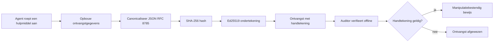
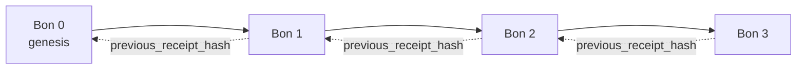

[Bekijk de lesvideo: AI-agents beveiligen met cryptografische ontvangstbewijzen](https://youtu.be/PLACEHOLDER_VIDEO_ID)

> _(Lesvideo en thumbnail worden na samenvoeging toegevoegd door het Microsoft contentteam, passend bij het patroon van les 14 / 15.)_

# AI-agents beveiligen met cryptografische ontvangstbewijzen

## Introductie

Deze les behandelt:

- Waarom audit trails voor AI-agents belangrijk zijn voor compliance, debugging en vertrouwen.
- Wat een cryptografisch ontvangstbewijs is en hoe dat verschilt van een niet-ondertekende logregel.
- Hoe je in plain Python een ondertekend ontvangstbewijs maakt voor een tool-aanroep van een agent.
- Hoe je een ontvangstbewijs offline verifieert en manipulatie detecteert.
- Hoe je ontvangstbewijzen aan elkaar ketent zodat het verwijderen of herschikken de keten verbreekt.
- Wat ontvangstbewijzen bewijzen en wat ze expliciet niet bewijzen.

## Leerdoelen

Na het voltooien van deze les kun je:

- De faalwijzen herkennen die cryptografische herkomst van agentacties motiveren.
- Een Ed25519-ondertekend ontvangstbewijs produceren over een canonieke JSON-payload.
- Een ontvangstbewijs onafhankelijk verifiëren met alleen de publieke sleutel van de ondertekenaar.
- Manipulatie detecteren door verificatie opnieuw uit te voeren op een aangepast ontvangstbewijs.
- Een hash-geketende reeks ontvangstbewijzen bouwen en uitleggen waarom de keten belangrijk is.
- Het grensvlak herkennen tussen wat ontvangstbewijzen bewijzen (attribuering, integriteit, volgorde) en wat ze niet bewijzen (correctheid van de actie, juistheid van het beleid).

## Het probleem: de audit trail van je agent

Stel, je hebt een AI-agent ingezet voor Contoso Travel. De agent leest klantverzoeken, roept een vlucht-API aan om opties op te zoeken en boekt namens de klant stoelen. Vorig kwartaal verwerkte de agent 50.000 boekingen.

Vandaag komt een auditor. Hij stelt een simpele vraag: "Laat me zien wat je agent gedaan heeft."

Je overhandigt je logbestanden. De auditor bekijkt ze en stelt de lastigere vraag: "Hoe weet ik dat deze logs niet zijn aangepast?"

Dit is het audit-trail-probleem. De meeste agentimplementaties vertrouwen tegenwoordig op:

- **Applicatielogs**: geschreven door de agent zelf, aanpasbaar door iedereen met bestandssysteemtoegang.
- **Cloud loggingdiensten**: platformniveau is manipulatie-bestendig, maar alleen als de auditor de platformbeheerder vertrouwt.
- **Databasetransactielogs**: goed geschikt voor databasewijzigingen maar niet voor willekeurige tool-aanroepen.

Geen van deze kan de vraag van de auditor beantwoorden zonder dat die iemand moet vertrouwen (jou, je cloudprovider, je databaseleverancier). Voor intern gebruik is dat vertrouwen vaak acceptabel. Voor gereguleerde workloads (financiën, gezondheidszorg, alles onder de EU AI Act) niet.

Cryptografische ontvangstbewijzen lossen dit op door elke agentactie onafhankelijk verifieerbaar te maken. De auditor hoeft jou niet te vertrouwen. Hij heeft alleen jouw publieke sleutel en het ontvangstbewijs zelf nodig.

## Wat is een cryptografisch ontvangstbewijs?

Een ontvangstbewijs is een JSON-object dat vastlegt wat een agent gedaan heeft, ondertekend met een digitale handtekening.



Een minimaal ontvangstbewijs ziet er zo uit:

```json
{
  "type": "agent.tool_call.v1",
  "agent_id": "contoso-travel-bot",
  "tool_name": "lookup_flights",
  "tool_args_hash": "sha256:a3f9c1...",
  "result_hash": "sha256:7b2e1d...",
  "policy_id": "contoso-travel-policy-v3",
  "timestamp": "2026-04-25T14:30:00Z",
  "sequence": 47,
  "previous_receipt_hash": "sha256:9d4e6a...",
  "signature": {
    "alg": "EdDSA",
    "sig": "c5af83...",
    "public_key": "8f3b2c..."
  }
}
```

Drie eigenschappen doen het werk:

1. **De handtekening**. Het ontvangstbewijs is ondertekend door de gateway van de agent met een Ed25519 private key. Iedereen met de bijbehorende publieke sleutel kan de handtekening offline verifiëren. Manipulatie van elk veld maakt de handtekening ongeldig.

2. **Canonieke codering**. Voor het ondertekenen wordt het ontvangstbewijs geserialiseerd met de JSON Canonicalization Scheme (JCS, RFC 8785). Dit zorgt ervoor dat twee implementaties die hetzelfde logische ontvangstbewijs produceren, exact byte-identieke output geven. Zonder canoniek maken zouden verschillende JSON-serializers verschillende handtekeningen geven voor dezelfde inhoud.

3. **Hash-keten**. Het veld `previous_receipt_hash` verbindt elk ontvangstbewijs met het voorgaande. Het verwijderen of herschikken van een ontvangstbewijs breekt elk daaropvolgend ontvangstbewijs. Manipulatie wordt dus zichtbaar op ketenniveau, zelfs als individuele handtekeningen worden omzeild.

Samen bieden deze eigenschappen drie garanties:

- **Attribuering**: deze sleutel heeft deze inhoud ondertekend.
- **Integriteit**: de inhoud is sinds ondertekening niet veranderd.
- **Volgorde**: dit ontvangstbewijs kwam na dat ontvangstbewijs in de keten.

## Een ontvangstbewijs maken in Python

Je hebt geen speciale bibliotheek nodig om een ontvangstbewijs te maken. De cryptografische primitieve zijn breed beschikbaar en de logica is een paar dozijn regels Python.

De praktische oefeningen in `code_samples/18-signed-receipts.ipynb` doorlopen de volledige workflow. De samenvatting:

```python
import json
import hashlib
import base64
from nacl import signing
from jcs import canonicalize  # RFC 8785 canonieke JSON

def b64url_nopad(data: bytes) -> str:
    return base64.urlsafe_b64encode(data).decode("ascii").rstrip("=")

def sha256_canonical(obj) -> str:
    """SHA-256 of a Python object's JCS-canonical JSON form."""
    return f"sha256:{hashlib.sha256(canonicalize(obj)).hexdigest()}"

# Genereer of laad een ondertekeningssleutel (in productie, opslaan in een sleutelkluis)
signing_key = signing.SigningKey.generate()
verify_key = signing_key.verify_key

# Bouw de ontvangstgegevens op (nog geen handtekening)
tool_args = {"origin": "SYD", "destination": "LAX"}
tool_result = [{"flight": "QF11", "price": 1850, "stops": 0}]

payload = {
    "type": "agent.tool_call.v1",
    "agent_id": "contoso-travel-bot",
    "tool_name": "lookup_flights",
    "tool_args_hash": sha256_canonical(tool_args),
    "result_hash": sha256_canonical(tool_result),
    "policy_id": "contoso-travel-policy-v3",
    "timestamp": "2026-04-25T14:30:00Z",
    "sequence": 0,
    "previous_receipt_hash": None,
}

# Canoniseren, hashen, ondertekenen.
canonical_bytes = canonicalize(payload)
message_hash = hashlib.sha256(canonical_bytes).digest()
signature_bytes = signing_key.sign(message_hash).signature

# Voeg een gestructureerd handtekeningobject toe.
receipt = {
    **payload,
    "signature": {
        "alg": "EdDSA",
        "sig": b64url_nopad(signature_bytes),
        "public_key": b64url_nopad(bytes(verify_key)),
    },
}
```

Dat is de hele ondertekeningspijplijn. De oefeningen in de notebook leggen elke stap uit.

## Een ontvangstbewijs verifiëren en manipulatie detecteren

Verificatie is de inverse operatie:

```python
import base64
import hashlib
from nacl import signing
from nacl.exceptions import BadSignatureError
from jcs import canonicalize

def b64url_decode(s: str) -> bytes:
    padding = "=" * ((4 - len(s) % 4) % 4)
    return base64.urlsafe_b64decode(s + padding)

def verify_receipt(receipt: dict) -> bool:
    # De handtekening is een gestructureerd object: {"alg", "sig", "public_key"}.
    sig_obj = receipt.get("signature")
    if not sig_obj or sig_obj.get("alg") != "EdDSA":
        return False

    # Reconstrueer de payload die daadwerkelijk werd ondertekend (alles behalve de handtekening).
    payload = {k: v for k, v in receipt.items() if k != "signature"}

    canonical_bytes = canonicalize(payload)
    message_hash = hashlib.sha256(canonical_bytes).digest()

    try:
        verify_key = signing.VerifyKey(b64url_decode(sig_obj["public_key"]))
        verify_key.verify(message_hash, b64url_decode(sig_obj["sig"]))
        return True
    except BadSignatureError:
        return False
```

Deze functie neemt een ontvangstbewijs en geeft `True` terug als de handtekening geldig is, anders `False`. Geen netwerkverzoek, geen service-afhankelijkheid, geen vertrouwen in derde partijen vereist.

Om manipulatie detectie in actie te zien, doorloopt de notebook:

1. Een geldig ontvangstbewijs maken en bevestigen dat het verifieert.
2. Eén byte van het veld `tool_args_hash` aanpassen.
3. Verificatie opnieuw uitvoeren en zien dat het faalt.

Dit is de praktische demonstratie dat ontvangstbewijzen manipulatie-bestendig zijn: elke wijziging, hoe klein ook, verbreekt de handtekening.

## Ontvangstbewijzen aan elkaar ketenen voor multi-stap agents

Een enkel ondertekend ontvangstbewijs beschermt één actie. Een keten van ontvangstbewijzen beschermt een reeks.



Elk ontvangstbewijs registreert de hash van het voorgaande ontvangstbewijs. Om ontvangstbewijs 2 stilletjes te verwijderen zou een aanvaller óf:

- Het `previous_receipt_hash`-veld van ontvangstbewijs 3 aanpassen (maakt de handtekening van ontvangstbewijs 3 ongeldig), OF
- Een nieuwe handtekening vervalsen op een aangepast ontvangstbewijs 3 (vereist de private key van de agent).

Als de private key in een hardware key vault zit en je publiceert de publieke sleutel bij elk ontvangstbewijs, is geen van beide aanvallen haalbaar zonder detectie.

De notebook doorloopt:

1. Het bouwen van een keten van drie ontvangstbewijzen.
2. Verifiëren dat elk `previous_receipt_hash` overeenkomt met de actuele hash van het voorgaande ontvangstbewijs.
3. Manipuleren van een ontvangstbewijs in het midden en zien dat de keten precies op dat punt breekt.

Dit is hoe je een audit trail produceert die een externe auditor kan verifiëren zonder jou te hoeven vertrouwen.

## Wat ontvangstbewijzen bewijzen (en wat niet)

Dit is het belangrijkste deel van deze les. Ontvangstbewijzen zijn krachtig, maar hun kracht is begrensd.

**Ontvangstbewijzen bewijzen drie dingen:**

1. **Attribuering**: een specifieke sleutel heeft een specifieke payload ondertekend.
2. **Integriteit**: de payload is sinds ondertekening niet veranderd.
3. **Volgorde**: dit ontvangstbewijs kwam na dat ontvangstbewijs in de hash-keten.

**Ontvangstbewijzen bewijzen NIET:**

1. **Correctheid**: dat de actie van de agent de juiste actie was. Een ontvangstbewijs kan net zo goed voor een fout antwoord getekend zijn als voor een goed antwoord.
2. **Beleidsnaleving**: dat het beleid genoemd in `policy_id` daadwerkelijk is geëvalueerd, of dat het deze actie zou hebben toegestaan als het zou zijn gecontroleerd. Het ontvangstbewijs legt vast wat werd beweerd, niet wat werd afgedwongen.
3. **Identiteit voorbij de sleutel**: het ontvangstbewijs zegt "deze sleutel tekende deze inhoud." Het zegt niet "deze persoon heeft dit goedgekeurd." Een sleutel aan een persoon of organisatie koppelen vereist aparte identiteit-infrastructuur (een directory, een openbaar sleutelregister, enz.).
4. **Waarheidsgetrouwheid van inputs**: als de agent een gemanipuleerde prompt ontvangt en daarop reageert, registreert het ontvangstbewijs de actie nauwkeurig. Ontvangstbewijzen zijn downstream van inputvalidatie, geen vervanging daarvan.

Deze grens is belangrijk om twee redenen:

- Het vertelt waarvoor ontvangstbewijzen nuttig zijn: het gedrag van een agent auditabel en manipulatieresistent maken, ook over organisatiegrenzen heen.
- Het vertelt welke extra lagen je nog nodig hebt: inputvalidatie (Les 6), beleidsafdwinging (kort hieronder behandeld), en identiteit-infrastructuur (buiten scope van deze les).

Een veelgemaakte fout is aannemen dat “we hebben ontvangstbewijzen” betekent “we hebben governance.” Dat is niet zo. Ontvangstbewijzen zijn een fundament. Governance is het systeem dat je erop bouwt.

## Productiereferenties

De Python-code in deze les is bewust minimalistisch zodat je elke regel kunt lezen en precies begrijpt wat er gebeurt. In productie heb je twee opties:

1. **Direct bouwen op cryptografische primitieve.** De 50 regels hierboven zijn voldoende voor veel use cases. PyNaCl (Ed25519) en het `jcs`-pakket (canonieke JSON) zijn goed onderhouden en gecontroleerde bibliotheken.

2. **Een productiebibliotheek voor ontvangstbewijzen gebruiken.** Verschillende open-source projecten implementeren hetzelfde patroon met extra functies (sleutelrotatie, batchverificatie, JWK Set distributie, integratie met beleidsengines):
   - Het gebruikte ontvangstbewijsformaat in deze les volgt een IETF Internet-Draft (`draft-farley-acta-signed-receipts`) die momenteel in het standaardisatieproces zit.
   - De Microsoft Agent Governance Toolkit combineert ontvangstbewijzen met Cedar-gebaseerde beleidsbeslissingen; zie Tutorial 33 in die repository voor een end-to-end voorbeeld.
   - De packages `protect-mcp` (npm) en `@veritasacta/verify` (npm) bieden een Node-implementatie van ontvangstbewijs ondertekening en offline verificatie, bedoeld om elke MCP-server te omhullen met een manipulatie-bestendige audit trail.

De keuze tussen zelf bouwen en een bibliotheek gebruiken lijkt op het kiezen tussen zelf een JWT-bibliotheek schrijven of een geteste bibliotheek gebruiken: beide zijn acceptabel; de bibliotheek bespaart tijd en vermindert het audit-oppervlak; zelf bouwen dwingt je alle primitieve te begrijpen. Deze les leert de zelfbouw zodat je de basis voor beide opties hebt.

## Kenniscontrole

Test je begrip voordat je doorgaat naar de praktijkopdracht.

**1. Een ontvangstbewijs is ondertekend met de private Ed25519-sleutel van de agent. De auditor heeft alleen de publieke sleutel. Kan de auditor het ontvangstbewijs offline verifiëren?**

<details>
<summary>Antwoord</summary>

Ja. Ed25519-verificatie vereist alleen de publieke sleutel en de ondertekende bytes. Geen netwerkverzoek, geen service-afhankelijkheid. Dit is de eigenschap waardoor ontvangstbewijzen nuttig zijn in gesloten netwerken, multi-organisatie of lage-vertrouwen auditomgevingen.
</details>

**2. Een aanvaller past het veld `policy_id` van een ontvangstbewijs aan om te beweren dat een vrijgeviger beleid van toepassing was. De handtekening was over de originele payload. Wat gebeurt er bij verificatie?**

<details>
<summary>Antwoord</summary>

Verificatie faalt. De handtekening werd berekend over de canonieke bytes van de originele payload; het aanpassen van een veld verandert de canonieke bytes, wat de SHA-256 hash verandert, waardoor de handtekening ongeldig wordt. De aanvaller zou de private key nodig hebben om een nieuwe geldige handtekening te maken, die hij niet heeft.
</details>

**3. Waarom bevat het ontvangstbewijs een `tool_args_hash` en `result_hash` in plaats van de ruwe argumenten en resultaten?**

<details>
<summary>Antwoord</summary>

Twee redenen. Ten eerste moet een ontvangstbewijs mogelijk gearchiveerd of verzonden worden in omgevingen waar het lekken van ruwe inhoud (PII, zakelijke data) een probleem is. Hashing houdt het ontvangstbewijs klein en de inhoud prive; de auditor verifieert dat de hash klopt met een elders opgeslagen kopie van de echte inhoud. Ten tweede hebben hashes een vaste grootte; een ontvangstbewijs met hashes is beperkt in grootte, ongeacht hoe groot de inputs en outputs waren.
</details>

**4. Het veld `previous_receipt_hash` verbindt elk ontvangstbewijs met zijn voorganger. Als een aanvaller stilletjes een ontvangstbewijs uit het midden van een keten verwijdert, wat wordt dan ongeldig?**

<details>
<summary>Antwoord</summary>

Elk ontvangstbewijs dat na het verwijderde komt. Hun velden `previous_receipt_hash` komen niet meer overeen met de keten (omdat het ontvangstbewijs waarnaar wordt verwezen niet meer bestaat, of de keten nu naar een andere voorganger wijst). Om de verwijdering te verbergen zou de aanvaller elke volgend ontvangstbewijs opnieuw moeten ondertekenen, wat de private key vereist.
</details>

**5. Een ontvangstbewijs verifieert schoon. Bewijst dit dat de actie van de agent correct, juist, of beleidsconform was?**

<details>
<summary>Antwoord</summary>

Nee. Een geldig ontvangstbewijs bewijst drie dingen: attribuering (deze sleutel tekende deze inhoud), integriteit (de inhoud is niet veranderd), en volgorde (dit ontvangstbewijs kwam na dat). Het bewijst NIET dat de actie correct was, dat het beleid genoemd in `policy_id` echt is geëvalueerd, of dat de agent elke regel gevolgd heeft. Ontvangstbewijzen maken gedrag auditabel, niet per se correct. Dit is de belangrijkste grens in de les.
</details>

## Praktijkopdracht

Open `code_samples/18-signed-receipts.ipynb` en voltooi alle vier secties:

1. **Sectie 1**: Onderteken je eerste ontvangstbewijs en verifieer het.
2. **Sectie 2**: Manipuleer het ontvangstbewijs en zie de verificatie mislukken.
3. **Sectie 3**: Bouw een keten van drie ontvangstbewijzen en verifieer de ketenintegriteit.
4. **Sectie 4**: Pas het patroon toe op een agent gebouwd met het Microsoft Agent Framework: wikkel een tool-aanroep in ontvangstbewijs-ondertekening en verifieer het ontvangstbewijs onafhankelijk.

**Extra uitdaging 1:** breid het ontvangstbewijs-schema uit met een extra veld naar keuze (bijvoorbeeld een request-ID voor tracing), werk de canonieke ondertekenlogica bij om dit op te nemen, en bevestig dat het ontvangstbewijs nog steeds correct door verificatie komt. Pas het veld vervolgens aan na ondertekening en bevestig dat verificatie faalt. Dit dwingt je te begrijpen hoe iedere byte van de canonieke codering bijdraagt aan de handtekening.
**Stretch-uitdaging 2:** SHA-256-hash twee van je bonnen samen (concateneer hun canonieke bytes in een deterministische volgorde) en voeg de resulterende digest toe als een nieuw veld op een derde bon voordat je deze ondertekent. Verifieer dat alle drie de bonnen nog steeds correct kunnen worden teruggelezen. Je hebt zojuist een éénstaps-inclusiebewijs gebouwd: iedereen met de derde bon kan bewijzen dat de eerste twee bestonden op het moment dat deze werden ondertekend, zonder de inhoud ervan te hoeven onthullen. Dit is het patroon dat selectief openbaar gemaakte bonnen op grote schaal gebruiken (Merkle-commits, RFC 6962).

## Conclusie

Cryptografische bonnen geven AI-agenten een audittrail die:

- **Onafhankelijk verifieerbaar** is: elke partij met de publieke sleutel kan verifiëren, zonder afhankelijkheid van een service.
- **Manipulatie zichtbaar maakt**: elke wijziging maakt de handtekening ongeldig.
- **Draagbaar** is: een bon is een klein JSON-bestand; het kan worden gearchiveerd, verzonden en overal worden geverifieerd.
- **Standaardaligned** is: gebouwd op Ed25519 (RFC 8032), JCS (RFC 8785) en SHA-256, allemaal breed gebruikte primitieve vormen.

Ze zijn geen vervanging voor invoervalidatie, beleidsafhandeling of identiteitsinfrastructuur. Ze zijn een fundament voor die lagen. Wanneer je agenten inzet in gereguleerde workloads, multi-organisatie workflows, of elke omgeving waar een toekomstige auditor niet zomaar vertrouwen kan worden gegeven, zijn bonnen hoe je de audittrail eerlijk maakt.

De belangrijkste conclusie: bonnen bewijzen wie wat zei en wanneer. Ze bewijzen niet dat wat gezegd werd waar of correct was. Houd dat onderscheid strak vast. Het is het verschil tussen een eerlijk provenance-systeem en een misleidend systeem.

## Productie-checklist

Wanneer je klaar bent om van deze les over te stappen naar het implementeren van met bonnen ondertekende agenten in een echte omgeving:

- [ ] **Verplaats de ondertekeningssleutel van de ontwikkelaarslaptop.** Gebruik Azure Key Vault, AWS KMS, of een hardware-beveiligingsmodule. De privésleutel die je bonnen ondertekent mag nooit in source control of in platte tekst op applicatiemachines worden opgeslagen.
- [ ] **Publiceer de verificatie publieke sleutel.** Auditors hebben deze nodig voor offline verificatie. Het standaardpatroon is een JWK Set op een bekende URL (RFC 7517), bijvoorbeeld `https://your-org.example.com/.well-known/agent-keys.json`.
- [ ] **Veranker de keten extern.** Schrijf periodiek de laatste ketenhoofd-hash naar een transparantielogboek (Sigstore Rekor, RFC 3161 timestamp authority, of een tweede intern systeem) zodat een externe partij kan bevestigen "deze keten bestond op dit moment."
- [ ] **Sla bonnen onveranderlijk op.** Append-only blob storage (Azure Storage met onveranderbaarheidspolicies, AWS S3 Object Lock) voorkomt dat een insider de geschiedenis herschrijft op het opslagniveau.
- [ ] **Bepaal de bewaartermijn.** Veel nalevingsregels vereisen meerdere jaren behoud. Plan voor groei van de bonnen (elke bon is ~500 bytes; een agent die 10K calls per dag maakt produceert ~1,8 GB per jaar).
- [ ] **Documenteer wat bonnen niet afdekken.** Bonnen bewijzen toeschrijving, integriteit en ordening. Je runbook moet expliciet benoemen welke aanvullende controles (invoervalidatie, beleidsuitvoering, rate limiting, identiteitsinfrastructuur) naast bonnen in je governance-positie bestaan.

### Meer vragen over het beveiligen van AI-agenten?

Word lid van de [Microsoft Foundry Discord](https://aka.ms/ai-agents/discord) om andere leerlingen te ontmoeten, kantooruren bij te wonen en je AI-agentenvragen beantwoord te krijgen.

## Verder dan deze les

Deze les behandelt enkelvoudig bonondertekening en hash-gekoppelde reeksen. Dezelfde primitieve vormen componeren in meerdere geavanceerdere patronen die je kunt tegenkomen naarmate je governance-positie volwassen wordt:

- **Selectieve openbaarmaking.** Wanneer de velden van een bon onafhankelijk worden vastgelegd (RFC 6962-stijl Merkle-boom), kun je specifieke velden aan specifieke auditors onthullen en bewijzen dat de rest ongewijzigd is zonder ze bloot te stellen. Handig als dezelfde bon zowel een uitgebreide audit moet doorstaan (die volledigheid wil) als dataminimalisatie-regelgeving zoals GDPR (die wil dat de auditor zo min mogelijk ziet).
- **Intrekking van bonnen.** Als een ondertekeningssleutel gecompromitteerd is, heb je een manier nodig om alle bonnen ondertekend met die sleutel als onbetrouwbaar te markeren vanaf een bepaald moment. Standaardpatronen: kortdurende ondertekeningssleutels plus een gepubliceerde intrekkingslijst, of een transparantielog met intrekkingsvermeldingen.
- **Bilateral / gesplitste ondertekening van bonnen.** Sommige implementaties splitsen de ondertekende payload in een pre-executie (`authorization_*`) en post-executie (`result_*`) helft met onafhankelijke handtekeningen, nuttig wanneer het autorisatiebesluit en het geobserveerde resultaat door verschillende actoren of op verschillende tijden worden geproduceerd. Dit bouwt voort op het bonformaat dat in deze les is geleerd.
- **Payloadcompositie.** Een bon verzegelt welke bytes je ook in `result_hash` zet. Payloads uit de praktijk zijn vaak rijker dan een enkele tool call resultaat: pre-decisie redenering (modelvoorspelling, overwogen opties, bewijs en de volledigheid ervan, risicohouding, verantwoordingsketen, poortresultaat) kan allemaal in de payload zitten, verzegeld door één enkele bon. Dit houdt het bonformaat minimaal terwijl payloadschema’s domein-per-domein kunnen evolueren.
- **Conformiteit tussen implementaties.** Meerdere onafhankelijke implementaties van hetzelfde bonformaat (Python, TypeScript, Rust, Go) verifieren elkaar met gedeelde testvectoren. Bouw je een eigen implementatie, dan bevestigt validatie tegen gepubliceerde vectoren de compatibiliteit op het netwerkniveau.
- **Post-quantum migratie.** Ed25519 is vandaag breed ingezet maar is niet quantum-bestendig. Het bonformaat is algoritme-agnostisch: het veld `signature.alg` kan `ML-DSA-65` dragen (de NIST post-quantum ondertekeningsstandaard) wanneer je moet migreren. Plan een overgangsperiode waarin bonnen dubbelondertekend zijn.

## Aanvullende bronnen

- <a href="https://datatracker.ietf.org/doc/draft-farley-acta-signed-receipts/" target="_blank">IETF Internet-Draft: Ondertekende beslissingsbonnen voor machine-tot-machine toegangscontrole</a>
- <a href="https://learn.microsoft.com/azure/ai-studio/responsible-use-of-ai-overview" target="_blank">Verantwoord gebruik van AI overzicht (Azure AI)</a>
- <a href="https://datatracker.ietf.org/doc/html/rfc8032" target="_blank">RFC 8032: Edwards-Curve Digitale Handtekeningalgoritme (EdDSA)</a>
- <a href="https://datatracker.ietf.org/doc/html/rfc8785" target="_blank">RFC 8785: JSON Canonicalization Scheme (JCS)</a>
- <a href="https://datatracker.ietf.org/doc/html/rfc6962" target="_blank">RFC 6962: Certificaattransparantie</a> (Merkle-boomconstructie gebruikt door selectief openbaar gemaakte bonnen)
- <a href="https://github.com/microsoft/agent-governance-toolkit/blob/main/docs/tutorials/33-offline-verifiable-receipts.md" target="_blank">Microsoft Agent Governance Toolkit, Tutorial 33: Offline verifieerbare beslissingsbonnen</a>
- <a href="https://github.com/ScopeBlind/agent-governance-testvectors" target="_blank">Conformiteit testvectoren tussen implementaties</a> voor het in deze les gebruikte bonformaat (Apache-2.0)
- <a href="https://pynacl.readthedocs.io/" target="_blank">PyNaCl documentatie</a> (Ed25519 in Python)

## Vorige les

[Computer Use Agents bouwen (CUA)](../15-browser-use/README.md)

## Volgende les

_(Wordt bepaald door de curriculumbeheerders)_

---

<!-- CO-OP TRANSLATOR DISCLAIMER START -->
**Disclaimer**:
Dit document is vertaald met behulp van de AI vertaaldienst [Co-op Translator](https://github.com/Azure/co-op-translator). Hoewel we streven naar nauwkeurigheid, dient u er rekening mee te houden dat geautomatiseerde vertalingen fouten of onnauwkeurigheden kunnen bevatten. Het originele document in de oorspronkelijke taal moet worden beschouwd als de gezaghebbende bron. Voor kritieke informatie wordt professionele menselijke vertaling aanbevolen. Wij zijn niet aansprakelijk voor eventuele misverstanden of verkeerde interpretaties die voortvloeien uit het gebruik van deze vertaling.
<!-- CO-OP TRANSLATOR DISCLAIMER END -->