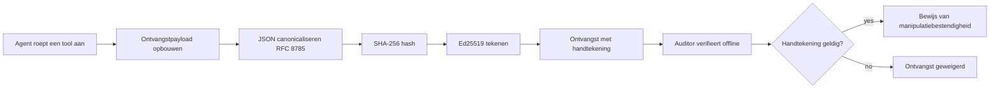
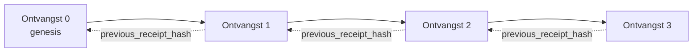

[Bekijk de lesvideo: AI-agenten beveiligen met cryptografische kwitanties](https://youtu.be/PLACEHOLDER_VIDEO_ID)

> _(Lesvideo en thumbnail worden na samenvoeging toegevoegd door het Microsoft-contentteam, passend bij het patroon van les 14 / 15.)_

# AI-agenten beveiligen met cryptografische kwitanties

## Introductie

Deze les behandelt:

- Waarom audit-trails voor AI-agenten belangrijk zijn voor compliance, debugging en vertrouwen.
- Wat een cryptografische kwitantie is en hoe dit verschilt van een niet-ondertekende loglijn.
- Hoe je in gewone Python een ondertekende kwitantie produceert voor een tool-aanroep van een agent.
- Hoe je een kwitantie offline verifieert en manipulatie detecteert.
- Hoe je kwitanties aan elkaar ketent zodat het verwijderen of herschikken ervan de keten breekt.
- Wat kwitanties bewijzen en wat ze expliciet niet bewijzen.

## Leerdoelen

Na het voltooien van deze les weet je hoe je:

- De faalmodi identificeert die aanleiding geven tot cryptografische herkomst voor agentacties.
- Een Ed25519-ondertekende kwitantie produceert op een canonieke JSON-payload.
- Een kwitantie onafhankelijk verifieert met alleen de publieke sleutel van de ondertekenaar.
- Manipulatie detecteert door verificatie opnieuw uit te voeren op een gewijzigde kwitantie.
- Een hash-geketende reeks kwitanties bouwt en uitlegt waarom de keten ertoe doet.
- De grens herkent tussen wat kwitanties bewijzen (toeschrijving, integriteit, ordening) en wat ze niet bewijzen (correctheid van de actie, deugdelijkheid van het beleid).

## Het probleem: de audit-trail van je agent

Stel je voor dat je een AI-agent hebt ingezet voor Contoso Travel. De agent leest klantverzoeken, roept een vluchten-API aan om opties op te zoeken en boekt stoelen namens de klant. In het afgelopen kwartaal verwerkte de agent 50.000 boekingen.

Vandaag komt een auditor binnen. Hij stelt een eenvoudige vraag: "Laat me zien wat je agent heeft gedaan."

Je overhandigt je logbestanden. De auditor bekijkt ze en stelt een moeilijkere vraag: "Hoe weet ik dat deze logs niet zijn aangepast?"

Dit is het audit-trailprobleem. De meeste agent-implementaties gebruiken tegenwoordig:

- **Applicatielogs**: geschreven door de agent zelf, bewerkbaar door iedereen met toegang tot het bestandssysteem.
- **Cloud-loggingdiensten**: platform-niveau tamper-evident, maar alleen als de auditor de platformbeheerder vertrouwt.
- **Database-transactielogs**: goed geschikt voor databasewijzigingen, maar niet voor willekeurige tool-aanroepen.

Geen van deze kan de vraag van de auditor beantwoorden zonder dat de auditor iemand moet vertrouwen (jou, je cloudprovider, je databaseleverancier). Voor intern gebruik is dat vaak acceptabel. Voor gereguleerde workloads (financiën, gezondheidszorg, alles onder de EU AI-wet) is dat niet zo.

Cryptografische kwitanties lossen dit op door elke agentactie onafhankelijk verifieerbaar te maken. De auditor hoeft jou niet te vertrouwen. Alleen jouw publieke sleutel en de kwitantie zelf zijn nodig.

## Wat is een cryptografische kwitantie?

Een kwitantie is een JSON-object dat vastlegt wat een agent deed, ondertekend met een digitale handtekening.



Een minimale kwitantie ziet er als volgt uit:

```json
{
  "type": "agent.tool_call.v1",
  "agent_id": "contoso-travel-bot",
  "tool_name": "lookup_flights",
  "tool_args_hash": "sha256:a3f9c1...",
  "result_hash": "sha256:7b2e1d...",
  "policy_id": "contoso-travel-policy-v3",
  "timestamp": "2026-04-25T14:30:00Z",
  "sequence": 47,
  "previous_receipt_hash": "sha256:9d4e6a...",
  "signature": {
    "alg": "EdDSA",
    "sig": "c5af83...",
    "public_key": "8f3b2c..."
  }
}
```

Drie eigenschappen doen het werk:

1. **De handtekening**. De kwitantie is ondertekend door de gateway van de agent met een Ed25519-private sleutel. Iedereen met de corresponderende publieke sleutel kan de handtekening offline verifiëren. Manipulatie van een veld maakt de handtekening ongeldig.

2. **Canonieke codering**. Voor het ondertekenen wordt de kwitantie geserialiseerd volgens het JSON Canonicalization Scheme (JCS, RFC 8785). Dit zorgt ervoor dat twee implementaties die dezelfde logische kwitantie produceren, exact identieke bytes genereren. Zonder canonieke codering zouden verschillende JSON-serializers verschillende handtekeningen genereren voor dezelfde inhoud.

3. **Hash-keten**. Het veld `previous_receipt_hash` koppelt elke kwitantie aan de voorgaande. Het verwijderen of herschikken van een kwitantie breekt elke daaropvolgende kwitantie. Manipulatie wordt zichtbaar op ketenniveau, ook als individuele handtekeningen worden omzeild.

Samen bieden deze eigenschappen drie garanties:

- **Toeschrijving**: deze sleutel ondertekende deze inhoud.
- **Integriteit**: de inhoud is niet gewijzigd sinds ondertekening.
- **Ordening**: deze kwitantie kwam na die kwitantie in de keten.

## Een kwitantie produceren in Python

Je hebt geen speciale bibliotheek nodig om een kwitantie te produceren. De cryptografische primitieven zijn breed beschikbaar en de logica is een paar tientallen regels Python.

De praktische oefeningen in `code_samples/18-signed-receipts.ipynb` lopen de volledige flow door. De samenvatting:

```python
import json
import hashlib
import base64
from nacl import signing
from jcs import canonicalize  # RFC 8785 canonieke JSON

def b64url_nopad(data: bytes) -> str:
    return base64.urlsafe_b64encode(data).decode("ascii").rstrip("=")

def sha256_canonical(obj) -> str:
    """SHA-256 of a Python object's JCS-canonical JSON form."""
    return f"sha256:{hashlib.sha256(canonicalize(obj)).hexdigest()}"

# Genereer of laad een ondertekeningssleutel (in productie, sla op in een sleutelkluis)
signing_key = signing.SigningKey.generate()
verify_key = signing_key.verify_key

# Bouw de ontvangstgegevens (nog geen handtekening)
tool_args = {"origin": "SYD", "destination": "LAX"}
tool_result = [{"flight": "QF11", "price": 1850, "stops": 0}]

payload = {
    "type": "agent.tool_call.v1",
    "agent_id": "contoso-travel-bot",
    "tool_name": "lookup_flights",
    "tool_args_hash": sha256_canonical(tool_args),
    "result_hash": sha256_canonical(tool_result),
    "policy_id": "contoso-travel-policy-v3",
    "timestamp": "2026-04-25T14:30:00Z",
    "sequence": 0,
    "previous_receipt_hash": None,
}

# Canonicaliseer, hash, onderteken.
canonical_bytes = canonicalize(payload)
message_hash = hashlib.sha256(canonical_bytes).digest()
signature_bytes = signing_key.sign(message_hash).signature

# Voeg een gestructureerd handtekeningobject toe.
receipt = {
    **payload,
    "signature": {
        "alg": "EdDSA",
        "sig": b64url_nopad(signature_bytes),
        "public_key": b64url_nopad(bytes(verify_key)),
    },
}
```

Dit is de volledige ondertekeningspijplijn. De oefeningen in het notebook lopen elke stap door.

## Een kwitantie verifiëren en manipulatie detecteren

Verificatie is de omgekeerde bewerking:

```python
import base64
import hashlib
from nacl import signing
from nacl.exceptions import BadSignatureError
from jcs import canonicalize

def b64url_decode(s: str) -> bytes:
    padding = "=" * ((4 - len(s) % 4) % 4)
    return base64.urlsafe_b64decode(s + padding)

def verify_receipt(receipt: dict) -> bool:
    # De handtekening is een gestructureerd object: {"alg", "sig", "public_key"}.
    sig_obj = receipt.get("signature")
    if not sig_obj or sig_obj.get("alg") != "EdDSA":
        return False

    # Reconstrueer de payload die daadwerkelijk is ondertekend (alles behalve de handtekening).
    payload = {k: v for k, v in receipt.items() if k != "signature"}

    canonical_bytes = canonicalize(payload)
    message_hash = hashlib.sha256(canonical_bytes).digest()

    try:
        verify_key = signing.VerifyKey(b64url_decode(sig_obj["public_key"]))
        verify_key.verify(message_hash, b64url_decode(sig_obj["sig"]))
        return True
    except BadSignatureError:
        return False
```

Deze functie neemt een kwitantie en geeft `True` terug als de handtekening geldig is, anders `False`. Geen netwerkverzoek, geen dienstafhankelijkheid, geen vertrouwen in derden nodig.

Om manipulatie-detectie te zien, laat het notebook zien:

1. Een geldige kwitantie produceren en bevestigen dat deze geverifieerd wordt.
2. Eén byte wijzigen in het veld `tool_args_hash`.
3. De verificatie opnieuw uitvoeren en zien dat het mislukt.

Dit is de praktische demonstratie dat kwitanties tamper-evident zijn: elke wijziging, hoe klein ook, breekt de handtekening.

## Kwitanties aan elkaar ketenen voor multi-stap agents

Een enkele ondertekende kwitantie beschermt één actie. Een keten van kwitanties beschermt een reeks acties.



Elke kwitantie legt de hash vast van de voorgaande kwitantie. Om kwitantie 2 stilletjes te verwijderen, zou een aanvaller moeten:

- Het veld `previous_receipt_hash` van kwitantie 3 aanpassen (breekt de handtekening van kwitantie 3), OF
- Een nieuwe handtekening forgeren op een gewijzigde kwitantie 3 (vereist de private sleutel van de agent).

Als de private sleutel in een hardware key vault zit en je publiceert de publieke sleutel bij elke kwitantie, is geen van deze aanvallen mogelijk zonder detectie.

Het notebook laat zien:

1. Een keten van drie kwitanties bouwen.
2. Verifiëren dat het `previous_receipt_hash` van elke kwitantie overeenkomt met de daadwerkelijke hash van de vorige kwitantie.
3. Manipuleren van één kwitantie in het midden en zien dat de keten precies daar breekt.

Zo produceer je een audit-trail die een externe auditor kan verifiëren zonder jou te vertrouwen.

## Wat kwitanties bewijzen (en wat niet)

Dit is het belangrijkste deel van deze les. Kwitanties zijn krachtig, maar hun kracht is begrensd.

**Kwitanties bewijzen drie dingen:**

1. **Toeschrijving**: een specifieke sleutel ondertekende een specifieke payload.
2. **Integriteit**: de payload is niet veranderd sinds ondertekening.
3. **Ordening**: deze kwitantie kwam na die kwitantie in de hash-keten.

**Kwitanties bewijzen NIET:**

1. **Correctheid**: dat de actie van de agent de juiste actie was. Een kwitantie kan net zo goed ondertekend worden voor een verkeerd antwoord als voor een juist antwoord.
2. **Beleidsnaleving**: dat het beleid waarnaar verwezen wordt in `policy_id` daadwerkelijk werd geëvalueerd, of dat het deze actie zou hebben toegestaan als dat gecontroleerd was. De kwitantie registreert wat beweerd is, niet wat afgedwongen is.
3. **Identiteit voorbij de sleutel**: de kwitantie zegt "deze sleutel ondertekende deze inhoud." Het zegt niet "deze persoon keurde dit goed." Het koppelen van een sleutel aan een persoon of organisatie vereist aparte identiteitsinfrastructuur (zoals een directory, een publieke sleutelregistratie, enzovoort).
4. **Waarheidsgetrouwheid van inputs**: als de agent een gemanipuleerde prompt ontvangt en daarop reageert, registreert de kwitantie de actie trouw. Kwitanties zijn downstream van inputvalidatie, niet een vervanging daarvan.

Deze grenzen zijn belangrijk om twee redenen:

- Ze vertellen waarvoor kwitanties nuttig zijn: het auditbaar en tamper-evident maken van agentgedrag, zelfs over organisatorische grenzen heen.
- Ze vertellen welke aanvullende lagen je nog nodig hebt: inputvalidatie (Les 6), handhaving van beleid (kort besproken hieronder), en identiteitsinfrastructuur (buiten de scope van deze les).

Een veelgemaakte fout is aannemen dat "we hebben kwitanties" betekent "we worden bestuurd." Dat is niet zo. Kwitanties zijn een fundament. Bestuur is het systeem dat je erop bouwt.

## Productiereferenties

De Python-code in deze les is bewust minimaal zodat je elke regel kunt lezen en precies begrijpt wat er gebeurt. In productie heb je twee opties:

1. **Direct bouwen op de cryptografische primitieve.** De 50 regels die je hierboven zag zijn voldoende voor veel use cases. PyNaCl (Ed25519) en het `jcs`-pakket (canonieke JSON) zijn goed onderhouden en gecontroleerde bibliotheken.

2. **Gebruik een productiebibliotheek voor kwitanties.** Verschillende open-source projecten implementeren hetzelfde patroon met extra functies (sleutelrotatie, batch-verificatie, JWK Set-distributie, integratie met policies):
   - Het kwitantieformaat in deze les volgt een IETF Internet-Draft (`draft-farley-acta-signed-receipts`) die momenteel in het standaardiseringsproces zit.
   - De Microsoft Agent Governance Toolkit combineert kwitanties met Cedar-gebaseerde beleidsbeslissingen; zie Tutorial 33 in die repository voor een end-to-end voorbeeld.
   - De pakketten `protect-mcp` (npm) en `@veritasacta/verify` (npm) bieden een Node-gebaseerde implementatie van kwitantieondertekening en offline verificatie, bedoeld om elke MCP-server te omhullen met een tamper-evidente audit-trail.
   - De **[nobulex](https://github.com/arian-gogani/nobulex)** Python SDK (`pip install nobulex`) biedt hetzelfde Ed25519 + JCS ondertekeningspatroon in Python met LangChain- en CrewAI-integraties, inclusief gepubliceerde cross-validatie testvectoren en een compliance mapping via [OWASP PR #2210](https://github.com/OWASP/CheatSheetSeries/pull/2210).

De keuze tussen zelf bouwen en een bibliotheek gebruiken is vergelijkbaar met de keuze tussen zelf je JWT-bibliotheek schrijven of een geteste gebruiken: beide zijn redelijk; de bibliotheek bespaart tijd en vermindert het auditoppervlak; de from-scratch aanpak dwingt je elke primitive te begrijpen. Deze les leert de from-scratch aanpak zodat je de basis hebt voor beide keuzes.

## Kenniscontrole

Test je begrip voordat je doorgaat naar de praktijkopdracht.

**1. Een kwitantie wordt ondertekend met de private Ed25519-sleutel van de agent. De auditor heeft alleen de publieke sleutel. Kan de auditor de kwitantie offline verifiëren?**

<details>
<summary>Antwoord</summary>

Ja. Ed25519-verificatie vereist alleen de publieke sleutel en de ondertekende bytes. Geen netwerkverzoek, geen dienstafhankelijkheid. Dit is de eigenschap die kwitanties bruikbaar maakt in luchtvaartkabine-, multi-organisatie- of low-trust auditomgevingen.
</details>

**2. Een aanvaller wijzigt het veld `policy_id` van een kwitantie om te beweren dat het door een meer permissief beleid werd beheerst. De handtekening was over de originele payload. Wat gebeurt er tijdens verificatie?**

<details>
<summary>Antwoord</summary>

De verificatie mislukt. De handtekening is berekend over de canonieke bytes van de originele payload; het wijzigen van enig veld verandert de canonieke bytes, verandert de SHA-256 hash, en maakt de handtekening ongeldig. De aanvaller zou de private sleutel nodig hebben om een geldige nieuwe handtekening te maken, die hij niet heeft.
</details>

**3. Waarom bevat de kwitantie een `tool_args_hash` en `result_hash` in plaats van de ruwe argumenten en het resultaat?**

<details>
<summary>Antwoord</summary>

Twee redenen. Ten eerste moet de kwitantie mogelijk gearchiveerd of verzonden worden in omgevingen waar het lekken van ruwe inhoud (PII, bedrijfsdata) een probleem is. Hashing houdt de kwitantie klein en de inhoud privé; de auditor verifieert dat de hash overeenkomt met een apart opgeslagen kopie van de feitelijke inhoud. Ten tweede hebben hashes een vaste grootte; een kwitantie met hashes heeft een beperkte grootte ongeacht de grootte van input en output.
</details>

**4. Het veld `previous_receipt_hash` koppelt elke kwitantie aan zijn voorganger. Als een aanvaller stilletjes een kwitantie uit het midden van een keten verwijdert, wat wordt dan ongeldig?**

<details>
<summary>Antwoord</summary>

Elke kwitantie die na de verwijderde kwam. Hun `previous_receipt_hash`-velden komen niet meer overeen met de feitelijke keten (omdat de kwitantie waarnaar verwezen werd niet meer bestaat, of de keten nu naar een andere voorganger wijst). Om de verwijdering te verbergen, zou de aanvaller alle latere kwitanties opnieuw moeten ondertekenen, wat de private sleutel vereist.
</details>

**5. Een kwitantie wordt schoon geverifieerd. Bewijst dat dat de actie van de agent correct, deugdelijk of voldoet aan het beleid was?**

<details>
<summary>Antwoord</summary>

Nee. Een geldige kwitantie bewijst drie dingen: toeschrijving (deze sleutel ondertekende deze inhoud), integriteit (de inhoud is niet veranderd), en ordening (deze kwitantie kwam na die kwitantie). Het bewijst NIET dat de actie correct was, dat het beleid in `policy_id` daadwerkelijk werd geëvalueerd, of dat de agent elke regel opvolgde. Kwitanties maken agentgedrag auditbaar, niet per se correct. Dit is de belangrijkste grens in de les.
</details>

## Praktijkopdracht

Open `code_samples/18-signed-receipts.ipynb` en voltooi alle vier de secties:

1. **Sectie 1**: Onderteken je eerste kwitantie en verifieer deze.
2. **Sectie 2**: Manipuleer de kwitantie en zie dat verificatie mislukt.
3. **Sectie 3**: Bouw een keten van drie kwitanties en verifieer de ketenintegriteit.
4. **Sectie 4**: Pas het patroon toe op een agent gebouwd met het Microsoft Agent Framework: wikkel een tool-aanroep in kwitantieondertekening en verifieer daarna de kwitantie onafhankelijk.
**Stretch-uitdaging 1:** breid het ontvangstbewijs-schema uit met een extra veld naar keuze (bijvoorbeeld een verzoek-ID voor tracering), werk de canonieke ondertekeningslogica bij om dit op te nemen, en bevestig dat het ontvangstbewijs nog steeds correct wordt geverifieerd. Wijzig daarna het veld na ondertekening en bevestig dat de verificatie mislukt. Dit dwingt je om te begrijpen hoe elk byte van de canonieke codering bijdraagt aan de handtekening.

**Stretch-uitdaging 2:** SHA-256-hash twee van je ontvangstbewijzen samen (concateneer hun canonieke bytes in een deterministische volgorde) en voeg de resulterende digest toe als een nieuw veld aan een derde ontvangstbewijs voordat je dit ondertekent. Verifieer dat alle drie de ontvangstbewijzen nog steeds correct worden geverifieerd. Je hebt net een eenstaps inclusie-bewijs gebouwd: iedereen die het derde ontvangstbewijs bezit kan bewijzen dat de eerste twee bestonden op het moment dat het werd ondertekend, zonder hun inhoud te hoeven onthullen. Dit is het patroon dat selective-disclosure ontvangstbewijzen op schaal gebruiken (Merkle commitments, RFC 6962).

## Conclusie

Cryptografische ontvangstbewijzen geven AI-agenten een audit trail die:

- **Onafhankelijk verifieerbaar** is: elke partij met de publieke sleutel kan verifiëren, geen afhankelijkheid van een dienst.
- **Bewijzend tegen manipulatie** is: elke wijziging invalideert de handtekening.
- **Draagbaar** is: een ontvangstbewijs is een klein JSON-bestand; het kan worden gearchiveerd, verzonden en overal worden geverifieerd.
- **Conform standaarden** is: gebouwd op Ed25519 (RFC 8032), JCS (RFC 8785) en SHA-256, allemaal algemeen gebruikte primitieve functies.

Ze zijn geen vervanging voor invoervalidatie, beleidsuitvoering of identiteitinfrastructuur. Ze vormen een fundament voor die lagen. Wanneer je agenten inzet in gereguleerde workloads, multi-organisatie workflows, of elke omgeving waar je niet mag veronderstellen dat een toekomstige auditor jou vertrouwt, zijn ontvangstbewijzen hoe je de audit trail eerlijk maakt.

De belangrijkste les: ontvangstbewijzen bewijzen wie wat zei en wanneer. Ze bewijzen niet dat wat gezegd werd waar of correct was. Houd dat onderscheid strak. Het is het verschil tussen een eerlijk provenance-systeem en een misleidend systeem.

## Productiechecklist

Wanneer je klaar bent om van deze les over te gaan naar het inzetten van ontvangstbewijs-ondertekende agenten in een echte omgeving:

- [ ] **Verplaats de ondertekeningssleutel van de ontwikkelaarslaptop.** Gebruik Azure Key Vault, AWS KMS of een hardware security module. De privésleutel die je ontvangstbewijzen ondertekent mag nooit in broncodebeheer of als platte tekst op applicatiemachines voorkomen.
- [ ] **Publiceer de publieke verificatiesleutel.** Auditors hebben deze nodig om offline te verifiëren. Het standaardpatroon is een JWK Set op een bekende URL (RFC 7517), bijvoorbeeld `https://your-org.example.com/.well-known/agent-keys.json`.
- [ ] **Veranker de keten extern.** Schrijf periodiek de nieuwste keten-hoofdhash naar een transparantielog (Sigstore Rekor, RFC 3161 timestamp authority, of een tweede intern systeem) zodat een externe partij kan bevestigen "deze keten bestond op dit moment."
- [ ] **Bewaar ontvangstbewijzen onveranderlijk.** Append-only blobopslag (Azure Storage met onveranderbaarheidsbeleid, AWS S3 Object Lock) voorkomt dat een insider de geschiedenis op opslagniveau herschrijft.
- [ ] **Bepaal bewaartermijnen.** Veel compliance-regimes vereisen meervoudige jaren van bewaring. Plan voor groei van ontvangstbewijzen (elk ontvangstbewijs is ~500 bytes; een agent met 10.000 oproepen per dag produceert ~1,8 GB per jaar).
- [ ] **Documenteer wat ontvangstbewijzen niet dekken.** Ontvangstbewijzen bewijzen toeschrijving, integriteit en ordening. Je runbook moet expliciet vermelden welke aanvullende controles (invoervalidatie, beleidsuitvoering, rate limiting, identiteitinfrastructuur) naast ontvangstbewijzen in je governance-houding vallen.

### Meer vragen over het beveiligen van AI-agenten?

Word lid van de [Microsoft Foundry Discord](https://aka.ms/ai-agents/discord) om andere deelnemers te ontmoeten, naar spreekuren te gaan en je AI Agents-vragen beantwoord te krijgen.

## Voorbij deze les

Deze les behandelt enkelvoudige ontvangstbewijzen ondertekenen en hash-gekoppelde reeksen. Dezelfde primitieve functies vormen samen diverse geavanceerdere patronen die je kunt tegenkomen naarmate je governance-houding volwassen wordt:

- **Selectieve onthulling.** Wanneer de velden van een ontvangstbewijs onafhankelijk vastgelegd zijn (RFC 6962-stijl Merkle-boom), kun je specifieke velden onthullen aan specifieke auditors en bewijzen dat de rest ongewijzigd blijft zonder ze bloot te geven. Handig als hetzelfde ontvangstbewijs moet voldoen aan een uitgebreide audit (die volledigheid eist) en dataminimalisatie-regels zoals de AVG (die willen dat de auditor zo min mogelijk ziet).
- **Intrekking van ontvangstbewijzen.** Als een ondertekeningssleutel wordt gecompromitteerd, moet je een manier hebben om alle door die sleutel ondertekende ontvangstbewijzen als onbetrouwbaar te markeren vanaf een bepaald moment. Standaardpatronen: kortlevende ondertekeningssleutels plus een gepubliceerde intrekkingslijst, of een transparantielog met intrekkingsvermeldingen.
- **Bilaterale / gesplitste handtekening-ontvangstbewijzen.** Sommige implementaties splitsen de ondertekende payload in een pre-uitvoeringshelft (`authorization_*`) en een post-uitvoeringshelft (`result_*`) met onafhankelijke handtekeningen, handig wanneer de autorisatiebeslissing en het geobserveerde resultaat door verschillende actoren of op verschillende tijden worden geproduceerd. Dit kan aanvullend bovenop het ontvangstbewijsformaat in deze les worden toegepast.
- **Samenstelling van payloads.** Een ontvangstbewijs verzegelt de bytes die je in `result_hash` plaatst. Payloads in de praktijk zijn vaak rijker dan een enkel tool-oproepresultaat: redenatie voorafgaand aan de beslissing (modelvoorspelling, overwogen opties, bewijs en volledigheid, risicohouding, verantwoordingsketen, poortresultaat) kunnen allemaal in de payload leven, verzegeld door één ontvangstbewijs. Dit houdt het formaat minimaal terwijl payload-schema’s per domein kunnen evolueren.
- **Conformiteit tussen implementaties.** Meerdere onafhankelijke implementaties van hetzelfde ontvangstbewijsformaat (Python, TypeScript, Rust, Go) verifiëren elkaar aan de hand van gedeelde testvectoren. Bouw je je eigen implementatie, dan bevestigt validatie tegen gepubliceerde vectoren compatibiliteit op het draadniveau.
- **Post-quantum migratie.** Ed25519 wordt vandaag veel gebruikt maar is niet kwantumbestendig. Het ontvangstbewijsformaat is algoritme-agile: het `signature.alg` veld kan `ML-DSA-65` bevatten (de NIST post-quantum handtekeningstandaard) als je moet migreren. Plan een overgangsperiode waarin ontvangstbewijzen dubbel worden ondertekend.

## Aanvullende bronnen

- <a href="https://datatracker.ietf.org/doc/draft-farley-acta-signed-receipts/" target="_blank">IETF Internet-Draft: Signed Decision Receipts for Machine-to-Machine Access Control</a>
- <a href="https://learn.microsoft.com/azure/ai-studio/responsible-use-of-ai-overview" target="_blank">Verantwoord gebruik van AI overzicht (Azure AI)</a>
- <a href="https://datatracker.ietf.org/doc/html/rfc8032" target="_blank">RFC 8032: Edwards-Curve Digital Signature Algorithm (EdDSA)</a>
- <a href="https://datatracker.ietf.org/doc/html/rfc8785" target="_blank">RFC 8785: JSON Canonicalization Scheme (JCS)</a>
- <a href="https://datatracker.ietf.org/doc/html/rfc6962" target="_blank">RFC 6962: Certificate Transparency</a> (Merkle-boomconstructie gebruikt door selective-disclosure ontvangstbewijzen)
- <a href="https://github.com/microsoft/agent-governance-toolkit/blob/main/docs/tutorials/33-offline-verifiable-receipts.md" target="_blank">Microsoft Agent Governance Toolkit, Tutorial 33: Offline-Verifieerbare Beslissingsontvangstbewijzen</a>
- <a href="https://github.com/ScopeBlind/agent-governance-testvectors" target="_blank">Conformiteitstestvectoren tussen implementaties</a> voor het ontvangstbewijsformaat gebruikt in deze les (Apache-2.0)
- <a href="https://pynacl.readthedocs.io/" target="_blank">PyNaCl documentatie</a> (Ed25519 in Python)

## Vorige Les

[Computer Use Agents (CUA) bouwen](../15-browser-use/README.md)

## Volgende Les

_(Wordt bepaald door curriculumbeheerders)_

---

<!-- CO-OP TRANSLATOR DISCLAIMER START -->
**Disclaimer**:
Dit document is vertaald met behulp van de AI vertaaldienst [Co-op Translator](https://github.com/Azure/co-op-translator). Hoewel we streven naar nauwkeurigheid, dient u er rekening mee te houden dat geautomatiseerde vertalingen fouten of onnauwkeurigheden kunnen bevatten. Het originele document in de oorspronkelijke taal moet worden beschouwd als de gezaghebbende bron. Voor kritieke informatie wordt professionele menselijke vertaling aanbevolen. Wij zijn niet aansprakelijk voor eventuele misverstanden of verkeerde interpretaties die voortvloeien uit het gebruik van deze vertaling.
<!-- CO-OP TRANSLATOR DISCLAIMER END -->