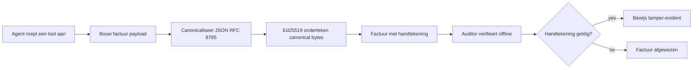
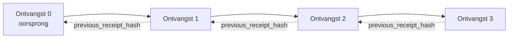

[Bekijk de lesvideo: AI-agenten beveiligen met cryptografische ontvangstbewijzen](https://youtu.be/PLACEHOLDER_VIDEO_ID)

> _(Lesvideo en afbeelding worden na samenvoeging toegevoegd door het Microsoft-contentteam, passend bij het patroon van les 14 / 15.)_

# AI-agenten beveiligen met cryptografische ontvangstbewijzen

## Introductie

Deze les behandelt:

- Waarom audit-trails voor AI-agenten belangrijk zijn voor naleving, debugging en vertrouwen.
- Wat een cryptografisch ontvangstbewijs is en hoe het verschilt van een ongetekende logregel.
- Hoe je een getekend ontvangstbewijs maakt voor een tool-aanroep van een agent in gewone Python.
- Hoe je een ontvangstbewijs offline verifieert en manipulatie detecteert.
- Hoe je ontvangstbewijzen aan elkaar ketent zodat het verwijderen of herordenen van één het ketenbreekt.
- Wat ontvangstbewijzen bewijzen en wat ze expliciet niet bewijzen.

## Leerdoelen

Na het voltooien van deze les weet je hoe je:

- De faalmodi identificeert die cryptografische herkomst van agentacties motiveren.
- Een Ed25519-getekend ontvangstbewijs produceert over een canonieke JSON-payload.
- Een ontvangstbewijs onafhankelijk verifieert met alleen de publieke sleutel van de ondertekenaar.
- Manipulatie detecteert door verificatie opnieuw uit te voeren op een gewijzigd ontvangstbewijs.
- Een hash-gelinkte reeks ontvangstbewijzen opbouwt en uitlegt waarom de keten erop aankomt.
- De grens herkent tussen wat ontvangstbewijzen bewijzen (attributie, integriteit, ordening) en wat ze niet bewijzen (correctheid van de actie, juistheid van het beleid).

## Het probleem: de audit-trail van jouw agent

Stel je voor dat je een AI-agent hebt ingezet voor Contoso Travel. De agent leest klantverzoeken, roept een vluchten-API aan om opties te zoeken, en boekt stoelen namens de klant. Vorig kwartaal verwerkte de agent 50.000 boekingen.

Vandaag komt een auditor langs. Hij stelt een eenvoudige vraag: “Laat me zien wat je agent deed.”

Je overhandigt je logbestanden. De auditor bekijkt ze en stelt de moeilijkere vraag: “Hoe weet ik dat deze logs niet zijn aangepast?”

Dit is het audit-trail probleem. De meeste agent-implementaties vertrouwen tegenwoordig op:

- **Applicatielogs**: geschreven door de agent zelf, bewerkbaar door iedereen met toegang tot het bestandssysteem.
- **Cloud logging services**: manipulatiedetectie op platformniveau, maar alleen als de auditor de platformbeheerder vertrouwt.
- **Database transactielogs**: geschikt voor databasewijzigingen, maar niet voor willekeurige tool-aanroepen.

Geen van deze kan de vraag van de auditor beantwoorden zonder dat de auditor iemand moet vertrouwen (jou, je cloudprovider, je databaseleverancier). Voor intern gebruik is dat vaak acceptabel. Voor gereguleerde workloads (financiën, gezondheidszorg, alles onder de EU AI-verordening) is dat dat niet.

Cryptografische ontvangstbewijzen lossen dit op door elke actie van de agent onafhankelijk verifieerbaar te maken. De auditor hoeft jou niet te vertrouwen. Hij heeft alleen de publieke sleutel en het ontvangstbewijs nodig.

## Wat is een cryptografisch ontvangstbewijs?

Een ontvangstbewijs is een JSON-object dat vastlegt wat een agent deed, ondertekend met een digitale handtekening.


```mermaid
flowchart LR
    A[Agent roept een tool aan] --> B[Bouw factuur payload]
    B --> C[Canonicaliseer JSON RFC 8785]
    C --> E[Ed25519 onderteken canonical bytes]
    E --> F[Factuur met handtekening]
    F --> G[Auditor verifieert offline]
    G --> H{Handtekening geldig?}
    H -- yes --> I[Bewijs tamper-evident]
    H -- no --> J[Factuur afgewezen]
```

Een minimaal ontvangstbewijs ziet er zo uit:

```json
{
  "type": "agent.tool_call.v1",
  "agent_id": "contoso-travel-bot",
  "tool_name": "lookup_flights",
  "tool_args_hash": "sha256:a3f9c1...",
  "result_hash": "sha256:7b2e1d...",
  "policy_id": "contoso-travel-policy-v3",
  "timestamp": "2026-04-25T14:30:00Z",
  "sequence": 47,
  "previous_receipt_hash": "sha256:9d4e6a...",
  "signature": {
    "alg": "EdDSA",
    "sig": "c5af83...",
    "public_key": "8f3b2c..."
  }
}
```

Drie eigenschappen zorgen voor de werking:

1. **De handtekening**. Het ontvangstbewijs is ondertekend door het gateway van de agent met een Ed25519 privé-sleutel. Iedereen met de bijbehorende publieke sleutel kan de handtekening offline verifiëren. Manipulatie van een veld maakt de handtekening ongeldig.

2. **Canonieke codering**. Voor het ondertekenen wordt het ontvangstbewijs geserialiseerd met de JSON Canonicalization Scheme (JCS, RFC 8785). Dit zorgt ervoor dat twee implementaties die hetzelfde logisch ontvangstbewijs produceren, exact dezelfde bytes als output geven. Zonder canoniek maken zouden verschillende JSON-serializers verschillende handtekeningen produceren voor dezelfde inhoud.

3. **Hash-ketting**. Het veld `previous_receipt_hash` koppelt elk ontvangstbewijs aan het voorgaande. Het verwijderen of herordenen van een ontvangstbewijs breekt alle volgende ontvangstbewijzen. Manipulatie wordt op ketenniveau zichtbaar, zelfs als individuele handtekeningen worden omzeild.

Gezamenlijk bieden deze eigenschappen drie garanties:

- **Attributie**: deze sleutel heeft deze inhoud ondertekend.
- **Integriteit**: de inhoud is niet veranderd sinds het ondertekenen.
- **Ordening**: dit ontvangstbewijs kwam na dat ontvangstbewijs in de keten.

## Een ontvangstbewijs produceren in Python

Je hebt geen speciale bibliotheek nodig om een ontvangstbewijs te maken. De cryptografische primitieve zijn breed beschikbaar en de logica bestaat uit enkele tientallen regels Python.

De hands-on oefeningen in `code_samples/18-signed-receipts.ipynb` lopen het volledige proces door. De samenvatting:

```python
import json
import hashlib
import base64
from nacl import signing
from jcs import canonicalize  # RFC 8785 canonieke JSON

def b64url_nopad(data: bytes) -> str:
    return base64.urlsafe_b64encode(data).decode("ascii").rstrip("=")

def sha256_canonical(obj) -> str:
    """SHA-256 of a Python object's JCS-canonical JSON form."""
    return f"sha256:{hashlib.sha256(canonicalize(obj)).hexdigest()}"

# Genereer of laad een ondertekeningssleutel (in productie bewaren in een sleutelkluis)
signing_key = signing.SigningKey.generate()
verify_key = signing_key.verify_key

# Bouw de ontvangstpayload op (nog geen handtekening)
tool_args = {"origin": "SYD", "destination": "LAX"}
tool_result = [{"flight": "QF11", "price": 1850, "stops": 0}]

payload = {
    "type": "agent.tool_call.v1",
    "agent_id": "contoso-travel-bot",
    "tool_name": "lookup_flights",
    "tool_args_hash": sha256_canonical(tool_args),
    "result_hash": sha256_canonical(tool_result),
    "policy_id": "contoso-travel-policy-v3",
    "timestamp": "2026-04-25T14:30:00Z",
    "sequence": 0,
    "previous_receipt_hash": None,
}

# Canoniseer en onderteken direct de JCS-bytes. PureEdDSA hasht intern.
canonical_bytes = canonicalize(payload)
signature_bytes = signing_key.sign(canonical_bytes).signature

# Voeg een gestructureerd handtekeningobject toe.
receipt = {
    **payload,
    "signature": {
        "alg": "EdDSA",
        "sig": b64url_nopad(signature_bytes),
        "public_key": b64url_nopad(bytes(verify_key)),
    },
}
```

Dat is de complete ondertekeningspijplijn. De oefeningen in het notebook nemen elke stap door.

## Een ontvangstbewijs verifiëren en manipulatie detecteren

Verificatie is de inverse bewerking:

```python
import base64
import hashlib
from nacl import signing
from nacl.exceptions import BadSignatureError
from jcs import canonicalize

def b64url_decode(s: str) -> bytes:
    padding = "=" * ((4 - len(s) % 4) % 4)
    return base64.urlsafe_b64decode(s + padding)

def verify_receipt(receipt: dict) -> bool:
    # De handtekening is een gestructureerd object: {"alg", "sig", "public_key"}.
    sig_obj = receipt.get("signature")
    if not sig_obj or sig_obj.get("alg") != "EdDSA":
        return False

    # Reconstrueer de payload die daadwerkelijk ondertekend is (alles behalve de handtekening).
    payload = {k: v for k, v in receipt.items() if k != "signature"}

    canonical_bytes = canonicalize(payload)

    try:
        verify_key = signing.VerifyKey(b64url_decode(sig_obj["public_key"]))
        verify_key.verify(canonical_bytes, b64url_decode(sig_obj["sig"]))
        return True
    except BadSignatureError:
        return False
```

Deze functie neemt een ontvangstbewijs en retourneert `True` als de handtekening geldig is, anders `False`. Geen netwerkverzoeken, geen service-afhankelijkheden, geen vertrouwen in derden vereist.

Om manipulatie-detectie in de praktijk te zien, loopt het notebook door:

1. Het produceren van een geldig ontvangstbewijs en bevestigen dat het geverifieerd wordt.
2. Het wijzigen van één byte van het veld `tool_args_hash`.
3. De verificatie opnieuw uitvoeren en zien dat het mislukt.

Dit is de praktische demonstratie dat ontvangstbewijzen manipulatie-bestendig zijn: elke wijziging, hoe klein ook, verbreekt de handtekening.

## Ontvangstbewijzen ketenen voor multi-stap agenten

Eén enkel getekend ontvangstbewijs beschermt één actie. Een keten van ontvangstbewijzen beschermt een reeks.


```mermaid
flowchart LR
    R0[Ontvangst 0<br/>oorsprong] --> R1[Ontvangst 1]
    R1 --> R2[Ontvangst 2]
    R2 --> R3[Ontvangst 3]
    R1 -. previous_receipt_hash .-> R0
    R2 -. previous_receipt_hash .-> R1
    R3 -. previous_receipt_hash .-> R2
```

Elk ontvangstbewijs registreert de hash van het ontvangstbewijs ervoor. Om ontvangstbewijs 2 stilzwijgend te verwijderen moet een aanvaller ofwel:

- Het veld `previous_receipt_hash` in ontvangstbewijs 3 aanpassen (breekt de handtekening van ontvangstbewijs 3), OF
- Een nieuwe handtekening vervalsen op een aangepast ontvangstbewijs 3 (vereist de privé-sleutel van de agent).

Als de privésleutel in een hardware key vault zit en je publiceert de publieke sleutel met elk ontvangstbewijs, is geen van beide aanvallen uitvoerbaar zonder detectie.

Het notebook behandelt:

1. Het opbouwen van een keten van drie ontvangstbewijzen.
2. Verifiëren dat elke `previous_receipt_hash` klopt met de feitelijke hash van het vorige ontvangstbewijs.
3. Manipulatie van een ontvangstbewijs in het midden en zien dat de keten op dat punt breekt.

Zo maak je een audit-trail die een externe auditor kan verifiëren zonder jou te hoeven vertrouwen.

## Wat ontvangstbewijzen bewijzen (en wat niet)

Dit is de belangrijkste sectie van deze les. Ontvangstbewijzen zijn krachtig maar hun kracht is begrensd.

**Ontvangstbewijzen bewijzen drie dingen:**

1. **Attributie:** een specifieke sleutel tekende een specifieke payload.
2. **Integriteit:** de payload is niet veranderd sinds het ondertekenen.
3. **Ordening:** dit ontvangstbewijs kwam na dat ontvangstbewijs in de hash-keten.

**Ontvangstbewijzen bewijzen NIET:**

1. **Correctheid:** dat de actie van de agent de juiste was. Een ontvangstbewijs kan net zo goed voor een fout antwoord worden ondertekend als voor een correct antwoord.
2. **Naleving van beleid:** dat het beleid in `policy_id` daadwerkelijk is geëvalueerd, of dat het deze actie zou hebben toegestaan als gecontroleerd. Het ontvangstbewijs registreert wat werd beweerd, niet wat werd gehandhaafd.
3. **Identiteit voorbij de sleutel:** het ontvangstbewijs zegt "deze sleutel heeft deze inhoud ondertekend." Het zegt niet "deze persoon heeft dit geautoriseerd." Het koppelen van een sleutel aan een persoon of organisatie vereist aparte identiteitsinfrastructuur (een directory, een registersysteem voor publieke sleutels, etc.).
4. **Waarheidsgetrouwheid van invoer:** als de agent een gemanipuleerde opdracht ontvangt en daarop reageert, registreert het ontvangstbewijs de actie nauwkeurig. Ontvangstbewijzen zijn downstream van invoervalidatie, niet een vervanging ervan.

Deze grens is belangrijk om twee redenen:

- Het vertelt je waar ontvangstbewijzen nuttig voor zijn: het auditeerbaar en manipulatiebestendig maken van agentgedrag, zelfs over organisatorische grenzen heen.
- Het vertelt je welke extra lagen je nog nodig hebt: invoervalidatie (les 6), beleidshandhaving (kort hieronder behandeld) en identiteitsinfrastructuur (buiten het bestek van deze les).

Een veelgemaakte fout is aannemen dat “we hebben ontvangstbewijzen” betekent “we worden bestuurd.” Dat is niet zo. Ontvangstbewijzen zijn een fundament. Besturing is het systeem dat je erbij bouwt.

## Bewijzen dat een mens precies die actie goedkeurde

Punt 3 hierboven verdient een eigen sectie: een actie-ontvangstbewijs zegt “deze sleutel heeft deze inhoud ondertekend,” nooit “een mens heeft dit goedgekeurd.” Voor risicovolle acties (terugbetalingen, verwijderingen, overboekingen) vereisen bestuurskaders steeds vaker die ontbrekende verklaring exact, en die is produceerbaar met dezelfde primitieve die je in deze les al hebt gebouwd.

Het vervolgnotebook `code_samples/human-authorization-receipts.ipynb` voegt een tweede type ontvangstbewijs toe, `human.approval.v1`, met dezelfde envelopvorm als de lesontvangstbewijzen (een getypeerde payload ondertekend met Ed25519 over zijn canonieke JCS-bytes, met het `signature`-object buiten de getekende bytes). Een benoemde goedkeurder tekent de **volledige canonieke actie en de digest ervan** vóór uitvoering; het actie-ontvangstbewijs van de agent draagt dezelfde **actie digest** en een `parent_approval_ref`, de `receipt_hash` van de goedkeuring, dezelfde conventie als `previous_receipt_hash` in de keten die je hierboven bouwde. Eén `verify_chain` verwerkt beide artefacten onder **afzonderlijke vastgepinde sleutelregisters** (sleutels van goedkeurders versus sleutels van agenten), dus de code wordt gedeeld maar de autoriteiten nooit.

De eigenschap die dit koopt, voorzichtig geformuleerd: *de mens keurde precies deze actie goed, en de agent voerde exact die goedgekeurde actie uit.* De weigeringen in het notebook maken die eigenschap concreet in plaats van alleen maar gesteld:

- de klassieke set: manipulatie, verwarde gevolmachtigde, replay, vervalste sleutels aan beide zijden, verkeerd gevormde invoer;
- **verlopen autoriteit:** een handtekening die nog steeds verifieert, toch geweigerd omdat de beleid-versie veranderde, de sleutel van de goedkeurder uit het vastgepinde register werd verwijderd, of de goedkeuring verlopen was vóór uitvoering;
- **digest-substitutie:** een geldig ondertekend actie-ontvangstbewijs dat verwijst naar een *echte* goedkeuring die bindt aan een *andere* canonieke actie.

Elke weigering komt met een specifieke reden, zodat een auditor die een weigering leest kan bepalen of autoriteit verlopen is of de uitgevoerde actie gewijzigd. De regel die het notebook leert: een getekende goedkeuring is niet per se autoriteit. Autoriteit bestaat alleen als beide ontvangstbewijzen op uitvoertijd nog binden aan dezelfde canonieke actie. Het menselijke-goedkeurings-ontvangstbewijs is een educatieve compositie gedefinieerd door deze les, geen ontvangstbewijs-type uit `draft-farley-acta-signed-receipts`.

## Productiereferenties

De Python-code in deze les is bewust minimaal zodat je elke regel kunt lezen en precies begrijpt wat gebeurt. In productie heb je twee opties:

1. **Bouw direct op de cryptografische primitieve.** De 50 regels die je hierboven zag zijn voldoende voor veel gebruikssituaties. PyNaCl (Ed25519) en het `jcs`-pakket (canonieke JSON) zijn goed onderhouden en geauditde bibliotheken.

2. **Gebruik een productiebibliotheek voor ontvangstbewijzen.** Verschillende open-source projecten implementeren hetzelfde patroon met aanvullende functies (sleutelrotatie, batch-verificatie, JWK Set distributie, integratie met beleidsengines):
   - De ondertekeningspijplijn gebruikt de JCS en signature-scope conventies in een onafhankelijke IETF Internet-Draft ([`draft-farley-acta-signed-receipts`](https://datatracker.ietf.org/doc/draft-farley-acta-signed-receipts/), revisie 02). Het educatieve platte ontvangstbewijs van deze les verschilt van de draft `{payload, signature}`-envelop en wordt niet gepresenteerd als een conforme implementatie. De draft publiceert een gedeelde conformsuite ([agent-governance-testvectors](https://github.com/ScopeBlind/agent-governance-testvectors)) voor implementaties die het wireformaat volgen.
   - De Microsoft Agent Governance Toolkit combineert ontvangstbewijzen met Cedar-gebaseerde beleidsbesluiten; zie Tutorial 33 in die repository voor een end-to-end voorbeeld.
   - De `protect-mcp` (npm) en `@veritasacta/verify` (npm) pakketten bieden een Node-gebaseerde implementatie van ontvangstbewijsondertekening en offline verificatie, bedoeld om elke MCP-server te omhullen met een manipulatiedetecterende audit-trail, inclusief een flow met co-tekening waarbij een gepauzeerde actie een goedkeurings-ontvangstbewijs uitzendt gekoppeld aan de actie digest (WebAuthn-ondersteund in de desktop flow), hetzelfde goedkeurings-ontvangstbewijs patroon als het menselijke-autorisatie-notebook hierboven.
   - De **[nobulex](https://github.com/arian-gogani/nobulex)** Python SDK (`pip install nobulex`) biedt hetzelfde Ed25519 + JCS ondertekeningspatroon in Python met LangChain en CrewAI integraties, inclusief gepubliceerde cross-validatie testvectoren en een nalevingsmapping bijgedragen via [OWASP PR #2210](https://github.com/OWASP/CheatSheetSeries/pull/2210).

De keuze tussen zelf bouwen en het gebruik van een bibliotheek komt neer op dezelfde afweging als tussen het zelf schrijven van een JWT-bibliotheek en het gebruiken van een geteste: beide zijn redelijk; de bibliotheek bespaart tijd en vermindert het auditoppervlak; de zelfbouw-aanpak dwingt je elke primitive te begrijpen. Deze les leert de zelfbouw-route zodat je de basis hebt voor elke keuze.

## Kenniscontrole

Test je begrip voordat je aan de oefening begint.

**1. Een ontvangstbewijs is ondertekend met de privé Ed25519-sleutel van de agent. De auditor heeft alleen de publieke sleutel. Kan de auditor het ontvangstbewijs offline verifiëren?**

<details>
<summary>Antwoord</summary>

Ja. Ed25519-verificatie vereist alleen de publieke sleutel en de ondertekende bytes. Geen netwerkverzoeken, geen service-afhankelijkheid. Dit is de eigenschap die ontvangstbewijzen nuttig maakt in afgeschermde, multi-organisatie, of laag-vertrouwensaudit-omgevingen.
</details>

**2. Een aanvaller wijzigt het veld `policy_id` van een ontvangstbewijs om te beweren dat het door een permissiever beleid werd geregeerd. De handtekening was over de oorspronkelijke payload. Wat gebeurt er tijdens verificatie?**

<details>
<summary>Antwoord</summary>


Verificatie mislukt. De handtekening is berekend over de canonieke bytes van de originele payload; het wijzigen van een veld verandert deze bytes, waardoor de handtekening ongeldig wordt. De aanvaller zou de privésleutel nodig hebben om een nieuwe geldige handtekening te genereren, die hij niet heeft.
</details>

**3. Waarom bevat het ontvangstbewijs een `tool_args_hash` en `result_hash` in plaats van de ruwe argumenten en het resultaat?**

<details>
<summary>Antwoord</summary>

Twee redenen. Ten eerste moet het ontvangstbewijs mogelijk worden gearchiveerd of verzonden in omgevingen waar het lekken van de ruwe inhoud (PII, bedrijfsgegevens) een probleem is. Hashing houdt het ontvangstbewijs klein en de inhoud privé; de auditor verifieert dat de hash overeenkomt met een apart opgeslagen kopie van de daadwerkelijke inhoud. Ten tweede hebben hashes een vaste grootte; een ontvangstbewijs met hashes heeft een begrensde grootte, ongeacht hoe groot de invoer en uitvoer waren.
</details>

**4. Het veld `previous_receipt_hash` verbindt elk ontvangstbewijs met zijn voorganger. Wat wordt ongeldig als een aanvaller stilletjes één ontvangstbewijs uit het midden van een keten verwijdert?**

<details>
<summary>Antwoord</summary>

Elk ontvangstbewijs dat na het verwijderde kwam. Hun velden `previous_receipt_hash` komen niet langer overeen met de daadwerkelijke keten (omdat het ontvangstbewijs waarnaar ze verwezen niet meer bestaat, of omdat de keten nu naar een andere voorganger wijst). Om de verwijdering te verbergen, zou de aanvaller elk later ontvangstbewijs opnieuw moeten ondertekenen, wat de privésleutel vereist.
</details>

**5. Een ontvangstbewijs verifieert schoon. Bewijst dat dat de actie van de agent correct, juist of conform het beleid was?**

<details>
<summary>Antwoord</summary>

Nee. Een geldig ontvangstbewijs bewijst drie dingen: toeschrijving (deze sleutel heeft deze inhoud ondertekend), integriteit (de inhoud is niet veranderd) en volgorde (dit ontvangstbewijs kwam na dat ontvangstbewijs). Het bewijst NIET dat de actie correct was, dat het in `policy_id` genoemde beleid daadwerkelijk is geëvalueerd, of dat de agent elke regel heeft gevolgd. Ontvangstbewijzen maken het gedrag van agents controleerbaar, maar niet noodzakelijk correct. Dit is de belangrijkste grens in de les.
</details>

## Oefening

Open `code_samples/18-signed-receipts.ipynb` en voltooi alle vier de secties:

1. **Sectie 1**: Onderteken je eerste ontvangstbewijs en verifieer het.
2. **Sectie 2**: Knutsel aan het ontvangstbewijs en observeer dat verificatie mislukt.
3. **Sectie 3**: Bouw een keten van drie ontvangstbewijzen en verifieer de ketenintegriteit.
4. **Sectie 4**: Pas het patroon toe op een agent gebouwd met het Microsoft Agent Framework: wikkel een tool-aanroep in ontvangstbewijs-ondertekening, en verifieer vervolgens het ontvangstbewijs onafhankelijk.

**Uitdaging 1:** breid het schema voor ontvangstbewijzen uit met een extra veld naar keuze (bijvoorbeeld een verzoek-ID voor tracing), werk de canonieke ondertekeningslogica bij om dit veld op te nemen en bevestig dat het ontvangstbewijs nog steeds door verificatie kan. Wijzig vervolgens het veld na ondertekening en bevestig dat verificatie mislukt. Dit dwingt je te begrijpen hoe elke byte van de canonieke codering bijdraagt aan de handtekening.

**Uitdaging 2:** SHA-256-hash twee van je ontvangstbewijzen samen (concaateneer hun canonieke bytes in een deterministische volgorde) en verwerk het resulterende digest als een nieuw veld op een derde ontvangstbewijs vóór ondertekening. Verifieer dat alle drie de ontvangstbewijzen nog steeds door verificatie komen. Je hebt zojuist een eenstaps-insluitingsbewijs gemaakt: iedereen met het derde ontvangstbewijs kan bewijzen dat de eerste twee bestonden op het moment van ondertekening, zonder hun inhoud te hoeven onthullen. Dit is het patroon dat selectief-kennisoog ontvangstbewijzen op grote schaal gebruiken (Merkle-commitments, RFC 6962).

## Conclusie

Cryptografische ontvangstbewijzen geven AI-agents een audittrail die:

- **Onafhankelijk verifieerbaar**: elke partij met de publieke sleutel kan verifiëren, zonder afhankelijkheid van dienst.
- **Knutselbewijs**: elke wijziging maakt de handtekening ongeldig.
- **Draagbaar**: een ontvangstbewijs is een klein JSON-bestand; het kan overal worden gearchiveerd, verzonden en geverifieerd.
- **Standarden-compatibel**: gebaseerd op Ed25519 (RFC 8032), JCS (RFC 8785), en SHA-256, allemaal breed gebruikte primitieve.

Ze zijn geen vervanging voor invoervalidatie, beleidsafdwinging of identiteitinfrastructuur. Ze vormen een fundament voor die lagen. Wanneer je agents inzet in gereguleerde workloads, multi-organisatie workflows, of in elke setting waar een toekomstige auditor je niet zonder meer vertrouwt, zijn ontvangstbewijzen hoe je het audittrail eerlijk maakt.

Het belangrijkste om te onthouden: ontvangstbewijzen bewijzen wie wat zei, wanneer. Ze bewijzen niet dat wat gezegd is waar of juist was. Houd dat onderscheid goed vast. Het is het verschil tussen een eerlijk herkomstsysteem en een misleidend systeem.

## Productiechecklist

Als je klaar bent om van deze les over te stappen naar het inzetten van ontvangstbewijs-ondertekende agents in een echte omgeving:

- [ ] **Verplaats de ondertekeningssleutel van de ontwikkelaarslaptop.** Gebruik Azure Key Vault, AWS KMS of een hardwarebeveiligingsmodule. De privésleutel die je ontvangstbewijzen ondertekent mag nooit in bronbeheer of als platte tekst op applicatiemachines leven.
- [ ] **Publiceer de publieke verificatiesleutel.** Auditors hebben deze nodig om offline te verifiëren. Het standaardpatroon is een JWK Set op een bekende URL (RFC 7517), bijv. `https://your-org.example.com/.well-known/agent-keys.json`.
- [ ] **Veranker de keten extern.** Schrijf periodiek de laatste ketenkop-hash naar een transparantielog (Sigstore Rekor, RFC 3161 tijdstempelautoriteit, of een tweede intern systeem) zodat een externe partij kan bevestigen "deze keten bestond op dit moment."
- [ ] **Bewaar ontvangstbewijzen onveranderlijk.** Append-only blobopslag (Azure Storage met onherroepbaarheidsbeleid, AWS S3 Object Lock) voorkomt dat een insider de geschiedenis herschrijft op opslagniveau.
- [ ] **Bepaal bewaartermijn.** Veel compliance-regimes vereisen meerjarige bewaring. Plan voor ontvangstmateriaalgroei (ieder ontvangstbewijs is ~500 bytes; een agent die 10K aanroepen per dag maakt produceert ~1.8 GB per jaar).
- [ ] **Documenteer wat ontvangstbewijzen niet dekken.** Ontvangstbewijzen bewijzen toeschrijving, integriteit, en volgorde. Je runbook moet expliciet vermelden welke aanvullende controles (invoervalidatie, beleidsafdwinging, beperking van aanroepen, identiteitinfrastructuur) naast ontvangstbewijzen zitten in je governance-aanpak.

### Meer vragen over het beveiligen van AI-agents?

Sluit je aan bij de [Microsoft Foundry Discord](https://aka.ms/ai-agents/discord) om andere lerenden te ontmoeten, tijdens spreekuren vragen te stellen en antwoord te krijgen op je AI Agents vragen.

## Verder dan deze les

Deze les behandelt ondertekening van enkele ontvangstbewijzen en hash-gekoppelde reeksen. Dezelfde primitieve vormen de basis voor meerdere meer geavanceerde patronen die je tegenkomt naarmate je governance-aanpak rijpt:

- **Selectieve onthulling.** Wanneer de velden van een ontvangstbewijs onafhankelijk worden vastgelegd (RFC 6962-stijl Merkle-boom), kun je specifieke velden aan specifieke auditors onthullen en bewijzen dat de rest onveranderd is zonder ze bloot te leggen. Handig wanneer hetzelfde ontvangstbewijs zowel een uitgebreide audit (die compleetheid wil) als gegevensminimalisatie-regelgeving zoals AVG (die willen dat de auditor zo weinig mogelijk ziet) moet voldoen.
- **Intrekking van ontvangstbewijzen.** Als een ondertekeningssleutel is gecompromitteerd, heb je een manier nodig om alle ontvangstbewijzen die met die sleutel zijn ondertekend vanaf een bepaald moment onbetrouwbaar te markeren. Standaardpatronen: kortlevende ondertekeningssleutels plus een gepubliceerde intrekkingslijst, of een transparantielog met intrekkingsvermeldingen.
- **Bilaterale / gesplitste-handtekening ontvangstbewijzen.** Sommige implementaties splitsen de ondertekende payload op in pre-uitvoerings- (`authorization_*`) en post-uitvoerings- (`result_*`) helften met onafhankelijke handtekeningen, nuttig wanneer de autorisatiebeslissing en het waargenomen resultaat door verschillende actoren of op verschillende tijdstippen worden geproduceerd. Dit bouwt additief voort op het ontvangstbewijsformaat uit deze les.
- **Samenstelling van payload.** Een ontvangstbewijs verzegelt welke bytes je ook in `result_hash` stopt. Payloads in de praktijk zijn vaak rijker dan het resultaat van één tool-aanroep: beslisrede (modelvoorspelling, overwogen opties, bewijs en de volledigheid ervan, risicopositie, verantwoordingsketen, poortresultaat) kan allemaal in de payload leven, verzegeld door één ontvangstbewijs. Dit houdt het ontvangstbewijsformaat minimalistisch terwijl payload-schema’s domein-gebaseerd kunnen evolueren.
- **Conformiteit tussen implementaties.** Meerdere onafhankelijke implementaties van hetzelfde ontvangstbewijsformaat (Python, TypeScript, Rust, Go) verifiëren elkaar aan de hand van gedeelde testvectoren. Als je een eigen implementatie maakt, bevestigt valideren met gepubliceerde vectoren de draadcompatibiliteit.
- **Post-quantum migratie.** Ed25519 is vandaag zeer breed ingezet maar is niet quantum-bestendig. Het formaat van het ontvangstbewijs is algoritme-flexibel: het veld `signature.alg` kan `ML-DSA-65` bevatten (de NIST post-quantum handtekeningstandaard) wanneer je moet migreren. Plan een overgangsperiode waarin ontvangstbewijzen dubbel ondertekend zijn.

## Aanvullende bronnen

- <a href="https://datatracker.ietf.org/doc/draft-farley-acta-signed-receipts/" target="_blank">IETF Internet-Draft: Signed Decision Receipts for Machine-to-Machine Access Control</a>
- <a href="https://learn.microsoft.com/azure/ai-studio/responsible-use-of-ai-overview" target="_blank">Overview Verantwoorde AI (Azure AI)</a>
- <a href="https://datatracker.ietf.org/doc/html/rfc8032" target="_blank">RFC 8032: Edwards-Curve Digital Signature Algorithm (EdDSA)</a>
- <a href="https://datatracker.ietf.org/doc/html/rfc8785" target="_blank">RFC 8785: JSON Canonicalization Scheme (JCS)</a>
- <a href="https://datatracker.ietf.org/doc/html/rfc6962" target="_blank">RFC 6962: Certificate Transparency</a> (Merkle-boom constructie gebruikt door selectief onthulde ontvangstbewijzen)
- <a href="https://github.com/microsoft/agent-governance-toolkit/blob/main/docs/tutorials/33-offline-verifiable-receipts.md" target="_blank">Microsoft Agent Governance Toolkit, Tutorial 33: Offline-Verifieerbare Beslissing Ontvangstbewijzen</a>
- <a href="https://github.com/ScopeBlind/agent-governance-testvectors" target="_blank">Cross-implementatie conformiteitstestvectoren</a> voor het ontvangstbewijsformaat zoals gebruikt in deze les (Apache-2.0)
- <a href="https://pynacl.readthedocs.io/" target="_blank">PyNaCl-documentatie</a> (Ed25519 in Python)

## Vorige les

[Lokale AI Agents maken](../17-creating-local-ai-agents/README.md)

---

<!-- CO-OP TRANSLATOR DISCLAIMER START -->
**Disclaimer**:
Dit document is vertaald met behulp van de AI vertaaldienst [Co-op Translator](https://github.com/Azure/co-op-translator). Hoewel we streven naar nauwkeurigheid, dient u er rekening mee te houden dat geautomatiseerde vertalingen fouten of onnauwkeurigheden kunnen bevatten. Het originele document in de oorspronkelijke taal moet worden beschouwd als de gezaghebbende bron. Voor kritieke informatie wordt professionele menselijke vertaling aanbevolen. Wij zijn niet aansprakelijk voor eventuele misverstanden of verkeerde interpretaties die voortvloeien uit het gebruik van deze vertaling.
<!-- CO-OP TRANSLATOR DISCLAIMER END -->