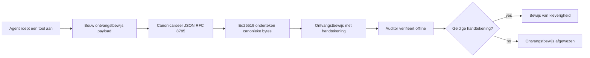
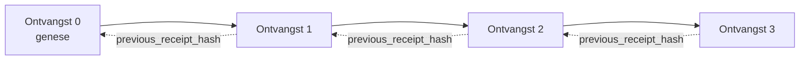

[Bekijk de lesvideo: AI-agenten beveiligen met cryptografische ontvangstbewijzen](https://youtu.be/PLACEHOLDER_VIDEO_ID)

> _(Lesvideo en thumbnail worden toegevoegd door het Microsoft-contentteam na samenvoeging, passend bij het patroon van les 14 / 15.)_

# AI-agenten beveiligen met cryptografische ontvangstbewijzen

## Introductie

Deze les behandelt:

- Waarom audit trails voor AI-agenten belangrijk zijn voor compliance, foutopsporing en vertrouwen.
- Wat een cryptografisch ontvangstbewijs is en hoe het verschilt van een niet-ondertekende logregel.
- Hoe je een ondertekend ontvangstbewijs produceert voor een tool-aanroep van een agent in gewone Python.
- Hoe je een ontvangstbewijs offline verifieert en manipulatie detecteert.
- Hoe je ontvangstbewijzen aan elkaar hangt zodat het verwijderen of herschikken van één de keten breekt.
- Wat ontvangstbewijzen bewijzen en wat ze expliciet niet bewijzen.

## Leerdoelen

Na het voltooien van deze les weet je hoe je:

- De faalmodi identificeert die cryptografische oorsprong voor agentacties motiveren.
- Een Ed25519-ondertekend ontvangstbewijs produceert over een canonieke JSON-lading.
- Een ontvangstbewijs onafhankelijk verifieert met alleen de publieke sleutel van de ondertekenaar.
- Manipulatie detecteert door verificatie te herhalen op een gewijzigd ontvangstbewijs.
- Een hasj-gekoppelde reeks ontvangstbewijzen bouwt en uitlegt waarom de keten ertoe doet.
- De grens herkent tussen wat ontvangstbewijzen bewijzen (toeschrijving, integriteit, ordening) en wat ze niet bewijzen (correctheid van de actie, degelijkheid van het beleid).

## Het probleem: het auditspoor van je agent

Stel dat je een AI-agent hebt ingezet voor Contoso Travel. De agent leest klantverzoeken, roept een vlucht-API aan om opties op te zoeken, en boekt stoelen namens de klant. Vorig kwartaal heeft de agent 50.000 boekingen verwerkt.

Vandaag komt een auditor langs. Hij stelt een eenvoudige vraag: "Laat zien wat je agent heeft gedaan."

Je levert je logbestanden aan. De auditor kijkt ernaar en stelt de lastiger vraag: "Hoe weet ik dat deze logs niet zijn bewerkt?"

Dit is het audit-trail probleem. De meeste agentinzettingen vertrouwen vandaag op:

- **Applicatielogs**: geschreven door de agent zelf, bewerkbaar door iedereen met toegang tot het bestandssysteem.
- **Cloud-loggingdiensten**: verifieerbaar tegen manipulatie op platformniveau maar alleen als de auditor de platformbeheerder vertrouwt.
- **Database transactielogs**: geschikt voor databasewijzigingen, maar niet voor willekeurige tool-aanroepen.

Geen van deze kan de vraag van de auditor beantwoorden zonder dat de auditor iemand moet vertrouwen (jou, je cloudprovider, je databaseleverancier). Voor intern gebruik is dat vertrouwen vaak acceptabel. Voor gereguleerde workloads (financiën, gezondheidszorg, alles onder de EU AI Act) is dat niet zo.

Cryptografische ontvangstbewijzen lossen dit op door elke actie van de agent onafhankelijk verifieerbaar te maken. De auditor hoeft jou niet te vertrouwen. Hij heeft alleen jouw publieke sleutel en het ontvangstbewijs zelf nodig.

## Wat is een cryptografisch ontvangstbewijs?

Een ontvangstbewijs is een JSON-object dat vastlegt wat een agent heeft gedaan, ondertekend met een digitale handtekening.


```mermaid
flowchart LR
    A[Agent roept een tool aan] --> B[Bouw ontvangstbewijs payload]
    B --> C[Canonicaliseer JSON RFC 8785]
    C --> E[Ed25519 onderteken canonieke bytes]
    E --> F[Ontvangstbewijs met handtekening]
    F --> G[Auditor verifieert offline]
    G --> H{Geldige handtekening?}
    H -- yes --> I[Bewijs van kleverigheid]
    H -- no --> J[Ontvangstbewijs afgewezen]
```

Een minimaal ontvangstbewijs ziet er zo uit:

```json
{
  "type": "agent.tool_call.v1",
  "agent_id": "contoso-travel-bot",
  "tool_name": "lookup_flights",
  "tool_args_hash": "sha256:a3f9c1...",
  "result_hash": "sha256:7b2e1d...",
  "policy_id": "contoso-travel-policy-v3",
  "timestamp": "2026-04-25T14:30:00Z",
  "sequence": 47,
  "previous_receipt_hash": "sha256:9d4e6a...",
  "signature": {
    "alg": "EdDSA",
    "sig": "c5af83...",
    "public_key": "8f3b2c..."
  }
}
```

Drie eigenschappen doen het werk:

1. **De handtekening**. Het ontvangstbewijs is ondertekend door de gateway van de agent met een Ed25519 privé-sleutel. Iedereen met de bijbehorende publieke sleutel kan de handtekening offline verifiëren. Manipulatie van welk veld dan ook maakt de handtekening ongeldig.

2. **Canonieke codering**. Voor het ondertekenen wordt het ontvangstbewijs geserialiseerd met de JSON Canonicalization Scheme (JCS, RFC 8785). Dit zorgt ervoor dat twee implementaties die hetzelfde logische ontvangstbewijs produceren, exact dezelfde bytes outputten. Zonder canonisatie zouden verschillende JSON-serializers verschillende handtekeningen voor dezelfde inhoud genereren.

3. **Hasj-ketting**. Het veld `previous_receipt_hash` koppelt elk ontvangstbewijs aan het voorgaande. Het verwijderen of herschikken van een ontvangstbewijs breekt elk ontvangstbewijs dat daarna komt. Manipulatie wordt zichtbaar op ketenniveau, ook als individuele handtekeningen omzeild worden.

Samen bieden deze eigenschappen drie garanties:

- **Toeschrijving**: deze sleutel heeft deze inhoud ondertekend.
- **Integriteit**: de inhoud is sinds het ondertekenen niet veranderd.
- **Ordening**: dit ontvangstbewijs kwam na dat ontvangstbewijs in de keten.

## Een ontvangstbewijs produceren in Python

Je hebt geen speciale bibliotheek nodig om een ontvangstbewijs te maken. De cryptografische primitieve functies zijn breed beschikbaar en de logica is enkele tientallen regels Python.

De hands-on oefeningen in `code_samples/18-signed-receipts.ipynb` lopen de volledige flow door. De samenvattende versie:

```python
import json
import hashlib
import base64
from nacl import signing
from jcs import canonicalize  # RFC 8785 canonieke JSON

def b64url_nopad(data: bytes) -> str:
    return base64.urlsafe_b64encode(data).decode("ascii").rstrip("=")

def sha256_canonical(obj) -> str:
    """SHA-256 of a Python object's JCS-canonical JSON form."""
    return f"sha256:{hashlib.sha256(canonicalize(obj)).hexdigest()}"

# Genereer of laad een ondertekeningssleutel (sla in productie op in een sleutelkluizen)
signing_key = signing.SigningKey.generate()
verify_key = signing_key.verify_key

# Bouw de ontvangst-payload (nog geen handtekening)
tool_args = {"origin": "SYD", "destination": "LAX"}
tool_result = [{"flight": "QF11", "price": 1850, "stops": 0}]

payload = {
    "type": "agent.tool_call.v1",
    "agent_id": "contoso-travel-bot",
    "tool_name": "lookup_flights",
    "tool_args_hash": sha256_canonical(tool_args),
    "result_hash": sha256_canonical(tool_result),
    "policy_id": "contoso-travel-policy-v3",
    "timestamp": "2026-04-25T14:30:00Z",
    "sequence": 0,
    "previous_receipt_hash": None,
}

# Canoniseer en onderteken de JCS-bytes direct. PureEdDSA genereert intern hashes.
canonical_bytes = canonicalize(payload)
signature_bytes = signing_key.sign(canonical_bytes).signature

# Voeg een gestructureerd handtekeningobject toe.
receipt = {
    **payload,
    "signature": {
        "alg": "EdDSA",
        "sig": b64url_nopad(signature_bytes),
        "public_key": b64url_nopad(bytes(verify_key)),
    },
}
```

Dat is de volledige ondertekeningspipeline. De oefeningen in het notebook behandelen elke stap.

## Een ontvangstbewijs verifiëren en manipulatie detecteren

Verificatie is de inverse bewerking:

```python
import base64
import hashlib
from nacl import signing
from nacl.exceptions import BadSignatureError
from jcs import canonicalize

def b64url_decode(s: str) -> bytes:
    padding = "=" * ((4 - len(s) % 4) % 4)
    return base64.urlsafe_b64decode(s + padding)

def verify_receipt(receipt: dict) -> bool:
    # De handtekening is een gestructureerd object: {"alg", "sig", "public_key"}.
    sig_obj = receipt.get("signature")
    if not sig_obj or sig_obj.get("alg") != "EdDSA":
        return False

    # Reconstrueer de payload die daadwerkelijk is ondertekend (alles behalve de handtekening).
    payload = {k: v for k, v in receipt.items() if k != "signature"}

    canonical_bytes = canonicalize(payload)

    try:
        verify_key = signing.VerifyKey(b64url_decode(sig_obj["public_key"]))
        verify_key.verify(canonical_bytes, b64url_decode(sig_obj["sig"]))
        return True
    except BadSignatureError:
        return False
```

Deze functie neemt een ontvangstbewijs en geeft `True` terug als de handtekening geldig is, anders `False`. Geen netwerkoproep, geen service-afhankelijkheid, geen vertrouwen in een derde partij vereist.

Om manipulatie-detectie in actie te zien, loopt het notebook door:

1. Het produceren van een geldig ontvangstbewijs en bevestigen dat het verifieert.
2. Het wijzigen van één byte van het veld `tool_args_hash`.
3. Het opnieuw uitvoeren van verificatie en zien dat het mislukt.

Dit is de praktische demonstratie dat ontvangstbewijzen manipulatiebestendig zijn: elke wijziging, hoe klein ook, breekt de handtekening.

## Ontvangstbewijzen ketenen voor agenten met meerdere stappen

Een enkel ondertekend ontvangstbewijs beschermt één actie. Een keten van ontvangstbewijzen beschermt een reeks.


```mermaid
flowchart LR
    R0[Ontvangst 0<br/>genese] --> R1[Ontvangst 1]
    R1 --> R2[Ontvangst 2]
    R2 --> R3[Ontvangst 3]
    R1 -. previous_receipt_hash .-> R0
    R2 -. previous_receipt_hash .-> R1
    R3 -. previous_receipt_hash .-> R2
```

Elk ontvangstbewijs registreert de hasj van het ontvangstbewijs ervoor. Om ontvangstbewijs 2 stilletjes te verwijderen, zou een aanvaller moeten:

- Het veld `previous_receipt_hash` van ontvangstbewijs 3 wijzigen (breekt de handtekening van ontvangstbewijs 3), OF
- Een nieuwe handtekening forgeren op een gewijzigd ontvangstbewijs 3 (vereist de privé-sleutel van de agent).

Als de privé-sleutel in een hardware key vault zit en je publiceert de publieke sleutel met elk ontvangstbewijs, is geen van deze aanvallen uitvoerbaar zonder detectie.

Het notebook behandelt:

1. Het bouwen van een keten van drie ontvangstbewijzen.
2. Het verifiëren dat de `previous_receipt_hash` van elk ontvangstbewijs overeenkomt met de echte hash van het voorgaande ontvangstbewijs.
3. Het manipuleren van één ontvangstbewijs in het midden en zien hoe de keten precies op dat punt breekt.

Zo produceer je een auditspoor dat een externe auditor kan verifiëren zonder jou te vertrouwen.

## Wat ontvangstbewijzen bewijzen (en wat niet)

Dit is het belangrijkste gedeelte van deze les. Ontvangstbewijzen zijn krachtig maar hun kracht is begrensd.

**Ontvangstbewijzen bewijzen drie dingen:**

1. **Toeschrijving**: een specifieke sleutel heeft een specifieke lading ondertekend.
2. **Integriteit**: de lading is sinds het ondertekenen niet veranderd.
3. **Ordening**: dit ontvangstbewijs kwam na dat ontvangstbewijs in de hasj-keten.

**Ontvangstbewijzen bewijzen NIET:**

1. **Correctheid**: dat de actie van de agent de juiste actie was. Een ontvangstbewijs kan net zo goed voor een verkeerd antwoord ondertekend worden als voor een juist antwoord.
2. **Naleving van beleid**: dat het beleid dat in `policy_id` wordt genoemd daadwerkelijk is geëvalueerd, of dat het deze actie zou hebben toegestaan als het was gecontroleerd. Het ontvangstbewijs registreert wat werd geclaimd, niet wat werd afgedwongen.
3. **Identiteit verder dan de sleutel**: het ontvangstbewijs zegt "deze sleutel heeft deze inhoud ondertekend." Het zegt niet "deze persoon heeft dit geautoriseerd." Het koppelen van een sleutel aan een persoon of organisatie vereist aparte identiteitsinfrastructuur (een directory, een publieke sleutelregister, etc.).
4. **Waarheidsgetrouwheid van inputs**: als de agent een gemanipuleerde prompt ontvangt en daarop reageert, registreert het ontvangstbewijs de actie betrouwbaar. Ontvangstbewijzen zijn downstream van inputvalidatie, niet een vervanging daarvan.

Deze grens is belangrijk om twee redenen:

- Het vertelt je waar ontvangstbewijzen nuttig voor zijn: het auditabel en manipulatiebestendig maken van agentgedrag, zelfs over organisatorische grenzen heen.
- Het vertelt welke aanvullende lagen je nog nodig hebt: inputvalidatie (Les 6), beleidsuitvoering (kort behandeld hieronder) en identiteitsinfrastructuur (buiten scope van deze les).

Een veelgemaakte fout is te denken dat "we ontvangstbewijzen hebben" betekent "we zijn gereguleerd." Dat is niet zo. Ontvangstbewijzen zijn een fundament. Governance is het systeem dat je daarop bouwt.

## Bewijzen dat een mens precies die actie heeft goedgekeurd

Punt 3 hierboven verdient een eigen sectie: een actie-ontvangstbewijs zegt "deze sleutel heeft deze inhoud ondertekend," nooit "een mens heeft dit geautoriseerd." Voor risicoacties (terugbetalingen, verwijderen, overboekingen) vereisen governancekaders steeds vaker precies die ontbrekende verklaring, en dat is produceerbaar met dezelfde primitieve functies die je in deze les al hebt gebouwd.

Het vervolgnotebook `code_samples/human-authorization-receipts.ipynb` voegt een tweede soort ontvangstbewijs toe, `human.approval.v1`, in dezelfde envelopvorm als de ontvangstbewijzen van deze les (een getypede lading ondertekend door Ed25519 over zijn canonieke JCS-bytes, met het `signature` object buiten de ondertekende bytes). Een benoemde goedkeurder ondertekent de **volledige canonieke actie en de digest ervan** voor uitvoering; het actie-ontvangstbewijs van de agent draagt dezelfde **actie-digest** en een `parent_approval_ref`, de `receipt_hash` van de goedkeuring, dezelfde conventie als `previous_receipt_hash` in de keten die je hierboven hebt gebouwd. Eén `verify_chain` controleert beide artefacten onder **afzonderlijke vastgepinde sleutelregisters** (goedkeurderssleutels vs agentsleutels), zodat het codepad gedeeld is maar de autoriteiten nooit.

De eigenschap die dit koopt, zorgvuldig geformuleerd: *de mens keurde precies deze actie goed, en de agent voerde precies die goedgekeurde actie uit.* De weigeringtests in het notebook maken deze eigenschap echt in plaats van alleen bewerend:

- de klassieke set: manipulatie, misleidende tussenpersoon, replay, vervalste sleutels aan beide zijden, ongeldig input;
- **verlopen autoriteit**: een handtekening die nog verifieert, maar toch wordt geweigerd omdat de beleidsversie is veranderd, de goedkeurderssleutel uit het vaste register is verwijderd, of de goedkeuring vóór uitvoering is verlopen;
- **digest-substitutie**: een geldig ondertekend actie-ontvangstbewijs dat verwijst naar een *echte* goedkeuring die bindt aan een *andere* canonieke actie.

Elke fout weigert met een andere reden, zodat een auditor die een weigering leest kan zien of autoriteit verlopen is of de uitgevoerde actie is veranderd. De regel die het notebook leert: een getekende goedkeuring is niet op zichzelf autoriteit. Autoriteit bestaat alleen als beide ontvangstbewijzen nog binden aan dezelfde canonieke actie op het moment van uitvoering. Het menselijke goedkeurings-ontvangstbewijs is een educatieve compositie gedefinieerd in deze les, niet een ontvangstbewijssoort gedefinieerd door `draft-farley-acta-signed-receipts`.

## Productieverwijzingen

De Python-code in deze les is bewust minimaal zodat je elke regel kunt lezen en precies begrijpt wat er gebeurt. In productie heb je twee opties:

1. **Bouw direct op de cryptografische primitieven.** De 50 regels die je hierboven zag zijn voldoende voor veel toepassingen. PyNaCl (Ed25519) en het `jcs`-pakket (canonieke JSON) zijn goed onderhouden en beoordeelde bibliotheken.

2. **Gebruik een productiebibliotheek voor ontvangstbewijzen.** Verschillende open-source projecten implementeren hetzelfde patroon met extra functies (sleutelrotatie, batchverificatie, JWK Set distributie, integratie met beleidsmotoren):
   - De ondertekeningspipeline gebruikt de JCS en handtekening-scope conventies in een onafhankelijke IETF Internet-Draft ([`draft-farley-acta-signed-receipts`](https://datatracker.ietf.org/doc/draft-farley-acta-signed-receipts/), revisie 02). Het educatieve, vlakke ontvangstbewijs van deze les wijkt af van de draft's `{payload, signature}` envelop en wordt niet als conforme implementatie gepresenteerd. De draft publiceert een gedeelde conformiteitsset ([agent-governance-testvectors](https://github.com/ScopeBlind/agent-governance-testvectors)) voor implementaties gericht op het wireformaat.
   - De Microsoft Agent Governance Toolkit combineert ontvangstbewijzen met Cedar-gebaseerde beleidsbesluiten; zie Tutorial 33 in die repository voor een end-to-end voorbeeld.
   - De `protect-mcp` (npm) en `@veritasacta/verify` (npm) pakketten bieden een Node-gebaseerde implementatie van ontvangstbewijs-ondertekening en offline verificatie, bedoeld om elke MCP-server te omwikkelen met een manipulatiebestendig auditspoor, waaronder een de facto holding-flow waarin een gepauzeerde actie een goedkeuringsbewijs emitteert gebonden aan de actie-digest (WebAuthn-ondersteund in de desktopflow), hetzelfde goedkeuringsbewijs patroon als het menselijke autorisatie-notebook hierboven.
   - De **[nobulex](https://github.com/arian-gogani/nobulex)** Python SDK (`pip install nobulex`) biedt hetzelfde Ed25519 + JCS ondertekeningspatroon in Python met LangChain en CrewAI-integraties, inclusief gepubliceerde cross-validatie testvectoren en een compliance-mapping bijgedragen via [OWASP PR #2210](https://github.com/OWASP/CheatSheetSeries/pull/2210).

De keuze tussen zelf bouwen en een bibliotheek gebruiken weerspiegelt de keuze tussen zelf een JWT-bibliotheek schrijven en een geteste gebruiken: beide zijn redelijk; de bibliotheek bespaart tijd en verkleint auditoppervlak; zelf bouwen dwingt je elke primitieve te begrijpen. Deze les leert de zelfbouwroute zodat je de basis hebt voor beide keuzes.

## Kenniscontrole

Test je begrip voordat je doorgaat naar de praktijkopdracht.

**1. Een ontvangstbewijs wordt ondertekend met de privé Ed25519-sleutel van de agent. De auditor heeft alleen de publieke sleutel. Kan de auditor het ontvangstbewijs offline verifiëren?**

<details>
<summary>Antwoord</summary>

Ja. Ed25519-verificatie vereist alleen de publieke sleutel en de ondertekende bytes. Geen netwerkoproep, geen service-afhankelijkheid. Dit is de eigenschap die ontvangstbewijzen nuttig maakt in air-gapped, multi-organisatorische of laag-vertrouwens auditomgevingen.
</details>

**2. Een aanvaller wijzigt het veld `policy_id` van een ontvangstbewijs om te beweren dat het werd beheerst door een soepeler beleid. De handtekening was over de originele lading. Wat gebeurt er tijdens verificatie?**

<details>
<summary>Antwoord</summary>


Verificatie mislukt. De handtekening werd berekend over de canonieke bytes van de oorspronkelijke payload; het wijzigen van een veld verandert die bytes, waardoor de handtekening ongeldig wordt. De aanvaller zou de privésleutel nodig hebben om een nieuwe geldige handtekening te maken, die zij niet hebben.
</details>

**3. Waarom bevat het ontvangstbewijs een `tool_args_hash` en `result_hash` in plaats van de ruwe argumenten en het resultaat?**

<details>
<summary>Antwoord</summary>

Twee redenen. Ten eerste kan het ontvangstbewijs gearchiveerd of verzonden moeten worden in omgevingen waar het lekken van de ruwe inhoud (PII, bedrijfsgegevens) een probleem is. Hashing houdt het ontvangstbewijs klein en de inhoud privé; de auditor verifieert dat de hash overeenkomt met een apart opgeslagen kopie van de daadwerkelijke inhoud. Ten tweede hebben hashes een vaste grootte; een ontvangstbewijs met hashes is begrensd in grootte, ongeacht hoe groot de invoer en uitvoer waren.
</details>

**4. Het veld `previous_receipt_hash` koppelt elk ontvangstbewijs aan zijn voorganger. Wat wordt ongeldig als een aanvaller stilletjes één ontvangstbewijs uit het midden van een keten verwijdert?**

<details>
<summary>Antwoord</summary>

Elk ontvangstbewijs dat volgde op het verwijderde. Hun `previous_receipt_hash`-velden komen niet langer overeen met de daadwerkelijke keten (omdat het ontvangstbewijs waar ze naar verwezen niet meer bestaat, of omdat de keten nu op een andere voorganger wijst). Om de verwijdering te verbergen, zou de aanvaller elk volgend ontvangstbewijs opnieuw moeten ondertekenen, wat de privésleutel vereist.
</details>

**5. Een ontvangstbewijs verifieert correct. Bewijst dat dat de actie van de agent correct, betrouwbaar of beleidsconform was?**

<details>
<summary>Antwoord</summary>

Nee. Een geldig ontvangstbewijs bewijst drie dingen: toeschrijving (deze sleutel heeft deze inhoud ondertekend), integriteit (de inhoud is niet gewijzigd), en volgorde (dit ontvangstbewijs kwam na dat ontvangstbewijs). Het bewijst NIET dat de actie correct was, dat het beleid genoemd in `policy_id` daadwerkelijk is geëvalueerd, of dat de agent iedere regel volgde. Ontvangstbewijzen maken het gedrag van de agent auditbaar, niet per se correct. Dit is de belangrijkste grens in de les.
</details>

## Oefening

Open `code_samples/18-signed-receipts.ipynb` en voltooi alle vier secties:

1. **Sectie 1**: Onderteken je eerste ontvangstbewijs en verifieer het.
2. **Sectie 2**: Manipuleer het ontvangstbewijs en observeer dat verificatie faalt.
3. **Sectie 3**: Bouw een keten van drie ontvangstbewijzen en verifieer de integriteit van de keten.
4. **Sectie 4**: Pas het patroon toe op een agent gebouwd met het Microsoft Agent Framework: wikkel een tool-aanroep in ontvangstbewijs-ondertekening en verifieer daarna het ontvangstbewijs onafhankelijk.

**Uitdaging 1:** breid het ontvangstbewijs-schema uit met een extra veld naar keuze (bijvoorbeeld een request-ID voor tracing), update de canonieke ondertekeningslogica om dit op te nemen, en bevestig dat het ontvangstbewijs nog steeds correct geverifieerd kan worden. Wijzig dan het veld na ondertekening en bevestig dat verificatie faalt. Dit dwingt je te begrijpen hoe elke byte van de canonieke codering bijdraagt aan de handtekening.

**Uitdaging 2:** SHA-256-hash twee van je ontvangstbewijzen samen (concateneer hun canonieke bytes in een deterministische volgorde) en embed de resulterende digest als een nieuw veld op een derde ontvangstbewijs voordat je het ondertekent. Verifieer dat alle drie ontvangstbewijzen nog steeds correct geverifieerd kunnen worden. Je hebt zojuist een één-stap inclusiebewijs gebouwd: iedereen met het derde ontvangstbewijs kan bewijzen dat de eerste twee bestonden op het moment van ondertekening, zonder hun inhoud te hoeven onthullen. Dit is het patroon dat selective-disclosure ontvangstbewijzen op schaal gebruiken (Merkle commitments, RFC 6962).

## Conclusie

Cryptografische ontvangstbewijzen geven AI-agenten een audittrail die:

- **Onafhankelijk verifieerbaar**: elke partij met de publieke sleutel kan verifiëren, geen service-afhankelijkheid.
- **Manipulatiezichtbaar**: elke wijziging maakt de handtekening ongeldig.
- **Draagbaar**: een ontvangstbewijs is een klein JSON-bestand; het kan overal worden gearchiveerd, verzonden en geverifieerd.
- **Standaard-gealigneerd**: gebouwd op Ed25519 (RFC 8032), JCS (RFC 8785), en SHA-256, allemaal breed geïmplementeerde primitieve.

Ze zijn geen vervanging voor invoervalidatie, beleidsafdwinging of identiteitsinfrastructuur. Ze vormen een fundament voor die lagen. Wanneer je agenten inzet in gereguleerde workloads, multi-organisatie workflows, of elke situatie waar een toekomstige auditor je niet per se vertrouwt, zijn ontvangstbewijzen hoe je de audittrail eerlijk maakt.

De belangrijkste boodschap: ontvangstbewijzen bewijzen wie wat zei en wanneer. Ze bewijzen niet dat wat gezegd werd waar of juist was. Houd dat onderscheid goed vast. Het is het verschil tussen een eerlijk provenance-systeem en een misleidend systeem.

## Productie-checklist

Wanneer je klaar bent om van deze les over te stappen naar het inzetten van ontvangstbewijs-ondertekende agenten in een echte omgeving:

- [ ] **Verplaats de ondertekeningssleutel van de ontwikkelaarslaptop.** Gebruik Azure Key Vault, AWS KMS, of een hardware security module. De privésleutel die je ontvangstbewijzen ondertekent mag nooit in source control of in platte tekst op applicatiemachines staan.
- [ ] **Publiceer de publieke verificatiesleutel.** Auditors hebben deze nodig om offline te verifiëren. Het standaardpatroon is een JWK Set op een bekende URL (RFC 7517), bijv. `https://your-org.example.com/.well-known/agent-keys.json`.
- [ ] **Anker de keten extern.** Schrijf periodiek de nieuwste ketenhoofdhash naar een transparantielog (Sigstore Rekor, RFC 3161 timestamp authority, of een tweede intern systeem) zodat een externe partij kan bevestigen "deze keten bestond op dit tijdstip."
- [ ] **Bewaar ontvangstbewijzen onveranderlijk.** Append-only blob storage (Azure Storage met onveranderbaarheidsbeleid, AWS S3 Object Lock) voorkomt dat een insider de geschiedenis herschrijft op het opslagniveau.
- [ ] **Bepaal het retentiebeleid.** Veel compliance-regimes vereisen jarenlange opslag. Plan voor ontvangstbewijs-groei (elk ontvangstbewijs is ~500 bytes; een agent met 10K aanroepen per dag produceert ~1.8 GB per jaar).
- [ ] **Documenteer wat ontvangstbewijzen niet omvatten.** Ontvangstbewijzen bewijzen toeschrijving, integriteit en volgorde. Je runbook moet expliciet vermelden welke aanvullende controles (invoervalidatie, beleidsafdwinging, rate limiting, identiteitsinfrastructuur) naast ontvangstbewijzen horen in je governance-houding.

### Meer vragen over het beveiligen van AI-agenten?

Word lid van de [Microsoft Foundry Discord](https://aka.ms/ai-agents/discord) om andere lerenden te ontmoeten, office hours bij te wonen en je vragen over AI-agenten beantwoord te krijgen.

## Verder dan deze les

Deze les behandelt enkel-ontvangstbewijsondertekening en hash-ketenreeksen. Dezelfde primitieve vormen verschillende meer geavanceerde patronen die je tegenkomt als je governance volwassen wordt:

- **Selectieve bekendmaking.** Wanneer de velden van een ontvangstbewijs onafhankelijk vastgelegd zijn (RFC 6962-stijl Merkle-boom), kun je specifieke velden aan specifieke auditors onthullen en bewijzen dat de rest ongewijzigd is zonder ze bloot te geven. Handig wanneer hetzelfde ontvangstbewijs moet voldoen aan zowel een uitgebreide audit (die volledigheid wil) als regelgeving voor gegevensminimalisatie zoals GDPR (die willen dat de auditor zo min mogelijk ziet).
- **Intrekking van ontvangstbewijzen.** Als een ondertekeningssleutel gecompromitteerd is, heb je een manier nodig om alle ontvangstbewijzen getekend met die sleutel vanaf een bepaald moment als onbetrouwbaar te markeren. Standaardpatronen: kortdurende ondertekeningssleutels plus een gepubliceerde intrekkingslijst, of een transparantielog met intrekkingsvermeldingen.
- **Bilaterale / gesplitste handtekening-ontvangstbewijzen.** Sommige implementaties splitsen de ondertekende payload in pre-executie (`authorization_*`) en post-executie (`result_*`) helften met onafhankelijke handtekeningen, nuttig wanneer de autorisatiebeslissing en het geobserveerde resultaat door verschillende actoren of op verschillende tijden geproduceerd worden. Dit bouwt additief voort op het ontvangstbewijsformaat uit deze les.
- **Payload-compositie.** Een ontvangstbewijs sluit de bytes af die je in `result_hash` zet. Payloads uit de praktijk zijn vaak rijker dan het resultaat van één tool-aanroep: pre-besluitvorming (modelvoorspelling, overwogen opties, bewijs en volledigheid, risicohouding, verantwoordingsketen, poortresultaat) kunnen allemaal in de payload zitten, afgesloten door één ontvangstbewijs. Dit houdt het ontvangstbewijsformaat minimaal en laat payload-schema’s domein-specifiek evolueren.
- **Conformiteit tussen implementaties.** Meerdere onafhankelijke implementaties van hetzelfde ontvangstbewijsformaat (Python, TypeScript, Rust, Go) verifiëren elkaar via gedeelde testvectoren. Bouw je je eigen implementatie, dan bevestigt validatie tegen gepubliceerde vectoren de compatibiliteit.
- **Migratie naar post-quantum.** Ed25519 is vandaag wijdverspreid maar niet quantum-resistent. Het ontvangstbewijsformaat is algoritme-flexibel: het veld `signature.alg` kan `ML-DSA-65` dragen (de NIST post-quantum handtekeningsstandaard) wanneer migratie nodig is. Plan een overgangsperiode waarin ontvangstbewijzen dubbel worden ondertekend.

## Aanvullende bronnen

- <a href="https://datatracker.ietf.org/doc/draft-farley-acta-signed-receipts/" target="_blank">IETF Internet-Draft: Signed Decision Receipts for Machine-to-Machine Access Control</a>
- <a href="https://learn.microsoft.com/azure/ai-studio/responsible-use-of-ai-overview" target="_blank">Overview Verantwoord AI (Azure AI)</a>
- <a href="https://datatracker.ietf.org/doc/html/rfc8032" target="_blank">RFC 8032: Edwards-Curve Digital Signature Algorithm (EdDSA)</a>
- <a href="https://datatracker.ietf.org/doc/html/rfc8785" target="_blank">RFC 8785: JSON Canonicalization Scheme (JCS)</a>
- <a href="https://datatracker.ietf.org/doc/html/rfc6962" target="_blank">RFC 6962: Certificate Transparency</a> (Merkle-boom-constructie gebruikt door selective-disclosure ontvangstbewijzen)
- <a href="https://github.com/microsoft/agent-governance-toolkit/blob/main/docs/tutorials/33-offline-verifiable-receipts.md" target="_blank">Microsoft Agent Governance Toolkit, Tutorial 33: Offline-Verifiable Decision Receipts</a>
- <a href="https://github.com/ScopeBlind/agent-governance-testvectors" target="_blank">Testsjablonen voor conformiteit tussen implementaties</a> van het ontvangstbewijsformaat in deze les (Apache-2.0)
- <a href="https://pynacl.readthedocs.io/" target="_blank">PyNaCl documentatie</a> (Ed25519 in Python)

## Vorige les

[Lokale AI-agenten maken](../17-creating-local-ai-agents/README.md)

---

<!-- CO-OP TRANSLATOR DISCLAIMER START -->
**Disclaimer**:
Dit document is vertaald met behulp van de AI vertaaldienst [Co-op Translator](https://github.com/Azure/co-op-translator). Hoewel we streven naar nauwkeurigheid, dient u er rekening mee te houden dat geautomatiseerde vertalingen fouten of onnauwkeurigheden kunnen bevatten. Het originele document in de oorspronkelijke taal moet worden beschouwd als de gezaghebbende bron. Voor kritieke informatie wordt professionele menselijke vertaling aanbevolen. Wij zijn niet aansprakelijk voor eventuele misverstanden of verkeerde interpretaties die voortvloeien uit het gebruik van deze vertaling.
<!-- CO-OP TRANSLATOR DISCLAIMER END -->