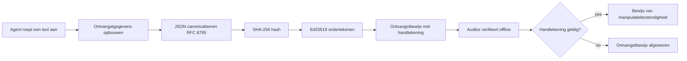
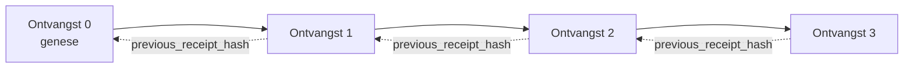

[Bekijk de lesvideo: AI-agenten beveiligen met cryptografische ontvangstbewijzen](https://youtu.be/PLACEHOLDER_VIDEO_ID)

> _(Lesvideo en thumbnail worden na samenvoeging toegevoegd door het Microsoft-contentteam, volgens het patroon van les 14 / 15.)_

# AI-agenten beveiligen met cryptografische ontvangstbewijzen

## Inleiding

Deze les behandelt:

- Waarom audit trails voor AI-agenten belangrijk zijn voor compliance, debugging en vertrouwen.
- Wat een cryptografisch ontvangstbewijs is en hoe het verschilt van een ongetekende logregel.
- Hoe je een ondertekend ontvangstbewijs maakt voor een tool-aanroep van een agent in gewone Python.
- Hoe je een ontvangstbewijs offline verifieert en manipulatie opspoort.
- Hoe ontvangstbewijzen aan elkaar te koppelen zodat het verwijderen of herschikken van een ontvangstbewijs de keten breekt.
- Wat ontvangstbewijzen bewijzen en wat ze expliciet niet bewijzen.

## Leerdoelen

Na het voltooien van deze les weet je hoe je:

- De faalmodi identificeert die cryptografische herkomst voor acties van agenten motiveren.
- Een Ed25519-ondertekend ontvangstbewijs maakt over een canonieke JSON payload.
- Een ontvangstbewijs onafhankelijk verifieert met alleen de publieke sleutel van de ondertekenaar.
- Manipulatie opspoort door verificatie opnieuw uit te voeren op een aangepast ontvangstbewijs.
- Een hash-gekoppelde reeks van ontvangstbewijzen bouwt en uitlegt waarom de keten belangrijk is.
- Het grensvlak herkent tussen wat ontvangstbewijzen bewijzen (attributie, integriteit, volgorde) en wat ze niet bewijzen (correctheid van de actie, geldigheid van het beleid).

## Het probleem: de audit trail van je agent

Stel dat je een AI-agent hebt ingezet voor Contoso Travel. De agent leest klantverzoeken, roept een vluchten-API aan om opties op te zoeken en boekt namens de klant stoelen. Het afgelopen kwartaal heeft de agent 50.000 boekingen verwerkt.

Vandaag arriveert een auditor. Die stelt een eenvoudige vraag: "Laat me zien wat je agent heeft gedaan."

Je overhandigt je logbestanden. De auditor kijkt ze na en stelt de moeilijkere vraag: "Hoe weet ik dat deze logs niet zijn bewerkt?"

Dit is het audit-trail probleem. De meeste agentimplementaties vertrouwen tegenwoordig op:

- **Applicatielogs**: geschreven door de agent zelf, bewerkbaar door iedereen met toegang tot het bestandssysteem.
- **Cloud logging-services**: aantoonbaar tamper-bestendig op platformniveau, maar alleen als de auditor de platformbeheerder vertrouwt.
- **Database transactielogs**: geschikt voor databasewijzigingen, maar niet voor willekeurige tool-aanroepen.

Geen van deze kan de vraag van de auditor beantwoorden zonder dat die iemand moet vertrouwen (jou, je cloudprovider, je databaseleverancier). Voor intern gebruik is dat vertrouwen vaak acceptabel. Voor gereguleerde workloads (financiën, gezondheidszorg, alles onder de EU AI-wet) is het dat niet.

Cryptografische ontvangstbewijzen lossen dit op door elke actie van de agent onafhankelijk verifieerbaar te maken. De auditor hoeft jou niet te vertrouwen. Hij heeft alleen je publieke sleutel en het ontvangstbewijs zelf nodig.

## Wat is een cryptografisch ontvangstbewijs?

Een ontvangstbewijs is een JSON-object dat vastlegt wat een agent heeft gedaan, ondertekend met een digitale handtekening.


```mermaid
flowchart LR
    A[Agent roept een tool aan] --> B[Ontvangstgegevens opbouwen]
    B --> C[JSON canonicaliseren RFC 8785]
    C --> D[SHA-256 hash]
    D --> E[Ed25519 ondertekenen]
    E --> F[Ontvangstbewijs met handtekening]
    F --> G[Auditor verifieert offline]
    G --> H{Handtekening geldig?}
    H -- yes --> I[Bewijs van manipulatiebestendigheid]
    H -- no --> J[Ontvangstbewijs afgewezen]
```

Een minimaal ontvangstbewijs ziet er zo uit:

```json
{
  "type": "agent.tool_call.v1",
  "agent_id": "contoso-travel-bot",
  "tool_name": "lookup_flights",
  "tool_args_hash": "sha256:a3f9c1...",
  "result_hash": "sha256:7b2e1d...",
  "policy_id": "contoso-travel-policy-v3",
  "timestamp": "2026-04-25T14:30:00Z",
  "sequence": 47,
  "previous_receipt_hash": "sha256:9d4e6a...",
  "signature": {
    "alg": "EdDSA",
    "sig": "c5af83...",
    "public_key": "8f3b2c..."
  }
}
```

Drie eigenschappen zorgen voor de werking:

1. **De handtekening**. Het ontvangstbewijs wordt ondertekend door de gateway van de agent met een Ed25519 privésleutel. Iedereen met de bijbehorende publieke sleutel kan de handtekening offline verifiëren. Manipulatie van welk veld dan ook maakt de handtekening ongeldig.

2. **Canonieke codering**. Voor het ondertekenen wordt het ontvangstbewijs geserialiseerd volgens de JSON Canonicalization Scheme (JCS, RFC 8785). Dit zorgt ervoor dat twee implementaties die hetzelfde logische ontvangstbewijs produceren ook exact dezelfde bytes produceren. Zonder canonisatie zouden verschillende JSON-serializers verschillende handtekeningen voor dezelfde inhoud produceren.

3. **Hash chaining**. Het veld `previous_receipt_hash` koppelt elk ontvangstbewijs aan het voorgaande. Het verwijderen of herschikken van een ontvangstbewijs breekt elk daaropvolgend ontvangstbewijs. Manipulatie wordt zichtbaar op ketenniveau, zelfs als individuele handtekeningen worden omzeild.

Gezamenlijk bieden deze eigenschappen drie garanties:

- **Attributie**: deze sleutel heeft deze inhoud ondertekend.
- **Integriteit**: de inhoud is sinds ondertekening niet veranderd.
- **Volgorde**: dit ontvangstbewijs kwam na dat ontvangstbewijs in de keten.

## Een ontvangstbewijs maken in Python

Je hebt geen speciale bibliotheek nodig om een ontvangstbewijs te maken. De cryptografische primitieve zijn breed beschikbaar en de logica is een paar dozijn regels Python.

De hands-on oefeningen in `code_samples/18-signed-receipts.ipynb` leiden je door de volledige flow. De samenvatting:

```python
import json
import hashlib
import base64
from nacl import signing
from jcs import canonicalize  # RFC 8785 canonieke JSON

def b64url_nopad(data: bytes) -> str:
    return base64.urlsafe_b64encode(data).decode("ascii").rstrip("=")

def sha256_canonical(obj) -> str:
    """SHA-256 of a Python object's JCS-canonical JSON form."""
    return f"sha256:{hashlib.sha256(canonicalize(obj)).hexdigest()}"

# Genereer of laad een ondertekeningssleutel (sla deze in productie op in een sleutelkast)
signing_key = signing.SigningKey.generate()
verify_key = signing_key.verify_key

# Bouw de ontvangstpayload (nog geen handtekening)
tool_args = {"origin": "SYD", "destination": "LAX"}
tool_result = [{"flight": "QF11", "price": 1850, "stops": 0}]

payload = {
    "type": "agent.tool_call.v1",
    "agent_id": "contoso-travel-bot",
    "tool_name": "lookup_flights",
    "tool_args_hash": sha256_canonical(tool_args),
    "result_hash": sha256_canonical(tool_result),
    "policy_id": "contoso-travel-policy-v3",
    "timestamp": "2026-04-25T14:30:00Z",
    "sequence": 0,
    "previous_receipt_hash": None,
}

# Canoniseren, hashen, ondertekenen.
canonical_bytes = canonicalize(payload)
message_hash = hashlib.sha256(canonical_bytes).digest()
signature_bytes = signing_key.sign(message_hash).signature

# Bevestig een gestructureerd handtekeningobject.
receipt = {
    **payload,
    "signature": {
        "alg": "EdDSA",
        "sig": b64url_nopad(signature_bytes),
        "public_key": b64url_nopad(bytes(verify_key)),
    },
}
```

Dat is de complete ondertekeningspipeline. De oefeningen in het notebook leiden je stap voor stap door elke fase.

## Een ontvangstbewijs verifiëren en manipulatie opsporen

Verificatie is de inverse operatie:

```python
import base64
import hashlib
from nacl import signing
from nacl.exceptions import BadSignatureError
from jcs import canonicalize

def b64url_decode(s: str) -> bytes:
    padding = "=" * ((4 - len(s) % 4) % 4)
    return base64.urlsafe_b64decode(s + padding)

def verify_receipt(receipt: dict) -> bool:
    # De handtekening is een gestructureerd object: {"alg", "sig", "public_key"}.
    sig_obj = receipt.get("signature")
    if not sig_obj or sig_obj.get("alg") != "EdDSA":
        return False

    # Reconstrueer de payload die daadwerkelijk is ondertekend (alles behalve de handtekening).
    payload = {k: v for k, v in receipt.items() if k != "signature"}

    canonical_bytes = canonicalize(payload)
    message_hash = hashlib.sha256(canonical_bytes).digest()

    try:
        verify_key = signing.VerifyKey(b64url_decode(sig_obj["public_key"]))
        verify_key.verify(message_hash, b64url_decode(sig_obj["sig"]))
        return True
    except BadSignatureError:
        return False
```

Deze functie neemt een ontvangstbewijs en geeft `True` terug als de handtekening geldig is, anders `False`. Geen netwerkverzoek, geen service-afhankelijkheid, geen vertrouwen in derden vereist.

Om manipulatie-opsporing in actie te zien, leidt het notebook je door:

1. Het maken van een geldig ontvangstbewijs en bevestigen dat het verifieert.
2. Het wijzigen van één byte van het veld `tool_args_hash`.
3. Het opnieuw uitvoeren van verificatie en zien dat het mislukt.

Dit is de praktische demonstratie dat ontvangstbewijzen manipulatiebestendig zijn: elke wijziging, hoe klein ook, breekt de handtekening.

## Koppelen van ontvangstbewijzen voor agenten met meerdere stappen

Eén ondertekend ontvangstbewijs beschermt één actie. Een keten van ontvangstbewijzen beschermt een reeks acties.


```mermaid
flowchart LR
    R0[Ontvangst 0<br/>genese] --> R1[Ontvangst 1]
    R1 --> R2[Ontvangst 2]
    R2 --> R3[Ontvangst 3]
    R1 -. previous_receipt_hash .-> R0
    R2 -. previous_receipt_hash .-> R1
    R3 -. previous_receipt_hash .-> R2
```

Elk ontvangstbewijs registreert de hash van het vorige ontvangstbewijs. Om ontvangenbewijs 2 ongemerkt te verwijderen, zou een aanvaller óf:

- Het veld `previous_receipt_hash` van ontvangstbewijs 3 aanpassen (breekt de handtekening van ontvangstbewijs 3), OF
- Een nieuwe handtekening op een aangepast ontvangstbewijs 3 vervalsen (vereist de privésleutel van de agent).

Als de privésleutel in een hardware key vault zit en je maakt de publieke sleutel met elk ontvangstbewijs openbaar, is geen van beide aanvallen uitvoerbaar zonder detectie.

Het notebook leidt je door:

1. Het bouwen van een keten van drie ontvangstbewijzen.
2. Verifiëren dat het `previous_receipt_hash` van elk ontvangstbewijs overeenkomt met de feitelijke hash van het voorgaande ontvangstbewijs.
3. Manipuleren van een ontvangstbewijs in het midden en zien dat de keten precies op dat punt breekt.

Zo maak je een audit trail die een externe auditor kan verifiëren zonder jou te hoeven vertrouwen.

## Wat ontvangstbewijzen bewijzen (en wat niet)

Dit is de belangrijkste sectie van deze les. Ontvangstbewijzen zijn krachtig, maar hun kracht is begrensd.

**Ontvangstbewijzen bewijzen drie dingen:**

1. **Attributie**: een specifieke sleutel heeft een specifieke payload ondertekend.
2. **Integriteit**: de payload is sinds ondertekening niet veranderd.
3. **Volgorde**: dit ontvangstbewijs kwam na dat ontvangstbewijs in de hashketen.

**Ontvangstbewijzen bewijzen NIET:**

1. **Correctheid**: dat de actie van de agent de juiste actie was. Een ontvangstbewijs kan even gemakkelijk voor een fout antwoord worden ondertekend als voor een correct antwoord.
2. **Beleidsnaleving**: dat het in `policy_id` vermelde beleid daadwerkelijk is geëvalueerd, of dat het deze actie zou hebben toegestaan als getoetst. Het ontvangstbewijs registreert wat werd beweerd, niet wat werd afgedwongen.
3. **Identiteit voorbij de sleutel**: het ontvangstbewijs zegt "deze sleutel heeft deze inhoud ondertekend." Het zegt niet "deze persoon heeft dit gemachtigd." Het koppelen van een sleutel aan een persoon of organisatie vereist aparte identiteitsinfrastructuur (een directory, een publieke statuslijst, enz.).
4. **Waarheidsgetrouwheid van inputs**: als de agent een gemanipuleerd prompt ontvangt en daarop reageert, legt het ontvangstbewijs de actie getrouw vast. Ontvangstbewijzen staan _na_ inputvalidatie, ze vervangen die niet.

Deze grens is belangrijk om twee redenen:

- Het vertelt je waar ontvangstbewijzen nuttig voor zijn: agentgedrag auditbaar en manipulatieresistent maken, ook over organisatiegrenzen heen.
- Het vertelt je welke extra lagen je nog nodig hebt: inputvalidatie (Les 6), beleidsafdwinging (kort behandeld hieronder) en identiteitsinfrastructuur (buiten scope van deze les).

Een veelgemaakte fout is te denken dat "we hebben ontvangstbewijzen" betekent "we zijn gereguleerd." Dat is niet zo. Ontvangstbewijzen zijn een basis. Governance is het systeem dat je daar bovenop bouwt.

## Productiereferenties

De Python-code in deze les is bewust minimaal zodat je elke regel kunt lezen en precies begrijpt wat er gebeurt. In productie heb je twee opties:

1. **Bouw direct op de cryptografische primitieve.** De 50 regels die je hierboven zag zijn genoeg voor veel gebruikssituaties. PyNaCl (Ed25519) en het `jcs`-pakket (canonieke JSON) zijn goed onderhouden en geauditeerde bibliotheken.

2. **Gebruik een productieontvangstbewijsbibliotheek.** Verschillende open-source projecten implementeren hetzelfde patroon met extra functies (sleutelrotatie, batch-verificatie, JWK Set distributie, integratie met beleidsengines):
   - Het ontvangstbewijsformaat dat in deze les wordt gebruikt volgt een IETF Internet-Draft (`draft-farley-acta-signed-receipts`) die momenteel door het standardisatieproces loopt.
   - De Microsoft Agent Governance Toolkit combineert ontvangstbewijzen met Cedar-gebaseerde beleidsbesluiten; zie Tutorial 33 in die repository voor een end-to-end voorbeeld.
   - De pakketten `protect-mcp` (npm) en `@veritasacta/verify` (npm) bieden een Node-implementatie van ontvangstbewijs ondertekening en offline verificatie, bedoeld om elke MCP-server met een manipulatieresistente audit trail te wikkelen.
   - De **[nobulex](https://github.com/arian-gogani/nobulex)** Python SDK (`pip install nobulex`) biedt hetzelfde Ed25519 + JCS ondertekeningspatroon in Python met LangChain- en CrewAI-integraties, inclusief gepubliceerde cross-validatie testvectoren en een compliance mapping bijgedragen via [OWASP PR #2210](https://github.com/OWASP/CheatSheetSeries/pull/2210).

De keuze tussen zelf bouwen of een bibliotheek gebruiken, weerspiegelt de keuze tussen zelf een JWT-bibliotheek schrijven of een geteste bibliotheek gebruiken: beide zijn redelijk; de bibliotheek bespaart tijd en vermindert de auditbodem; zelf bouwen dwingt je de primitieve goed te begrijpen. Deze les leert de zelfbouw-aanpak zodat je de basis hebt voor beide keuzes.

## Kennischeck

Test je begrip voordat je doorgaat naar de praktijkoefening.

**1. Een ontvangstbewijs wordt ondertekend met de privésleutel Ed25519 van de agent. De auditor heeft alleen de publieke sleutel. Kan de auditor het ontvangstbewijs offline verifiëren?**

<details>
<summary>Antwoord</summary>

Ja. Ed25519-verificatie vereist alleen de publieke sleutel en de ondertekende bytes. Geen netwerkverzoek, geen service-afhankelijkheid. Dit is de eigenschap die ontvangstbewijzen nuttig maakt in air-gapped, multi-organisatie of laag-vertrouwens audit-omgevingen.
</details>

**2. Een aanvaller wijzigt het `policy_id` veld van een ontvangstbewijs om te beweren dat het werd beheerst door een permissiever beleid. De handtekening was over de originele payload. Wat gebeurt er bij verificatie?**

<details>
<summary>Antwoord</summary>

Verificatie mislukt. De handtekening is berekend over de canonieke bytes van de originele payload; wijziging van welk veld ook verandert de canonieke bytes, wat de SHA-256 hash verandert, waardoor de handtekening ongeldig wordt. De aanvaller zou de privésleutel moeten hebben om een nieuwe geldige handtekening te produceren, wat hij niet heeft.
</details>

**3. Waarom bevat het ontvangstbewijs een `tool_args_hash` en `result_hash` in plaats van de ruwe argumenten en het resultaat?**

<details>
<summary>Antwoord</summary>

Twee redenen. Ten eerste moet het ontvangstbewijs misschien worden gearchiveerd of verzonden in omgevingen waar het lekken van ruwe inhoud (PII, bedrijfsgegevens) een probleem is. Hashing houdt het ontvangstbewijs klein en de inhoud privé; de auditor verifieert dat de hash overeenkomt met een apart opgeslagen kopie van de werkelijke inhoud. Ten tweede, hashes hebben een vaste grootte; een ontvangstbewijs met hashes is beperkt in grootte ongeacht hoe groot de invoer en uitvoer waren.
</details>

**4. Het veld `previous_receipt_hash` koppelt elk ontvangstbewijs aan zijn voorganger. Als een aanvaller stilletjes één ontvangstbewijs uit het midden van een keten verwijdert, wat wordt ongeldig?**

<details>
<summary>Antwoord</summary>

Elk ontvangstbewijs dat na het verwijderde kwam. Hun `previous_receipt_hash` velden komen niet meer overeen met de feitelijke keten (omdat het ontvangstbewijs waarnaar ze verwezen niet meer bestaat, of de keten nu naar een andere voorganger wijst). Om de verwijdering te verbergen, zou de aanvaller elk later ontvangstbewijs opnieuw moeten ondertekenen, wat de privésleutel vereist.
</details>

**5. Een ontvangstbewijs verifieert correct. Bewijst dat dat de actie van de agent correct, verstandig of beleidsconform was?**

<details>
<summary>Antwoord</summary>

Nee. Een geldig ontvangstbewijs bewijst drie dingen: attributie (deze sleutel tekende deze inhoud), integriteit (de inhoud is niet veranderd) en volgorde (dit ontvangstbewijs kwam na dat ontvangstbewijs). Het bewijst NIET dat de actie correct was, dat het beleid genoemd in `policy_id` daadwerkelijk werd geëvalueerd, of dat de agent elke regel heeft gevolgd. Ontvangstbewijzen maken agentgedrag auditbaar, niet per se correct. Dit is de belangrijkste grens in de les.
</details>

## Praktijkoefening

Open `code_samples/18-signed-receipts.ipynb` en voltooi alle vier secties:

1. **Sectie 1**: Onderteken je eerste ontvangstbewijs en verifieer het.
2. **Sectie 2**: Manipuleer het ontvangstbewijs en observeer het mislukken van de verificatie.
3. **Sectie 3**: Bouw een keten van drie ontvangstbewijzen en verifieer de integriteit van de keten.
4. **Sectie 4**: Pas het patroon toe op een agent gebouwd met het Microsoft Agent Framework: wikkel een tool-aanroep in ontvangstbewijs-ondertekening, en verifieer het ontvangstbewijs daarna onafhankelijk.


**Uitdagende opdracht 1:** breid het ontvangstschema uit met een extra veld naar keuze (bijvoorbeeld een aanvraag-ID voor tracing), werk de canonieke ondertekeningslogica bij om het op te nemen, en bevestig dat het ontvangstbewijs nog steeds correct door de verificatie komt. Wijzig daarna het veld na ondertekening en bevestig dat de verificatie faalt. Dit dwingt je te begrijpen hoe elke byte van de canonieke codering bijdraagt aan de handtekening.

**Uitdagende opdracht 2:** Maak een SHA-256-hash van twee van je ontvangstbewijzen samen (concateneer hun canonieke bytes in een deterministische volgorde) en embed de resulterende digest als een nieuw veld op een derde ontvangstbewijs voordat je het ondertekent. Verifieer dat alle drie de ontvangstbewijzen nog steeds correct door de verificatie komen. Je hebt zojuist een eenstaps inclusie-bewijs gebouwd: iedereen die het derde ontvangstbewijs heeft, kan bewijzen dat de eerste twee bestonden op het moment dat het werd ondertekend, zonder de inhoud daarvan te onthullen. Dit is het patroon dat selective-disclosure ontvangstbewijzen op grote schaal gebruiken (Merkle-committeringen, RFC 6962).

## Conclusie

Cryptografische ontvangstbewijzen bieden AI-agenten een audit-trail die:

- **Onafhankelijk verifieerbaar**: elke partij met de publieke sleutel kan verifiëren, zonder afhankelijkheid van een dienst.
- **Temperingsbestendig**: elke wijziging maakt de handtekening ongeldig.
- **Draagbaar**: een ontvangstbewijs is een klein JSON-bestand; het kan overal gearchiveerd, verzonden en geverifieerd worden.
- **Standaardgebaseerd**: gebouwd op Ed25519 (RFC 8032), JCS (RFC 8785), en SHA-256, allemaal breed ingezette primitieve tools.

Ze zijn geen vervanging voor invoervalidatie, beleidsafhandeling of identiteitsinfrastructuur. Ze vormen de basis voor die lagen. Wanneer je agenten inzet in gereguleerde werklasten, multi-organisatie workflows, of elke situatie waarin een toekomstige auditor je niet blindelings kan vertrouwen, zorgen ontvangstbewijzen ervoor dat het audit-spoor eerlijk is.

De belangrijkste les: ontvangstbewijzen bewijzen wie wat wanneer heeft gezegd. Ze bewijzen niet dat wat gezegd is waar of correct was. Houd dat onderscheid goed vast. Het is het verschil tussen een eerlijk provenance-systeem en een misleidend systeem.

## Productie Controlelijst

Wanneer je klaar bent om van deze les over te stappen naar het inzetten van ondertekende agenten in een echte omgeving:

- [ ] **Verplaats de ondertekeningssleutel van de ontwikkelaarslaptop.** Gebruik Azure Key Vault, AWS KMS, of een hardware security module. De privésleutel die je ontvangstbewijzen ondertekent mag nooit in broncodebeheer of in platte tekst op applicatiemachines staan.
- [ ] **Publiceer de verificatie publieke sleutel.** Auditors hebben die nodig voor offline verificatie. Het standaardpatroon is een JWK Set op een bekende URL (RFC 7517), bijvoorbeeld `https://your-org.example.com/.well-known/agent-keys.json`.
- [ ] **Veranker de keten extern.** Schrijf periodiek de laatst bekende ketenkop-hash naar een transparantielog (Sigstore Rekor, RFC 3161 timestamp authority, of een tweede intern systeem) zodat een externe partij kan bevestigen "deze keten bestond op dit moment."
- [ ] **Bewaar ontvangstbewijzen onveranderlijk.** Append-only blobopslag (Azure Storage met immutability policies, AWS S3 Object Lock) voorkomt dat insiders de geschiedenis herschrijven op het opslagniveau.
- [ ] **Bepaal bewaartermijnen.** Veel compliance-regels vereisen bewaring over meerdere jaren. Plan voor de groei van ontvangstbewijzen (elk ontvangstbewijs is ~500 bytes; een agent die 10K oproepen per dag doet produceert ~1,8 GB per jaar).
- [ ] **Documenteer wat ontvangstbewijzen niet dekken.** Ontvangstbewijzen bewijzen attributie, integriteit en volgorde. Je runbook moet expliciet opsommen welke aanvullende controles (invoervalidatie, beleidsafhandeling, snelheidsbeperking, identiteitsinfrastructuur) naast ontvangstbewijzen in je governance-positie staan.

### Meer vragen over het beveiligen van AI-agenten?

Word lid van de [Microsoft Foundry Discord](https://aka.ms/ai-agents/discord) om andere leerlingen te ontmoeten, deel te nemen aan spreekuren, en je vragen over AI-agenten beantwoord te krijgen.

## Voorbij deze les

Deze les behandelt het ondertekenen van één ontvangstbewijs en hashgekoppelde reeksen. Dezelfde primitieve technieken vormen de basis voor verschillende geavanceerdere patronen die je kunt tegenkomen naarmate je governance-volwassenheid groeit:

- **Selectieve openbaarmaking.** Wanneer de velden van een ontvangstbewijs onafhankelijk zijn gecommitteerd (RFC 6962-stijl Merkle-boom), kun je specifieke velden onthullen aan specifieke auditors en bewijzen dat de rest ongewijzigd is zonder die te blootstellen. Handig als hetzelfde ontvangstbewijs zowel een uitgebreide audit (met volledige gegevens) als gegevensminimalisatie-regulering zoals GDPR (waarbij de auditor zo min mogelijk hoeft te zien) moet ondersteunen.
- **Intrekking van ontvangstbewijzen.** Als een ondertekeningssleutel gecompromitteerd raakt, heb je een methode nodig om alle ontvangstbewijzen die met die sleutel zijn ondertekend vanaf een bepaald moment als onbetrouwbaar te markeren. Gebruikelijke patronen: kortlevende ondertekeningssleutels plus een gepubliceerde intrekkingslijst, of een transparantielog met intrekkingsinvoeringen.
- **Bilaterale / gesplitste handtekeningsontvangstbewijzen.** Sommige implementaties splitsen de ondertekende payload in pre-executie (`authorization_*`) en post-executie (`result_*`) helften met onafhankelijke handtekeningen, nuttig wanneer de autorisatiebeslissing en het waargenomen resultaat door verschillende actoren en/of op verschillende tijden zijn geproduceerd. Dit bouwt voort op het ontvangstbewijsformaat dat in deze les is behandeld.
- **Payloadcompositie.** Een ontvangstbewijs verzegelt welke bytes je ook in `result_hash` stopt. Payloads uit de praktijk zijn vaak rijker dan een enkel toolresultaat: pre-beslissing redeneringen (modelvoorspelling, overwogen opties, bewijs en volledigheid daarvan, risicopositie, verantwoordingsketen, slagingsresultaat) kunnen allemaal in de payload zitten, verzegeld door één ontvangstbewijs. Dit houdt het ontvangstbewijsformaat minimaal terwijl payloadschema's domein-voor-domein kunnen evolueren.
- **Cross-implementatie conformiteit.** Meerdere onafhankelijke implementaties van hetzelfde ontvangstbewijsformaat (Python, TypeScript, Rust, Go) verifiëren cross-compatible tegen gedeelde testvectoren. Als je een eigen implementatie bouwt, bevestigt validatie tegen gepubliceerde vectoren dat je wire-compatibel bent.
- **Post-quantum migratie.** Ed25519 is tegenwoordig breed ingezet maar is niet quantum-bestendig. Het ontvangstbewijsformaat is algoritme-agile: het veld `signature.alg` kan `ML-DSA-65` dragen (de NIST post-quantum handtekeningstandaard) wanneer je moet migreren. Plan een overgangsperiode waarin ontvangstbewijzen dubbel worden ondertekend.

## Aanvullende bronnen

- <a href="https://datatracker.ietf.org/doc/draft-farley-acta-signed-receipts/" target="_blank">IETF Internet-Draft: Signed Decision Receipts for Machine-to-Machine Access Control</a>
- <a href="https://learn.microsoft.com/azure/ai-studio/responsible-use-of-ai-overview" target="_blank">Responsible AI overview (Azure AI)</a>
- <a href="https://datatracker.ietf.org/doc/html/rfc8032" target="_blank">RFC 8032: Edwards-Curve Digital Signature Algorithm (EdDSA)</a>
- <a href="https://datatracker.ietf.org/doc/html/rfc8785" target="_blank">RFC 8785: JSON Canonicalization Scheme (JCS)</a>
- <a href="https://datatracker.ietf.org/doc/html/rfc6962" target="_blank">RFC 6962: Certificate Transparency</a> (Merkle-boomconstructie gebruikt door selective-disclosure ontvangstbewijzen)
- <a href="https://github.com/microsoft/agent-governance-toolkit/blob/main/docs/tutorials/33-offline-verifiable-receipts.md" target="_blank">Microsoft Agent Governance Toolkit, Tutorial 33: Offline-Verifiable Decision Receipts</a>
- <a href="https://github.com/ScopeBlind/agent-governance-testvectors" target="_blank">Cross-implementatie conformiteitstestvectoren</a> voor het ontvangstbewijsformaat dat in deze les gebruikt wordt (Apache-2.0)
- <a href="https://pynacl.readthedocs.io/" target="_blank">PyNaCl documentatie</a> (Ed25519 in Python)

## Vorige les

[Building Computer Use Agents (CUA)](../15-browser-use/README.md)

---

<!-- CO-OP TRANSLATOR DISCLAIMER START -->
**Disclaimer**:
Dit document is vertaald met behulp van de AI vertaaldienst [Co-op Translator](https://github.com/Azure/co-op-translator). Hoewel we streven naar nauwkeurigheid, dient u er rekening mee te houden dat geautomatiseerde vertalingen fouten of onnauwkeurigheden kunnen bevatten. Het originele document in de oorspronkelijke taal moet worden beschouwd als de gezaghebbende bron. Voor kritieke informatie wordt professionele menselijke vertaling aanbevolen. Wij zijn niet aansprakelijk voor eventuele misverstanden of verkeerde interpretaties die voortvloeien uit het gebruik van deze vertaling.
<!-- CO-OP TRANSLATOR DISCLAIMER END -->