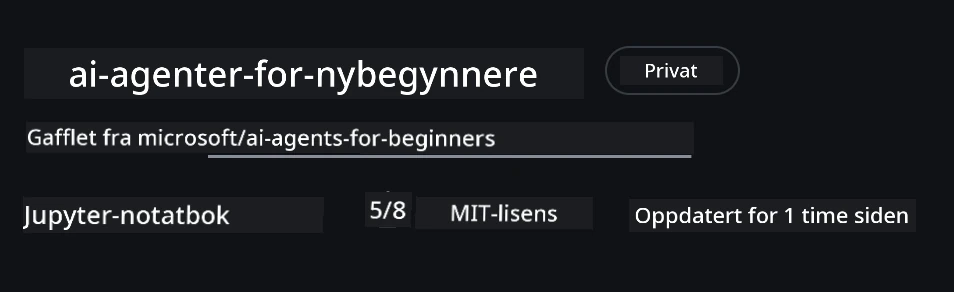

# Kursoppsett

## Introduksjon

Denne leksjonen vil dekke hvordan du kjører kodeeksemplene i dette kurset.

## Bli med andre elever og få hjelp

Før du begynner å klone repoet ditt, bli med i [AI Agents For Beginners Discord-kanalen](https://aka.ms/ai-agents/discord) for å få hjelp med oppsett, spørsmål om kurset eller for å komme i kontakt med andre elever.

## Klon eller fork dette repoet

For å starte, vær så snill å klone eller fork GitHub-repositoriet. Dette vil lage din egen versjon av kursmaterialet slik at du kan kjøre, teste og justere koden!

Dette kan gjøres ved å klikke på linken for å <a href="https://github.com/microsoft/ai-agents-for-beginners/fork" target="_blank">forke repoet</a>

Du skal nå ha din egen forkede versjon av dette kurset på følgende link:



### Shallow Clone (anbefalt for workshop / Codespaces)

  >Det fulle repositoriet kan være stort (~3 GB) når du laster ned full historikk og alle filer. Hvis du kun deltar på workshopen eller bare trenger noen få leksjonsmapper, unngår en shallow clone (eller en sparsommelig clone) det meste av nedlastingen ved å kutte historikken og/eller hoppe over blobs.

#### Rask shallow clone — minimal historikk, alle filer

Erstatt `<your-username>` i kommandoene nedenfor med din fork URL (eller opprinnelig URL hvis du foretrekker det).

For å klone bare den siste commit-historikken (liten nedlasting):

```bash|powershell
git clone --depth 1 https://github.com/<your-username>/ai-agents-for-beginners.git
```

For å klone en spesifikk branch:

```bash|powershell
git clone --depth 1 --branch <branch-name> https://github.com/<your-username>/ai-agents-for-beginners.git
```

#### Delvis (sparse) clone — minimale blobs + kun utvalgte mapper

Dette bruker partial clone og sparse-checkout (krever Git 2.25+ og anbefales med moderne Git som støtter partial clone):

```bash|powershell
git clone --depth 1 --filter=blob:none --sparse https://github.com/<your-username>/ai-agents-for-beginners.git
```

Gå inn i repo-mappen:

```bash|powershell
cd ai-agents-for-beginners
```

Deretter spesifiser hvilke mapper du ønsker (eksemplet nedenfor viser to mapper):

```bash|powershell
git sparse-checkout set 00-course-setup 01-intro-to-ai-agents
```

Etter kloning og verifisering av filene, hvis du kun trenger filene og vil frigjøre plass (ingen git-historikk), vennligst slett repositormetadataene (💀irreversibelt — du vil miste all Git-funksjonalitet: ingen commits, pulls, pushes eller tilgang til historikk).

```bash
# zsh/bash
rm -rf .git
```

```powershell
# PowerShell
Remove-Item -Recurse -Force .git
```

#### Bruke GitHub Codespaces (anbefalt for å unngå store lokale nedlastinger)

- Opprett en ny Codespace for dette repoet via [GitHub UI](https://github.com/codespaces).  

- I terminalen til den nylig opprettede codespacen, kjør en av shallow/sparse clone-kommandoene ovenfor for å hente kun de leksjonsmappene du trenger inn i Codespace-arbeidsområdet.  
- Valgfritt: etter kloning inne i Codespaces, fjern .git for å frigjøre ekstra plass (se fjern kommandoene over).
- Merk: Hvis du foretrekker å åpne repoet direkte i Codespaces (uten ekstra kloning), vær oppmerksom på at Codespaces vil konstruere devcontainer-miljøet og kan fortsatt provisionere mer enn du trenger. En shallow kopi klonet inne i en fersk Codespace gir deg mer kontroll over diskbruk.

#### Tips

- Bytt alltid ut clone URL med din fork hvis du ønsker å redigere/committe.
- Hvis du senere trenger mer historikk eller filer, kan du hente dem eller justere sparse-checkout for å inkludere flere mapper.

## Kjøre koden

Dette kurset tilbyr en serie Jupyter Notebooks som du kan kjøre for å få praktisk erfaring med å bygge AI-agenter.

Kodeeksemplene bruker **Microsoft Agent Framework (MAF)** med `AzureAIProjectAgentProvider`, som kobler til **Azure AI Agent Service V2** (Responses API) gjennom **Microsoft Foundry**.

Alle Python-notebooks er merket `*-python-agent-framework.ipynb`.

## Krav

- Python 3.12+
  - **MERK**: Hvis du ikke har Python3.12 installert, sørg for å installere det. Lag deretter ditt virtuelle miljø med python3.12 for å sikre at riktige versjoner blir installert fra requirements.txt-filen.
  
    >Eksempel

    Opprett Python venv-mappe:

    ```bash|powershell
    python -m venv venv
    ```

    Aktiver venv-miljø for:

    ```bash
    # zsh/bash
    source venv/bin/activate
    ```
  
    ```dos
    # Command Prompt for Windows
    venv\Scripts\activate
    ```

- .NET 10+: For prøveeksemplene som bruker .NET, sørg for å installere [.NET 10 SDK](https://dotnet.microsoft.com/download/dotnet/10.0) eller nyere. Sjekk deretter installert .NET SDK-versjon:

    ```bash|powershell
    dotnet --list-sdks
    ```

- **Azure CLI** — Kreves for autentisering. Installer fra [aka.ms/installazurecli](https://aka.ms/installazurecli).
- **Azure-abonnement** — For tilgang til Microsoft Foundry og Azure AI Agent Service.
- **Microsoft Foundry-prosjekt** — Et prosjekt med en distribuert modell (f.eks. `gpt-4o`). Se [Steg 1](../../../00-course-setup) nedenfor.

Vi har inkludert en fil `requirements.txt` i rotmappen av dette repositoriet som inneholder alle nødvendige Python-pakker for å kjøre kodeeksemplene.

Du kan installere dem ved å kjøre følgende kommando i terminalen i rotmappen av repoet:

```bash|powershell
pip install -r requirements.txt
```

Vi anbefaler å opprette et Python virtuelt miljø for å unngå konflikter og problemer.

## Sett opp VSCode

Sørg for at du bruker riktig versjon av Python i VSCode.


## Sett opp Microsoft Foundry og Azure AI Agent Service

### Steg 1: Opprett et Microsoft Foundry-prosjekt

Du trenger en Azure AI Foundry **hub** og **prosjekt** med en distribuert modell for å kjøre notatbøkene.

1. Gå til [ai.azure.com](https://ai.azure.com) og logg inn med din Azure-konto.
2. Opprett en **hub** (eller bruk en eksisterende). Se: [Oversikt over hub-ressurser](https://learn.microsoft.com/azure/ai-foundry/concepts/ai-resources).
3. I huben oppretter du et **prosjekt**.
4. Distribuer en modell (f.eks. `gpt-4o`) fra **Models + Endpoints** → **Deploy model**.

### Steg 2: Hent prosjektendepunkt og modellutplasseringens navn

Fra prosjektet ditt i Microsoft Foundry-portalen:

- **Prosjektendepunkt** — Gå til **Oversikt**-siden og kopier endepunkt-URLen.


- **Modellutplasseringsnavn** — Gå til **Models + Endpoints**, velg din utplasserte modell, og noter **Deployment name** (f.eks. `gpt-4o`).

### Steg 3: Logg inn i Azure med `az login`

Alle notatbøker bruker **`AzureCliCredential`** for autentisering — ingen API-nøkler å håndtere. Dette krever at du er innlogget via Azure CLI.

1. **Installer Azure CLI** hvis du ikke allerede har det: [aka.ms/installazurecli](https://aka.ms/installazurecli)

2. **Logg inn** ved å kjøre:

    ```bash|powershell
    az login
    ```

    Eller hvis du er i et fjern-/Codespace-miljø uten nettleser:

    ```bash|powershell
    az login --use-device-code
    ```

3. **Velg abonnement** hvis du blir spurt — velg det som inneholder Foundry-prosjektet ditt.

4. **Verifiser** at du er innlogget:

    ```bash|powershell
    az account show
    ```

> **Hvorfor `az login`?** Notatbøkene autentiserer med `AzureCliCredential` fra `azure-identity`-pakken. Det betyr at Azure CLI-økten din leverer legitimasjonen — ingen API-nøkler eller hemmeligheter i `.env`-filen. Dette er en [sikkerhetsmessig beste praksis](https://learn.microsoft.com/azure/developer/ai/keyless-connections).

### Steg 4: Opprett `.env`-filen din

Kopier eksempel-filen:

```bash
# zsh/bash
cp .env.example .env
```

```powershell
# PowerShell
Copy-Item .env.example .env
```

Åpne `.env` og fyll inn disse to verdiene:

```env
AZURE_AI_PROJECT_ENDPOINT=https://<your-project>.services.ai.azure.com/api/projects/<your-project-id>
AZURE_AI_MODEL_DEPLOYMENT_NAME=gpt-4o
```

| Variabel | Hvor finne den |
|----------|-----------------|
| `AZURE_AI_PROJECT_ENDPOINT` | Foundry-portalen → ditt prosjekt → **Oversikt**-siden |
| `AZURE_AI_MODEL_DEPLOYMENT_NAME` | Foundry-portalen → **Models + Endpoints** → navn på utplassert modell |

Det er alt for de fleste leksjoner! Notatbøkene vil autentisere automatisk via din `az login`-økt.

### Steg 5: Installer Python-avhengigheter

```bash|powershell
pip install -r requirements.txt
```

Vi anbefaler å kjøre dette inne i det virtuelle miljøet du laget tidligere.

## Ytterligere oppsett for leksjon 5 (Agentic RAG)

Leksjon 5 bruker **Azure AI Search** for Retrieval-Augmented Generation. Hvis du planlegger å kjøre den leksjonen, legg til disse variablene i `.env`-filen din:

| Variabel | Hvor finne den |
|----------|-----------------|
| `AZURE_SEARCH_SERVICE_ENDPOINT` | Azure-portalen → din **Azure AI Search**-ressurs → **Oversikt** → URL |
| `AZURE_SEARCH_API_KEY` | Azure-portalen → din **Azure AI Search**-ressurs → **Innstillinger** → **Nøkler** → primær admin-nøkkel |

## Ytterligere oppsett for leksjon 6 og leksjon 8 (GitHub-modeller)

Noen notatbøker i leksjon 6 og 8 bruker **GitHub-modeller** i stedet for Azure AI Foundry. Hvis du planlegger å kjøre disse eksemplene, legg til disse variablene i `.env`-filen:

| Variabel | Hvor finne den |
|----------|-----------------|
| `GITHUB_TOKEN` | GitHub → **Innstillinger** → **Utviklerinnstillinger** → **Personlige tilgangstokener** |
| `GITHUB_ENDPOINT` | Bruk `https://models.inference.ai.azure.com` (standardverdi) |
| `GITHUB_MODEL_ID` | Modellnavn som skal brukes (f.eks. `gpt-4o-mini`) |

## Ytterligere oppsett for leksjon 8 (Bing Grounding Workflow)

Den betingede workflow-notatboken i leksjon 8 bruker **Bing grounding** via Azure AI Foundry. Hvis du planlegger å kjøre det eksempelet, legg til denne variabelen i `.env`-filen:

| Variabel | Hvor finne den |
|----------|-----------------|
| `BING_CONNECTION_ID` | Azure AI Foundry-portalen → prosjektet ditt → **Management** → **Connected resources** → din Bing-tilkobling → kopier tilkoblings-ID |

## Feilsøking

### SSL-sertifikatverifiseringsfeil på macOS

Hvis du bruker macOS og får en feil som:

```plaintext
ssl.SSLCertVerificationError: [SSL: CERTIFICATE_VERIFY_FAILED] certificate verify failed: self-signed certificate in certificate chain
```

Dette er et kjent problem med Python på macOS hvor systemets SSL-sertifikater ikke automatisk blir godkjent. Prøv følgende løsninger i rekkefølge:

**Alternativ 1: Kjør Pythons Install Certificates-skript (anbefalt)**

```bash
# Erstatt 3.XX med din installerte Python-versjon (f.eks., 3.12 eller 3.13):
/Applications/Python\ 3.XX/Install\ Certificates.command
```

**Alternativ 2: Bruk `connection_verify=False` i notatboken (kun for GitHub Models-notatbøker)**

I Leksjon 6-notatboken (`06-building-trustworthy-agents/code_samples/06-system-message-framework.ipynb`) finnes det allerede en kommentert workaround. Fjern kommentaren for `connection_verify=False` når klienten opprettes:

```python
client = ChatCompletionsClient(
    endpoint=endpoint,
    credential=AzureKeyCredential(token),
    connection_verify=False,  # Deaktiver SSL-verifisering hvis du opplever sertifikatfeil
)
```

> **⚠️ Advarsel:** Deaktivering av SSL-verifisering (`connection_verify=False`) reduserer sikkerheten ved å hoppe over sertifikatvalidering. Bruk dette kun som en midlertidig løsning i utviklingsmiljøer, aldri i produksjon.

**Alternativ 3: Installer og bruk `truststore`**

```bash
pip install truststore
```

Legg deretter til følgende øverst i notatboken eller skriptet før du foretar nettverkskall:

```python
import truststore
truststore.inject_into_ssl()
```

## Stuck et sted?

Hvis du har problemer med dette oppsettet, bli med i vår <a href="https://discord.gg/kzRShWzttr" target="_blank">Azure AI Community Discord</a> eller <a href="https://github.com/microsoft/ai-agents-for-beginners/issues?WT.mc_id=academic-105485-koreyst" target="_blank">opprett en issue</a>.

## Neste leksjon

Du er nå klar til å kjøre koden for dette kurset. Lykke til med å lære mer om verden av AI-agenter!

[Introduksjon til AI-agenter og agentbrukstilfeller](../01-intro-to-ai-agents/README.md)

---

<!-- CO-OP TRANSLATOR DISCLAIMER START -->
**Ansvarsfraskrivelse**:
Dette dokumentet er oversatt ved bruk av AI-oversettelsestjenesten [Co-op Translator](https://github.com/Azure/co-op-translator). Selv om vi streber etter nøyaktighet, vær oppmerksom på at automatiske oversettelser kan inneholde feil eller unøyaktigheter. Det opprinnelige dokumentet på dets opprinnelige språk skal betraktes som den autoritative kilden. For kritisk informasjon anbefales profesjonell menneskelig oversettelse. Vi påtar oss ikke ansvar for eventuelle misforståelser eller feiltolkninger som følge av bruken av denne oversettelsen.
<!-- CO-OP TRANSLATOR DISCLAIMER END -->