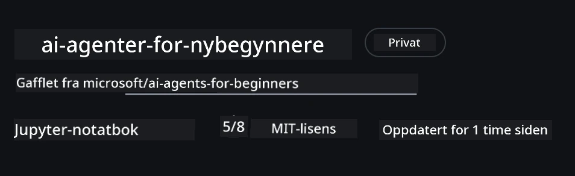
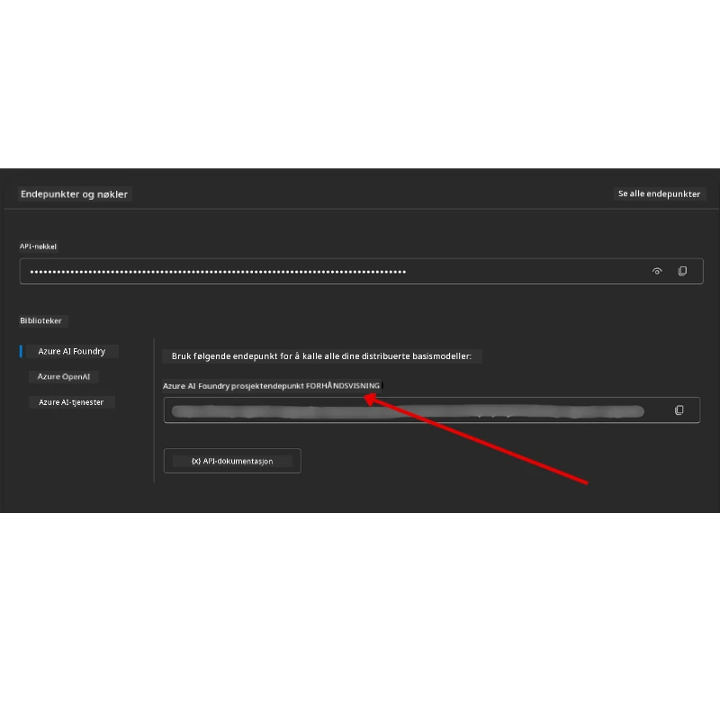

# Oppsett av kurs

## Introduksjon

Denne leksjonen vil dekke hvordan du kjører kodeeksemplene i dette kurset.

## Bli med andre lærende og få hjelp

Før du begynner å klone repoet ditt, bli med i [AI Agents For Beginners Discord-kanal](https://aka.ms/ai-agents/discord) for å få hjelp med oppsett, stille spørsmål om kurset, eller for å koble deg til andre lærende.

## Klon eller fork dette repoet

For å starte, vennligst klon eller fork GitHub-repositoriet. Dette gir deg din egen versjon av kursmaterialet slik at du kan kjøre, teste og justere koden!

Dette kan gjøres ved å klikke på lenken for å <a href="https://github.com/microsoft/ai-agents-for-beginners/fork" target="_blank">forke repoet</a>

Du bør nå ha din egen forkede versjon av dette kurset på følgende lenke:



### Grunnleggende kloning (anbefalt for workshop / Codespaces)

  > Det fulle repositoriet kan være stort (~3 GB) når du laster ned full historikk og alle filer. Hvis du bare deltar på workshop eller bare trenger noen få leksjonsmapper, unngår en grunnleggende kloning (eller sparsommelig kloning) det meste av den nedlastingen ved å korte ned historikken og/eller hoppe over blobs.

#### Rask grunnleggende kloning — minimal historikk, alle filer

Bytt ut `<your-username>` i kommandoene under med din fork-URL (eller upstream-URL hvis du foretrekker det).

For å klone bare den siste commit-historikken (liten nedlasting):

```bash|powershell
git clone --depth 1 https://github.com/<your-username>/ai-agents-for-beginners.git
```

For å klone en spesifikk gren:

```bash|powershell
git clone --depth 1 --branch <branch-name> https://github.com/<your-username>/ai-agents-for-beginners.git
```

#### Delvis (sparsom) kloning — minimale blobs + kun utvalgte mapper

Dette bruker delvis kloning og sparse-checkout (krever Git 2.25+ og anbefalt moderne Git med støtte for delvis kloning):

```bash|powershell
git clone --depth 1 --filter=blob:none --sparse https://github.com/<your-username>/ai-agents-for-beginners.git
```

Gå inn i repo-mappen:

```bash|powershell
cd ai-agents-for-beginners
```

Angi deretter hvilke mapper du ønsker (eksempelet under viser to mapper):

```bash|powershell
git sparse-checkout set 00-course-setup 01-intro-to-ai-agents
```

Etter kloning og verifisering av filene, hvis du bare trenger filene og vil frigjøre plass (ingen git-historikk), slett repoets metadata (💀irreversibelt — du mister all Git-funksjonalitet: ingen commits, pulls, pushes eller tilgang til historikk).

```bash
# zsh/bash
rm -rf .git
```

```powershell
# PowerShell
Remove-Item -Recurse -Force .git
```

#### Bruke GitHub Codespaces (anbefalt for å unngå store lokale nedlastinger)

- Opprett en ny Codespace for dette repoet via [GitHub UI](https://github.com/codespaces).  

- I terminalen i den nylig opprettede Codespace, kjør en av de grunnleggende/sparsom-kloning kommandoene ovenfor for å hente kun de leksjons-mappene du trenger inn i Codespace-arbeidsområdet.
- Valgfritt: etter kloning inne i Codespaces, fjern .git for å få tilbake ekstra plass (se fjerningskommandoene ovenfor).
- Merk: Hvis du foretrekker å åpne repoet direkte i Codespaces (uten ekstra kloning), vær oppmerksom på at Codespaces konstruerer devcontainer-miljøet og kan fortsatt sette opp mer enn du trenger. Å klone en grunnleggende kopi inne i en fersk Codespace gir deg mer kontroll over diskbruken.

#### Tips

- Bytt alltid ut klone-URL med din fork hvis du ønsker å redigere/committe.
- Hvis du senere trenger mer historikk eller filer, kan du hente dem eller justere sparse-checkout for å inkludere flere mapper.

## Kjøre koden

Dette kurset tilbyr en serie Jupyter Notebooks som du kan kjøre for å få praktisk erfaring med å bygge AI-agenter.

Kodeeksemplene bruker **Microsoft Agent Framework (MAF)** med `FoundryChatClient`, som kobler til **Microsoft Foundry Agent Service V2** (Responses API) gjennom **Microsoft Foundry**.

Alle Python-notatbøker er merket `*-python-agent-framework.ipynb`.

## Krav

- Python 3.12+
  - **MERK**: Hvis du ikke har Python3.12 installert, sørg for å installere det. Opprett deretter ditt virtuelle miljø med python3.12 for å sikre at riktige versjoner installeres fra requirements.txt-filen.
  
    >Eksempel

    Opprett Python venv-mappe:

    ```bash|powershell
    python -m venv venv
    ```

    Aktiver deretter venv-miljø for:

    ```bash
    # zsh/bash
    source venv/bin/activate
    ```
  
    ```dos
    # Command Prompt for Windows
    venv\Scripts\activate
    ```

- .NET 10+: For eksempelkodene som bruker .NET, sørg for å installere [.NET 10 SDK](https://dotnet.microsoft.com/download/dotnet/10.0) eller nyere. Sjekk deretter installert .NET SDK-versjon:

    ```bash|powershell
    dotnet --list-sdks
    ```

- **Azure CLI** — Kreves for autentisering. Installer fra [aka.ms/installazurecli](https://aka.ms/installazurecli).
- **Azure-abonnement** — For tilgang til Microsoft Foundry og Microsoft Foundry Agent Service.
- **Microsoft Foundry-prosjekt** — Et prosjekt med en distribuert modell (f.eks., `gpt-4o`). Se [Steg 1](#steg-1-opprett-et-microsoft-foundry-prosjekt) nedenfor.

Vi har inkludert en `requirements.txt` fil i roten av dette repoet som inneholder alle nødvendige Python-pakker for å kjøre kodeeksemplene.

Du kan installere dem ved å kjøre følgende kommando i terminalen i roten av repoet:

```bash|powershell
pip install -r requirements.txt
```

Vi anbefaler å opprette et Python virtuelt miljø for å unngå konflikter og problemer.

## Sett opp VSCode

Sørg for at du bruker riktig Python-versjon i VSCode.


## Sett opp Microsoft Foundry og Microsoft Foundry Agent Service

### Steg 1: Opprett et Microsoft Foundry-prosjekt

Du trenger en Microsoft Foundry **hub** og **prosjekt** med en distribuert modell for å kjøre notatbøkene.

1. Gå til [ai.azure.com](https://ai.azure.com) og logg inn med din Azure-konto.
2. Opprett en **hub** (eller bruk en eksisterende). Se: [Hub resources overview](https://learn.microsoft.com/azure/ai-foundry/concepts/ai-resources).
3. Inne i huben, opprett et **prosjekt**.
4. Distribuer en modell (f.eks. `gpt-4o`) fra **Models + Endpoints** → **Deploy model**.

### Steg 2: Hent prosjektets endepunkt og modellutplasseringsnavn

Fra prosjektet ditt i Microsoft Foundry-portalen:

- **Project Endpoint** — Gå til **Overview**-siden og kopier endepunkt-URLen.



- **Model Deployment Name** — Gå til **Models + Endpoints**, velg din distribuerte modell, og noter **Deployment name** (f.eks., `gpt-4o`).

### Steg 3: Logg inn i Azure med `az login`

Alle notatbøkene bruker **`AzureCliCredential`** for autentisering — ingen API-nøkler å administrere. Dette krever at du er pålogget via Azure CLI.

1. **Installer Azure CLI** hvis du ikke allerede har det: [aka.ms/installazurecli](https://aka.ms/installazurecli)

2. **Logg inn** ved å kjøre:

    ```bash|powershell
    az login
    ```

    Eller hvis du er i et eksternt/Codespace-miljø uten nettleser:

    ```bash|powershell
    az login --use-device-code
    ```

3. **Velg abonnement** hvis du blir spurt — velg det som inneholder Foundry-prosjektet ditt.

4. **Verifiser** at du er pålogget:

    ```bash|powershell
    az account show
    ```

> **Hvorfor `az login`?** Notatbøkene autentiserer med `AzureCliCredential` fra `azure-identity`-pakken. Dette betyr at Azure CLI-økten din gir legitimasjonen — ingen API-nøkler eller hemmeligheter i `.env`-filen din. Dette er en [sikkerhetsmessig beste praksis](https://learn.microsoft.com/azure/developer/ai/keyless-connections).

### Steg 4: Opprett din `.env`-fil

Kopier eksempel-filen:

```bash
# zsh/bash
cp .env.example .env
```

```powershell
# PowerShell
Copy-Item .env.example .env
```

Åpne `.env` og fyll inn disse to verdiene:

```env
AZURE_AI_PROJECT_ENDPOINT=https://<your-project>.services.ai.azure.com/api/projects/<your-project-id>
AZURE_AI_MODEL_DEPLOYMENT_NAME=gpt-4o
```

| Variabel | Hvor du finner den |
|----------|-----------------|
| `AZURE_AI_PROJECT_ENDPOINT` | Foundry-portalen → ditt prosjekt → **Overview** side |
| `AZURE_AI_MODEL_DEPLOYMENT_NAME` | Foundry-portalen → **Models + Endpoints** → navnet på din distribuerte modell |

Det er alt for de fleste leksjoner! Notatbøkene autentiserer automatisk via din `az login`-økt.

### Steg 5: Installer Python-avhengigheter

```bash|powershell
pip install -r requirements.txt
```

Vi anbefaler å kjøre dette innenfor det virtuelle miljøet du opprettet tidligere.

## Ekstra oppsett for Leksjon 5 (Agentic RAG)

Leksjon 5 bruker **Azure AI Search** for retrieval-augmented generation. Hvis du planlegger å kjøre den leksjonen, legg til disse variablene i din `.env`-fil:

| Variabel | Hvor du finner den |
|----------|-----------------|
| `AZURE_SEARCH_SERVICE_ENDPOINT` | Azure-portalen → din **Azure AI Search**-ressurs → **Overview** → URL |
| `AZURE_SEARCH_API_KEY` | Azure-portalen → din **Azure AI Search**-ressurs → **Settings** → **Keys** → primær administrasjonsnøkkel |

## Ekstra oppsett for leksjoner som kaller Azure OpenAI direkte (Leksjoner 6 og 8)

Noen notatbøker i leksjon 6 og 8 kaller **Azure OpenAI** direkte (med **Responses API**) i stedet for via et Microsoft Foundry-prosjekt. Disse eksemplene brukte tidligere GitHub Models, som er utfaset (legges ned juli 2026) og støtter ikke Responses API. Hvis du planlegger å kjøre de eksemplene, legg til disse variablene i din `.env`-fil:

| Variabel | Hvor du finner den |
|----------|-----------------|
| `AZURE_OPENAI_ENDPOINT` | Azure-portalen → din **Azure OpenAI**-ressurs → **Keys and Endpoint** → Endpoint (f.eks. `https://<your-resource>.openai.azure.com`) |
| `AZURE_OPENAI_DEPLOYMENT` | Navnet på din distribuerte modell (f.eks. `gpt-4o-mini`) som støtter Responses API |
| `AZURE_OPENAI_API_KEY` | Valgfritt — kun hvis du bruker nøkkelbasert autentisering i stedet for `az login` / Entra ID |

> Responses API bruker det stabile `/openai/v1/` endepunktet, så ingen `api-version` er nødvendig. Logg på med `az login` for å bruke nøkkelfri Entra ID autentisering.

## Alternativ leverandør: MiniMax (OpenAI-kompatibel)

[MiniMax](https://platform.minimaxi.com/) tilbyr store-kontekst modeller (opp til 204K tokens) gjennom en OpenAI-kompatibel API. Siden Microsoft Agent Frameworks `OpenAIChatClient` fungerer med enhver OpenAI-kompatibel endepunkt, kan du bruke MiniMax som et enkelt alternativ til Azure OpenAI eller OpenAI.

Legg til disse variablene i din `.env`-fil:

| Variabel | Hvor du finner den |
|----------|-----------------|
| `MINIMAX_API_KEY` | [MiniMax Platform](https://platform.minimaxi.com/) → API Keys |
| `MINIMAX_BASE_URL` | Bruk `https://api.minimax.io/v1` (standardverdi) |
| `MINIMAX_MODEL_ID` | Modellnavnet som skal brukes (f.eks. `MiniMax-M3`) |

**Eksempelmodeller**: `MiniMax-M3` (anbefalt), `MiniMax-M2.7`, `MiniMax-M2.7-highspeed` (raskere responser). Modellnavn og tilgjengelighet kan endre seg over tid, og tilgangen til en gitt modell kan avhenge av konto eller region — sjekk [MiniMax Platform](https://platform.minimaxi.com/) for gjeldende liste. Hvis `MiniMax-M3` ikke er tilgjengelig for din konto, sett `MINIMAX_MODEL_ID` til en modell du har tilgang til (f.eks. `MiniMax-M2.7`).

Kodeeksemplene som bruker `OpenAIChatClient` (f.eks. Leksjon 14 hotellbestillingsflyt) vil automatisk oppdage og bruke din MiniMax-konfigurasjon når `MINIMAX_API_KEY` er satt.

## Alternativ leverandør: Foundry Local (kjør modeller på enheten)

[Foundry Local](https://foundrylocal.ai) er et lettvekts runtime som laster ned, administrerer og leverer språkmodeller **helt på din egen maskin** gjennom en OpenAI-kompatibel API — ingen sky, ingen Azure-abonnement og ingen API-nøkler. Det er et utmerket valg for offline utvikling, eksperimentering uten sky-kostnader, eller for å holde data på enheten.

Siden Microsoft Agent Frameworks `OpenAIChatClient` fungerer med enhver OpenAI-kompatibel endepunkt, er Foundry Local et enkelt lokalt alternativ til Azure OpenAI.

**1. Installer Foundry Local**

```bash
# Windows
winget install Microsoft.FoundryLocal

# macOS
brew install foundrylocal
```

**2. Last ned og kjør en modell** (dette starter også den lokale tjenesten):

```bash
foundry model list          # se tilgjengelige modeller
foundry model run phi-4-mini
```

**3. Installer Python SDK-en** som brukes til å finne det lokale endepunktet:

```bash
pip install foundry-local-sdk
```

**4. Pek Microsoft Agent Framework mot din lokale modell:**

```python
from foundry_local import FoundryLocalManager
from agent_framework.openai import OpenAIChatClient

# Laster ned (ved behov) og kjører modellen lokalt, deretter oppdager endepunkt/port.
manager = FoundryLocalManager("phi-4-mini")

chat_client = OpenAIChatClient(
    base_url=manager.endpoint,      # f.eks. http://localhost:<port>/v1
    api_key=manager.api_key,        # alltid "ikke-påkrevd" for Foundry Local
    model_id=manager.get_model_info("phi-4-mini").id,
)

agent = chat_client.as_agent(
    name="LocalAgent",
    instructions="You are a helpful assistant running fully on-device.",
)
```

> **Merk:** Foundry Local eksponerer et OpenAI-kompatibelt **Chat Completions** endepunkt. Bruk det for lokal utvikling og offline-scenarier. For det fullstendige **Responses API** funksjonssettet (stateful samtaler, dyp verktøyorchestrering og agentstil utvikling), målrett **Azure OpenAI** eller et **Microsoft Foundry**-prosjekt som vist i leksjonene. Se [Foundry Local dokumentasjonen](https://foundrylocal.ai) for gjeldende modellkatalog og plattformstøtte.

## Ekstra oppsett for Leksjon 8 (Bing Grounding Workflow)


Den betingede arbeidsflyt-notatboken i leksjon 8 bruker **Bing grounding** via Microsoft Foundry. Hvis du planlegger å kjøre det eksemplet, legg til denne variabelen i din `.env`-fil:

| Variabel | Hvor du finner den |
|----------|-----------------|
| `BING_CONNECTION_ID` | Microsoft Foundry-portalen → prosjektet ditt → **Management** → **Connected resources** → din Bing-tilkobling → kopier tilkoblings-ID-en |

## Feilsøking

### SSL-sertifikatverifiseringsfeil på macOS

Hvis du bruker macOS og støter på en feil som:

```plaintext
ssl.SSLCertVerificationError: [SSL: CERTIFICATE_VERIFY_FAILED] certificate verify failed: self-signed certificate in certificate chain
```

Dette er et kjent problem med Python på macOS hvor systemets SSL-sertifikater ikke automatisk stoles på. Prøv følgende løsninger i rekkefølge:

**Alternativ 1: Kjør Pythons Install Certificates-skript (anbefalt)**

```bash
# Erstatt 3.XX med din installerte Python-versjon (f.eks., 3.12 eller 3.13):
/Applications/Python\ 3.XX/Install\ Certificates.command
```

**Alternativ 2: Bruk `connection_verify=False` i notatboken din (kun for GitHub Models-notatbøker)**

I notatboken for leksjon 6 (`06-building-trustworthy-agents/code_samples/06-system-message-framework.ipynb`) er en kommentert løsning allerede inkludert. Fjern kommentaren for `connection_verify=False` når klienten opprettes:

```python
client = ChatCompletionsClient(
    endpoint=endpoint,
    credential=AzureKeyCredential(token),
    connection_verify=False,  # Deaktiver SSL-verifisering hvis du støter på sertifikatfeil
)
```

> **⚠️ Advarsel:** Deaktivering av SSL-verifisering (`connection_verify=False`) reduserer sikkerheten ved å hoppe over sertifikatvalidering. Bruk dette bare som en midlertidig løsning i utviklingsmiljøer, aldri i produksjon.

**Alternativ 3: Installer og bruk `truststore`**

```bash
pip install truststore
```

Legg deretter til følgende øverst i notatboken eller skriptet ditt før du gjør nettverkskall:

```python
import truststore
truststore.inject_into_ssl()
```

## Fast et sted?

Hvis du har problemer med å kjøre denne oppsettet, bli med i vår <a href="https://discord.gg/kzRShWzttr" target="_blank">Azure AI Community Discord</a> eller <a href="https://github.com/microsoft/ai-agents-for-beginners/issues?WT.mc_id=academic-105485-koreyst" target="_blank">opprett en sak</a>.

## Neste leksjon

Du er nå klar til å kjøre koden for dette kurset. Lykke til med å lære mer om verden av AI-agenter!

[Introduksjon til AI-agenter og bruksområder for agenter](../01-intro-to-ai-agents/README.md)

---

<!-- CO-OP TRANSLATOR DISCLAIMER START -->
**Ansvarsfraskrivelse**:
Dette dokumentet er oversatt ved hjelp av AI-oversettelsestjenesten [Co-op Translator](https://github.com/Azure/co-op-translator). Selv om vi streber etter nøyaktighet, vær oppmerksom på at automatiske oversettelser kan inneholde feil eller unøyaktigheter. Det opprinnelige dokumentet på originalspråket skal betraktes som den autoritative kilden. For kritisk informasjon anbefales profesjonell menneskelig oversettelse. Vi er ikke ansvarlige for eventuelle misforståelser eller feiltolkninger som oppstår ved bruk av denne oversettelsen.
<!-- CO-OP TRANSLATOR DISCLAIMER END -->