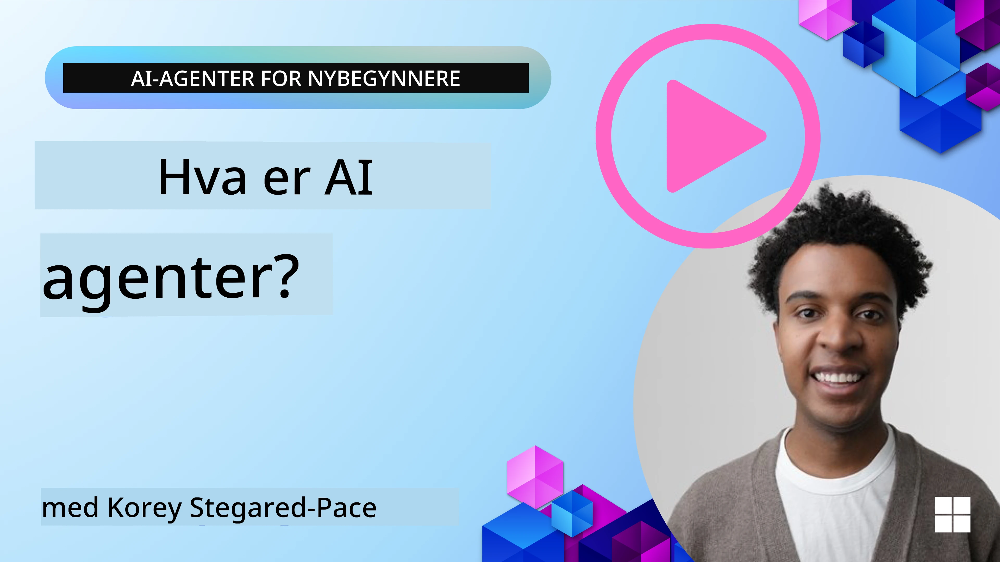
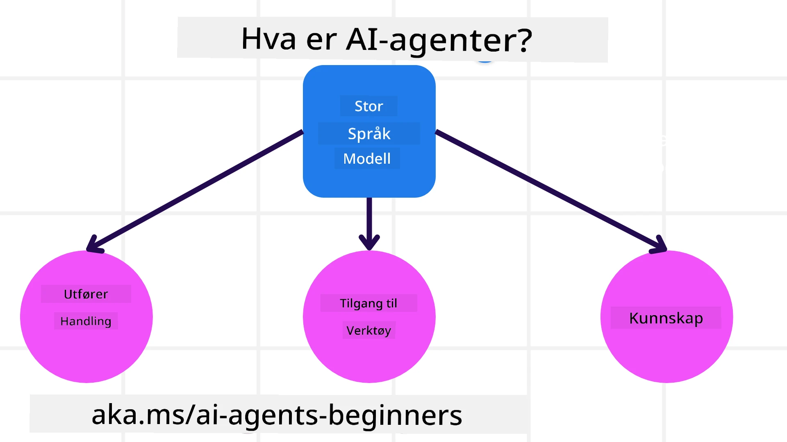
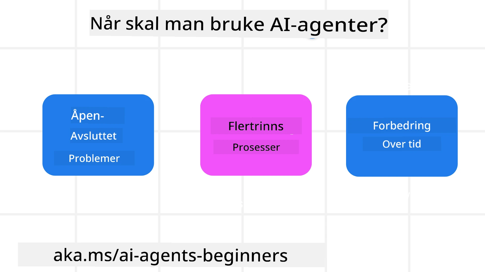

> _(Klikk på bildet over for å se video av denne leksjonen)_

# Introduksjon til AI-Agenter og brukstilfeller for agenter

Velkommen til kurset "AI Agents for Beginners"! Dette kurset gir grunnleggende kunnskap og praktiske eksempler for å bygge AI-agenter.

Bli med i <a href="https://discord.gg/kzRShWzttr" target="_blank">Azure AI Discord Community</a> for å møte andre lærende og AI-agentutviklere og stille spørsmål du har om dette kurset.

For å starte dette kurset begynner vi med å få en bedre forståelse av hva AI-agenter er og hvordan vi kan bruke dem i applikasjonene og arbeidsflytene vi bygger.

## Introduksjon

Denne leksjonen dekker:

- Hva er AI-agenter og hvilke forskjellige typer agenter finnes?
- Hvilke brukstilfeller passer best for AI-agenter og hvordan kan de hjelpe oss?
- Hva er noen av de grunnleggende byggeklossene når man designer agentiske løsninger?

## Læringsmål
Etter å ha fullført denne leksjonen skal du kunne:

- Forstå AI-agentkonsepter og hvordan de skiller seg fra andre AI-løsninger.
- Bruke AI-agenter mest effektivt.
- Designe agentiske løsninger produktivt for både brukere og kunder.

## Definisjon av AI-agenter og typer AI-agenter

### Hva er AI-agenter?

AI-agenter er **systemer** som gjør det mulig for **store språkmodeller (LLMs)** å **utføre handlinger** ved å utvide deres evner ved å gi LLMs **tilgang til verktøy** og **kunnskap**.

La oss bryte ned denne definisjonen i mindre deler:

- **System** – Det er viktig å tenke på agenter ikke bare som en enkelt komponent, men som et system av mange komponenter. På det grunnleggende planet er komponentene i en AI-agent:
  - **Miljø** – Det definerte rommet hvor AI-agenten opererer. For eksempel, hvis vi hadde en reisebestillingsagent, kunne miljøet være reisebestillingssystemet som AI-agenten bruker for å fullføre oppgaver.
  - **Sensorer** – Miljøer har informasjon og gir tilbakemelding. AI-agenter bruker sensorer for å samle inn og tolke denne informasjonen om den nåværende tilstanden i miljøet. I reisebestillingsagent-eksemplet kan reisebestillingssystemet gi informasjon som hotelltilgjengelighet eller flypriser.
  - **Aktuatorer** – Når AI-agenten mottar den nåværende tilstanden i miljøet, avgjør agenten for den aktuelle oppgaven hvilken handling som skal utføres for å endre miljøet. For reisebestillingsagenten kan det være å bestille et tilgjengelig rom for brukeren.

**Store språkmodeller** – Konseptet med agenter eksisterte før skapelsen av LLMs. Fordelen med å bygge AI-agenter med LLMs er deres evne til å tolke menneskelig språk og data. Denne evnen gjør at LLMs kan tolke miljøinformasjon og definere en plan for å endre miljøet.

**Utføre handlinger** – Utenfor AI-agent-systemer er LLMs begrenset til situasjoner der handlingen er å generere innhold eller informasjon basert på en brukers prompt. Innenfor AI-agent-systemer kan LLMs utføre oppgaver ved å tolke brukerens forespørsel og bruke verktøy som er tilgjengelige i deres miljø.

**Tilgang til verktøy** – Hvilke verktøy LLM har tilgang til er definert av 1) miljøet det opererer i, og 2) utvikleren av AI-agenten. For vårt reiseagent-eksempel er agentens verktøy begrenset til operasjonene som er tilgjengelige i bestillingssystemet, og/eller utvikleren kan begrense agentens verktøytillatelse til flyreiser.

**Minne+Kunnskap** – Minne kan være kortsiktig i konteksten av samtalen mellom bruker og agent. På lang sikt, utenfor informasjonen som miljøet gir, kan AI-agenter også hente kunnskap fra andre systemer, tjenester, verktøy og til og med andre agenter. I reiseagent-eksemplet kan denne kunnskapen være informasjonen om brukerens reisepreferanser som ligger i en kundedatabase.

### Ulike typer agenter

Nå som vi har en generell definisjon av AI-agenter, la oss se på noen spesifikke agenttyper og hvordan de vil bli brukt i en reisebestillings-AI-agent.

| **Agenttype**                 | **Beskrivelse**                                                                                                                       | **Eksempel**                                                                                                                                                                                                                   |
| ----------------------------- | ------------------------------------------------------------------------------------------------------------------------------------- | ----------------------------------------------------------------------------------------------------------------------------------------------------------------------------------------------------------------------------- |
| **Enkel refleksagent**        | Utfører umiddelbare handlinger basert på forhåndsdefinerte regler.                                                                  | Reiseagenten tolker konteksten i e-posten og videresender klager om reiser til kundeservice.                                                                                                                                  |
| **Modellbasert refleksagent** | Utfører handlinger basert på en modell av verden og endringer i denne modellen.                                                       | Reiseagenten prioriterer ruter med betydelige prisendringer basert på tilgang til historiske prisdata.                                                                                                                     |
| **Målbaserte agenter**        | Lager planer for å oppnå spesifikke mål ved å tolke målet og bestemme handlinger for å nå det.                                       | Reiseagenten bestiller en reise ved å bestemme nødvendige reisearrangementer (bil, kollektivtransport, fly) fra nåværende sted til destinasjonen.                                                                               |
| **Nyttebaserte agenter**      | Tar hensyn til preferanser og veier fordeler/tap numerisk for å avgjøre hvordan man skal oppnå mål.                                  | Reiseagenten maksimerer nytte ved å veie bekvemmelighet opp mot kostnad når reise bestilles.                                                                                                                                   |
| **Lærende agenter**           | Forbedrer seg over tid ved å svare på tilbakemeldinger og justere handlinger deretter.                                               | Reiseagenten forbedrer seg ved å bruke kundetilbakemeldinger fra etterreisundersøkelser for å gjøre justeringer for fremtidige bestillinger.                                                                                 |
| **Hierarkiske agenter**       | Har flere agenter i et nivåsystem, hvor agenter på høyere nivå deler oppgaver opp i deloppgaver som agenter på lavere nivå fullfører. | Reiseagenten kansellerer en tur ved å dele oppgaven i deloppgaver (for eksempel å kansellere spesifikke bestillinger) og la agenter på lavere nivå fullføre dem, med rapportering tilbake til agenten på høyere nivå.              |
| **Multi-agent systemer (MAS)**| Agenter fullfører oppgaver selvstendig, enten samarbeidende eller konkurrerende.                                                     | Samarbeid: Flere agenter bestiller spesifikke reisetjenester som hotell, fly og underholdning. Konkurranse: Flere agenter administrerer og konkurrerer om en delt hotellbestillingskalender for å booke kunder inn på hotellet. |

## Når skal man bruke AI-agenter

I forrige seksjon brukte vi reiseagent-brukstilfellet for å forklare hvordan de forskjellige typene agenter kan brukes i ulike scenarier for reisebestilling. Vi vil fortsette å bruke denne applikasjonen gjennom hele kurset.

La oss se på hvilke typer brukstilfeller AI-agenter egner seg best for:

- **Åpne problemer** – la LLM bestemme nødvendige steg for å fullføre en oppgave fordi det ikke alltid kan hardkodes i en arbeidsflyt.
- **Flertrinnsprosesser** – oppgaver som krever et nivå av kompleksitet der AI-agenten trenger å bruke verktøy eller informasjon over flere runder i stedet for kun en enkelt gjenfinning.  
- **Forbedring over tid** – oppgaver hvor agenten kan forbedre seg over tid ved å motta tilbakemelding fra enten sitt miljø eller brukere for å gi bedre nytte.

Vi dekker flere hensyn ved bruk av AI-agenter i leksjonen Building Trustworthy AI Agents.

## Grunnleggende om agentiske løsninger

### Agentutvikling

Det første steget i design av et AI-agent-system er å definere verktøy, handlinger og atferd. I dette kurset fokuserer vi på å bruke **Azure AI Agent Service** for å definere våre agenter. Den tilbyr funksjoner som:

- Valg av åpne modeller som OpenAI, Mistral og Llama
- Bruk av lisensiert data gjennom tilbydere som Tripadvisor
- Bruk av standardiserte OpenAPI 3.0-verktøy

### Agentiske mønstre

Kommunikasjon med LLMs skjer gjennom prompts. Gitt den semiautonome naturen til AI-agenter, er det ikke alltid mulig eller nødvendig å manuelt repromept LLMen etter en endring i miljøet. Vi bruker **agentiske mønstre** som lar oss prompt LLM over flere steg på en mer skalerbar måte.

Dette kurset er delt inn i noen av de nåværende populære agentiske mønstrene.

### Agentiske rammeverk

Agentiske rammeverk lar utviklere implementere agentiske mønstre gjennom kode. Disse rammeverkene tilbyr maler, plugins og verktøy for bedre AI-agent-samarbeid. Disse fordelene gir muligheter for bedre observasjon og feilsøking av AI-agent-systemer.

I dette kurset vil vi utforske Microsoft Agent Framework (MAF) for å bygge produksjonsklare AI-agenter.

## Eksempelkoder

- Python: [Agent Framework](./code_samples/01-python-agent-framework.ipynb)
- .NET: [Agent Framework](./code_samples/01-dotnet-agent-framework.md)

## Har du flere spørsmål om AI-agenter?

Bli med i [Microsoft Foundry Discord](https://aka.ms/ai-agents/discord) for å møte andre lærende, delta på kontortimer og få svar på dine spørsmål om AI-agenter.

## Forrige leksjon

[Course Setup](../00-course-setup/README.md)

## Neste leksjon

[Exploring Agentic Frameworks](../02-explore-agentic-frameworks/README.md)

---

<!-- CO-OP TRANSLATOR DISCLAIMER START -->
**Ansvarsfraskrivelse**:
Dette dokumentet er oversatt ved hjelp av AI-oversettelsestjenesten [Co-op Translator](https://github.com/Azure/co-op-translator). Selv om vi streber etter nøyaktighet, vennligst vær oppmerksom på at automatiserte oversettelser kan inneholde feil eller unøyaktigheter. Det opprinnelige dokumentet på dets morsmål skal betraktes som den autoritative kilden. For kritisk informasjon anbefales profesjonell menneskelig oversettelse. Vi er ikke ansvarlige for eventuelle misforståelser eller feiltolkninger som oppstår fra bruk av denne oversettelsen.
<!-- CO-OP TRANSLATOR DISCLAIMER END -->