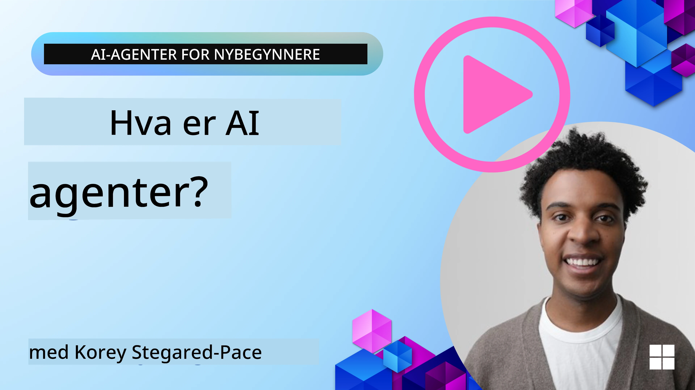
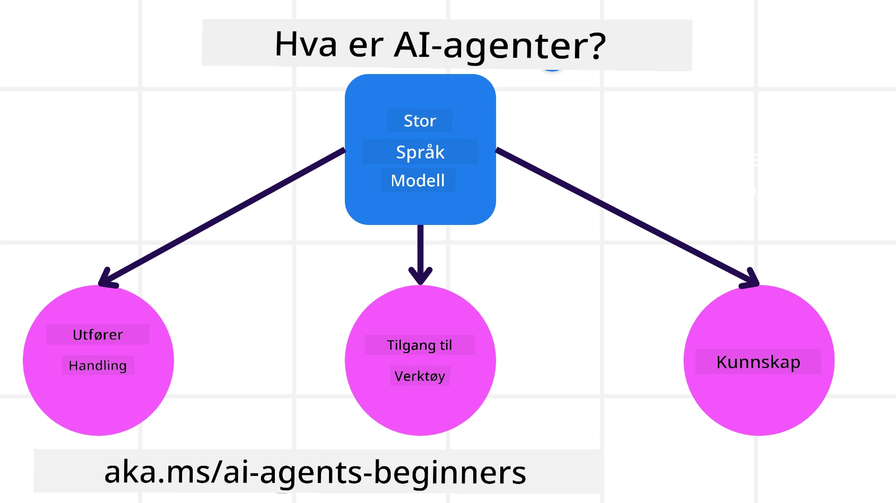
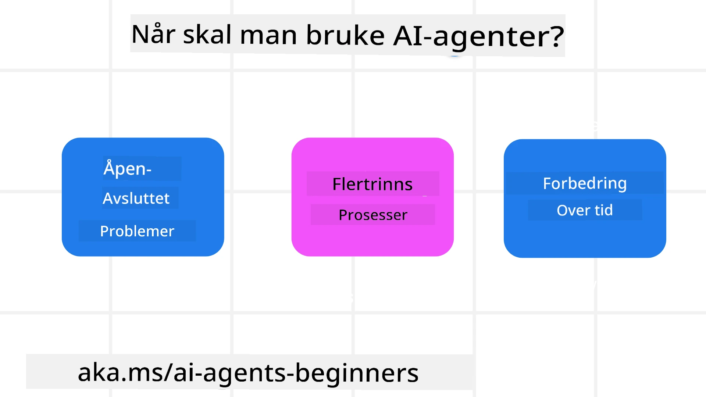

> _(Klikk på bildet ovenfor for å se videoen til denne leksjonen)_

# Introduksjon til AI-agenter og bruksområder for agenter

Velkommen til kurset **AI Agents for Beginners**! Dette kurset gir deg grunnleggende kunnskap — og ekte fungerende kode — for å begynne å bygge AI-agenter fra bunnen av.

Kom og si hei i <a href="https://discord.gg/kzRShWzttr" target="_blank">Azure AI Discord Community</a> — det er fullt av elever og AI-byggere som gjerne svarer på spørsmål.

Før vi hopper inn i byggingen, la oss sørge for at vi faktisk forstår hva en AI-agent *er* og når det gir mening å bruke en.

---

## Introduksjon

Denne leksjonen dekker:

- Hva AI-agenter er, og de forskjellige typene som finnes
- Hvilke typer oppgaver AI-agenter egner seg best for
- Kjernebyggesteinene du vil bruke når du designer en agent-løsning

## Læringsmål

Innen slutten av denne leksjonen skal du kunne:

- Forklare hva en AI-agent er og hvordan den skiller seg fra en vanlig AI-løsning
- Vite når du bør bruke en AI-agent (og når ikke)
- Skissere et grunnleggende design for en agent-løsning for et virkelighetsproblem

---

## Definere AI-agenter og typer AI-agenter

### Hva er AI-agenter?

Her er en enkel måte å tenke på det:

> **AI-agenter er systemer som lar store språkmodeller (LLMs) faktisk *gjøre ting* — ved å gi dem verktøy og kunnskap til å handle på verden, ikke bare svare på spørsmål.**

La oss gå nærmere inn på det:

- **System** — En AI-agent er ikke bare én ting. Det er en samling deler som jobber sammen. I kjernen har alle agenter tre deler:
  - **Miljø** — Rommet agenten opererer i. For en reisebestillingsagent ville dette være selve bestillingsplattformen.
  - **Sensorer** — Hvordan agenten leser den nåværende tilstanden i miljøet. Vår reiseagent kan sjekke hotelltilgjengelighet eller flypriser.
  - **Aktuatorer** — Hvordan agenten utfører handlinger. Reiseagenten kan bestille et rom, sende en bekreftelse eller kansellere en reservasjon.

- **Store språkmodeller** — Agenter fantes før LLM-er, men LLM-er er det som gjør moderne agenter så kraftige. De kan forstå naturlig språk, resonnere om kontekst og gjøre en vag brukerforespørsel om til en konkret handlingsplan.

- **Utføre handlinger** — Uten et agentsystem genererer en LLM bare tekst. Inne i et agentsystem kan LLM faktisk *utføre* steg — søke i en database, kalle en API, sende en melding.

- **Tilgang til verktøy** — Hvilke verktøy agenten kan bruke avhenger av (1) miljøet den kjører i og (2) hva utvikleren valgte å gi den. En reiseagent kan for eksempel søke flyreiser, men ikke redigere kunderegistre — det handler om hva du kobler til.

- **Hukommelse + kunnskap** — Agenter kan ha korttidsminne (den nåværende samtalen) og langtidsminne (en kundedatabase, tidligere interaksjoner). Reiseagenten kan "huske" at du foretrekker seter ved vinduet.

---

### De forskjellige typene AI-agenter

Ikke alle agenter er bygd likt. Her er en oversikt over hovedtypene, med en reisebestillingsagent som løpende eksempel:

| **Agenttype** | **Hva den gjør** | **Eksempel med reiseagent** |
|---|---|---|
| **Enkle refleksagenter** | Følger faste regler — ingen hukommelse, ingen planlegging. | Ser en klage-epost → videresender til kundeservice. Det er det. |
| **Modellbaserte refleksagenter** | Har en intern modell av verden og oppdaterer den mens ting endrer seg. | Følger historiske flypriser og varsler om ruter som plutselig blir dyre. |
| **Målbaserte agenter** | Har et mål og finner ut hvordan det nås steg for steg. | Bestiller en komplett tur (fly, bil, hotell) fra din nåværende posisjon til endelig destinasjon. |
| **Nyttebaserte agenter** | Finner ikke bare en løsning — finner *den beste* ved å veie fordeler og ulemper. | Balansere kostnad vs. bekvemmelighet for å finne turen som scorer høyest på dine preferanser. |
| **Lærende agenter** | Blir bedre over tid ved å lære fra tilbakemeldinger. | Justerer fremtidige booking-anbefalinger basert på spørreundersøkelser etter turen. |
| **Hierarkiske agenter** | En overordnet agent deler opp arbeid i deloppgaver og delegerer til lavere nivå agenter. | En "kanseller tur" forespørsel deles opp i: kanseller fly, kanseller hotell, kanseller leiebil — hver håndteres av en subagent. |
| **Multi-agent systemer (MAS)** | Flere uavhengige agenter som jobber sammen (eller konkurrerer). | Kooperativt: separate agenter håndterer hoteller, fly og underholdning. Konkurrerende: flere agenter konkurrerer om å fylle hotellrom til best pris. |

---

## Når du bør bruke AI-agenter

Bare fordi du *kan* bruke en AI-agent betyr ikke at du alltid *bør*. Her er situasjonene der agenter virkelig skinner:

- **Åpne problemer** — Når stegene for å løse et problem ikke kan forhåndsprogrammeres. Du trenger at LLM skjønner veien dynamisk.
- **Flerstegs prosesser** — Oppgaver som krever bruk av verktøy over flere omganger, ikke bare et enkelt oppslag eller generering.
- **Forbedring over tid** — Når du vil at systemet skal bli smartere basert på brukerfeedback eller miljøsignaler.

Vi går mer i dybden på når (og når *ikke*) man bør bruke AI-agenter i leksjonen **Building Trustworthy AI Agents** senere i kurset.

---

## Grunnleggende om agentløsninger

### Agentutvikling

Det første du gjør når du bygger en agent er å definere *hva den kan gjøre* — hvilke verktøy, handlinger og oppførsel den har.

I dette kurset bruker vi **Microsoft Foundry Agent Service** som hovedplattform. Den støtter:

- Modeller fra leverandører som OpenAI, Mistral og Meta (Llama)
- Lisensierte data fra leverandører som Tripadvisor
- Standardiserte OpenAPI 3.0 verktøydefinisjoner

### Agentmønstre

Du kommuniserer med LLM-er gjennom instruksjoner. Med agenter kan du ikke alltid håndlage hver eneste prompt manuelt — agenten må handle over mange steg. Der kommer **Agentmønstre** inn. De er gjenbrukbare strategier for å instruere og orkestrere LLM-er på en mer skalerbar og pålitelig måte.

Dette kurset er strukturert rundt de vanligste og mest nyttige agentmønstrene.

### Agentrammeverk

Agentrammeverk gir utviklere ferdiglagde maler, verktøy og infrastruktur for å bygge agenter. De gjør det enklere å:

- Koble til verktøy og funksjonalitet
- Observere hva agenten gjør (og feilsøke når det går galt)
- Samarbeide på tvers av flere agenter

I dette kurset fokuserer vi på **Microsoft Agent Framework (MAF)** for å bygge produksjonsklare agenter.

---

## Kodeeksempler

Klar til å se det i praksis? Her er kodeeksemplene for denne leksjonen:

- 🐍 Python: [Agent Framework](./code_samples/01-python-agent-framework.ipynb)
- 🔷 .NET: [Agent Framework](./code_samples/01-dotnet-agent-framework.md)

---

## Har du spørsmål?

Bli med i [Microsoft Foundry Discord](https://discord.com/invite/ATgtXmAS5D) for å koble deg til andre elever, delta på kontortimer, og få AI-agent-spørsmål besvart av fellesskapet.

---

## Forrige leksjon

[Oppsett av kurs](../00-course-setup/README.md)

## Neste leksjon

[Utforske agentrammeverk](../02-explore-agentic-frameworks/README.md)

---

<!-- CO-OP TRANSLATOR DISCLAIMER START -->
**Ansvarsfraskrivelse**:
Dette dokumentet er oversatt ved hjelp av AI-oversettelsestjenesten [Co-op Translator](https://github.com/Azure/co-op-translator). Selv om vi streber etter nøyaktighet, vær oppmerksom på at automatiske oversettelser kan inneholde feil eller unøyaktigheter. Det opprinnelige dokumentet på originalspråket skal betraktes som den autoritative kilden. For kritisk informasjon anbefales profesjonell menneskelig oversettelse. Vi er ikke ansvarlige for eventuelle misforståelser eller feiltolkninger som oppstår ved bruk av denne oversettelsen.
<!-- CO-OP TRANSLATOR DISCLAIMER END -->