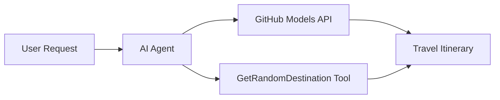

<!--
CO_OP_TRANSLATOR_METADATA:
{
  "original_hash": "23afd9be7b6ba5b69a44c3b6a78e07f6",
  "translation_date": "2025-11-06T10:04:49+00:00",
  "source_file": "01-intro-to-ai-agents/code_samples/01-dotnet-agent-framework.md",
  "language_code": "no"
}
-->
# 🌍 AI Reiseagent med Microsoft Agent Framework (.NET)

## 📋 Scenariooversikt

Denne notatboken viser hvordan man kan bygge en intelligent reiseplanleggingsagent ved hjelp av Microsoft Agent Framework for .NET. Agenten kan automatisk generere personlige dagsplaner for tilfeldige destinasjoner rundt om i verden.

**Hovedfunksjoner:**
- 🎲 **Tilfeldig destinasjonsvalg**: Bruker et tilpasset verktøy for å velge feriesteder
- 🗺️ **Intelligent reiseplanlegging**: Lager detaljerte dagsplaner
- 🔄 **Sanntidsstrømming**: Støtter både umiddelbare og strømmende svar
- 🛠️ **Integrasjon av tilpassede verktøy**: Viser hvordan man kan utvide agentens funksjonalitet

## 🔧 Teknisk arkitektur

### Kjerne-teknologier
- **Microsoft Agent Framework**: Nyeste .NET-implementering for utvikling av AI-agenter
- **GitHub Models-integrasjon**: Bruker GitHubs AI-modell for inferenstjenester
- **OpenAI API-kompatibilitet**: Utnytter OpenAI-klientbiblioteker med tilpassede endepunkter
- **Sikker konfigurasjon**: Miljøbasert API-nøkkelhåndtering

### Hovedkomponenter
1. **AIAgent**: Hovedagenten som styrer samtaleflyten
2. **Tilpassede verktøy**: `GetRandomDestination()`-funksjon tilgjengelig for agenten
3. **Chatklient**: Samtalegrensesnitt støttet av GitHub Models
4. **Strømmestøtte**: Sanntidsgenerering av svar

### Integrasjonsmønster


## 🚀 Komme i gang

**Forutsetninger:**
- .NET 10.0 eller nyere
- GitHub Models API-tilgangstoken
- Miljøvariabler konfigurert i `.env`-filen

**Nødvendige miljøvariabler:**
```env
GITHUB_TOKEN=your_github_token
GITHUB_ENDPOINT=https://models.inference.ai.azure.com
GITHUB_MODEL_ID=gpt-4o-mini
```

Kjør kodeeksempelet nedenfor i rekkefølge for å se reiseagenten i aksjon!

---

## .NET Enkeltfil-app: Eksempel på AI Reiseagent

Se `01-dotnet-agent-framework.cs` for den komplette kjørbare kodeprøven.

```bash
dotnet run 01-dotnet-agent-framework.cs
```

### Eksempelkode

```csharp
static string GetRandomDestination()
{
    var destinations = new List<string>
    {
        "Paris, France",
        "Tokyo, Japan",
        "New York City, USA",
        "Sydney, Australia",
        "Rome, Italy",
        "Barcelona, Spain",
        "Cape Town, South Africa",
        "Rio de Janeiro, Brazil",
        "Bangkok, Thailand",
        "Vancouver, Canada"
    };
    var random = new Random();
    int index = random.Next(destinations.Count);
    return destinations[index];
}

// Extract configuration from environment variables
var github_endpoint = Environment.GetEnvironmentVariable("GITHUB_ENDPOINT") ?? throw new InvalidOperationException("GITHUB_ENDPOINT is not set.");
var github_model_id = Environment.GetEnvironmentVariable("GITHUB_MODEL_ID") ?? "gpt-4o-mini";
var github_token = Environment.GetEnvironmentVariable("GITHUB_TOKEN") ?? throw new InvalidOperationException("GITHUB_TOKEN is not set.");

// Configure OpenAI Client Options
var openAIOptions = new OpenAIClientOptions()
{
    Endpoint = new Uri(github_endpoint)
};

// Initialize OpenAI Client with GitHub Models Configuration
var openAIClient = new OpenAIClient(new ApiKeyCredential(github_token), openAIOptions);

// Create AI Agent with Travel Planning Capabilities
AIAgent agent = openAIClient
    .GetChatClient(github_model_id)
    .CreateAIAgent(
        instructions: "You are a helpful AI Agent that can help plan vacations for customers at random destinations",
        tools: [AIFunctionFactory.Create(GetRandomDestination)]
    );

// Execute Agent: Plan a Day Trip (Non-Streaming)
Console.WriteLine(await agent.RunAsync("Plan me a day trip"));

// Execute Agent: Plan a Day Trip (Streaming Response)
await foreach (var update in agent.RunStreamingAsync("Plan me a day trip"))
{
    Console.Write(update);
}
```

---

**Ansvarsfraskrivelse**:  
Dette dokumentet er oversatt ved hjelp av AI-oversettelsestjenesten [Co-op Translator](https://github.com/Azure/co-op-translator). Selv om vi streber etter nøyaktighet, vær oppmerksom på at automatiserte oversettelser kan inneholde feil eller unøyaktigheter. Det originale dokumentet på sitt opprinnelige språk bør anses som den autoritative kilden. For kritisk informasjon anbefales profesjonell menneskelig oversettelse. Vi er ikke ansvarlige for eventuelle misforståelser eller feiltolkninger som oppstår ved bruk av denne oversettelsen.