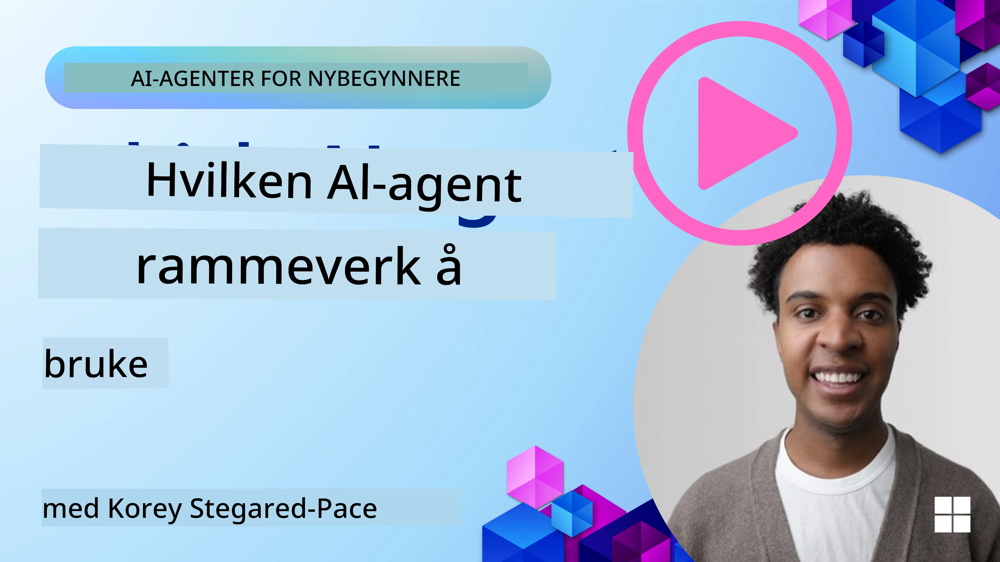

[](https://youtu.be/ODwF-EZo_O8?si=1xoy_B9RNQfrYdF7)

> _(Klikk på bildet over for å se video av denne leksjonen)_

# Utforsk AI Agent-rammeverk

AI agent-rammeverk er programvareplattformer designet for å forenkle oppretting, distribusjon og administrasjon av AI-agenter. Disse rammeverkene gir utviklere forhåndsbygde komponenter, abstraksjoner og verktøy som strømlinjeformer utviklingen av komplekse AI-systemer.

Disse rammeverkene hjelper utviklere med å fokusere på de unike aspektene ved deres applikasjoner ved å tilby standardiserte tilnærminger til vanlige utfordringer i utvikling av AI-agenter. De forbedrer skalerbarhet, tilgjengelighet og effektivitet i bygging av AI-systemer.

## Introduksjon

Denne leksjonen vil dekke:

- Hva er AI Agent-rammeverk, og hva gjør de det mulig for utviklere å oppnå?
- Hvordan kan team bruke disse for raskt å prototype, iterere og forbedre agentens kapabiliteter?
- Hva er forskjellene mellom rammeverkene og verktøyene laget av Microsoft (<a href="https://aka.ms/ai-agents-beginners/ai-agent-service" target="_blank">Azure AI Agent Service</a> og <a href="https://learn.microsoft.com/azure/ai-services/openai/how-to/responses" target="_blank">Microsoft Agent Framework</a>)?
- Kan jeg integrere mine eksisterende Azure-økosystemverktøy direkte, eller trenger jeg frittstående løsninger?
- Hva er Azure AI Agent Service, og hvordan hjelper dette meg?

## Læringsmål

Målene med denne leksjonen er å hjelpe deg med å forstå:

- Rollen til AI Agent-rammeverk i AI-utvikling.
- Hvordan utnytte AI Agent-rammeverk for å bygge intelligente agenter.
- Nøkkelfunksjoner som AI Agent-rammeverk muliggjør.
- Forskjellene mellom Microsoft Agent Framework og Azure AI Agent Service.

## Hva er AI Agent-rammeverk og hva gjør de det mulig for utviklere å gjøre?

Tradisjonelle AI-rammeverk kan hjelpe deg å integrere AI i dine apper og forbedre disse appene på følgende måter:

- **Personalisering**: AI kan analysere brukeradferd og preferanser for å tilby personlige anbefalinger, innhold og opplevelser.
Eksempel: Strømmetjenester som Netflix bruker AI for å foreslå filmer og serier basert på seerhistorikk, noe som øker brukerengasjement og tilfredshet.
- **Automatisering og effektivitet**: AI kan automatisere repeterende oppgaver, strømlinjeforme arbeidsprosesser og forbedre operasjonell effektivitet.
Eksempel: Kundeserviceapper bruker AI-drevne chatboter for å håndtere vanlige henvendelser, redusere svartid og frigjøre menneskelige agenter til mer komplekse saker.
- **Bedre brukeropplevelse**: AI kan forbedre den totale brukeropplevelsen ved å tilby intelligente funksjoner som talekjennelse, naturlig språkbehandling og prediktiv tekst.
Eksempel: Virtuelle assistenter som Siri og Google Assistant bruker AI for å forstå og svare på talekommandoer, noe som gjør det enklere for brukere å samhandle med enhetene sine.

### Det høres jo bra ut, så hvorfor trenger vi AI Agent-rammeverket?

AI Agent-rammeverk representerer noe mer enn bare AI-rammeverk. De er designet for å muliggjøre opprettelsen av intelligente agenter som kan samhandle med brukere, andre agenter og miljøet for å oppnå spesifikke mål. Disse agentene kan utvise autonom oppførsel, ta beslutninger og tilpasse seg endrede forhold. La oss se på noen nøkkelfunksjoner som AI Agent-rammeverk muliggjør:

- **Agent-samarbeid og koordinering**: Tilrettelegger for opprettelse av flere AI-agenter som kan samarbeide, kommunisere og koordinere for å løse komplekse oppgaver.
- **Automatisering og oppgavehåndtering**: Gir mekanismer for automatisering av flertrinns arbeidsflyter, oppgavedeling og dynamisk oppgavehåndtering blant agenter.
- **Kontekstuell forståelse og tilpasning**: Utstyrer agenter med evne til å forstå kontekst, tilpasse seg skiftende miljøer og ta beslutninger basert på sanntidsinformasjon.

Kort oppsummert lar agenter deg gjøre mer, ta automatisering til neste nivå, og skape mer intelligente systemer som kan tilpasse seg og lære av sitt miljø.

## Hvordan raskt prototype, iterere og forbedre agentens kapabiliteter?

Dette er et raskt bevegende landskap, men det finnes noen felles trekk i de fleste AI Agent-rammeverk som kan hjelpe deg med rask prototyping og iterasjon, nemlig modulære komponenter, samarbeidsverktøy og sanntidslæring. La oss gå gjennom disse:

- **Bruk modulære komponenter**: AI SDK-er tilbyr forhåndsbygde komponenter som AI- og minnekoblinger, funksjonskall ved hjelp av naturlig språk eller kode-plugins, promptmaler med mer.
- **Utnytt samarbeidsverktøy**: Design agenter med spesifikke roller og oppgaver, som lar dem teste og forbedre samarbeidsflyter.
- **Lær i sanntid**: Implementer tilbakemeldingssløyfer hvor agenter lærer av interaksjoner og justerer sin atferd dynamisk.

### Bruk modulære komponenter

SDK-er som Microsoft Agent Framework tilbyr forhåndsbygde komponenter som AI-koblinger, verktøydefinisjoner og agentadministrasjon.

**Hvordan team kan bruke disse**: Team kan raskt sette sammen disse komponentene for å lage en funksjonell prototype uten å starte fra bunnen av, noe som muliggjør rask eksperimentering og iterasjon.

**Hvordan det fungerer i praksis**: Du kan bruke en ferdigbygd parser for å trekke ut informasjon fra brukerinput, en minnemodul for å lagre og hente data, og en promptgenerator for å interagere med brukere, alt uten å måtte bygge komponentene fra bunnen.

**Eksempelkode**. La oss se på et eksempel på hvordan du kan bruke Microsoft Agent Framework med `AzureAIProjectAgentProvider` for å få modellen til å svare på brukerinput med verktøykall:

``` python
# Microsoft Agent Framework Python-eksempel

import asyncio
import os
from typing import Annotated

from agent_framework.azure import AzureAIProjectAgentProvider
from azure.identity import AzureCliCredential


# Definer en eksempelverktøyfunksjon for å bestille reiser
def book_flight(date: str, location: str) -> str:
    """Book travel given location and date."""
    return f"Travel was booked to {location} on {date}"


async def main():
    provider = AzureAIProjectAgentProvider(credential=AzureCliCredential())
    agent = await provider.create_agent(
        name="travel_agent",
        instructions="Help the user book travel. Use the book_flight tool when ready.",
        tools=[book_flight],
    )

    response = await agent.run("I'd like to go to New York on January 1, 2025")
    print(response)
    # Eksempelutdata: Flyet ditt til New York den 1. januar 2025 har blitt bestilt. God tur! ✈️🗽


if __name__ == "__main__":
    asyncio.run(main())
```

Det du ser i dette eksempelet er hvordan du kan bruke en ferdigbygd parser for å trekke ut nøkkelinformasjon fra brukerinput, som opprinnelse, destinasjon og dato for en flybestilling. Denne modulære tilnærmingen lar deg fokusere på den overordnede logikken.

### Utnytt samarbeidsverktøy

Rammeverk som Microsoft Agent Framework muliggjør opprettelse av flere agenter som kan jobbe sammen.

**Hvordan team kan bruke disse**: Team kan designe agenter med spesifikke roller og oppgaver, slik at de kan teste og forbedre samarbeidsflyter og øke systemets helhetlige effektivitet.

**Hvordan det fungerer i praksis**: Du kan opprette et team av agenter hvor hver agent har en spesialisert funksjon, som datainnhenting, analyse eller beslutningstaking. Disse agentene kan kommunisere og dele informasjon for å oppnå et felles mål, som å besvare en brukerspørsmål eller fullføre en oppgave.

**Eksempelkode (Microsoft Agent Framework)**:

```python
# Opprette flere agenter som jobber sammen ved hjelp av Microsoft Agent-rammeverket

import os
from agent_framework.azure import AzureAIProjectAgentProvider
from azure.identity import AzureCliCredential

provider = AzureAIProjectAgentProvider(credential=AzureCliCredential())

# Agent for datahenting
agent_retrieve = await provider.create_agent(
    name="dataretrieval",
    instructions="Retrieve relevant data using available tools.",
    tools=[retrieve_tool],
)

# Agent for dataanalyse
agent_analyze = await provider.create_agent(
    name="dataanalysis",
    instructions="Analyze the retrieved data and provide insights.",
    tools=[analyze_tool],
)

# Kjør agenter i rekkefølge på en oppgave
retrieval_result = await agent_retrieve.run("Retrieve sales data for Q4")
analysis_result = await agent_analyze.run(f"Analyze this data: {retrieval_result}")
print(analysis_result)
```

Det du ser i koden over, er hvordan du kan lage en oppgave som involverer flere agenter som arbeider sammen for å analysere data. Hver agent utfører en spesifikk funksjon, og oppgaven gjennomføres ved å koordinere agentene for å oppnå ønsket resultat. Ved å lage dedikerte agenter med spesialiserte roller kan du forbedre oppgavens effektivitet og ytelse.

### Lær i sanntid

Avanserte rammeverk tilbyr kapabiliteter for sanntids forståelse av kontekst og tilpasning.

**Hvordan team kan bruke disse**: Team kan implementere tilbakemeldingssløyfer hvor agenter lærer av interaksjoner og tilpasser sin atferd dynamisk, noe som gir kontinuerlig forbedring og finjustering av kapabiliteter.

**Hvordan det fungerer i praksis**: Agenter kan analysere brukertilbakemeldinger, miljødata og oppgaveutfall for å oppdatere kunnskapsgrunnlaget, justere beslutningsalgoritmer og forbedre ytelsen over tid. Denne iterative læringsprosessen gjør det mulig for agenter å tilpasse seg endrede forhold og brukerpreferanser, og øker systemets samlede effektivitet.

## Hva er forskjellene mellom Microsoft Agent Framework og Azure AI Agent Service?

Det er mange måter å sammenligne disse tilnærmingene på, men la oss se på noen nøkkelforskjeller når det gjelder design, kapabiliteter og målrettede brukstilfeller:

## Microsoft Agent Framework (MAF)

Microsoft Agent Framework tilbyr et strømlinjeformet SDK for å bygge AI-agenter med `AzureAIProjectAgentProvider`. Det gjør det mulig for utviklere å lage agenter som benytter Azure OpenAI-modeller med innebygd verktøykall, samtalestyring og bedriftsgradert sikkerhet gjennom Azure-identitet.

**Brukstilfeller**: Bygge produksjonsklare AI-agenter med verktøybruk, flertrinns arbeidsflyter og scenarier for bedriftsintegrasjon.

Her er noen viktige kjernebegreper for Microsoft Agent Framework:

- **Agenter**. En agent opprettes via `AzureAIProjectAgentProvider` og konfigureres med navn, instruksjoner og verktøy. Agenten kan:
  - **Behandle brukermeldinger** og lage svar ved hjelp av Azure OpenAI-modeller.
  - **Kalle verktøy** automatisk basert på samtalekontekst.
  - **Opprettholde samtalestatus** over flere interaksjoner.

  Her er et kodesnutt som viser hvordan man oppretter en agent:

    ```python
    import os
    from agent_framework.azure import AzureAIProjectAgentProvider
    from azure.identity import AzureCliCredential

    provider = AzureAIProjectAgentProvider(credential=AzureCliCredential())
    agent = await provider.create_agent(
        name="my_agent",
        instructions="You are a helpful assistant.",
    )

    response = await agent.run("Hello, World!")
    print(response)
    ```

- **Verktøy**. Rammeverket støtter definering av verktøy som Python-funksjoner som agenten kan kalle automatisk. Verktøy registreres ved oppretting av agenten:

    ```python
    def get_weather(location: str) -> str:
        """Get the current weather for a location."""
        return f"The weather in {location} is sunny, 72\u00b0F."

    agent = await provider.create_agent(
        name="weather_agent",
        instructions="Help users check the weather.",
        tools=[get_weather],
    )
    ```

- **Multi-agent koordinering**. Du kan opprette flere agenter med forskjellige spesialiseringer og koordinere deres arbeid:

    ```python
    planner = await provider.create_agent(
        name="planner",
        instructions="Break down complex tasks into steps.",
    )

    executor = await provider.create_agent(
        name="executor",
        instructions="Execute the planned steps using available tools.",
        tools=[execute_tool],
    )

    plan = await planner.run("Plan a trip to Paris")
    result = await executor.run(f"Execute this plan: {plan}")
    ```

- **Azure identitetsintegrasjon**. Rammeverket bruker `AzureCliCredential` (eller `DefaultAzureCredential`) for sikker, nøkkelfri autentisering, og eliminerer behovet for direkte håndtering av API-nøkler.

## Azure AI Agent Service

Azure AI Agent Service er en nyere tjeneste, introdusert på Microsoft Ignite 2024. Den muliggjør utvikling og distribusjon av AI-agenter med mer fleksible modeller, som direkte kalling av open-source LLM-er som Llama 3, Mistral og Cohere.

Azure AI Agent Service tilbyr sterkere sikkerhetsmekanismer og datalagringsmetoder for bedriftsbruk, noe som gjør den egnet for bedriftsapplikasjoner.

Den fungerer ut-av-boksen sammen med Microsoft Agent Framework for bygging og distribusjon av agenter.

Tjenesten er for øyeblikket i Public Preview og støtter Python og C# for bygging av agenter.

Med Azure AI Agent Service Python SDK kan vi lage en agent med et brukerdefinert verktøy:

```python
import asyncio
from azure.identity import DefaultAzureCredential
from azure.ai.projects import AIProjectClient

# Definer verktøyfunksjoner
def get_specials() -> str:
    """Provides a list of specials from the menu."""
    return """
    Special Soup: Clam Chowder
    Special Salad: Cobb Salad
    Special Drink: Chai Tea
    """

def get_item_price(menu_item: str) -> str:
    """Provides the price of the requested menu item."""
    return "$9.99"


async def main() -> None:
    credential = DefaultAzureCredential()
    project_client = AIProjectClient.from_connection_string(
        credential=credential,
        conn_str="your-connection-string",
    )

    agent = project_client.agents.create_agent(
        model="gpt-4o-mini",
        name="Host",
        instructions="Answer questions about the menu.",
        tools=[get_specials, get_item_price],
    )

    thread = project_client.agents.create_thread()

    user_inputs = [
        "Hello",
        "What is the special soup?",
        "How much does that cost?",
        "Thank you",
    ]

    for user_input in user_inputs:
        print(f"# User: '{user_input}'")
        message = project_client.agents.create_message(
            thread_id=thread.id,
            role="user",
            content=user_input,
        )
        run = project_client.agents.create_and_process_run(
            thread_id=thread.id, agent_id=agent.id
        )
        messages = project_client.agents.list_messages(thread_id=thread.id)
        print(f"# Agent: {messages.data[0].content[0].text.value}")


if __name__ == "__main__":
    asyncio.run(main())
```

### Kjernebegreper

Azure AI Agent Service inkluderer følgende kjernebegreper:

- **Agent**. Azure AI Agent Service integreres med Microsoft Foundry. Innen AI Foundry fungerer en AI Agent som en «smart» mikrotjeneste som kan brukes til å svare på spørsmål (RAG), utføre handlinger eller fullstendig automatisere arbeidsflyter. Den oppnår dette ved å kombinere generativ AI-modellers kraft med verktøy som lar den få tilgang til og samhandle med virkelige datakilder. Her er et eksempel på en agent:

    ```python
    agent = project_client.agents.create_agent(
        model="gpt-4o-mini",
        name="my-agent",
        instructions="You are helpful agent",
        tools=code_interpreter.definitions,
        tool_resources=code_interpreter.resources,
    )
    ```

    I dette eksempelet opprettes en agent med modellen `gpt-4o-mini`, navnet `my-agent` og instruksjonen `You are helpful agent`. Agenten er utstyrt med verktøy og ressurser for å utføre kodefortolkning.

- **Tråd og meldinger**. Tråden er et annet viktig begrep. Den representerer en samtale eller interaksjon mellom en agent og en bruker. Tråder kan brukes til å spore fremdrift i en samtale, lagre kontekstinformasjon og håndtere tilstanden i interaksjonen. Her er et eksempel på en tråd:

    ```python
    thread = project_client.agents.create_thread()
    message = project_client.agents.create_message(
        thread_id=thread.id,
        role="user",
        content="Could you please create a bar chart for the operating profit using the following data and provide the file to me? Company A: $1.2 million, Company B: $2.5 million, Company C: $3.0 million, Company D: $1.8 million",
    )
    
    # Ask the agent to perform work on the thread
    run = project_client.agents.create_and_process_run(thread_id=thread.id, agent_id=agent.id)
    
    # Fetch and log all messages to see the agent's response
    messages = project_client.agents.list_messages(thread_id=thread.id)
    print(f"Messages: {messages}")
    ```

    I koden over opprettes en tråd. Deretter sendes en melding til tråden. Ved å kalle `create_and_process_run` blir agenten bedt om å utføre arbeid i tråden. Til slutt hentes og logges meldingene for å se agentens respons. Meldingene indikerer fremdriften i samtalen mellom bruker og agent. Det er også viktig å forstå at meldingene kan være av forskjellige typer som tekst, bilde eller fil, det vil si at agentens arbeid har resultert i for eksempel et bilde eller et tekstsvar. Som utvikler kan du bruke denne informasjonen til videre behandling av svaret eller presentere det for brukeren.

- **Integreres med Microsoft Agent Framework**. Azure AI Agent Service fungerer sømløst med Microsoft Agent Framework, noe som betyr at du kan bygge agenter med `AzureAIProjectAgentProvider` og distribuere dem gjennom Agent Service for produksjonsscenarier.

**Brukstilfeller**: Azure AI Agent Service er designet for bedriftsapplikasjoner som krever sikker, skalerbar og fleksibel distribusjon av AI-agenter.

## Hva er forskjellen mellom disse tilnærmingene?

Det kan høres ut som det er overlapp, men det er noen viktige forskjeller i design, kapabiliteter og målbrukstilfeller:

- **Microsoft Agent Framework (MAF)**: Er et produksjonsklart SDK for å bygge AI-agenter. Det tilbyr et strømlinjeformet API for å lage agenter med verktøykall, samtalestyring og Azure-identitetsintegrasjon.
- **Azure AI Agent Service**: Er en plattform og distribusjonstjeneste i Azure Foundry for agenter. Den tilbyr innebygd tilkobling til tjenester som Azure OpenAI, Azure AI Search, Bing Search og kodekjøring.

Usikker på hvilken du bør velge?

### Brukstilfeller

La oss se om vi kan hjelpe deg ved å gå gjennom noen vanlige brukstilfeller:

> Q: Jeg bygger produksjonsklare AI-agentapplikasjoner og ønsker å komme i gang raskt

> A: Microsoft Agent Framework er et godt valg. Det tilbyr et enkelt, Python-aktig API via `AzureAIProjectAgentProvider` som lar deg definere agenter med verktøy og instruksjoner på få linjer med kode.

> Q: Jeg trenger bedriftsgradert distribusjon med Azure-integrasjoner som Søk og kodekjøring

> A: Azure AI Agent Service er best egnet. Det er en plattformtjeneste som tilbyr innebygde kapabiliteter for flere modeller, Azure AI Search, Bing Search og Azure Functions. Den gjør det enkelt å bygge agentene dine i Foundry-portalen og distribuere dem i stor skala.

> Q: Jeg er fortsatt usikker, gi meg bare ett valg

> A: Start med Microsoft Agent Framework for å bygge agentene dine, og bruk deretter Azure AI Agent Service når du trenger å distribuere og skalere dem i produksjon. Denne tilnærmingen lar deg iterere raskt på agentlogikken samtidig som du har en klar vei til bedriftsdistribusjon.

La oss oppsummere nøkkelforskjellene i en tabell:

| Rammeverk                    | Fokus                                  | Kjernebegreper                  | Brukstilfeller                           |
|-----------------------------|---------------------------------------|--------------------------------|-----------------------------------------|
| Microsoft Agent Framework    | Strømlinjeformet agent-SDK med verktøykall | Agenter, Verktøy, Azure-identitet | Bygge AI-agenter, verktøybruk, flertrinns arbeidsflyter |
| Azure AI Agent Service       | Fleksible modeller, bedriftsikkerhet, kodegenerering, verktøykall | Modularitet, Samarbeid, Prosessorkestrering | Sikker, skalerbar og fleksibel distribusjon av AI-agenter |

## Kan jeg integrere mine eksisterende Azure-økosystemverktøy direkte, eller trenger jeg frittstående løsninger?
Svaret er ja, du kan integrere dine eksisterende verktøy i Azure-økosystemet direkte med Azure AI Agent Service spesielt, da det er bygget for å fungere sømløst med andre Azure-tjenester. Du kan for eksempel integrere Bing, Azure AI Search og Azure Functions. Det finnes også dyp integrasjon med Microsoft Foundry.

Microsoft Agent Framework integreres også med Azure-tjenester gjennom `AzureAIProjectAgentProvider` og Azure-identitet, noe som lar deg kalle Azure-tjenester direkte fra agentverktøyene dine.

## Sample Codes

- Python: [Agent Framework](./code_samples/02-python-agent-framework.ipynb)
- .NET: [Agent Framework](./code_samples/02-dotnet-agent-framework.md)

## Got More Questions about AI Agent Frameworks?

Join the [Microsoft Foundry Discord](https://aka.ms/ai-agents/discord) to meet with other learners, attend office hours and get your AI Agents questions answered.

## References

- <a href="https://techcommunity.microsoft.com/blog/azure-ai-services-blog/introducing-azure-ai-agent-service/4298357" target="_blank">Azure Agent Service</a>
- <a href="https://learn.microsoft.com/azure/ai-services/openai/how-to/responses" target="_blank">Microsoft Agent Framework - Azure OpenAI Responses</a>
- <a href="https://learn.microsoft.com/azure/ai-services/agents/overview" target="_blank">Azure AI Agent service</a>

## Previous Lesson

[Introduction to AI Agents and Agent Use Cases](../01-intro-to-ai-agents/README.md)

## Next Lesson

[Understanding Agentic Design Patterns](../03-agentic-design-patterns/README.md)

---

<!-- CO-OP TRANSLATOR DISCLAIMER START -->
**Ansvarsfraskrivelse**:
Dette dokumentet er oversatt ved hjelp av AI-oversettelsestjenesten [Co-op Translator](https://github.com/Azure/co-op-translator). Selv om vi streber etter nøyaktighet, vennligst vær oppmerksom på at automatiserte oversettelser kan inneholde feil eller unøyaktigheter. Det originale dokumentet på dets opprinnelige språk skal anses som den autoritative kilden. For kritisk informasjon anbefales profesjonell menneskelig oversettelse. Vi er ikke ansvarlige for eventuelle misforståelser eller feiltolkninger som oppstår ved bruk av denne oversettelsen.
<!-- CO-OP TRANSLATOR DISCLAIMER END -->