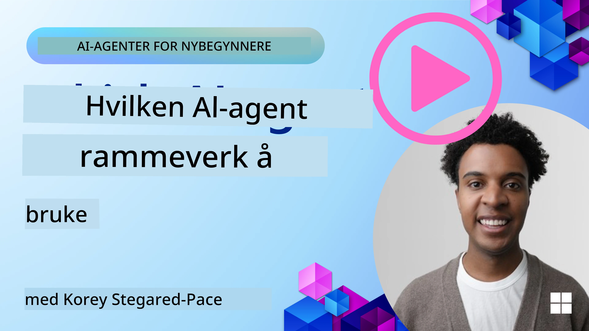

[](https://youtu.be/ODwF-EZo_O8?si=1xoy_B9RNQfrYdF7)

> _(Klikk på bildet over for å se video av denne leksjonen)_

# Utforsk AI-agentrammeverk

AI-agentrammeverk er programvareplattformer designet for å forenkle opprettelsen, distribusjonen og administrasjonen av AI-agenter. Disse rammeverkene gir utviklere forhåndsbygde komponenter, abstraksjoner og verktøy som effektiviserer utviklingen av komplekse AI-systemer.

Disse rammeverkene hjelper utviklere med å fokusere på de unike aspektene ved deres applikasjoner ved å tilby standardiserte tilnærminger til vanlige utfordringer i AI-agentutvikling. De forbedrer skalerbarhet, tilgjengelighet og effektivitet i byggingen av AI-systemer.

## Introduksjon

Denne leksjonen vil dekke:

- Hva er AI-agentrammeverk og hva gjør de mulig for utviklere å oppnå?
- Hvordan kan team bruke disse til raskt å prototype, iterere og forbedre agentens evner?
- Hva er forskjellene mellom rammeverkene og verktøyene laget av Microsoft (<a href="https://aka.ms/ai-agents-beginners/ai-agent-service" target="_blank">Azure AI Agent Service</a> og <a href="https://learn.microsoft.com/azure/ai-services/openai/how-to/responses" target="_blank">Microsoft Agent Framework</a>)?
- Kan jeg integrere mine eksisterende Azure-økosystemverktøy direkte, eller trenger jeg frittstående løsninger?
- Hva er Azure AI Agents-tjenesten og hvordan hjelper den meg?

## Læringsmål

Målene med denne leksjonen er å hjelpe deg å forstå:

- Rollen til AI-agentrammeverk i AI-utvikling.
- Hvordan utnytte AI-agentrammeverk for å bygge intelligente agenter.
- Nøkkelfunksjoner muliggjort av AI-agentrammeverk.
- Forskjellene mellom Microsoft Agent Framework og Azure AI Agent Service.

## Hva er AI-agentrammeverk og hva gjør de mulig for utviklere?

Tradisjonelle AI-rammeverk kan hjelpe deg med å integrere AI i appene dine og gjøre disse appene bedre på følgende måter:

- **Personalisering**: AI kan analysere brukeradferd og preferanser for å gi personlige anbefalinger, innhold og opplevelser.
Eksempel: Strømmetjenester som Netflix bruker AI for å foreslå filmer og serier basert på seerhistorikk, noe som øker brukerengasjement og tilfredshet.
- **Automatisering og effektivitet**: AI kan automatisere repeterende oppgaver, strømlinjeforme arbeidsflyter og forbedre operasjonell effektivitet.
Eksempel: Kundeserviceapper bruker AI-drevne chatboter for å håndtere vanlige henvendelser, redusere responstider og frigjøre menneskelige agenter til mer komplekse saker.
- **Forbedret brukeropplevelse**: AI kan forbedre den totale brukeropplevelsen ved å tilby intelligente funksjoner som talegjenkjenning, naturlig språkbehandling og prediktiv tekst.
Eksempel: Virtuelle assistenter som Siri og Google Assistant bruker AI for å forstå og svare på talekommandoer, noe som gjør det enklere for brukerne å samhandle med enhetene sine.

### Alt dette høres jo flott ut, så hvorfor trenger vi AI-agentrammeverket?

AI-agentrammeverk representerer noe mer enn bare AI-rammeverk. De er designet for å muliggjøre opprettelsen av intelligente agenter som kan samhandle med brukere, andre agenter og miljøet for å oppnå bestemte mål. Disse agentene kan vise autonom atferd, ta beslutninger og tilpasse seg endrede forhold. La oss se på noen nøkkelfunksjoner muliggjort av AI-agentrammeverk:

- **Agent-samarbeid og koordinering**: Muliggjør opprettelsen av flere AI-agenter som kan arbeide sammen, kommunisere og koordinere for å løse komplekse oppgaver.
- **Automatisering og oppgavehåndtering**: Tilbyr mekanismer for å automatisere flertrinns arbeidsflyter, oppgavedeling og dynamisk oppgavehåndtering mellom agenter.
- **Kontekstuell forståelse og tilpasning**: Utstyrer agenter med evnen til å forstå kontekst, tilpasse seg endrende omgivelser og ta beslutninger basert på sanntidsinformasjon.

Oppsummert lar agenter deg gjøre mer, ta automatisering til neste nivå, og skape mer intelligente systemer som kan tilpasse seg og lære fra miljøet sitt.

## Hvordan raskt prototype, iterere og forbedre agentens evner?

Dette er et landskap i rask utvikling, men det finnes noen elementer som er felles på tvers av de fleste AI-agentrammeverk som kan hjelpe deg å prototype raskt og iterere, nemlig modulære komponenter, samarbeidsverktøy og læring i sanntid. La oss gå nærmere inn på disse:

- **Bruk modulære komponenter**: AI-SDK-er tilbyr forhåndsbygde komponenter som AI- og minnekoblinger, funksjonskalling ved bruk av naturlig språk eller kode-plugins, prompt-maler, og mer.
- **Utnytt samarbeidsverktøy**: Design agenter med spesifikke roller og oppgaver, noe som gjør dem i stand til å teste og forbedre samarbeidsflyter.
- **Lær i sanntid**: Implementer tilbakemeldingssløyfer der agenter lærer av interaksjoner og justerer sin atferd dynamisk.

### Bruk modulære komponenter

SDK-er som Microsoft Agent Framework tilbyr forhåndsbygde komponenter som AI-koblinger, verktøydefinisjoner og agentadministrasjon.

**Hvordan team kan bruke disse**: Team kan raskt sette sammen disse komponentene for å lage en funksjonell prototype uten å starte fra bunnen, noe som åpner for rask eksperimentering og iterasjon.

**Hvordan det fungerer i praksis**: Du kan bruke en forhåndsbygd parser til å trekke ut informasjon fra brukerinput, en minnemodul for lagring og henting av data, og en prompt-generator for å samhandle med brukere, alt uten å måtte bygge disse komponentene fra bunnen av.

**Eksempelkode**. La oss se på et eksempel på hvordan du kan bruke Microsoft Agent Framework med `AzureAIProjectAgentProvider` for å få modellen til å svare på brukerinput med verktøykalling:

``` python
# Microsoft Agent Framework Python-eksempel

import asyncio
import os
from typing import Annotated

from agent_framework.azure import AzureAIProjectAgentProvider
from azure.identity import AzureCliCredential


# Definer en eksempelverktøyfunksjon for å bestille reise
def book_flight(date: str, location: str) -> str:
    """Book travel given location and date."""
    return f"Travel was booked to {location} on {date}"


async def main():
    provider = AzureAIProjectAgentProvider(credential=AzureCliCredential())
    agent = await provider.create_agent(
        name="travel_agent",
        instructions="Help the user book travel. Use the book_flight tool when ready.",
        tools=[book_flight],
    )

    response = await agent.run("I'd like to go to New York on January 1, 2025")
    print(response)
    # Eksempelutgang: Din flyreise til New York 1. januar 2025 er bestilt. God reise! ✈️🗽


if __name__ == "__main__":
    asyncio.run(main())
```

Det du kan se fra dette eksempelet er hvordan du kan utnytte en forhåndsbygd parser til å trekke ut nøkkelinformasjon fra brukerinput, slik som opprinnelse, destinasjon og dato for en flybestillingsforespørsel. Denne modulære tilnærmingen lar deg fokusere på den overordnede logikken.

### Utnytt samarbeidsverktøy

Rammeverk som Microsoft Agent Framework legger til rette for opprettelsen av flere agenter som kan samarbeide.

**Hvordan team kan bruke disse**: Team kan designe agenter med spesifikke roller og oppgaver, noe som gjør dem i stand til å teste og forbedre samarbeidsflyter og heve den totale systemeffektiviteten.

**Hvordan det fungerer i praksis**: Du kan lage et team av agenter hvor hver agent har en spesialisert funksjon, som datainnhenting, analyse eller beslutningstaking. Disse agentene kan kommunisere og dele informasjon for å oppnå et felles mål, som å svare på en brukerspørsmål eller fullføre en oppgave.

**Eksempelkode (Microsoft Agent Framework)**:

```python
# Oppretter flere agenter som samarbeider ved bruk av Microsoft Agent Framework

import os
from agent_framework.azure import AzureAIProjectAgentProvider
from azure.identity import AzureCliCredential

provider = AzureAIProjectAgentProvider(credential=AzureCliCredential())

# Datainnhentingsagent
agent_retrieve = await provider.create_agent(
    name="dataretrieval",
    instructions="Retrieve relevant data using available tools.",
    tools=[retrieve_tool],
)

# Dataanalyseagent
agent_analyze = await provider.create_agent(
    name="dataanalysis",
    instructions="Analyze the retrieved data and provide insights.",
    tools=[analyze_tool],
)

# Kjør agenter sekvensielt på en oppgave
retrieval_result = await agent_retrieve.run("Retrieve sales data for Q4")
analysis_result = await agent_analyze.run(f"Analyze this data: {retrieval_result}")
print(analysis_result)
```

Det du ser i den forrige koden er hvordan du kan opprette en oppgave som involverer flere agenter som samarbeider om å analysere data. Hver agent utfører en spesifikk funksjon, og oppgaven utføres ved å koordinere agentene for å oppnå ønsket resultat. Ved å opprette dedikerte agenter med spesialiserte roller, kan du forbedre oppgaveeffektivitet og ytelse.

### Lær i sanntid

Avanserte rammeverk tilbyr funksjoner for sanntids kontekstforståelse og tilpasning.

**Hvordan team kan bruke disse**: Team kan implementere tilbakemeldingssløyfer der agenter lærer av interaksjoner og justerer sin atferd dynamisk, noe som fører til kontinuerlig forbedring og raffinering av evnene.

**Hvordan det fungerer i praksis**: Agenter kan analysere brukertilbakemeldinger, miljødata og oppgaveutfall for å oppdatere kunnskapsbasen sin, justere beslutningsalgoritmer og forbedre ytelsen over tid. Denne iterative læringsprosessen gjør det mulig for agenter å tilpasse seg skiftende forhold og brukerpreferanser, noe som øker den totale systemeffektiviteten.

## Hva er forskjellene mellom Microsoft Agent Framework og Azure AI Agent Service?

Det finnes mange måter å sammenligne disse tilnærmingene på, men la oss se på noen nøkkelforskjeller når det gjelder design, funksjonalitet og målrettede bruksområder:

## Microsoft Agent Framework (MAF)

Microsoft Agent Framework gir en strømlinjeformet SDK for å bygge AI-agenter med `AzureAIProjectAgentProvider`. Det gjør utviklere i stand til å lage agenter som bruker Azure OpenAI-modeller med innebygd verktøykalling, samtalestyring og sikkerhet på bedriftsnivå gjennom Azure-identitet.

**Bruksområder**: Å bygge produksjonsklare AI-agenter med verktøybruk, flertrinns arbeidsflyter og integrasjonsscenarier for bedrifter.

Her er noen viktige kjernebegreper i Microsoft Agent Framework:

- **Agenter**. En agent opprettes via `AzureAIProjectAgentProvider` og konfigureres med navn, instruksjoner og verktøy. Agenten kan:
  - **Behandle brukermeldinger** og generere svar ved hjelp av Azure OpenAI-modeller.
  - **Kalle verktøy** automatisk basert på samtalekontekst.
  - **Opprettholde samtaletilstand** over flere interaksjoner.

  Her er et kodeeksempel som viser hvordan man kan opprette en agent:

    ```python
    import os
    from agent_framework.azure import AzureAIProjectAgentProvider
    from azure.identity import AzureCliCredential

    provider = AzureAIProjectAgentProvider(credential=AzureCliCredential())
    agent = await provider.create_agent(
        name="my_agent",
        instructions="You are a helpful assistant.",
    )

    response = await agent.run("Hello, World!")
    print(response)
    ```

- **Verktøy**. Rammeverket støtter definering av verktøy som Python-funksjoner som agenten kan kalle automatisk. Verktøy registreres ved oppretting av agenten:

    ```python
    def get_weather(location: str) -> str:
        """Get the current weather for a location."""
        return f"The weather in {location} is sunny, 72\u00b0F."

    agent = await provider.create_agent(
        name="weather_agent",
        instructions="Help users check the weather.",
        tools=[get_weather],
    )
    ```

- **Koordinering av flere agenter**. Du kan opprette flere agenter med ulike spesialiseringer og koordinere arbeidet deres:

    ```python
    planner = await provider.create_agent(
        name="planner",
        instructions="Break down complex tasks into steps.",
    )

    executor = await provider.create_agent(
        name="executor",
        instructions="Execute the planned steps using available tools.",
        tools=[execute_tool],
    )

    plan = await planner.run("Plan a trip to Paris")
    result = await executor.run(f"Execute this plan: {plan}")
    ```

- **Integrering med Azure-identitet**. Rammeverket bruker `AzureCliCredential` (eller `DefaultAzureCredential`) for sikker, nøkkelfri autentisering, noe som eliminerer behovet for å håndtere API-nøkler direkte.

## Azure AI Agent Service

Azure AI Agent Service er et nyere tillegg, introdusert på Microsoft Ignite 2024. Den tillater utvikling og distribusjon av AI-agenter med mer fleksible modeller, som for eksempel å direkte kalle åpen kildekode LLM-er som Llama 3, Mistral og Cohere.

Azure AI Agent Service tilbyr sterkere sikkerhetsmekanismer for bedriftsmarkedet og datalagringsmetoder, noe som gjør den egnet for bedriftsapplikasjoner.

Den fungerer ut av boksen med Microsoft Agent Framework for bygging og distribusjon av agenter.

Denne tjenesten er for øyeblikket i offentlig forhåndsvisning og støtter Python og C# for bygging av agenter.

Ved å bruke Azure AI Agent Service Python SDK kan vi lage en agent med et brukerdefinert verktøy:

```python
import asyncio
from azure.identity import DefaultAzureCredential
from azure.ai.projects import AIProjectClient

# Definer verktøyfunksjoner
def get_specials() -> str:
    """Provides a list of specials from the menu."""
    return """
    Special Soup: Clam Chowder
    Special Salad: Cobb Salad
    Special Drink: Chai Tea
    """

def get_item_price(menu_item: str) -> str:
    """Provides the price of the requested menu item."""
    return "$9.99"


async def main() -> None:
    credential = DefaultAzureCredential()
    project_client = AIProjectClient.from_connection_string(
        credential=credential,
        conn_str="your-connection-string",
    )

    agent = project_client.agents.create_agent(
        model="gpt-4o-mini",
        name="Host",
        instructions="Answer questions about the menu.",
        tools=[get_specials, get_item_price],
    )

    thread = project_client.agents.create_thread()

    user_inputs = [
        "Hello",
        "What is the special soup?",
        "How much does that cost?",
        "Thank you",
    ]

    for user_input in user_inputs:
        print(f"# User: '{user_input}'")
        message = project_client.agents.create_message(
            thread_id=thread.id,
            role="user",
            content=user_input,
        )
        run = project_client.agents.create_and_process_run(
            thread_id=thread.id, agent_id=agent.id
        )
        messages = project_client.agents.list_messages(thread_id=thread.id)
        print(f"# Agent: {messages.data[0].content[0].text.value}")


if __name__ == "__main__":
    asyncio.run(main())
```

### Kjernebegreper

Azure AI Agent Service har følgende kjernebegreper:

- **Agent**. Azure AI Agent Service integreres med Microsoft Foundry. Innen AI Foundry fungerer en AI-agent som en "smart" mikrotjeneste som kan brukes til å svare på spørsmål (RAG), utføre handlinger eller fullstendig automatisere arbeidsflyter. Dette oppnås ved å kombinere kraften fra generative AI-modeller med verktøy som gir tilgang til og interaksjon med datakilder i den virkelige verden. Her er et eksempel på en agent:

    ```python
    agent = project_client.agents.create_agent(
        model="gpt-4o-mini",
        name="my-agent",
        instructions="You are helpful agent",
        tools=code_interpreter.definitions,
        tool_resources=code_interpreter.resources,
    )
    ```

    I dette eksemplet opprettes en agent med modellen `gpt-4o-mini`, navnet `my-agent` og instruksjoner `You are helpful agent`. Agenten er utstyrt med verktøy og ressurser for å utføre kodeinterpreting.

- **Tråd og meldinger**. Tråden er et annet viktig begrep. Den representerer en samtale eller interaksjon mellom en agent og en bruker. Tråder kan brukes til å spore fremgangen i en samtale, lagre kontekstinformasjon og administrere tilstanden i interaksjonen. Her er et eksempel på en tråd:

    ```python
    thread = project_client.agents.create_thread()
    message = project_client.agents.create_message(
        thread_id=thread.id,
        role="user",
        content="Could you please create a bar chart for the operating profit using the following data and provide the file to me? Company A: $1.2 million, Company B: $2.5 million, Company C: $3.0 million, Company D: $1.8 million",
    )
    
    # Be agenten om å utføre arbeid på tråden
    run = project_client.agents.create_and_process_run(thread_id=thread.id, agent_id=agent.id)
    
    # Hent og logg alle meldinger for å se agentens svar
    messages = project_client.agents.list_messages(thread_id=thread.id)
    print(f"Messages: {messages}")
    ```

    I den forrige koden opprettes det en tråd. Deretter sendes en melding til tråden. Ved å kalle `create_and_process_run` blir agenten bedt om å utføre arbeid på tråden. Til slutt hentes meldingene og logges for å se responsen fra agenten. Meldingene indikerer fremgangen i samtalen mellom brukeren og agenten. Det er også viktig å forstå at meldingene kan være av forskjellige typer, som tekst, bilde eller fil, altså at agentens arbeid har resultert i for eksempel et bilde eller en tekstrespons. Som utvikler kan du da bruke denne informasjonen for videre behandling av responsen eller presentere den for brukeren.

- **Integreres med Microsoft Agent Framework**. Azure AI Agent Service fungerer sømløst med Microsoft Agent Framework, noe som betyr at du kan bygge agenter ved hjelp av `AzureAIProjectAgentProvider` og distribuere dem gjennom Agent Service for produksjonsscenarioer.

**Bruksområder**: Azure AI Agent Service er designet for bedriftsapplikasjoner som krever sikker, skalerbar og fleksibel distribusjon av AI-agenter.

## Hva er forskjellen mellom disse tilnærmingene?

Det kan høres ut som det er overlapp, men det finnes noen nøkkelforskjeller når det gjelder design, funksjonalitet og målrettede bruksområder:

- **Microsoft Agent Framework (MAF)**: Er en produksjonsklar SDK for å bygge AI-agenter. Den tilbyr en strømlinjeformet API for å lage agenter med verktøykalling, samtalestyring og integrering av Azure-identitet.
- **Azure AI Agent Service**: Er en plattform- og distribusjonstjeneste i Azure Foundry for agenter. Den tilbyr innebygd tilkobling til tjenester som Azure OpenAI, Azure AI Search, Bing Search og kodeutførelse.

Er du fortsatt usikker på hvilken du skal velge?

### Bruksområder

La oss se om vi kan hjelpe deg ved å gå gjennom noen vanlige bruksområder:

> Q: Jeg bygger produksjonsklare AI-agentapplikasjoner og vil komme raskt i gang
>

> A: Microsoft Agent Framework er et godt valg. Den tilbyr et enkelt og Python-vennlig API via `AzureAIProjectAgentProvider` som lar deg definere agenter med verktøy og instruksjoner på bare noen få kodelinjer.

> Q: Jeg trenger bedriftsklassifisert distribusjon med Azure-integrasjoner som Search og kodeutførelse
>
> A: Azure AI Agent Service passer best. Det er en plattformtjeneste som tilbyr innebygde funksjoner for flere modeller, Azure AI Search, Bing Search og Azure Functions. Det gjør det enkelt å bygge agentene dine i Foundry Portal og distribuere dem i stor skala.

> Q: Jeg er fortsatt forvirret, gi meg bare ett alternativ
>
> A: Start med Microsoft Agent Framework for å bygge agentene dine, og bruk deretter Azure AI Agent Service når du trenger å distribuere og skalere dem i produksjon. Denne tilnærmingen lar deg iterere raskt på agentlogikken samtidig som du har en klar vei til bedriftsdistribusjon.

La oss oppsummere nøkkelforskjellene i en tabell:

| Framework | Fokus | Kjernebegreper | Bruksområder |
| --- | --- | --- | --- |
| Microsoft Agent Framework | Strømlinjeformet agent-SDK med verktøykalling | Agenter, Verktøy, Azure-identitet | Bygge AI-agenter, verktøybruk, flertrinns arbeidsflyter |
| Azure AI Agent Service | Fleksible modeller, bedriftsikkerhet, kodegenerering, verktøykalling | Modularitet, samarbeid, prosessorientering | Sikker, skalerbar og fleksibel distribusjon av AI-agenter |

## Kan jeg integrere mine eksisterende Azure-økosystemverktøy direkte, eller trenger jeg frittstående løsninger?
Svaret er ja, du kan integrere dine eksisterende Azure-økosystemverktøy direkte med Azure AI Agent Service spesielt, ettersom det er bygd for å fungere sømløst med andre Azure-tjenester. Du kan for eksempel integrere Bing, Azure AI Search og Azure Functions. Det er også dyp integrasjon med Microsoft Foundry.

Microsoft Agent Framework integreres også med Azure-tjenester gjennom `AzureAIProjectAgentProvider` og Azure-identitet, noe som lar deg kalle Azure-tjenester direkte fra agentverktøyene dine.

## Sample Codes

- Python: [Agent Framework](./code_samples/02-python-agent-framework.ipynb)
- .NET: [Agent Framework](./code_samples/02-dotnet-agent-framework.md)

## Har du flere spørsmål om AI Agent Frameworks?

Bli med i [Microsoft Foundry Discord](https://discord.com/invite/ATgtXmAS5D) for å møte andre som lærer, delta på kontortimer og få svar på dine spørsmål om AI-agenter.

## Referanser

- <a href="https://techcommunity.microsoft.com/blog/azure-ai-services-blog/introducing-azure-ai-agent-service/4298357" target="_blank">Azure Agent Service</a>
- <a href="https://learn.microsoft.com/azure/ai-services/openai/how-to/responses" target="_blank">Microsoft Agent Framework - Azure OpenAI Responses</a>
- <a href="https://learn.microsoft.com/azure/ai-services/agents/overview" target="_blank">Azure AI Agent service</a>

## Forrige leksjon

[Introduksjon til AI-agenter og agent-brukstilfeller](../01-intro-to-ai-agents/README.md)

## Neste leksjon

[Forstå agentiske designmønstre](../03-agentic-design-patterns/README.md)

---

<!-- CO-OP TRANSLATOR DISCLAIMER START -->
**Ansvarsfraskrivelse**:
Dette dokumentet er oversatt ved hjelp av AI-oversettelsestjenesten [Co-op Translator](https://github.com/Azure/co-op-translator). Selv om vi streber etter nøyaktighet, vær oppmerksom på at automatiske oversettelser kan inneholde feil eller unøyaktigheter. Det opprinnelige dokumentet på originalspråket skal betraktes som den autoritative kilden. For kritisk informasjon anbefales profesjonell menneskelig oversettelse. Vi er ikke ansvarlige for eventuelle misforståelser eller feiltolkninger som oppstår ved bruk av denne oversettelsen.
<!-- CO-OP TRANSLATOR DISCLAIMER END -->