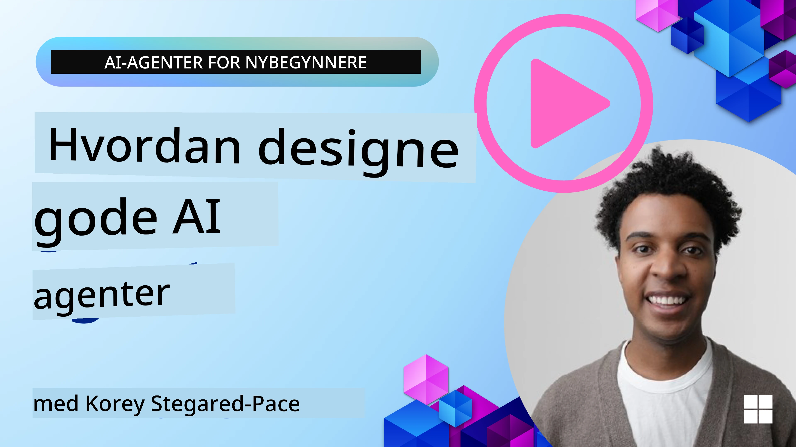
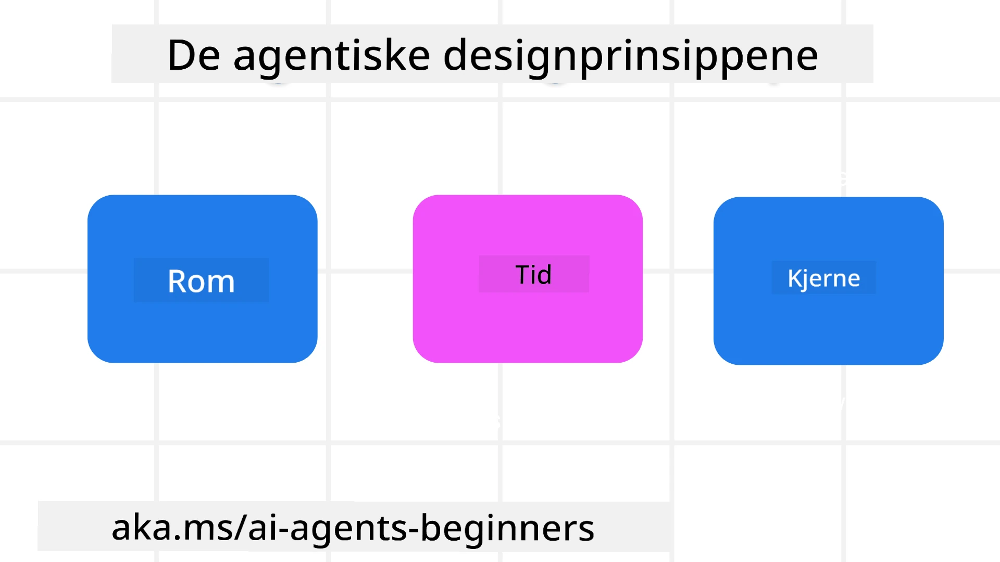

> _(Klikk på bildet over for å se video av denne leksjonen)_
# AI-agentiske designprinsipper

## Introduksjon

Det finnes mange måter å tenke på bygging av AI-agentiske systemer. Siden tvetydighet er en egenskap og ikke en feil i generativ AI-design, kan det noen ganger være vanskelig for ingeniører å finne ut hvor de skal begynne. Vi har laget et sett med brukersentrerte UX-designprinsipper for å gjøre det mulig for utviklere å bygge kundesentrerte agentiske systemer for å løse deres forretningsbehov. Disse designprinsippene er ikke en foreskrivende arkitektur, men heller et utgangspunkt for team som definerer og bygger ut agentopplevelser.

Generelt bør agenter:

- Utvide og skalere menneskelige evner (idémyldring, problemløsning, automatisering, osv.)
- Fylle kunnskapshull (komme meg opp i fart på kunnskapsområder, oversettelse, osv.)
- Legge til rette for og støtte samarbeid på de måtene vi som individer foretrekker å samarbeide med andre på
- Gjøre oss til bedre versjoner av oss selv (f.eks. livscoach/oppgavedriver, hjelpe oss å lære emosjonell regulering og mindfulness-ferdigheter, bygge motstandsdyktighet, osv.)

## Denne leksjonen vil dekke

- Hva de agentiske designprinsippene er
- Hvilke retningslinjer man bør følge når man implementerer disse designprinsippene
- Noen eksempler på bruk av designprinsippene

## Læringsmål

Etter å ha fullført denne leksjonen vil du kunne:

1. Forklare hva de agentiske designprinsippene er
2. Forklare retningslinjene for bruk av de agentiske designprinsippene
3. Forstå hvordan man bygger en agent med de agentiske designprinsippene

## De agentiske designprinsippene

### Agent (rom)

Dette er miljøet som agenten opererer i. Disse prinsippene veileder hvordan vi designer agenter for å engasjere seg i fysiske og digitale verdener.

- **Koble sammen, ikke sammenbrudd** – hjelpe med å koble mennesker til andre mennesker, hendelser og handlingsbar kunnskap for å muliggjøre samarbeid og tilknytning.
- Agenter hjelper med å knytte sammen hendelser, kunnskap og mennesker.
- Agenter bringer mennesker nærmere hverandre. De er ikke designet for å erstatte eller bagatellisere mennesker.
- **Enkelt tilgjengelig, men av og til usynlig** – agenten opererer i stor grad i bakgrunnen og gir oss kun et lite dytt når det er relevant og hensiktsmessig.
  - Agenten er lett å finne og tilgjengelig for autoriserte brukere på hvilken som helst enhet eller plattform.
  - Agenten støtter multimodale inn- og utdata (lyd, stemme, tekst, osv.).
  - Agenten kan sømløst bytte mellom forgrunn og bakgrunn; mellom proaktiv og reaktiv, avhengig av hvordan den oppfatter brukerens behov.
  - Agenten kan operere i usynlig form, men dens bakgrunnsprosessbane og samarbeid med andre agenter er gjennomsiktig og kontrollerbar for brukeren.

### Agent (tid)

Dette er hvordan agenten opererer over tid. Disse prinsippene veileder hvordan vi designer agenter som interagerer på tvers av fortid, nåtid og framtid.

- **Fortid**: Reflektere over historie som inkluderer både tilstand og kontekst.
  - Agenten gir mer relevante resultater basert på analyse av rikere historiske data utover bare hendelsen, mennesker eller tilstander.
  - Agenten skaper forbindelser fra tidligere hendelser og reflekterer aktivt over minner for å engasjere seg i nåværende situasjoner.
- **Nå**: Dytter mer enn bare varsler.
  - Agenten inkorporerer en helhetlig tilnærming for samhandling med mennesker. Når en hendelse skjer, går agenten utover statisk varsel eller annen formell statisk kommunikasjon. Agenten kan forenkle prosesser eller dynamisk generere signaler for å trekke brukerens oppmerksomhet på riktig tidspunkt.
  - Agenten leverer informasjon basert på konteksten i miljøet, sosiale og kulturelle endringer, og tilpasset brukerens intensjon.
  - Agentens interaksjon kan være gradvis, utviklende/komplekserende for å styrke brukeren over tid.
- **Framtid**: Tilpasser seg og utvikler seg.
  - Agenten tilpasser seg ulike enheter, plattformer og modaliteter.
  - Agenten tilpasser seg brukerens atferd, tilgjengelighetsbehov, og er fritt tilpassbar.
  - Agenten formes av og utvikler seg gjennom kontinuerlig brukerinteraksjon.

### Agent (kjerne)

Dette er de sentrale elementene i kjernen av agentens design.

- **Omfavn usikkerhet, men etabler tillit**.
  - Et visst nivå av usikkerhet i agenten er forventet. Usikkerhet er et nøkkel-element i agentdesign.
  - Tillit og gjennomsiktighet er grunnleggende lag i agentdesign.
  - Mennesker har kontroll over når agenten er på/av og agentens status er tydelig synlig til enhver tid.

## Retningslinjene for å implementere disse prinsippene

Når du bruker de forrige designprinsippene, benytt følgende retningslinjer:

1. **Gjennomsiktighet**: Informer brukeren om at AI er involvert, hvordan det fungerer (inkludert tidligere handlinger), og hvordan gi tilbakemelding og endre systemet.
2. **Kontroll**: Gi brukeren mulighet til å tilpasse, spesifisere preferanser og personliggjøre, og ha kontroll over systemet og dets attributter (inkludert mulighet til å glemme).
3. **Konsistens**: Sikre konsistente, multimodale opplevelser på tvers av enheter og endepunkter. Bruk kjente UI/UX-elementer der det er mulig (f.eks. mikrofonikon for stemmeinteraksjon) og redusér brukerens kognitive belastning så mye som mulig (f.eks. konsise svar, visuelle hjelpemidler og «Lær mer»-innhold).

## Hvordan designe en reiseagent med disse prinsippene og retningslinjene

Tenk deg at du designer en Reiseagent, slik kan du tenke om bruk av designprinsippene og retningslinjene:

1. **Gjennomsiktighet** – La brukeren vite at Reiseagenten er en AI-aktivert agent. Gi noen grunnleggende instruksjoner for å komme i gang (f.eks. en «Hei»-melding, eksempelpåmeldinger). Dokumenter dette tydelig på produktsiden. Vis listen over spørsmål brukeren har stilt tidligere. Gjør det tydelig hvordan man gir tilbakemelding (tommel opp og ned, Send tilbakemelding-knapp osv.). Fortell klart om agenten har bruks- eller temarestriksjoner.
2. **Kontroll** – Sørg for at det er tydelig hvordan brukeren kan endre agenten etter at den er opprettet med ting som System Prompt. Gi brukeren mulighet til å velge hvor detaljert agenten skal være, dens skrivestil og eventuelle forbehold om hva agenten ikke skal snakke om. La brukeren se og slette tilknyttede filer eller data, prompt og tidligere samtaler.
3. **Konsistens** – Sørg for at ikonene for Del prompt, legge til fil eller bilde og tagge noen eller noe er standard og gjenkjennelige. Bruk bindersikon for å indikere filopplasting/deling med agenten, og bildeikon for opplasting av grafikk.

## Eksempelkode

- Python: [Agent Framework](./code_samples/03-python-agent-framework.ipynb)
- .NET: [Agent Framework](./code_samples/03-dotnet-agent-framework.md)

## Flere spørsmål om AI-agentiske designmønstre?

Bli med i [Microsoft Foundry Discord](https://discord.com/invite/ATgtXmAS5D) for å møte andre lærende, delta på kontortid og få svar på dine spørsmål om AI-agenter.

## Ekstra ressurser

- <a href="https://openai.com" target="_blank">Praksis for styring av agentiske AI-systemer | OpenAI</a>
- <a href="https://microsoft.com" target="_blank">The HAX Toolkit Project - Microsoft Research</a>
- <a href="https://responsibleaitoolbox.ai" target="_blank">Responsible AI Toolbox</a>

## Forrige leksjon

[Explore Agentic Frameworks](../02-explore-agentic-frameworks/README.md)

## Neste leksjon

[Tool Use Design Pattern](../04-tool-use/README.md)

---

<!-- CO-OP TRANSLATOR DISCLAIMER START -->
**Ansvarsfraskrivelse**:
Dette dokumentet er oversatt ved hjelp av AI-oversettelsestjenesten [Co-op Translator](https://github.com/Azure/co-op-translator). Selv om vi streber etter nøyaktighet, vær oppmerksom på at automatiske oversettelser kan inneholde feil eller unøyaktigheter. Det opprinnelige dokumentet på originalspråket skal betraktes som den autoritative kilden. For kritisk informasjon anbefales profesjonell menneskelig oversettelse. Vi er ikke ansvarlige for eventuelle misforståelser eller feiltolkninger som oppstår ved bruk av denne oversettelsen.
<!-- CO-OP TRANSLATOR DISCLAIMER END -->