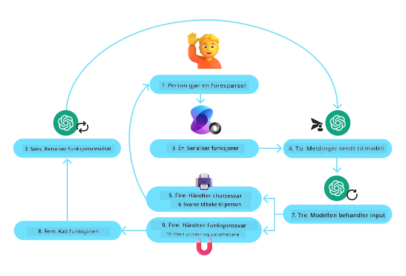
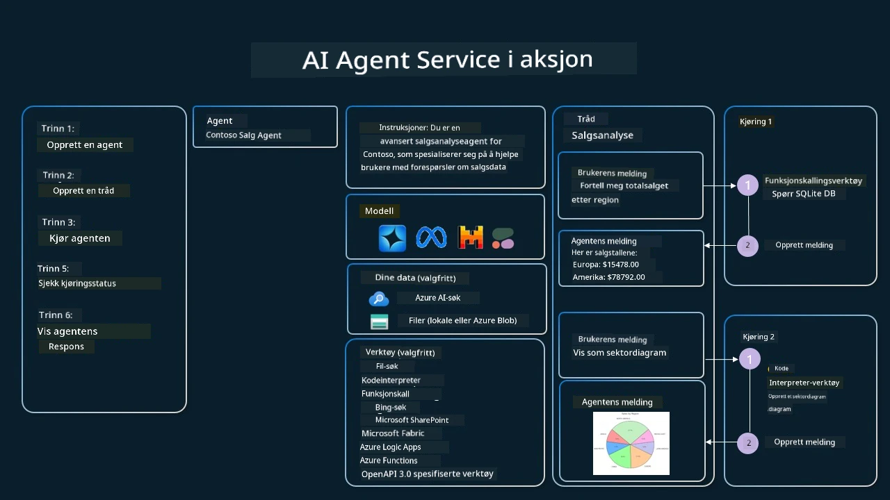

[](https://youtu.be/vieRiPRx-gI?si=cEZ8ApnT6Sus9rhn)

> _(Klikk på bildet ovenfor for å se videoen av denne leksjonen)_

# Designmønster for verktøybruk

Verktøy er interessante fordi de gir AI-agenter et bredere spekter av funksjonalitet. I stedet for at agenten har et begrenset sett med handlinger den kan utføre, kan den ved å legge til et verktøy utføre en rekke handlinger. I dette kapitlet ser vi på Designmønsteret for verktøybruk, som beskriver hvordan AI-agenter kan bruke spesifikke verktøy for å nå sine mål.

## Introduksjon

I denne leksjonen ønsker vi å svare på følgende spørsmål:

- Hva er designmønsteret for verktøybruk?
- Hvilke bruksområder kan det anvendes på?
- Hvilke elementer/byggesteiner trengs for å implementere designmønsteret?
- Hvilke spesielle hensyn må tas for å bruke designmønsteret for verktøybruk for å bygge pålitelige AI-agenter?

## Læringsmål

Etter å ha fullført denne leksjonen vil du kunne:

- Definere designmønsteret for verktøybruk og dets formål.
- Identifisere bruksområder hvor designmønsteret for verktøybruk er anvendelig.
- Forstå nøklelementene som trengs for å implementere designmønsteret.
- Gjenkjenne hensyn for å sikre pålitelighet i AI-agenter som bruker dette designmønsteret.

## Hva er designmønsteret for verktøybruk?

Designmønsteret for verktøybruk fokuserer på å gi LLM-er mulighet til å samhandle med eksterne verktøy for å oppnå spesifikke mål. Verktøy er kode som kan kjøres av en agent for å utføre handlinger. Et verktøy kan være en enkel funksjon som en kalkulator, eller et API-kall til en tredjepartstjeneste som aksjeprissøk eller værmelding. I konteksten av AI-agenter er verktøy designet for å bli kjørt av agenter som svar på modellgenererte funksjonsanrop.

## Hvilke bruksområder kan det anvendes på?

AI-agenter kan utnytte verktøy for å fullføre komplekse oppgaver, hente informasjon eller ta beslutninger. Designmønsteret for verktøybruk brukes ofte i scenarier som krever dynamisk interaksjon med eksterne systemer, som databaser, webtjenester eller kodeinterpretere. Denne evnen er nyttig for en rekke ulike bruksområder, inkludert:

- **Dynamisk informasjonsinnhenting:** Agenter kan spørre eksterne API-er eller databaser for å hente oppdatert data (f.eks. spørre en SQLite-database for dataanalyse, hente aksjepriser eller værinformasjon).
- **Kodekjøring og -tolkning:** Agenter kan kjøre kode eller skript for å løse matematiske problemer, generere rapporter eller utføre simuleringer.
- **Automatisering av arbeidsflyter:** Automatisering av repeterende eller flertrinns arbeidsflyter ved å integrere verktøy som oppgaveplanleggere, e-posttjenester eller datapipelines.
- **Kundesupport:** Agenter kan samhandle med CRM-systemer, billettplattformer eller kunnskapsbaser for å løse brukerhenvendelser.
- **Innholdsgenerering og redigering:** Agenter kan bruke verktøy som grammatikkontroll, tekstoppsummering eller innholdssikkerhetsvurderere for å bistå med innholdsoppgaver.

## Hvilke elementer/byggesteiner trengs for å implementere designmønsteret for verktøybruk?

Disse byggesteinene gjør det mulig for AI-agenten å utføre et bredt spekter av oppgaver. La oss se på nøklelementene som trengs for å implementere designmønsteret for verktøybruk:

- **Funksjon-/verktøyskjemaer**: Detaljerte definisjoner av tilgjengelige verktøy, inkludert funksjonsnavn, formål, nødvendige parametere og forventede utdata. Disse skjemaene gjør det mulig for LLM-en å forstå hvilke verktøy som er tilgjengelige og hvordan man bygger gyldige forespørsler.

- **Logikk for funksjonsutførelse**: Styrer hvordan og når verktøy påkalles basert på brukerens intensjon og samtalekontekst. Dette kan inkludere planleggingsmoduler, rutingsmekanismer eller betingede flyter som dynamisk avgjør verktøybruk.

- **Meldingshåndteringssystem**: Komponenter som styrer samtaleflyten mellom brukerinnspill, LLM-responser, verktøysanrop og verktøysvar.

- **Verktøyintegrasjonsrammeverk**: Infrastruktur som kobler agenten til ulike verktøy, enten de er enkle funksjoner eller komplekse eksterne tjenester.

- **Feilhåndtering og validering**: Mekanismer for å håndtere feil i verktøyutførelse, validere parametere og håndtere uventede svar.

- **Tilstandsadministrasjon**: Sporer samtalekontekst, tidligere verktøysinteraksjoner og vedvarende data for å sikre konsistens over flertrinnsinteraksjoner.

Neste, la oss se nærmere på funksjons-/verktøysanrop.

### Funksjons-/verktøysanrop

Funksjonsanrop er den primære måten vi gjør det mulig for store språkmodeller (LLM-er) å samhandle med verktøy på. Du vil ofte se 'Function' og 'Tool' brukt om hverandre fordi 'funksjoner' (gjenbrukbare kodeblokker) er 'verktøyene' agenter bruker for å utføre oppgaver. For at en funksjon skal bli påkalt, må en LLM sammenligne brukerens forespørsel med funksjonenes beskrivelse. For å gjøre dette sendes et skjema som inneholder beskrivelsene av alle tilgjengelige funksjoner til LLM-en. LLM-en velger deretter den mest passende funksjonen for oppgaven og returnerer navnet og argumentene. Den valgte funksjonen blir påkalt, svaret sendes tilbake til LLM-en, som bruker informasjonen til å svare på brukerens forespørsel.

For utviklere som skal implementere funksjonsanrop for agenter, trenger du:

1. En LLM-modell som støtter funksjonsanrop
2. Et skjema som inneholder funksjonsbeskrivelser
3. Koden for hver funksjon som er beskrevet

La oss bruke eksempelet med å hente gjeldende tid i en by for å illustrere:

1. **Initialiser en LLM som støtter funksjonsanrop:**

    Ikke alle modeller støtter funksjonsanrop, så det er viktig å sjekke at LLM-en du bruker gjør det.     <a href="https://learn.microsoft.com/azure/ai-services/openai/how-to/function-calling" target="_blank">Azure OpenAI</a> støtter funksjonsanrop. Vi kan starte med å opprette Azure OpenAI-klienten. 

    ```python
    # Initialiser Azure OpenAI-klienten
    client = AzureOpenAI(
        azure_endpoint = os.getenv("AZURE_AI_PROJECT_ENDPOINT"), 
        api_key=os.getenv("AZURE_OPENAI_API_KEY"),  
        api_version="2024-05-01-preview"
    )
    ```

1. **Opprett et funksjonsskjema**:

    Deretter definerer vi et JSON-skjema som inneholder funksjonsnavnet, en beskrivelse av hva funksjonen gjør, og navnene og beskrivelsene av funksjonsparameterne.
    Vi vil deretter ta dette skjemaet og sende det til klienten som ble opprettet tidligere, sammen med brukerens forespørsel om å finne tiden i San Francisco. Det som er viktig å merke seg er at et **verktøysanrop** er det som returneres, **ikke** det endelige svaret på spørsmålet. Som nevnt tidligere returnerer LLM-en navnet på funksjonen den valgte for oppgaven, og argumentene som skal sendes til den.

    ```python
    # Funksjonsbeskrivelse som modellen skal lese
    tools = [
        {
            "type": "function",
            "function": {
                "name": "get_current_time",
                "description": "Get the current time in a given location",
                "parameters": {
                    "type": "object",
                    "properties": {
                        "location": {
                            "type": "string",
                            "description": "The city name, e.g. San Francisco",
                        },
                    },
                    "required": ["location"],
                },
            }
        }
    ]
    ```
   
    ```python
  
    # Opprinnelig brukermelding
    messages = [{"role": "user", "content": "What's the current time in San Francisco"}] 
  
    # Første API-anrop: Be modellen om å bruke funksjonen
      response = client.chat.completions.create(
          model=deployment_name,
          messages=messages,
          tools=tools,
          tool_choice="auto",
      )
  
      # Behandle modellens svar
      response_message = response.choices[0].message
      messages.append(response_message)
  
      print("Model's response:")  

      print(response_message)
  
    ```

    ```bash
    Model's response:
    ChatCompletionMessage(content=None, role='assistant', function_call=None, tool_calls=[ChatCompletionMessageToolCall(id='call_pOsKdUlqvdyttYB67MOj434b', function=Function(arguments='{"location":"San Francisco"}', name='get_current_time'), type='function')])
    ```
  
1. **Funksjonskoden som kreves for å utføre oppgaven:**

    Nå som LLM-en har valgt hvilken funksjon som må kjøres, må koden som utfører oppgaven implementeres og kjøres.
    Vi kan implementere koden for å hente gjeldende tid i Python. Vi må også skrive koden for å hente navnet og argumentene fra response_message for å få sluttresultatet.

    ```python
      def get_current_time(location):
        """Get the current time for a given location"""
        print(f"get_current_time called with location: {location}")  
        location_lower = location.lower()
        
        for key, timezone in TIMEZONE_DATA.items():
            if key in location_lower:
                print(f"Timezone found for {key}")  
                current_time = datetime.now(ZoneInfo(timezone)).strftime("%I:%M %p")
                return json.dumps({
                    "location": location,
                    "current_time": current_time
                })
      
        print(f"No timezone data found for {location_lower}")  
        return json.dumps({"location": location, "current_time": "unknown"})
    ```

     ```python
     # Håndter funksjonskall
      if response_message.tool_calls:
          for tool_call in response_message.tool_calls:
              if tool_call.function.name == "get_current_time":
     
                  function_args = json.loads(tool_call.function.arguments)
     
                  time_response = get_current_time(
                      location=function_args.get("location")
                  )
     
                  messages.append({
                      "tool_call_id": tool_call.id,
                      "role": "tool",
                      "name": "get_current_time",
                      "content": time_response,
                  })
      else:
          print("No tool calls were made by the model.")  
  
      # Andre API-anrop: Hent det endelige svaret fra modellen
      final_response = client.chat.completions.create(
          model=deployment_name,
          messages=messages,
      )
  
      return final_response.choices[0].message.content
     ```

     ```bash
      get_current_time called with location: San Francisco
      Timezone found for san francisco
      The current time in San Francisco is 09:24 AM.
     ```

Funksjonsanrop ligger i kjernen av det meste, om ikke hele, agentverktøybrukdesignet, men det kan noen ganger være utfordrende å implementere det fra bunnen av.
Som vi lærte i [Leksjon 2](../../../02-explore-agentic-frameworks) gir agentiske rammeverk oss forhåndsbygde byggesteiner for å implementere verktøybruk.
 
## Eksempler på verktøybruk med agentiske rammeverk

Her er noen eksempler på hvordan du kan implementere designmønsteret for verktøybruk ved hjelp av forskjellige agentiske rammeverk:

### Microsoft Agent Framework

<a href="https://learn.microsoft.com/azure/ai-services/agents/overview" target="_blank">Microsoft Agent Framework</a> er et åpen kildekode AI-rammeverk for å bygge AI-agenter. Det forenkler prosessen med funksjonsanrop ved å la deg definere verktøy som Python-funksjoner med `@tool`-dekoren. Rammeverket håndterer kommunikasjonen frem og tilbake mellom modellen og koden din. Det gir også tilgang til forhåndsbygde verktøy som File Search og Code Interpreter gjennom `AzureAIProjectAgentProvider`.

Diagrammet nedenfor illustrerer prosessen for funksjonsanrop med Microsoft Agent Framework:



I Microsoft Agent Framework defineres verktøy som dekorerte funksjoner. Vi kan konvertere funksjonen `get_current_time` vi så tidligere til et verktøy ved å bruke `@tool`-dekoren. Rammeverket vil automatisk serialisere funksjonen og dens parametere, og opprette skjemaet som sendes til LLM-en.

```python
from agent_framework import tool
from agent_framework.azure import AzureAIProjectAgentProvider
from azure.identity import AzureCliCredential

@tool
def get_current_time(location: str) -> str:
    """Get the current time for a given location"""
    ...

# Opprett klienten
provider = AzureAIProjectAgentProvider(credential=AzureCliCredential())

# Opprett en agent og kjør med verktøyet
agent = await provider.create_agent(name="TimeAgent", instructions="Use available tools to answer questions.", tools=get_current_time)
response = await agent.run("What time is it?")
```
  
### Azure AI Agent Service

<a href="https://learn.microsoft.com/azure/ai-services/agents/overview" target="_blank">Azure AI Agent Service</a> er et nyere agentisk rammeverk som er designet for å gi utviklere mulighet til å bygge, distribuere og skalere høykvalitets og utvidbare AI-agenter sikkert, uten å måtte administrere underliggende beregnings- og lagringsressurser. Det er spesielt nyttig for bedriftsapplikasjoner siden det er en fullt administrert tjeneste med bedriftsnivå sikkerhet.

Sammenlignet med utvikling direkte med LLM-API-et gir Azure AI Agent Service noen fordeler, inkludert:

- Automatisk verktøypå kall – ingen behov for å parse et verktøysanrop, påkalle verktøyet og håndtere svaret; alt dette gjøres nå på serversiden
- Sikkert administrerte data – i stedet for å administrere din egen samtaletilstand kan du stole på threads for å lagre all informasjon du trenger
- Ferdige verktøy – Verktøy du kan bruke for å samhandle med datakildene dine, slik som Bing, Azure AI Search og Azure Functions.

Verktøyene som er tilgjengelige i Azure AI Agent Service kan deles inn i to kategorier:

1. Kunnskapsverktøy:
    - <a href="https://learn.microsoft.com/azure/ai-services/agents/how-to/tools/bing-grounding?tabs=python&pivots=overview" target="_blank">Grounding with Bing Search</a>
    - <a href="https://learn.microsoft.com/azure/ai-services/agents/how-to/tools/file-search?tabs=python&pivots=overview" target="_blank">File Search</a>
    - <a href="https://learn.microsoft.com/azure/ai-services/agents/how-to/tools/azure-ai-search?tabs=azurecli%2Cpython&pivots=overview-azure-ai-search" target="_blank">Azure AI Search</a>

2. Handlingsverktøy:
    - <a href="https://learn.microsoft.com/azure/ai-services/agents/how-to/tools/function-calling?tabs=python&pivots=overview" target="_blank">Function Calling</a>
    - <a href="https://learn.microsoft.com/azure/ai-services/agents/how-to/tools/code-interpreter?tabs=python&pivots=overview" target="_blank">Code Interpreter</a>
    - <a href="https://learn.microsoft.com/azure/ai-services/agents/how-to/tools/openapi-spec?tabs=python&pivots=overview" target="_blank">OpenAPI defined tools</a>
    - <a href="https://learn.microsoft.com/azure/ai-services/agents/how-to/tools/azure-functions?pivots=overview" target="_blank">Azure Functions</a>

Agenttjenesten lar oss bruke disse verktøyene sammen som et `toolset`. Den bruker også `threads` som holder oversikt over historikken til meldinger fra en bestemt samtale.

Tenk deg at du er en salgsagent i et selskap kalt Contoso. Du ønsker å utvikle en samtaleagent som kan svare på spørsmål om salgsdataene dine.

Følgende bilde illustrerer hvordan du kan bruke Azure AI Agent Service til å analysere salgsdataene dine:



For å bruke noen av disse verktøyene med tjenesten kan vi opprette en klient og definere et verktøy eller verktøysett. For å implementere dette i praksis kan vi bruke følgende Python-kode. LLM-en vil kunne se på toolsetet og avgjøre om den skal bruke den brukeropprettede funksjonen `fetch_sales_data_using_sqlite_query`, eller den forhåndsbygde Code Interpreter avhengig av brukerens forespørsel.

```python 
import os
from azure.ai.projects import AIProjectClient
from azure.identity import DefaultAzureCredential
from fetch_sales_data_functions import fetch_sales_data_using_sqlite_query # fetch_sales_data_using_sqlite_query-funksjon som finnes i filen fetch_sales_data_functions.py.
from azure.ai.projects.models import ToolSet, FunctionTool, CodeInterpreterTool

project_client = AIProjectClient.from_connection_string(
    credential=DefaultAzureCredential(),
    conn_str=os.environ["PROJECT_CONNECTION_STRING"],
)

# Initialiser verktøysettet
toolset = ToolSet()

# Initialiser agent som kaller funksjoner med fetch_sales_data_using_sqlite_query-funksjonen og legg den til i verktøysettet
fetch_data_function = FunctionTool(fetch_sales_data_using_sqlite_query)
toolset.add(fetch_data_function)

# Initialiser Code Interpreter-verktøyet og legg det til i verktøysettet.
code_interpreter = code_interpreter = CodeInterpreterTool()
toolset.add(code_interpreter)

agent = project_client.agents.create_agent(
    model="gpt-4o-mini", name="my-agent", instructions="You are helpful agent", 
    toolset=toolset
)
```

## Hvilke spesielle hensyn må tas for å bruke designmønsteret for verktøybruk for å bygge pålitelige AI-agenter?

En vanlig bekymring med SQL som genereres dynamisk av LLM-er er sikkerhet, spesielt risikoen for SQL-injeksjon eller ondsinnede handlinger, som å droppe eller manipulere databasen. Selv om disse bekymringene er gyldige, kan de effektivt reduseres ved korrekt konfigurering av databaseadgangstillatelser. For de fleste databaser innebærer dette å konfigurere databasen som skrivebeskyttet. For databaseservicer som PostgreSQL eller Azure SQL bør appen tildeles en skrivebeskyttet (SELECT) rolle.

Å kjøre appen i et sikkert miljø gir ytterligere beskyttelse. I bedriftscenarier blir data vanligvis ekstrahert og transformert fra operative systemer til en skrivebeskyttet database eller datalager med et brukervennlig skjema. Denne tilnærmingen sikrer at dataene er sikre, optimalisert for ytelse og tilgjengelighet, og at appen har begrenset, skrivebeskyttet tilgang.

## Eksempelkoder

- Python: [Agent Framework](./code_samples/04-python-agent-framework.ipynb)
- .NET: [Agent Framework](./code_samples/04-dotnet-agent-framework.md)

## Har du flere spørsmål om designmønstre for verktøybruk?

Bli med i [Microsoft Foundry Discord](https://aka.ms/ai-agents/discord) for å møte andre lærende, delta på kontortimer og få svar på spørsmål om AI-agenter.

## Ytterligere ressurser

- <a href="https://microsoft.github.io/build-your-first-agent-with-azure-ai-agent-service-workshop/" target="_blank">Azure AI Agents Service Workshop</a>
- <a href="https://github.com/Azure-Samples/contoso-creative-writer/tree/main/docs/workshop" target="_blank">Contoso Creative Writer Multi-Agent Workshop</a>
- <a href="https://learn.microsoft.com/azure/ai-services/agents/overview" target="_blank">Microsoft Agent Framework Overview</a>

## Forrige leksjon

[Understanding Agentic Design Patterns](../03-agentic-design-patterns/README.md)

## Neste leksjon
[Agentisk RAG](../05-agentic-rag/README.md)

---

<!-- CO-OP TRANSLATOR DISCLAIMER START -->
Ansvarsfraskrivelse:
Dette dokumentet er oversatt ved hjelp av AI-oversettelsestjenesten Co-op Translator (https://github.com/Azure/co-op-translator). Selv om vi streber etter nøyaktighet, vennligst vær oppmerksom på at automatiske oversettelser kan inneholde feil eller unøyaktigheter. Det opprinnelige dokumentet på sitt originale språk bør anses som den autoritative kilden. For kritisk informasjon anbefales profesjonell, menneskelig oversettelse. Vi er ikke ansvarlige for eventuelle misforståelser eller feiltolkninger som oppstår som følge av bruk av denne oversettelsen.
<!-- CO-OP TRANSLATOR DISCLAIMER END -->