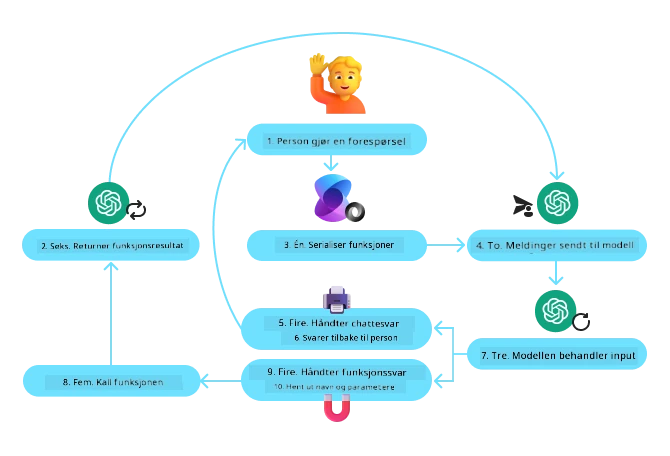
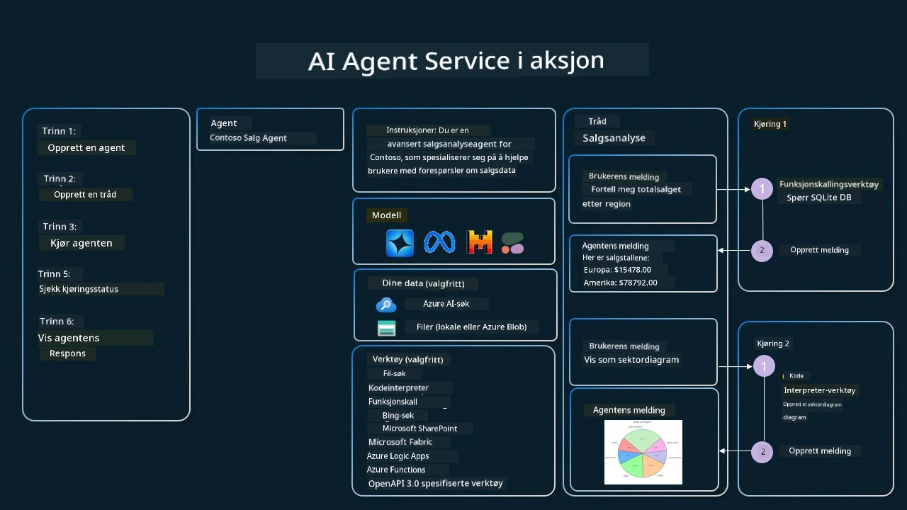

[](https://youtu.be/vieRiPRx-gI?si=cEZ8ApnT6Sus9rhn)

> _(Klikk på bildet over for å se video av denne leksjonen)_

# Mønster for bruk av verktøy

Verktøy er interessante fordi de gir AI-agenter et bredere spekter av kapasiteter. I stedet for at agenten bare har et begrenset sett med handlinger den kan utføre, kan agenten nå utføre et bredt spekter av handlinger ved å legge til et verktøy. I dette kapittelet skal vi se på mønsteret for bruk av verktøy, som beskriver hvordan AI-agenter kan bruke spesifikke verktøy for å nå sine mål.

## Introduksjon

I denne leksjonen ønsker vi å svare på følgende spørsmål:

- Hva er mønsteret for bruk av verktøy?
- Hvilke bruksområder kan det anvendes på?
- Hva er elementene/byggesteinene som trengs for å implementere mønsteret?
- Hva er spesielle hensyn ved bruk av mønsteret for å bygge troverdige AI-agenter?

## Læringsmål

Etter å ha fullført denne leksjonen vil du kunne:

- Definere mønsteret for bruk av verktøy og dets formål.
- Identifisere tilfeller der mønsteret for bruk av verktøy er anvendelig.
- Forstå nøkkelementene som trengs for å implementere mønsteret.
- Gjenkjenne hensyn for å sikre troverdighet i AI-agenter som bruker dette mønsteret.

## Hva er mønsteret for bruk av verktøy?

**Mønsteret for bruk av verktøy** fokuserer på å gi store språkmodeller (LLMs) muligheten til å interagere med eksterne verktøy for å oppnå spesifikke mål. Verktøy er kode som kan kjøres av en agent for å utføre handlinger. Et verktøy kan være en enkel funksjon som en kalkulator, eller et API-kall til en tredjepartstjeneste som aksjekursoppslag eller værmelding. I sammenheng med AI-agenter er verktøy designet for å bli utført av agenter som svar på **modellgenererte funksjonskall**.

## Hvilke bruksområder kan det anvendes på?

AI-agenter kan bruke verktøy for å fullføre komplekse oppgaver, hente informasjon eller ta beslutninger. Mønsteret for bruk av verktøy brukes ofte i scenarier som krever dynamisk interaksjon med eksterne systemer, som databaser, webtjenester eller kodeinterpretere. Denne evnen er nyttig for en rekke ulike bruksområder, inkludert:

- **Dynamisk informasjonsinnhenting:** Agenter kan forespørre eksterne API-er eller databaser for å hente oppdatert data (f.eks. forespørsler mot en SQLite-database for dataanalyse, hente aksjekurser eller værinformasjon).
- **Kodekjøring og tolkning:** Agenter kan kjøre kode eller skript for å løse matematiske problemer, generere rapporter eller utføre simuleringer.
- **Automatisering av arbeidsflyt:** Automatisere repeterende eller flertrinns arbeidsflyter ved å integrere verktøy som tidsplanleggere, e-posttjenester eller datapipelines.
- **Kundesupport:** Agenter kan interagere med CRM-systemer, billettsystemer eller kunnskapsbaser for å løse brukerhenvendelser.
- **Innholdsgenerering og redigering:** Agenter kan bruke verktøy som grammatikkontroll, tekstoppsummering eller innholdsikkerhetsvurdering for å assistere i innholdsproduksjonsoppgaver.

## Hva er elementene/byggesteinene som trengs for å implementere mønsteret for bruk av verktøy?

Disse byggesteinene gjør det mulig for AI-agenten å utføre et bredt spekter av oppgaver. La oss se på nøkkel-elementene som trengs for å implementere mønsteret for bruk av verktøy:

- **Funksjon-/verktøyskjemaer**: Detaljerte definisjoner av tilgjengelige verktøy, inkludert funksjonsnavn, formål, nødvendige parametere og forventede utdata. Disse skjemaene gjør det mulig for LLM-en å forstå hvilke verktøy som er tilgjengelige og hvordan man konstruerer gyldige forespørsler.

- **Logikk for funksjonsutførelse**: Styrer hvordan og når verktøy blir påkalt basert på brukerens intensjon og samtalekontekst. Dette kan inkludere planleggingsmoduler, rutemekanismer eller betingede flyter som dynamisk bestemmer bruk av verktøy.

- **Meldingshåndteringssystem**: Komponenter som styrer den konversasjonelle flyten mellom brukerinput, LLM-responser, verktøykall og verktøysvar.

- **Integrasjonsrammeverk for verktøy**: Infrastruktur som kobler agenten til forskjellige verktøy, enten de er enkle funksjoner eller komplekse eksterne tjenester.

- **Feilhåndtering og validering**: Mekanismer for å håndtere feil i verktøyutførelse, validere parametere og håndtere uventede svar.

- **Tilstandshåndtering**: Sporer samtalekontekst, tidligere verktøysinteraksjoner og vedvarende data for å sikre konsistens over flere interaksjoner.

Neste, la oss se nærmere på funksjons-/verktøykall.
 
### Funksjons-/verktøykall

Funksjonskall er hovedmetoden vi bruker for å la store språkmodeller (LLMs) interagere med verktøy. Du vil ofte se at 'funksjon' og 'verktøy' brukes om hverandre fordi 'funksjoner' (blokker av gjenbrukbar kode) er de 'verktøyene' agentene bruker for å utføre oppgaver. For at en funksjonskode skal kunne påkalles, må en LLM sammenligne brukerens forespørsel med funksjonsbeskrivelsen. For dette sendes et skjema som inneholder beskrivelsene av alle tilgjengelige funksjoner til LLM-en. LLM-en velger deretter den mest passende funksjonen for oppgaven og returnerer dens navn og argumenter. Den valgte funksjonen påkalles, responsen sendes tilbake til LLM-en, som bruker informasjonen til å svare brukerens forespørsel.

For utviklere som vil implementere funksjonskall for agenter, trenger man:

1. En LLM-modell som støtter funksjonskall
2. Et skjema som inneholder funksjonsbeskrivelser
3. Koden for hver funksjon som er beskrevet

La oss bruke eksempelet på å hente gjeldende tid i en by for å illustrere:

1. **Initialiser en LLM som støtter funksjonskall:**

    Ikke alle modeller støtter funksjonskall, så det er viktig å sjekke at LLM-en du bruker gjør det.     <a href="https://learn.microsoft.com/azure/ai-services/openai/how-to/function-calling" target="_blank">Azure OpenAI</a> støtter funksjonskall. Vi kan starte med å initialisere OpenAI-klienten mot Azure OpenAI **Responses API** (den stabile `/openai/v1/` endepunktet – ingen `api_version` nødvendig). 

    ```python
    # Initialiser OpenAI-klienten for Azure OpenAI (Responses API, v1-endepunkt)
    client = OpenAI(
        base_url=f"{os.environ['AZURE_OPENAI_ENDPOINT'].rstrip('/')}/openai/v1/",
        api_key=os.environ["AZURE_OPENAI_API_KEY"],
    )
    deployment_name = os.environ["AZURE_OPENAI_DEPLOYMENT"]
    ```

1. **Opprett et funksjonsskjema**:

    Deretter definerer vi et JSON-skjema som inneholder navn på funksjonen, beskrivelse av hva funksjonen gjør, og navn og beskrivelser på funksjonsparametrene.
    Vi sender så dette skjemaet sammen med brukerens spørsmål om tiden i San Francisco til klienten som ble laget tidligere. Det viktige å merke seg er at et **verktøykall** returneres, **ikke** det endelige svaret på spørsmålet. Som nevnt tidligere returnerer LLM navnet på funksjonen den valgte for oppgaven, og argumentene som skal sendes til den.

    ```python
    # Funksjonsbeskrivelse for modellen å lese (Respons API flat verktøyformat)
    tools = [
        {
            "type": "function",
            "name": "get_current_time",
            "description": "Get the current time in a given location",
            "parameters": {
                "type": "object",
                "properties": {
                    "location": {
                        "type": "string",
                        "description": "The city name, e.g. San Francisco",
                    },
                },
                "required": ["location"],
            },
        }
    ]
    ```
   
    ```python
  
    # Initielt brukermelding
    messages = [{"role": "user", "content": "What's the current time in San Francisco"}]

    # Første API-kall: Be modellen om å bruke funksjonen
    response = client.responses.create(
        model=deployment_name,
        input=messages,
        tools=tools,
        tool_choice="auto",
        store=False,
    )

    # Responses API returnerer verktøykall som function_call-elementer i response.output.
    # Legg dem til i samtalen slik at modellen har full kontekst på neste runde.
    messages += response.output

    print("Model's response:")
    print(response.output)
  
    ```

    ```bash
    Model's response:
    [ResponseFunctionToolCall(arguments='{"location":"San Francisco"}', call_id='call_pOsKdUlqvdyttYB67MOj434b', name='get_current_time', type='function_call')]
    ```
  
1. **Funksjonskoden som kreves for å utføre oppgaven:**

    Nå som LLM har valgt hvilken funksjon som skal kjøres, må koden som utfører oppgaven implementeres og kjøres.
    Vi kan implementere koden for å hente gjeldende tid i Python. Vi må også skrive kode for å trekke ut navnet og argumentene fra response_message for å få sluttresultatet.

    ```python
      def get_current_time(location):
        """Get the current time for a given location"""
        print(f"get_current_time called with location: {location}")  
        location_lower = location.lower()
        
        for key, timezone in TIMEZONE_DATA.items():
            if key in location_lower:
                print(f"Timezone found for {key}")  
                current_time = datetime.now(ZoneInfo(timezone)).strftime("%I:%M %p")
                return json.dumps({
                    "location": location,
                    "current_time": current_time
                })
      
        print(f"No timezone data found for {location_lower}")  
        return json.dumps({"location": location, "current_time": "unknown"})
    ```

     ```python
    # Behandle funksjonskall
    tool_calls = [item for item in response.output if item.type == "function_call"]
    if tool_calls:
        for tool_call in tool_calls:
            if tool_call.name == "get_current_time":

                function_args = json.loads(tool_call.arguments)

                time_response = get_current_time(
                    location=function_args.get("location")
                )

                # Returner verktøyresultatet som et function_call_output-element
                messages.append({
                    "type": "function_call_output",
                    "call_id": tool_call.call_id,
                    "output": time_response,
                })
    else:
        print("No tool calls were made by the model.")

    # Andre API-kall: Hent det endelige svaret fra modellen
    final_response = client.responses.create(
        model=deployment_name,
        input=messages,
        tools=tools,
        store=False,
    )

    return final_response.output_text
     ```

     ```bash
      get_current_time called with location: San Francisco
      Timezone found for san francisco
      The current time in San Francisco is 09:24 AM.
     ```

Funksjonskall er kjernen i de fleste, om ikke alle, verktøybruksmønstre for agenter, men implementering fra bunnen av kan noen ganger være utfordrende.
Som vi lærte i [Leksjon 2](../../../02-explore-agentic-frameworks) tilbyr agentiske rammeverk ferdigbygde byggesteiner for å implementere verktøybruk.
 
## Eksempler på verktøybruk med agentiske rammeverk

Her er noen eksempler på hvordan du kan implementere mønsteret for bruk av verktøy ved hjelp av forskjellige agentiske rammeverk:

### Microsoft Agent Framework

<a href="https://learn.microsoft.com/azure/ai-services/agents/overview" target="_blank">Microsoft Agent Framework</a> er et åpen-kildekode AI-rammeverk for å bygge AI-agenter. Det forenkler prosessen med å bruke funksjonskall ved å la deg definere verktøy som Python-funksjoner med `@tool` dekoratør. Rammeverket håndterer kommunikasjonen frem og tilbake mellom modellen og koden din. Det gir også tilgang til ferdigbygde verktøy som Filsøk og Kodeinterpreter gjennom `FoundryChatClient`.

Følgende diagram illustrerer prosessen med funksjonskall i Microsoft Agent Framework:



I Microsoft Agent Framework er verktøy definert som dekorerte funksjoner. Vi kan konvertere funksjonen `get_current_time` vi så tidligere til et verktøy ved å bruke `@tool` dekoratøren. Rammeverket vil automatisk serialisere funksjonen og dens parametere, og skape skjemaet som sendes til LLM.

```python
import os
from agent_framework import tool
from agent_framework.foundry import FoundryChatClient
from azure.identity import AzureCliCredential

@tool(approval_mode="never_require")
def get_current_time(location: str) -> str:
    """Get the current time for a given location"""
    ...

# Opprett klienten
provider = FoundryChatClient(
    project_endpoint=os.environ["AZURE_AI_PROJECT_ENDPOINT"],
    model=os.environ["AZURE_AI_MODEL_DEPLOYMENT_NAME"],
    credential=AzureCliCredential(),
)

# Opprett en agent og kjør med verktøyet
agent = provider.as_agent(name="TimeAgent", instructions="Use available tools to answer questions.", tools=get_current_time)
response = await agent.run("What time is it?")
```
  
### Microsoft Foundry Agent Service

<a href="https://learn.microsoft.com/azure/ai-services/agents/overview" target="_blank">Microsoft Foundry Agent Service</a> er et nyere agentisk rammeverk som er designet for å gi utviklere mulighet til sikkert å bygge, distribuere og skalere høykvalitets og utvidbare AI-agenter uten å måtte håndtere underliggende datakraft og lagringsressurser. Det er spesielt nyttig for bedriftsapplikasjoner siden det er en fulladministrert tjeneste med sikkerhet på bedriftsnivå.

Sammenlignet med utvikling med LLM API direkte tilbyr Microsoft Foundry Agent Service noen fordeler, inkludert:

- Automatisk verktøykall – ingen behov for å tolke et verktøykall, kjøre verktøyet og håndtere responsen; alt dette gjøres nå server-side
- Sikkert administrerte data – i stedet for å håndtere din egen samtaletilstand, kan du stole på tråder for å lagre all informasjon du trenger
- Verktøy klare til bruk – Verktøy som du kan bruke for å samhandle med datakilder, som Bing, Azure AI Search og Azure Functions.

Verktøyene tilgjengelig i Microsoft Foundry Agent Service kan deles inn i to kategorier:

1. Kunnskapsverktøy:
    - <a href="https://learn.microsoft.com/azure/ai-services/agents/how-to/tools/bing-grounding?tabs=python&pivots=overview" target="_blank">Grunnlagt med Bing Søke</a>
    - <a href="https://learn.microsoft.com/azure/ai-services/agents/how-to/tools/file-search?tabs=python&pivots=overview" target="_blank">Filsøk</a>
    - <a href="https://learn.microsoft.com/azure/ai-services/agents/how-to/tools/azure-ai-search?tabs=azurecli%2Cpython&pivots=overview-azure-ai-search" target="_blank">Azure AI Søk</a>

2. Handlingsverktøy:
    - <a href="https://learn.microsoft.com/azure/ai-services/agents/how-to/tools/function-calling?tabs=python&pivots=overview" target="_blank">Funksjonskall</a>
    - <a href="https://learn.microsoft.com/azure/ai-services/agents/how-to/tools/code-interpreter?tabs=python&pivots=overview" target="_blank">Kodeinterpreter</a>
    - <a href="https://learn.microsoft.com/azure/ai-services/agents/how-to/tools/openapi-spec?tabs=python&pivots=overview" target="_blank">OpenAPI-definerte verktøy</a>
    - <a href="https://learn.microsoft.com/azure/ai-services/agents/how-to/tools/azure-functions?pivots=overview" target="_blank">Azure Functions</a>

Agenttjenesten gjør det mulig for oss å bruke disse verktøyene sammen som et `toolset`. Den benytter også `threads` som holder oversikt over meldingshistorikken fra en gitt samtale.

Tenk deg at du er en salgsagent i et selskap som heter Contoso. Du ønsker å utvikle en samtaleagent som kan svare på spørsmål om salgsdataene dine.

Følgende bilde illustrerer hvordan du kan bruke Microsoft Foundry Agent Service til å analysere salgsdataene dine:



For å bruke noen av disse verktøyene med tjenesten kan vi opprette en klient og definere et verktøy eller et sett av verktøy. For å implementere dette praktisk kan vi bruke følgende Python-kode. LLM-en vil kunne se på toolset-et og avgjøre om den skal bruke den brukerskapte funksjonen, `fetch_sales_data_using_sqlite_query`, eller den ferdigbygde Kodeinterpreteren avhengig av brukerens forespørsel.

```python 
import os
from azure.ai.projects import AIProjectClient
from azure.identity import DefaultAzureCredential
from fetch_sales_data_functions import fetch_sales_data_using_sqlite_query # fetch_sales_data_using_sqlite_query-funksjon som finnes i en fetch_sales_data_functions.py-fil.
from azure.ai.projects.models import ToolSet, FunctionTool, CodeInterpreterTool

project_client = AIProjectClient.from_connection_string(
    credential=DefaultAzureCredential(),
    conn_str=os.environ["PROJECT_CONNECTION_STRING"],
)

# Initialiser verktøysett
toolset = ToolSet()

# Initialiser funksjonskallagent med fetch_sales_data_using_sqlite_query-funksjonen og legg den til i verktøysettet
fetch_data_function = FunctionTool(fetch_sales_data_using_sqlite_query)
toolset.add(fetch_data_function)

# Initialiser kodeinterpreterverktøy og legg det til i verktøysettet.
code_interpreter = CodeInterpreterTool()toolset.add(code_interpreter)

agent = project_client.agents.create_agent(
    model="gpt-4o-mini", name="my-agent", instructions="You are helpful agent", 
    toolset=toolset
)
```

## Hva er spesielle hensyn ved bruk av mønsteret for bruk av verktøy for å bygge troverdige AI-agenter?

En vanlig bekymring med SQL som genereres dynamisk av LLM-er er sikkerhet, spesielt risikoen for SQL-injeksjon eller skadelige handlinger, som å slette eller tukle med databasen. Selv om disse bekymringene er gyldige, kan de effektivt dempes ved riktig konfigurasjon av database-tilgangstillatelser. For de fleste databaser innebærer dette å konfigurere databasen som skrivebeskyttet. For databaseservicer som PostgreSQL eller Azure SQL bør appen tildeles en skrivbeskyttet (SELECT) rolle.

Kjøre appen i et sikkert miljø øker også beskyttelsen. I bedriftsmiljøer extractor og transformer data vanligvis fra operasjonelle systemer til en skrivebeskyttet database eller datalager med et brukervennlig skjema. Denne tilnærmingen sikrer at dataene er sikre, optimalisert for ytelse og tilgjengelighet, og at appen har begrenset, skrivebeskyttet tilgang.

## Eksempelkoder

- Python: [Agent Framework](./code_samples/04-python-agent-framework.ipynb)
- .NET: [Agent Framework](./code_samples/04-dotnet-agent-framework.md)

## Har du flere spørsmål om mønsteret for bruk av verktøy?

Bli med i [Microsoft Foundry Discord](https://discord.com/invite/ATgtXmAS5D) for å møte andre lærende, delta på kontortimer og få svar på spørsmål om AI-agenter.

## Ytterligere ressurser

- <a href="https://microsoft.github.io/build-your-first-agent-with-azure-ai-agent-service-workshop/" target="_blank">Azure AI Agents Service Workshop</a>
- <a href="https://github.com/Azure-Samples/contoso-creative-writer/tree/main/docs/workshop" target="_blank">Contoso Creative Writer Multi-Agent Workshop</a>
- <a href="https://learn.microsoft.com/azure/ai-services/agents/overview" target="_blank">Oversikt over Microsoft Agent Framework</a>


## Forrige leksjon

[Understanding Agentic Design Patterns](../03-agentic-design-patterns/README.md)

## Neste leksjon

[Agentic RAG](../05-agentic-rag/README.md)

---

<!-- CO-OP TRANSLATOR DISCLAIMER START -->
**Ansvarsfraskrivelse**:
Dette dokumentet er oversatt ved hjelp av AI-oversettelsestjenesten [Co-op Translator](https://github.com/Azure/co-op-translator). Selv om vi streber etter nøyaktighet, vær oppmerksom på at automatiske oversettelser kan inneholde feil eller unøyaktigheter. Det opprinnelige dokumentet på originalspråket skal betraktes som den autoritative kilden. For kritisk informasjon anbefales profesjonell menneskelig oversettelse. Vi er ikke ansvarlige for eventuelle misforståelser eller feiltolkninger som oppstår ved bruk av denne oversettelsen.
<!-- CO-OP TRANSLATOR DISCLAIMER END -->