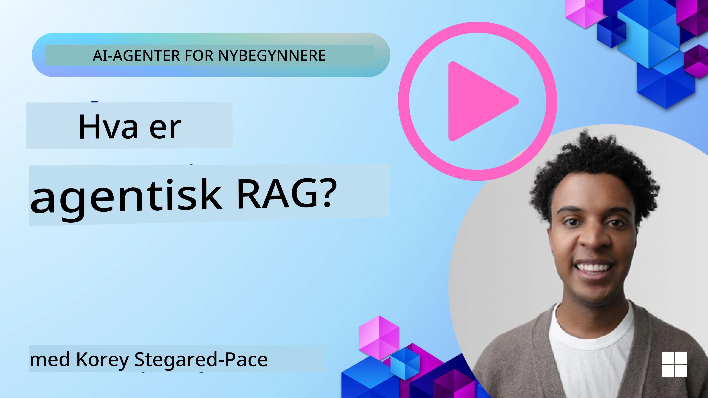
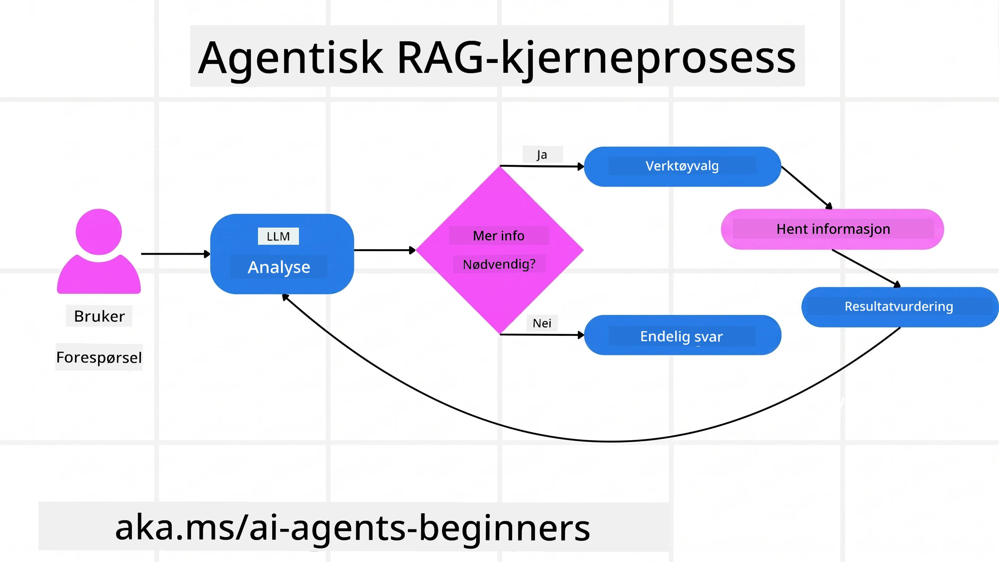
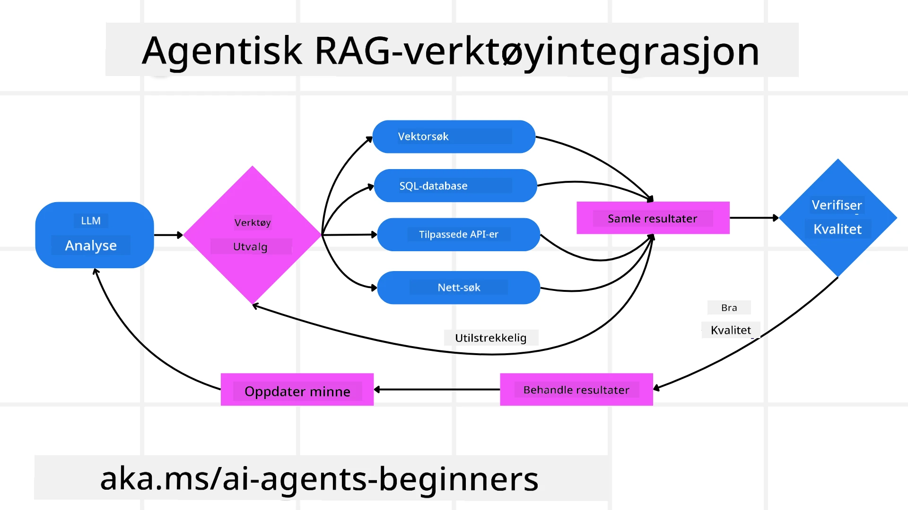
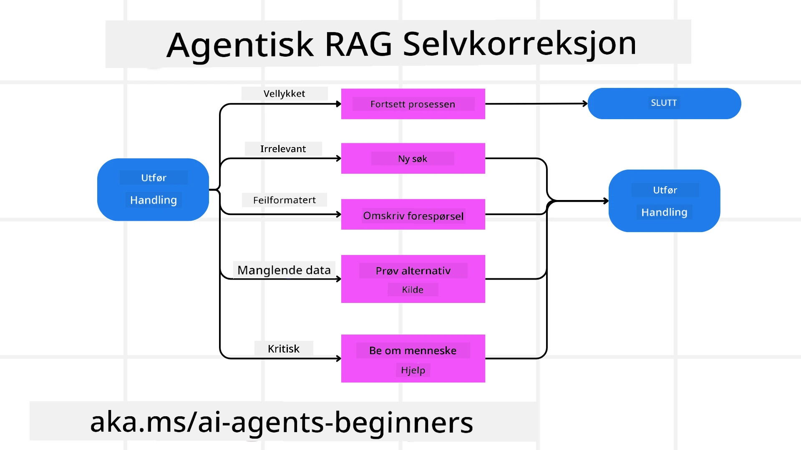
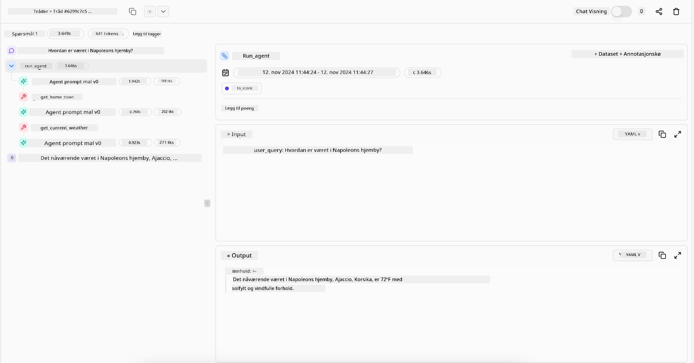

> _(Klikk på bildet over for å se video av denne leksjonen)_

# Agentic RAG

Denne leksjonen gir en omfattende oversikt over Agentic Retrieval-Augmented Generation (Agentic RAG), et nytt AI-paradigme hvor store språkmodeller (LLM) autonomt planlegger sine neste steg mens de henter informasjon fra eksterne kilder. I motsetning til statiske hent-og-les-mønstre involverer Agentic RAG iterative kall til LLM, vekslet med verktøy- eller funksjonskall og strukturerte utskrifter. Systemet vurderer resultater, forbedrer forespørsler, tar i bruk flere verktøy om nødvendig, og fortsetter denne syklusen til en tilfredsstillende løsning er oppnådd.

## Introduksjon

Denne leksjonen vil dekke

- **Forstå Agentic RAG:** Lær om det nye paradigmet innen AI hvor store språkmodeller (LLM) autonomt planlegger sine neste steg mens de henter informasjon fra eksterne datakilder.
- **Forstå Iterativ Maker-Checker Stil:** Forstå sløyfen av iterative kall til LLM, vekslet med verktøy- eller funksjonskall og strukturerte utskrifter, designet for å forbedre korrekthet og håndtere feilformulerte spørsmål.
- **Utforsk Praktiske Bruksområder:** Identifiser scenarier hvor Agentic RAG skinner, slik som korrekthetsfokuserte miljøer, komplekse databaseinteraksjoner og utvidede arbeidsflyter.

## Læringsmål

Etter å ha fullført denne leksjonen vil du kunne/forstå:

- **Forståelse av Agentic RAG:** Lær om det nye paradigmet innen AI hvor store språkmodeller (LLM) autonomt planlegger sine neste steg mens de henter informasjon fra eksterne datakilder.
- **Iterativ Maker-Checker Stil:** Forstå konseptet med en sløyfe av iterative kall til LLM, vekslet med verktøy- eller funksjonskall og strukturerte utskrifter, designet for å forbedre korrekthet og håndtere feilformulerte spørsmål.
- **Eie Resonnementprosessen:** Forstå systemets evne til å eie sin resonnementprosess, ta beslutninger om hvordan det skal tilnærme seg problemer uten å stole på forhåndsdefinerte veier.
- **Arbeidsflyt:** Forstå hvordan en agentisk modell uavhengig bestemmer seg for å hente markedsrapporttrender, identifisere konkurrentdata, korrelere interne salgsmetrikker, syntetisere funn og evaluere strategien.
- **Iterative Sløyfer, Verktøyintegrasjon og Minne:** Lær om systemets avhengighet av et sløyfemønster, som opprettholder tilstand og minne gjennom trinnene for å unngå repeterende sløyfer og fatte informerte beslutninger.
- **Håndtering av Feilmodus og Selvkorreksjon:** Utforsk systemets robuste selvkorrigeringsmekanismer, inkludert iterasjon og ny forespørsel, bruk av diagnostiske verktøy og å falle tilbake på menneskelig overvåkning.
- **Agent-begrensninger:** Forstå begrensningene til Agentic RAG, med fokus på domene-spesifikk autonomi, infrastrukturavhengighet og respekt for sikkerhetsgrenser.
- **Praktiske Bruksområder og Verdi:** Identifiser scenarier hvor Agentic RAG skinner, slik som korrekthetsfokuserte miljøer, komplekse databaseinteraksjoner og utvidede arbeidsflyter.
- **Styring, Transparens og Tillit:** Lær om viktigheten av styring og transparens, inkludert forklarbart resonnement, bias-kontroll og menneskelig overvåkning.

## Hva er Agentic RAG?

Agentic Retrieval-Augmented Generation (Agentic RAG) er et nytt AI-paradigme hvor store språkmodeller (LLM) autonomt planlegger sine neste steg mens de henter informasjon fra eksterne kilder. I motsetning til statiske hent-og-les-mønstre involverer Agentic RAG iterative kall til LLM, vekslet med verktøy- eller funksjonskall og strukturerte utskrifter. Systemet vurderer resultater, forbedrer forespørsler, tar i bruk flere verktøy om nødvendig, og fortsetter denne syklusen til en tilfredsstillende løsning er oppnådd. Denne iterative «maker-checker»-stilen forbedrer korrekthet, håndterer feilformulerte spørsmål og sikrer høykvalitetsresultater.

Systemet eier aktivt sin resonnementprosess, skriver om mislykkede forespørsler, velger ulike hentemetoder og integrerer flere verktøy — som vektorsøk i Azure AI Search, SQL-databaser eller tilpassede API-er — før svaret blir endelig. Den kjennetegnende egenskapen til et agentisk system er evnen til å eie sin resonnementprosess. Tradisjonelle RAG-implementasjoner stoler på forhåndsdefinerte veier, men et agentisk system bestemmer selv rekkefølgen på stegene basert på kvaliteten av informasjonen det finner.

## Definere Agentic Retrieval-Augmented Generation (Agentic RAG)

Agentic Retrieval-Augmented Generation (Agentic RAG) er et nytt paradigme innen AI-utvikling hvor LLM ikke bare henter informasjon fra eksterne datakilder, men også autonomt planlegger sine neste steg. I motsetning til statiske hent-og-les-mønstre eller nøye scriptede promptsekvenser, involverer Agentic RAG en sløyfe av iterative kall til LLM, vekslet med verktøy- eller funksjonskall og strukturerte utskrifter. Ved hvert steg vurderer systemet resultatene det har fått, avgjør om det skal forbedre sine forespørsler, kaller inn flere verktøy om nødvendig, og fortsetter denne syklusen til det oppnår en tilfredsstillende løsning.

Denne iterative «maker-checker»-operasjonen er designet for å forbedre korrekthet, håndtere feilformulerte forespørsler til strukturerte databaser (f.eks. NL2SQL), og sikre balanserte, høykvalitetsresultater. I stedet for å stole kun på nøye utformede promptkjeder eier systemet aktivt sin resonnementprosess. Det kan skrive om forespørsler som feiler, velge ulike hentemetoder og integrere flere verktøy — som vektorsøk i Azure AI Search, SQL-databaser eller tilpassede API-er — før svaret blir endelig. Dette fjerner behovet for overdrevne komplekse orkestreringsrammeverk. I stedet kan en relativt enkel sløyfe av «LLM-kall → verktøybruk → LLM-kall → …» gi sofistikerte og velbegrunnede utskrifter.

## Eie Resonnementprosessen

Den kjennetegnende egenskapen som gjør et system «agentisk» er dets evne til å eie sin resonnementprosess. Tradisjonelle RAG-implementasjoner er ofte avhengige av at mennesker forhåndsdefinerer en vei for modellen: en tanke-kjede som skisserer hva som skal hentes og når.
Men når et system er virkelig agentisk, bestemmer det selv internt hvordan det skal nærme seg problemet. Det utfører ikke bare et script; det fastsetter autonomt rekkefølgen av stegene basert på kvaliteten av informasjonen det finner.
For eksempel, hvis det blir bedt om å lage en produktlanseringsstrategi, stoler det ikke kun på en prompt som forklarer hele forsknings- og beslutningsarbeidet. I stedet bestemmer den agentiske modellen selvstendig å:

1. Hente dagens markedsrapporttrender ved bruk av Bing Web Grounding
2. Identifisere relevante konkurrentdata ved bruk av Azure AI Search.
3. Koble historiske interne salgsmetrikker ved bruk av Azure SQL Database.
4. Syntetisere funnene til en sammenhengende strategi orkestrert via Azure OpenAI Service.
5. Evaluere strategien for hull eller inkonsistenser, og be om ny runde med innhenting om nødvendig.
Alle disse stegene — forbedring av forespørsler, valg av kilder, iterering til det er «fornøyd» med svaret — bestemmes av modellen, ikke forhåndsscriptet av et menneske.

## Iterative Sløyfer, Verktøyintegrasjon og Minne

Et agentisk system bygger på et sløyfemønster for interaksjon:

- **Initielt Kall:** Brukerens mål (aka. brukerens prompt) presenteres for LLM.
- **Verktøybruk:** Hvis modellen oppdager manglende informasjon eller uklare instruksjoner, velger den et verktøy eller en hentemetode — som et vektordatabasespørsmål (f.eks. Azure AI Search Hybrid-søk over privat data) eller et strukturert SQL-kall — for å hente mer kontekst.
- **Vurdering & Forbedring:** Etter å ha gjennomgått returnerte data, avgjør modellen om informasjonen er tilstrekkelig. Hvis ikke, forbedrer den forespørselen, prøver et annet verktøy eller justerer tilnærmingen.
- **Gjenta til fornøyd:** Denne syklusen fortsetter til modellen avgjører at det har nok klarhet og bevis til å levere et endelig, godt begrunnet svar.
- **Minne & Tilstand:** Fordi systemet opprettholder tilstand og minne over trinn, kan det huske tidligere forsøk og resultater, unngå repeterende sløyfer og ta mer informerte beslutninger mens det går videre.

Over tid skaper dette en følelse av utviklende forståelse, som gjør det mulig for modellen å navigere i komplekse, mangestegs oppgaver uten at et menneske må gripe inn eller omforme prompten konstant.

## Håndtering av Feilmodus og Selvkorreksjon

Agentic RAG sin autonomi involverer også robuste selvkorrigeringsmekanismer. Når systemet møter blindveier — slik som å hente irrelevante dokumenter eller støte på feilformulerte spørsmål — kan det:

- **Iterere og Spørre på Nytt:** I stedet for å returnere lite verdifulle svar, prøver modellen nye søkestrategier, skriver om databaseforespørsler, eller ser på alternative datasett.
- **Bruke Diagnostiske Verktøy:** Systemet kan kalle inn tilleggfunksjoner designet for å hjelpe til med å feilsøke resonnementstrinn eller bekrefte korrektheten av hentet data. Verktøy som Azure AI Tracing vil være viktige for å muliggjøre robust observasjon og overvåking.
- **Falle Tilbake på Menneskelig Overvåkning:** For høyrisikosituasjoner eller gjentatte feil kan modellen varsle usikkerhet og be om menneskelig veiledning. Når mennesket gir korrigerende tilbakemelding, kan modellen inkorporere denne lærdommen fremover.

Denne iterative og dynamiske tilnærmingen gjør det mulig for modellen å kontinuerlig forbedre seg, og sikrer at den ikke bare er et engangssystem, men et som lærer av sine feil under en gitt sesjon.

## Agentens Begrensninger

Til tross for sin autonomi innenfor en oppgave, er ikke Agentic RAG analogt med kunstig generell intelligens. Dets «agentiske» evner er begrenset til verktøyene, datakildene og retningslinjene levert av menneskelige utviklere. Det kan ikke oppfinne sine egne verktøy eller gå utenfor de satte domenebegrensningene. Snarere utmerker det seg ved dynamisk å orkestrere ressursene det har.
Nøkkelforskjeller fra mer avanserte AI-former inkluderer:

1. **Domene-spesifikk Autonomi:** Agentic RAG-systemer fokuserer på å oppnå brukerspesifikke mål innenfor en kjent domene, og bruker strategier som omskriving av forespørsler eller verktøyvalg for å forbedre resultater.
2. **Avhengig av Infrastruktur:** Systemets evner avhenger av verktøyene og dataene integrert av utviklere. Det kan ikke overskride disse grensene uten menneskelig inngripen.
3. **Respekt for Sikkerhetsgrenser:** Etiske retningslinjer, overholdelsesregler og forretningspolitikker er svært viktige. Agentens frihet er alltid begrenset av sikkerhetstiltak og overvåkingsmekanismer (forhåpentligvis).

## Praktiske Bruksområder og Verdi

Agentic RAG skinner i scenarier som krever iterativ forbedring og presisjon:

1. **Korrekthetsfokuserte Miljøer:** I samsvarskontroller, regulatorisk analyse eller juridisk forskning kan den agentiske modellen gjentatte ganger verifisere fakta, konsultere flere kilder og omskrive forespørsler til den produserer et grundig kvalitetssikret svar.
2. **Komplekse Databaseinteraksjoner:** Når man håndterer strukturerte data der forespørsler ofte kan feile eller trenge justering, kan systemet autonomt forbedre sine forespørsler med Azure SQL eller Microsoft Fabric OneLake, og sikre at endelig henteoperasjon samsvarer med brukerens intensjon.
3. **Utvidede Arbeidsflyter:** Lengre økter kan utvikle seg etter hvert som ny informasjon dukker opp. Agentic RAG kan kontinuerlig innlemme nye data og justere strategier etter hvert som det lærer mer om problemområdet.

## Styring, Transparens og Tillit

Etter hvert som disse systemene blir mer autonome i sitt resonnement, er styring og transparens avgjørende:

- **Forklarbart Resonnement:** Modellen kan gi en revisjonsspor av forespørslene den har gjort, kildene den har konsultert, og resonnementstrinnene den tok for å komme til sin konklusjon. Verktøy som Azure AI Content Safety og Azure AI Tracing / GenAIOps kan hjelpe til med å opprettholde transparens og redusere risiko.
- **Bias-kontroll og Balansert Henting:** Utviklere kan justere hentestrategier for å sikre at balanserte, representative datakilder vurderes, og regelmessig revidere utskrifter for å oppdage skjevheter eller feilaktige mønstre ved hjelp av tilpassede modeller for avanserte datasenterorganisasjoner som bruker Azure Machine Learning.
- **Menneskelig Overvåkning og Overholdelse:** For sensitive oppgaver er menneskelig gjennomgang fortsatt essensielt. Agentic RAG erstatter ikke menneskelig vurdering i viktigere beslutninger — det forsterker den ved å levere mer grundig gjennomgåtte alternativer.

Å ha verktøy som gir et klart register over handlinger er essensielt. Uten dem kan det være svært vanskelig å feilsøke en flertrinnsprosess. Se følgende eksempel fra Literal AI (selskapet bak Chainlit) for et Agent-kjør:

## Konklusjon

Agentic RAG representerer en naturlig utvikling i hvordan AI-systemer håndterer komplekse, datatungt oppgaver. Ved å adoptere et sløyfebasert interaksjonsmønster, autonomt velge verktøy og forbedre forespørsler til det oppnår et høykvalitetsresultat, går systemet utover statisk prompt-følging til å bli en mer adaptiv, kontekst-bevisst beslutningstaker. Selv om det fortsatt er begrenset av menneskedefinerte infrastrukturer og etiske retningslinjer, muliggjør disse agentiske evnene rikere, mer dynamiske og til syvende og sist mer nyttige AI-interaksjoner for både bedrifter og sluttbrukere.

### Har du flere spørsmål om Agentic RAG?

Bli med i [Microsoft Foundry Discord](https://discord.com/invite/ATgtXmAS5D) for å møte andre som lærer, delta på kontortid og få svar på dine spørsmål om AI-agenter.

## Ekstra ressurser

- <a href="https://learn.microsoft.com/training/modules/use-own-data-azure-openai" target="_blank">Implementer Retrieval Augmented Generation (RAG) med Azure OpenAI Service: Lær hvordan du bruker dine egne data med Azure OpenAI Service. Denne Microsoft Learn-modulen gir en omfattende guide om å implementere RAG</a>
- <a href="https://learn.microsoft.com/azure/ai-studio/concepts/evaluation-approach-gen-ai" target="_blank">Evaluering av generative AI-applikasjoner med Microsoft Foundry: Denne artikkelen dekker evaluering og sammenligning av modeller på offentlig tilgjengelige datasett, inkludert Agentic AI-applikasjoner og RAG-arkitekturer</a>
- <a href="https://weaviate.io/blog/what-is-agentic-rag" target="_blank">Hva er Agentic RAG | Weaviate</a>
- <a href="https://ragaboutit.com/agentic-rag-a-complete-guide-to-agent-based-retrieval-augmented-generation/" target="_blank">Agentic RAG: En komplett guide til agentbasert Retrieval Augmented Generation – Nyheter fra generation RAG</a>

- <a href="https://huggingface.co/learn/cookbook/agent_rag" target="_blank">Agentisk RAG: turbocharger din RAG med spørringsreformulering og selvspørring! Hugging Face Open-Source AI Cookbook</a>
- <a href="https://youtu.be/aQ4yQXeB1Ss?si=2HUqBzHoeB5tR04U" target="_blank">Legge til agentiske lag til RAG</a>
- <a href="https://www.youtube.com/watch?v=zeAyuLc_f3Q&t=244s" target="_blank">Fremtiden for kunnskapshjelpere: Jerry Liu</a>
- <a href="https://www.youtube.com/watch?v=AOSjiXP1jmQ" target="_blank">Hvordan bygge agentiske RAG-systemer</a>
- <a href="https://ignite.microsoft.com/sessions/BRK102?source=sessions" target="_blank">Bruke Microsoft Foundry Agent Service for å skalere dine AI-agenter</a>

### Akademiske artikler

- <a href="https://arxiv.org/abs/2303.17651" target="_blank">2303.17651 Self-Refine: Iterativ forbedring med selvsvar</a>
- <a href="https://arxiv.org/abs/2303.11366" target="_blank">2303.11366 Reflexion: Språkagenter med verbal forsterkende læring</a>
- <a href="https://arxiv.org/abs/2305.11738" target="_blank">2305.11738 CRITIC: Store språkmodeller kan selvkorrigere med verktøyinteraktiv kritikk</a>
- <a href="https://arxiv.org/abs/2501.09136" target="_blank">2501.09136 Agentisk Retrieval-Augmented Generation: En undersøkelse av agentisk RAG</a>

## Forrige leksjon

[Verktøybruk designmønster](../04-tool-use/README.md)

## Neste leksjon

[Bygge pålitelige AI-agenter](../06-building-trustworthy-agents/README.md)

---

<!-- CO-OP TRANSLATOR DISCLAIMER START -->
**Ansvarsfraskrivelse**:
Dette dokumentet er oversatt ved hjelp av AI-oversettelsestjenesten [Co-op Translator](https://github.com/Azure/co-op-translator). Selv om vi streber etter nøyaktighet, vær oppmerksom på at automatiske oversettelser kan inneholde feil eller unøyaktigheter. Det opprinnelige dokumentet på originalspråket skal betraktes som den autoritative kilden. For kritisk informasjon anbefales profesjonell menneskelig oversettelse. Vi er ikke ansvarlige for eventuelle misforståelser eller feiltolkninger som oppstår ved bruk av denne oversettelsen.
<!-- CO-OP TRANSLATOR DISCLAIMER END -->