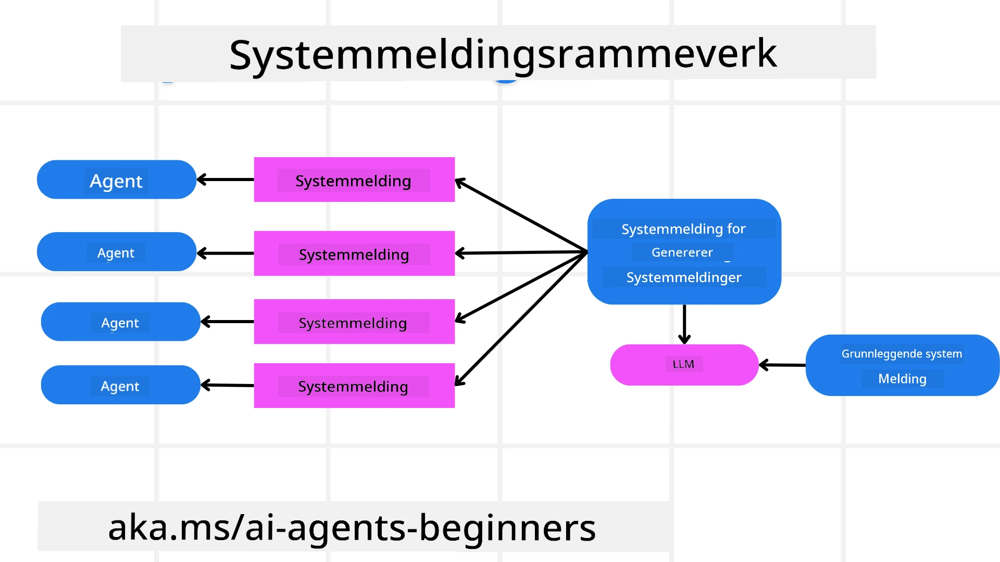
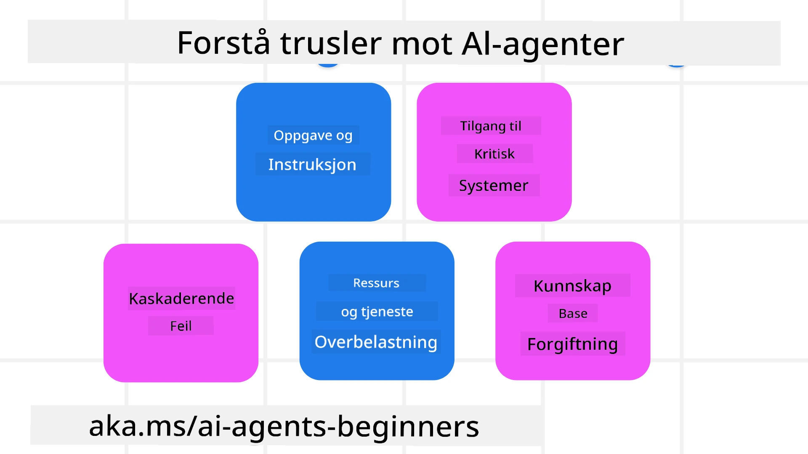
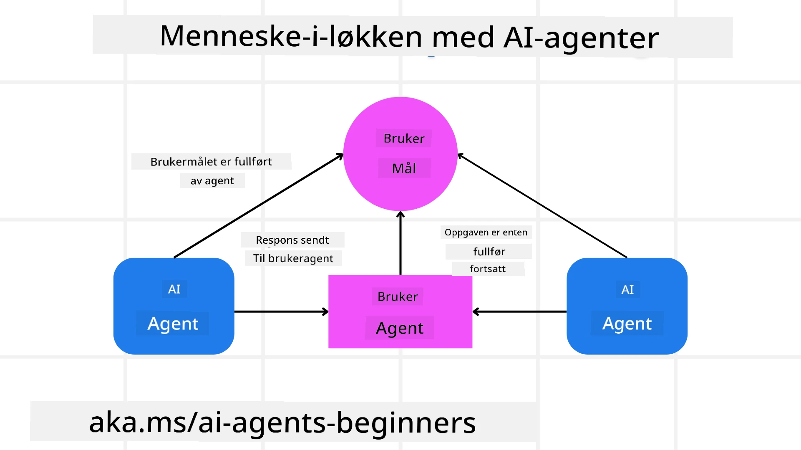

[](https://youtu.be/iZKkMEGBCUQ?si=Q-kEbcyHUMPoHp8L)

> _(Klikk på bildet over for å se videoen av denne leksjonen)_

# Bygge pålitelige AI‑agenter

## Introduksjon

Denne leksjonen vil dekke:

- Hvordan bygge og distribuere sikre og effektive AI‑agenter
- Viktige sikkerhetshensyn når du utvikler AI‑agenter.
- Hvordan opprettholde data- og brukerpersonvern når du utvikler AI‑agenter.

## Læringsmål

Etter å ha fullført denne leksjonen, vil du vite hvordan du kan:

- Identifisere og redusere risikoer ved opprettelse av AI‑agenter.
- Implementere sikkerhetstiltak for å sikre at data og tilgang håndteres riktig.
- Opprette AI‑agenter som ivaretar personvern og gir en god brukeropplevelse.

## Sikkerhet

La oss først se på hvordan man bygger sikre agentbaserte applikasjoner. Sikkerhet betyr at AI‑agenten opptrer som designet. Som utviklere av agentbaserte applikasjoner har vi metoder og verktøy for å maksimere sikkerheten:

### Bygge et rammeverk for systemmeldinger

Hvis du noen gang har bygget en AI‑applikasjon ved hjelp av store språkmodeller (LLMs), kjenner du viktigheten av å designe en robust systemprompt eller systemmelding. Disse promptene etablerer metareglene, instruksjonene og retningslinjene for hvordan LLM-en skal interagere med brukeren og dataene.

For AI‑agenter er systemprompten enda viktigere siden AI‑agentene vil trenge svært spesifikke instruksjoner for å fullføre oppgavene vi har designet for dem.

For å lage skalerbare systemprompter kan vi bruke et rammeverk for systemmeldinger for å bygge en eller flere agenter i applikasjonen vår:



#### Trinn 1: Opprett en meta systemmelding 

Meta‑prompten vil bli brukt av en LLM for å generere systempromptene for agentene vi oppretter. Vi utformer den som en mal slik at vi effektivt kan opprette flere agenter ved behov.

Her er et eksempel på en meta systemmelding vi ville gi til LLM-en:

```plaintext
You are an expert at creating AI agent assistants. 
You will be provided a company name, role, responsibilities and other
information that you will use to provide a system prompt for.
To create the system prompt, be descriptive as possible and provide a structure that a system using an LLM can better understand the role and responsibilities of the AI assistant. 
```

#### Trinn 2: Opprett en grunnleggende prompt

Neste steg er å lage en grunnleggende prompt som beskriver AI‑agenten. Du bør inkludere agentens rolle, oppgavene agenten skal utføre, og eventuelle andre ansvarsområder.

Her er et eksempel:

```plaintext
You are a travel agent for Contoso Travel that is great at booking flights for customers. To help customers you can perform the following tasks: lookup available flights, book flights, ask for preferences in seating and times for flights, cancel any previously booked flights and alert customers on any delays or cancellations of flights.  
```

#### Trinn 3: Gi grunnleggende systemmelding til LLM

Nå kan vi optimalisere denne systemmeldingen ved å gi meta-systemmeldingen som systemmelding sammen med vår grunnleggende systemmelding.

Dette vil produsere en systemmelding som er bedre utformet for å veilede AI‑agentene våre:

```markdown
**Company Name:** Contoso Travel  
**Role:** Travel Agent Assistant

**Objective:**  
You are an AI-powered travel agent assistant for Contoso Travel, specializing in booking flights and providing exceptional customer service. Your main goal is to assist customers in finding, booking, and managing their flights, all while ensuring that their preferences and needs are met efficiently.

**Key Responsibilities:**

1. **Flight Lookup:**
    
    - Assist customers in searching for available flights based on their specified destination, dates, and any other relevant preferences.
    - Provide a list of options, including flight times, airlines, layovers, and pricing.
2. **Flight Booking:**
    
    - Facilitate the booking of flights for customers, ensuring that all details are correctly entered into the system.
    - Confirm bookings and provide customers with their itinerary, including confirmation numbers and any other pertinent information.
3. **Customer Preference Inquiry:**
    
    - Actively ask customers for their preferences regarding seating (e.g., aisle, window, extra legroom) and preferred times for flights (e.g., morning, afternoon, evening).
    - Record these preferences for future reference and tailor suggestions accordingly.
4. **Flight Cancellation:**
    
    - Assist customers in canceling previously booked flights if needed, following company policies and procedures.
    - Notify customers of any necessary refunds or additional steps that may be required for cancellations.
5. **Flight Monitoring:**
    
    - Monitor the status of booked flights and alert customers in real-time about any delays, cancellations, or changes to their flight schedule.
    - Provide updates through preferred communication channels (e.g., email, SMS) as needed.

**Tone and Style:**

- Maintain a friendly, professional, and approachable demeanor in all interactions with customers.
- Ensure that all communication is clear, informative, and tailored to the customer's specific needs and inquiries.

**User Interaction Instructions:**

- Respond to customer queries promptly and accurately.
- Use a conversational style while ensuring professionalism.
- Prioritize customer satisfaction by being attentive, empathetic, and proactive in all assistance provided.

**Additional Notes:**

- Stay updated on any changes to airline policies, travel restrictions, and other relevant information that could impact flight bookings and customer experience.
- Use clear and concise language to explain options and processes, avoiding jargon where possible for better customer understanding.

This AI assistant is designed to streamline the flight booking process for customers of Contoso Travel, ensuring that all their travel needs are met efficiently and effectively.

```

#### Trinn 4: Iterer og forbedre

Verdien av dette systemmeldingsrammeverket er at det gjør det enklere å skalere opprettelsen av systemmeldinger for flere agenter, samt å forbedre systemmeldingene dine over tid. Det er sjelden du får en systemmelding som fungerer perfekt første gang for hele brukstilfellet ditt. Muligheten til å gjøre små justeringer og forbedringer ved å endre den grunnleggende systemmeldingen og kjøre den gjennom systemet gjør at du kan sammenligne og evaluere resultater.

## Forstå trusler

For å bygge pålitelige AI‑agenter er det viktig å forstå og redusere risikoene og truslene mot AI‑agenten din. La oss se på noen av de ulike truslene mot AI‑agenter og hvordan du kan planlegge og forberede deg bedre på dem.



### Oppgave og instruksjon

**Beskrivelse:** Angripere forsøker å endre instruksjonene eller målene til AI‑agenten gjennom prompting eller manipulering av inndata.

**Tiltak**: Utfør valideringssjekker og inputfiltre for å oppdage potensielt farlige prompts før de behandles av AI‑agenten. Siden disse angrepene vanligvis krever hyppig interaksjon med agenten, er det å begrense antall runder i en samtale en annen måte å forhindre denne typen angrep på.

### Tilgang til kritiske systemer

**Beskrivelse**: Hvis en AI‑agent har tilgang til systemer og tjenester som lagrer sensitive data, kan angripere kompromittere kommunikasjonen mellom agenten og disse tjenestene. Dette kan være direkte angrep eller indirekte forsøk på å skaffe informasjon om disse systemene gjennom agenten.

**Tiltak**: AI‑agenter bør ha tilgang til systemer kun etter prinsippet om behov‑tilgang for å forhindre denne typen angrep. Kommunikasjonen mellom agenten og systemet bør også være sikker. Implementering av autentisering og tilgangskontroll er en annen måte å beskytte denne informasjonen på.

### Overbelastning av ressurser og tjenester

**Beskrivelse:** AI‑agenter kan få tilgang til ulike verktøy og tjenester for å fullføre oppgaver. Angripere kan bruke denne evnen til å angripe disse tjenestene ved å sende et stort antall forespørsler gjennom AI‑agenten, noe som kan føre til systemfeil eller høye kostnader.

**Tiltak:** Implementer retningslinjer for å begrense antallet forespørsler en AI‑agent kan gjøre til en tjeneste. Å begrense antall samtalerunder og forespørsler til AI‑agenten din er en annen måte å forhindre denne typen angrep på.

### Forgiftning av kunnskapsbasen

**Beskrivelse:** Denne typen angrep retter seg ikke direkte mot AI‑agenten, men mot kunnskapsbasen og andre tjenester som AI‑agenten vil bruke. Dette kan innebære å korrumpere dataene eller informasjonen som AI‑agenten vil bruke for å fullføre en oppgave, noe som fører til partiske eller utilsiktede svar til brukeren.

**Tiltak:** Utfør jevnlig verifisering av dataene som AI‑agenten vil bruke i sine arbeidsflyter. Sørg for at tilgangen til disse dataene er sikker og kun kan endres av betrodde personer for å unngå denne typen angrep.

### Kaskaderende feil

**Beskrivelse:** AI‑agenter får tilgang til ulike verktøy og tjenester for å utføre oppgaver. Feil forårsaket av angripere kan føre til svikt i andre systemer som AI‑agenten er koblet til, noe som gjør at angrepet sprer seg og blir vanskeligere å feilsøke.

**Tiltak**: En metode for å unngå dette er å la AI‑agenten operere i et begrenset miljø, for eksempel ved å utføre oppgaver i en Docker‑container, for å forhindre direkte systemangrep. Å opprette fallback‑mekanismer og retry‑logikk når visse systemer svarer med en feil er en annen måte å forhindre større systemfeil på.

## Menneske-i-løkken

En annen effektiv måte å bygge pålitelige AI‑agentsystemer på er å bruke en menneske‑i‑løkken. Dette skaper en flyt hvor brukerne kan gi tilbakemelding til agentene under kjøringen. Brukerne fungerer i praksis som agenter i et multi‑agent‑system og ved å gi godkjenning eller terminering av den kjørende prosessen.



Her er et kodeeksempel som bruker Microsoft Agent Framework for å vise hvordan dette konseptet implementeres:

```python
import os
from agent_framework.azure import AzureAIProjectAgentProvider
from azure.identity import AzureCliCredential

# Opprett leverandøren med menneskelig godkjenning
provider = AzureAIProjectAgentProvider(
    credential=AzureCliCredential(),
)

# Opprett agenten med et trinn for menneskelig godkjenning
response = provider.create_response(
    input="Write a 4-line poem about the ocean.",
    instructions="You are a helpful assistant. Ask for user approval before finalizing.",
)

# Brukeren kan gjennomgå og godkjenne svaret
print(response.output_text)
user_input = input("Do you approve? (APPROVE/REJECT): ")
if user_input == "APPROVE":
    print("Response approved.")
else:
    print("Response rejected. Revising...")
```

## Konklusjon

Å bygge pålitelige AI‑agenter krever nøye design, robuste sikkerhetstiltak og kontinuerlig iterasjon. Ved å implementere strukturerte meta‑promptingsystemer, forstå potensielle trusler og anvende avbøtningstiltak, kan utviklere skape AI‑agenter som både er sikre og effektive. I tillegg sikrer innlemming av en menneske‑i‑løkken‑tilnærming at AI‑agentene forblir i tråd med brukernes behov samtidig som risiko minimeres. Etter hvert som AI fortsetter å utvikle seg, vil det å opprettholde en proaktiv holdning til sikkerhet, personvern og etiske hensyn være avgjørende for å bygge tillit og pålitelighet i AI‑drevne systemer.

### Har du flere spørsmål om å bygge pålitelige AI‑agenter?

Bli med i [Microsoft Foundry Discord](https://aka.ms/ai-agents/discord) for å møte andre lærende, delta på kontortid og få svar på spørsmål om AI‑agentene dine.

## Ytterligere ressurser

- <a href="https://learn.microsoft.com/azure/ai-studio/responsible-use-of-ai-overview" target="_blank">Oversikt over ansvarlig AI</a>
- <a href="https://learn.microsoft.com/azure/ai-studio/concepts/evaluation-approach-gen-ai" target="_blank">Evaluering av generative AI‑modeller og AI‑applikasjoner</a>
- <a href="https://learn.microsoft.com/azure/ai-services/openai/concepts/system-message?context=%2Fazure%2Fai-studio%2Fcontext%2Fcontext&tabs=top-techniques" target="_blank">Sikkerhetssystemmeldinger</a>
- <a href="https://blogs.microsoft.com/wp-content/uploads/prod/sites/5/2022/06/Microsoft-RAI-Impact-Assessment-Template.pdf?culture=en-us&country=us" target="_blank">Mal for risikovurdering</a>

## Previous Lesson

[Agentic RAG](../05-agentic-rag/README.md)

## Next Lesson

[Planning Design Pattern](../07-planning-design/README.md)

---

<!-- CO-OP TRANSLATOR DISCLAIMER START -->
Ansvarsfraskrivelse:
Dette dokumentet er oversatt ved hjelp av AI-oversettelsestjenesten Co-op Translator (https://github.com/Azure/co-op-translator). Selv om vi streber etter nøyaktighet, vennligst vær oppmerksom på at automatiske oversettelser kan inneholde feil eller unøyaktigheter. Det opprinnelige dokumentet på originalspråket bør betraktes som den autoritative kilden. For kritisk informasjon anbefales profesjonell, menneskelig oversettelse. Vi er ikke ansvarlige for eventuelle misforståelser eller feiltolkninger som oppstår ved bruk av denne oversettelsen.
<!-- CO-OP TRANSLATOR DISCLAIMER END -->