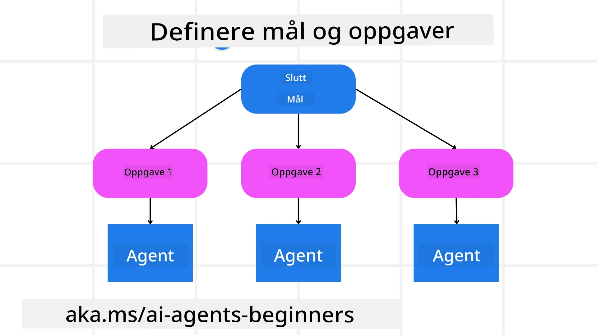

[](https://youtu.be/kPfJ2BrBCMY?si=9pYpPXp0sSbK91Dr)

> _(Klikk på bildet ovenfor for å se videoen til denne leksjonen)_

# Planleggingsdesign

## Introduksjon

Denne leksjonen vil dekke

* Definere et klart overordnet mål og bryte en kompleks oppgave ned i håndterbare oppgaver.
* Utnytte strukturert utdata for mer pålitelige og maskinlesbare svar.
* Bruke en hendelsesdrevet tilnærming for å håndtere dynamiske oppgaver og uventede inndata.

## Læringsmål

Etter å ha fullført denne leksjonen, vil du ha en forståelse om:

* Identifisere og sette et overordnet mål for en AI-agent, slik at den klart vet hva som skal oppnås.
* Dele opp en kompleks oppgave i håndterbare deloppgaver og organisere dem i en logisk rekkefølge.
* Utstyre agenter med riktige verktøy (f.eks. søkeverktøy eller verktøy for dataanalyse), avgjøre når og hvordan de brukes, og håndtere uventede situasjoner som oppstår.
* Evaluere resultatene av deloppgaver, måle ytelse, og iterere på handlinger for å forbedre sluttresultatet.

## Definere det overordnede målet og bryte ned en oppgave



De fleste oppgaver i den virkelige verden er for komplekse til å løses i ett steg. En AI-agent trenger et konsist mål for å styre planleggingen og handlingene sine. For eksempel, vurder målet:

    "Generer en 3-dagers reiserute."

Selv om det er enkelt å uttale, trenger det fortsatt presisering. Jo klarere målet er, desto bedre kan agenten (og eventuelle menneskelige samarbeidspartnere) fokusere på å oppnå riktig resultat, for eksempel å lage en omfattende reiserute med flyalternativer, hotellforslag og aktivitetsforslag.

### Oppgavedekomponering

Store eller intrikate oppgaver blir mer håndterlige når de deles inn i mindre, målrettede deloppgaver.
For reiseruteeksempelet kan du dele målet inn i:

* Flybestilling
* Hotellbestilling
* Bilutleie
* Personalisering

Hver deloppgave kan deretter håndteres av dedikerte agenter eller prosesser. En agent kan spesialisere seg på å finne de beste flytilbudene, en annen fokuserer på hotellbestillinger, og så videre. En koordinerende eller «nedstrøms» agent kan deretter samle disse resultatene til én sammenhengende reiserute til sluttbrukeren.

Denne modulære tilnærmingen tillater også inkrementelle forbedringer. For eksempel kan du legge til spesialiserte agenter for Matanbefalinger eller lokale aktivitetsforslag og forbedre reiseruten over tid.

### Strukturert utdata

Store språkmodeller (LLMs) kan generere strukturert utdata (f.eks. JSON) som er enklere for nedstrømsagenter eller -tjenester å analysere og behandle. Dette er spesielt nyttig i en multi-agent-kontekst, hvor vi kan iverksette disse oppgavene etter at planleggingsutdataene er mottatt.

Følgende Python-utdrag demonstrerer en enkel planleggingsagent som deler et mål inn i deloppgaver og genererer en strukturert plan:

```python
from pydantic import BaseModel
from enum import Enum
from typing import List, Optional, Union
import json
import os
from typing import Optional
from pprint import pprint
from agent_framework.azure import AzureAIProjectAgentProvider
from azure.identity import AzureCliCredential

class AgentEnum(str, Enum):
    FlightBooking = "flight_booking"
    HotelBooking = "hotel_booking"
    CarRental = "car_rental"
    ActivitiesBooking = "activities_booking"
    DestinationInfo = "destination_info"
    DefaultAgent = "default_agent"
    GroupChatManager = "group_chat_manager"

# Reise deloppgavemodell
class TravelSubTask(BaseModel):
    task_details: str
    assigned_agent: AgentEnum  # vi ønsker å tildele oppgaven til agenten

class TravelPlan(BaseModel):
    main_task: str
    subtasks: List[TravelSubTask]
    is_greeting: bool

provider = AzureAIProjectAgentProvider(credential=AzureCliCredential())

# Definer brukermeldingen
system_prompt = """You are a planner agent.
    Your job is to decide which agents to run based on the user's request.
    Provide your response in JSON format with the following structure:
{'main_task': 'Plan a family trip from Singapore to Melbourne.',
 'subtasks': [{'assigned_agent': 'flight_booking',
               'task_details': 'Book round-trip flights from Singapore to '
                               'Melbourne.'}
    Below are the available agents specialised in different tasks:
    - FlightBooking: For booking flights and providing flight information
    - HotelBooking: For booking hotels and providing hotel information
    - CarRental: For booking cars and providing car rental information
    - ActivitiesBooking: For booking activities and providing activity information
    - DestinationInfo: For providing information about destinations
    - DefaultAgent: For handling general requests"""

user_message = "Create a travel plan for a family of 2 kids from Singapore to Melbourne"

response = client.create_response(input=user_message, instructions=system_prompt)

response_content = response.output_text
pprint(json.loads(response_content))
```

### Planleggingsagent med multi-agent-orkestrering

I dette eksempelet mottar en Semantic Router Agent en brukers forespørsel (f.eks. "Jeg trenger en hotellplan for turen min.").

Planleggeren gjør deretter:

* Mottar hotellplanen: Planleggeren tar brukerens melding og, basert på et systemprompt (inkludert tilgjengelige agentdetaljer), genererer en strukturert reiseplan.
* Lister agenter og deres verktøy: Agentregisteret inneholder en liste over agenter (f.eks. for fly, hotell, bilutleie og aktiviteter) sammen med funksjonene eller verktøyene de tilbyr.
* Ruter planen til respektive agenter: Avhengig av antall deloppgaver sender planleggeren enten meldingen direkte til en dedikert agent (for enkeltoppgave-scenarier) eller koordinerer via en gruppechat-manager for fler-agent-samarbeid.
* Oppsummerer utfallet: Til slutt oppsummerer planleggeren den genererte planen for klarhet.
Følgende Python-kodeeksempel illustrerer disse trinnene:

```python

from pydantic import BaseModel

from enum import Enum
from typing import List, Optional, Union

class AgentEnum(str, Enum):
    FlightBooking = "flight_booking"
    HotelBooking = "hotel_booking"
    CarRental = "car_rental"
    ActivitiesBooking = "activities_booking"
    DestinationInfo = "destination_info"
    DefaultAgent = "default_agent"
    GroupChatManager = "group_chat_manager"

# Reise-underoppgave-modell

class TravelSubTask(BaseModel):
    task_details: str
    assigned_agent: AgentEnum # vi ønsker å tildele oppgaven til agenten

class TravelPlan(BaseModel):
    main_task: str
    subtasks: List[TravelSubTask]
    is_greeting: bool
import json
import os
from typing import Optional

from agent_framework.azure import AzureAIProjectAgentProvider
from azure.identity import AzureCliCredential

# Opprett klienten

provider = AzureAIProjectAgentProvider(credential=AzureCliCredential())

from pprint import pprint

# Definer brukermeldingen

system_prompt = """You are a planner agent.
    Your job is to decide which agents to run based on the user's request.
    Below are the available agents specialized in different tasks:
    - FlightBooking: For booking flights and providing flight information
    - HotelBooking: For booking hotels and providing hotel information
    - CarRental: For booking cars and providing car rental information
    - ActivitiesBooking: For booking activities and providing activity information
    - DestinationInfo: For providing information about destinations
    - DefaultAgent: For handling general requests"""

user_message = "Create a travel plan for a family of 2 kids from Singapore to Melbourne"

response = client.create_response(input=user_message, instructions=system_prompt)

response_content = response.output_text

# Skriv ut responsinnholdet etter å ha lastet det inn som JSON

pprint(json.loads(response_content))
```

Det som følger er utdataene fra forrige kode, og du kan deretter bruke denne strukturerte utdataen til å rute til `assigned_agent` og oppsummere reiseplanen for sluttbrukeren.

```json
{
    "is_greeting": "False",
    "main_task": "Plan a family trip from Singapore to Melbourne.",
    "subtasks": [
        {
            "assigned_agent": "flight_booking",
            "task_details": "Book round-trip flights from Singapore to Melbourne."
        },
        {
            "assigned_agent": "hotel_booking",
            "task_details": "Find family-friendly hotels in Melbourne."
        },
        {
            "assigned_agent": "car_rental",
            "task_details": "Arrange a car rental suitable for a family of four in Melbourne."
        },
        {
            "assigned_agent": "activities_booking",
            "task_details": "List family-friendly activities in Melbourne."
        },
        {
            "assigned_agent": "destination_info",
            "task_details": "Provide information about Melbourne as a travel destination."
        }
    ]
}
```

En eksempel-notatbok med kodeeksemplet ovenfor er tilgjengelig [her](07-python-agent-framework.ipynb).

### Iterativ planlegging

Noen oppgaver krever en fram-og-tilbake eller re-planlegging, der utfallet av én deloppgave påvirker den neste. For eksempel, hvis agenten oppdager et uventet dataformat under flybestillinger, kan den måtte tilpasse strategien før den går videre til hotellbestillinger.

I tillegg kan brukerfeedback (f.eks. at et menneske bestemmer seg for at de foretrekker et tidligere fly) utløse en delvis re-planlegging. Denne dynamiske, iterative tilnærmingen sikrer at den endelige løsningen stemmer overens med virkelige begrensninger og brukeres endrede preferanser.

f.eks. kodeeksempel

```python
from agent_framework.azure import AzureAIProjectAgentProvider
from azure.identity import AzureCliCredential
#.. samme som forrige kode og videreformidle brukerhistorikk og gjeldende plan

system_prompt = """You are a planner agent to optimize the
    Your job is to decide which agents to run based on the user's request.
    Below are the available agents specialized in different tasks:
    - FlightBooking: For booking flights and providing flight information
    - HotelBooking: For booking hotels and providing hotel information
    - CarRental: For booking cars and providing car rental information
    - ActivitiesBooking: For booking activities and providing activity information
    - DestinationInfo: For providing information about destinations
    - DefaultAgent: For handling general requests"""

user_message = "Create a travel plan for a family of 2 kids from Singapore to Melbourne"

response = client.create_response(
    input=user_message,
    instructions=system_prompt,
    context=f"Previous travel plan - {TravelPlan}",
)
# .. planlegg på nytt og send oppgavene til de respektive agentene
```

For mer omfattende planlegging, sjekk ut Magentic One <a href="https://www.microsoft.com/research/articles/magentic-one-a-generalist-multi-agent-system-for-solving-complex-tasks" target="_blank">Blogginnlegg</a> for å løse komplekse oppgaver.

## Sammendrag

I denne artikkelen har vi sett på et eksempel på hvordan vi kan lage en planlegger som dynamisk kan velge de tilgjengelige agentene som er definert. Planleggerens utdata deler opp oppgavene og tildeler agentene slik at de kan utføres. Det forutsettes at agentene har tilgang til funksjonene/verktøyene som kreves for å utføre oppgaven. I tillegg til agentene kan du inkludere andre mønstre som refleksjon, oppsummeringskomponent og round robin-chat for ytterligere tilpasning.

## Ytterligere ressurser

Magentic One - A Generalist multi-agent system for solving complex tasks and has achieved impressive results on multiple challenging agentic benchmarks. Reference: <a href="https://www.microsoft.com/research/articles/magentic-one-a-generalist-multi-agent-system-for-solving-complex-tasks" target="_blank">Magentic One</a>. I denne implementasjonen oppretter orkestratoren oppgave-spesifikke planer og delegerer disse oppgavene til de tilgjengelige agentene. I tillegg til planlegging benytter orkestratoren også en sporingsmekanisme for å overvåke fremdriften i oppgaven og re-planlegger etter behov.

### Har du flere spørsmål om planleggingsdesignmønsteret?

Bli med i [Microsoft Foundry Discord](https://aka.ms/ai-agents/discord) for å møte andre lærende, delta på kontortid og få spørsmål om AI-agenter besvart.

## Forrige leksjon

[Bygge pålitelige AI-agenter](../06-building-trustworthy-agents/README.md)

## Neste leksjon

[Multi-agent designmønster](../08-multi-agent/README.md)

---

<!-- CO-OP TRANSLATOR DISCLAIMER START -->
Ansvarsfraskrivelse:
Dette dokumentet er oversatt ved hjelp av AI-oversettelsestjenesten [Co-op Translator](https://github.com/Azure/co-op-translator). Selv om vi streber etter nøyaktighet, må du være oppmerksom på at automatiske oversettelser kan inneholde feil eller unøyaktigheter. Det opprinnelige dokumentet på originalspråket bør anses som den autoritative kilden. For kritisk informasjon anbefales profesjonell menneskelig oversettelse. Vi er ikke ansvarlige for eventuelle misforståelser eller feiltolkninger som oppstår ved bruk av denne oversettelsen.
<!-- CO-OP TRANSLATOR DISCLAIMER END -->