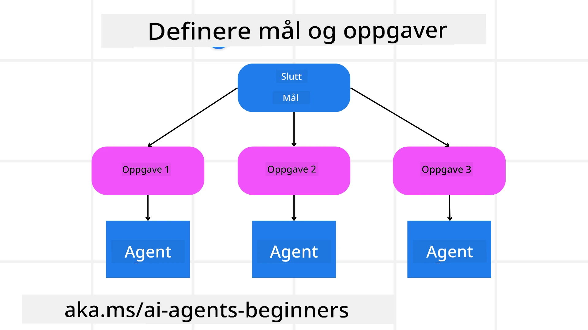

[](https://youtu.be/kPfJ2BrBCMY?si=9pYpPXp0sSbK91Dr)

> _(Klikk på bildet over for å se video av denne leksjonen)_

# Planleggingsdesign

## Introduksjon

Denne leksjonen vil dekke

* Definere et klart overordnet mål og bryte ned en kompleks oppgave i håndterbare oppgaver.
* Utnytte strukturert output for mer pålitelige og maskinlesbare svar.
* Anvende en hendelsesdrevet tilnærming for å håndtere dynamiske oppgaver og uventede input.

## Læringsmål

Etter å ha fullført denne leksjonen vil du ha en forståelse av:

* Identifisere og sette et overordnet mål for en AI-agent, slik at den tydelig vet hva som skal oppnås.
* Dele opp en kompleks oppgave i håndterbare deloppgaver og organisere dem i en logisk sekvens.
* Utstyre agenter med riktige verktøy (f.eks. søkeverktøy eller dataanalyseverktøy), bestemme når og hvordan de skal brukes, og håndtere uventede situasjoner som oppstår.
* Evaluere deloppgavens resultater, måle ytelse og iterere på handlinger for å forbedre det endelige resultatet.

## Definere det overordnede målet og bryte ned en oppgave



De fleste oppgaver i virkeligheten er for komplekse til å håndteres i ett enkelt trinn. En AI-agent trenger et konsist mål for å styre planlegging og handlinger. For eksempel, vurder målet:

    "Generere en 3-dagers reiseplan."

Selv om det er enkelt å uttale, krever det fortsatt presisering. Jo klarere målet er, desto bedre kan agenten (og eventuelle menneskelige samarbeidspartnere) fokusere på å oppnå riktig resultat, som å lage en omfattende reiseplan med flyalternativer, hotellanbefalinger og aktivitetsforslag.

### Oppgavedekomponering

Store eller innviklede oppgaver blir mer håndterbare når de deles opp i mindre, målorienterte deloppgaver.
For eksempel kan du bryte ned målet for reiseplanen i:

* Flybestilling
* Hotellbestilling
* Bilutleie
* Personalisering

Hver deloppgave kan deretter håndteres av dedikerte agenter eller prosesser. En agent kan spesialisere seg på å søke etter de beste flytilbudene, en annen fokuserer på hotellbestillinger, og så videre. En koordinerende eller «nedstrøms» agent kan så sette sammen disse resultatene til én helhetlig reiseplan for sluttbrukeren.

Denne modulære tilnærmingen tillater også inkrementelle forbedringer. For eksempel kan du legge til spesialiserte agenter for matanbefalinger eller lokale aktivitetsforslag og finpusse reiseplanen over tid.

### Strukturert output

Store språkmodeller (LLMs) kan generere strukturert output (f.eks. JSON) som er enklere for nedstrøms agenter eller tjenester å tolke og prosessere. Dette er spesielt nyttig i en fler-agent-kontekst, hvor vi kan utføre disse oppgavene etter at planleggingsoutput er mottatt.

Følgende Python-eksempel demonstrerer en enkel planleggingsagent som dekomponerer et mål i deloppgaver og genererer en strukturert plan:

```python
from pydantic import BaseModel
from enum import Enum
from typing import List, Optional, Union
import json
import os
from typing import Optional
from pprint import pprint
from agent_framework.foundry import FoundryChatClient
from azure.identity import AzureCliCredential

class AgentEnum(str, Enum):
    FlightBooking = "flight_booking"
    HotelBooking = "hotel_booking"
    CarRental = "car_rental"
    ActivitiesBooking = "activities_booking"
    DestinationInfo = "destination_info"
    DefaultAgent = "default_agent"
    GroupChatManager = "group_chat_manager"

# Reise deloppgave modell
class TravelSubTask(BaseModel):
    task_details: str
    assigned_agent: AgentEnum  # vi ønsker å tildele oppgaven til agenten

class TravelPlan(BaseModel):
    main_task: str
    subtasks: List[TravelSubTask]
    is_greeting: bool

provider = FoundryChatClient(
    project_endpoint=os.environ["AZURE_AI_PROJECT_ENDPOINT"],
    model=os.environ["AZURE_AI_MODEL_DEPLOYMENT_NAME"],
    credential=AzureCliCredential(),
)

# Definer brukermeldingen
system_prompt = """You are a planner agent.
    Your job is to decide which agents to run based on the user's request.
    Provide your response in JSON format with the following structure:
{'main_task': 'Plan a family trip from Singapore to Melbourne.',
 'subtasks': [{'assigned_agent': 'flight_booking',
               'task_details': 'Book round-trip flights from Singapore to '
                               'Melbourne.'}
    Below are the available agents specialised in different tasks:
    - FlightBooking: For booking flights and providing flight information
    - HotelBooking: For booking hotels and providing hotel information
    - CarRental: For booking cars and providing car rental information
    - ActivitiesBooking: For booking activities and providing activity information
    - DestinationInfo: For providing information about destinations
    - DefaultAgent: For handling general requests"""

user_message = "Create a travel plan for a family of 2 kids from Singapore to Melbourne"

response = client.create_response(input=user_message, instructions=system_prompt)

response_content = response.output_text
pprint(json.loads(response_content))
```

### Planleggingsagent med fler-agent-samarbeid

I dette eksempelet mottar en Semantisk Router Agent en brukerforespørsel (f.eks. "Jeg trenger en hotellplan for turen min.").

Planleggeren gjør deretter:

* Mottar Hotellplanen: Planleggeren tar brukerens melding og, basert på et systemprompt (inkludert tilgjengelige agentdetaljer), genererer en strukturert reiseplan.
* Lister agenter og deres verktøy: Agentregisteret inneholder en liste over agenter (f.eks. for fly, hotell, bilutleie og aktiviteter) sammen med funksjonene eller verktøyene de tilbyr.
* Ruter planen til respektive agenter: Avhengig av antall deloppgaver sender planleggeren enten meldingen direkte til en dedikert agent (for enkeltoppgavescenarier) eller koordinerer via en gruppechat-administrator for fler-agent-samarbeid.
* Oppsummerer resultatet: Til slutt oppsummerer planleggeren den genererte planen for klarhet.
Følgende Python-kodeeksempel illustrerer disse trinnene:

```python

from pydantic import BaseModel

from enum import Enum
from typing import List, Optional, Union

class AgentEnum(str, Enum):
    FlightBooking = "flight_booking"
    HotelBooking = "hotel_booking"
    CarRental = "car_rental"
    ActivitiesBooking = "activities_booking"
    DestinationInfo = "destination_info"
    DefaultAgent = "default_agent"
    GroupChatManager = "group_chat_manager"

# Reise Underoppgave Modell

class TravelSubTask(BaseModel):
    task_details: str
    assigned_agent: AgentEnum # vi vil tildele oppgaven til agenten

class TravelPlan(BaseModel):
    main_task: str
    subtasks: List[TravelSubTask]
    is_greeting: bool
import json
import os
from typing import Optional

from agent_framework.foundry import FoundryChatClient
from azure.identity import AzureCliCredential

# Opprett klienten

provider = FoundryChatClient(
    project_endpoint=os.environ["AZURE_AI_PROJECT_ENDPOINT"],
    model=os.environ["AZURE_AI_MODEL_DEPLOYMENT_NAME"],
    credential=AzureCliCredential(),
)

from pprint import pprint

# Definer brukermeldingen

system_prompt = """You are a planner agent.
    Your job is to decide which agents to run based on the user's request.
    Below are the available agents specialized in different tasks:
    - FlightBooking: For booking flights and providing flight information
    - HotelBooking: For booking hotels and providing hotel information
    - CarRental: For booking cars and providing car rental information
    - ActivitiesBooking: For booking activities and providing activity information
    - DestinationInfo: For providing information about destinations
    - DefaultAgent: For handling general requests"""

user_message = "Create a travel plan for a family of 2 kids from Singapore to Melbourne"

response = client.create_response(input=user_message, instructions=system_prompt)

response_content = response.output_text

# Skriv ut responsinnholdet etter å ha lastet det som JSON

pprint(json.loads(response_content))
```

Det følgende er output fra forrige kode, og du kan deretter bruke denne strukturerte outputen for å rute til `assigned_agent` og oppsummere reiseplanen for sluttbrukeren.

```json
{
    "is_greeting": "False",
    "main_task": "Plan a family trip from Singapore to Melbourne.",
    "subtasks": [
        {
            "assigned_agent": "flight_booking",
            "task_details": "Book round-trip flights from Singapore to Melbourne."
        },
        {
            "assigned_agent": "hotel_booking",
            "task_details": "Find family-friendly hotels in Melbourne."
        },
        {
            "assigned_agent": "car_rental",
            "task_details": "Arrange a car rental suitable for a family of four in Melbourne."
        },
        {
            "assigned_agent": "activities_booking",
            "task_details": "List family-friendly activities in Melbourne."
        },
        {
            "assigned_agent": "destination_info",
            "task_details": "Provide information about Melbourne as a travel destination."
        }
    ]
}
```

Et eksempelnotatbok med forrige kodeeksempel er tilgjengelig [her](./code_samples/07-python-agent-framework.ipynb).

### Iterativ planlegging

Noen oppgaver krever en frem og tilbake eller re-planlegging, der utfallet av én deloppgave påvirker neste. For eksempel, hvis agenten oppdager et uventet dataformat mens den bestiller fly, kan den måtte tilpasse strategien før den går videre til hotellbestillinger.

I tillegg kan tilbakemeldinger fra brukeren (f.eks. at et menneske bestemmer seg for at de foretrekker en tidligere flyvning) utløse en delvis re-planlegging. Denne dynamiske, iterative tilnærmingen sikrer at sluttløsningen stemmer overens med virkelige begrensninger og brukeres endrede preferanser.

for eksempel kode

```python
import os
from agent_framework.foundry import FoundryChatClient
from azure.identity import AzureCliCredential
#.. samme som forrige kode og videresend brukerhistorikken, gjeldende plan

system_prompt = """You are a planner agent to optimize the
    Your job is to decide which agents to run based on the user's request.
    Below are the available agents specialized in different tasks:
    - FlightBooking: For booking flights and providing flight information
    - HotelBooking: For booking hotels and providing hotel information
    - CarRental: For booking cars and providing car rental information
    - ActivitiesBooking: For booking activities and providing activity information
    - DestinationInfo: For providing information about destinations
    - DefaultAgent: For handling general requests"""

user_message = "Create a travel plan for a family of 2 kids from Singapore to Melbourne"

response = client.create_response(
    input=user_message,
    instructions=system_prompt,
    context=f"Previous travel plan - {TravelPlan}",
)
# .. lag ny plan og send oppgavene til respektive agenter
```

For mer omfattende planlegging, sjekk ut Magnetic One <a href="https://www.microsoft.com/research/articles/magentic-one-a-generalist-multi-agent-system-for-solving-complex-tasks" target="_blank">Blogginnlegg</a> for løsning av komplekse oppgaver.

## Oppsummering

I denne artikkelen har vi sett på et eksempel på hvordan vi kan lage en planlegger som dynamisk kan velge de tilgjengelige agentene som er definert. Outputen fra planleggeren dekomponerer oppgavene og tildeler agentene slik at de kan utføres. Det forutsettes at agentene har tilgang til nødvendige funksjoner/verktøy for å utføre oppgaven. I tillegg til agentene kan du inkludere andre mønstre som refleksjon, oppsummering og round robin-chat for ytterligere tilpasning.

## Ytterligere ressurser

Magnetisk One - Et generalist fler-agent-system for å løse komplekse oppgaver som har oppnådd imponerende resultater på flere utfordrende agent-benchmarks. Referanse: <a href="https://www.microsoft.com/research/articles/magentic-one-a-generalist-multi-agent-system-for-solving-complex-tasks" target="_blank">Magnetic One</a>. I denne implementeringen lager orkestratoren oppgavespesifikke planer og delegerer disse oppgavene til tilgjengelige agenter. I tillegg til planlegging benytter orkestratoren en sporingsmekanisme for å overvåke fremdriften i oppgaven og re-planlegger etter behov.

### Har du flere spørsmål om Planleggingsdesignmønsteret?

Bli med i [Microsoft Foundry Discord](https://discord.com/invite/ATgtXmAS5D) for å møte andre lærende, delta på kontortid og få besvart dine spørsmål om AI-agenter.

## Forrige leksjon

[Bygge pålitelige AI-agenter](../06-building-trustworthy-agents/README.md)

## Neste leksjon

[Fler-agent designmønster](../08-multi-agent/README.md)

---

<!-- CO-OP TRANSLATOR DISCLAIMER START -->
**Ansvarsfraskrivelse**:
Dette dokumentet er oversatt ved hjelp av AI-oversettelsestjenesten [Co-op Translator](https://github.com/Azure/co-op-translator). Selv om vi streber etter nøyaktighet, vær oppmerksom på at automatiske oversettelser kan inneholde feil eller unøyaktigheter. Det opprinnelige dokumentet på originalspråket skal betraktes som den autoritative kilden. For kritisk informasjon anbefales profesjonell menneskelig oversettelse. Vi er ikke ansvarlige for eventuelle misforståelser eller feiltolkninger som oppstår ved bruk av denne oversettelsen.
<!-- CO-OP TRANSLATOR DISCLAIMER END -->