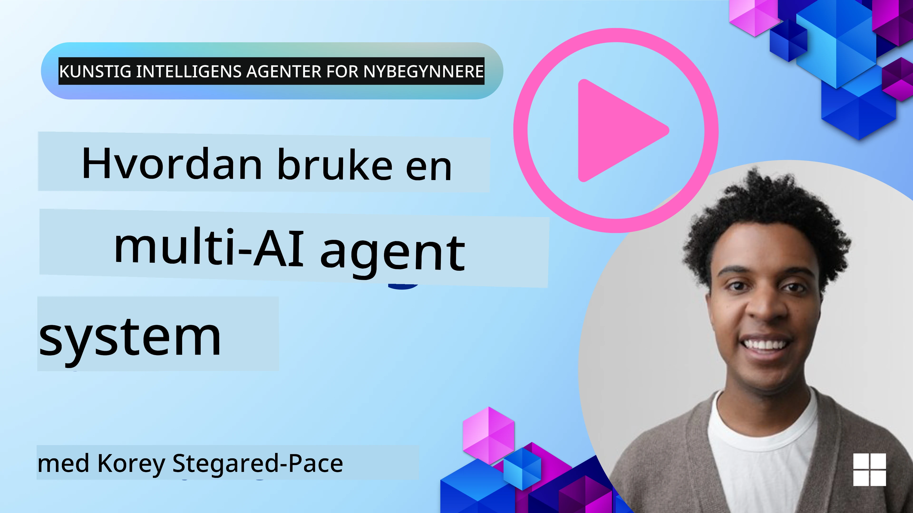
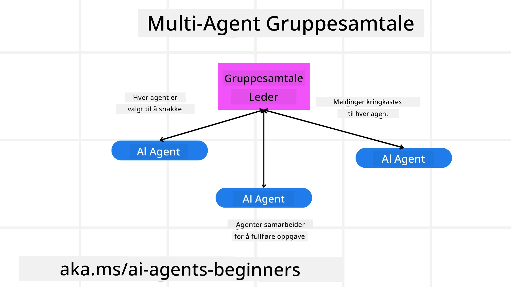
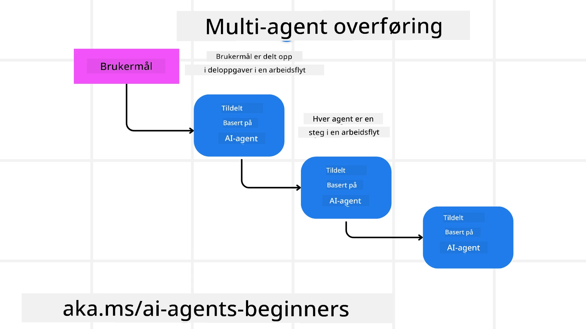
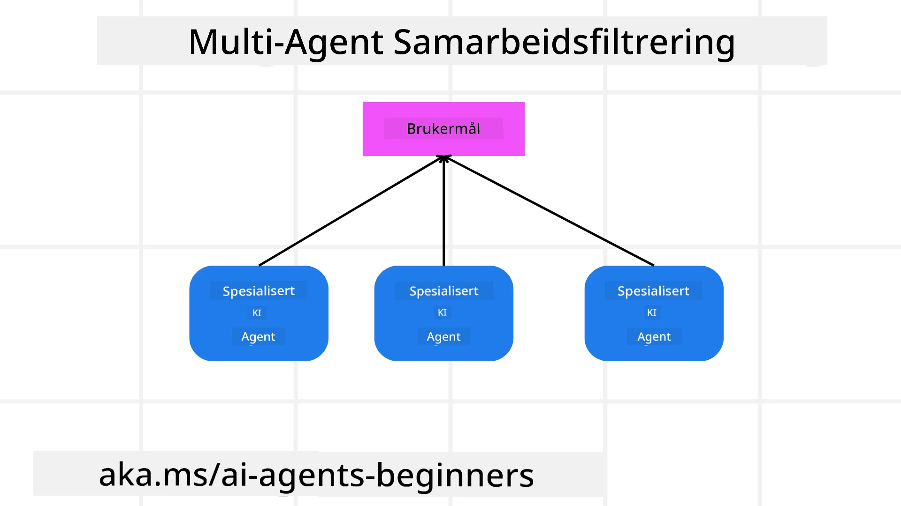

> _(Klikk på bildet over for å se video av denne leksjonen)_

# Designmønstre for multi-agent-systemer

Så snart du begynner å jobbe på et prosjekt som involverer flere agenter, må du vurdere multi-agent-designmønsteret. Det kan imidlertid ikke være umiddelbart klart når man skal bytte til flere agenter og hva fordelene er.

## Introduksjon

I denne leksjonen ønsker vi å svare på følgende spørsmål:

- Hvilke scenarier er multi-agenter aktuelle for?
- Hva er fordelene med å bruke flere agenter i stedet for én enkelt agent som gjør flere oppgaver?
- Hva er byggesteinene for å implementere multi-agent-designmønsteret?
- Hvordan får vi synlighet i hvordan de flere agentene samhandler med hverandre?

## Læringsmål

Etter denne leksjonen bør du kunne:

- Identifisere scenarier hvor multi-agenter er aktuelle
- Gjenkjenne fordelene ved å bruke flere agenter i stedet for en enkelt agent.
- Forstå byggesteinene for å implementere multi-agent-designmønsteret.

Hva er helhetsbildet?

*Multi-agenter er et designmønster som gjør det mulig for flere agenter å samarbeide for å oppnå et felles mål*.

Dette mønsteret er mye brukt innen ulike felt, inkludert robotikk, autonome systemer og distribuert databehandling.

## Scenarier hvor multi-agenter er aktuelle

Så hvilke scenarier er et godt brukstilfelle for å bruke multi-agenter? Svaret er at det finnes mange scenarier hvor det er fordelaktig å bruke flere agenter, særlig i følgende tilfeller:

- **Store arbeidsmengder**: Store arbeidsmengder kan deles opp i mindre oppgaver og tildeles forskjellige agenter, noe som muliggjør parallell behandling og raskere ferdigstillelse. Et eksempel på dette er ved en stor databehandlingsoppgave.
- **Komplekse oppgaver**: Komplekse oppgaver, som store arbeidsmengder, kan brytes ned i mindre deloppgaver og tildeles forskjellige agenter, der hver spesialiserer seg på en bestemt del av oppgaven. Et godt eksempel er autonome kjøretøy hvor ulike agenter håndterer navigasjon, hindringsdeteksjon og kommunikasjon med andre kjøretøy.
- **Varierende ekspertise**: Ulike agenter kan ha ulik ekspertise, slik at de kan håndtere forskjellige aspekter av en oppgave mer effektivt enn en enkelt agent. For dette tilfellet er et godt eksempel helsevesenet, hvor agenter kan håndtere diagnostikk, behandlingsplaner og pasientovervåking.

## Fordeler ved å bruke flere agenter i stedet for en enkelt agent

Et enkelt agentsystem kan fungere bra for enkle oppgaver, men for mer komplekse oppgaver kan bruk av flere agenter gi flere fordeler:

- **Spesialisering**: Hver agent kan spesialiseres for en spesifikk oppgave. Manglende spesialisering i en enkelt agent betyr at du har en agent som kan alt, men som kan bli forvirret når den møter en kompleks oppgave. Den kan for eksempel ende opp med å utføre en oppgave den ikke er best egnet for.
- **Skalerbarhet**: Det er lettere å skalere systemer ved å legge til flere agenter i stedet for å overbelaste en enkelt agent.
- **Feiltoleranse**: Hvis en agent feiler, kan andre fortsette å fungere, noe som sikrer påliteligheten til systemet.

La oss ta et eksempel — la oss bestille en reise for en bruker. Et enkelt agentsystem måtte håndtere alle aspekter av reisebestillingsprosessen, fra å finne fly til å bestille hotell og leiebiler. For å oppnå dette med en enkelt agent, må agenten ha verktøy for å håndtere alle disse oppgavene. Dette kan føre til et komplekst og monolittisk system som er vanskelig å vedlikeholde og skalere. Et multi-agent-system, derimot, kan ha forskjellige agenter spesialisert på å finne fly, bestille hotell og leiebiler. Dette vil gjøre systemet mer modulært, lettere å vedlikeholde og skalerbart.

Sammenlign dette med et reisebyrå drevet som en familiedrevet butikk versus et reisebyrå drevet som en franchise. Den familiedrevne butikken ville hatt en enkelt agent som håndterer alle aspekter av reisebestillingsprosessen, mens franchisen ville hatt forskjellige agenter som håndterer ulike aspekter av reisebestillingsprosessen.

## Byggesteiner for å implementere multi-agent-designmønsteret

Før du kan implementere multi-agent-designmønsteret, må du forstå byggesteinene som utgjør mønsteret.

La oss gjøre dette mer konkret ved igjen å se på eksempelet med å bestille en reise for en bruker. I dette tilfellet vil byggesteinene inkludere:

- **Agentkommunikasjon**: Agenter for å finne fly, bestille hotell og leiebiler må kommunisere og dele informasjon om brukerens preferanser og begrensninger. Du må bestemme protokollene og metodene for denne kommunikasjonen. Konkret betyr dette at agenten for å finne fly må kommunisere med agenten for å bestille hotell for å sikre at hotellet er bestilt for de samme datoene som flyet. Det betyr at agentene må dele informasjon om brukerens reisedatoer, noe som betyr at du må bestemme *hvilke agenter som deler info og hvordan de deler info*.
- **Koordineringsmekanismer**: Agentene må koordinere sine handlinger for å sikre at brukerens preferanser og begrensninger blir ivaretatt. En brukerpreferanse kan være at de ønsker et hotell nært flyplassen, mens en begrensning kan være at leiebiler kun er tilgjengelige på flyplassen. Dette betyr at agenten for å bestille hotell må koordinere med agenten for å bestille leiebil for å sikre at brukerens preferanser og begrensninger blir oppfylt. Dette betyr at du må bestemme *hvordan agentene koordinerer sine handlinger*.
- **Agentarkitektur**: Agentene må ha intern struktur for å ta beslutninger og lære av sine interaksjoner med brukeren. Dette betyr at agenten for å finne fly må ha intern struktur for å ta beslutninger om hvilke fly som skal anbefales til brukeren. Dette betyr at du må bestemme *hvordan agentene tar beslutninger og lærer fra sine interaksjoner med brukeren*. Eksempler på hvordan en agent lærer og forbedrer seg kan være at agenten for å finne fly kan bruke en maskinlæringsmodell for å anbefale fly basert på brukerens tidligere preferanser.
- **Synlighet i multi-agent-interaksjoner**: Du må ha synlighet i hvordan de flere agentene samhandler med hverandre. Dette betyr at du må ha verktøy og teknikker for å spore agentaktiviteter og interaksjoner. Dette kan være i form av logging- og overvåkingsverktøy, visualiseringsverktøy og ytelsesmålinger.
- **Multi-agent-mønstre**: Det finnes forskjellige mønstre for å implementere multi-agent-systemer, som sentralisert, desentralisert og hybrid arkitektur. Du må bestemme mønsteret som passer best for ditt brukstilfelle.
- **Menneskelig tilsyn**: I de fleste tilfeller vil du ha et menneske i løkken, og du må instruere agentene om når de skal be om menneskelig inngripen. Dette kan være i form av at en bruker ber om et spesifikt hotell eller fly som agentene ikke har anbefalt, eller ber om bekreftelse før bestilling av fly eller hotell.

## Synlighet i multi-agent-interaksjoner

Det er viktig at du har synlighet i hvordan de flere agentene samhandler med hverandre. Denne synligheten er avgjørende for feilsøking, optimalisering og for å sikre det overordnede systemets effektivitet. For å oppnå dette må du ha verktøy og teknikker for å spore agentaktiviteter og interaksjoner. Dette kan være i form av logging- og overvåkingsverktøy, visualiseringsverktøy og ytelsesmålinger.

For eksempel, i tilfellet med å bestille en reise for en bruker, kan du ha et dashbord som viser statusen til hver agent, brukerens preferanser og begrensninger, og interaksjonene mellom agentene. Dette dashbordet kan vise brukerens reisedatoer, flyene som anbefales av flyagenten, hotellene som anbefales av hotellagenten, og leiebilene som anbefales av leiebilagenten. Dette vil gi deg en klar oversikt over hvordan agentene samhandler med hverandre og om brukerens preferanser og begrensninger blir ivaretatt.

La oss se nærmere på hver av disse aspektene.

- **Logging- og overvåkingsverktøy**: Du bør ha logging for hver handling som utføres av en agent. En loggoppføring kan lagre informasjon om agenten som utførte handlingen, handlingen som ble utført, tidspunktet handlingen ble utført, og utfallet av handlingen. Denne informasjonen kan deretter brukes til feilsøking, optimalisering og mer.
- **Visualiseringsverktøy**: Visualiseringsverktøy kan hjelpe deg å se interaksjonene mellom agenter på en mer intuitiv måte. For eksempel kan du ha en graf som viser informasjonsflyten mellom agentene. Dette kan hjelpe deg med å identifisere flaskehalser, ineffektiviteter og andre problemer i systemet.
- **Ytelsesmålinger**: Ytelsesmålinger kan hjelpe deg å spore effektiviteten til multi-agent-systemet. For eksempel kan du spore tiden det tar å fullføre en oppgave, antall oppgaver fullført per tidsenhet, og nøyaktigheten av anbefalingene som gjøres av agentene. Denne informasjonen kan hjelpe deg med å identifisere forbedringsområder og optimalisere systemet.

## Multi-agent-mønstre

La oss dykke ned i noen konkrete mønstre vi kan bruke for å lage multi-agent-apper. Her er noen interessante mønstre verdt å vurdere:

### Gruppesamtale

Dette mønsteret er nyttig når du vil lage en gruppekontaktapplikasjon hvor flere agenter kan kommunisere med hverandre. Typiske brukstilfeller for dette mønsteret inkluderer team-samarbeid, kundestøtte og sosiale nettverk.

I dette mønsteret representerer hver agent en bruker i gruppesamtalen, og meldinger utveksles mellom agenter ved bruk av en meldingsprotokoll. Agentene kan sende meldinger til gruppesamtalen, motta meldinger fra gruppesamtalen og svare på meldinger fra andre agenter.

Dette mønsteret kan implementeres ved bruk av en sentralisert arkitektur der alle meldinger rutes gjennom en sentral server, eller en desentralisert arkitektur der meldinger utveksles direkte.

### Overlevering

Dette mønsteret er nyttig når du vil lage en applikasjon hvor flere agenter kan gi oppgaver videre til hverandre.

Typiske brukstilfeller for dette mønsteret inkluderer kundestøtte, oppgavehåndtering og automatisering av arbeidsflyt.

I dette mønsteret representerer hver agent en oppgave eller et trinn i en arbeidsflyt, og agenter kan gi oppgaver videre til andre agenter basert på forhåndsdefinerte regler.

### Kollaborativ filtrering

Dette mønsteret er nyttig når du vil lage en applikasjon hvor flere agenter kan samarbeide for å gi anbefalinger til brukere.

Hvorfor du vil at flere agenter skal samarbeide er fordi hver agent kan ha ulik ekspertise og kan bidra til anbefalingsprosessen på forskjellige måter.

La oss ta et eksempel der en bruker ønsker en anbefaling på den beste aksjen å kjøpe på børsen.

- **Bransjeekspert**:. En agent kan være ekspert på en spesifikk bransje.
- **Teknisk analyse**: En annen agent kan være ekspert på teknisk analyse.
- **Fundamental analyse**: og en annen agent kan være ekspert på fundamental analyse. Ved å samarbeide kan disse agentene gi en mer helhetlig anbefaling til brukeren.

## Scenario: Refusjonsprosess

Vurder et scenario hvor en kunde prøver å få refusjon for et produkt; det kan være mange agenter involvert i denne prosessen, men la oss dele det opp mellom agenter som er spesifikke for denne prosessen og generelle agenter som kan brukes i andre prosesser.

**Agenter spesifikke for refusjonsprosessen**:

Følgende er noen agenter som kan være involvert i refusjonsprosessen:

- **Kundeagent**: Denne agenten representerer kunden og er ansvarlig for å initiere refusjonsprosessen.
- **Selgeragent**: Denne agenten representerer selgeren og er ansvarlig for å behandle refusjonen.
- **Betalingsagent**: Denne agenten representerer betalingsprosessen og er ansvarlig for å refundere kundens betaling.
- **Løsningsagent**: Denne agenten representerer løsningsprosessen og er ansvarlig for å løse eventuelle problemer som oppstår under refusjonsprosessen.
- **Samsvarsagent**: Denne agenten representerer samsvarsprosessen og er ansvarlig for å sikre at refusjonsprosessen følger regelverk og retningslinjer.

**Generelle agenter**:

Disse agentene kan brukes av andre deler av virksomheten din.

- **Fraktagent**: Denne agenten representerer fraktprosessen og er ansvarlig for å sende produktet tilbake til selgeren. Denne agenten kan brukes både for refusjonsprosessen og for generell frakt av et produkt ved et kjøp, for eksempel.
- **Tilbakemeldingsagent**: Denne agenten representerer tilbakemeldingsprosessen og er ansvarlig for å samle inn tilbakemeldinger fra kunden. Tilbakemeldinger kan samles når som helst og ikke bare under refusjonsprosessen.
- **Eskaleringsagent**: Denne agenten representerer eskaleringsprosessen og er ansvarlig for å eskalere problemer til et høyere nivå av støtte. Du kan bruke denne typen agent for enhver prosess der du trenger å eskalere et problem.
- **Varslingsagent**: Denne agenten representerer varslingsprosessen og er ansvarlig for å sende varsler til kunden på ulike stadier av refusjonsprosessen.
- **Analysegent**: Denne agenten representerer analyseprosessen og er ansvarlig for å analysere data relatert til refusjonsprosessen.
- **Revisjonsagent**: Denne agenten representerer revisjonsprosessen og er ansvarlig for å revidere refusjonsprosessen for å sikre at den utføres korrekt.
- **Rapporteringsagent**: Denne agenten representerer rapporteringsprosessen og er ansvarlig for å generere rapporter om refusjonsprosessen.
- **Kunnskapsagent**: Denne agenten representerer kunnskapsprosessen og er ansvarlig for å vedlikeholde en kunnskapsbase med informasjon relatert til refusjonsprosessen. Denne agenten kan ha kunnskap både om refusjoner og andre deler av virksomheten din.
- **Sikkerhetsagent**: Denne agenten representerer sikkerhetsprosessen og er ansvarlig for å sikre sikkerheten i refusjonsprosessen.
- **Kvalitetsagent**: Denne agenten representerer kvalitetsprosessen og er ansvarlig for å sikre kvaliteten i refusjonsprosessen.

Det er ganske mange agenter listet tidligere, både for den spesifikke refusjonsprosessen og for de generelle agentene som kan brukes i andre deler av virksomheten din. Forhåpentligvis gir dette deg en idé om hvordan du kan avgjøre hvilke agenter som skal brukes i ditt multi-agent-system.

## Oppgave

Design et multi-agent-system for en kundestøtteprosess. Identifiser agentene involvert i prosessen, deres roller og ansvar, og hvordan de samhandler med hverandre. Vurder både agenter som er spesifikke for kundestøtteprosessen og generelle agenter som kan brukes i andre deler av virksomheten din.
> Tenk litt før du leser følgende løsning; du kan trenge flere agenter enn du tror.
>
> TIPS: Tenk på de ulike fasene i kundestøtteprosessen, og vurder også hvilke agenter som trengs for eventuelle systemer.

## Løsning

[Løsning](./solution/solution.md)

## Kunnskapssjekker

Question: Når bør du vurdere å bruke flere agenter?

- [ ] A1: Når du har en liten arbeidsmengde og en enkelt oppgave.
- [ ] A2: Når du har en stor arbeidsmengde
- [ ] A3: Når du har en enkel oppgave.

[Løsningsquiz](./solution/solution-quiz.md)

## Sammendrag

I denne leksjonen har vi sett på designmønsteret for flere agenter, inkludert scenariene der flere agenter er aktuelle, fordelene ved å bruke flere agenter fremfor en enkelt agent, byggesteinene for å implementere designmønsteret for flere agenter, og hvordan få innsikt i hvordan de flere agentene samhandler med hverandre.

### Har du flere spørsmål om designmønsteret for flere agenter?

Bli med i [Microsoft Foundry Discord](https://aka.ms/ai-agents/discord) for å møte andre elever, delta på kontortid og få svar på spørsmål om AI-agentene dine.

## Ytterligere ressurser

- <a href="https://learn.microsoft.com/azure/ai-services/agents/overview" target="_blank">Microsoft Agent Framework-dokumentasjon</a>
- <a href="https://www.analyticsvidhya.com/blog/2024/10/agentic-design-patterns/" target="_blank">Agentiske designmønstre</a>

## Forrige leksjon

[Planleggingsdesign](../07-planning-design/README.md)

## Neste leksjon

[Metakognisjon i AI-agenter](../09-metacognition/README.md)

---

<!-- CO-OP TRANSLATOR DISCLAIMER START -->
Ansvarsfraskrivelse:
Dette dokumentet er oversatt ved hjelp av AI-oversettelsestjenesten Co-op Translator (https://github.com/Azure/co-op-translator). Selv om vi streber etter nøyaktighet, må du være klar over at automatiske oversettelser kan inneholde feil eller unøyaktigheter. Det opprinnelige dokumentet på sitt opprinnelige språk bør anses som den autoritative kilden. For kritisk informasjon anbefales profesjonell, menneskelig oversettelse. Vi er ikke ansvarlige for eventuelle misforståelser eller feiltolkninger som oppstår ved bruk av denne oversettelsen.
<!-- CO-OP TRANSLATOR DISCLAIMER END -->