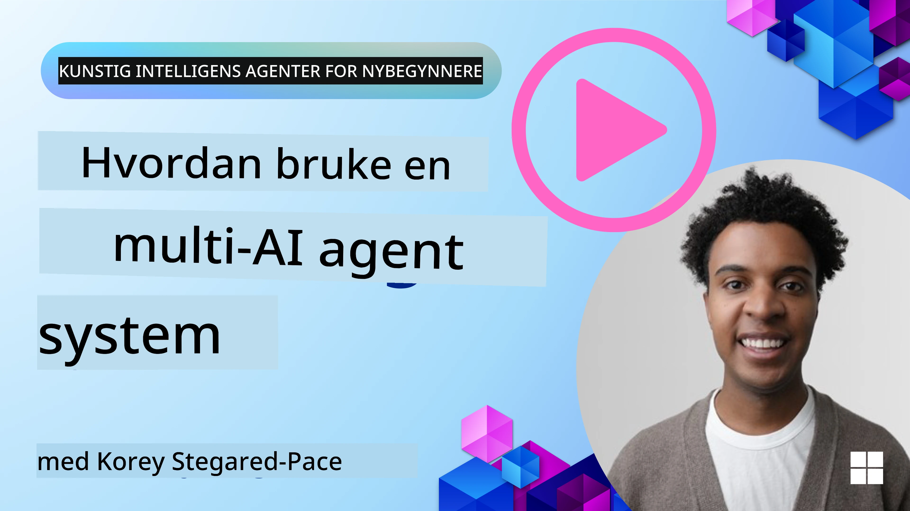
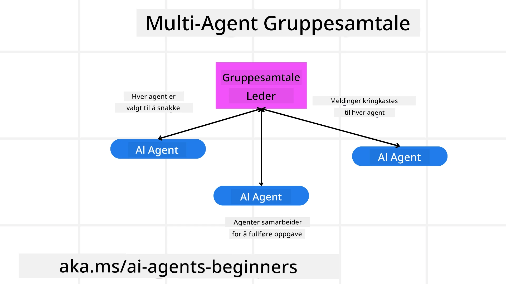
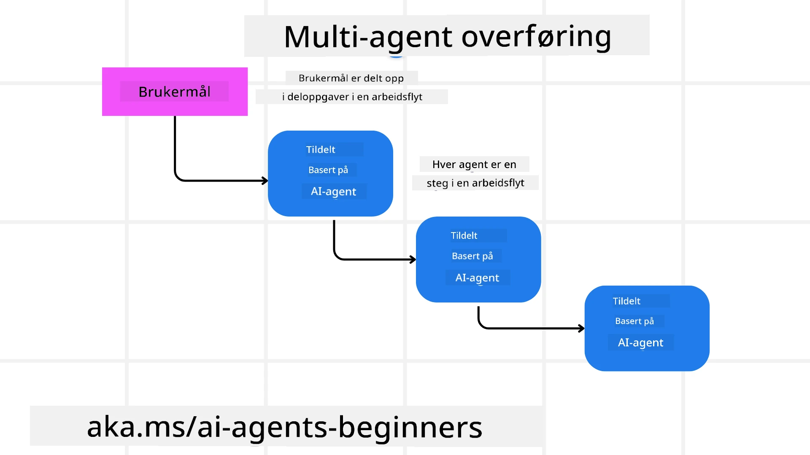
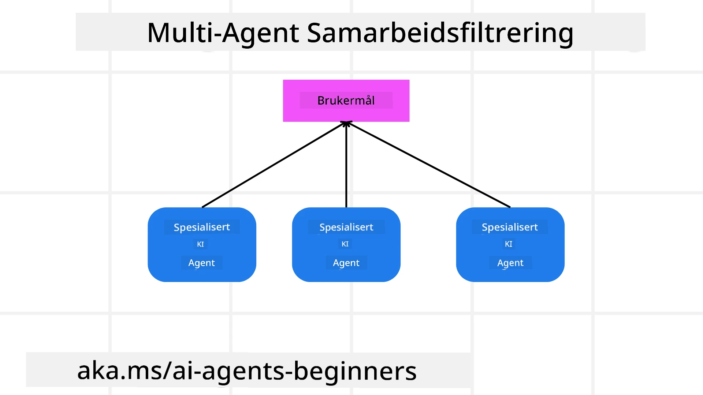

> _(Klikk på bildet ovenfor for å se video av denne leksjonen)_

# Multi-agent designmønstre

Så snart du begynner å jobbe på et prosjekt som involverer flere agenter, må du vurdere multi-agent designmønsteret. Det kan imidlertid ikke være umiddelbart klart når man skal gå over til multi-agenter og hvilke fordeler det gir.

## Innledning

I denne leksjonen ønsker vi å svare på følgende spørsmål:

- Hva er scenariene hvor multi-agenter er anvendelige?
- Hva er fordelene ved å bruke multi-agenter framfor bare én enkelt agent som gjør flere oppgaver?
- Hva er byggesteinene for å implementere multi-agent designmønsteret?
- Hvordan får vi oversikt over hvordan de flere agentene samhandler med hverandre?

## Læringsmål

Etter denne leksjonen skal du kunne:

- Identifisere scenarier hvor multi-agenter er anvendelige
- Gjenkjenne fordelene ved å bruke multi-agenter framfor en enkelt agent.
- Forstå byggesteinene for å implementere multi-agent designmønsteret.

Hva er det større bildet?

*Multi-agenter er et designmønster som gjør det mulig for flere agenter å samarbeide for å nå et felles mål*.

Dette mønsteret brukes mye i ulike felt, inkludert robotikk, autonome systemer og distribuert databehandling.

## Scenarier hvor multi-agenter er anvendelige

Så, hvilke scenarier er et godt bruksområde for multi-agenter? Svaret er at det finnes mange scenarier hvor det er fordelaktig å bruke flere agenter, spesielt i følgende tilfeller:

- **Store arbeidsmengder**: Store arbeidsmengder kan deles opp i mindre oppgaver og gis til forskjellige agenter, noe som tillater parallell behandling og raskere fullføring. Et eksempel på dette er ved en stor databehandlingsoppgave.
- **Komplekse oppgaver**: Komplekse oppgaver, som store arbeidsmengder, kan brytes ned i mindre deloppgaver og tildeles forskjellige agenter, som hver spesialiserer seg på et bestemt aspekt av oppgaven. Et godt eksempel er autonome kjøretøy hvor ulike agenter håndterer navigasjon, hinderdeteksjon og kommunikasjon med andre kjøretøy.
- **Mangfoldig ekspertise**: Ulike agenter kan ha ulike ekspertiseområder, noe som gjør at de kan håndtere forskjellige sider ved en oppgave mer effektivt enn én enkelt agent. Et godt eksempel her er helsesektoren, hvor agenter kan håndtere diagnostikk, behandlingsplaner og pasientovervåkning.

## Fordeler ved å bruke multi-agenter framfor en enkelt agent

Et enkelt agent-system kan fungere godt for enkle oppgaver, men ved mer komplekse oppgaver kan flere agenter gi flere fordeler:

- **Spesialisering**: Hver agent kan spesialiseres for en bestemt oppgave. Manglende spesialisering hos en enkelt agent betyr at du har en agent som kan gjøre alt, men som kan bli forvirret over hva den skal gjøre når den møter en kompleks oppgave. Den kan for eksempel ende opp med å gjøre en oppgave den ikke er best egnet for.
- **Skalerbarhet**: Det er enklere å skalere systemer ved å legge til flere agenter enn å overbelaste en enkelt agent.
- **Feiltoleranse**: Dersom én agent feiler, kan andre fortsette å fungere, noe som sikrer systemets pålitelighet.

La oss ta et eksempel; la oss bestille en reise for en bruker. Et enkelt agent-system måtte håndtere alle aspekter av reisebestillingen, fra å finne fly til å bestille hotell og leiebil. For å klare dette med én agent måtte agenten ha verktøy for å håndtere alle disse oppgavene. Dette kunne føre til et komplekst og monolittisk system som er vanskelig å vedlikeholde og skalere. Et multi-agent system kunne derimot ha ulike agenter som er spesialisert i å finne fly, bestille hotell og leiebil. Dette ville gjøre systemet mer modulært, enklere å vedlikeholde og skalerbart.

Sammenlign dette med et reisebyrå drevet som en familiebedrift kontra et reisebyrå drevet som en franchise. Familiebedriften ville ha hatt én agent som håndterer alle aspekter av reisebestillingsprosessen, mens franchisen ville ha hatt flere agenter som håndterer forskjellige sider av samme prosess.

## Byggesteiner for å implementere multi-agent designmønster

Før du kan implementere multi-agent designmønsteret, må du forstå byggesteinene som utgjør mønsteret.

La oss gjøre dette mer konkret ved igjen å se på eksempelet med å bestille en reise for en bruker. I dette tilfellet vil byggesteinene inkludere:

- **Agentkommunikasjon**: Agenter for å finne fly, bestille hotell og leiebil må kommunisere og dele informasjon om brukerens preferanser og begrensninger. Du må bestemme protokollene og metodene for denne kommunikasjonen. Konkret betyr dette at agenten for å finne fly må kommunisere med agenten for hotellbestilling for å sikre at hotellet er bestilt for de samme datoene som flyet. Det betyr at agentene må dele informasjon om brukerens reisedatoer, noe som innebærer at du må bestemme *hvilke agenter som deler info og hvordan de deler info*.
- **Koordineringsmekanismer**: Agentene må koordinere sine handlinger for å sikre at brukerens preferanser og begrensninger blir ivaretatt. En brukerpreferanse kan være at de ønsker et hotell nær flyplassen, mens en begrensning kan være at leiebiler kun er tilgjengelige på flyplassen. Dette betyr at agenten for hotellbestilling må koordinere med agenten for leiebilbestilling for å sikre at brukerens preferanser og begrensninger oppfylles. Du må bestemme *hvordan agentene koordinerer sine handlinger*.
- **Agentarkitektur**: Agentene må ha en intern struktur for å ta beslutninger og lære av interaksjoner med brukeren. Dette betyr at agenten for å finne fly må ha en intern struktur for å ta beslutninger om hvilke fly som skal anbefales til brukeren. Du må bestemme *hvordan agentene tar beslutninger og lærer av sine interaksjoner med brukeren*. Eksempler på hvordan en agent lærer og forbedrer seg kan være at agenten for å finne fly kan bruke en maskinlæringsmodell for å anbefale fly basert på brukerens tidligere preferanser.
- **Synlighet i multi-agent interaksjoner**: Du må ha oversikt over hvordan de mange agentene samhandler. Dette betyr at du må ha verktøy og teknikker for å spore agentenes aktiviteter og interaksjoner. Dette kan være i form av logging- og overvåkingsverktøy, visualiseringsverktøy og ytelsesmetrikker.
- **Multi-agent mønstre**: Det finnes forskjellige mønstre for å implementere multi-agent systemer, som sentraliserte, desentraliserte og hybride arkitekturer. Du må velge det mønsteret som passer best til ditt bruksområde.
- **Menneske i løkken**: I de fleste tilfeller vil det være et menneske i løkken, og du må instruere agentene når de skal spørre om menneskelig inngripen. Dette kan være i form av at en bruker ber om et spesifikt hotell eller fly som agentene ikke har anbefalt, eller at de spør om bekreftelse før de bestiller fly eller hotell.

## Synlighet i multi-agent interaksjoner

Det er viktig å ha oversikt over hvordan de mange agentene samhandler. Denne oversikten er essensiell for feilsøking, optimalisering og for å sikre systemets generelle effektivitet. For å få til dette, må du ha verktøy og teknikker for å spore agenters aktiviteter og interaksjoner. Dette kan være i form av logging- og overvåkingsverktøy, visualiseringsverktøy og ytelsesmetrikker.

For eksempel, i tilfelle av en reisebestilling for en bruker, kan du ha en oversiktstavle som viser statusen for hver agent, brukerens preferanser og begrensninger, og interaksjonene mellom agentene. Denne tavlen kan vise brukerens reisedatoer, flyene som flyagenten har anbefalt, hotellene som hotellsagenten har anbefalt, og leiebilene som leiebilagenten har anbefalt. Dette gir deg en klar oversikt over hvordan agentene samhandler og om brukerens preferanser og begrensninger blir oppfylt.

La oss se nærmere på hver av disse aspektene.

- **Logging- og overvåkingsverktøy**: Du ønsker å ha logging for hver handling som tas av en agent. En loggoppføring kan lagre informasjon om agenten som tok handlingen, handlingen som ble tatt, tidspunktet for handlingen og resultatet av handlingen. Denne informasjonen kan deretter brukes for feilsøking, optimalisering og mer.

- **Visualiseringsverktøy**: Visualiseringsverktøy kan hjelpe deg med å se interaksjonene mellom agentene på en mer intuitiv måte. For eksempel kan du ha en graf som viser informasjonsflyten mellom agentene. Dette kan hjelpe deg å identifisere flaskehalser, ineffektivitet og andre problemer i systemet.

- **Ytelsesmetrikker**: Ytelsesmetrikker kan hjelpe deg med å spore effektiviteten til multi-agent systemet. For eksempel kan du følge tiden brukt på å fullføre en oppgave, antall oppgaver fullført per tidsenhet, og nøyaktigheten av anbefalingene agentene har gitt. Denne informasjonen kan hjelpe deg med å identifisere forbedringsområder og optimalisere systemet.

## Multi-agent mønstre

La oss dykke ned i noen konkrete mønstre vi kan bruke for å lage multi-agent apper. Her er noen interessante mønstre verdt å vurdere:

### Gruppchat

Dette mønsteret er nyttig når du ønsker å lage en gruppchat-applikasjon hvor flere agenter kan kommunisere med hverandre. Typiske bruksområder for dette mønsteret inkluderer teamsamarbeid, kundestøtte og sosiale nettverk.

I dette mønsteret representerer hver agent en bruker i gruppchatten, og meldinger utveksles mellom agentene via en meldingsprotokoll. Agentene kan sende meldinger til gruppchatten, motta meldinger fra gruppchatten og svare på meldinger fra andre agenter.

Dette mønsteret kan implementeres med en sentralisert arkitektur hvor alle meldinger rutes gjennom en sentral server, eller en desentralisert arkitektur hvor meldinger utveksles direkte.

### Overføring

Dette mønsteret er nyttig når du ønsker å lage en applikasjon hvor flere agenter kan overføre oppgaver seg imellom.

Typiske bruksområder for dette mønsteret inkluderer kundestøtte, oppgavehåndtering og arbeidsflytautomatisering.

I dette mønsteret representerer hver agent en oppgave eller et steg i en arbeidsflyt, og agenter kan overføre oppgaver til andre agenter basert på forhåndsdefinerte regler.

### Samarbeidende filtrering

Dette mønsteret er nyttig når du ønsker å lage en applikasjon hvor flere agenter kan samarbeide for å lage anbefalinger til brukere.

Årsaken til at du ønsker at flere agenter skal samarbeide, er fordi hver agent kan ha ulik ekspertise og kan bidra til anbefalingsprosessen på forskjellige måter.

La oss ta et eksempel hvor en bruker ønsker en anbefaling på den beste aksjen å kjøpe på aksjemarkedet.

- **Bransjeekspert**: En agent kan være ekspert på en spesifikk bransje.
- **Teknisk analyse**: En annen agent kan være ekspert på teknisk analyse.
- **Fundamental analyse**: og en tredje agent kan være ekspert på fundamental analyse. Ved å samarbeide kan disse agentene gi en mer omfattende anbefaling til brukeren.

## Scenario: Refusjonsprosess

Vurder et scenario hvor en kunde prøver å få refusjon for et produkt. Det kan være mange agenter involvert i denne prosessen, men la oss dele det opp i agenter spesifikke for denne prosessen og generelle agenter som kan brukes i andre prosesser.

**Agenter spesifikke for refusjonsprosessen**:

Følgende er noen agenter som kan være involvert i refusjonsprosessen:

- **Kundeagent**: Denne agenten representerer kunden og er ansvarlig for å starte refusjonsprosessen.
- **Selgeragent**: Denne agenten representerer selgeren og er ansvarlig for å behandle refusjonen.
- **Betalingsagent**: Denne agenten representerer betalingsprosessen og er ansvarlig for å refundere kundens betaling.
- **Løsningsagent**: Denne agenten representerer løsningsprosessen og er ansvarlig for å løse eventuelle problemer som oppstår under refusjonsprosessen.
- **Samsvarsagent**: Denne agenten representerer samsvarsprosessen og er ansvarlig for å sikre at refusjonsprosessen overholder forskrifter og retningslinjer.

**Generelle agenter**:

Disse agentene kan brukes i andre deler av virksomheten din.

- **Fraktagent**: Denne agenten representerer fraktprosessen og er ansvarlig for å sende produktet tilbake til selgeren. Denne agenten kan brukes både i refusjonsprosessen og for generell frakt av et produkt via et kjøp for eksempel.
- **Tilbakemeldingsagent**: Denne agenten representerer tilbakemeldingsprosessen og er ansvarlig for å samle tilbakemeldinger fra kunden. Tilbakemeldinger kan innhentes når som helst og ikke bare under refusjonsprosessen.
- **Eskaleringsagent**: Denne agenten representerer eskaleringsprosessen og er ansvarlig for å eskalere problemer til et høyere støttenivå. Du kan bruke denne typen agent for alle prosesser hvor du trenger å eskalere et problem.
- **Varslingsagent**: Denne agenten representerer varslingsprosessen og er ansvarlig for å sende varsler til kunden i ulike faser av refusjonsprosessen.
- **Analysetagent**: Denne agenten representerer analyseprosessen og er ansvarlig for å analysere data relatert til refusjonsprosessen.
- **Revisjonsagent**: Denne agenten representerer revisjonsprosessen og er ansvarlig for å revidere refusjonsprosessen for å sikre at den utføres korrekt.
- **Rapporteringsagent**: Denne agenten representerer rapporteringsprosessen og er ansvarlig for å generere rapporter om refusjonsprosessen.
- **Kunnskapsagent**: Denne agenten representerer kunnskapsprosessen og er ansvarlig for å vedlikeholde en kunnskapsbase med informasjon relatert til refusjonsprosessen. Denne agenten kan ha kunnskap både om refusjoner og andre deler av virksomheten din.
- **Sikkerhetsagent**: Denne agenten representerer sikkerhetsprosessen og er ansvarlig for å sikre sikkerheten i refusjonsprosessen.
- **Kvalitetsagent**: Denne agenten representerer kvalitetsprosessen og er ansvarlig for å sikre kvaliteten i refusjonsprosessen.

Det er ganske mange agenter listet opp tidligere, både for den spesifikke refusjonsprosessen, men også for de generelle agentene som kan brukes i andre deler av virksomheten din. Forhåpentligvis gir dette deg en idé om hvordan du kan avgjøre hvilke agenter du skal bruke i ditt multi-agent system.

## Oppgave

Design et multi-agent system for en kundestøtteprosess. Identifiser agentene involvert i prosessen, deres roller og ansvarsområder, og hvordan de samhandler med hverandre. Tenk på både agenter spesifikke for kundestøtteprosessen og generelle agenter som kan brukes i andre deler av virksomheten din.

> Tenk litt før du leser følgende løsning, du kan trenge flere agenter enn du tror.

> TIPS: Tenk på de ulike fasene i kundestøtteprosessen og vurder også agenter som trengs for ethvert system.

## Løsning

[Løsning](./solution/solution.md)

## Kunnskapssjekker

### Spørsmål 1

Hvilket scenario passer best for et system med flere agenter?

- [ ] A1: En support-bot svarer på vanlige spørsmål ved hjelp av én kunnskapsbase og et lite sett verktøy.
- [ ] A2: En refusjonsflyt krever separate roller for svindel, betaling og samsvar, hver med sine egne verktøy, og resultatene må koordineres.
- [ ] A3: Samme enkle klassifiseringsforespørsel kommer tusenvis av ganger i timen.

### Spørsmål 2

Når er en enkelt agent vanligvis det beste valget?

- [ ] A1: Oppgaven kan håndteres med ett sett instruksjoner og verktøy, uten spesialistoverleveringer.
- [ ] A2: Agenten har tilgang til mer enn ett verktøy.
- [ ] A3: Arbeidsflyten krever separate roller med forskjellige tillatelser og uavhengige revisjonsspor.

[Løsning quiz](./solution/solution-quiz.md)

## Oppsummering

I denne leksjonen har vi sett på multi-agent designmønsteret, inkludert situasjoner der multi-agenter er aktuelle, fordelene ved å bruke multi-agenter framfor en enkelt agent, byggesteinene for implementering av multi-agent designmønsteret, og hvordan man får innsikt i hvordan flere agenter samhandler med hverandre.

### Har du flere spørsmål om Multi-Agent Designmønsteret?

Bli med i [Microsoft Foundry Discord](https://discord.com/invite/ATgtXmAS5D) for å møte andre lærende, delta på kontortid og få svar på dine AI-agent-spørsmål.

## Tilleggsressurser

- <a href="https://learn.microsoft.com/azure/ai-services/agents/overview" target="_blank">Microsoft Agent Framework dokumentasjon</a>
- <a href="https://www.analyticsvidhya.com/blog/2024/10/agentic-design-patterns/" target="_blank">Agentiske designmønstre</a>

## Forrige leksjon

[Planlegging av design](../07-planning-design/README.md)

## Neste leksjon

[Metakognisjon i AI-agenter](../09-metacognition/README.md)

---

<!-- CO-OP TRANSLATOR DISCLAIMER START -->
**Ansvarsfraskrivelse**:
Dette dokumentet er oversatt ved hjelp av AI-oversettelsestjenesten [Co-op Translator](https://github.com/Azure/co-op-translator). Selv om vi streber etter nøyaktighet, vær oppmerksom på at automatiske oversettelser kan inneholde feil eller unøyaktigheter. Det opprinnelige dokumentet på originalspråket skal betraktes som den autoritative kilden. For kritisk informasjon anbefales profesjonell menneskelig oversettelse. Vi er ikke ansvarlige for eventuelle misforståelser eller feiltolkninger som oppstår ved bruk av denne oversettelsen.
<!-- CO-OP TRANSLATOR DISCLAIMER END -->