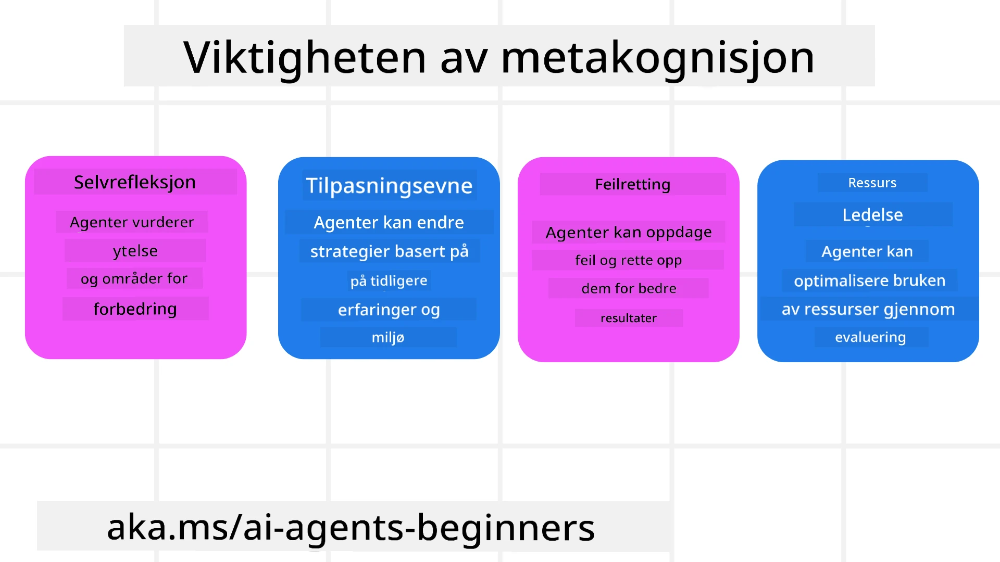
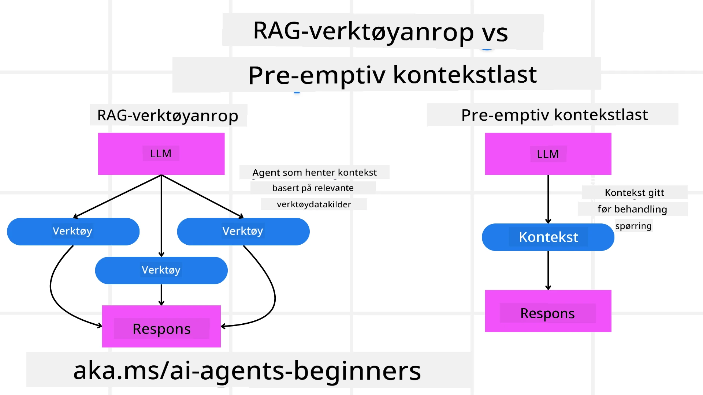

[](https://youtu.be/His9R6gw6Ec?si=3_RMb8VprNvdLRhX)

> _(Klikk på bildet over for å se video av denne leksjonen)_
# Metakognisjon i AI-agenter

## Introduksjon

Velkommen til leksjonen om metakognisjon i AI-agenter! Dette kapitlet er designet for nybegynnere som er nysgjerrige på hvordan AI-agenter kan reflektere over sine egne tankeprosesser. Ved slutten av denne leksjonen vil du forstå nøkkelbegreper og være utstyrt med praktiske eksempler for å anvende metakognisjon i design av AI-agenter.

## Læringsmål

Etter å ha fullført denne leksjonen, vil du kunne:

1. Forstå konsekvensene av resonnementssløyfer i agentdefinisjoner.
2. Bruke planleggings- og evalueringsmetoder for å hjelpe selvkorrigerende agenter.
3. Lage dine egne agenter som kan manipulere kode for å utføre oppgaver.

## Introduksjon til Metakognisjon

Metakognisjon refererer til høyere ordens kognitive prosesser som involverer å tenke over sin egen tenkning. For AI-agenter betyr dette å kunne evaluere og justere sine handlinger basert på selvbevissthet og tidligere erfaringer. Metakognisjon, eller "tenking om tenking," er et viktig konsept i utviklingen av agentiske AI-systemer. Det innebærer at AI-systemer er bevisste på sine egne interne prosesser og kan overvåke, regulere og tilpasse sin atferd deretter. Akkurat som vi gjør når vi leser rommet eller ser på et problem. Denne selvbevisstheten kan hjelpe AI-systemer med å ta bedre beslutninger, identifisere feil, og forbedre sin ytelse over tid – igjen knyttet tilbake til Turing-testen og debatten om AI vil overta.

I konteksten av agentiske AI-systemer kan metakognisjon bidra til å løse flere utfordringer, slik som:
- Transparens: Sikre at AI-systemer kan forklare sitt resonnement og sine beslutninger.
- Resonnering: Forbedre AI-systemenes evne til å syntetisere informasjon og ta gode beslutninger.
- Tilpasning: La AI-systemer justere seg til nye omgivelser og endrede forhold.
- Persepsjon: Forbedre nøyaktigheten til AI-systemer i å gjenkjenne og tolke data fra omgivelsene.

### Hva er Metakognisjon?

Metakognisjon, eller "tenking om tenking," er en høyere ordens kognitiv prosess som involverer selvbevissthet og selvregulering av egne kognitive prosesser. Innen AI gir metakognisjon agentene mulighet til å evaluere og tilpasse sine strategier og handlinger, noe som fører til forbedrede evner til problemløsning og beslutningstaking. Ved å forstå metakognisjon kan du designe AI-agenter som ikke bare er mer intelligente, men også mer tilpasningsdyktige og effektive. I ekte metakognisjon ville du se at AI eksplisitt resonerer rundt sitt eget resonnement.

Eksempel: «Jeg prioriterte billigere flyreiser fordi… jeg kan gå glipp av direktefly, så la meg sjekke igjen.»
Holde oversikt over hvordan eller hvorfor den valgte en viss rute.
- Legge merke til at den gjorde feil fordi den stolte for mye på brukerpreferanser fra sist gang, så den endrer sin beslutningsstrategi, ikke bare den endelige anbefalingen.
- Diagnostisere mønstre som: «Når jeg ser brukeren nevne ‘for folksomt’, bør jeg ikke bare fjerne visse attraksjoner, men også reflektere over at metoden min for å velge ‘toppattraksjoner’ er feil hvis jeg alltid rangerer etter popularitet.»

### Viktigheten av Metakognisjon i AI-agenter

Metakognisjon spiller en avgjørende rolle i design av AI-agenter av flere grunner:



- Selvrefleksjon: Agenter kan vurdere egen ytelse og identifisere forbedringsområder.
- Tilpasningsevne: Agenter kan endre strategier basert på tidligere erfaringer og skiftende omgivelser.
- Feilretting: Agenter kan oppdage og rette feil autonomt, noe som fører til mer nøyaktige resultater.
- Ressursstyring: Agenter kan optimalisere bruk av ressurser, som tid og datakraft, ved planlegging og evaluering av egne handlinger.

## Komponenter i en AI-Agent

Før vi går inn i metakognitive prosesser, er det viktig å forstå grunnleggende komponenter i en AI-agent. En AI-agent består vanligvis av:

- Personlighet: Agentens personlighet og egenskaper, som definerer hvordan den interagerer med brukere.
- Verktøy: Mulighetene og funksjonene agenten kan utføre.
- Ferdigheter: Kunnskapen og ekspertisen agenten besitter.

Disse komponentene samarbeider for å skape en "ekspertiseenhet" som kan utføre spesifikke oppgaver.

**Eksempel**:
Tenk deg en reiseagent, en agenttjeneste som ikke bare planlegger ferien din, men også justerer ruten basert på sanntidsdata og tidligere kundeerfaringer.

### Eksempel: Metakognisjon i en Reiseagenttjeneste

Tenk deg at du designer en reiseagenttjeneste drevet av AI. Denne agenten, "Reiseagenten," hjelper brukere med å planlegge ferier. For å innlemme metakognisjon må Reiseagenten evaluere og justere sine handlinger basert på selvbevissthet og tidligere erfaringer. Slik kan metakognisjon spille en rolle:

#### Nåværende Oppgave

Den nåværende oppgaven er å hjelpe en bruker med å planlegge en tur til Paris.

#### Trinn for å Fullføre Oppgaven

1. **Samle Brukerpreferanser**: Spør brukeren om reisedatoer, budsjett, interesser (f.eks. museer, mat, shopping) og eventuelle spesifikke krav.
2. **Hente Informasjon**: Søk etter flyalternativer, overnatting, attraksjoner og restauranter som matcher brukerens preferanser.
3. **Generere Anbefalinger**: Gi en personlig reiserute med flydetaljer, hotellreservasjoner og foreslåtte aktiviteter.
4. **Justere Basert på Tilbakemelding**: Be brukeren om tilbakemelding på anbefalingene og gjør nødvendige justeringer.

#### Nødvendige Ressurser

- Tilgang til fly- og hotellbestillingsdatabaser.
- Informasjon om attraksjoner og restauranter i Paris.
- Brukertilbakemeldingsdata fra tidligere interaksjoner.

#### Erfaring og Selvrefleksjon

Reiseagenten bruker metakognisjon for å evaluere sin egen ytelse og lære av tidligere erfaringer. For eksempel:

1. **Analysere Brukertilbakemelding**: Reiseagenten gjennomgår tilbakemeldinger for å se hvilke anbefalinger som ble godt mottatt og hvilke som ikke ble det. Den justerer fremtidige forslag deretter.
2. **Tilpasningsevne**: Hvis en bruker tidligere har nevnt at de ikke liker folksomme steder, vil Reiseagenten unngå å anbefale populære turiststeder i rushtiden i fremtiden.
3. **Feilretting**: Hvis Reiseagenten tidligere gjorde en feil i en booking, som å foreslå et hotell som var fullbooket, lærer den å sjekke tilgjengelighet grundigere før anbefalinger.

#### Praktisk Utvikler-eksempel

Her er et forenklet eksempel på hvordan kode for Reiseagenten kan se ut når metakognisjon innlemmes:

```python
class Travel_Agent:
    def __init__(self):
        self.user_preferences = {}
        self.experience_data = []

    def gather_preferences(self, preferences):
        self.user_preferences = preferences

    def retrieve_information(self):
        # Søk etter flyreiser, hoteller og attraksjoner basert på preferanser
        flights = search_flights(self.user_preferences)
        hotels = search_hotels(self.user_preferences)
        attractions = search_attractions(self.user_preferences)
        return flights, hotels, attractions

    def generate_recommendations(self):
        flights, hotels, attractions = self.retrieve_information()
        itinerary = create_itinerary(flights, hotels, attractions)
        return itinerary

    def adjust_based_on_feedback(self, feedback):
        self.experience_data.append(feedback)
        # Analyser tilbakemeldinger og juster fremtidige anbefalinger
        self.user_preferences = adjust_preferences(self.user_preferences, feedback)

# Eksempel på bruk
travel_agent = Travel_Agent()
preferences = {
    "destination": "Paris",
    "dates": "2025-04-01 to 2025-04-10",
    "budget": "moderate",
    "interests": ["museums", "cuisine"]
}
travel_agent.gather_preferences(preferences)
itinerary = travel_agent.generate_recommendations()
print("Suggested Itinerary:", itinerary)
feedback = {"liked": ["Louvre Museum"], "disliked": ["Eiffel Tower (too crowded)"]}
travel_agent.adjust_based_on_feedback(feedback)
```

#### Hvorfor Metakognisjon er Viktig

- **Selvrefleksjon**: Agenter kan analysere egen ytelse og identifisere forbedringsmuligheter.
- **Tilpasningsevne**: Agenter kan endre strategier basert på tilbakemelding og skiftende forhold.
- **Feilretting**: Agenter kan oppdage og rette feil autonomt.
- **Ressursstyring**: Agenter kan optimalisere ressursbruk som tid og datakraft.

Ved å innlemme metakognisjon kan Reiseagenten tilby mer personlige og nøyaktige reiseanbefalinger, som forbedrer den totale brukeropplevelsen.

---

## 2. Planlegging i Agenter

Planlegging er en kritisk komponent i AI-agenters atferd. Det innebærer å skissere trinnene som trengs for å nå et mål, med hensyn til dagens situasjon, ressurser og mulige hindringer.

### Elementer i Planlegging

- **Nåværende Oppgave**: Definer oppgaven klart.
- **Trinn for å Fullføre Oppgaven**: Bryt ned oppgaven i håndterbare steg.
- **Nødvendige Ressurser**: Identifiser nødvendige ressurser.
- **Erfaring**: Bruk tidligere erfaringer for å informere planleggingen.

**Eksempel**:
Her er trinnene Reiseagenten må ta for å hjelpe en bruker med å planlegge turen effektivt:

### Trinn for Reiseagenten

1. **Samle Brukerpreferanser**
   - Spør brukeren om detaljer om reisedatoer, budsjett, interesser og eventuelle spesifikke krav.
   - Eksempler: «Når planlegger du å reise?» «Hva er ditt budsjett?» «Hvilke aktiviteter liker du på ferie?»

2. **Hent Informasjon**
   - Søk etter relevante reisealternativer basert på brukerens preferanser.
   - **Flyvninger**: Se etter tilgjengelige fly innenfor brukerens budsjett og foretrukne reisedatoer.
   - **Overnatting**: Finn hoteller eller leieboliger som samsvarer med brukerens preferanser for beliggenhet, pris og fasiliteter.
   - **Attraksjoner og Restauranter**: Identifiser populære attraksjoner, aktiviteter og spisesteder som passer brukerens interesser.

3. **Generer Anbefalinger**
   - Sett sammen den innhentede informasjonen til en personlig reiserute.
   - Gi detaljer som flyalternativer, hotellreservasjoner og foreslåtte aktiviteter, og sørg for at anbefalingene er tilpasset brukerens preferanser.

4. **Presenter Reiseruten for Brukeren**
   - Del den foreslåtte reiseruten med brukeren for gjennomgang.
   - Eksempel: «Her er et foreslått reiseoppsett for turen din til Paris. Det inkluderer flydetaljer, hotellbooking og en liste over anbefalte aktiviteter og restauranter. Gi meg beskjed hva du synes!»

5. **Samle Tilbakemelding**
   - Be brukeren om tilbakemelding på den foreslåtte reiseruten.
   - Eksempler: «Liker du flyalternativene?» «Passer hotellet for deg?» «Er det noen aktiviteter du vil legge til eller fjerne?»

6. **Juster Basert på Tilbakemelding**
   - Endre reiseruten ut fra brukerens tilbakemelding.
   - Gjør nødvendige justeringer på fly, overnatting og aktivitetsanbefalinger for bedre å møte brukerens preferanser.

7. **Endelig Bekreftelse**
   - Presenter den oppdaterte reiseruten for endelig godkjenning.
   - Eksempel: «Jeg har gjort justeringene basert på tilbakemeldingen din. Her er den oppdaterte reiseruten. Ser alt bra ut?»

8. **Bestill og Bekreft Reservasjoner**
   - Når brukeren godkjenner reiseruten, fortsett med bestilling av fly, overnatting og eventuelle planlagte aktiviteter.
   - Send bekreftelsesdetaljer til brukeren.

9. **Gi Løpende Støtte**
   - Vær tilgjengelig for å hjelpe brukeren med endringer eller ekstra forespørsler før og under reisen.
   - Eksempel: «Hvis du trenger mer hjelp under reisen, ta gjerne kontakt med meg når som helst!»

### Eksempel Interaksjon

```python
class Travel_Agent:
    def __init__(self):
        self.user_preferences = {}
        self.experience_data = []

    def gather_preferences(self, preferences):
        self.user_preferences = preferences

    def retrieve_information(self):
        flights = search_flights(self.user_preferences)
        hotels = search_hotels(self.user_preferences)
        attractions = search_attractions(self.user_preferences)
        return flights, hotels, attractions

    def generate_recommendations(self):
        flights, hotels, attractions = self.retrieve_information()
        itinerary = create_itinerary(flights, hotels, attractions)
        return itinerary

    def adjust_based_on_feedback(self, feedback):
        self.experience_data.append(feedback)
        self.user_preferences = adjust_preferences(self.user_preferences, feedback)

# Eksempel på bruk innen en bønn forespørsel
travel_agent = Travel_Agent()
preferences = {
    "destination": "Paris",
    "dates": "2025-04-01 to 2025-04-10",
    "budget": "moderate",
    "interests": ["museums", "cuisine"]
}
travel_agent.gather_preferences(preferences)
itinerary = travel_agent.generate_recommendations()
print("Suggested Itinerary:", itinerary)
feedback = {"liked": ["Louvre Museum"], "disliked": ["Eiffel Tower (too crowded)"]}
travel_agent.adjust_based_on_feedback(feedback)
```

## 3. Korrigerende RAG-system

La oss først starte med å forstå forskjellen mellom RAG-verktøy og Pre-emptive Context Load



### Retrieval-Augmented Generation (RAG)

RAG kombinerer et hentesystem med en generativ modell. Når et spørsmål stilles, henter hentesystemet relevante dokumenter eller data fra en ekstern kilde, og denne hentede informasjonen brukes for å utvide input til den generative modellen. Dette hjelper modellen med å generere mer nøyaktige og kontekstrelevante svar.

I et RAG-system henter agenten relevant informasjon fra en kunnskapsbase og bruker denne til å generere passende svar eller handlinger.

### Korrigerende RAG-tilnærming

Den korrigerende RAG-tilnærmingen fokuserer på å bruke RAG-teknikker for å rette feil og forbedre nøyaktigheten til AI-agenter. Dette innebærer:

1. **Prompting-teknikk**: Bruke spesifikke spørsmål for å veilede agenten i å hente relevant informasjon.
2. **Verktøy**: Implementere algoritmer og mekanismer som gjør agenten i stand til å vurdere relevansen av hentet informasjon og generere nøyaktige svar.
3. **Evaluering**: Kontinuerlig vurdere agentens ytelse og gjøre justeringer for å forbedre nøyaktighet og effektivitet.

#### Eksempel: Korrigerende RAG i en Søkeagent

Tenk deg en søkeagent som henter informasjon fra nettet for å svare på brukerforespørsler. Den korrigerende RAG-tilnærmingen kan innebære:

1. **Prompting-teknikk**: Formulere søkespørringer basert på brukerens input.
2. **Verktøy**: Bruke naturlig språkprosessering og maskinlæringsalgoritmer for å rangere og filtrere søkeresultater.
3. **Evaluering**: Analysere brukertilbakemeldinger for å identifisere og rette unøyaktigheter i hentet informasjon.

### Korrigerende RAG i Reiseagenten

Korrigerende RAG (Retrieval-Augmented Generation) forbedrer AI sin evne til å hente og generere informasjon samtidig som den retter eventuelle unøyaktigheter. La oss se hvordan Reiseagenten kan bruke den korrigerende RAG-tilnærmingen for å gi mer nøyaktige og relevante reiseanbefalinger.

Dette innebærer:

- **Prompting-teknikk:** Bruke spesifikke spørsmål for å veilede agenten i å hente relevant informasjon.
- **Verktøy:** Implementere algoritmer og mekanismer som lar agenten vurdere relevansen av hentet data og generere presise svar.
- **Evaluering:** Kontinuerlig vurdere agentens ytelse og justere for å forbedre nøyaktighet og effektivitet.

#### Trinn for å Implementere Korrigerende RAG i Reiseagenten

1. **Innledende Brukerinteraksjon**
   - Reiseagenten samler inn brukerens preferanser som destinasjon, reisedatoer, budsjett og interesser.
   - Eksempel:

     ```python
     preferences = {
         "destination": "Paris",
         "dates": "2025-04-01 to 2025-04-10",
         "budget": "moderate",
         "interests": ["museums", "cuisine"]
     }
     ```

2. **Henting av Informasjon**
   - Reiseagenten henter informasjon om flyvninger, overnatting, attraksjoner og restauranter basert på brukerens preferanser.
   - Eksempel:

     ```python
     flights = search_flights(preferences)
     hotels = search_hotels(preferences)
     attractions = search_attractions(preferences)
     ```

3. **Generere Innledende Anbefalinger**
   - Reiseagenten bruker den hentede informasjonen for å lage en personlig reiserute.
   - Eksempel:

     ```python
     itinerary = create_itinerary(flights, hotels, attractions)
     print("Suggested Itinerary:", itinerary)
     ```

4. **Innsamling av Tilbakemelding**
   - Reiseagenten spør brukeren om tilbakemelding på innledende anbefalinger.
   - Eksempel:

     ```python
     feedback = {
         "liked": ["Louvre Museum"],
         "disliked": ["Eiffel Tower (too crowded)"]
     }
     ```

5. **Korrigerende RAG-prosess**
   - **Prompting-teknikk**: Reiseagenten formulerer nye søkespørringer basert på brukerens tilbakemelding.
     - Eksempel:

       ```python
       if "disliked" in feedback:
           preferences["avoid"] = feedback["disliked"]
       ```

   - **Verktøy**: Reiseagenten bruker algoritmer til å rangere og filtrere nye søkeresultater, med fokus på relevans basert på tilbakemeldingen.
     - Eksempel:

       ```python
       new_attractions = search_attractions(preferences)
       new_itinerary = create_itinerary(flights, hotels, new_attractions)
       print("Updated Itinerary:", new_itinerary)
       ```

   - **Evaluering**: Reiseagenten vurderer løpende relevans og nøyaktighet av sine anbefalinger ved å analysere tilbakemeldinger og gjøre nødvendige justeringer.
     - Eksempel:

       ```python
       def adjust_preferences(preferences, feedback):
           if "liked" in feedback:
               preferences["favorites"] = feedback["liked"]
           if "disliked" in feedback:
               preferences["avoid"] = feedback["disliked"]
           return preferences

       preferences = adjust_preferences(preferences, feedback)
       ```

#### Praktisk Eksempel

Her er et forenklet Python-kodeeksempel som innlemmer den korrigerende RAG-tilnærmingen i Reiseagenten:

```python
class Travel_Agent:
    def __init__(self):
        self.user_preferences = {}
        self.experience_data = []

    def gather_preferences(self, preferences):
        self.user_preferences = preferences

    def retrieve_information(self):
        flights = search_flights(self.user_preferences)
        hotels = search_hotels(self.user_preferences)
        attractions = search_attractions(self.user_preferences)
        return flights, hotels, attractions

    def generate_recommendations(self):
        flights, hotels, attractions = self.retrieve_information()
        itinerary = create_itinerary(flights, hotels, attractions)
        return itinerary

    def adjust_based_on_feedback(self, feedback):
        self.experience_data.append(feedback)
        self.user_preferences = adjust_preferences(self.user_preferences, feedback)
        new_itinerary = self.generate_recommendations()
        return new_itinerary

# Eksempel på bruk
travel_agent = Travel_Agent()
preferences = {
    "destination": "Paris",
    "dates": "2025-04-01 to 2025-04-10",
    "budget": "moderate",
    "interests": ["museums", "cuisine"]
}
travel_agent.gather_preferences(preferences)
itinerary = travel_agent.generate_recommendations()
print("Suggested Itinerary:", itinerary)
feedback = {"liked": ["Louvre Museum"], "disliked": ["Eiffel Tower (too crowded)"]}
new_itinerary = travel_agent.adjust_based_on_feedback(feedback)
print("Updated Itinerary:", new_itinerary)
```

### Pre-emptive Context Load
Forhåndslasting av kontekst innebærer å laste inn relevant kontekst eller bakgrunnsinformasjon i modellen før behandling av en forespørsel. Dette betyr at modellen har tilgang til denne informasjonen fra starten, noe som kan hjelpe den med å generere mer informerte svar uten å måtte hente ekstra data underveis i prosessen.

Her er et forenklet eksempel på hvordan en forhåndslasting av kontekst kan se ut for en reiseagentur-applikasjon i Python:

```python
class TravelAgent:
    def __init__(self):
        # Forhåndslast populære destinasjoner og deres informasjon
        self.context = {
            "Paris": {"country": "France", "currency": "Euro", "language": "French", "attractions": ["Eiffel Tower", "Louvre Museum"]},
            "Tokyo": {"country": "Japan", "currency": "Yen", "language": "Japanese", "attractions": ["Tokyo Tower", "Shibuya Crossing"]},
            "New York": {"country": "USA", "currency": "Dollar", "language": "English", "attractions": ["Statue of Liberty", "Times Square"]},
            "Sydney": {"country": "Australia", "currency": "Dollar", "language": "English", "attractions": ["Sydney Opera House", "Bondi Beach"]}
        }

    def get_destination_info(self, destination):
        # Hent destinasjonsinformasjon fra forhåndslastet kontekst
        info = self.context.get(destination)
        if info:
            return f"{destination}:\nCountry: {info['country']}\nCurrency: {info['currency']}\nLanguage: {info['language']}\nAttractions: {', '.join(info['attractions'])}"
        else:
            return f"Sorry, we don't have information on {destination}."

# Eksempel på bruk
travel_agent = TravelAgent()
print(travel_agent.get_destination_info("Paris"))
print(travel_agent.get_destination_info("Tokyo"))
```

#### Forklaring

1. **Initialisering (`__init__`-metoden)**: `TravelAgent`-klassen forhåndslaster en ordbok som inneholder informasjon om populære reisemål som Paris, Tokyo, New York og Sydney. Denne ordboken inkluderer detaljer som land, valuta, språk og viktige attraksjoner for hvert reisemål.

2. **Hente informasjon (`get_destination_info`-metoden)**: Når en bruker spør om et spesifikt reisemål, henter `get_destination_info`-metoden relevant informasjon fra den forhåndslastede kontekstordboken.

Ved å forhåndslaste konteksten kan reiseagentur-applikasjonen raskt svare på brukerforespørsler uten å måtte hente denne informasjonen fra en ekstern kilde i sanntid. Dette gjør applikasjonen mer effektiv og responsiv.

### Oppstart av planen med et mål før iterasjon

Å kjøpe opp en plan med et mål innebærer å starte med et klart mål eller ønsket resultat i tankene. Ved å definere dette målet på forhånd kan modellen bruke det som en veiledende prinsipp gjennom den iterative prosessen. Dette bidrar til å sikre at hver iterasjon beveger seg nærmere målet, og gjør prosessen mer effektiv og målrettet.

Her er et eksempel på hvordan du kan kjøpe opp en reiseplan med et mål før iterasjon for en reiseagentur i Python:

### Scenario

En reiseagent ønsker å planlegge en tilpasset ferie for en kunde. Målet er å lage en reiseplan som maksimerer kundens tilfredshet basert på deres preferanser og budsjett.

### Steg

1. Definer kundens preferanser og budsjett.
2. Kjøp opp den innledende planen basert på disse preferansene.
3. Iterer for å forbedre planen, optimalisere for kundens tilfredshet.

#### Python-kode

```python
class TravelAgent:
    def __init__(self, destinations):
        self.destinations = destinations

    def bootstrap_plan(self, preferences, budget):
        plan = []
        total_cost = 0

        for destination in self.destinations:
            if total_cost + destination['cost'] <= budget and self.match_preferences(destination, preferences):
                plan.append(destination)
                total_cost += destination['cost']

        return plan

    def match_preferences(self, destination, preferences):
        for key, value in preferences.items():
            if destination.get(key) != value:
                return False
        return True

    def iterate_plan(self, plan, preferences, budget):
        for i in range(len(plan)):
            for destination in self.destinations:
                if destination not in plan and self.match_preferences(destination, preferences) and self.calculate_cost(plan, destination) <= budget:
                    plan[i] = destination
                    break
        return plan

    def calculate_cost(self, plan, new_destination):
        return sum(destination['cost'] for destination in plan) + new_destination['cost']

# Eksempel på bruk
destinations = [
    {"name": "Paris", "cost": 1000, "activity": "sightseeing"},
    {"name": "Tokyo", "cost": 1200, "activity": "shopping"},
    {"name": "New York", "cost": 900, "activity": "sightseeing"},
    {"name": "Sydney", "cost": 1100, "activity": "beach"},
]

preferences = {"activity": "sightseeing"}
budget = 2000

travel_agent = TravelAgent(destinations)
initial_plan = travel_agent.bootstrap_plan(preferences, budget)
print("Initial Plan:", initial_plan)

refined_plan = travel_agent.iterate_plan(initial_plan, preferences, budget)
print("Refined Plan:", refined_plan)
```

#### Kodeforklaring

1. **Initialisering (`__init__`-metoden)**: `TravelAgent`-klassen initieres med en liste over potensielle reisemål, hver med attributter som navn, kostnad og aktivitetstype.

2. **Oppstart av planen (`bootstrap_plan`-metoden)**: Denne metoden lager en innledende reiseplan basert på kundens preferanser og budsjett. Den itererer gjennom listen over reisemål og legger til de som matcher kundens preferanser og passer innenfor budsjettet.

3. **Matcher preferanser (`match_preferences`-metoden)**: Denne metoden sjekker om et reisemål matcher kundens preferanser.

4. **Itererer planen (`iterate_plan`-metoden)**: Denne metoden forbedrer den innledende planen ved å forsøke å erstatte hvert reisemål i planen med et bedre alternativ, med tanke på kundens preferanser og budsjettbegrensninger.

5. **Beregner kostnad (`calculate_cost`-metoden)**: Denne metoden beregner total kostnad for den nåværende planen, inkludert et potensielt nytt reisemål.

#### Eksempelbruk

- **Innledende plan**: Reiseagenten lager en innledende plan basert på kundens preferanser for sightseeing og et budsjett på 2000 dollar.
- **Forbedret plan**: Reiseagenten itererer planen for å optimalisere i henhold til kundens preferanser og budsjett.

Ved å kjøpe opp planen med et klart mål (f.eks. maksimering av kundetilfredshet) og iterere for å forbedre planen, kan reiseagenten lage en tilpasset og optimalisert reiseplan for kunden. Denne tilnærmingen sikrer at reiseplanen samsvarer med kundens preferanser og budsjett fra starten og forbedres ved hver iterasjon.

### Utnytte LLM for rankering og poengsetting

Store språkmodeller (LLMs) kan brukes til re-ranking og poengsetting ved å evaluere relevansen og kvaliteten på hentede dokumenter eller genererte svar. Slik fungerer det:

**Henting:** Det første steget henter et sett med kandidater basert på forespørselen.

**Re-ranking:** LLM evaluerer kandidatene og rangerer dem på nytt basert på relevans og kvalitet. Dette sikrer at mest relevant og kvalitetssikret informasjon presenteres først.

**Poengsetting:** LLM gir poeng til hver kandidat som reflekterer deres relevans og kvalitet. Dette hjelper med å velge det beste svaret eller dokumentet for brukeren.

Ved å bruke LLM for re-ranking og poengsetting kan systemet gi mer nøyaktig og kontekstuelt relevant informasjon, som forbedrer den totale brukeropplevelsen.

Her er et eksempel på hvordan en reiseagent kan bruke en stor språkmodell (LLM) til re-ranking og poengsetting av reisemål basert på brukerpreferanser i Python:

#### Scenario - Reise basert på preferanser

En reiseagent ønsker å anbefale de beste reisemålene til en klient basert på deres preferanser. LLM vil hjelpe til med å re-rankere og poengsette destinasjonene for å sikre at de mest relevante alternativene presenteres.

#### Steg:

1. Samle brukerpreferanser.
2. Hent en liste over potensielle reisemål.
3. Bruk LLM til å re-rankere og poengsette reisemålene basert på brukerpreferanser.

Slik kan du oppdatere forrige eksempel til å bruke Azure OpenAI-tjenester:

#### Krav

1. Du må ha et Azure-abonnement.
2. Opprett en Azure OpenAI-ressurs og skaff deg API-nøkkelen.

#### Eksempel Python-kode

```python
import requests
import json

class TravelAgent:
    def __init__(self, destinations):
        self.destinations = destinations

    def get_recommendations(self, preferences, api_key, endpoint):
        # Generer en prompt for Azure OpenAI
        prompt = self.generate_prompt(preferences)
        
        # Definer overskrifter og innhold for forespørselen
        headers = {
            'Content-Type': 'application/json',
            'Authorization': f'Bearer {api_key}'
        }
        payload = {
            "prompt": prompt,
            "max_tokens": 150,
            "temperature": 0.7
        }
        
        # Kall Azure OpenAI API for å få omrangert og poengsatt destinasjoner
        response = requests.post(endpoint, headers=headers, json=payload)
        response_data = response.json()
        
        # Ekstraher og returner anbefalingene
        recommendations = response_data['choices'][0]['text'].strip().split('\n')
        return recommendations

    def generate_prompt(self, preferences):
        prompt = "Here are the travel destinations ranked and scored based on the following user preferences:\n"
        for key, value in preferences.items():
            prompt += f"{key}: {value}\n"
        prompt += "\nDestinations:\n"
        for destination in self.destinations:
            prompt += f"- {destination['name']}: {destination['description']}\n"
        return prompt

# Eksempel på bruk
destinations = [
    {"name": "Paris", "description": "City of lights, known for its art, fashion, and culture."},
    {"name": "Tokyo", "description": "Vibrant city, famous for its modernity and traditional temples."},
    {"name": "New York", "description": "The city that never sleeps, with iconic landmarks and diverse culture."},
    {"name": "Sydney", "description": "Beautiful harbour city, known for its opera house and stunning beaches."},
]

preferences = {"activity": "sightseeing", "culture": "diverse"}
api_key = 'your_azure_openai_api_key'
endpoint = 'https://your-endpoint.com/openai/deployments/your-deployment-name/completions?api-version=2022-12-01'

travel_agent = TravelAgent(destinations)
recommendations = travel_agent.get_recommendations(preferences, api_key, endpoint)
print("Recommended Destinations:")
for rec in recommendations:
    print(rec)
```

#### Kodeforklaring - Preference Booker

1. **Initialisering**: `TravelAgent`-klassen initieres med en liste over potensielle reisemål, hver med attributter som navn og beskrivelse.

2. **Hente anbefalinger (`get_recommendations`-metoden)**: Denne metoden genererer en prompt for Azure OpenAI-tjenesten basert på brukerens preferanser og utfører et HTTP POST-kall til Azure OpenAI API for å få re-rankede og poengsatte reisemål.

3. **Generere prompt (`generate_prompt`-metoden)**: Denne metoden lager en prompt for Azure OpenAI, inkludert brukerens preferanser og listen over reisemål. Prompten guider modellen til å re-rankere og poengsette destinasjonene basert på de angitte preferansene.

4. **API-kall**: `requests`-biblioteket brukes til å sende et HTTP POST-kall til Azure OpenAI API-endepunktet. Responsen inneholder de re-rankede og poengsatte reisemålene.

5. **Eksempelbruk**: Reiseagenten samler brukerpreferanser (f.eks. interesse for sightseeing og mangfoldig kultur) og bruker Azure OpenAI-tjenesten for å få re-rankede og poengsatte reiseanbefalinger.

Husk å bytte ut `your_azure_openai_api_key` med din faktiske Azure OpenAI API-nøkkel og `https://your-endpoint.com/...` med det faktiske endepunkt-URL-et for din Azure OpenAI-distribusjon.

Ved å utnytte LLM for re-ranking og poengsetting kan reiseagenten gi mer personaliserte og relevante reiseanbefalinger til kundene, noe som forbedrer deres totale opplevelse.

### RAG: Fremmings-teknikk vs Verktøy

Retrieval-Augmented Generation (RAG) kan fungere både som en fremmings-teknikk og som et verktøy i utviklingen av AI-agenter. Å forstå forskjellen mellom de to kan hjelpe deg å utnytte RAG mer effektivt i prosjektet ditt.

#### RAG som fremmings-teknikk

**Hva er det?**

- Som en fremmings-teknikk innebærer RAG å formulere spesifikke spørsmål eller prompts for å styre henting av relevant informasjon fra et stort korpus eller database. Denne informasjonen brukes deretter til å generere svar eller handlinger.

**Hvordan det fungerer:**

1. **Formulere prompts**: Lag godt strukturerte spørsmål eller prompts basert på oppgaven eller brukerens input.
2. **Hente informasjon**: Bruk promptene til å søke etter relevant data fra en forhåndseksisterende kunnskapsbase eller datasett.
3. **Generere svar**: Kombiner den hentede informasjonen med generative AI-modeller for å produsere et omfattende og sammenhengende svar.

**Eksempel i Reise Agent**:

- Brukerinput: "Jeg vil besøke museer i Paris."
- Prompt: "Finn topp museer i Paris."
- Hentet informasjon: Detaljer om Louvre Museum, Musée d'Orsay, etc.
- Generert svar: "Her er noen topp museer i Paris: Louvre Museum, Musée d'Orsay og Centre Pompidou."

#### RAG som verktøy

**Hva er det?**

- Som et verktøy er RAG et integrert system som automatiserer hente- og genereringsprosessen, noe som gjør det enklere for utviklere å implementere komplekse AI-funksjonaliteter uten å måtte lage manuelt skreddersydde prompts for hver forespørsel.

**Hvordan det fungerer:**

1. **Integrasjon**: Integrer RAG innen AI-agentens arkitektur, slik at den automatisk håndterer hente- og genereringsoppgavene.
2. **Automatisering**: Verktøyet styrer hele prosessen, fra mottak av brukerinput til generering av endelig svar, uten krav om eksplisitte prompts for hvert trinn.
3. **Effektivitet**: Forbedrer agentens ytelse ved å effektivisere hente- og genereringsprosessen, noe som gir raskere og mer nøyaktige svar.

**Eksempel i Reise Agent**:

- Brukerinput: "Jeg vil besøke museer i Paris."
- RAG-verktøy: Henter automatisk informasjon om museer og genererer svar.
- Generert svar: "Her er noen topp museer i Paris: Louvre Museum, Musée d'Orsay og Centre Pompidou."

### Sammenligning

| Aspekt                 | Fremmings-teknikk                                      | Verktøy                                               |
|------------------------|---------------------------------------------------------|-------------------------------------------------------|
| **Manuell vs Automatisk**| Manuell formulering av prompt for hver forespørsel.    | Automatisert prosess for henting og generering.       |
| **Kontroll**            | Gir mer kontroll over henteprosessen.                   | Effektiviserer og automatiserer hente- og generasjonsprosessen. |
| **Fleksibilitet**       | Lar tilpassede prompts basert på spesifikke behov.      | Mer effektivt for storskalaimplementeringer.          |
| **Kompleksitet**        | Krever utforming og finjustering av prompts.            | Enklere å integrere i AI-agentens arkitektur.         |

### Praktiske eksempler

**Fremmings-teknikk eksempel:**

```python
def search_museums_in_paris():
    prompt = "Find top museums in Paris"
    search_results = search_web(prompt)
    return search_results

museums = search_museums_in_paris()
print("Top Museums in Paris:", museums)
```

**Verktøyeksempel:**

```python
class Travel_Agent:
    def __init__(self):
        self.rag_tool = RAGTool()

    def get_museums_in_paris(self):
        user_input = "I want to visit museums in Paris."
        response = self.rag_tool.retrieve_and_generate(user_input)
        return response

travel_agent = Travel_Agent()
museums = travel_agent.get_museums_in_paris()
print("Top Museums in Paris:", museums)
```

### Evaluering av relevans

Å evaluere relevans er en viktig del av AI-agenters ytelse. Det sikrer at informasjonen som hentes og genereres av agenten er passende, korrekt og nyttig for brukeren. La oss utforske hvordan man kan evaluere relevans i AI-agenter, inkludert praktiske eksempler og teknikker.

#### Nøkkelkonsepter ved evaluering av relevans

1. **Kontekstbevissthet**:
   - Agenten må forstå konteksten rundt brukerens spørsmål for å hente og generere relevant informasjon.
   - Eksempel: Hvis en bruker spør om "beste restauranter i Paris", bør agenten ta hensyn til brukerens preferanser som kjøkkentype og budsjett.

2. **Nøyaktighet**:
   - Informasjonen som gis av agenten bør være faktabasert og oppdatert.
   - Eksempel: Anbefale restauranter som er åpne nå og har gode anmeldelser, i stedet for utdaterte eller lukkede alternativer.

3. **Brukerens intensjon**:
   - Agenten bør tolke brukerens intensjon bak spørsmålet for å gi mest mulig relevant informasjon.
   - Eksempel: Hvis en bruker spør om "budsjettvennlige hoteller", skal agenten prioritere rimelige alternativer.

4. **Tilbakemeldingssløyfe**:
   - Kontinuerlig innsamling og analyse av brukertilbakemeldinger hjelper agenten å forbedre prosessen for relevansevurdering.
   - Eksempel: Inkorporere brukerbedømmelser og tilbakemeldinger på tidligere anbefalinger for å forbedre fremtidige svar.

#### Praktiske teknikker for evaluering av relevans

1. **Relevanspoengsetting**:
   - Tilordne en relevansscore til hvert hentet element basert på hvor godt det matcher brukerens spørsmål og preferanser.
   - Eksempel:

     ```python
     def relevance_score(item, query):
         score = 0
         if item['category'] in query['interests']:
             score += 1
         if item['price'] <= query['budget']:
             score += 1
         if item['location'] == query['destination']:
             score += 1
         return score
     ```

2. **Filtrering og rangering**:
   - Filtrere ut irrelevante elementer og rangere de gjenværende basert på relevansscore.
   - Eksempel:

     ```python
     def filter_and_rank(items, query):
         ranked_items = sorted(items, key=lambda item: relevance_score(item, query), reverse=True)
         return ranked_items[:10]  # Returner topp 10 relevante elementer
     ```

3. **Naturlig språkbehandling (NLP)**:
   - Bruk NLP-teknikker for å forstå brukerens spørsmål og hente relevant informasjon.
   - Eksempel:

     ```python
     def process_query(query):
         # Bruk NLP for å hente ut nøkkelinformasjon fra brukerens spørsmål
         processed_query = nlp(query)
         return processed_query
     ```

4. **Integrering av brukertilbakemeldinger**:
   - Samle inn tilbakemelding på anbefalingene som gis og bruk dette til å justere fremtidige relevansevurderinger.
   - Eksempel:

     ```python
     def adjust_based_on_feedback(feedback, items):
         for item in items:
             if item['name'] in feedback['liked']:
                 item['relevance'] += 1
             if item['name'] in feedback['disliked']:
                 item['relevance'] -= 1
         return items
     ```

#### Eksempel: Evaluering av relevans i Reise Agent

Her er et praktisk eksempel på hvordan Reise Agent kan evaluere relevansen av reiseanbefalinger:

```python
class Travel_Agent:
    def __init__(self):
        self.user_preferences = {}
        self.experience_data = []

    def gather_preferences(self, preferences):
        self.user_preferences = preferences

    def retrieve_information(self):
        flights = search_flights(self.user_preferences)
        hotels = search_hotels(self.user_preferences)
        attractions = search_attractions(self.user_preferences)
        return flights, hotels, attractions

    def generate_recommendations(self):
        flights, hotels, attractions = self.retrieve_information()
        ranked_hotels = self.filter_and_rank(hotels, self.user_preferences)
        itinerary = create_itinerary(flights, ranked_hotels, attractions)
        return itinerary

    def filter_and_rank(self, items, query):
        ranked_items = sorted(items, key=lambda item: self.relevance_score(item, query), reverse=True)
        return ranked_items[:10]  # Returner de 10 mest relevante elementene

    def relevance_score(self, item, query):
        score = 0
        if item['category'] in query['interests']:
            score += 1
        if item['price'] <= query['budget']:
            score += 1
        if item['location'] == query['destination']:
            score += 1
        return score

    def adjust_based_on_feedback(self, feedback, items):
        for item in items:
            if item['name'] in feedback['liked']:
                item['relevance'] += 1
            if item['name'] in feedback['disliked']:
                item['relevance'] -= 1
        return items

# Eksempel på bruk
travel_agent = Travel_Agent()
preferences = {
    "destination": "Paris",
    "dates": "2025-04-01 to 2025-04-10",
    "budget": "moderate",
    "interests": ["museums", "cuisine"]
}
travel_agent.gather_preferences(preferences)
itinerary = travel_agent.generate_recommendations()
print("Suggested Itinerary:", itinerary)
feedback = {"liked": ["Louvre Museum"], "disliked": ["Eiffel Tower (too crowded)"]}
updated_items = travel_agent.adjust_based_on_feedback(feedback, itinerary['hotels'])
print("Updated Itinerary with Feedback:", updated_items)
```

### Søke med intensjon

Å søke med intensjon innebærer å forstå og tolke brukerens underliggende formål eller mål med en forespørsel for å hente og generere mest mulig relevant og nyttig informasjon. Denne tilnærmingen går utover bare å matche nøkkelord og fokuserer på å forstå brukerens faktiske behov og kontekst.

#### Nøkkelkonsepter innen søk med intensjon

1. **Forstå brukerens intensjon**:
   - Brukerens intensjon kan deles inn i tre hovedtyper: informasjons-, navigasjons- og transaksjonsintensjon.
     - **Informasjonsintensjon**: Brukeren søker informasjon om et tema (f.eks. "Hva er de beste museene i Paris?").
     - **Navigasjonsintensjon**: Brukeren vil gå til et spesifikt nettsted eller side (f.eks. "Louvre Museum offisiell nettside").
     - **Transaksjonsintensjon**: Brukeren har som mål å utføre en handling, som å bestille fly eller gjøre et kjøp (f.eks. "Bestille fly til Paris").

2. **Kontekstbevissthet**:
   - Analyse av konteksten rundt brukerens forespørsel hjelper med å identifisere intensjonen nøyaktig. Dette inkluderer tidligere interaksjoner, brukerpreferanser og detaljene i den aktuelle forespørselen.

3. **Naturlig språkbehandling (NLP)**:
   - NLP-teknikker brukes for å forstå og tolke naturlige språkspørsmål fra brukerne. Dette inkluderer oppgaver som entitetsgjenkjenning, sentimentanalyse og spørringsparsing.

4. **Personalisering**:
   - Tilpassede søkeresultater basert på brukerens historie, preferanser og tilbakemeldinger forbedrer relevansen av hentet informasjon.

#### Praktisk eksempel: Søke med intensjon i Reise Agent

La oss bruke Reise Agent som eksempel på hvordan søk med intensjon kan implementeres.

1. **Innsamling av brukerpreferanser**

   ```python
   class Travel_Agent:
       def __init__(self):
           self.user_preferences = {}

       def gather_preferences(self, preferences):
           self.user_preferences = preferences
   ```

2. **Forstå brukerens intensjon**

   ```python
   def identify_intent(query):
       if "book" in query or "purchase" in query:
           return "transactional"
       elif "website" in query or "official" in query:
           return "navigational"
       else:
           return "informational"
   ```

3. **Kontekstbevissthet**
   ```python
   def analyze_context(query, user_history):
       # Kombiner gjeldende søk med brukerens historikk for å forstå konteksten
       context = {
           "current_query": query,
           "user_history": user_history
       }
       return context
   ```

4. **Søk og personaliser resultater**

   ```python
   def search_with_intent(query, preferences, user_history):
       intent = identify_intent(query)
       context = analyze_context(query, user_history)
       if intent == "informational":
           search_results = search_information(query, preferences)
       elif intent == "navigational":
           search_results = search_navigation(query)
       elif intent == "transactional":
           search_results = search_transaction(query, preferences)
       personalized_results = personalize_results(search_results, user_history)
       return personalized_results

   def search_information(query, preferences):
       # Eksempel på søkelogikk for informasjonsintensjon
       results = search_web(f"best {preferences['interests']} in {preferences['destination']}")
       return results

   def search_navigation(query):
       # Eksempel på søkelogikk for navigasjonsintensjon
       results = search_web(query)
       return results

   def search_transaction(query, preferences):
       # Eksempel på søkelogikk for transaksjonsintensjon
       results = search_web(f"book {query} to {preferences['destination']}")
       return results

   def personalize_results(results, user_history):
       # Eksempel på personaliseringslogikk
       personalized = [result for result in results if result not in user_history]
       return personalized[:10]  # Returner topp 10 personaliserte resultater
   ```

5. **Eksempel på bruk**

   ```python
   travel_agent = Travel_Agent()
   preferences = {
       "destination": "Paris",
       "interests": ["museums", "cuisine"]
   }
   travel_agent.gather_preferences(preferences)
   user_history = ["Louvre Museum website", "Book flight to Paris"]
   query = "best museums in Paris"
   results = search_with_intent(query, preferences, user_history)
   print("Search Results:", results)
   ```

---

## 4. Generering av kode som et verktøy

Kodegenererende agenter bruker AI-modeller til å skrive og kjøre kode, løse komplekse problemer og automatisere oppgaver.

### Kodegenererende agenter

Kodegenererende agenter bruker generative AI-modeller til å skrive og kjøre kode. Disse agentene kan løse komplekse problemer, automatisere oppgaver og gi verdifulle innsikter ved å generere og kjøre kode i ulike programmeringsspråk.

#### Praktiske anvendelser

1. **Automatisert kodegenerering**: Generer kodebiter for spesifikke oppgaver, som dataanalyse, nettuttrekking eller maskinlæring.
2. **SQL som en RAG**: Bruk SQL-spørringer for å hente og manipulere data fra databaser.
3. **Problemløsning**: Lag og kjør kode for å løse spesifikke problemer, som optimalisering av algoritmer eller dataanalyse.

#### Eksempel: Kodegenererende agent for dataanalyse

Tenk deg at du designer en kodegenererende agent. Slik kan den fungere:

1. **Oppgave**: Analyser et datasett for å identifisere trender og mønstre.
2. **Steg**:
   - Last inn datasettet i et dataanalyseverktøy.
   - Generer SQL-spørringer for å filtrere og aggregere dataene.
   - Kjør spørringene og hent resultatene.
   - Bruk resultatene til å generere visualiseringer og innsikter.
3. **Påkrevde ressurser**: Tilgang til datasettet, dataanalyseverktøy og SQL-funksjonalitet.
4. **Erfaring**: Bruk tidligere analyseresultater for å forbedre nøyaktigheten og relevansen i fremtidige analyser.

### Eksempel: Kodegenererende agent for reiseagent

I dette eksempelet skal vi designe en kodegenererende agent, Reiseagent, som hjelper brukere med å planlegge reisen ved å generere og kjøre kode. Denne agenten kan håndtere oppgaver som å hente reisealternativer, filtrere resultater og sette sammen en reiserute ved hjelp av generativ AI.

#### Oversikt over kodegenererende agent

1. **Innhenting av brukerpreferanser**: Samler inn brukerinput som destinasjon, reisedatoer, budsjett og interesser.
2. **Generere kode for datainnhenting**: Genererer kodebiter for å hente data om fly, hoteller og attraksjoner.
3. **Utføre generert kode**: Kjører den genererte koden for å hente sanntidsinformasjon.
4. **Generere reiserute**: Sammenstiller innhentet data til en personlig reiseplan.
5. **Justere basert på tilbakemeldinger**: Mottar brukerens tilbakemeldinger og genererer på nytt kode ved behov for å forbedre resultatene.

#### Trinnvis implementering

1. **Innhenting av brukerpreferanser**

   ```python
   class Travel_Agent:
       def __init__(self):
           self.user_preferences = {}

       def gather_preferences(self, preferences):
           self.user_preferences = preferences
   ```

2. **Generere kode for datainnhenting**

   ```python
   def generate_code_to_fetch_data(preferences):
       # Eksempel: Generer kode for å søke etter flyreiser basert på brukerpreferanser
       code = f"""
       def search_flights():
           import requests
           response = requests.get('https://api.example.com/flights', params={preferences})
           return response.json()
       """
       return code

   def generate_code_to_fetch_hotels(preferences):
       # Eksempel: Generer kode for å søke etter hoteller
       code = f"""
       def search_hotels():
           import requests
           response = requests.get('https://api.example.com/hotels', params={preferences})
           return response.json()
       """
       return code
   ```

3. **Utføre generert kode**

   ```python
   def execute_code(code):
       # Utfør den genererte koden ved å bruke exec
       exec(code)
       result = locals()
       return result

   travel_agent = Travel_Agent()
   preferences = {
       "destination": "Paris",
       "dates": "2025-04-01 to 2025-04-10",
       "budget": "moderate",
       "interests": ["museums", "cuisine"]
   }
   travel_agent.gather_preferences(preferences)
   
   flight_code = generate_code_to_fetch_data(preferences)
   hotel_code = generate_code_to_fetch_hotels(preferences)
   
   flights = execute_code(flight_code)
   hotels = execute_code(hotel_code)

   print("Flight Options:", flights)
   print("Hotel Options:", hotels)
   ```

4. **Generere reiserute**

   ```python
   def generate_itinerary(flights, hotels, attractions):
       itinerary = {
           "flights": flights,
           "hotels": hotels,
           "attractions": attractions
       }
       return itinerary

   attractions = search_attractions(preferences)
   itinerary = generate_itinerary(flights, hotels, attractions)
   print("Suggested Itinerary:", itinerary)
   ```

5. **Justere basert på tilbakemeldinger**

   ```python
   def adjust_based_on_feedback(feedback, preferences):
       # Juster innstillinger basert på tilbakemeldinger fra brukeren
       if "liked" in feedback:
           preferences["favorites"] = feedback["liked"]
       if "disliked" in feedback:
           preferences["avoid"] = feedback["disliked"]
       return preferences

   feedback = {"liked": ["Louvre Museum"], "disliked": ["Eiffel Tower (too crowded)"]}
   updated_preferences = adjust_based_on_feedback(feedback, preferences)
   
   # Generer og kjør kode på nytt med oppdaterte innstillinger
   updated_flight_code = generate_code_to_fetch_data(updated_preferences)
   updated_hotel_code = generate_code_to_fetch_hotels(updated_preferences)
   
   updated_flights = execute_code(updated_flight_code)
   updated_hotels = execute_code(updated_hotel_code)
   
   updated_itinerary = generate_itinerary(updated_flights, updated_hotels, attractions)
   print("Updated Itinerary:", updated_itinerary)
   ```

### Utnyttelse av miljøbevissthet og resonnering

Basert på skjemaet til tabellen kan man virkelig forbedre spørringsgenereringsprosessen ved å utnytte miljøbevissthet og resonnering.

Her er et eksempel på hvordan dette kan gjøres:

1. **Forståelse av skjemaet**: Systemet vil forstå skjemaet til tabellen og bruke denne informasjonen til å fundamentere spørringsgenereringen.
2. **Justere basert på tilbakemeldinger**: Systemet vil justere brukerpreferansene basert på tilbakemeldinger og vurdere hvilke felt i skjemaet som må oppdateres.
3. **Generere og utføre spørringer**: Systemet genererer og utfører spørringer for å hente oppdatert fly- og hotellinformasjon basert på de nye preferansene.

Her er et oppdatert Python-kodeeksempel som inkorporerer disse konseptene:

```python
def adjust_based_on_feedback(feedback, preferences, schema):
    # Juster innstillinger basert på brukertilbakemelding
    if "liked" in feedback:
        preferences["favorites"] = feedback["liked"]
    if "disliked" in feedback:
        preferences["avoid"] = feedback["disliked"]
    # Resonnering basert på skjema for å justere andre relaterte preferanser
    for field in schema:
        if field in preferences:
            preferences[field] = adjust_based_on_environment(feedback, field, schema)
    return preferences

def adjust_based_on_environment(feedback, field, schema):
    # Tilpasset logikk for å justere innstillinger basert på skjema og tilbakemelding
    if field in feedback["liked"]:
        return schema[field]["positive_adjustment"]
    elif field in feedback["disliked"]:
        return schema[field]["negative_adjustment"]
    return schema[field]["default"]

def generate_code_to_fetch_data(preferences):
    # Generer kode for å hente flydata basert på oppdaterte preferanser
    return f"fetch_flights(preferences={preferences})"

def generate_code_to_fetch_hotels(preferences):
    # Generer kode for å hente hotelldata basert på oppdaterte preferanser
    return f"fetch_hotels(preferences={preferences})"

def execute_code(code):
    # Simuler utførelse av kode og returner simulert data
    return {"data": f"Executed: {code}"}

def generate_itinerary(flights, hotels, attractions):
    # Generer reiserute basert på fly, hotell og attraksjoner
    return {"flights": flights, "hotels": hotels, "attractions": attractions}

# Eksempel på skjema
schema = {
    "favorites": {"positive_adjustment": "increase", "negative_adjustment": "decrease", "default": "neutral"},
    "avoid": {"positive_adjustment": "decrease", "negative_adjustment": "increase", "default": "neutral"}
}

# Eksempel på bruk
preferences = {"favorites": "sightseeing", "avoid": "crowded places"}
feedback = {"liked": ["Louvre Museum"], "disliked": ["Eiffel Tower (too crowded)"]}
updated_preferences = adjust_based_on_feedback(feedback, preferences, schema)

# Generer ny kode og kjør med oppdaterte preferanser
updated_flight_code = generate_code_to_fetch_data(updated_preferences)
updated_hotel_code = generate_code_to_fetch_hotels(updated_preferences)

updated_flights = execute_code(updated_flight_code)
updated_hotels = execute_code(updated_hotel_code)

updated_itinerary = generate_itinerary(updated_flights, updated_hotels, feedback["liked"])
print("Updated Itinerary:", updated_itinerary)
```

#### Forklaring - Booking basert på tilbakemelding

1. **Skjema-bevissthet**: `schema`-ordboken definerer hvordan preferanser skal justeres basert på tilbakemeldinger. Den inkluderer felt som `favorites` og `avoid` med tilhørende justeringer.
2. **Justere preferanser (`adjust_based_on_feedback` metode)**: Denne metoden justerer preferanser basert på brukerens tilbakemelding og skjemaet.
3. **Miljøbaserte justeringer (`adjust_based_on_environment` metode)**: Denne metoden tilpasser justeringene basert på skjema og tilbakemelding.
4. **Generere og utføre spørringer**: Systemet genererer kode for å hente oppdatert fly- og hotellinformasjon basert på justerte preferanser og simulerer utførelsen av disse spørringene.
5. **Generere reiserute**: Systemet lager en oppdatert reiserute basert på ny fly-, hotell- og attraksjonsdata.

Ved å gjøre systemet miljøbevisst og resonnerende basert på skjemaet, kan det generere mer presise og relevante spørringer, noe som fører til bedre reiseanbefalinger og en mer personlig brukeropplevelse.

### Bruke SQL som en Retrieval-Augmented Generation (RAG) teknikk

SQL (Structured Query Language) er et kraftig verktøy for å samhandle med databaser. Når det brukes som en del av en Retrieval-Augmented Generation (RAG)-tilnærming, kan SQL hente relevant data fra databaser for å informere og generere svar eller handlinger i AI-agenter. La oss utforske hvordan SQL kan brukes som en RAG-teknikk i konteksten av Reiseagent.

#### Nøkkelbegreper

1. **Databaseinteraksjon**:
   - SQL brukes til å spørre databaser, hente relevant informasjon og manipulere data.
   - Eksempel: Hente flydetails, hotellinformasjon og attraksjoner fra en reisedatabase.

2. **Integrering med RAG**:
   - SQL-spørringer genereres basert på brukerinput og preferanser.
   - De hentede dataene brukes så til å generere personlige anbefalinger eller handlinger.

3. **Dynamisk spørringsgenerering**:
   - AI-agenten genererer dynamiske SQL-spørringer basert på kontekst og brukerbehov.
   - Eksempel: Tilpasse SQL-spørringer for å filtrere resultater basert på budsjett, datoer og interesser.

#### Anvendelser

- **Automatisert kodegenerering**: Generer kodebiter for spesifikke oppgaver.
- **SQL som en RAG**: Bruk SQL-spørringer for å manipulere data.
- **Problemløsning**: Lag og kjør kode for å løse problemer.

**Eksempel**:
En dataanalyseagent:

1. **Oppgave**: Analyser et datasett for å finne trender.
2. **Steg**:
   - Last inn datasettet.
   - Generer SQL-spørringer for å filtrere data.
   - Kjør spørringer og hent resultater.
   - Lag visualiseringer og innsikter.
3. **Ressurser**: Tilgang til datasett, SQL-funksjonalitet.
4. **Erfaring**: Bruk tidligere resultater for å forbedre fremtidige analyser.

#### Praktisk eksempel: Bruke SQL i Reiseagent

1. **Innhenting av brukerpreferanser**

   ```python
   class Travel_Agent:
       def __init__(self):
           self.user_preferences = {}

       def gather_preferences(self, preferences):
           self.user_preferences = preferences
   ```

2. **Generere SQL-spørringer**

   ```python
   def generate_sql_query(table, preferences):
       query = f"SELECT * FROM {table} WHERE "
       conditions = []
       for key, value in preferences.items():
           conditions.append(f"{key}='{value}'")
       query += " AND ".join(conditions)
       return query
   ```

3. **Kjøre SQL-spørringer**

   ```python
   import sqlite3

   def execute_sql_query(query, database="travel.db"):
       connection = sqlite3.connect(database)
       cursor = connection.cursor()
       cursor.execute(query)
       results = cursor.fetchall()
       connection.close()
       return results
   ```

4. **Generere anbefalinger**

   ```python
   def generate_recommendations(preferences):
       flight_query = generate_sql_query("flights", preferences)
       hotel_query = generate_sql_query("hotels", preferences)
       attraction_query = generate_sql_query("attractions", preferences)
       
       flights = execute_sql_query(flight_query)
       hotels = execute_sql_query(hotel_query)
       attractions = execute_sql_query(attraction_query)
       
       itinerary = {
           "flights": flights,
           "hotels": hotels,
           "attractions": attractions
       }
       return itinerary

   travel_agent = Travel_Agent()
   preferences = {
       "destination": "Paris",
       "dates": "2025-04-01 to 2025-04-10",
       "budget": "moderate",
       "interests": ["museums", "cuisine"]
   }
   travel_agent.gather_preferences(preferences)
   itinerary = generate_recommendations(preferences)
   print("Suggested Itinerary:", itinerary)
   ```

#### Eksempel på SQL-spørringer

1. **Flyspørring**

   ```sql
   SELECT * FROM flights WHERE destination='Paris' AND dates='2025-04-01 to 2025-04-10' AND budget='moderate';
   ```

2. **Hotellspørring**

   ```sql
   SELECT * FROM hotels WHERE destination='Paris' AND budget='moderate';
   ```

3. **Attraksjonspørring**

   ```sql
   SELECT * FROM attractions WHERE destination='Paris' AND interests='museums, cuisine';
   ```

Ved å bruke SQL som en del av Retrieval-Augmented Generation (RAG)-teknikken, kan AI-agenter som Reiseagent dynamisk hente og bruke relevante data for å gi nøyaktige og personlige anbefalinger.

### Eksempel på metakognisjon

For å demonstrere en implementering av metakognisjon, la oss lage en enkel agent som *reflekterer over sin beslutningsprosess* mens den løser et problem. I dette eksempelet bygger vi et system hvor en agent prøver å optimalisere valget av et hotell, men deretter evaluerer sin egen resonnering og justerer strategien dersom den gjør feil eller suboptimale valg.

Vi simulerer dette med et grunnleggende eksempel hvor agenten velger hoteller basert på en kombinasjon av pris og kvalitet, men den vil "reflektere" over sine avgjørelser og justere seg deretter.

#### Hvordan dette illustrerer metakognisjon:

1. **Første beslutning**: Agenten velger det billigste hotellet uten å forstå kvalitetsinnvirkningen.
2. **Refleksjon og evaluering**: Etter det første valget sjekker agenten om hotellet var et "dårlig" valg ved hjelp av brukerfeedback. Hvis kvaliteten var for lav, reflekterer den over sin resonnering.
3. **Justeringsstrategi**: Agenten tilpasser strategien basert på refleksjonen, bytter fra "billigst" til "høyest kvalitet", og forbedrer beslutningsprosessen i neste runder.

Her er et eksempel:

```python
class HotelRecommendationAgent:
    def __init__(self):
        self.previous_choices = []  # Lagrer hotellene som ble valgt tidligere
        self.corrected_choices = []  # Lagrer de korrigerte valgene
        self.recommendation_strategies = ['cheapest', 'highest_quality']  # Tilgjengelige strategier

    def recommend_hotel(self, hotels, strategy):
        """
        Recommend a hotel based on the chosen strategy.
        The strategy can either be 'cheapest' or 'highest_quality'.
        """
        if strategy == 'cheapest':
            recommended = min(hotels, key=lambda x: x['price'])
        elif strategy == 'highest_quality':
            recommended = max(hotels, key=lambda x: x['quality'])
        else:
            recommended = None
        self.previous_choices.append((strategy, recommended))
        return recommended

    def reflect_on_choice(self):
        """
        Reflect on the last choice made and decide if the agent should adjust its strategy.
        The agent considers if the previous choice led to a poor outcome.
        """
        if not self.previous_choices:
            return "No choices made yet."

        last_choice_strategy, last_choice = self.previous_choices[-1]
        # La oss anta at vi har noe tilbakemelding fra brukeren som forteller oss om det siste valget var bra eller ikke
        user_feedback = self.get_user_feedback(last_choice)

        if user_feedback == "bad":
            # Juster strategi hvis det forrige valget var utilfredsstillende
            new_strategy = 'highest_quality' if last_choice_strategy == 'cheapest' else 'cheapest'
            self.corrected_choices.append((new_strategy, last_choice))
            return f"Reflecting on choice. Adjusting strategy to {new_strategy}."
        else:
            return "The choice was good. No need to adjust."

    def get_user_feedback(self, hotel):
        """
        Simulate user feedback based on hotel attributes.
        For simplicity, assume if the hotel is too cheap, the feedback is "bad".
        If the hotel has quality less than 7, feedback is "bad".
        """
        if hotel['price'] < 100 or hotel['quality'] < 7:
            return "bad"
        return "good"

# Simuler en liste over hoteller (pris og kvalitet)
hotels = [
    {'name': 'Budget Inn', 'price': 80, 'quality': 6},
    {'name': 'Comfort Suites', 'price': 120, 'quality': 8},
    {'name': 'Luxury Stay', 'price': 200, 'quality': 9}
]

# Opprett en agent
agent = HotelRecommendationAgent()

# Steg 1: Agenten anbefaler et hotell ved bruk av "billigste" strategi
recommended_hotel = agent.recommend_hotel(hotels, 'cheapest')
print(f"Recommended hotel (cheapest): {recommended_hotel['name']}")

# Steg 2: Agenten reflekterer over valget og justerer strategien om nødvendig
reflection_result = agent.reflect_on_choice()
print(reflection_result)

# Steg 3: Agenten anbefaler igjen, denne gangen med den justerte strategien
adjusted_recommendation = agent.recommend_hotel(hotels, 'highest_quality')
print(f"Adjusted hotel recommendation (highest_quality): {adjusted_recommendation['name']}")
```

#### Agenters metakognitive evner

Nøkkelen her er agentens evne til å:
- Evaluere sine tidligere valg og beslutningsprosess.
- Justere strategi basert på denne refleksjonen, altså metakognisjon i praksis.

Dette er en enkel form for metakognisjon hvor systemet kan justere sin resonneringsprosess basert på intern tilbakemelding.

### Konklusjon

Metakognisjon er et kraftig verktøy som kan forbedre kapabilitetene til AI-agenter betydelig. Ved å inkorporere metakognitive prosesser kan du designe agenter som er mer intelligente, tilpasningsdyktige og effektive. Bruk de ekstra ressursene for å utforske den fascinerende verden av metakognisjon i AI-agenter videre.

### Har du flere spørsmål om metakognisjonsdesignmønsteret?

Bli med i [Microsoft Foundry Discord](https://discord.com/invite/ATgtXmAS5D) for å møte andre lærende, delta på kontortimer og få svar på spørsmål om AI-agenter.

## Forrige leksjon

[Multi-Agent Design Pattern](../08-multi-agent/README.md)

## Neste leksjon

[AI Agents in Production](../10-ai-agents-production/README.md)

---

<!-- CO-OP TRANSLATOR DISCLAIMER START -->
**Ansvarsfraskrivelse**:
Dette dokumentet er oversatt ved hjelp av AI-oversettelsestjenesten [Co-op Translator](https://github.com/Azure/co-op-translator). Selv om vi streber etter nøyaktighet, vær oppmerksom på at automatiske oversettelser kan inneholde feil eller unøyaktigheter. Det opprinnelige dokumentet på originalspråket skal betraktes som den autoritative kilden. For kritisk informasjon anbefales profesjonell menneskelig oversettelse. Vi er ikke ansvarlige for eventuelle misforståelser eller feiltolkninger som oppstår ved bruk av denne oversettelsen.
<!-- CO-OP TRANSLATOR DISCLAIMER END -->