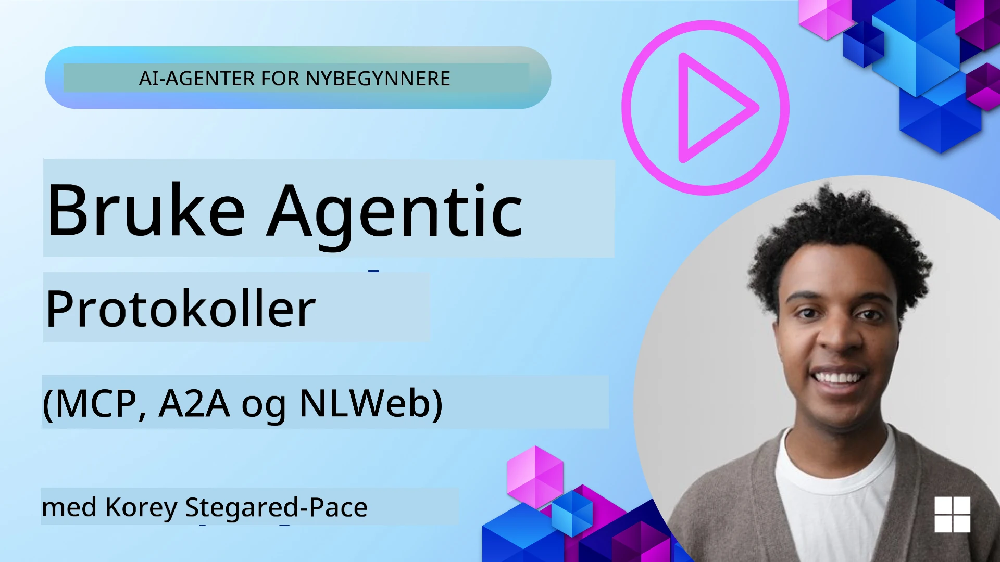
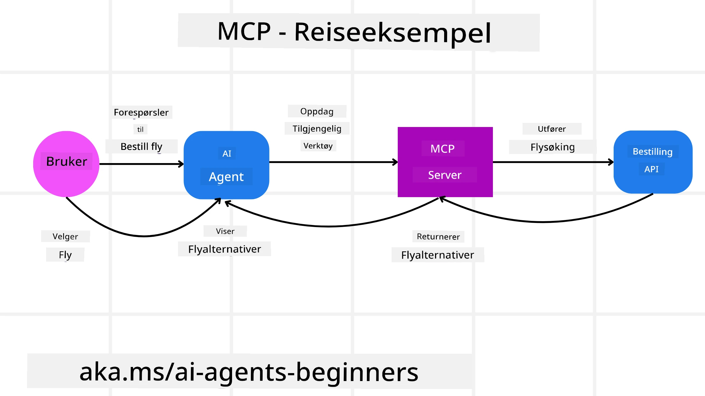
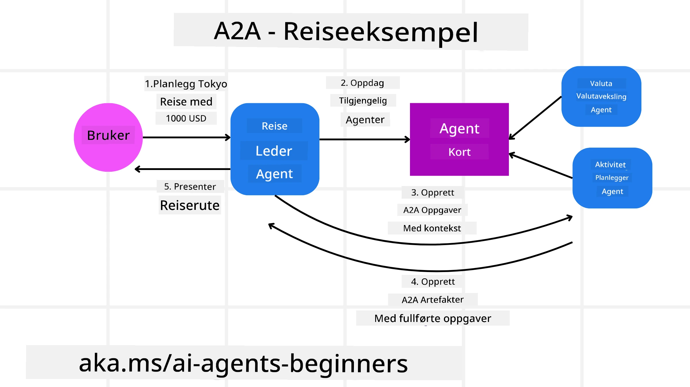
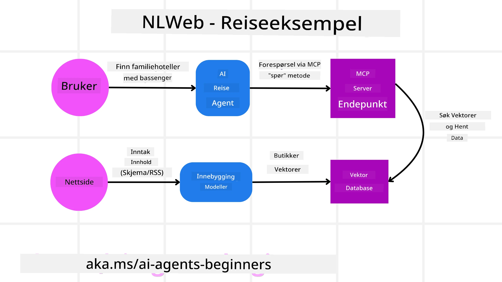

# Bruke Agentiske Protokoller (MCP, A2A og NLWeb)

> _(Klikk på bildet over for å se video av denne leksjonen)_

Etter hvert som bruken av AI-agenter vokser, øker også behovet for protokoller som sikrer standardisering, sikkerhet og støtter åpen innovasjon. I denne leksjonen vil vi dekke 3 protokoller som søker å møte dette behovet — Model Context Protocol (MCP), Agent to Agent (A2A) og Natural Language Web (NLWeb).

## Introduksjon

I denne leksjonen vil vi gjennomgå:

• Hvordan **MCP** lar AI-agenter få tilgang til eksterne verktøy og data for å utføre brukeroppgaver.

• Hvordan **A2A** muliggjør kommunikasjon og samarbeid mellom ulike AI-agenter.

• Hvordan **NLWeb** bringer naturlige språkgrensesnitt til hvilken som helst nettside og gjør det mulig for AI-agenter å oppdage og interagere med innholdet.

## Læringsmål

• **Identifisere** hovedformålet og fordelene med MCP, A2A og NLWeb i kontekst av AI-agenter.

• **Forklare** hvordan hver protokoll muliggjør kommunikasjon og interaksjon mellom LLM-er, verktøy og andre agenter.

• **Gjenkjenne** de distinkte rollene hver protokoll spiller i å bygge komplekse agentiske systemer.

## Model Context Protocol

**Model Context Protocol (MCP)** er en åpen standard som gir en standardisert måte for applikasjoner å gi kontekst og verktøy til LLM-er. Dette muliggjør en "universell adapter" til ulike datakilder og verktøy som AI-agenter kan koble til på en konsistent måte.

La oss se på komponentene i MCP, fordelene sammenlignet med direkte API-bruk, og et eksempel på hvordan AI-agenter kan bruke en MCP-server.

### MCP Kjernekomponenter

MCP opererer med en **klient-server-arkitektur** og de kjernekomponentene er:

• **Hosts** er LLM-applikasjoner (for eksempel en kode-editor som VSCode) som starter tilkoblingene til en MCP-server.

• **Clients** er komponenter innenfor host-applikasjonen som opprettholder en-til-en-tilkoblinger med servere.

• **Servers** er lette programmer som eksponerer spesifikke funksjonaliteter.

Inkludert i protokollen er tre kjerneprimitiver som er mulighetene til en MCP-server:

• **Tools**: Dette er diskrete handlinger eller funksjoner en AI-agent kan kalle på for å utføre en handling. For eksempel kan en værtjeneste eksponere et "hent vær" verktøy, eller en e-handelsserver kan eksponere et "kjøp produkt"-verktøy. MCP-servere annonserer hvert verktøys navn, beskrivelse og input/output-skjema i deres mulighetsoversikt.

• **Resources**: Dette er dataelementer eller dokumenter som er skrivebeskyttet og som en MCP-server kan levere, og klienter kan hente på forespørsel. Eksempler inkluderer filinnhold, databaseoppføringer eller loggfiler. Ressurser kan være tekst (som kode eller JSON) eller binære (som bilder eller PDF-filer).

• **Prompts**: Dette er forhåndsdefinerte maler som gir foreslåtte oppfordringer, og muliggjør mer komplekse arbeidsflyter.

### Fordeler med MCP

MCP tilbyr betydelige fordeler for AI-agenter:

• **Dynamisk verktøydiscovery**: Agenter kan dynamisk motta en liste over tilgjengelige verktøy fra en server sammen med beskrivelser av hva de gjør. Dette står i kontrast til tradisjonelle API-er som ofte krever statisk koding for integrasjoner, noe som betyr at enhver API-endring krever kodeoppdateringer. MCP tilbyr en "integrer én gang"-tilnærming, som gir større tilpasningsevne.

• **Interoperabilitet på tvers av LLM-er**: MCP fungerer på tvers av forskjellige LLM-er, og gir fleksibilitet til å bytte kjernemodeller for å evaluere bedre ytelse.

• **Standardisert sikkerhet**: MCP inkluderer en standard autentiseringsmetode, noe som forbedrer skalerbarheten når man legger til tilgang til flere MCP-servere. Dette er enklere enn å administrere forskjellige nøkler og autentiseringstyper for ulike tradisjonelle API-er.

### MCP Eksempel

Forestill deg at en bruker ønsker å bestille en flyreise ved hjelp av en AI-assistent drevet av MCP.

1. **Tilkobling**: AI-assistenten (MCP-klienten) kobler til en MCP-server levert av et flyselskap.

2. **Verktøydiscovery**: Klienten spør flyselskapets MCP-server: "Hvilke verktøy har dere tilgjengelig?" Serveren svarer med verktøy som "søk flyreiser" og "bestill flyreiser".

3. **Verktøybruk**: Du spør så AI-assistenten: "Vennligst søk etter en flyreise fra Portland til Honolulu." AI-assistenten, ved hjelp av sin LLM, identifiserer at den må kalle på "søk flyreiser"-verktøyet og sender relevante parametere (avreisested, destinasjon) til MCP-serveren.

4. **Utførelse og Respons**: MCP-serveren, som fungerer som en wrapper, gjør det faktiske kall mot flyselskapets interne booking-API. Den mottar deretter flyinformasjonen (f.eks. JSON-data) og sender den tilbake til AI-assistenten.

5. **Videre Interaksjon**: AI-assistenten presenterer flyalternativene. Når du velger en flyreise, kan assistenten kalle "bestill flyreise"-verktøyet på samme MCP-server for å fullføre bestillingen.

## Agent-til-Agent Protokoll (A2A)

Mens MCP fokuserer på å koble LLM-er til verktøy, tar **Agent-to-Agent (A2A) protokollen** det et steg videre ved å muliggjøre kommunikasjon og samarbeid mellom ulike AI-agenter. A2A kobler AI-agenter på tvers av ulike organisasjoner, miljøer og teknologistakker for å fullføre en felles oppgave.

Vi vil se på komponentene og fordelene med A2A, sammen med et eksempel på hvordan det kan brukes i vår reiseapplikasjon.

### A2A Kjernekomponenter

A2A fokuserer på å muliggjøre kommunikasjon mellom agenter og få dem til å samarbeide for å fullføre en deloppgave for brukeren. Hver komponent i protokollen bidrar til dette:

#### Agent Card

På samme måte som en MCP-server deler en liste over verktøy, har et Agent Card:
- Navnet på agenten.
- En **beskrivelse av generelle oppgaver** den fullfører.
- En **liste over spesifikke ferdigheter** med beskrivelser for å hjelpe andre agenter (eller til og med menneskelige brukere) med å forstå når og hvorfor de ønsker å kalle på den agenten.
- Den **nåværende Endepunkt-URLen** til agenten
- **versjon** og **muligheter** til agenten, som strømning av svar og pushvarsler.

#### Agent Executor

Agent Executor er ansvarlig for **å sende konteksten fra brukersamtalen til den eksterne agenten**; den eksterne agenten trenger dette for å forstå oppgaven som skal fullføres. I en A2A-server bruker en agent sin egen store språkmodell (LLM) til å tolke innkommende forespørsler og utføre oppgaver ved hjelp av egne interne verktøy.

#### Artifact

Når en ekstern agent har fullført den forespurte oppgaven, opprettes dens arbeidsprodukt som et artifact. Et artifact **inneholder resultatet av agentens arbeid**, en **beskrivelse av hva som er fullført**, og **tekstkonteksten** som sendes gjennom protokollen. Etter at artifactet er sendt, lukkes forbindelsen med den eksterne agenten inntil den trengs igjen.

#### Event Queue

Denne komponenten brukes til **håndtering av oppdateringer og meldingsoverføring**. Den er spesielt viktig i produksjon for agentiske systemer for å forhindre at forbindelsen mellom agenter lukkes før en oppgave er fullført, spesielt når oppgavefullføring kan ta lengre tid.

### Fordeler med A2A

• **Forbedret Samarbeid**: Lar agenter fra forskjellige leverandører og plattformer samhandle, dele kontekst og jobbe sammen, og legger til rette for sømløs automatisering på tvers av tradisjonelt isolerte systemer.

• **Fleksibilitet i Modellvalg**: Hver A2A-agent kan bestemme hvilken LLM den bruker for å håndtere sine forespørsler, noe som muliggjør optimaliserte eller finjusterte modeller per agent, i motsetning til én LLM-tilkobling i enkelte MCP-scenarier.

• **Integrert Autentisering**: Autentisering er bygget direkte inn i A2A-protokollen, og gir et robust sikkerhetsrammeverk for agentinteraksjoner.

### A2A Eksempel

La oss utvide vårt reisebestillingsscenario, men denne gangen med A2A.

1. **Brukerforespørsel til Multi-Agent**: En bruker samhandler med en "Travel Agent" A2A-klient/agent ved å si: "Vennligst bestill en hel tur til Honolulu neste uke, inkludert fly, hotell og leiebil."

2. **Orkestrering av Travel Agent**: Travel Agent mottar dette komplekse oppdraget. Den bruker sin LLM til å resonnere rundt oppgaven og avgjør at den må kommunisere med andre spesialiserte agenter.

3. **Inter-Agent Kommunikasjon**: Travel Agent bruker A2A-protokollen for å koble til underliggende agenter, som en "Flyselskap Agent," en "Hotell Agent," og en "Leiebil Agent" som er utviklet av forskjellige selskaper.

4. **Delegert Oppgaveutførelse**: Travel Agent sender spesifikke oppgaver til disse spesialiserte agentene (f.eks. "Finn fly til Honolulu", "Bestill hotell", "Lei bil"). Hver av disse agentene, som kjører sine egne LLM-er og bruker egne verktøy (som for eksempel MCP-servere), utfører sin spesifikke del av bestillingen.

5. **Konsolidert Respons**: Når alle underliggende agenter har fullført sine oppgaver, samler Travel Agent resultatene (flydetaljer, hotellbekreftelse, leiebilbestilling) og sender et omfattende, chatstil respons tilbake til brukeren.

## Natural Language Web (NLWeb)

Nettsider har lenge vært den primære måten for brukere å få tilgang til informasjon og data på internett.

La oss se på de ulike komponentene i NLWeb, fordelene med NLWeb, og et eksempel på hvordan vår NLWeb fungerer ved å se på vår reiseapplikasjon.

### Komponenter i NLWeb

- **NLWeb Applikasjon (Kjernedel av tjenestekode)**: Systemet som behandler spørsmål på naturlig språk. Det kobler sammen forskjellige deler av plattformen for å lage svar. Du kan tenke på det som **motoren som driver funksjonene for naturlig språk** på en nettside.

- **NLWeb Protokoll**: Dette er et **grunnleggende sett med regler for naturlig språk-interaksjon** med en nettside. Den sender tilbake svar i JSON-format (ofte bruker Schema.org). Formålet er å lage et enkelt fundament for “AI Web,” på samme måte som HTML gjorde det mulig å dele dokumenter på nettet.

- **MCP Server (Model Context Protocol Endepunkt)**: Hver NLWeb-oppsett fungerer også som en **MCP-server**. Dette betyr at den kan **dele verktøy (som en "ask"-metode) og data** med andre AI-systemer. I praksis gjør dette nettsidens innhold og funksjoner tilgjengelige for AI-agenter, slik at siden blir en del av det bredere "agent-økosystemet."

- **Embedding-modeller**: Disse modellene brukes til å **omdanne nettstedets innhold til numeriske representasjoner kalt vektorer** (embeddings). Disse vektorene fanger meningen på en måte som datamaskiner kan sammenligne og søke i. De lagres i en spesiell database, og brukerne kan velge hvilken embedding-modell de ønsker å bruke.

- **Vektordatabase (Gjenfinningsmekanisme)**: Denne databasen **lagrer embeddings av nettstedets innhold**. Når noen stiller et spørsmål, sjekker NLWeb vektordatabasen for å raskt finne den mest relevante informasjonen. Den gir en rask liste over mulige svar rangert etter likhet. NLWeb fungerer med ulike vektorlagringssystemer som Qdrant, Snowflake, Milvus, Azure AI Search og Elasticsearch.

### NLWeb ved Eksempel

Se for deg vårt reisebestillingsnettsted igjen, men denne gangen er det drevet av NLWeb.

1. **Datainntak**: Den eksisterende produktkatalogen på reisenettstedet (f.eks. flyoppføringer, hotellbeskrivelser, turpakker) formateres med Schema.org eller lastes inn via RSS-feeder. NLWeb sine verktøy tar inn disse strukturerte dataene, lager embeddings og lagrer dem i en lokal eller ekstern vektordatabase.

2. **Naturlig Språk Forespørsel (Menneske)**: En bruker besøker nettsiden og, i stedet for å navigere menyer, skriver i et chatte-grensesnitt: "Finn et familievennlig hotell i Honolulu med basseng for neste uke."

3. **NLWeb Behandling**: NLWeb-applikasjonen mottar forespørselen. Den sender den til en LLM for forståelse og søker samtidig i sin vektordatabase etter relevante hotelloppføringer.

4. **Nøyaktige Resultater**: LLM-en hjelper til med å tolke søkresultatene fra databasen, identifisere de beste treffene basert på kriteriene "familievennlig," "basseng," og "Honolulu," og formaterer deretter et svar på naturlig språk. Viktig er at svaret henviser til faktiske hoteller fra nettstedets katalog, og unngår oppdiktet informasjon.

5. **Interaksjon med AI-Agent**: Fordi NLWeb fungerer som en MCP-server, kan en ekstern AI-reiseagent også koble seg til denne NLWeb-instansen på nettsiden. AI-agenten kan da bruke `ask` MCP-metoden for å spørre nettsiden direkte: `ask("Er det noen veganvennlige restauranter i Honolulu-området som anbefales av hotellet?")`. NLWeb-instansen ville behandle dette, bruke sin database med restaurantinformasjon (hvis lastet inn), og returnere et strukturert JSON-svar.

### Har du flere spørsmål om MCP/A2A/NLWeb?

Bli med i [Microsoft Foundry Discord](https://aka.ms/ai-agents/discord) for å møte andre elever, delta på kontortid og få svar på dine spørsmål om AI Agenter.

## Ressurser

- [MCP for nybegynnere](https://aka.ms/mcp-for-beginners)  
- [MCP Dokumentasjon](https://learn.microsoft.com/python/api/overview/azure/ai-projects-readme)
- [NLWeb Repo](https://github.com/nlweb-ai/NLWeb)
- [Microsoft Agent Framework](https://aka.ms/ai-agents-beginners/agent-framewrok)

---

<!-- CO-OP TRANSLATOR DISCLAIMER START -->
**Ansvarsfraskrivelse**:
Dette dokumentet er oversatt ved hjelp av AI-oversettelsestjenesten [Co-op Translator](https://github.com/Azure/co-op-translator). Selv om vi streber etter nøyaktighet, vennligst vær oppmerksom på at automatiske oversettelser kan inneholde feil eller unøyaktigheter. Det opprinnelige dokumentet på originalspråket bør anses som den autoritative kilden. For kritisk informasjon anbefales profesjonell menneskelig oversettelse. Vi er ikke ansvarlige for misforståelser eller feiltolkninger som følge av bruk av denne oversettelsen.
<!-- CO-OP TRANSLATOR DISCLAIMER END -->