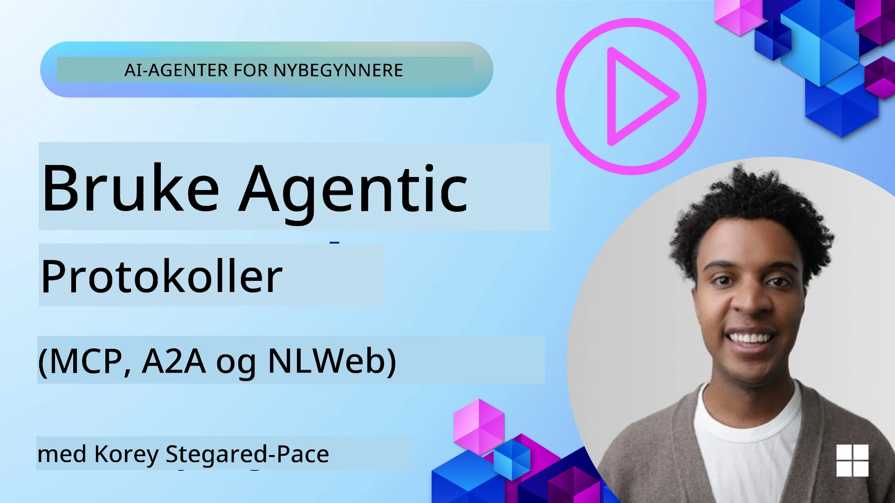
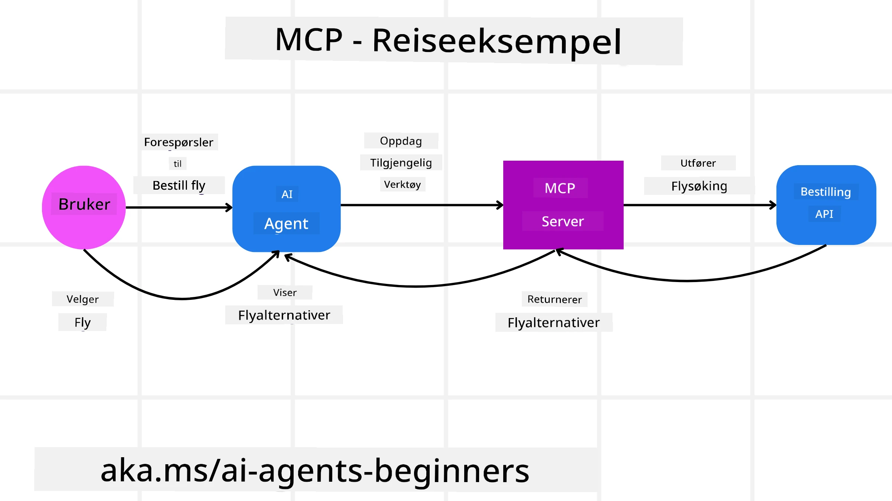
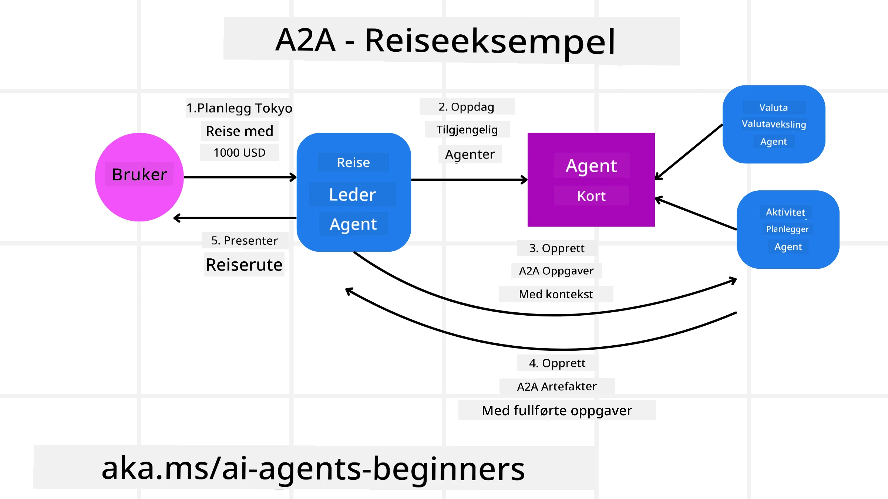
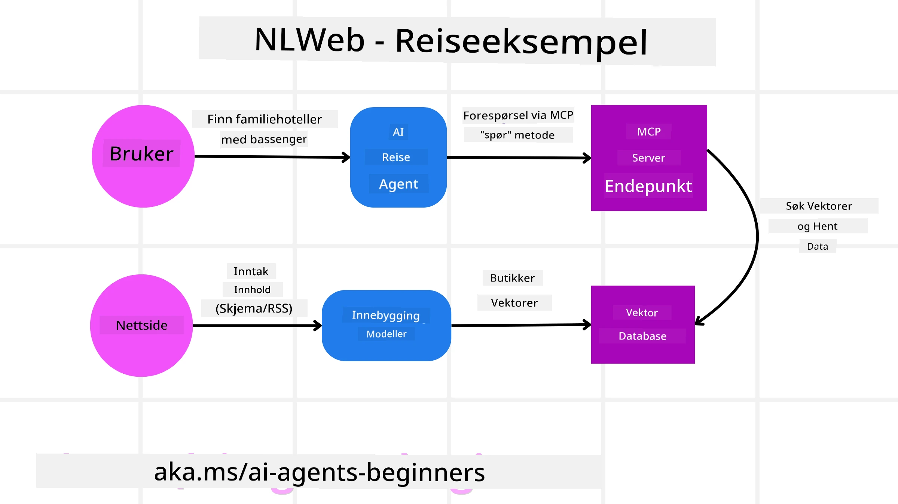

# Bruke Agentiske Protokoller (MCP, A2A og NLWeb)

> _(Klikk på bildet over for å se video av denne leksjonen)_

Etter hvert som bruken av AI-agenter vokser, øker også behovet for protokoller som sikrer standardisering, sikkerhet og støtter åpen innovasjon. I denne leksjonen vil vi dekke 3 protokoller som søker å møte dette behovet - Model Context Protocol (MCP), Agent to Agent (A2A) og Natural Language Web (NLWeb).

## Introduksjon

I denne leksjonen vil vi gå gjennom:

• Hvordan **MCP** lar AI-agenter få tilgang til eksterne verktøy og data for å fullføre brukeroppgaver.

• Hvordan **A2A** muliggjør kommunikasjon og samarbeid mellom forskjellige AI-agenter.

• Hvordan **NLWeb** bringer naturlige språkgrensesnitt til hvilken som helst nettside, slik at AI-agenter kan oppdage og samhandle med innholdet.

## Læringsmål

• **Identifisere** kjerneformålet og fordelene med MCP, A2A og NLWeb i konteksten av AI-agenter.

• **Forklare** hvordan hver protokoll legger til rette for kommunikasjon og interaksjon mellom LLMer, verktøy og andre agenter.

• **Gjenkjenne** de ulike rollene hver protokoll spiller i byggingen av komplekse agentiske systemer.

## Model Context Protocol

**Model Context Protocol (MCP)** er en åpen standard som tilbyr en standardisert måte for applikasjoner å gi kontekst og verktøy til LLMer. Dette muliggjør en "universell adapter" til forskjellige datakilder og verktøy som AI-agenter kan koble til på en konsistent måte.

La oss se på komponentene i MCP, fordelene sammenlignet med direkte API-bruk, og et eksempel på hvordan AI-agenter kan bruke en MCP-server.

### MCPs Kjernekomponenter

MCP opererer på en **klient-tjener-arkitektur** og kjernekomponentene er:

• **Vertsprogrammer** er LLM-applikasjoner (for eksempel en kodeeditor som VSCode) som starter tilkoblinger til en MCP-server.

• **Klienter** er komponenter innen vertsprogrammet som opprettholder én-til-én-tilkoblinger med servere.

• **Servere** er lette programmer som eksponerer spesifikke funksjoner.

Inkludert i protokollen er tre kjerneprimitiver som er funksjonene til en MCP-server:

• **Verktøy**: Dette er diskrete handlinger eller funksjoner en AI-agent kan kalle for å utføre en handling. For eksempel kan en værmeldingstjeneste tilby et "hent vær"-verktøy, eller en e-handelserver kan tilby et "kjøp produkt"-verktøy. MCP-servere oppgir hvert verktøys navn, beskrivelse og input/output-skjema i sin funksjonsliste.

• **Ressurser**: Dette er skrivebeskyttede dataelementer eller dokumenter som en MCP-server kan gi, og klienter kan hente dem på forespørsel. Eksempler inkluderer filinnhold, databaseposter eller loggfiler. Ressurser kan være tekst (som kode eller JSON) eller binær (som bilder eller PDF-er).

• **Prompter**: Dette er forhåndsdefinerte maler som gir foreslåtte prompter, noe som muliggjør mer komplekse arbeidsflyter.

### Fordeler med MCP

MCP tilbyr betydelige fordeler for AI-agenter:

• **Dynamisk Verktøysoppdagelse**: Agenter kan dynamisk motta en liste over tilgjengelige verktøy fra en server sammen med beskrivelser av hva de gjør. Dette står i kontrast til tradisjonelle APIer, som ofte krever statisk koding for integrasjoner, noe som betyr at enhver API-endring krever kodeoppdateringer. MCP tilbyr en "integrer én gang"-tilnærming, som gir større tilpasningsevne.

• **Interoperabilitet på tvers av LLMer**: MCP fungerer på tvers av forskjellige LLMer, og gir fleksibilitet til å bytte kjerner for å evaluere for bedre ytelse.

• **Standardisert Sikkerhet**: MCP inkluderer en standard autentiseringsmetode, som forbedrer skalerbarheten ved å legge til tilgang til flere MCP-servere. Dette er enklere enn å håndtere forskjellige nøkler og autentiseringstyper for ulike tradisjonelle APIer.

### MCP Eksempel

Forestill deg at en bruker vil booke en flyreise ved hjelp av en AI-assistent drevet av MCP.

1. **Tilkobling**: AI-assistenten (MCP-klienten) kobler til en MCP-server levert av et flyselskap.

2. **Verktøysoppdagelse**: Klienten spør flyselskapets MCP-server, "Hvilke verktøy har dere tilgjengelig?" Serveren svarer med verktøy som "søk fly" og "book fly".

3. **Verktøykalling**: Du ber deretter AI-assistenten, "Vennligst søk etter en flyreise fra Portland til Honolulu." AI-assistenten, ved bruk av sin LLM, identifiserer at den må kalle "søk fly"-verktøyet og sender de relevante parameterne (opprinnelse, destinasjon) til MCP-serveren.

4. **Utførelse og Svar**: MCP-serveren, som fungerer som en innpakning, foretar det faktiske kallet til flyselskapets interne booking-API. Den mottar deretter flyinformasjonen (f.eks. JSON-data) og sender den tilbake til AI-assistenten.

5. **Videre Interaksjon**: AI-assistenten presenterer flyalternativene. Når du velger en flyreise, kan assistenten kalle "book fly"-verktøyet på samme MCP-server, og fullfører bookingen.

## Agent-til-Agent Protokoll (A2A)

Mens MCP fokuserer på å koble LLMer til verktøy, tar **Agent-til-Agent (A2A)-protokollen** det et steg videre ved å muliggjøre kommunikasjon og samarbeid mellom forskjellige AI-agenter. A2A kobler AI-agenter på tvers av ulike organisasjoner, miljøer og teknologistakker for å fullføre en felles oppgave.

Vi vil undersøke komponentene og fordelene med A2A, sammen med et eksempel på hvordan det kan anvendes i vår reiseapplikasjon.

### A2As Kjernekomponenter

A2A fokuserer på å muliggjøre kommunikasjon mellom agenter og få dem til å samarbeide om å fullføre en deloppgave for brukeren. Hver komponent i protokollen bidrar til dette:

#### Agentkort

På samme måte som en MCP-server deler en liste over verktøy, har et Agentkort:
- Agentens navn.
- En **beskrivelse av de generelle oppgavene** den utfører.
- En **liste over spesifikke ferdigheter** med beskrivelser for å hjelpe andre agenter (eller til og med menneskelige brukere) å forstå når og hvorfor de vil kalle på denne agenten.
- Den **nåværende endepunkt-URLen** til agenten.
- **Versjonen** og **funksjonene** til agenten, slik som streaming svar og push-varsler.

#### Agent Executor

Agent Executor er ansvarlig for å **overføre konteksten fra brukerchatten til den eksterne agenten**, da den eksterne agenten trenger dette for å forstå oppgaven som skal utføres. I en A2A-server bruker en agent sin egen store språkmodell (LLM) for å tolke innkommende forespørsler og utføre oppgaver ved hjelp av sine interne verktøy.

#### Artefakt

Når en ekstern agent har fullført den forespurte oppgaven, blir arbeidsproduktet dens opprettet som et artefakt. Et artefakt **inneholder resultatet av agentens arbeid**, en **beskrivelse av hva som ble fullført**, og den **tekstlige konteksten** som sendes gjennom protokollen. Etter at artefaktet er sendt, lukkes forbindelsen med den eksterne agenten til den trengs igjen.

#### Hendelseskø

Denne komponenten brukes til **å håndtere oppdateringer og overføre meldinger**. Den er spesielt viktig i produksjon for agentiske systemer for å forhindre at forbindelsen mellom agenter lukkes før en oppgave er fullført, spesielt når oppgaver kan ta lengre tid.

### Fordeler med A2A

• **Forbedret Samarbeid**: Den gjør at agenter fra ulike leverandører og plattformer kan samhandle, dele kontekst og jobbe sammen, og legger til rette for sømløs automatisering på tvers av tradisjonelt frakoblede systemer.

• **Fleksibilitet i Modellvalg**: Hver A2A-agent kan bestemme hvilken LLM den bruker for å betjene sine forespørsler, noe som tillater optimaliserte eller finjusterte modeller per agent, i motsetning til en enkelt LLM-tilkobling i noen MCP-scenarier.

• **Innebygd Autentisering**: Autentisering er integrert direkte i A2A-protokollen, og gir et robust sikkerhetsrammeverk for agentinteraksjoner.

### A2A Eksempel

La oss utvide vårt reisebookingscenario, men denne gangen ved bruk av A2A.

1. **Brukerforespørsel til Multi-Agent**: En bruker samhandler med en "Reiseagent" A2A klient/agent, kanskje ved å si: "Vennligst book en hel tur til Honolulu for neste uke, inkludert fly, hotell og leiebil".

2. **Orkestrering av Reiseagenten**: Reiseagenten mottar denne komplekse forespørselen. Den bruker sin LLM til å resonnere rundt oppgaven og avgjøre at den trenger å samhandle med andre spesialiserte agenter.

3. **Mellom-agent Kommunikasjon**: Reiseagenten bruker så A2A-protokollen for å koble til nedstrøms agenter, slik som en "Flyselskap-Agent," en "Hotell-Agent" og en "Leiebil-Agent" som er opprettet av forskjellige selskaper.

4. **Delegert Oppgaveutførelse**: Reiseagenten sender spesifikke oppgaver til disse spesialiserte agentene (f.eks. "Finn fly til Honolulu," "Book et hotell," "Lei en bil"). Hver av disse spesialiserte agentene, som kjører sine egne LLMer og bruker sine egne verktøy (som kan være MCP-servere selv), utfører sin spesifikke del av bookingen.

5. **Konsolidert Svar**: Når alle nedstrøms-agenter har fullført sine oppgaver, samler Reiseagenten resultatene (flydetaljer, hotellbekreftelse, leiebilbooking) og sender et omfattende, chat-lignende svar tilbake til brukeren.

## Natural Language Web (NLWeb)

Nettsider har lenge vært den primære måten for brukere å få tilgang til informasjon og data på internett.

La oss se på de ulike komponentene i NLWeb, fordelene med NLWeb og et eksempel på hvordan vår NLWeb fungerer ved å se på vår reiseapplikasjon.

### Komponenter i NLWeb

- **NLWeb Applikasjon (kjerne tjenestekode)**: Systemet som behandler spørsmål på naturlig språk. Det kobler sammen de ulike delene av plattformen for å lage svar. Du kan tenke på det som **motoren som driver naturlige språkfunksjoner** på en nettside.

- **NLWeb Protokoll**: Dette er et **grunnleggende sett med regler for naturlig språkinteraksjon** med en nettside. Den sender tilbake svar i JSON-format (ofte ved bruk av Schema.org). Formålet er å skape et enkelt grunnlag for "AI-nettet," på samme måte som HTML gjorde det mulig å dele dokumenter på nettet.

- **MCP Server (Model Context Protocol Endepunkt)**: Hvert NLWeb-oppsett fungerer også som en **MCP-server**. Dette betyr at det kan **dele verktøy (som en "spør"-metode) og data** med andre AI-systemer. I praksis gjør dette nettsidens innhold og kapasiteter brukbare for AI-agenter, noe som lar nettstedet bli en del av det bredere "agentøkosystemet."

- **Embedding-modeller**: Disse modellene brukes til å **konvertere nettsideinnhold til numeriske representasjoner kalt vektorer** (embeddings). Disse vektorene fanger mening på en måte som datamaskiner kan sammenligne og søke i. De lagres i en spesiell database, og brukere kan velge hvilken embedding-modell de ønsker å bruke.

- **Vektordatabase (retrieval-mekanisme)**: Denne databasen **lagrer embeddings av nettsideinnholdet**. Når noen stiller et spørsmål, sjekker NLWeb vektordatabasen for raskt å finne den mest relevante informasjonen. Den gir en rask liste over mulige svar, rangert etter likhet. NLWeb fungerer med forskjellige vektor lagringssystemer som Qdrant, Snowflake, Milvus, Azure AI Search og Elasticsearch.

### NLWeb med Eksempel

Tenk igjen på vår reisebookingside, men denne gangen drevet av NLWeb.

1. **Datainntak**: Reise-nettsidens eksisterende produktkataloger (f.eks. flylister, hotellbeskrivelser, turopplegg) blir formatert ved bruk av Schema.org eller lastet opp via RSS-feeder. NLWebs verktøy tar inn denne strukturerte dataen, lager embeddings, og lagrer dem i en lokal eller ekstern vektordatabase.

2. **Naturlig Språkspørsmål (Menneske)**: En bruker besøker nettsiden og skriver inn i et chattegrensesnitt i stedet for å navigere i menyer: "Finn et familievennlig hotell i Honolulu med basseng for neste uke".

3. **NLWeb Behandling**: NLWeb-applikasjonen mottar dette spørsmålet. Den sender spørsmålet til en LLM for forståelse og søker samtidig i sin vektordatabase etter relevante hotelltilbud.

4. **Nøyaktige Resultater**: LLM hjelper til med å tolke søkeresultatene fra databasen, identifisere de beste treffene basert på kriteriene "familievennlig," "basseng," og "Honolulu," og formaterer deretter et svar på naturlig språk. Viktigst av alt, svaret refererer til faktiske hoteller fra nettstedets katalog, og unngår oppdiktet informasjon.

5. **AI-Agent Interaksjon**: Fordi NLWeb fungerer som en MCP-server, kan en ekstern AI-reiseagent også koble til denne nettsidens NLWeb-instans. AI-agenten kan da bruke MCP-metoden `ask` for å spørre nettsiden direkte: `ask("Finnes det noen veganvennlige restauranter i Honolulu-området anbefalt av hotellet?")`. NLWeb-instansen vil behandle dette, utnytte sin database over restaurantinformasjon (hvis lastet inn), og returnere et strukturert JSON-svar.

### Har du flere spørsmål om MCP/A2A/NLWeb?

Bli med i [Microsoft Foundry Discord](https://discord.com/invite/ATgtXmAS5D) for å møte andre lærende, delta på kontortid og få svar på dine spørsmål om AI-agentene.

## Ressurser

- [MCP for Nybegynnere](https://aka.ms/mcp-for-beginners)  
- [MCP Dokumentasjon](https://learn.microsoft.com/python/api/overview/azure/ai-projects-readme)
- [NLWeb Repo](https://github.com/nlweb-ai/NLWeb)
- [Microsoft Agent Framework](https://learn.microsoft.com/en-us/agent-framework/overview/?wt.mc_id=youtube_26688_organicsocial_reactor&pivots=programming-language-python)

## Forrige Leksjon

[AI-agenter i Produksjon](../10-ai-agents-production/README.md)

## Neste Leksjon

[Konteksteknikk for AI-agenter](../12-context-engineering/README.md)

---

<!-- CO-OP TRANSLATOR DISCLAIMER START -->
**Ansvarsfraskrivelse**:
Dette dokumentet er oversatt ved hjelp av AI-oversettelsestjenesten [Co-op Translator](https://github.com/Azure/co-op-translator). Selv om vi streber etter nøyaktighet, vær oppmerksom på at automatiske oversettelser kan inneholde feil eller unøyaktigheter. Det opprinnelige dokumentet på originalspråket skal betraktes som den autoritative kilden. For kritisk informasjon anbefales profesjonell menneskelig oversettelse. Vi er ikke ansvarlige for eventuelle misforståelser eller feiltolkninger som oppstår ved bruk av denne oversettelsen.
<!-- CO-OP TRANSLATOR DISCLAIMER END -->