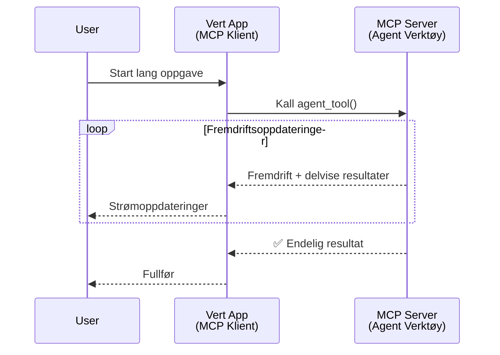
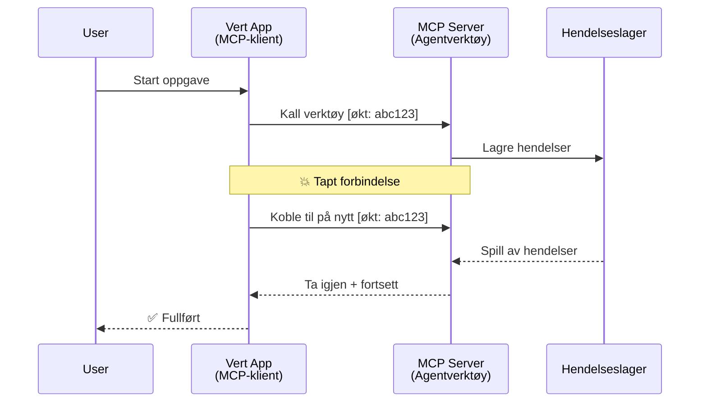
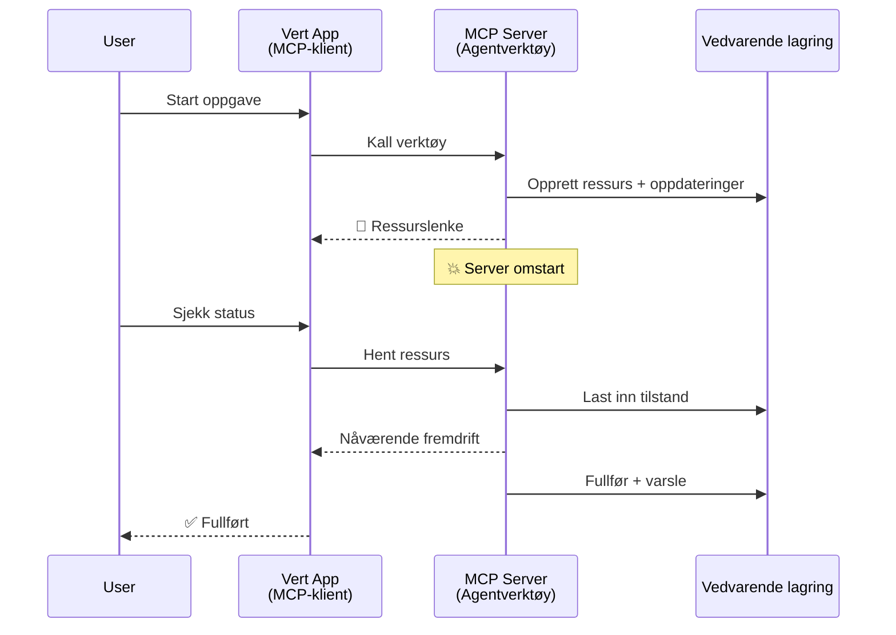
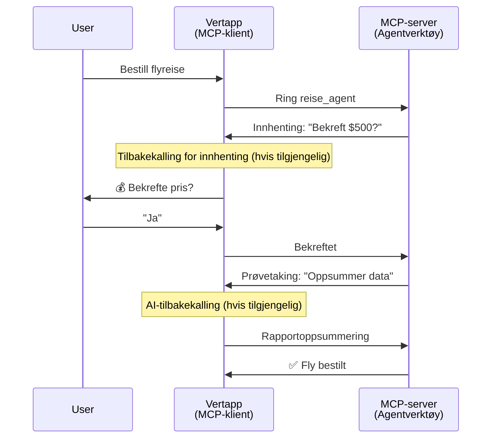
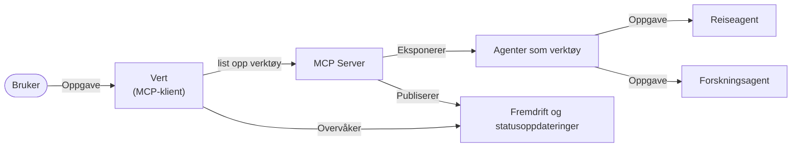

# Bygge Agent-til-Agent Kommunikasjonssystemer med MCP

> TL;DR - Kan du bygge Agent2Agent-kommunikasjon på MCP? Ja!

MCP har utviklet seg betydelig utover sitt opprinnelige mål om "å gi kontekst til LLM-er". Med nylige forbedringer som inkluderer [gjenopptakbare strømmer](https://modelcontextprotocol.io/docs/concepts/transports#resumability-and-redelivery), [elicitering](https://modelcontextprotocol.io/specification/2025-06-18/client/elicitation), [sampling](https://modelcontextprotocol.io/specification/2025-06-18/client/sampling), og varsler ([progresjon](https://modelcontextprotocol.io/specification/2025-06-18/basic/utilities/progress) og [ressurser](https://modelcontextprotocol.io/specification/2025-06-18/schema#resourceupdatednotification)), gir MCP nå et robust grunnlag for å bygge komplekse agent-til-agent kommunikasjonssystemer.

## Agent/Verktøy Misforståelsen

Ettersom flere utviklere utforsker verktøy med agentiske atferder (kjører i lange perioder, kan kreve tilleggsinput midt i kjøringen, osv.), er en vanlig misforståelse at MCP er uegnet, hovedsakelig fordi tidlige eksempler på verktøy var primitive og fokuserte på enkle forespørsels-respons-mønstre.

Denne oppfatningen er utdatert. MCP-spesifikasjonen er blitt betydelig forbedret de siste månedene med funksjonaliteter som lukker gapet for å bygge langvarig agentisk atferd:

- **Streaming & Delvise Resultater**: Sanntids oppdateringer under kjøring
- **Gjenopptakbarhet**: Klienter kan koble til igjen og fortsette etter frakobling
- **Holdbarhet**: Resultater overlever serveromstart (f.eks. via ressurslenker)
- **Flere runder**: Interaktiv input midt i kjøringen via elicitering og sampling

Disse funksjonene kan kombineres for å muliggjøre komplekse agentiske og multi-agent applikasjoner, alle distribuert på MCP-protokollen.

For referanse vil vi omtale en agent som et "verktøy" som er tilgjengelig på en MCP-server. Dette forutsetter en vertsapplikasjon som implementerer en MCP-klient som etablerer en økt med MCP-serveren og kan kalle agenten.

## Hva Gjør et MCP-verktøy "Agentisk"?

Før vi går inn i implementasjonen, la oss fastslå hvilke infrastrukturelle kapabiliteter som trengs for å støtte langvarige agenter.

> Vi definerer en agent som en enhet som kan operere autonomt over utvidede perioder, i stand til å håndtere komplekse oppgaver som kan kreve flere interaksjoner eller justeringer basert på sanntids tilbakemelding.

### 1. Streaming & Delvise Resultater

Tradisjonelle forespørsels-respons mønstre fungerer ikke for langvarige oppgaver. Agenter må tilby:

- Sanntids oppdateringer om progresjon
- Delvise resultater underveis

**MCP-støtte**: Varsler om ressursoppdateringer muliggjør streaming av delvise resultater, men dette krever nøye design for å unngå konflikter med JSON-RPCs 1:1 forespørsel/response-modell.

| Funksjon                   | Brukstilfelle                                                                                                                               | MCP-støtte                                                                              |
| ------------------------- | ------------------------------------------------------------------------------------------------------------------------------------------ | --------------------------------------------------------------------------------------- |
| Sanntids oppdateringer    | Bruker ber agenten om kodebase-migreringsoppgave. Agenten streamer fremdrift: "10 % - Analyserer avhengigheter... 25 % - Konverterer TypeScript-filer... 50 % - Oppdaterer imports..." | ✅ Progresjonsvarsler                                                                   |
| Delvise resultater         | "Generer en bok" oppgave streamer delresultater, f.eks. 1) Historiebue-outline, 2) Kapitel-liste, 3) Hvert kapittel etter hvert som det fullføres. Vert kan inspisere, avbryte eller omdirigere når som helst. | ✅ Varsler kan "utvides" til å inkludere delresulter, se forslag på PR 383, 776           |

<div align="center" style="font-style: italic; font-size: 0.95em; margin-bottom: 0.5em;">
<strong>Figur 1:</strong> Dette diagrammet illustrerer hvordan en MCP-agent streamer sanntids fremdriftsoppdateringer og delvise resultater til vertsapplikasjonen under en langvarig oppgave, noe som gjør det mulig for brukeren å overvåke utførelsen i sanntid.
</div>



### 2. Gjenopptakbarhet

Agenter må håndtere nettverksavbrudd på en smidig måte:

- Koble til igjen etter (klient) frakobling
- Fortsette der de slapp (melding-gjenvinning)

**MCP-støtte**: MCPs StreamableHTTP-transport støtter i dag gjenopptak av økt og melding-gjenvinning med session IDs og siste event-IDer. Viktig å merke seg er at serveren må implementere et EventStore som muliggjør event-replay ved klient-gjenforbindelse.  
Merk at det finnes et fellesskapsforslag (PR #975) som utforsker transport-agnostiske gjenopptakbare strømmer.

| Funksjon     | Brukstilfelle                                                                                                                                          | MCP-støtte                                                                |
| ----------- | ------------------------------------------------------------------------------------------------------------------------------------------------------ | -------------------------------------------------------------------------- |
| Gjenopptakbarhet | Klienten kobler fra under en langvarig oppgave. Ved gjenforbindelse fortsetter økten med gjengitte savnede hendelser, og fortsetter sømløst der den slapp. | ✅ StreamableHTTP-transport med session IDs, event-replay og EventStore     |

<div align="center" style="font-style: italic; font-size: 0.95em; margin-bottom: 0.5em;">
<strong>Figur 2:</strong> Dette diagrammet viser hvordan MCPs StreamableHTTP-transport og event store muliggjør sømløs gjenopptakelse av økter: hvis klienten kobler fra, kan den koble til igjen og gjenta savnede hendelser, og fortsette oppgaven uten tap av fremgang.
</div>



### 3. Holdbarhet

Langvarige agenter trenger vedvarende tilstand:

- Resultater overlever serveromstarter
- Status kan hentes uavhengig av bånd
- Progresjonssporing over økter

**MCP-støtte**: MCP støtter nå en ressurslenketilbake-type for verktøy-kall. En vanlig mønster i dag er å designe et verktøy som oppretter en ressurs og umiddelbart returnerer en ressurslenke. Verktøyet kan i bakgrunnen fortsette å ta seg av oppgaven og oppdatere ressursen. Klienten kan så velge å poll'e tilstanden til denne ressursen for å få delvise eller fullstendige resultater (basert på hvilke ressursoppdateringer serveren gir) eller abonnere på ressursen for oppdateringsvarsler.

En begrensning her er at polling av ressurser eller abonnement på oppdateringer kan forbruke ressurser med konsekvenser i stor skala. Det finnes et åpent fellesskapsforslag (inkludert #992) som utforsker muligheten for å inkludere webhooks eller triggere som serveren kan kalle for å varsle klient/vertsapplikasjon om oppdateringer.

| Funksjon   | Brukstilfelle                                                                                                                                   | MCP-støtte                                                        |
| --------- | ------------------------------------------------------------------------------------------------------------------------------------------------ | ----------------------------------------------------------------- |
| Holdbarhet | Serveren krasjer under en data-migreringsoppgave. Resultater og fremdrift overlever omstart, klient kan sjekke status og fortsette fra persistent ressurs. | ✅ Ressurslenker med vedvarende lagring og statusvarsler          |

I dag er et vanlig mønster å designe et verktøy som oppretter en ressurs og umiddelbart returnerer en ressurslenke. Verktøyet kan i bakgrunnen ta hånd om oppgaven, sende ressursvarsler som fungerer som fremdriftsoppdateringer eller inkluderer delvise resultater, og oppdatere innholdet i ressursen etter behov.

<div align="center" style="font-style: italic; font-size: 0.95em; margin-bottom: 0.5em;">
<strong>Figur 3:</strong> Dette diagrammet viser hvordan MCP-agenter bruker vedvarende ressurser og statusvarsler for å sikre at langvarige oppgaver overlever serveromstarter, slik at klienter kan sjekke fremdrift og hente resultater selv etter feil.
</div>



### 4. Multi-Runde Interaksjoner

Agenter trenger ofte tilleggsinput midt i kjøringen:

- Menneskelig klargjøring eller godkjenning
- AI-assistanse for komplekse beslutninger
- Dynamisk justering av parametere

**MCP-støtte**: Fullt støttet via sampling (for AI-input) og elicitering (for menneskelig input).

| Funksjon              | Brukstilfelle                                                                                                                                    | MCP-støtte                                             |
| -------------------- | ------------------------------------------------------------------------------------------------------------------------------------------------ | ------------------------------------------------------- |
| Multi-Runde Interaksjoner | Reisebestillingsagent ber om prisbekreftelse fra bruker, deretter ber AI om å oppsummere reisedata før bestillingen fullføres.                      | ✅ Elicitering for menneskelig input, sampling for AI-input |

<div align="center" style="font-style: italic; font-size: 0.95em; margin-bottom: 0.5em;">
<strong>Figur 4:</strong> Dette diagrammet viser hvordan MCP-agenter interaktivt kan elicitere menneskelig input eller be om AI-assistanse midtkjøring, og støtte komplekse, multi-runde arbeidsflyter som bekreftelser og dynamisk beslutningstaking.
</div>



## Implementering av Langvarige Agenter på MCP - Kodeoversikt

Som del av denne artikkelen tilbyr vi et [kode-repositorium](https://github.com/victordibia/ai-tutorials/tree/main/MCP%20Agents) som inneholder en komplett implementasjon av langvarige agenter ved bruk av MCP Python SDK med StreamableHTTP-transport for øktgjenopptakelse og melding-gjenvinning. Implementasjonen demonstrerer hvordan MCP-funksjoner kan kombineres for å aktivere sofistikerte agent-lignende atferder.

Vi implementerer spesielt en server med to primære agentverktøy:

- **Reiseagent** - Simulerer en reisebestillingstjeneste med prisbekreftelse via elicitering
- **Forskningsagent** - Utfører forskningsoppgaver med AI-assisterte oppsummeringer via sampling

Begge agenter demonstrerer sanntids fremdriftsoppdateringer, interaktive bekreftelser, og full støtte for øktgjenopptakelse.

### Nøkkelkonsepter i Implementasjonen

Følgende seksjoner viser server-side agentimplementasjon og klient-side håndtering for hver kapabilitet:

#### Streaming & Fremdriftsoppdateringer - Sanntid Status på Oppgave

Streaming gjør det mulig for agenter å gi sanntids fremdriftsoppdateringer under langvarige oppgaver, og holder brukere informert om status og delresultater.

**Serverimplementasjon (agent sender fremdriftsvarsler):**

```python
# Fra server/server.py - Reisebyrå som sender fremdriftsoppdateringer
for i, step in enumerate(steps):
    await ctx.session.send_progress_notification(
        progress_token=ctx.request_id,
        progress=i * 25,
        total=100,
        message=step,
        related_request_id=str(ctx.request_id)
    )
    await anyio.sleep(2)  # Simuler arbeid

# Alternativ: Loggmeldinger for detaljerte trinnvise oppdateringer
await ctx.session.send_log_message(
    level="info",
    data=f"Processing step {current_step}/{steps} ({progress_percent}%)",
    logger="long_running_agent",
    related_request_id=ctx.request_id,
)
```

**Klientimplementasjon (vert mottar fremdriftsoppdateringer):**

```python
# Fra client/client.py - Klient som håndterer sanntidsvarsler
async def message_handler(message) -> None:
    if isinstance(message, types.ServerNotification):
        if isinstance(message.root, types.LoggingMessageNotification):
            console.print(f"📡 [dim]{message.root.params.data}[/dim]")
        elif isinstance(message.root, types.ProgressNotification):
            progress = message.root.params
            console.print(f"🔄 [yellow]{progress.message} ({progress.progress}/{progress.total})[/yellow]")

# Registrer meldingsbehandler ved opprettelse av økt
async with ClientSession(
    read_stream, write_stream,
    message_handler=message_handler
) as session:
```

#### Elicitering - Be om Brukerinput

Elicitering gjør det mulig for agenter å be om brukerinput midtkjøring. Dette er essensielt for bekreftelser, avklaringer eller godkjenninger under langvarige oppgaver.

**Serverimplementasjon (agent ber om bekreftelse):**

```python
# Fra server/server.py - Reisebyrå som ber om prisbekreftelse
elicit_result = await ctx.session.elicit(
    message=f"Please confirm the estimated price of $1200 for your trip to {destination}",
    requestedSchema=PriceConfirmationSchema.model_json_schema(),
    related_request_id=ctx.request_id,
)

if elicit_result and elicit_result.action == "accept":
    # Fortsett med bestillingen
    logger.info(f"User confirmed price: {elicit_result.content}")
elif elicit_result and elicit_result.action == "decline":
    # Avbryt bestillingen
    booking_cancelled = True
```

**Klientimplementasjon (vert leverer eliciterings-callback):**

```python
# Fra client/client.py - Klientbehandling av eliciteringsforespørsler
async def elicitation_callback(context, params):
    console.print(f"💬 Server is asking for confirmation:")
    console.print(f"   {params.message}")

    response = console.input("Do you accept? (y/n): ").strip().lower()

    if response in ['y', 'yes']:
        return types.ElicitResult(
            action="accept",
            content={"confirm": True, "notes": "Confirmed by user"}
        )
    else:
        return types.ElicitResult(
            action="decline",
            content={"confirm": False, "notes": "Declined by user"}
        )

# Registrer callback når økten opprettes
async with ClientSession(
    read_stream, write_stream,
    elicitation_callback=elicitation_callback
) as session:
```

#### Sampling - Be om AI-assistanse

Sampling lar agenter be om LLM-assistanse for komplekse beslutninger eller innholdsgenerering under kjøring. Dette muliggjør hybride menneske-AI arbeidsflyter.

**Serverimplementasjon (agent ber om AI-assistanse):**

```python
# Fra server/server.py - Forskningsagent som ber om AI-sammendrag
sampling_result = await ctx.session.create_message(
    messages=[
        SamplingMessage(
            role="user",
            content=TextContent(type="text", text=f"Please summarize the key findings for research on: {topic}")
        )
    ],
    max_tokens=100,
    related_request_id=ctx.request_id,
)

if sampling_result and sampling_result.content:
    if sampling_result.content.type == "text":
        sampling_summary = sampling_result.content.text
        logger.info(f"Received sampling summary: {sampling_summary}")
```

**Klientimplementasjon (vert leverer sampling-callback):**

```python
# Fra client/client.py - Klienthåndtering av prøveuttaksforespørsler
async def sampling_callback(context, params):
    message_text = params.messages[0].content.text if params.messages else 'No message'
    console.print(f"🧠 Server requested sampling: {message_text}")

    # I en ekte applikasjon kunne dette kalt en LLM API
    # For demonstrasjonsformål gir vi et mock-svar
    mock_response = "Based on current research, MCP has evolved significantly..."

    return types.CreateMessageResult(
        role="assistant",
        content=types.TextContent(type="text", text=mock_response),
        model="interactive-client",
        stopReason="endTurn"
    )

# Registrer tilbakeringingen ved opprettelse av økten
async with ClientSession(
    read_stream, write_stream,
    sampling_callback=sampling_callback,
    elicitation_callback=elicitation_callback
) as session:
```

#### Gjenopptakbarhet - Øktkontinuitet over frakoblinger

Gjenopptakbarhet sikrer at langvarige agentoppgaver kan overleve klientfrakoblinger og fortsette sømløst ved gjenforbindelse. Dette implementeres gjennom event store og gjenopptakings-tokener.

**Event Store implementasjon (server lagrer økt-tilstand):**

```python
# Fra server/event_store.py - Enkel hendelseslager i minnet
class SimpleEventStore(EventStore):
    def __init__(self):
        self._events: list[tuple[StreamId, EventId, JSONRPCMessage]] = []
        self._event_id_counter = 0

    async def store_event(self, stream_id: StreamId, message: JSONRPCMessage) -> EventId:
        """Store an event and return its ID."""
        self._event_id_counter += 1
        event_id = str(self._event_id_counter)
        self._events.append((stream_id, event_id, message))
        return event_id

    async def replay_events_after(self, last_event_id: EventId, send_callback: EventCallback) -> StreamId | None:
        """Replay events after the specified ID for resumption."""
        start_index = None
        stream_id = None
        for index, (event_stream_id, event_id, _) in enumerate(self._events):
            if event_id == last_event_id:
                start_index = index + 1
                stream_id = event_stream_id
                break

        if start_index is None:
            return None

        # Spill bare av senere hendelser fra sesjonens originale strøm.
        for event_stream_id, event_id, message in self._events[start_index:]:
            if event_stream_id != stream_id:
                continue
            await send_callback(EventMessage(message, event_id))

        return stream_id

# Fra server/server.py - Overfører hendelseslager til sesjonsbehandler
def create_server_app(event_store: Optional[EventStore] = None) -> Starlette:
    server = ResumableServer()

    # Opprett sesjonsbehandler med hendelseslager for gjenopptakelse
    session_manager = StreamableHTTPSessionManager(
        app=server,
        event_store=event_store,  # Hendelseslager muliggjør gjenopptakelse av sesjon
        json_response=False,
        security_settings=security_settings,
    )

    return Starlette(routes=[Mount("/mcp", app=session_manager.handle_request)])

# Bruk: Initialiser med hendelseslager
event_store = SimpleEventStore()
app = create_server_app(event_store)
```

**Klientmetadata med gjenopptakings-token (klient kobler til igjen med lagret tilstand):**

```python
# Fra client/client.py - Klient gjenopptakelse med metadata
if existing_tokens and existing_tokens.get("resumption_token"):
    # Bruk eksisterende gjenopptaks-token for å fortsette der vi slapp
    metadata = ClientMessageMetadata(
        resumption_token=existing_tokens["resumption_token"],
    )
else:
    # Lag en callback for å lagre gjenopptaks-token når det mottas
    def enhanced_callback(token: str):
        protocol_version = getattr(session, 'protocol_version', None)
        token_manager.save_tokens(session_id, token, protocol_version, command, args)

    metadata = ClientMessageMetadata(
        on_resumption_token_update=enhanced_callback,
    )

# Send forespørsel med gjenopptaksmetadata
result = await session.send_request(
    types.ClientRequest(
        types.CallToolRequest(
            method="tools/call",
            params=types.CallToolRequestParams(name=command, arguments=args)
        )
    ),
    types.CallToolResult,
    metadata=metadata,
)
```

Vertsapplikasjonen vedlikeholder session IDs og gjenopptakings-tokener lokalt, som gjør det mulig å koble til eksisterende økter uten tap av fremdrift eller tilstand.

### Kodeorganisering

<div align="center" style="font-style: italic; font-size: 0.95em; margin-bottom: 0.5em;">
<strong>Figur 5:</strong> MCP-basert agent-systemarkitektur
</div>



**Nøkkelfiler:**

- **`server/server.py`** - Gjenopptakbar MCP-server med reise- og forskningsagenter som demonstrerer elicitering, sampling og fremdriftsoppdateringer
- **`client/client.py`** - Interaktiv vertsapplikasjon med gjenopptakstøtte, callback-handlere og token-håndtering
- **`server/event_store.py`** - Event store-implementasjon som muliggjør øktgjenopptakelse og melding-gjenvinning

## Utvidelse til Multi-Agent Kommunikasjon på MCP

Implementasjonen over kan utvides til multi-agent systemer ved å forbedre vertsapplikasjonens intelligens og omfang:

- **Intelligent Oppgavedekomponering**: Vert analyserer komplekse brukerforespørsler og deler dem opp i deloppgaver for forskjellige spesialiserte agenter
- **Multi-Server Koordinering**: Vert opprettholder tilkoblinger til flere MCP-servere, hver med forskjellig agentkapabilitet
- **Oppgavestatushåndtering**: Vert sporer fremdrift på tvers av flere samtidige agentoppgaver, håndterer avhengigheter og sekvensering
- **Robusthet & Gjentakelser**: Vert håndterer feil, implementerer gjentakelseslogikk og omdirigerer oppgaver når agenter blir utilgjengelige
- **Resultatsyntese**: Vert kombinerer utdata fra flere agenter til koherente endelige resultater

Vert utvikler seg fra en enkel klient til en intelligent orkestrator som koordinerer distribuerte agentkapabiliteter samtidig som den opprettholder samme MCP-protokollgrunnlag.

## Konklusjon

MCPs forbedrede kapabiliteter - ressursvarsler, elicitering/sampling, gjenopptakbare strømmer, og vedvarende ressurser - muliggjør komplekse agent-til-agent interaksjoner samtidig som protokollens enkelhet opprettholdes.

## Komme i gang

Klar til å bygge ditt eget agent2agent-system? Følg disse stegene:

### 1. Kjør Demoen

```bash
# Start serveren med hendelseslager for gjenopptakelse
python -m server.server --port 8006

# I et annet terminalvindu, kjør den interaktive klienten
python -m client.client --url http://127.0.0.1:8006/mcp
```

**Tilgjengelige kommandoer i interaktiv modus:**

- `travel_agent` - Bestill reise med prisbekreftelse via elicitering
- `research_agent` - Forskning på temaer med AI-assisterte oppsummeringer via sampling
- `list` - Vis alle tilgjengelige verktøy
- `clean-tokens` - Tøm gjenopptakings-tokener
- `help` - Vis detaljert kommando-hjelp
- `quit` - Avslutt klienten

### 2. Test Gjenopptakingsmuligheter

- Start en langvarig agent (f.eks. `travel_agent`)
- Avbryt klienten under utførelse (Ctrl+C)
- Start klienten på nytt - den fortsetter automatisk fra der den slapp

### 3. Utforsk og Utvid

- **Utforsk eksemplene**: Sjekk ut denne [mcp-agents](https://github.com/victordibia/ai-tutorials/tree/main/MCP%20Agents)
- **Bli med i fellesskapet**: Delta i MCP-diskusjoner på GitHub
- **Eksperimenter**: Start med en enkel langvarig oppgave og bygg gradvis på streaming, gjenopptakbarhet og multi-agent koordinering

Dette demonstrerer hvordan MCP muliggjør intelligente agentatferder samtidig som verktøybasert enkelhet opprettholdes.

Alt i alt utvikler MCP-protokollspesifikasjonen seg raskt; leseren oppfordres til å sjekke den offisielle dokumentasjonsnettsiden for de nyeste oppdateringene - https://modelcontextprotocol.io/introduction

---

<!-- CO-OP TRANSLATOR DISCLAIMER START -->
**Ansvarsfraskrivelse**:
Dette dokumentet er oversatt ved hjelp av AI-oversettelsestjenesten [Co-op Translator](https://github.com/Azure/co-op-translator). Selv om vi streber etter nøyaktighet, vær oppmerksom på at automatiske oversettelser kan inneholde feil eller unøyaktigheter. Det opprinnelige dokumentet på originalspråket skal betraktes som den autoritative kilden. For kritisk informasjon anbefales profesjonell menneskelig oversettelse. Vi er ikke ansvarlige for eventuelle misforståelser eller feiltolkninger som oppstår ved bruk av denne oversettelsen.
<!-- CO-OP TRANSLATOR DISCLAIMER END -->