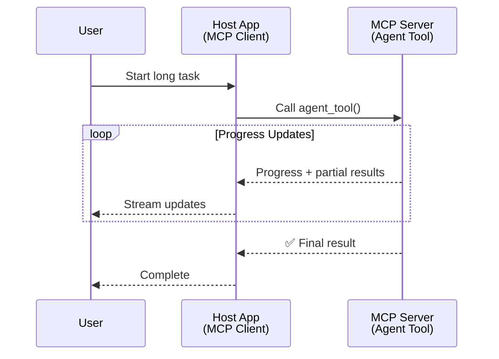
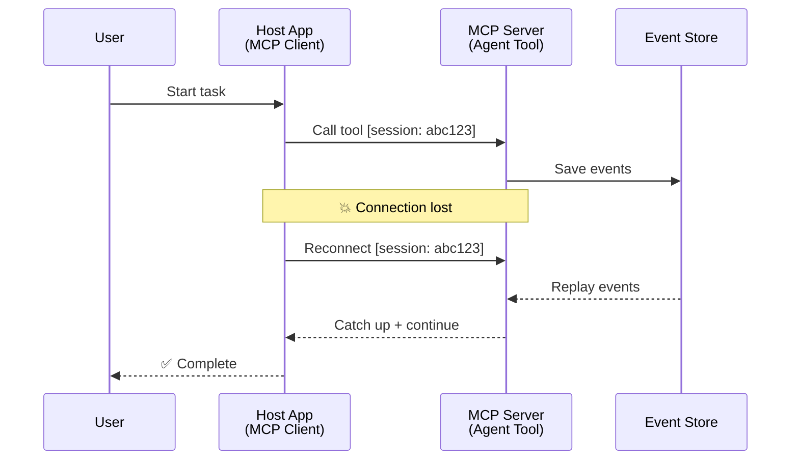
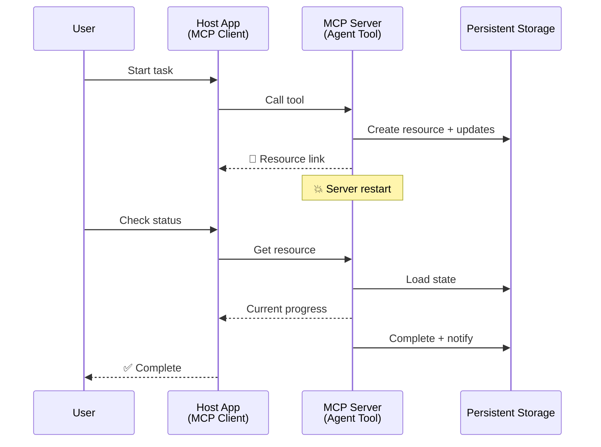
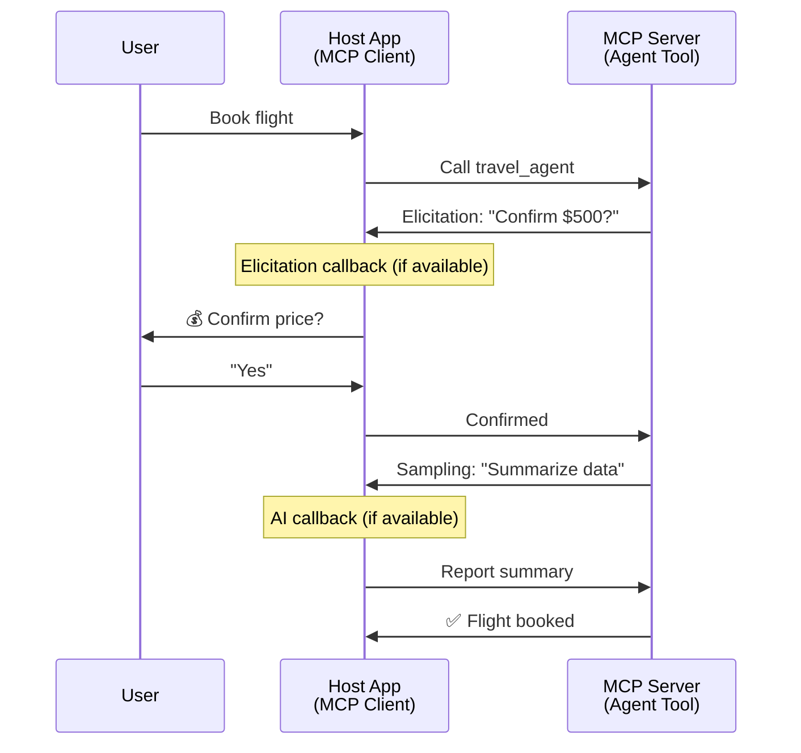
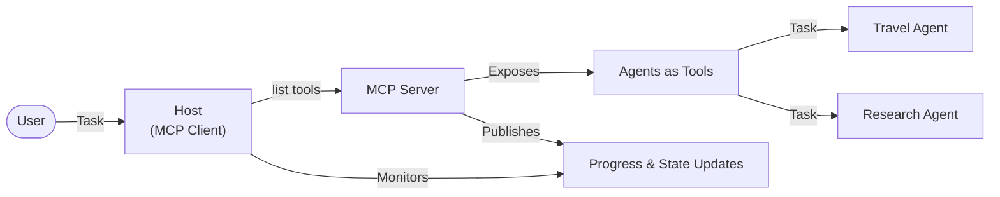

<!--
CO_OP_TRANSLATOR_METADATA:
{
  "original_hash": "5cc6836626047aa055e8960c8484a7d0",
  "translation_date": "2025-07-24T08:22:21+00:00",
  "source_file": "11-mcp/code_samples/mcp-agents/README.md",
  "language_code": "no"
}
-->
# Bygge Agent-til-Agent Kommunikasjonssystemer med MCP

> Kort fortalt - Kan du bygge Agent2Agent-kommunikasjon på MCP? Ja!

MCP har utviklet seg betydelig utover sitt opprinnelige mål om "å gi kontekst til LLM-er". Med nylige forbedringer som [gjenopptakbare strømmer](https://modelcontextprotocol.io/docs/concepts/transports#resumability-and-redelivery), [innhenting](https://modelcontextprotocol.io/specification/2025-06-18/client/elicitation), [sampling](https://modelcontextprotocol.io/specification/2025-06-18/client/sampling), og varsler ([fremdrift](https://modelcontextprotocol.io/specification/2025-06-18/basic/utilities/progress) og [ressurser](https://modelcontextprotocol.io/specification/2025-06-18/schema#resourceupdatednotification)), gir MCP nå et solid grunnlag for å bygge komplekse agent-til-agent kommunikasjonsystemer.

## Misforståelsen rundt Agent/Verktøy

Etter hvert som flere utviklere utforsker verktøy med agentiske egenskaper (kjører over lengre tid, kan kreve ekstra input under utførelse, osv.), er en vanlig misforståelse at MCP er uegnet, hovedsakelig fordi tidlige eksempler på verktøyets primitive funksjoner fokuserte på enkle forespørsel-svar-mønstre.

Denne oppfatningen er utdatert. MCP-spesifikasjonen har blitt betydelig forbedret de siste månedene med funksjoner som lukker gapet for å bygge langvarig agentisk oppførsel:

- **Streaming og delvise resultater**: Sanntidsoppdateringer under utførelse
- **Gjenopptakbarhet**: Klienter kan koble til igjen og fortsette etter frakobling
- **Holdbarhet**: Resultater overlever serveromstarter (f.eks. via ressurslenker)
- **Flere omganger**: Interaktiv input under utførelse via innhenting og sampling

Disse funksjonene kan kombineres for å muliggjøre komplekse agentiske og multi-agent applikasjoner, alt distribuert på MCP-protokollen.

For referanse vil vi referere til en agent som et "verktøy" som er tilgjengelig på en MCP-server. Dette innebærer eksistensen av en vertsapplikasjon som implementerer en MCP-klient som oppretter en sesjon med MCP-serveren og kan kalle agenten.

## Hva gjør et MCP-verktøy "agentisk"?

Før vi går inn på implementeringen, la oss etablere hvilke infrastrukturegenskaper som trengs for å støtte langvarige agenter.

> Vi vil definere en agent som en enhet som kan operere autonomt over lengre perioder, i stand til å håndtere komplekse oppgaver som kan kreve flere interaksjoner eller justeringer basert på sanntids tilbakemeldinger.

### 1. Streaming og delvise resultater

Tradisjonelle forespørsel-svar-mønstre fungerer ikke for langvarige oppgaver. Agenter må kunne gi:

- Sanntids fremdriftsoppdateringer
- Mellomresultater

**MCP-støtte**: Ressursoppdateringsvarsler muliggjør streaming av delvise resultater, selv om dette krever nøye design for å unngå konflikter med JSON-RPCs 1:1 forespørsel/svar-modell.

| Funksjon                   | Brukstilfelle                                                                                                                                                                       | MCP-støtte                                                                                 |
| -------------------------- | ---------------------------------------------------------------------------------------------------------------------------------------------------------------------------------- | ------------------------------------------------------------------------------------------ |
| Sanntids fremdriftsoppdateringer | Bruker ber om en kodebase-migreringsoppgave. Agenten streamer fremdrift: "10% - Analyserer avhengigheter... 25% - Konverterer TypeScript-filer... 50% - Oppdaterer imports..." | ✅ Fremdriftsvarsler                                                                       |
| Delvise resultater         | Oppgaven "Generer en bok" streamer delvise resultater, f.eks. 1) Historiebueoversikt, 2) Kapittelliste, 3) Hvert kapittel etter hvert som det fullføres. Vert kan inspisere, avbryte eller omdirigere på ethvert stadium. | ✅ Varsler kan "utvides" til å inkludere delvise resultater, se forslag på PR 383, 776 |

<div align="center" style="font-style: italic; font-size: 0.95em; margin-bottom: 0.5em;">
<strong>Figur 1:</strong> Dette diagrammet illustrerer hvordan en MCP-agent streamer sanntids fremdriftsoppdateringer og delvise resultater til vertsapplikasjonen under en langvarig oppgave, slik at brukeren kan overvåke utførelsen i sanntid.
</div>



### 2. Gjenopptakbarhet

Agenter må håndtere nettverksavbrudd på en smidig måte:

- Koble til igjen etter (klient) frakobling
- Fortsette der de slapp (meldingsgjensending)

**MCP-støtte**: MCP StreamableHTTP transport støtter i dag sesjonsgjenopptakelse og meldingsgjensending med sesjons-ID-er og siste hendelses-ID-er. Det viktige her er at serveren må implementere en EventStore som muliggjør gjensending av hendelser ved klientens tilkobling.  
Merk at det finnes et samfunnsforslag (PR #975) som utforsker transport-uavhengige gjenopptakbare strømmer.

| Funksjon      | Brukstilfelle                                                                                                                                                   | MCP-støtte                                                                |
| ------------ | ---------------------------------------------------------------------------------------------------------------------------------------------------------- | -------------------------------------------------------------------------- |
| Gjenopptakbarhet | Klient kobler fra under en langvarig oppgave. Ved tilkobling på nytt gjenopptas sesjonen med gjensendte hendelser, og fortsetter sømløst der den slapp. | ✅ StreamableHTTP transport med sesjons-ID-er, gjensending av hendelser og EventStore |

<div align="center" style="font-style: italic; font-size: 0.95em; margin-bottom: 0.5em;">
<strong>Figur 2:</strong> Dette diagrammet viser hvordan MCPs StreamableHTTP transport og EventStore muliggjør sømløs sesjonsgjenopptakelse: hvis klienten kobler fra, kan den koble til igjen og gjensende tapte hendelser, og fortsette oppgaven uten tap av fremdrift.
</div>



### 3. Holdbarhet

Langvarige agenter trenger vedvarende tilstand:

- Resultater overlever serveromstarter
- Status kan hentes ut av bånd
- Fremdriftssporing på tvers av sesjoner

**MCP-støtte**: MCP støtter nå en Ressurslenke-returtype for verktøykall. I dag er et mulig mønster å designe et verktøy som oppretter en ressurs og umiddelbart returnerer en ressurslenke. Verktøyet kan fortsette å adressere oppgaven i bakgrunnen og oppdatere ressursen. Klienten kan velge å hente tilstanden til denne ressursen for å få delvise eller fullstendige resultater (basert på hvilke ressursoppdateringer serveren gir) eller abonnere på ressursen for oppdateringsvarsler.

En begrensning her er at polling av ressurser eller abonnement på oppdateringer kan bruke ressurser med implikasjoner i stor skala. Det finnes et åpent samfunnsforslag (inkludert #992) som utforsker muligheten for å inkludere webhooks eller triggere som serveren kan bruke til å varsle klienten/vertsapplikasjonen om oppdateringer.

| Funksjon    | Brukstilfelle                                                                                                                                        | MCP-støtte                                                        |
| ---------- | ----------------------------------------------------------------------------------------------------------------------------------------------- | ------------------------------------------------------------------ |
| Holdbarhet | Server krasjer under data-migreringsoppgave. Resultater og fremdrift overlever omstart, klient kan sjekke status og fortsette fra vedvarende ressurs. | ✅ Ressurslenker med vedvarende lagring og statusvarsler |

I dag er et vanlig mønster å designe et verktøy som oppretter en ressurs og umiddelbart returnerer en ressurslenke. Verktøyet kan i bakgrunnen adressere oppgaven, utstede ressursvarsler som fungerer som fremdriftsoppdateringer eller inkluderer delvise resultater, og oppdatere innholdet i ressursen etter behov.

<div align="center" style="font-style: italic; font-size: 0.95em; margin-bottom: 0.5em;">
<strong>Figur 3:</strong> Dette diagrammet demonstrerer hvordan MCP-agenter bruker vedvarende ressurser og statusvarsler for å sikre at langvarige oppgaver overlever serveromstarter, slik at klienter kan sjekke fremdrift og hente resultater selv etter feil.
</div>



### 4. Interaksjoner med flere omganger

Agenter trenger ofte ekstra input under utførelse:

- Menneskelig avklaring eller godkjenning
- AI-assistanse for komplekse beslutninger
- Dynamisk parameterjustering

**MCP-støtte**: Fullt støttet via sampling (for AI-input) og innhenting (for menneskelig input).

| Funksjon                 | Brukstilfelle                                                                                                                                     | MCP-støtte                                           |
| ----------------------- | -------------------------------------------------------------------------------------------------------------------------------------------- | ----------------------------------------------------- |
| Interaksjoner med flere omganger | Reisebestillingsagent ber om prisbekreftelse fra bruker, og ber deretter AI om å oppsummere reisedata før bestilling fullføres. | ✅ Innhenting for menneskelig input, sampling for AI-input |

<div align="center" style="font-style: italic; font-size: 0.95em; margin-bottom: 0.5em;">
<strong>Figur 4:</strong> Dette diagrammet viser hvordan MCP-agenter interaktivt kan hente menneskelig input eller be om AI-assistanse under utførelse, og støtte komplekse, fleromgangs arbeidsflyter som bekreftelser og dynamisk beslutningstaking.
</div>



## Implementering av langvarige agenter på MCP - Kodeoversikt

Som en del av denne artikkelen gir vi et [kode-repository](https://github.com/victordibia/ai-tutorials/tree/main/MCP%20Agents) som inneholder en komplett implementering av langvarige agenter ved bruk av MCP Python SDK med StreamableHTTP transport for sesjonsgjenopptakelse og meldingsgjensending. Implementeringen demonstrerer hvordan MCP-funksjoner kan kombineres for å muliggjøre sofistikerte agent-lignende oppførsel.

Spesifikt implementerer vi en server med to primære agentverktøy:

- **Reiseagent** - Simulerer en reisebestillingstjeneste med prisbekreftelse via innhenting
- **Forskningsagent** - Utfører forskningsoppgaver med AI-assisterte oppsummeringer via sampling

Begge agentene demonstrerer sanntids fremdriftsoppdateringer, interaktive bekreftelser og full sesjonsgjenopptakelseskapabilitet.

### Viktige implementeringskonsepter

Følgende seksjoner viser server-side agentimplementering og klient-side vertshåndtering for hver funksjon:

#### Streaming og fremdriftsoppdateringer - Sanntids status for oppgaver

Streaming gjør det mulig for agenter å gi sanntids fremdriftsoppdateringer under langvarige oppgaver, og holde brukerne informert om oppgavestatus og mellomresultater.

**Serverimplementering (agent sender fremdriftsvarsler):**

```python
# From server/server.py - Travel agent sending progress updates
for i, step in enumerate(steps):
    await ctx.session.send_progress_notification(
        progress_token=ctx.request_id,
        progress=i * 25,
        total=100,
        message=step,
        related_request_id=str(ctx.request_id)
    )
    await anyio.sleep(2)  # Simulate work

# Alternative: Log messages for detailed step-by-step updates
await ctx.session.send_log_message(
    level="info",
    data=f"Processing step {current_step}/{steps} ({progress_percent}%)",
    logger="long_running_agent",
    related_request_id=ctx.request_id,
)
```

**Klientimplementering (vert mottar fremdriftsoppdateringer):**

```python
# From client/client.py - Client handling real-time notifications
async def message_handler(message) -> None:
    if isinstance(message, types.ServerNotification):
        if isinstance(message.root, types.LoggingMessageNotification):
            console.print(f"📡 [dim]{message.root.params.data}[/dim]")
        elif isinstance(message.root, types.ProgressNotification):
            progress = message.root.params
            console.print(f"🔄 [yellow]{progress.message} ({progress.progress}/{progress.total})[/yellow]")

# Register message handler when creating session
async with ClientSession(
    read_stream, write_stream,
    message_handler=message_handler
) as session:
```

#### Innhenting - Be om brukerinput

Innhenting gjør det mulig for agenter å be om brukerinput under utførelse. Dette er essensielt for bekreftelser, avklaringer eller godkjenninger under langvarige oppgaver.

**Serverimplementering (agent ber om bekreftelse):**

```python
# From server/server.py - Travel agent requesting price confirmation
elicit_result = await ctx.session.elicit(
    message=f"Please confirm the estimated price of $1200 for your trip to {destination}",
    requestedSchema=PriceConfirmationSchema.model_json_schema(),
    related_request_id=ctx.request_id,
)

if elicit_result and elicit_result.action == "accept":
    # Continue with booking
    logger.info(f"User confirmed price: {elicit_result.content}")
elif elicit_result and elicit_result.action == "decline":
    # Cancel the booking
    booking_cancelled = True
```

**Klientimplementering (vert gir innhentingscallback):**

```python
# From client/client.py - Client handling elicitation requests
async def elicitation_callback(context, params):
    console.print(f"💬 Server is asking for confirmation:")
    console.print(f"   {params.message}")

    response = console.input("Do you accept? (y/n): ").strip().lower()

    if response in ['y', 'yes']:
        return types.ElicitResult(
            action="accept",
            content={"confirm": True, "notes": "Confirmed by user"}
        )
    else:
        return types.ElicitResult(
            action="decline",
            content={"confirm": False, "notes": "Declined by user"}
        )

# Register the callback when creating the session
async with ClientSession(
    read_stream, write_stream,
    elicitation_callback=elicitation_callback
) as session:
```

#### Sampling - Be om AI-assistanse

Sampling lar agenter be om LLM-assistanse for komplekse beslutninger eller innholdsgenerering under utførelse. Dette muliggjør hybride menneske-AI arbeidsflyter.

**Serverimplementering (agent ber om AI-assistanse):**

```python
# From server/server.py - Research agent requesting AI summary
sampling_result = await ctx.session.create_message(
    messages=[
        SamplingMessage(
            role="user",
            content=TextContent(type="text", text=f"Please summarize the key findings for research on: {topic}")
        )
    ],
    max_tokens=100,
    related_request_id=ctx.request_id,
)

if sampling_result and sampling_result.content:
    if sampling_result.content.type == "text":
        sampling_summary = sampling_result.content.text
        logger.info(f"Received sampling summary: {sampling_summary}")
```

**Klientimplementering (vert gir samplingcallback):**

```python
# From client/client.py - Client handling sampling requests
async def sampling_callback(context, params):
    message_text = params.messages[0].content.text if params.messages else 'No message'
    console.print(f"🧠 Server requested sampling: {message_text}")

    # In a real application, this could call an LLM API
    # For demo purposes, we provide a mock response
    mock_response = "Based on current research, MCP has evolved significantly..."

    return types.CreateMessageResult(
        role="assistant",
        content=types.TextContent(type="text", text=mock_response),
        model="interactive-client",
        stopReason="endTurn"
    )

# Register the callback when creating the session
async with ClientSession(
    read_stream, write_stream,
    sampling_callback=sampling_callback,
    elicitation_callback=elicitation_callback
) as session:
```

#### Gjenopptakbarhet - Sesjonskontinuitet ved frakoblinger

Gjenopptakbarhet sikrer at langvarige agentoppgaver kan overleve klientfrakoblinger og fortsette sømløst ved tilkobling på nytt. Dette implementeres gjennom EventStores og gjenopptakelsestokens.

**EventStore-implementering (server holder sesjonstilstand):**

```python
# From server/event_store.py - Simple in-memory event store
class SimpleEventStore(EventStore):
    def __init__(self):
        self._events: list[tuple[StreamId, EventId, JSONRPCMessage]] = []
        self._event_id_counter = 0

    async def store_event(self, stream_id: StreamId, message: JSONRPCMessage) -> EventId:
        """Store an event and return its ID."""
        self._event_id_counter += 1
        event_id = str(self._event_id_counter)
        self._events.append((stream_id, event_id, message))
        return event_id

    async def replay_events_after(self, last_event_id: EventId, send_callback: EventCallback) -> StreamId | None:
        """Replay events after the specified ID for resumption."""
        # Find events after the last known event and replay them
        for _, event_id, message in self._events[start_index:]:
            await send_callback(EventMessage(message, event_id))

# From server/server.py - Passing event store to session manager
def create_server_app(event_store: Optional[EventStore] = None) -> Starlette:
    server = ResumableServer()

    # Create session manager with event store for resumption
    session_manager = StreamableHTTPSessionManager(
        app=server,
        event_store=event_store,  # Event store enables session resumption
        json_response=False,
        security_settings=security_settings,
    )

    return Starlette(routes=[Mount("/mcp", app=session_manager.handle_request)])

# Usage: Initialize with event store
event_store = SimpleEventStore()
app = create_server_app(event_store)
```

**Klientmetadata med gjenopptakelsestoken (klient kobler til igjen ved bruk av lagret tilstand):**

```python
# From client/client.py - Client resumption with metadata
if existing_tokens and existing_tokens.get("resumption_token"):
    # Use existing resumption token to continue where we left off
    metadata = ClientMessageMetadata(
        resumption_token=existing_tokens["resumption_token"],
    )
else:
    # Create callback to save resumption token when received
    def enhanced_callback(token: str):
        protocol_version = getattr(session, 'protocol_version', None)
        token_manager.save_tokens(session_id, token, protocol_version, command, args)

    metadata = ClientMessageMetadata(
        on_resumption_token_update=enhanced_callback,
    )

# Send request with resumption metadata
result = await session.send_request(
    types.ClientRequest(
        types.CallToolRequest(
            method="tools/call",
            params=types.CallToolRequestParams(name=command, arguments=args)
        )
    ),
    types.CallToolResult,
    metadata=metadata,
)
```

Vertsapplikasjonen opprettholder sesjons-ID-er og gjenopptakelsestokens lokalt, slik at den kan koble til eksisterende sesjoner uten å miste fremdrift eller tilstand.

### Kodeorganisering

<div align="center" style="font-style: italic; font-size: 0.95em; margin-bottom: 0.5em;">
<strong>Figur 5:</strong> MCP-basert agentsystemarkitektur
</div>



**Viktige filer:**

- **`server/server.py`** - Gjenopptakbar MCP-server med reise- og forskningsagenter som demonstrerer innhenting, sampling og fremdriftsoppdateringer
- **`client/client.py`** - Interaktiv vertsapplikasjon med gjenopptakelsesstøtte, callback-håndtering og tokenadministrasjon
- **`server/event_store.py`** - EventStore-implementering som muliggjør sesjonsgjenopptakelse og meldingsgjensending

## Utvidelse til multi-agent kommunikasjon på MCP

Implementeringen ovenfor kan utvides til multi-agent systemer ved å forbedre vertsapplikasjonens intelligens og omfang:

- **Intelligent oppgavedekomponering**: Vert analyserer komplekse brukerforespørsler og deler dem opp i deloppgaver for ulike spesialiserte agenter
- **Multi-server koordinering**: Vert opprettholder forbindelser til flere MCP-servere, hver med ulike agentkapabiliteter
- **Oppgavestatusadministrasjon**: Vert sporer fremdrift på tvers av flere samtidige agentoppgaver, håndterer avhengigheter og sekvensering
- **Robusthet og gjentakelser**: Vert håndterer feil, implementerer gjentakelseslogikk og omdirigerer oppgaver når agenter blir utilgjengelige
- **Resultatsyntese**: Vert kombinerer utdata fra flere agenter til sammenhengende sluttresultater

Verten utvikler seg fra en enkel klient til en intelligent orkestrator, som koordinerer distribuerte agentkapabiliteter mens den opprettholder samme MCP-protokollgrunnlag.

## Konklusjon

MCPs forbedrede kapabiliteter - ressursvarsler, innhenting/sampling, gjenopptakbare strømmer og vedvarende ressurser - muliggjør komplekse agent-til-agent interaksjoner samtidig som protokollens enkelhet opprettholdes.

## Kom i gang

Klar til å bygge ditt eget agent2agent-system? Følg disse trinnene:

### 1. Kjør demoen

```bash
# Start the server with event store for resumption
python -m server.server --port 8006

# In another terminal, run the interactive client
python -m client.client --url http://127.0.0.1:8006/mcp
```

**Tilgjengelige kommandoer i interaktiv modus:**

- `travel_agent` - Bestill reise med prisbekreftelse via innhenting
- `research_agent` - Forskningsoppgaver med AI-assisterte oppsummeringer via sampling
- `list` - Vis alle tilgjengelige verktøy
- `clean-tokens` - Fjern gjenopptakelsestokens
- `help` - Vis detaljert kommandohjelp
- `quit` - Avslutt klienten

### 2. Test gjenopptakelseskapabiliteter

- Start en langvarig agent (f.eks. `travel_agent`)
- Avbryt klienten under utførelse (Ctrl+C)
- Start klienten på nytt - den vil automatisk gjenoppta der den slapp

### 3. Utforsk og utvid

- **Utforsk eksemplene**: Sjekk ut dette [mcp-agents](https://github.com/victordibia/ai-tutorials/tree/main/MCP%20Agents)
- **Bli med i fellesskapet**: Delta i MCP-diskusjoner på GitHub
- **Eksperimenter**: Start med en enkel langvarig oppgave og legg gradvis til streaming, gjenopptakbarhet og multi-agent koordinering

Dette demonstrerer hvordan MCP muliggjør intelligente agentoppførsel samtidig som verktøybasert enkelhet opprettholdes.

Alt i alt utvikler MCP-protokollspesifikasjonen seg raskt; leseren oppfordres til å gjennomgå den offisielle dokumentasjonsnettstedet for de nyeste oppdateringene - https://modelcontextprotocol.io/introduction

**Ansvarsfraskrivelse**:  
Dette dokumentet er oversatt ved hjelp av AI-oversettelsestjenesten [Co-op Translator](https://github.com/Azure/co-op-translator). Selv om vi streber etter nøyaktighet, vær oppmerksom på at automatiserte oversettelser kan inneholde feil eller unøyaktigheter. Det originale dokumentet på sitt opprinnelige språk bør anses som den autoritative kilden. For kritisk informasjon anbefales profesjonell menneskelig oversettelse. Vi er ikke ansvarlige for misforståelser eller feiltolkninger som oppstår ved bruk av denne oversettelsen.