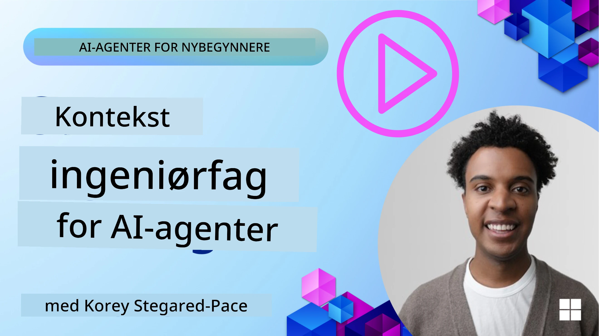
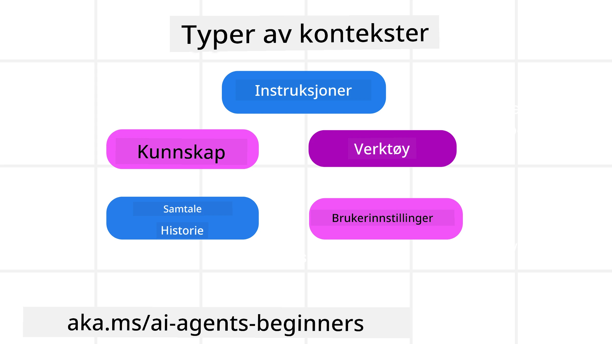
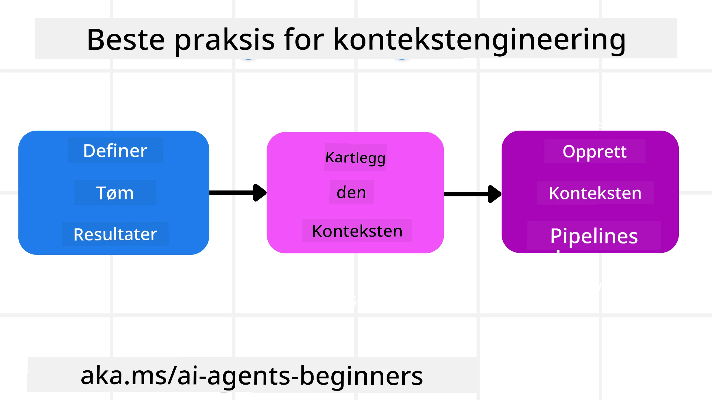

# Kontekstingeniørarbeid for AI-agenter

> _(Klikk på bildet over for å se video av denne leksjonen)_

Å forstå kompleksiteten i applikasjonen du bygger en AI-agent for er viktig for å lage en pålitelig en. Vi må bygge AI-agenter som effektivt håndterer informasjon for å løse komplekse behov utover promptingeniørarbeid.

I denne leksjonen skal vi se på hva kontekstingeniørarbeid er og hvilken rolle det har i bygging av AI-agenter.

## Introduksjon

Denne leksjonen vil dekke:

• **Hva kontekstingeniørarbeid er** og hvorfor det er forskjellig fra promptingeniørarbeid.

• **Strategier for effektivt kontekstingeniørarbeid**, inkludert hvordan man skriver, velger, komprimerer og isolerer informasjon.

• **Vanlige kontekstfeil** som kan ødelegge AI-agenten din og hvordan fikse dem.

## Læringsmål

Etter å ha fullført denne leksjonen vil du forstå hvordan du kan:

• **Definere kontekstingeniørarbeid** og skille det fra promptingeniørarbeid.

• **Identifisere nøkkelkomponentene i kontekst** i applikasjoner med store språkmodeller (LLM).

• **Anvende strategier for skriving, valg, komprimering og isolering av kontekst** for å forbedre agentens ytelse.

• **Gjenkjenne vanlige kontekstfeil** som forgiftning, distraksjon, forvirring og konflikt, og implementere tiltak for å unngå dem.

## Hva er kontekstingeniørarbeid?

For AI-agenter er kontekst det som driver planleggingen av en AI-agent til å ta bestemte handlinger. Kontekstingeniørarbeid er praksisen med å sørge for at AI-agenten har riktig informasjon for å fullføre neste steg i oppgaven. Kontekstvinduet er begrenset i størrelse, så som agentbyggere må vi lage systemer og prosesser for å håndtere å legge til, fjerne og kondensere informasjonen i kontekstvinduet.

### Promptingeniørarbeid vs kontekstingeniørarbeid

Promptingeniørarbeid fokuserer på et statisk sett med instruksjoner for effektivt å veilede AI-agentene med et sett regler. Kontekstingeniørarbeid handler om hvordan man håndterer et dynamisk sett med informasjon, inkludert den initielle prompten, for å sikre at AI-agenten har det den trenger over tid. Hovedideen rundt kontekstingeniørarbeid er å gjøre denne prosessen repeterbar og pålitelig.

### Typer kontekst

Det er viktig å huske at kontekst ikke bare er én ting. Informasjonen som AI-agenten trenger kan komme fra en rekke forskjellige kilder, og det er opp til oss å sørge for at agenten har tilgang til disse kildene:

Typene kontekst en AI-agent kan trenge å håndtere inkluderer:

• **Instruksjoner:** Disse er som agentens "regler" – prompts, systemmeldinger, få-eksempel (few-shot) eksempler (som viser AI hvordan man gjør noe), og beskrivelser av verktøy den kan bruke. Her kombineres fokus fra promptingeniørarbeid med kontekstingeniørarbeid.

• **Kunnskap:** Dette dekker fakta, informasjon hentet fra databaser, eller langtidsminner agenten har akkumulert. Dette inkluderer å integrere et Retrieval Augmented Generation (RAG) system hvis en agent trenger tilgang til forskjellige kunnskapsbaser og databaser.

• **Verktøy:** Dette er definisjoner av eksterne funksjoner, APIer og MCP-servere som agenten kan kalle, sammen med tilbakemeldinger (resultater) den får fra å bruke dem.

• **Samtalehistorikk:** Den pågående dialogen med en bruker. Over tid blir disse samtalene lengre og mer komplekse, som betyr at de tar opp plass i kontekstvinduet.

• **Brukerpreferanser:** Informasjon man lærer om en brukers liker eller misliker over tid. Disse kan lagres og hentes fram når viktige beslutninger skal tas for å hjelpe brukeren.

## Strategier for effektivt kontekstingeniørarbeid

### Planleggingsstrategier

Godt kontekstingeniørarbeid starter med god planlegging. Her er en tilnærming som vil hjelpe deg med å begynne å tenke på hvordan du kan anvende konseptet kontekstingeniørarbeid:

1. **Definer klare resultater** – Resultatene av oppgavene som AI-agentene skal utføre bør defineres tydelig. Svar på spørsmålet – "Hvordan vil verden se ut når AI-agenten er ferdig med sin oppgave?" Med andre ord, hvilken endring, informasjon eller respons skal brukeren ha etter samspill med AI-agenten.
2. **Kartlegg konteksten** – Når du har definert resultatene til AI-agenten, må du svare på spørsmålet "Hvilken informasjon trenger AI-agenten for å fullføre denne oppgaven?". På den måten kan du begynne å kartlegge hvor informasjonen kan finnes.
3. **Lag kontekstpipelines** – Nå som du vet hvor informasjonen er, må du svare på spørsmålet "Hvordan vil agenten hente denne informasjonen?". Dette kan gjøres på forskjellige måter, inkludert RAG, bruk av MCP-servere og andre verktøy.

### Praktiske strategier

Planlegging er viktig, men når informasjonen begynner å strømme inn i agentens kontekstvindu, trenger vi praktiske strategier for å håndtere den:

#### Håndtering av kontekst

Mens noe informasjon vil bli lagt til kontekstvinduet automatisk, handler kontekstingeniørarbeid om å ta en mer aktiv rolle i denne informasjonen, noe som kan gjøres med noen strategier:

 1. **Agentens notatblokk**
 Dette lar en AI-agent føre notater om relevant informasjon om gjeldende oppgaver og brukerinteraksjoner i løpet av en enkelt økt. Dette bør eksistere utenfor kontekstvinduet i en fil eller kjøretid-objekt som agenten senere kan hente under økten om nødvendig.

 2. **Minner**
 Notatblokker er fine for å håndtere informasjon utenfor kontekstvinduet til en enkelt økt. Minner gjør det mulig for agenter å lagre og hente relevant informasjon over flere økter. Dette kan inkludere sammendrag, brukerpreferanser og tilbakemeldinger for forbedringer i fremtiden.

 3. **Kompimering av kontekst**
  Når kontekstvinduet vokser og nærmer seg grensen, kan teknikker som oppsummering og trimming brukes. Dette inkluderer enten å beholde bare den mest relevante informasjonen eller å fjerne eldre meldinger.
  
 4. **Multi-agent-systemer**
  Utvikling av multi-agent-systemer er en form for kontekstingeniørarbeid fordi hver agent har sitt eget kontekstvindu. Hvordan denne konteksten deles og overføres til forskjellige agenter er noe annet man må planlegge når man bygger disse systemene.
  
 5. **Sandkassemiljøer**
  Hvis en agent trenger å kjøre noe kode eller behandle store mengder informasjon i et dokument, kan dette kreve mye tokens å prosessere resultatene. I stedet for å lagre alt i kontekstvinduet, kan agenten bruke et sandkassemiljø som kan kjøre denne koden og bare lese resultatene og annen relevant informasjon.
  
 6. **Kjøretidsstatus-objekter**
   Dette gjøres ved å opprette beholdere med informasjon for å håndtere situasjoner hvor agenten trenger tilgang til bestemt informasjon. For en kompleks oppgave vil dette gjøre det mulig for agenten å lagre resultatene av hvert deloppgave steg for steg, slik at konteksten forblir knyttet til akkurat den spesifikke deloppgaven.

#### Inspisere kontekst

Etter at du har anvendt en av disse strategiene, er det verdt å sjekke hva det neste modellkallet faktisk mottok. Et nyttig feilsøkingsspørsmål er:

> Lastet agenten inn for mye kontekst, feil kontekst, eller manglet den kontekst den trengte?

Du trenger ikke logge rå-prompter, verktøyutdata, eller minneinnhold for å svare på det spørsmålet. I produksjon, foretrekk små kontekstinspeksjonslogger som fanger opp antall, ID-er, hasher og policyetiketter:

- **Utvalg:** Følg med på hvor mange kandidatbiter, verktøy eller minner som ble vurdert, hvor mange som ble valgt, og hvilken regel eller poengsum som gjorde at de andre ble filtrert bort.
- **Komprimering:** Registrer kildeområde eller sporfane-ID, sammendrags-ID, estimert token-telling før og etter komprimering, og om råinnholdet ble utelatt fra neste kall.
- **Isolering:** Noter hvilken deloppgave som ble kjørt i en egen agent, økt eller sandkasse, hvilket avgrenset sammendrag som ble returnert, og om store verktøyutdata holdt seg utenfor hovedagentens kontekst.
- **Minne og RAG:** Lagre gjenfinningsdokument-ID-er, minne-ID-er, poengsum, valgte ID-er og redigeringsstatus i stedet for full hentet tekst.
- **Sikkerhet og personvern:** Foretrekk hasher, ID-er, token-bøtter og policyetiketter fremfor sensitiv prompttekst, verktøyargumenter, verktøyresultater eller brukerminnekropper.

Målet er ikke å beholde mer kontekst. Det er å etterlate nok bevis slik at en utvikler kan se hvilken kontekststrategi som kjørte og om den endret neste modellkall på den tiltenkte måten.

### Eksempel på kontekstingeniørarbeid

La oss si at vi vil ha en AI-agent til å **"Bestille en tur til Paris for meg."**

• En enkel agent som bare bruker promptingeniørarbeid kan bare svare: **"Ok, når vil du reise til Paris?"** Den behandlet bare ditt direkte spørsmål på det tidspunktet brukeren spurte.

• En agent som bruker kontekstingeniørarbeidsstrategiene som ble dekket, ville gjøre mye mer. Før den i det hele tatt svarer, kan systemet:

  ◦ **Sjekke kalenderen din** for ledige datoer (hente sanntidsdata).

 ◦ **Hente frem tidligere reisepreferanser** (fra langtidsminne) som ditt foretrukne flyselskap, budsjett eller om du foretrekker direktefly.

 ◦ **Identifisere tilgjengelige verktøy** for fly- og hotellbestilling.

- Så kan et eksempel på svar være:  "Hei [Ditt navn]! Jeg ser at du er ledig første uke i oktober. Skal jeg se etter direktefly til Paris med [Foretrukket flyselskap] innenfor ditt vanlige budsjett på [Budsjett]?" Dette rikere, kontekstbevisste svaret demonstrerer kraften i kontekstingeniørarbeid.

## Vanlige kontekstfeil

### Kontekstforgiftning

**Hva det er:** Når en hallusinasjon (falsk informasjon generert av LLM) eller en feil kommer inn i konteksten og blir referert til gjentatte ganger, noe som får agenten til å følge umulige mål eller utvikle nonsens-strategier.

**Hva man gjør:** Implementer **kontekstvalidering** og **karantene**. Valider informasjon før det legges til i langtidsminnet. Hvis potensiell forgiftning oppdages, start nye konteksttråder for å forhindre at den dårlige informasjonen sprer seg.

**Eksempel på reisebestilling:** Agenten din hallusinerer en **direkteflyvning fra en liten lokal flyplass til en fjern internasjonal by** som faktisk ikke har internasjonale flyvninger. Denne ikke-eksisterende flyvningsdetaljen lagres i konteksten. Senere, når du ber agenten bestille, prøver den gjentatte ganger å finne billetter for denne umulige ruten, noe som fører til gjentatte feil.

**Løsning:** Implementer et steg som **validerer flyets eksistens og ruter med en sanntids-API** _før_ flydetaljen legges til agentens arbeidskontekst. Hvis valideringen feiler, settes den feilaktige informasjonen i "karantene" og brukes ikke videre.

### Kontekstdistraksjon

**Hva det er:** Når konteksten blir så stor at modellen fokuserer for mye på den akkumulerte historikken i stedet for å bruke det den lærte under trening, noe som fører til repeterende eller lite hjelpsomme handlinger. Modeller kan begynne å gjøre feil selv før kontekstvinduet er fullt.

**Hva man gjør:** Bruk **kontekstoppsummering**. Periodisk komprimer akkumulerte informasjon til kortere sammendrag, behold viktige detaljer mens du fjerner overflødig historikk. Dette hjelper til å "nullstille" fokuset.

**Eksempel på reisebestilling:** Du har diskutert ulike drømmereisedestinasjoner over lang tid, inkludert en detaljert gjenfortelling av din ryggsekktur for to år siden. Når du endelig ber om å **"finne en billig flybillett for neste måned,"** blir agenten overveldet av gamle og irrelevante detaljer og fortsetter å spørre om ryggsekken din eller tidligere reiseruter, og overser din nåværende forespørsel.

**Løsning:** Etter et visst antall turer eller når konteksten vokser for mye, bør agenten **oppsummere de siste og mest relevante delene av samtalen** – med fokus på dine nåværende reisedatoer og destinasjon – og bruke den kondenserte oppsummeringen for neste LLM-kall, og forkaste mindre relevante historiske chat.

### Konfunderende kontekst

**Hva det er:** Når unødvendig kontekst, ofte i form av for mange tilgjengelige verktøy, får modellen til å generere dårlige svar eller kalle irrelevante verktøy. Mindre modeller er spesielt utsatt.

**Hva man gjør:** Implementer **verktøyhåndtering** med RAG-teknikker. Lagre verktøybeskrivelser i en vektordatabase og velg _kun_ de mest relevante verktøyene for hver spesifikke oppgave. Forskning viser at man bør begrense utvalget til under 30.

**Eksempel på reisebestilling:** Agenten din har tilgang til dusinvis av verktøy: `book_flight`, `book_hotel`, `rent_car`, `find_tours`, `currency_converter`, `weather_forecast`, `restaurant_reservations` osv. Du spør, **"Hva er den beste måten å komme seg rundt i Paris?"** På grunn av det store antallet verktøy blir agenten forvirret og prøver å kalle `book_flight` _inne i_ Paris, eller `rent_car` selv om du foretrekker kollektivtransport, fordi verktøybeskrivelsene kan overlappe eller den rett og slett ikke kan avgjøre hvilket som er best.

**Løsning:** Bruk **RAG over verktøybeskrivelser**. Når du spør om hvordan man kommer seg rundt i Paris, henter systemet dynamisk _kun_ de mest relevante verktøyene som `rent_car` eller `public_transport_info` basert på forespørselen din, og presenterer en fokusert "belastning" av verktøy til LLM.

### Kontekstkonflikt

**Hva det er:** Når motstridende informasjon finnes i konteksten, noe som fører til inkonsekvent resonnering eller dårlige sluttresultater. Dette skjer ofte når informasjon kommer i etapper, og tidlige, feilaktige antakelser forblir i konteksten.

**Hva man gjør:** Bruk **kontekstkapping** og **avlastning**. Kapping betyr å fjerne utdatert eller motstridende informasjon etter hvert som nye detaljer kommer til. Avlastning gir modellen et separat "notatblokk"-arbeidsområde for å bearbeide informasjon uten å rotte til hovedkonteksten.
**Eksempel på reisebestilling:** Du forteller opprinnelig agenten din, **"Jeg vil fly økonomiklasse."** Senere i samtalen ombestemmer du deg og sier, **"Egentlig, for denne turen, la oss velge businessklasse."** Hvis begge instruksjonene forblir i konteksten, kan agenten motta motstridende søk eller bli forvirret om hvilken preferanse som skal prioriteres.

**Løsning:** Implementer **kontekstbeskjæring**. Når en ny instruksjon motsier en gammel, fjernes den eldre instruksjonen eller overstyres eksplisitt i konteksten. Alternativt kan agenten bruke en **kladd** for å forene motstridende preferanser før en beslutning tas, slik at kun den endelige, konsistente instruksjonen styrer handlingene.

## Har du flere spørsmål om konsteknikk?

Bli med i [Microsoft Foundry Discord](https://aka.ms/ai-agents/discord) for å møte andre elever, delta på kontortid og få svar på dine spørsmål om AI-agenter.

---

<!-- CO-OP TRANSLATOR DISCLAIMER START -->
**Ansvarsfraskrivelse**:
Dette dokumentet er oversatt ved hjelp av AI-oversettelsestjenesten [Co-op Translator](https://github.com/Azure/co-op-translator). Selv om vi streber etter nøyaktighet, vær oppmerksom på at automatiske oversettelser kan inneholde feil eller unøyaktigheter. Det opprinnelige dokumentet på originalspråket skal betraktes som den autoritative kilden. For kritisk informasjon anbefales profesjonell menneskelig oversettelse. Vi er ikke ansvarlige for eventuelle misforståelser eller feiltolkninger som oppstår ved bruk av denne oversettelsen.
<!-- CO-OP TRANSLATOR DISCLAIMER END -->