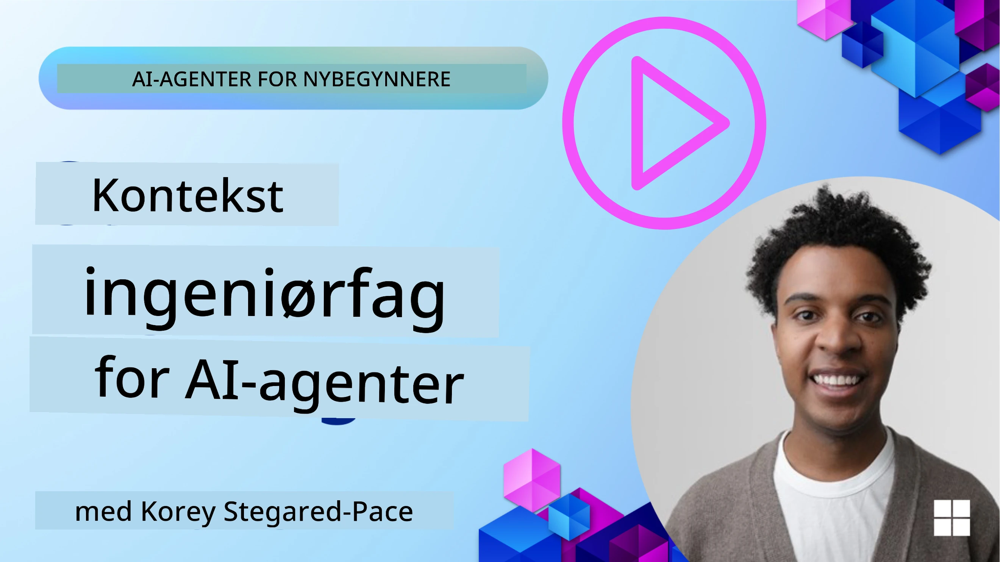
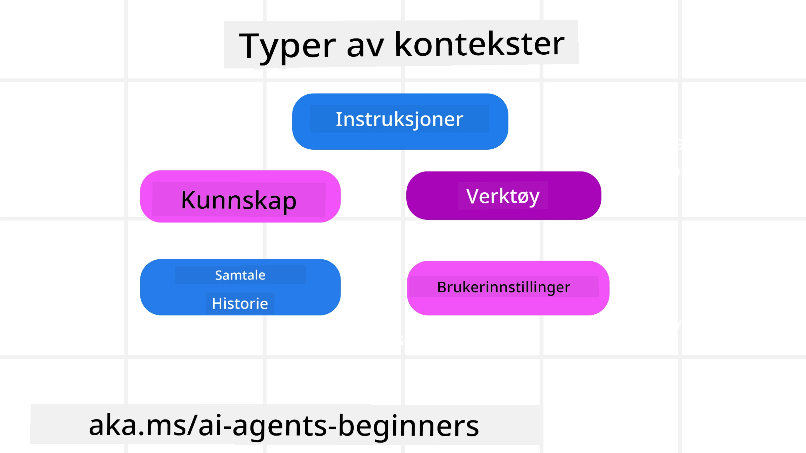
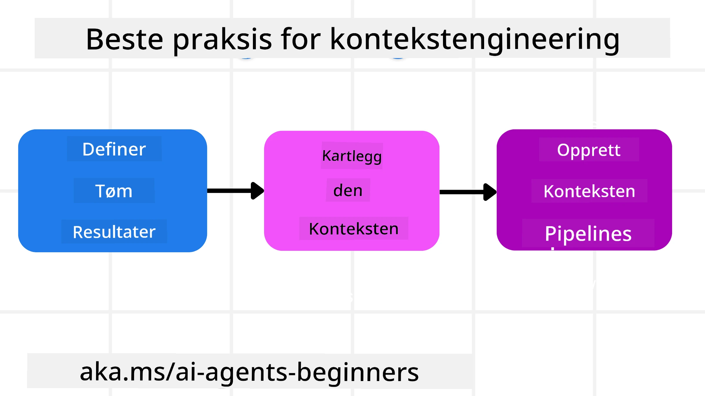

# Kontekstteknikk for AI-agenter

> _(Klikk på bildet ovenfor for å se video av denne leksjonen)_

Å forstå kompleksiteten i applikasjonen du bygger en AI-agent for, er viktig for å lage en pålitelig en. Vi må bygge AI-agenter som effektivt håndterer informasjon for å møte komplekse behov utover prompt engineering.

I denne leksjonen skal vi se på hva kontekstteknikk er og hvilken rolle den spiller i utviklingen av AI-agenter.

## Introduksjon

Denne leksjonen vil dekke:

• **Hva kontekstteknikk er** og hvorfor det skiller seg fra prompt engineering.

• **Strategier for effektiv kontekstteknikk**, inkludert hvordan man skriver, velger, komprimerer og isolerer informasjon.

• **Vanlige kontekstsfeil** som kan sette AI-agenten ut av spill og hvordan man kan fikse dem.

## Læringsmål

Etter å ha fullført denne leksjonen vil du forstå hvordan du:

• **Definerer kontekstteknikk** og skiller det fra prompt engineering.

• **Identifiserer nøkkelkomponentene i kontekst** i Large Language Model (LLM) applikasjoner.

• **Anvender strategier for å skrive, velge, komprimere og isolere kontekst** for å forbedre agentens ytelse.

• **Gjenkjenner vanlige kontekstsfeil** som forgiftning, distraksjon, forvirring og sammenstøt, og implementerer tiltak for å redusere dem.

## Hva er kontekstteknikk?

For AI-agenter er kontekst det som driver planleggingen for at agenten skal ta visse handlinger. Kontekstteknikk er praksisen med å sørge for at AI-agenten har riktig informasjon for å fullføre neste steg av oppgaven. Kontekstvinduet er begrenset i størrelse, så som agentutviklere må vi lage systemer og prosesser for å håndtere å legge til, fjerne og kondensere informasjonen i kontekstvinduet.

### Prompt Engineering vs Kontekstteknikk

Prompt engineering fokuserer på et enkelt sett med statiske instruksjoner for å effektivt styre AI-agentene med et sett regler. Kontekstteknikk handler om å håndtere et dynamisk sett av informasjon, inkludert den initielle prompten, for å sikre at AI-agenten har det den trenger over tid. Hovedideen med kontekstteknikk er å gjøre denne prosessen repeterbar og pålitelig.

### Typer kontekst

Det er viktig å huske at kontekst ikke bare er én ting. Informasjonen som AI-agenten trenger kan komme fra flere ulike kilder, og det er opp til oss å sørge for at agenten har tilgang til disse kildene:

Typene kontekst en AI-agent kan trenge å håndtere inkluderer:

• **Instruksjoner:** Dette er som agentens "regler" – prompts, systemmeldinger, eksempel med få skudd (few-shot) som viser AI hvordan gjøre noe, og beskrivelser av verktøy den kan bruke. Her kombineres fokuset til prompt engineering med kontekstteknikk.

• **Kunnskap:** Dette dekker fakta, informasjon hentet fra databaser, eller langtidshukommelse agenten har samlet. Dette inkluderer integrering av Retrieval Augmented Generation (RAG) system hvis en agent trenger tilgang til ulike kunnskapslager og databaser.

• **Verktøy:** Definisjoner av eksterne funksjoner, API-er og MCP-servere som agenten kan kalle, sammen med tilbakemeldinger (resultater) den får ved å bruke dem.

• **Samtalehistorikk:** Den pågående dialogen med en bruker. Over tid blir disse samtalene lengre og mer komplekse, noe som tar plass i kontekstvinduet.

• **Brukerpreferanser:** Informasjon lært om en brukers liker eller misliker over tid. Dette kan lagres og brukes når viktige beslutninger skal tas for å hjelpe brukeren.

## Strategier for effektiv kontekstteknikk

### Planleggingsstrategier

God kontekstteknikk starter med god planlegging. Her er en tilnærming som vil hjelpe deg å begynne å tenke på hvordan du kan anvende konseptet med kontekstteknikk:

1. **Definer klare resultater** - Resultatene for oppgavene som AI-agentene skal utføre, bør være klart definert. Svar på spørsmålet - "Hvordan vil verden se ut når AI-agenten er ferdig med oppgaven sin?" Med andre ord, hvilken endring, informasjon eller respons skal brukeren ha etter å ha interagert med AI-agenten.
2. **Kartlegg konteksten** - Når du har definert resultatene for AI-agenten, må du svare på spørsmålet "Hvilken informasjon trenger AI-agenten for å fullføre denne oppgaven?". På denne måten kan du begynne å kartlegge hvor denne informasjonen kan finnes.
3. **Lag kontekst-pipelines** - Nå som du vet hvor informasjonen er, må du svare på spørsmålet "Hvordan vil agenten hente denne informasjonen?". Dette kan gjøres på ulike måter, inkludert RAG, bruk av MCP-servere og andre verktøy.

### Praktiske strategier

Planlegging er viktig, men når informasjonen begynner å strømme inn i agentens kontekstvindu, må vi ha praktiske strategier for å håndtere det:

#### Håndtering av kontekst

Selv om noe informasjon legges til kontekstvinduet automatisk, handler kontekstteknikk om å ta en mer aktiv rolle i denne informasjonen, noe som kan gjøres ved hjelp av noen strategier:

 1. **Agentens kladdebok**
 Dette gjør det mulig for en AI-agent å ta notater om relevant informasjon om nåværende oppgaver og brukerinteraksjoner i løpet av en enkelt økt. Dette bør eksistere utenfor kontekstvinduet i en fil eller runtime-objekt som agenten kan hente senere i denne økten om nødvendig.

 2. **Hukommelse**
 Kladdebøker er gode for å håndtere informasjon utenfor kontekstvinduet i en enkelt økt. Hukommelse gjør at agenter kan lagre og hente relevant informasjon på tvers av flere økter. Dette kan inkludere sammendrag, brukerpreferanser og tilbakemeldinger for forbedringer i fremtiden.

 3. **Komprimering av kontekst**
  Når kontekstvinduet vokser og nærmer seg grensen, kan teknikker som oppsummering og trimming brukes. Dette inkluderer enten å beholde bare den mest relevante informasjonen eller fjerne eldre meldinger.
  
 4. **Multi-agent systemer**
  Utvikling av multi-agent systemer er en form for kontekstteknikk fordi hver agent har sitt eget kontekstvindu. Hvordan den konteksten deles og overføres til ulike agenter er noe annet å planlegge når man bygger disse systemene.
  
 5. **Sandbox-miljøer**
  Hvis en agent trenger å kjøre noe kode eller behandle store mengder informasjon i et dokument, kan dette bruke et stort antall tokens for å prosessere resultatene. I stedet for å ha alt dette lagret i kontekstvinduet, kan agenten bruke et sandbox-miljø som kan kjøre denne koden og kun lese resultatene og annen relevant informasjon.
  
 6. **Runtime-tilstandobjekter**
   Dette gjøres ved å lage informasjonsbeholdere for å håndtere situasjoner når agenten må ha tilgang til bestemt informasjon. For en kompleks oppgave vil dette gjøre det mulig for agenten å lagre resultatene av hver deloppgave steg for steg, slik at konteksten kun forblir koblet til den spesifikke deloppgaven.

#### Undersøke kontekst

Etter at du har brukt en av disse strategiene, er det verdt å sjekke hva neste modellkall faktisk mottok. Et nyttig spørsmål for feilsøking er:

> Lastet agenten for mye kontekst, feil kontekst, eller manglet den nødvendig kontekst?

Du trenger ikke logge rå prompts, verktøyresultater eller innhold i hukommelsen for å svare på det spørsmålet. I produksjon foretrekk små inspeksjonslogger over kontekst som fanger opp tellinger, ID-er, hasher og policyetiketter:

- **Utvalg:** Følg med på hvor mange kandidatchunks, verktøy eller minner som ble vurdert, hvor mange som ble valgt, og hvilken regel eller poengsum som gjorde at andre ble filtrert ut.
- **Komprimering:** Registrer kildeområde eller sporfølge-ID, sammendrags-ID, en estimert token-telling før og etter komprimering, og om råinnholdet ble ekskludert fra neste kall.
- **Isolasjon:** Noter hvilken deloppgave som kjørte i en egen agent, økt eller sandbox, hvilket begrenset sammendrag som ble returnert, og om stor verktøyoutput holdt seg utenfor hovedagentens kontekst.
- **Hukommelse og RAG:** Lagre dokument-ID-er for oppslag, hukommelses-ID-er, poengsummer, valgte ID-er og redaksjonsstatus i stedet for fullstendig hentet tekst.
- **Sikkerhet og personvern:** Foretrekk hasher, ID-er, token-bøtter og policyetiketter fremfor sensitiv prompt-tekst, verktøy-argumenter, verktøyresultater eller brukerens hukommelsesinnhold.

Målet er ikke å beholde mer kontekst. Det er å etterlate nok bevis til at en utvikler kan se hvilken kontekststrategi som ble kjørt og om det endret neste modellkall på forventet måte.

### Eksempel på kontekstteknikk

La oss si vi vil at en AI-agent skal **"Bestille meg en reise til Paris."**

• En enkel agent som bare bruker prompt engineering kan bare svare: **"Ok, når ønsker du å reise til Paris?"**. Den behandlet kun ditt direkte spørsmål på det tidspunktet brukeren spurte.

• En agent som bruker kontekstteknikkstrategiene som er dekket her, ville gjøre mye mer. Før den i det hele tatt svarer, kan systemet:

  ◦ **Sjekke kalenderen din** for tilgjengelige datoer (henter sanntidsdata).

 ◦ **Huske tidligere reisepreferanser** (fra langtidshukommelsen) som ditt foretrukne flyselskap, budsjett eller om du foretrekker direktefly.

 ◦ **Identifisere tilgjengelige verktøy** for fly- og hotellbestilling.

- Da kan et eksempel på svar være: "Hei [Ditt navn]! Jeg ser at du er ledig første uke i oktober. Skal jeg se etter direktefly til Paris på [Foretrukket flyselskap] innenfor ditt vanlige budsjett på [Budsjett]?" Dette rikere, kontekstbevisste svaret viser kraften i kontekstteknikk.

## Vanlige kontekstfeil

### Kontekstforgiftning

**Hva det er:** Når en hallusinasjon (falsk informasjon generert av LLM) eller en feil kommer inn i konteksten og gjentatte ganger refereres til, noe som får agenten til å forfølge umulige mål eller utvikle meningsløse strategier.

**Hva du bør gjøre:** Implementer **kontekstvalidering** og **karantene**. Verifiser informasjon før den legges til langtidshukommelsen. Hvis potensiell forgiftning oppdages, start nye friske konteksttråder for å hindre at den dårlige informasjonen sprer seg.

**Reisebestillingseksempel:** Agenten din hallusinerer en **direkteflyvning fra en liten lokal flyplass til en fjern internasjonal by** som faktisk ikke tilbyr internasjonale flyvninger. Denne ikke-eksisterende flydetaljen lagres i konteksten. Senere, når du ber agenten bestille, prøver den stadig å finne billetter for denne umulige ruten, noe som fører til gjentatte feil.

**Løsning:** Implementer et steg som **validerer flyvningens eksistens og ruter med et sanntids-API** _før_ flydetaljen legges til agentens arbeidskontekst. Hvis valideringen feiler, blir feilinformasjonen "karantenisert" og ikke brukt videre.

### Kontekstdistraksjon

**Hva det er:** Når konteksten blir så stor at modellen fokuserer for mye på den akkumulerte historien i stedet for å bruke det den lærte under treningen, noe som fører til repeterende eller ubrukelige handlinger. Modeller kan begynne å gjøre feil selv før kontekstvinduet er fullt.

**Hva du bør gjøre:** Bruk **kontekstsammendrag**. Komprimer periodisk akkumulert informasjon til kortere sammendrag, behold viktige detaljer samtidig som overflødig historie fjernes. Dette hjelper å "resette" fokuset.

**Reisebestillingseksempel:** Du har diskutert ulike drømmereisedestinasjoner lenge, inkludert en detaljert gjengivelse av ryggsekkreisen din fra to år siden. Når du endelig ber om en **"billig flyreise neste måned,"** blir agenten forsømt av de gamle, irrelevante detaljene og fortsetter å spørre om ryggsekkutstyr eller tidligere reiseruter, og ignorerer den nåværende forespørselen.

**Løsning:** Etter et visst antall turer eller når konteksten blir for stor, bør agenten **sammendrage de nyeste og mest relevante delene av samtalen** – fokusere på dine nåværende reisedatoer og destinasjon – og bruke dette kondenserte sammendraget for neste LLM-kall, og forkaste mindre relevante historiske meldinger.

### Konfunderende kontekst

**Hva det er:** Når unødvendig kontekst, ofte i form av for mange tilgjengelige verktøy, får modellen til å generere dårlige svar eller kalle irrelevante verktøy. Mindre modeller er spesielt utsatt for dette.

**Hva du bør gjøre:** Implementer **verktøylastforvaltning** med RAG-teknikker. Lagre verktøybeskrivelser i en vektordatabase og velg _kun_ de mest relevante verktøyene for hver spesifikke oppgave. Forskning viser at begrense valg til under 30 verktøy er best.

**Reisebestillingseksempel:** Agenten din har tilgang til dusinvis av verktøy: `book_flight`, `book_hotel`, `rent_car`, `find_tours`, `currency_converter`, `weather_forecast`, `restaurant_reservations`, osv. Du spør, **"Hva er den beste måten å komme seg rundt i Paris på?"** På grunn av det store antall verktøy blir agenten forvirret og prøver å kalle `book_flight` _inne i_ Paris, eller `rent_car` selv om du foretrekker offentlig transport, fordi verktøybeskrivelsene kan overlappe eller den ikke klarer å skille det beste.

**Løsning:** Bruk **RAG over verktøybeskrivelser**. Når du spør om å komme seg rundt i Paris, henter systemet dynamisk _kun_ de mest relevante verktøyene som `rent_car` eller `public_transport_info` basert på forespørselen din, og presenterer en fokusert "lastprofil" av verktøy til LLM.

### Kontekstkonflikt

**Hva det er:** Når motstridende informasjon finnes i konteksten, noe som fører til inkonsekvent resonnering eller dårlige endelige svar. Dette skjer ofte når informasjon kommer i etapper, og tidlige, feilaktige antakelser forblir i konteksten.

**Hva du bør gjøre:** Bruk **kontekstbeskjæring** og **utlasting**. Beskjæring betyr å fjerne foreldet eller motstridende informasjon etter hvert som nye detaljer kommer inn. Utlasting gir modellen et eget "kladdebok"-arbeidsområde for å bearbeide informasjon uten å rotete hovedkonteksten.

**Eksempel på reisebestilling:** Du forteller først agenten din, **"Jeg vil fly økonomiklasse."** Senere i samtalen ombestemmer du deg og sier, **"Egentlig, for denne turen, la oss ta businessklasse."** Hvis begge instruksjoner fortsatt finnes i konteksten, kan agenten få motstridende søkeresultater eller bli forvirret om hvilken preferanse som skal prioriteres.

**Løsning:** Implementer **kontekstuering**. Når en ny instruksjon motsetter en gammel, fjernes den eldre instruksjonen eller blir eksplisitt overstyrt i konteksten. Alternativt kan agenten bruke en **notatblokk** for å forene motstridende preferanser før beslutning, og sikre at kun den endelige, konsistente instruksjonen styrer handlingene.

## Har du flere spørsmål om kontekstuering?

Bli med i [Microsoft Foundry Discord](https://discord.com/invite/ATgtXmAS5D) for å møte andre elever, delta på kontortid og få svar på dine spørsmål om AI-agenter.

---

<!-- CO-OP TRANSLATOR DISCLAIMER START -->
**Ansvarsfraskrivelse**:
Dette dokumentet er oversatt ved hjelp av AI-oversettelsestjenesten [Co-op Translator](https://github.com/Azure/co-op-translator). Selv om vi streber etter nøyaktighet, vær oppmerksom på at automatiske oversettelser kan inneholde feil eller unøyaktigheter. Det opprinnelige dokumentet på originalspråket skal betraktes som den autoritative kilden. For kritisk informasjon anbefales profesjonell menneskelig oversettelse. Vi er ikke ansvarlige for eventuelle misforståelser eller feiltolkninger som oppstår ved bruk av denne oversettelsen.
<!-- CO-OP TRANSLATOR DISCLAIMER END -->