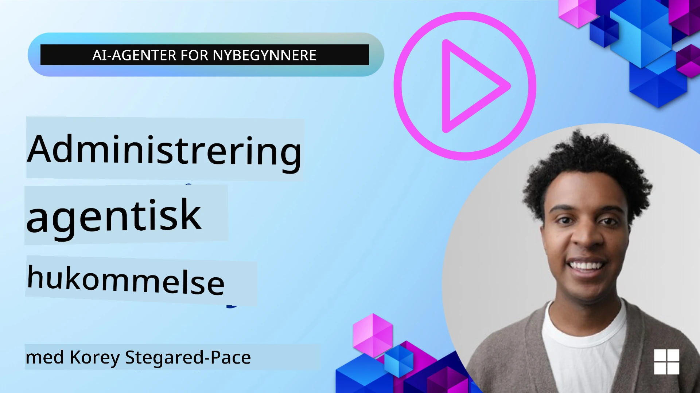

# Minne for AI-agenter 

Når man diskuterer de unike fordelene ved å lage AI-agenter, diskuteres hovedsakelig to ting: evnen til å bruke verktøy for å fullføre oppgaver og evnen til å forbedre seg over tid. Minne er grunnlaget for å lage selvforbedrende agenter som kan skape bedre opplevelser for brukerne våre.

I denne leksjonen skal vi se på hva minne er for AI-agenter og hvordan vi kan håndtere og bruke det til fordel for applikasjonene våre.

## Introduksjon

Denne leksjonen vil dekke:

• **Forstå AI-agentminne**: Hva minne er og hvorfor det er essensielt for agenter.

• **Implementering og lagring av minne**: Praktiske metoder for å legge til minnefunksjoner til AI-agentene dine, med fokus på korttids- og langtidsminne.

• **Gjøre AI-agenter selvforbedrende**: Hvordan minne gjør det mulig for agenter å lære fra tidligere interaksjoner og forbedre seg over tid.

## Tilgjengelige implementeringer

Denne leksjonen inkluderer to omfattende notatbøker:

• **[13-agent-memory.ipynb](./13-agent-memory.ipynb)**: Implementerer minne ved bruk av Mem0 og Azure AI Search med Microsoft Agent Framework

• **[13-agent-memory-cognee.ipynb](./13-agent-memory-cognee.ipynb)**: Implementerer strukturert minne ved bruk av Cognee, automatisk bygging av kunnskapsgraf støttet av embeddings, visualisering av graf og intelligent oppslag

## Læringsmål

Etter å ha fullført denne leksjonen vil du kunne:

• **Skille mellom ulike typer AI-agentminne**, inkludert arbeidsminne, korttidsminne og langtidsminne, samt spesialiserte former som persona og episodisk minne.

• **Implementere og administrere korttids- og langtidsminne for AI-agenter** ved bruk av Microsoft Agent Framework, med verktøy som Mem0, Cognee, Whiteboard minne, og integrering med Azure AI Search.

• **Forstå prinsippene bak selvforbedrende AI-agenter** og hvordan robuste minnehåndteringssystemer bidrar til kontinuerlig læring og tilpasning.

## Forstå AI-agentminne

I kjernen refererer **minne for AI-agenter til mekanismene som lar dem beholde og hente informasjon**. Denne informasjonen kan være spesifikke detaljer om en samtale, brukerpreferanser, tidligere handlinger eller til og med lærte mønstre.

Uten minne er AI-applikasjoner ofte statsløse, noe som betyr at hver interaksjon starter på nytt. Dette fører til en repetitiv og frustrerende brukeropplevelse hvor agenten "glemmer" tidligere kontekst eller preferanser.

### Hvorfor er minne viktig?

Intelligensen til en agent er dypt knyttet til dens evne til å hente frem og bruke tidligere informasjon. Minne gjør at agenter kan være:

• **Reflekterende**: Lære av tidligere handlinger og resultater.

• **Interaktive**: Opprettholde kontekst gjennom en pågående samtale.

• **Proaktive og reaktive**: Forutse behov eller svare hensiktsmessig basert på historiske data.

• **Autonome**: Operere mer selvstendig ved å hente på lagret kunnskap.

Målet med å implementere minne er å gjøre agenter mer **pålitelige og kompetente**.

### Typer minne

#### Arbeidsminne

Tenk på dette som et skisseark en agent bruker under en enkelt pågående oppgave eller tankeprosess. Det holder umiddelbar informasjon som trengs for å beregne neste steg.

For AI-agenter fanger arbeidsminnet ofte opp den mest relevante informasjonen fra en samtale, selv om hele chatthistorikken er lang eller forkortet. Det fokuserer på å trekke ut nøkkelelementer som krav, forslag, beslutninger og handlinger.

**Eksempel på arbeidsminne**

I en reisebestillingsagent kan arbeidsminnet fange brukerens nåværende forespørsel, for eksempel "Jeg vil bestille en tur til Paris". Dette spesifikke kravet holdes i agentens umiddelbare kontekst for å veilede den pågående interaksjonen.

#### Korttidsminne

Denne typen minne beholder informasjon i løpet av en enkelt samtale eller økt. Det er konteksten i den nåværende chatten, som lar agenten referere tilbake til tidligere deler av dialogen.

**Eksempel på korttidsminne**

Hvis en bruker spør "Hvor mye koster en flyreise til Paris?" og så følger opp med "Hva med overnatting der?", sikrer korttidsminne at agenten vet at "der" refererer til "Paris" i samme samtale.

#### Langtidsminne

Dette er informasjon som vedvarer over flere samtaler eller økter. Det lar agenter huske brukerpreferanser, historiske interaksjoner eller generell kunnskap over lange perioder. Dette er viktig for personalisering.

**Eksempel på langtidsminne**

Et langtidsminne kan lagre at "Ben liker ski og utendørsaktiviteter, liker kaffe med fjellutsikt, og ønsker å unngå avanserte skibakker på grunn av en tidligere skade". Denne informasjonen, lært fra tidligere interaksjoner, påvirker anbefalinger i fremtidige reiseplanleggingsøkter, noe som gjør dem svært personlige.

#### Persona-minne

Denne spesialiserte minnetypen hjelper en agent å utvikle en konsistent "personlighet" eller "persona". Det lar agenten huske detaljer om seg selv eller sin tiltenkte rolle, noe som gjør interaksjoner mer flytende og fokuserte.

**Eksempel på persona-minne**

Hvis reiseagenten er designet for å være en "ekspert på ski-planlegging", kan persona-minnet forsterke denne rollen og påvirke svarene slik at de samsvarer med en eksperts tone og kunnskap.

#### Workflow/Episodisk minne

Dette minnet lagrer sekvensen av trinn en agent tar under en kompleks oppgave, inkludert suksesser og feil. Det er som å huske spesifikke "episoder" eller tidligere opplevelser for å lære av dem.

**Eksempel på episodisk minne**

Hvis agenten forsøkte å bestille en bestemt flyreise men feilet på grunn av utilgjengelighet, kan episodisk minne registrere denne feilen, slik at agenten kan prøve alternative flyvninger eller informere brukeren om problemet på en mer opplyst måte ved neste forsøk.

#### Enhetsminne

Dette innebærer å trekke ut og huske spesifikke enheter (som personer, steder eller ting) og hendelser fra samtaler. Det lar agenten bygge en strukturert forståelse av nøkkel-elementer som er diskutert.

**Eksempel på enhetsminne**

Fra en samtale om en tidligere tur kan agenten trekke ut "Paris," "Eiffeltårnet" og "middag på Le Chat Noir restaurant" som enheter. Ved en framtidig interaksjon kan agenten huske "Le Chat Noir" og tilby å gjøre en ny reservasjon der.

#### Strukturert RAG (Retrieval Augmented Generation)

Mens RAG er en bredere teknikk, fremheves "Strukturert RAG" som en kraftfull minneteknologi. Den trekker ut tettpakket, strukturert informasjon fra forskjellige kilder (samtaler, e-poster, bilder) og bruker dette for å forbedre presisjon, gjenfinning og hastighet i svar. I motsetning til klassisk RAG som kun baserer seg på semantisk likhet, arbeider Strukturert RAG med den iboende strukturen i informasjon.

**Eksempel på Strukturert RAG**

I stedet for bare å matche nøkkelord, kan Strukturert RAG tolke flydetaljer (destinasjon, dato, tid, flyselskap) fra en e-post og lagre dem på en strukturert måte. Dette gjør det mulig med presise spørringer som "Hvilken flyreise bestilte jeg til Paris på tirsdag?"

## Implementering og lagring av minne

Å implementere minne for AI-agenter innebærer en systematisk prosess av **minnehåndtering**, som inkluderer generering, lagring, hentning, integrering, oppdatering og til og med "glemming" (eller sletting) av informasjon. Hentning er et spesielt viktig aspekt.

### Spesialiserte minneverktøy

#### Mem0

En måte å lagre og håndtere agentminne på er ved bruk av spesialiserte verktøy som Mem0. Mem0 fungerer som et vedvarende minnelag som lar agenter hente relevante interaksjoner, lagre brukerpreferanser og faktiske kontekster, og lære av suksesser og feil over tid. Tanken er at statsløse agenter blir til tilstandsbaserte agenter.

Det fungerer gjennom en **to-faset minnepipeline: ekstraksjon og oppdatering**. Først sendes meldinger lagt til i en agents tråd til Mem0-tjenesten, som bruker en stor språkmodell (LLM) for å oppsummere samtalehistorikk og trekke ut nye minner. Deretter bestemmer en LLM-styrt oppdateringsfase om minnet skal legges til, endres eller slettes, og lagrer dem i en hybrid datalagring som kan inneholde vektor-, graf- og nøkkel-verdi-databaser. Systemet støtter også ulike minnetyper og kan inkludere grafminne for å håndtere relasjoner mellom enheter.

#### Cognee

En annen kraftfull tilnærming er å bruke **Cognee**, et åpen kildekode semantisk minne for AI-agenter som omgjør strukturert og ustrukturert data til søkbare kunnskapsgrafer støttet av embeddings. Cognee tilbyr en **dual-store arkitektur** som kombinerer vektorsøk basert på likhet med grafrelasjoner, noe som gjør at agenter kan forstå ikke bare hva informasjon er lik, men hvordan konsepter henger sammen.

Den utmerker seg i **hybrid hentning** som blander vektorsammenligninger, grafstruktur og LLM-resonnering – fra enkel oppslag av rå biter til grafbevisst spørsmålssvar. Systemet opprettholder **levende minne** som utvikler seg og vokser samtidig som det forblir søkbart som én sammenkoblet graf, og støtter både korttidsøkkontekst og langsiktig vedvarende minne.

Cognee-notatboken ([13-agent-memory-cognee.ipynb](./13-agent-memory-cognee.ipynb)) demonstrerer bygging av dette samlede minnelaget, med praktiske eksempler på inntak av ulike datakilder, visualisering av kunnskapsgrafen og spørring med forskjellige søkestrategier tilpasset spesifikke agentbehov.

### Lagring av minne med RAG

Utover spesialiserte minneverktøy som Mem0, kan du dra nytte av robuste søketjenester som **Azure AI Search som backend for lagring og henting av minner**, spesielt for strukturert RAG.

Dette gjør det mulig å forankre agentens svar i dine egne data, og sikrer mer relevante og nøyaktige svar. Azure AI Search kan brukes til å lagre brukerspesifikke reiseminner, produktkataloger eller annen domene-spesifikk kunnskap.

Azure AI Search støtter funksjoner som **Strukturert RAG**, som utmerker seg i å trekke ut og hente tettpakket, strukturert informasjon fra store datasett som samtalehistorikk, e-poster eller til og med bilder. Dette gir "supermenneskelig presisjon og gjenfinning" sammenlignet med tradisjonell tekstkutting og embedding-tilnærminger.

## Gjøre AI-agenter selvforbedrende

Et vanlig mønster for selvforbedrende agenter innebærer å introdusere en **"kunnskapsagent"**. Denne separate agenten observerer hovedsamtalen mellom brukeren og den primære agenten. Dens rolle er å:

1. **Identifisere verdifull informasjon**: Finne ut om deler av samtalen er verdt å lagre som generell kunnskap eller spesifikk brukerpreferanse.

2. **Uttet og oppsummering**: Destillere essensen av læring eller preferanse fra samtalen.

3. **Lagre i en kunnskapsbase**: Bevare denne utdratte informasjonen, ofte i en vektordatabse, slik at den kan hentes senere.

4. **Forsterke fremtidige spørringer**: Når brukeren initierer en ny forespørsel, henter kunnskapsagenten relevant lagret informasjon og legger den til i brukerens prompt, og gir avgjørende kontekst til den primære agenten (likt RAG).

### Optimaliseringer for minne

• **Latenshåndtering**: For å unngå å senke brukerinteraksjoner kan en billigere og raskere modell brukes først for å raskt sjekke om informasjon er verdt å lagre eller hente, og kun kalle den mer komplekse ekstraksjons-/hentingsprosessen når nødvendig.

• **Vedlikehold av kunnskapsbase**: For en voksende kunnskapsbase kan mindre ofte brukt informasjon flyttes til "kald lagring" for å håndtere kostnader.

## Har du flere spørsmål om agentminne?

Bli med i [Microsoft Foundry Discord](https://aka.ms/ai-agents/discord) for å møte andre lærende, delta på kontortimer og få svar på spørsmålene dine om AI-agenter.

---

<!-- CO-OP TRANSLATOR DISCLAIMER START -->
**Ansvarsfraskrivelse**:
Dette dokumentet er oversatt ved hjelp av AI-oversettelsestjenesten [Co-op Translator](https://github.com/Azure/co-op-translator). Selv om vi tilstreber nøyaktighet, vennligst vær oppmerksom på at automatiske oversettelser kan inneholde feil eller unøyaktigheter. Det originale dokumentet på det opprinnelige språket bør anses som den autoritative kilden. For kritisk informasjon anbefales profesjonell menneskelig oversettelse. Vi er ikke ansvarlige for eventuelle misforståelser eller feiltolkninger som følge av bruk av denne oversettelsen.
<!-- CO-OP TRANSLATOR DISCLAIMER END -->