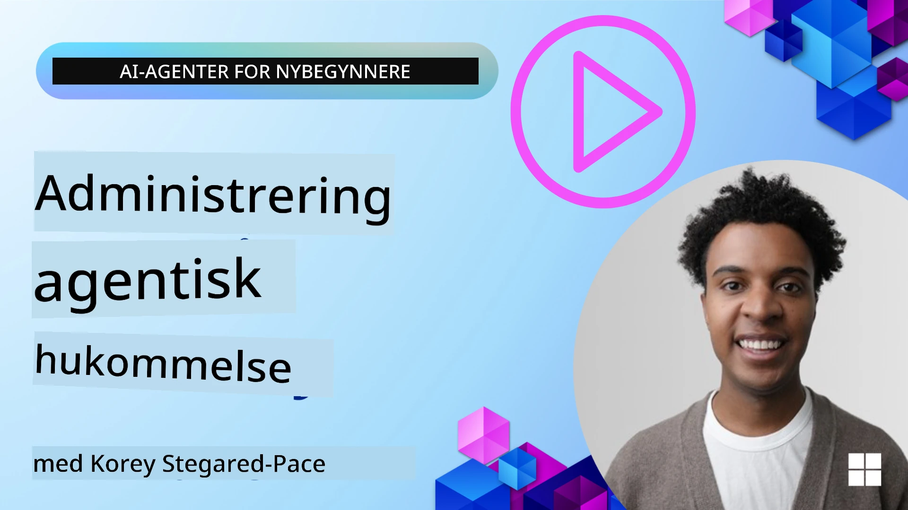

# Minne for AI-agenter

Når vi diskuterer de unike fordelene med å lage AI-agenter, er det to ting som hovedsakelig diskuteres: evnen til å kalle verktøy for å utføre oppgaver og evnen til å forbedre seg over tid. Minne er grunnlaget for å skape selvforbedrende agenter som kan skape bedre opplevelser for våre brukere.

I denne leksjonen skal vi se på hva minne er for AI-agenter, og hvordan vi kan håndtere det og bruke det til fordel for applikasjonene våre.

## Introduksjon

Denne leksjonen vil dekke:

• **Forstå AI-agentminne**: Hva minne er og hvorfor det er essensielt for agenter.

• **Implementering og lagring av minne**: Praktiske metoder for å legge til minnekapasiteter til dine AI-agenter, med fokus på korttid og langtid minne.

• **Å gjøre AI-agenter selvforbedrende**: Hvordan minne gjør det mulig for agenter å lære fra tidligere interaksjoner og forbedre seg over tid.

## Tilgjengelige implementeringer

Denne leksjonen inkluderer to omfattende notebook-opplæringer:

• **[13-agent-memory.ipynb](./13-agent-memory.ipynb)**: Implementerer minne ved bruk av Mem0 og Azure AI Search med Microsoft Agent Framework

• **[13-agent-memory-cognee.ipynb](./13-agent-memory-cognee.ipynb)**: Implementerer strukturert minne ved hjelp av Cognee, som automatisk bygger kunnskapsgraf støttet av embeddings, visualiserer graf, og intelligent henting

## Læringsmål

Etter å ha fullført denne leksjonen vil du vite hvordan du:

• **Skiller mellom ulike typer AI-agentminne**, inkludert arbeidsminne, korttidshukommelse og langtidshukommelse, samt spesialiserte former som persona- og episodisk minne.

• **Implementerer og håndterer kort- og langtidshukommelse for AI-agenter** ved å bruke Microsoft Agent Framework, utnytte verktøy som Mem0, Cognee, Whiteboard-minne og integrere med Azure AI Search.

• **Forstå prinsippene bak selvforbedrende AI-agenter** og hvordan robuste systemer for minnehåndtering bidrar til kontinuerlig læring og tilpasning.

## Forstå AI-agentminne

I sin kjerne refererer **minne for AI-agenter til mekanismene som lar dem beholde og hente informasjon**. Denne informasjonen kan være spesifikke detaljer om en samtale, brukerpreferanser, tidligere handlinger eller til og med lærte mønstre.

Uten minne er AI-applikasjoner ofte tilstandsløse, noe som betyr at hver interaksjon starter fra bunnen av. Dette fører til en gjentakende og frustrerende brukeropplevelse hvor agenten "glemmer" tidligere kontekst eller preferanser.

### Hvorfor er minne viktig?

En agents intelligens er dypt knyttet til dens evne til å hente og bruke tidligere informasjon. Minne lar agenter være:

• **Reflekterende**: Lære fra tidligere handlinger og resultater.

• **Interaktive**: Opprettholde kontekst over en pågående samtale.

• **Proaktive og reaktive**: Forutse behov eller svare hensiktsmessig basert på historiske data.

• **Autonome**: Operere mer uavhengig ved å trekke på lagret kunnskap.

Målet med å implementere minne er å gjøre agenter mer **pålitelige og kapable**.

### Typer minne

#### Arbeidsminne

Tenk på dette som et stykke skissepapir en agent bruker under en enkelt, pågående oppgave eller tankerekke. Det holder umiddelbar informasjon som trengs for å regne ut neste steg.

For AI-agenter fanger arbeidsminnet ofte den mest relevante informasjonen fra en samtale, selv om hele chatthistorikken er lang eller avkortet. Det fokuserer på å trekke ut nøkkelelementer som krav, forslag, beslutninger og handlinger.

**Eksempel på arbeidsminne**

I en reisebestillingsagent kan arbeidsminnet fange opp brukerens nåværende forespørsel, som "Jeg vil booke en tur til Paris". Dette spesifikke kravet holdes i agentens umiddelbare kontekst for å lede den nåværende interaksjonen.

#### Korttidshukommelse

Denne typen minne beholder informasjon i løpet av en enkelt samtale eller økt. Det er konteksten for den nåværende chatten, som lar agenten referere tilbake til tidligere runder i dialogen.

I [Microsoft Agent Framework](https://github.com/microsoft/agent-framework) Python SDK-eksemplene, samsvarer dette med `AgentSession`, opprettet med `agent.create_session()`. Sesjonen er rammeverkets innebygde korttidsminne: den holder samtalekontekst tilgjengelig så lenge samme sesjon gjenbrukes, men den konteksten blir ikke lagret når sesjonen avsluttes eller applikasjonen startes på nytt. Bruk langtidshukommelse for fakta og preferanser som må overleve på tvers av sesjoner, vanligvis gjennom en database, vektorindeks eller annen varig lagring.

**Eksempel på korttidshukommelse**

Hvis en bruker spør, "Hvor mye koster en flyreise til Paris?" og deretter følger opp med "Hva med innkvartering der?", sikrer korttidshukommelsen at agenten vet at "der" refererer til "Paris" i den samme samtalen.

#### Langtidshukommelse

Dette er informasjon som vedvarer over flere samtaler eller økter. Det lar agenter huske brukerpreferanser, historiske interaksjoner eller generell kunnskap over lengre perioder. Dette er viktig for personalisering.

**Eksempel på langtidshukommelse**

En langtidshukommelse kan lagre at "Ben liker ski og utendørsaktiviteter, liker kaffe med fjellutsikt, og ønsker å unngå avanserte skibakker på grunn av en tidligere skade". Denne informasjonen, lært fra tidligere interaksjoner, påvirker anbefalinger i fremtidige reiseplanleggingsøkter, noe som gjør dem svært personlige.

#### Persona-minne

Denne spesialiserte minnetypen hjelper en agent med å utvikle en konsekvent "personlighet" eller "persona". Det lar agenten huske detaljer om seg selv eller sin tiltenkte rolle, og gjør interaksjoner mer flytende og fokusert.

**Eksempel på persona-minne**
Hvis reiseagenten er designet for å være en "ekspert på ski-planlegging", kan persona-minnet forsterke denne rollen, og påvirke svarene til å samsvare med en eksperts tone og kunnskap.

#### Arbeidsflyt-/episodisk minne

Dette minnet lagrer sekvensen av steg en agent tar under en kompleks oppgave, inkludert suksesser og feil. Det er som å huske spesifikke "episoder" eller tidligere erfaringer for å lære av dem.

**Eksempel på episodisk minne**

Hvis agenten forsøkte å bestille en spesifikk flyreise men det feilet på grunn av utilgjengelighet, kunne episodisk minne registrere denne feilen, og la agenten prøve alternative flyreiser eller informere brukeren om problemet på en mer informert måte ved et senere forsøk.

#### Entitetsminne

Dette innebærer å trekke ut og huske spesifikke entiteter (som personer, steder eller ting) og hendelser fra samtaler. Det lar agenten bygge en strukturert forståelse av nøkkel elementer som diskuteres.

**Eksempel på entitetsminne**

Fra en samtale om en tidligere reise kan agenten trekke ut "Paris," "Eiffeltårnet," og "middag på Le Chat Noir restaurant" som entiteter. I en fremtidig interaksjon kan agenten huske "Le Chat Noir" og tilby å gjøre en ny reservasjon der.

#### Strukturert RAG (Retrieval Augmented Generation)

Mens RAG er en bredere teknikk, er "Strukturert RAG" fremhevet som en kraftfull minneteknologi. Den trekker ut tettpakket, strukturert informasjon fra ulike kilder (samtaler, e-poster, bilder) og bruker den for å forbedre presisjon, treffsikkerhet og hastighet i svar. I motsetning til klassisk RAG som kun baserer seg på semantisk likhet, arbeider Strukturert RAG med den iboende strukturen i informasjonen.

**Eksempel på Strukturert RAG**

I stedet for bare å matche nøkkelord, kan Strukturert RAG analysere flydetaljer (destinasjon, dato, tid, flyselskap) fra en e-post og lagre dem på en strukturert måte. Dette tillater presise spørringer som "Hvilken flyreise bestilte jeg til Paris på tirsdag?"

## Implementering og lagring av minne

Implementering av minne for AI-agenter innebærer en systematisk prosess for **minnehåndtering**, som inkluderer generering, lagring, henting, integrering, oppdatering og til og med "glemming" (eller sletting) av informasjon. Henting er en spesielt viktig del.

### Spesialiserte minneverktøy

#### Mem0

En måte å lagre og håndtere agentminne på er ved bruk av spesialiserte verktøy som Mem0. Mem0 fungerer som et vedvarende minnelag, som lar agenter hente relevante interaksjoner, lagre brukerpreferanser og faktuell kontekst, og lære av suksesser og feil over tid. Ideen her er at tilstandsløse agenter blir til tilstandsfulle.

Det fungerer gjennom en **to-fase minneprosess: ekstraksjon og oppdatering**. Først blir meldinger lagt til i en agents tråd sendt til Mem0-tjenesten, som bruker en stor språkmodell (LLM) for å oppsummere samtalehistorikken og trekke ut nye minner. Deretter avgjør en LLM-drevet oppdateringsfase om disse minnene skal legges til, endres eller slettes, og lagrer dem i en hybrid datalager som kan inkludere vektor-, graf- og nøkkel-verdi-databaser. Dette systemet støtter også ulike minnetyper og kan inkludere grafminne for å håndtere relasjoner mellom entiteter.

#### Cognee

En annen kraftfull tilnærming er bruk av **Cognee**, et åpen kildekode semantisk minne for AI-agenter som omformer strukturert og ustrukturert data til søkbare kunnskapsgrafer støttet av embeddings. Cognee tilbyr en **dobbelt-lagret arkitektur** som kombinerer vektorsøking med grafrelasjoner, som gjør det mulig for agenter å forstå ikke bare hva informasjon er lik, men hvordan konsepter relaterer til hverandre.

Det utmerker seg innen **hybrid henting** som blander vektorsimilaritet, grafstruktur og LLM-resonnering — fra rå chunk-oppslag til grafbevisst spørsmålsbesvarelse. Systemet opprettholder **levende minne** som utvikler seg og vokser samtidig som det forblir søkbart som én sammenkoblet graf, og støtter både korttids kontekst og langtid vedvarende minne.

Cognee-notebook-opplæringen ([13-agent-memory-cognee.ipynb](./13-agent-memory-cognee.ipynb)) demonstrerer bygging av dette enhetlige minnelaget, med praktiske eksempler på å hente inn ulike datakilder, visualisere kunnskapsgrafen, og søke med forskjellige søkestrategier tilpasset spesifikke agentbehov.

### Lagring av minne med RAG

Utover spesialiserte minneverktøy som Mem0 kan du utnytte robuste søketjenester som **Azure AI Search som backend for lagring og henting av minner**, spesielt for strukturert RAG.

Dette lar deg forankre agentens svar i dine egne data, og sikrer mer relevante og presise svar. Azure AI Search kan brukes til å lagre brukerspesifikke reiseopplysninger, produktkataloger eller annen domenespesifikk kunnskap.

Azure AI Search støtter funksjoner som **Strukturert RAG**, som utmerker seg i å trekke ut og hente tettpakket, strukturert informasjon fra store datasett som samtalehistorikk, e-poster eller til og med bilder. Dette gir "overmenneskelig presisjon og treff" sammenlignet med tradisjonelle tekstbiter og embedding-tilnærminger.

## Å gjøre AI-agenter selvforbedrende

Et vanlig mønster for selvforbedrende agenter innebærer å introdusere en **"kunnskapsagent"**. Denne separate agenten observerer hovedsamtalen mellom brukeren og primæragenten. Dens rolle er å:

1. **Identifisere verdifull informasjon**: Bestemme om noen del av samtalen er verdt å lagre som generell kunnskap eller en spesifikk brukerpreferanse.

2. **Ekstrahere og oppsummere**: Destillere essensiell læring eller preferanse fra samtalen.

3. **Lagre i en kunnskapsbase**: Vedvare denne ekstraherte informasjonen, ofte i en vektordatabase, slik at den kan hentes senere.

4. **Forsterke fremtidige spørringer**: Når brukeren initierer en ny spørring, henter kunnskapsagenten relevant lagret informasjon og legger den til brukerens prompt, og gir viktig kontekst til primæragenten (lik RAG).

### Optimaliseringer for minne

• **Latenshåndtering**: For å unngå å senke brukerinteraksjoner, kan en billigere, raskere modell brukes først for raskt å sjekke om informasjon er verdt å lagre eller hente, og bare påkalle den mer komplekse ekstraksjons-/hentingsprosessen om nødvendig.

• **Vedlikehold av kunnskapsbase**: For en voksende kunnskapsbase kan mindre brukt informasjon flyttes til "kaldlagring" for å styre kostnader.

## Har du flere spørsmål om agentminne?

Bli med i [Microsoft Foundry Discord](https://discord.com/invite/ATgtXmAS5D) for å møte andre elever, delta på kontortimer og få svar på dine AI-agent spørsmål.

---

<!-- CO-OP TRANSLATOR DISCLAIMER START -->
**Ansvarsfraskrivelse**:
Dette dokumentet er oversatt ved hjelp av AI-oversettelsestjenesten [Co-op Translator](https://github.com/Azure/co-op-translator). Selv om vi streber etter nøyaktighet, vær oppmerksom på at automatiske oversettelser kan inneholde feil eller unøyaktigheter. Det opprinnelige dokumentet på originalspråket skal betraktes som den autoritative kilden. For kritisk informasjon anbefales profesjonell menneskelig oversettelse. Vi er ikke ansvarlige for eventuelle misforståelser eller feiltolkninger som oppstår ved bruk av denne oversettelsen.
<!-- CO-OP TRANSLATOR DISCLAIMER END -->