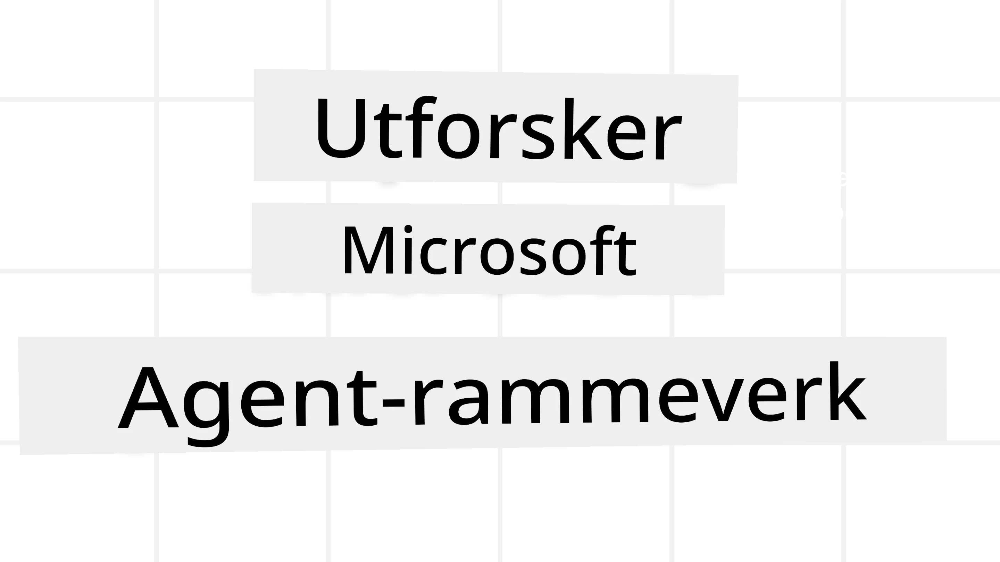
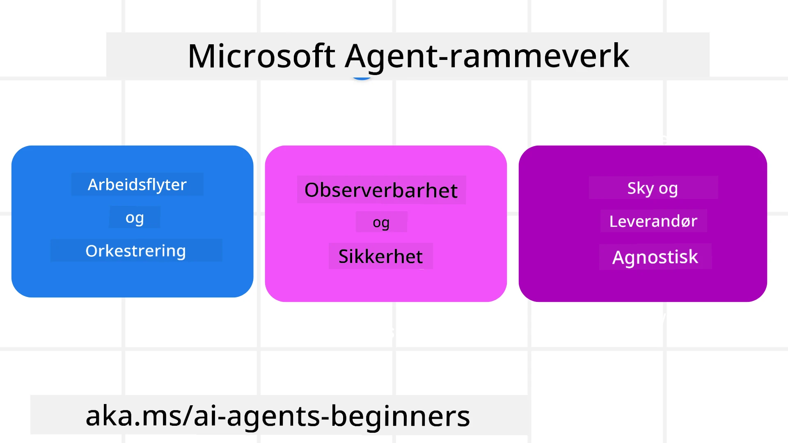
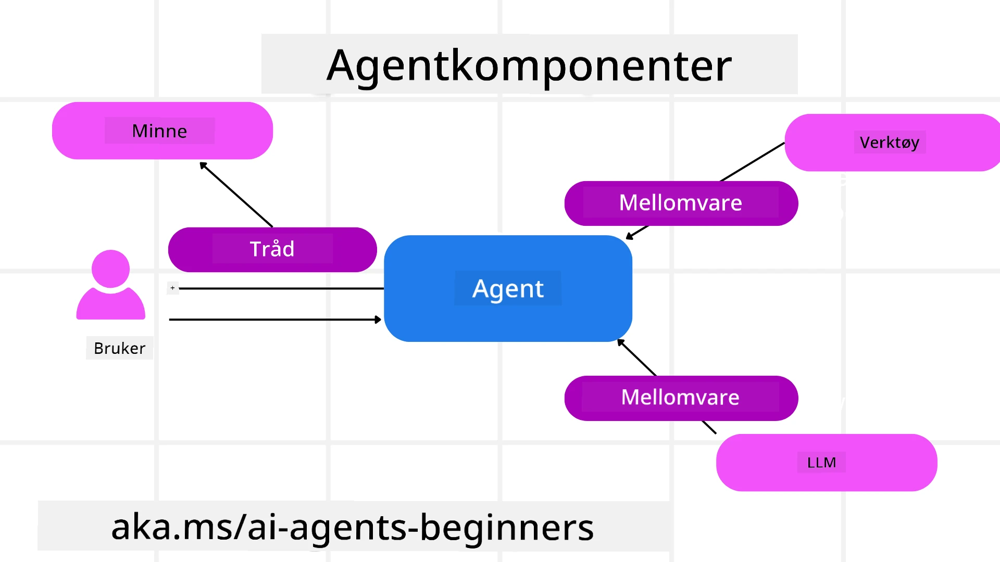

# Utforske Microsoft Agent Framework



### Introduksjon

Denne leksjonen dekker:

- Forstå Microsoft Agent Framework: Nøkkelfunksjoner og verdi  
- Utforske nøkkelbegrepene i Microsoft Agent Framework
- Avanserte MAF-mønstre: Arbeidsflyter, middleware og minne

## Læringsmål

Etter å ha fullført denne leksjonen, vil du vite hvordan du:

- Bygger produksjonsklare AI-agenter ved bruk av Microsoft Agent Framework
- Anvender kjernfunksjonene i Microsoft Agent Framework til dine agentiske bruksområder
- Bruker avanserte mønstre inkludert arbeidsflyter, middleware og observerbarhet

## Kodeeksempler

Kodeeksempler for [Microsoft Agent Framework (MAF)](https://aka.ms/ai-agents-beginners/agent-framework) finnes i dette depotet under filene `xx-python-agent-framework` og `xx-dotnet-agent-framework`.

## Forstå Microsoft Agent Framework



[Microsoft Agent Framework (MAF)](https://aka.ms/ai-agents-beginners/agent-framework) er Microsofts samlede rammeverk for å bygge AI-agenter. Det gir fleksibilitet til å møte det brede spekteret av agentiske bruksområder som sees både i produksjons- og forskningsmiljøer, inkludert:

- **Sekvensiell agentorkestrering** i scenarier hvor steg-for-steg arbeidsflyter er nødvendig.
- **Samtidig orkestrering** i scenarier hvor agenter må fullføre oppgaver samtidig.
- **Gruppechat-orkestrering** i scenarier hvor agenter kan samarbeide om en oppgave.
- **Overleveringsorkestrering** i scenarier hvor agenter overleverer oppgaven til hverandre etter hvert som deloppgavene fullføres.
- **Magnetisk orkestrering** i scenarier hvor en lederagent oppretter og endrer en oppgaveliste og håndterer koordineringen av underagenter for å fullføre oppgaven.

For å levere AI-agenter i produksjon inkluderer MAF også funksjoner for:

- **Observerbarhet** gjennom bruk av OpenTelemetry hvor hver handling av AI-agenten inkludert verktøyanrop, orkestreringstrinn, resonneringsflyter og ytelsesovervåking skjer via Microsoft Foundry dashboards.
- **Sikkerhet** ved å kjøre agenter nativt på Microsoft Foundry som inkluderer sikkerhetskontroller som rollebasert tilgang, håndtering av private data og innebygd innholdssikkerhet.
- **Holdbarhet** ettersom agenttråder og arbeidsflyter kan pause, gjenoppta og gjenopprette fra feil, noe som muliggjør lengre kjørende prosesser.
- **Kontroll** ettersom arbeidsflyter med menneskelig i sløyfen støttes der oppgaver merkes som krever menneskelig godkjenning.

Microsoft Agent Framework fokuserer også på interoperabilitet ved å:

- **Være sky-agnostisk** – Agenter kan kjøre i containere, lokalt og på tvers av flere ulike skyer.
- **Være leverandør-agnostisk** – Agenter kan opprettes gjennom ditt foretrukne SDK inkludert Azure OpenAI og OpenAI
- **Integrere åpne standarder** – Agenter kan benytte protokoller som Agent-to-Agent (A2A) og Model Context Protocol (MCP) for å oppdage og bruke andre agenter og verktøy.
- **Plugins og tilkoblinger** – Tilkoblinger kan lages til data- og minnetjenester som Microsoft Fabric, SharePoint, Pinecone og Qdrant.

La oss se på hvordan disse funksjonene gjelder noen av kjernebegrepene i Microsoft Agent Framework.

## Nøkkelbegreper i Microsoft Agent Framework

### Agenter



**Opprette agenter**

Agentopprettelse gjøres ved å definere inferansetjenesten (LLM-leverandør), et sett med instruksjoner for AI-agenten å følge, og et tildelt `navn`:

```python
agent = AzureOpenAIChatClient(credential=AzureCliCredential()).create_agent( instructions="You are good at recommending trips to customers based on their preferences.", name="TripRecommender" )
```

Ovenfor brukes `Azure OpenAI`, men agenter kan opprettes ved hjelp av ulike tjenester inkludert `Microsoft Foundry Agent Service`:

```python
AzureAIAgentClient(async_credential=credential).create_agent( name="HelperAgent", instructions="You are a helpful assistant." ) as agent
```

OpenAI `Responses`, `ChatCompletion` APIer

```python
agent = OpenAIResponsesClient().create_agent( name="WeatherBot", instructions="You are a helpful weather assistant.", )
```

```python
agent = OpenAIChatClient().create_agent( name="HelpfulAssistant", instructions="You are a helpful assistant.", )
```

eller [MiniMax](https://platform.minimaxi.com/), som tilbyr en OpenAI-kompatibel API med store kontekstvinduer (opp til 204K tokens):

```python
agent = OpenAIChatClient(base_url="https://api.minimax.io/v1", api_key=os.environ["MINIMAX_API_KEY"], model_id="MiniMax-M3").create_agent( name="HelpfulAssistant", instructions="You are a helpful assistant.", )
```

eller eksterne agenter ved bruk av A2A-protokollen:

```python
agent = A2AAgent( name=agent_card.name, description=agent_card.description, agent_card=agent_card, url="https://your-a2a-agent-host" )
```

**Kjøre agenter**

Agenter kjøres med metodene `.run` eller `.run_stream` for enten ikke-strømmende eller strømmende svar.

```python
result = await agent.run("What are good places to visit in Amsterdam?")
print(result.text)
```

```python
async for update in agent.run_stream("What are the good places to visit in Amsterdam?"):
    if update.text:
        print(update.text, end="", flush=True)

```

Hver kjøring av agenten kan også ha opsjoner for å tilpasse parametere som `max_tokens` brukt av agenten, `tools` som agenten kan kalle, og til og med `model` som brukes for agenten.

Dette er nyttig i tilfeller der spesifikke modeller eller verktøy kreves for å fullføre en brukeroppgave.

**Verktøy**

Verktøy kan defineres både når agenten defineres:

```python
def get_attractions( location: Annotated[str, Field(description="The location to get the top tourist attractions for")], ) -> str: """Get the top tourist attractions for a given location.""" return f"The top attractions for {location} are." 


# Når du oppretter en ChatAgent direkte

agent = ChatAgent( chat_client=OpenAIChatClient(), instructions="You are a helpful assistant", tools=[get_attractions]

```

og også når agenten kjøres:

```python

result1 = await agent.run( "What's the best place to visit in Seattle?", tools=[get_attractions] # Verktøy gitt kun for denne kjøringen )
```

**Agenttråder**

Agenttråder brukes til å håndtere flertrinnssamtaler. Tråder kan opprettes enten ved:

- Å bruke `get_new_thread()` som gjør det mulig å lagre tråden over tid
- Opprette en tråd automatisk når agenten kjøres og ha tråden kun i løpet av denne kjøringen.

For å opprette en tråd ser koden slik ut:

```python
# Opprett en ny tråd.
thread = agent.get_new_thread() # Kjør agenten med tråden.
response = await agent.run("Hello, I am here to help you book travel. Where would you like to go?", thread=thread)

```

Du kan deretter serialisere tråden for å lagres til senere bruk:

```python
# Opprett en ny tråd.
thread = agent.get_new_thread() 

# Kjør agenten med tråden.

response = await agent.run("Hello, how are you?", thread=thread) 

# Serialiser tråden for lagring.

serialized_thread = await thread.serialize() 

# Deserialiser trådtilstanden etter innlasting fra lagring.

resumed_thread = await agent.deserialize_thread(serialized_thread)
```

**Agent Middleware**

Agenter interagerer med verktøy og LLMs for å fullføre brukeroppgaver. I visse scenarier ønsker vi å utføre eller spore handlinger mellom disse interaksjonene. Agent-middleware lar oss gjøre dette gjennom:

*Funksjons-Middleware*

Denne middleware gjør det mulig å utføre en handling mellom agenten og en funksjon/et verktøy som den skal kalle. Et eksempel på når dette kan brukes er når du ønsker å logge funksjonsanropet.

I koden nedenfor definerer `next` om neste middleware eller den faktiske funksjonen skal kalles.

```python
async def logging_function_middleware(
    context: FunctionInvocationContext,
    next: Callable[[FunctionInvocationContext], Awaitable[None]],
) -> None:
    """Function middleware that logs function execution."""
    # Forbehandling: Logg før funksjonsutførelse
    print(f"[Function] Calling {context.function.name}")

    # Fortsett til neste mellomvare eller funksjonsutførelse
    await next(context)

    # Etterbehandling: Logg etter funksjonsutførelse
    print(f"[Function] {context.function.name} completed")
```

*Chat Middleware*

Denne middleware gjør det mulig å utføre eller logge en handling mellom agenten og forespørslene til LLM.

Dette inneholder viktig informasjon som `messages` som sendes til AI-tjenesten.

```python
async def logging_chat_middleware(
    context: ChatContext,
    next: Callable[[ChatContext], Awaitable[None]],
) -> None:
    """Chat middleware that logs AI interactions."""
    # Forbehandling: Logg før AI-kall
    print(f"[Chat] Sending {len(context.messages)} messages to AI")

    # Fortsett til neste mellomvare eller AI-tjeneste
    await next(context)

    # Etterbehandling: Logg etter AI-svar
    print("[Chat] AI response received")

```

**Agentminne**

Som dekket i leksjonen `Agentic Memory`, er minne et viktig element for å la agenten operere over ulike kontekster. MAF tilbyr flere forskjellige typer minner:

*Minne i minnet*

Dette er minnet lagret i tråder under applikasjonskjøringen.

```python
# Opprett en ny tråd.
thread = agent.get_new_thread() # Kjør agenten med tråden.
response = await agent.run("Hello, I am here to help you book travel. Where would you like to go?", thread=thread)
```

*Vedvarende meldinger*

Dette minnet brukes ved lagring av samtalehistorikk på tvers av økter. Det defineres ved bruk av `chat_message_store_factory`:

```python
from agent_framework import ChatMessageStore

# Opprett et tilpasset meldingslager
def create_message_store():
    return ChatMessageStore()

agent = ChatAgent(
    chat_client=OpenAIChatClient(),
    instructions="You are a Travel assistant.",
    chat_message_store_factory=create_message_store
)

```

*Dynamisk minne*

Dette minnet legges til konteksten før agenter kjøres. Disse minnene kan lagres i eksterne tjenester som mem0:

```python
from agent_framework.mem0 import Mem0Provider

# Bruker Mem0 for avanserte minnefunksjoner
memory_provider = Mem0Provider(
    api_key="your-mem0-api-key",
    user_id="user_123",
    application_id="my_app"
)

agent = ChatAgent(
    chat_client=OpenAIChatClient(),
    instructions="You are a helpful assistant with memory.",
    context_providers=memory_provider
)

```

**Agentobserverbarhet**

Observerbarhet er viktig for å bygge pålitelige og vedlikeholdbare agentiske systemer. MAF integreres med OpenTelemetry for å tilby sporing og målere for bedre observerbarhet.

```python
from agent_framework.observability import get_tracer, get_meter

tracer = get_tracer()
meter = get_meter()
with tracer.start_as_current_span("my_custom_span"):
    # gjør noe
    pass
counter = meter.create_counter("my_custom_counter")
counter.add(1, {"key": "value"})
```

### Arbeidsflyter

MAF tilbyr arbeidsflyter som er forhåndsdefinerte trinn for å fullføre en oppgave og inkluderer AI-agenter som komponenter i disse trinnene.

Arbeidsflyter består av ulike komponenter som gir bedre kontrollflyt. Arbeidsflyter muliggjør også **multi-agent orkestring** og **checkpointing** for å lagre arbeidsflytstatus.

Kjernekomponentene i en arbeidsflyt er:

**Utøvere**

Utøvere mottar innmeldinger, utfører tildelte oppgaver, og produserer deretter en utdatamelding. Dette beveger arbeidsflyten fremover mot å fullføre den større oppgaven. Utøvere kan være enten AI-agent eller egendefinert logikk.

**Kanter**

Kanters oppgave er å definere flyten av meldinger i en arbeidsflyt. Disse kan være:

*Direkte kanter* – Enkle én-til-én-tilkoblinger mellom utøvere:

```python
from agent_framework import WorkflowBuilder

builder = WorkflowBuilder()
builder.add_edge(source_executor, target_executor)
builder.set_start_executor(source_executor)
workflow = builder.build()
```

*Betingede kanter* – Aktiveres etter at en bestemt betingelse er oppfylt. For eksempel, når hotellrom ikke er tilgjengelige, kan en utøver foreslå andre alternativer.

*Switch-case kanter* – Ruter meldinger til forskjellige utøvere basert på definerte betingelser. For eksempel, hvis en kunde innen reise har prioritert tilgang og oppgavene deres vil håndteres gjennom en annen arbeidsflyt.

*Fan-out kanter* – Sender en melding til flere mål.

*Fan-in kanter* – Samler flere meldinger fra ulike utøvere og sender til ett mål.

**Hendelser**

For å gi bedre observerbarhet i arbeidsflyter, tilbyr MAF innebygde hendelser for utførelse inkludert:

- `WorkflowStartedEvent`  - Arbeidsflytutførelse begynner
- `WorkflowOutputEvent` - Arbeidsflyt produserer en utdata
- `WorkflowErrorEvent` - Arbeidsflyt møter en feil
- `ExecutorInvokeEvent`  - Utøver starter bearbeiding
- `ExecutorCompleteEvent`  -  Utøver fullfører bearbeiding
- `RequestInfoEvent` - En forespørsel er utstedt

## Avanserte MAF-mønstre

Seksjonene over dekker nøkkelkonseptene i Microsoft Agent Framework. Når du bygger mer komplekse agenter, her er noen avanserte mønstre å vurdere:

- **Middleware-sammensetning**: Koble sammen flere middleware-håndterere (logging, autentisering, ratebegrensning) ved å bruke funksjons- og chat-middleware for finjustert kontroll over agentens oppførsel.
- **Arbeidsflytcheckpointing**: Bruk arbeidsflythendelser og serialisering for å lagre og gjenoppta langvarige agentprosesser.
- **Dynamisk verktøyvalg**: Kombiner RAG over verktøybeskrivelser med MAFs verktøyregistrering for å presentere kun relevante verktøy per forespørsel.
- **Multi-agent overlevering**: Bruk arbeidsflytkanter og betinget ruting for å orkestrere overleveringer mellom spesialiserte agenter.

## Kodeeksempler

Kodeeksempler for Microsoft Agent Framework finnes i dette depotet under filene `xx-python-agent-framework` og `xx-dotnet-agent-framework`.

## Har du flere spørsmål om Microsoft Agent Framework?

Bli med i [Microsoft Foundry Discord](https://discord.com/invite/ATgtXmAS5D) for å møte andre lærende, delta på kontortimer og få svar på dine spørsmål om AI-agenter.

---

<!-- CO-OP TRANSLATOR DISCLAIMER START -->
**Ansvarsfraskrivelse**:
Dette dokumentet er oversatt ved hjelp av AI-oversettelsestjenesten [Co-op Translator](https://github.com/Azure/co-op-translator). Selv om vi streber etter nøyaktighet, vær oppmerksom på at automatiske oversettelser kan inneholde feil eller unøyaktigheter. Det opprinnelige dokumentet på originalspråket skal betraktes som den autoritative kilden. For kritisk informasjon anbefales profesjonell menneskelig oversettelse. Vi er ikke ansvarlige for eventuelle misforståelser eller feiltolkninger som oppstår ved bruk av denne oversettelsen.
<!-- CO-OP TRANSLATOR DISCLAIMER END -->