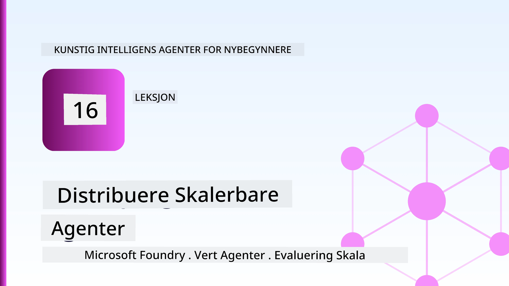
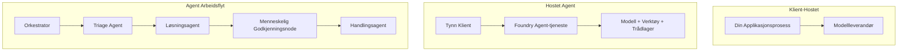
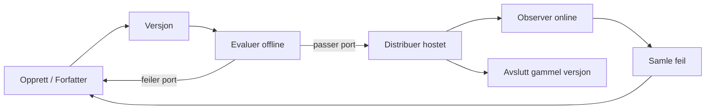
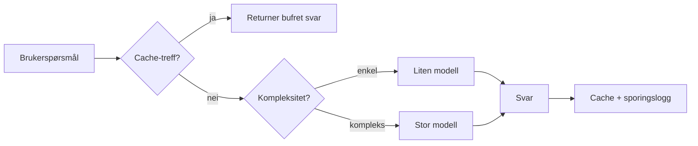
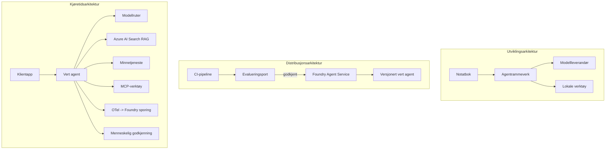

# Distribuere skalerbare agenter med Microsoft Foundry



Frem til nå i kurset har du bygget agenter som kjører på din laptop, inne i en notatbok, styrt av `az login` og noen miljøvariabler. Det er akkurat den riktige måten å lære på. Det er ikke den riktige måten å kjøre en agent som tusenvis av kunder er avhengige av kl. 3 om natten.

Denne leksjonen handler om gapet mellom "det fungerer på min maskin" og "det fungerer, pålitelig og rimelig, i produksjon." Vi lukker det gapet ved å bruke **Microsoft Foundry** og **Microsoft Foundry Agent Service**, og vi gjør det ved å bygge en ekte kundestøtteagent som har verktøy, innhenting, minne, evaluering og overvåking.

## Introduksjon

Denne leksjonen vil dekke:

- Forskjellen mellom en **prototypeagent** og en **distribuert agent**, og hvorfor overgangen hovedsakelig handler om alt *rundt* modellen.
- **Distribusjonsmønstre** for agenter: klient-hostede, tjeneste-hostede (Hosted Agents), og arbeidsflyt-orchestrert.
- **Agentens livssyklus** på Microsoft Foundry — opprette, versjonere, distribuere, evaluere, observere, pensjonere.
- **Skaleringsstrategier**: modellruting, caching, samtidighet og stateless design.
- **Observerbarhet** med OpenTelemetry og Foundry-sporing.
- **Kostnadsoptimalisering** gjennom modellvalg, ruting og evalueringsporter.
- **Enterprise-hensyn**: styring, menneskelig godkjenning, og trygg kjøring av MCP-servere i produksjon.

## Læringsmål

Etter å ha fullført denne leksjonen vil du vite hvordan du:

- Velger riktig distribusjonsmønster for en gitt agent arbeidsmengde.
- Distribuerer en agent til Microsoft Foundry Agent Service slik at den er versjonert, styrt og observerbar.
- Instrumenterer en agent for sporing og kobler til en evalueringspipeline som kjører før hver utgivelse.
- Anvender modellruting og caching for å holde latens og kostnad under kontroll i stor skala.
- Legger til en menneskelig godkjenningsport for høy-risiko handlinger og integrerer en MCP-server på en produksjonssikker måte.

## Forutsetninger

Denne leksjonen forutsetter at du har fullført de tidligere leksjonene og er komfortabel med:

- Å bygge agenter med [Microsoft Agent Framework](../14-microsoft-agent-framework/README.md) (Leksjon 14).
- [Verktøybruk](../04-tool-use/README.md) (Leksjon 4) og [Agentic RAG](../05-agentic-rag/README.md) (Leksjon 5).
- [Agentminne](../13-agent-memory/README.md) (Leksjon 13) og [Agentic Protocols / MCP](../11-agentic-protocols/README.md) (Leksjon 11).
- [Observerbarhet og evaluering](../10-ai-agents-production/README.md) (Leksjon 10) — denne leksjonen bygger direkte på den.

Du vil også trenge:

- Et **Azure-abonnement** og et **Microsoft Foundry-prosjekt** med minst én distribuert chatmodell.
- **Azure CLI** autentisert (`az login`).
- Python 3.12+ og pakkene i depotets [`requirements.txt`](../../../requirements.txt).

## Fra prototype til produksjon: Hva faktisk endres

En prototypeagent og en produksjonsagent deler samme kjerne-løkke — resonnere, kalle verktøy, respondere. Det som endres er alt som omgir den løkken. Modellen utgjør kanskje 20 % av en produksjonsagent; de andre 80 % er den operative skjelettstrukturen.

| Bekymring | Prototype | Produksjon |
| --- | --- | --- |
| **Hosting** | Kjører i notatboken din | Kjører som en hostet tjeneste, versjonert og utrullet |
| **Identitet** | Din `az login` token | Administrert identitet med avgrenset RBAC |
| **Tilstand** | I minnet, går tapt ved omstart | Eksternalisert (thread store, minnetjeneste) |
| **Feil** | Du ser tracebacken | Forsøk på nytt, fallback, dødliste, varsler |
| **Kostnad** | "Det koster noen cent" | Sporet per forespørsel, rutet, cachet, budsjettert |
| **Kvalitet** | Du vurderer output visuelt | Evaluert automatisk før hver utgivelse |
| **Tillitt** | Du godkjenner hver handling | Policy + menneske-i-løkken for risikable handlinger |

Ha dette tabellen i tankene. Hver seksjon nedenfor samsvarer med én av disse radene.

## Agent Distribusjonsmønstre

Det finnes tre mønstre du vil bruke, ofte i kombinasjon.

### 1. Klient-hostede agenter

Agentobjektet lever inne i *din* applikasjonsprosess. Koden din kaller modellleverandøren direkte; resonnementsløkken kjører i tjenesten din. Dette er hva alle tidligere leksjoner har gjort.

- **Bruk det når** du trenger full kontroll over løkken, egendefinert mellomvare, eller du integrerer agenten i et eksisterende backend.
- **Avveining**: du eier selv skalering, tilstand og robusthet.

### 2. Hostede agenter (Foundry Agent Service)

Agenten *registreres som en ressurs* i Microsoft Foundry. Foundry hoster resonnementsløkken, lagrer tråder, håndhever innholdssikkerhet og RBAC, og gjør agenten synlig i Foundry-portalen. Appen din blir en tynn klient som oppretter tråder og leser svar.

- **Bruk det når** du ønsker holdbarhet, innebygd observerbarhet, styring og mindre operasjonelt overflateareal.
- **Avveining**: mindre lavnivåkontroll i bytte for en administrert runtime.

### 3. Agent arbeidsflyter

Flere agenter (og verktøy) komponeres til en graf med eksplisitt kontrollflyt — sekvensielle steg, forgreninger, menneskelig godkjenningspunkter, og holdbare kontrollpunkter som kan pause og gjenoppta. Dette er Microsoft Agent Frameworks **Workflows**-funksjon anvendt på distribusjonsskala.

- **Bruk det når** en enkelt oppgave spenner over flere spesialiserte agenter eller krever et godkjenningssteg underveis.
- **Avveining**: flere bevegelige deler; trenger observerbarhet på orkestreringsnivå.



## Agentens livssyklus på Microsoft Foundry

Å distribuere en agent er ikke et engangskick av `push`. Det er en løkke, og det ligner mye på en programvareutgivelsessyklus fordi det er akkurat det det er.



Hovedideen, hentet fra [Leksjon 10](../10-ai-agents-production/README.md): **offline evaluering er en port, ikke en ettertanke.** En ny agentversjon leveres ikke med mindre den klarer dine evalueringsgrenseverdier. Online observerbarhet fôrer deretter virkelige feil tilbake i ditt offline testsett. Det er hele løkken.

## Skaleringsstrategier

Å skalere en agent er annerledes enn å skalere en stateless web-API, fordi hver forespørsel kan utløse flere kostbare modell- og verktøykall. Fire teknikker bærer hoveddelen av lasten.

**Stateless forespørselshåndtering.** Ikke behold noen per-brukertilstand i prosessminnet ditt. Persistér samtaletråder i Foundrys trådlagring eller en minnetjeneste slik at hvilken som helst instans kan håndtere hvilken som helst forespørsel. Dette lar deg skalere horisontalt — legg til instanser, ingen sticky sessioner.

**Modellruting.** Ikke alle forespørsler trenger din mest kapable (og dyreste) modell. Ruter enkle forespørsler — intensjonsklassifisering, korte faktuelle svar — til en liten, rask modell, og reserver den store modellen til genuint resonnement. Foundrys **Model Router** kan gjøre dette for deg, eller du kan implementere en lettvektsklassifisierer selv. Du vil bygge DIY-versjonen i laben.

**Responscache.** Mange støttehenvendelser er nesten-duplikater ("hvordan nullstiller jeg passordet mitt?"). Cache svar på vanlige spørsmål og server dem uten å kontakte modellen i det hele tatt. Selv en beskjeden cache-hit-rate kutter kostnad og latens betydelig.

**Samtidighet og tilbakestrømning.** Modellleverandører har hastighetsbegrensninger. Begrens din samtidighet, bruk forsøk på nytt med eksponentiell tilbakekobling, og feile grasiøst (et køet "vi jobber med det" svar slår en 500-feil).



## Observerbarhet i produksjon

Du kan ikke drive det du ikke kan se. Som dekket i Leksjon 10, emitterer Microsoft Agent Framework **OpenTelemetry**-spor nativt — hvert modellkall, verktøy-innkalling og orkestreringstrinn blir til en span. I produksjon eksporterer du disse span til Microsoft Foundry (eller en hvilken som helst OTel-kompatibel backend) slik at du kan:

- Spore en enkelt kundeklage ende-til-ende over hvert modell- og verktøykall.
- Overvåke p50/p95 latens og kostnad per forespørsel over tid.
- Varsle om feilrate-topper og kostnadsavvik før brukerne (eller økonomiteamet ditt) merker det.

```python
from agent_framework.observability import get_tracer

tracer = get_tracer()

with tracer.start_as_current_span("support_request") as span:
    span.set_attribute("customer.tier", "enterprise")
    span.set_attribute("routed.model", "gpt-5-nano")
    # agentutførelse spores automatisk inne i dette intervallet
```

Attributter som `customer.tier` og `routed.model` er det som forvandler en vegg av spor til besvarbare spørsmål ("blir bedriftskunder rutet til den lille modellen for ofte?").

## Kostnadsoptimalisering

Kostnad i produksjonsagenter domineres av tokens. Tre spaker, i rekkefølge etter effekt:

1. **Riktig størrelse på modellen.** En liten modell som passerer din evalueringsport er nesten alltid billigere enn en stor som også passerer. Bruk evaluering til å *bevise* at den lille modellen er god nok i stedet for å default til den største ut av forsiktighet.
2. **Rut etter kompleksitet.** Som ovenfor — betal store-modell-priser bare for forespørsler som trenger store-modell resonnement.
3. **Cache aggressivt.** Det billigste modellkallet er det du aldri gjør.

Evalueringsporter og kostnadskontroll er den samme disiplinen sett fra to vinkler: evalueringen forteller deg *kvalitetsgulvet*, ruting og caching holder deg så nær gulvets *kostnad* som mulig.

## Enterprise-distribusjonshensyn

**Styring.** Hosted Agents arver Foundrys RBAC, innholdssikkerhet og revisjonslogging. Gi hver agent en administrert identitet med laveste privilegium den trenger — lesetilgang til kunnskapsbasen, avgrenset tilgang til ticketing-API-en, ikke mer.

**Menneskelig godkjenning i løkken.** Noen handlinger er for alvorlige til å automatiseres direkte — utbetale refusjon, slette en konto, eskalere til juridisk team. Microsoft Agent Framework støtter **verktøy som krever godkjenning**: agenten foreslår handlingen, utførelse pauser, et menneske godkjenner eller avslår, og arbeidsflyten gjenopptas. Du så primitivet i [Leksjon 6](../06-building-trustworthy-agents/README.md); her distribuerer du det.

**MCP i produksjon.** [MCP](../11-agentic-protocols/README.md) lar agenten din bruke eksterne verktøy gjennom et standard grensesnitt. I produksjon bør hver MCP-server behandles som en uantrustet grense: lås serverversjonen, kjør den med en avgrenset identitet, valider utdataene, og eksponer aldri hemmeligheter for den. En MCP-server er en avhengighet, og avhengigheter blir patchet, revidert og hastighetsbegrenset.



De tre diagrammene — utvikling, distribusjon, kjøretid — er den samme agenten i tre faser av livet. Laben som følger tar deg gjennom å bygge den.

## Praktisk lab: En produksjonsklar kundestøtteagent

Åpne [`code_samples/16-python-agent-framework.ipynb`](./code_samples/16-python-agent-framework.ipynb) og arbeid deg gjennom den fra start til slutt. Du vil sette sammen en **Contoso kundestøtteagent** med alle produksjonsbekymringer koblet inn:

1. **Verktøykall** — slå opp ordrestatus og åpne supporthenvendelser.
2. **RAG** — svar på policyspørsmål fra en kunnskapsbase (Azure AI Search, med en minnebasert fallback så notatboken kjører uten en Search-ressurs).
3. **Minne** — husk kunden over samtalens runder.
4. **Modellruting** — en kompleksitetsklassifisør ruter hver forespørsel til en liten eller stor modell.
5. **Responscache** — gjentatte spørsmål serveres fra cache.
6. **Menneskelig godkjenning** — refusjoner over en terskel pauser for menneskelig sign-off.
7. **Evalueringspipeline** — et lite offline testsett gir agenten poengsum og fungerer som en utgivelsesport.
8. **Observerbarhet** — OpenTelemetry-sporing rundt hver forespørsel.

### Gjennomgang

Notatboken er organisert slik at hver produksjonsbekymring er en selvstendig, kjørbar seksjon. Kjernen er request-handleren med ruting pluss caching:

```python
async def handle_support_request(query: str, customer_id: str) -> str:
    # 1. Server fra cache når vi kan.
    cached = response_cache.get(normalize(query))
    if cached:
        return cached

    # 2. Ruter etter kompleksitet for å kontrollere kostnad.
    model = "gpt-5-nano" if is_simple(query) else "gpt-5-mini"

    # 3. Kjør agenten inne i en sporingsspan for observasjon.
    with tracer.start_as_current_span("support_request") as span:
        span.set_attribute("routed.model", model)
        span.set_attribute("customer.id", customer_id)
        response = await support_agent.run(query, model=model)

    # 4. Cache og returner.
    response_cache.set(normalize(query), response.text)
    return response.text
```

Evalueringsporten som vokter en utgivelse ser slik ut:

```python
async def evaluation_gate(agent, test_cases, threshold: float = 0.8) -> bool:
    passed = 0
    for case in test_cases:
        result = await agent.run(case["input"])
        if score_response(result.text, case["expected"]) >= 0.8:
            passed += 1
    pass_rate = passed / len(test_cases)
    print(f"Evaluation pass rate: {pass_rate:.0%} (gate: {threshold:.0%})")
    return pass_rate >= threshold  # distribuer bare hvis porten godkjennes
```

Les hvert linje – notatboken holder primitivene bevisst små så ingenting er skjult bak et rammeverkskall.

## Validere en distribuert agent med røyktester

Evalueringsporten ovenfor kjører *offline* mot agentobjektet ditt. Når agenten er distribuert som en Hosted Agent, trenger du en sjekk til, enda billigere: **svarer egentlig det distribuerte endepunktet?**

Å distribuere "suksessfullt" beviser bare at kontrollplanet aksepterte definisjonen — det beviser ikke at agenten svarer. En manglende avhengighet, feil modellruting, eller en utløpt forbindelse kan gi en grønn distribusjon som ikke returnerer noe. En **røyktest** fanger det på sekunder, ved hver deploy, uten kostnaden av full evaluering.

Dette depotet leverer en klar-til-bruk røyktest-pipeline bygd på [AI Smoke Test](https://github.com/marketplace/actions/ai-smoke-test) GitHub Action:

- **Katalog** — [`tests/lesson-16-smoke-tests.json`](../../../tests/lesson-16-smoke-tests.json) inneholder prompt og påstander for Contoso supportagenten (grunnfestede policy-svar, en ordreoppslag, holde seg på tema, og kontinuitet i fler-runde tråder). Kataloger for andre leksjoners agenter finnes ved siden av — se [`tests/README.md`](../tests/README.md).
- **Arbeidsflyt** — [`.github/workflows/smoke-test.yml`](../../../.github/workflows/smoke-test.yml) logger inn med Azure OIDC og POSTer hver prompt til agentens Responses-endepunkt, feiler jobben på enhver påstand som ikke oppfylles.

```yaml
- name: Smoke-test hosted agent
  uses: JFolberth/ai-smoketest@v1
  with:
    project_endpoint: ${{ inputs.project_endpoint }}
    agent_name: ContosoSupportAgent
    tests_file: tests/lesson-16-smoke-tests.json
```


Kjør den fra **Actions**-fanen når agenten din er distribuert, og oppgi Foundry-prosjektendepunktet og agentnavnet ditt. Den fødererte identiteten trenger **Azure AI User**-rollen på Foundry-prosjektets omfang. Tenk på lagene som en pyramide: røyktester (tilgjengelig og svarer?) kjøres ved hver distribusjon, offline evaluering (godt nok til å sende ut?) kjøres før promotering, og online evaluering (hvordan går det i praksis?) kjøres kontinuerlig.

## Kunnskapssjekk

Test forståelsen din før du går videre til oppgaven.

**1. Omtrent hvor mye av en produksjonsagent er "modellen," og hva utgjør resten?**

<details>
<summary>Svar</summary>

Modellen utgjør en minoritet av systemet — ofte sitert til rundt 20%. Resten er det operative skjelettet: hosting og versjonshåndtering, identitet og RBAC, ekstern tilstand, feilhåndtering, kostnadssporing, evaluering og menneskelig kontroll i løkken. Overgangen til produksjon handler mest om å bygge alt *rundt* resonneringsløkken.
</details>

**2. Når vil du velge en Hosted Agent fremfor en klienthostet agent?**

<details>
<summary>Svar</summary>

Når du ønsker et administrert kjøretidsmiljø med innebygd holdbarhet (tråder som vedvarer og kan gjenopptas), observabilitet, innholdsikkerhet og RBAC, og du er villig til å bytte noe lavnivåkontroll av resonneringsløkken for mindre operasjonelt overflateareal. Klienthostet er å foretrekke når du trenger full kontroll over løkken eller innebygger agenten i en eksisterende backend.
</details>

**3. Hvorfor må en skalerbar agent være tilstandsløs i sin egen prosessminne?**

<details>
<summary>Svar</summary>

Slik at hvilken som helst instans kan håndtere en hvilken som helst forespørsel, noe som tillater horisontal skalering uten sticky sessions. Per-bruker samtaletilstand er eksternalisert til en trådlagring eller minnetjeneste. Hvis tilstanden levde i prosessminnet, ville du mistet den ved omstart og kunne ikke fritt distribuere belastningen.
</details>

**4. Hvilket problem løser modellruting, og hvordan relaterer det seg til evaluering?**

<details>
<summary>Svar</summary>

Rutingen sender enkle forespørsler til en liten, billig, rask modell og reserverer den store modellen for ekte resonnering, og kontrollerer både latenstid og kostnad. Det relaterer til evaluering fordi evaluering er hva som *beviser* at den lille modellen er god nok for en klasse av forespørsler — ruting uten evaluering er gjetning.
</details>

**5. Hva er en "evalueringport" og hvor befinner den seg i livssyklusen?**

<details>
<summary>Svar</summary>

En evalueringport kjører et offline testsett mot en ny agentversjon og blokkerer distribusjon med mindre bestått-prosenten passerer en terskel. Den ligger mellom "versjon" og "distribusjon" i livssyklusen, og gjør kvalitet til en forutsetning for utgivelse i stedet for noe du sjekker etter levering.
</details>

**6. Hvorfor bør en MCP-server behandles som en utrygg grense i produksjon?**

<details>
<summary>Svar</summary>

Fordi det er en ekstern avhengighet som agenten din kaller inn i. Du bør fikse versjonen dens, kjøre den med en avgrenset identitet, validere utdataene, begrense frekvensen, og aldri eksponere hemmeligheter for den — samme disiplin som du bruker på enhver tredjepartsavhengighet. Dens utdata flyter inn i agentens resonnement, så uvalidert tillit er en sikkerhetsrisiko.
</details>

**7. Hvilken enkelt endring har vanligvis størst innvirkning på produksjonsagentens kostnad, og hvorfor?**

<details>
<summary>Svar</summary>

Riktig dimensjonering av modellen — bruke den minste modellen som fortsatt passerer evalueringporten. Kostnaden domineres av tokens, og en mindre modell som klarer kvalitetsgrensen er nesten alltid billigere enn en større. Caching og ruting reduserer deretter kostnaden ytterligere, men valg av riktig basismodell har størst førsteordenseffekt.
</details>

**8. Hvilken rolle spiller span-attributter som `customer.tier` og `routed.model` i observabilitet?**

<details>
<summary>Svar</summary>

De gjør rå spor til spørsmål med svar innenfor forretningsdrift. Uten attributter har du en vegg av spans; med dem kan du spørre "blir bedriftskunder rutet til den lille modellen for ofte?" eller "hvilken modell håndterer våre tregeste forespørsler?" Attributter er hvordan du skjærer telemetri etter dimensjoner som betyr noe for driften din.
</details>

## Oppgave

Ta kundesupportagenten fra laboratoriet og forsterk den for et spesifikt scenario: **en abonnementsfaktureringsagent for et SaaS-selskap.**

Innsendingen din skal:

1. **Bytte ut verktøyene** med faktureringsrelevante: `get_subscription_status`, `get_invoice`, og `issue_credit` (kreditter over $50 krever menneskelig godkjenning).
2. **Legge til tre RAG-dokumenter** som dekker selskapets refusjonspolicy, faktureringssyklus og kanselleringspolicy.
3. **Utvid evalueringen** til minst åtte tilfeller, inkludert minst to som *skal* utløse den menneskelige godkjenningsveien, og bekrefte at evalueringporten din korrekt passerer eller feiler.
4. **Legg til én kostnadsrapport**: etter å ha kjørt ti blandede forespørsler gjennom agenten, skriv ut hvor mange som gikk til den lille modellen, hvor mange til den store modellen, og hvor mange som ble servert fra cache.

Skriv et kort avsnitt (i en markdown-celle) som forklarer hvilken modellrutingsregel du valgte og hvordan du ville validere den med ekte trafikk. Det finnes ikke ett riktig svar — du vurderes ut fra om produksjonsbekymringene er sammenkoblet på en sammenhengende måte.

## Sammendrag

I denne leksjonen flyttet du en agent fra prototype til produksjon med Microsoft Foundry:

- Overgangen til produksjon handler mest om **det operative skjelettet** rundt modellen — hosting, identitet, tilstand, feilhåndtering, kostnad, kvalitet og tillit.
- Du lærte de tre **distribusjonsmønstrene** — klienthostet, Hosted Agents og Agent Workflows — og når hver passer.
- Du gikk gjennom **agentens livssyklus**, hvor offline **evaluering fungerer som en utgivelsesport** og online observabilitet mater feil tilbake til testsettet.
- Du brukte **skaleringstrategier** — tilstandsløs design, modellruting, caching og avgrenset samtidighet — og koblet dem til **kostnadsoptimalisering**.
- Du la inn **bedriftskontroller**: RBAC, menneskelig godkjenning i løkken og produksjonssikker MCP-integrasjon.
- Du bygde en **produksjonsklar kundesupportagent** som binder alle disse bekymringene sammen i kjørbar kode.

Neste leksjon tar motsatt reise: i stedet for å skalere agenter opp i skyen, vil du ta dem *ned* på en enkelt utviklermaskin og kjøre dem helt lokalt.

## Ytterligere ressurser

- <a href="https://learn.microsoft.com/azure/ai-foundry/what-is-azure-ai-foundry" target="_blank">Microsoft Foundry dokumentasjon</a>
- <a href="https://learn.microsoft.com/azure/ai-foundry/agents/overview" target="_blank">Microsoft Foundry Agent Service oversikt</a>
- <a href="https://learn.microsoft.com/en-us/agent-framework/overview/?wt.mc_id=youtube_26688_organicsocial_reactor&pivots=programming-language-python" target="_blank">Microsoft Agent Framework</a>
- <a href="https://learn.microsoft.com/azure/ai-foundry/concepts/model-router" target="_blank">Model Router i Microsoft Foundry</a>
- <a href="https://learn.microsoft.com/azure/search/search-what-is-azure-search" target="_blank">Azure AI Search</a>
- <a href="https://opentelemetry.io/" target="_blank">OpenTelemetry</a>
- <a href="https://github.com/marketplace/actions/ai-smoke-test" target="_blank">AI Smoke Test GitHub Action</a>
- <a href="https://modelcontextprotocol.io/" target="_blank">Model Context Protocol (MCP)</a>

## Forrige leksjon

[Building Computer Use Agents (CUA)](../15-browser-use/README.md)

## Neste leksjon

[Oppretting av lokale AI-agenter](../17-creating-local-ai-agents/README.md)

---

<!-- CO-OP TRANSLATOR DISCLAIMER START -->
**Ansvarsfraskrivelse**:
Dette dokumentet er oversatt ved hjelp av AI-oversettelsestjenesten [Co-op Translator](https://github.com/Azure/co-op-translator). Selv om vi streber etter nøyaktighet, vær oppmerksom på at automatiske oversettelser kan inneholde feil eller unøyaktigheter. Det opprinnelige dokumentet på originalspråket skal betraktes som den autoritative kilden. For kritisk informasjon anbefales profesjonell menneskelig oversettelse. Vi er ikke ansvarlige for eventuelle misforståelser eller feiltolkninger som oppstår ved bruk av denne oversettelsen.
<!-- CO-OP TRANSLATOR DISCLAIMER END -->