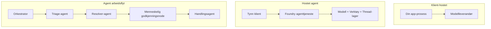
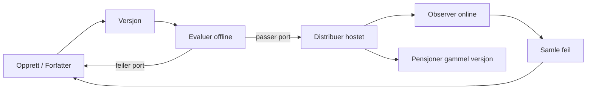
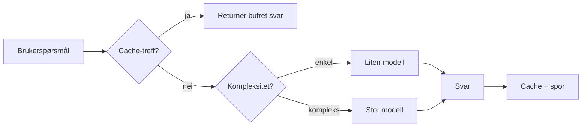
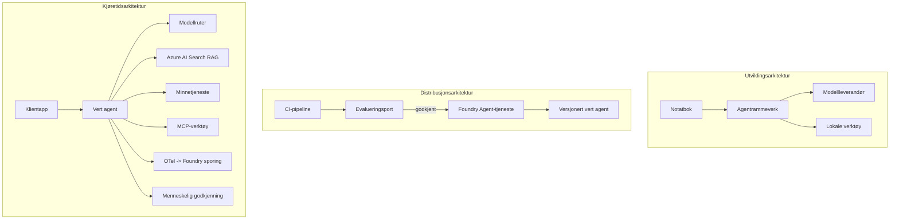

# Distribuere Skalerbare Agenter med Microsoft Foundry


Frem til nå i kurset har du bygget agenter som kjører på din bærbare PC, inne i en notatbok, drevet av `az login` og noen miljøvariabler. Det er akkurat den riktige måten å lære på. Det er ikke riktig måte å kjøre en agent som tusenvis av kunder er avhengige av kl. 3 på natten.

Denne leksjonen handler om gapet mellom "det fungerer på min maskin" og "det fungerer, pålitelig og rimelig, i produksjon." Vi lukker det gapet ved å bruke **Microsoft Foundry** og **Microsoft Foundry Agent Service**, og vi gjør det ved å bygge en ekte kundestøtteagent som har verktøy, gjenfinning, minne, evaluering og overvåking.

## Introduksjon

Denne leksjonen vil dekke:

- Forskjellen mellom en **prototype-agent** og en **distribuert agent**, og hvorfor overgangen hovedsakelig handler om alt *rundt* modellen.
- **Distribusjonsmønstre** for agenter: klient-vert, tjeneste-vert (Hosted Agents), og arbeidsflyt-orientert.
- **Agentens livssyklus** på Microsoft Foundry — opprette, versjonere, distribuere, evaluere, observere, trekke tilbake.
- **Skaleringsstrategier**: modellruting, caching, samtidighet og tilstandsfrid design.
- **Observabilitet** med OpenTelemetry og Foundry-tracing.
- **Kostnadsoptimalisering** gjennom modellvalg, ruting og evalueringsporter.
- **Virksomhetsoverveielser**: styring, menneskelig godkjenning, og trygg kjøring av MCP-servere i produksjon.

## Læringsmål

Etter å ha fullført denne leksjonen, vil du vite hvordan du:

- Velger riktig distribusjonsmønster for en gitt agentbelastning.
- Distribuerer en agent til Microsoft Foundry Agent Service slik at den blir versjonert, styrt og observerbar.
- Instrumenterer en agent for tracing og kobler til en evalueringspipeline som kjører før hver utgivelse.
- Anvender modellruting og caching for å holde latenstid og kostnad under kontroll i stor skala.
- Legger til et menneskelig godkjenningspunkt for høyrisiko handlinger og integrerer en MCP-server på en produksjonssikker måte.

## Forutsetninger

Denne leksjonen forutsetter at du har fullført de tidligere leksjonene og er komfortabel med:

- Å bygge agenter med [Microsoft Agent Framework](../14-microsoft-agent-framework/README.md) (Leksjon 14).
- [Verktøybruk](../04-tool-use/README.md) (Leksjon 4) og [Agentic RAG](../05-agentic-rag/README.md) (Leksjon 5).
- [Agentminne](../13-agent-memory/README.md) (Leksjon 13) og [Agentic Protocols / MCP](../11-agentic-protocols/README.md) (Leksjon 11).
- [Observabilitet og Evaluering](../10-ai-agents-production/README.md) (Leksjon 10) — denne leksjonen bygger direkte på den.

Du vil også trenge:

- Et **Azure-abonnement** og et **Microsoft Foundry-prosjekt** med minst én distribuert chatmodell.
- Autentisert **Azure CLI** (`az login`).
- Python 3.12+ og pakkene i depotet [`requirements.txt`](../../../requirements.txt).

## Fra prototype til produksjon: hva som faktisk endrer seg

En prototype-agent og en produksjonsagent deler samme kjerne-løkke — resonnere, kalle verktøy, respondere. Det som endrer seg er alt som omslutter denne løkka. Modellen utgjør kanskje 20 % av en produksjonsagent; de resterende 80 % er den operative skjelettet.

| Bekymring | Prototype | Produksjon |
| --- | --- | --- |
| **Hosting** | Kjører i din notatbok | Kjører som en vert tjeneste, versjonert og rullet ut |
| **Identitet** | Din `az login` token | Administrert identitet med scoped RBAC |
| **Status** | I minnet, mistes ved omstart | Eksternalisert (trådlagring, minnetjeneste) |
| **Feil** | Du ser tracebacken | Forsøk på nytt, fallback, dead-letter, varsler |
| **Kostnad** | "Det koster noen få cent" | Sporet per forespørsel, rutet, cachet, budsjettert |
| **Kvalitet** | Du vurderer output med øyet | Evaluert automatisk før hver utgivelse |
| **Tillitt** | Du godkjenner hver handling | Policy + menneske-i-løkka for risikofylte handlinger |

Husk denne tabellen. Hver seksjon nedenfor tilsvarer en av disse radene.

## Agent Distribusjonsmønstre

Det finnes tre mønstre du vil bruke, ofte i kombinasjon.

### 1. Klient-Vert Agenter

Agentobjektet lever inne i *din* applikasjonsprosess. Koden din kaller modell-leverandøren direkte; resonnementsløkka kjører i tjenesten din. Dette er det hver tidligere leksjon har gjort.

- **Bruk det når** du trenger full kontroll over løkka, egendefinert mellomvare, eller du integrerer agenten inne i en eksisterende backend.
- **Avveining**: du eier skalering, tilstand og robusthet selv.

### 2. Vertede Agenter (Foundry Agent Service)

Agenten er *registrert som en ressurs* i Microsoft Foundry. Foundry hoster resonnementsløkka, lagrer tråder, håndhever innholdsikkerhet og RBAC, og gjør agenten synlig i Foundry-portalen. Appen din blir en tynn klient som oppretter tråder og leser svar.

- **Bruk det når** du ønsker varighet, innebygd observabilitet, styring, og mindre operasjonell overflate.
- **Avveining**: mindre lavnivåkontroll i bytte for en administrert runtime.

### 3. Agent Arbeidsflyter

Flere agenter (og verktøy) settes sammen til en graf med eksplisitt kontrollflyt — sekvensielle steg, forgreninger, menneskelig godkjenningsnoder og varige sjekkpunkter som kan pause og gjenoppta. Dette er Microsoft Agent Frameworks **Workflows**-funksjonalitet anvendt på distribusjonsskala.

- **Bruk det når** en enkelt oppgave strekker seg over flere spesialiserte agenter eller krever et godkjenningssteg midt i prosessen.
- **Avveining**: flere bevegelige deler; krever observabilitet på orkestreringsnivå.



## Agentens livssyklus på Microsoft Foundry

Å distribuere en agent er ikke et engangs-`push`. Det er en løkke, og det ligner mye på en programvareutgivelsessyklus fordi det er akkurat det det er.



Hovedideen, tatt med fra [Leksjon 10](../10-ai-agents-production/README.md): **offline evaluering er en port, ikke en ettertanke.** En ny agentversjon sendes ikke ut med mindre den oppfyller dine evalueringsgrenser. Online observabilitet mater deretter tilbake reelle feil i din offline testsett. Det er hele løkka.

## Skaleringsstrategier

Å skalere en agent er annerledes enn å skalere en tilstandsfrie web-API, fordi hver forespørsel kan utløse flere kostbare modell- og verktøysanrop. Fire teknikker bærer mesteparten av belastningen.

**Tilstandsfrie forespørsler.** Ikke behold noen per-bruker tilstand i prosessminnet ditt. Vedvar samtaletråder i Foundrys trådlagring eller en minnetjeneste så enhver instans kan håndtere enhver forespørsel. Dette lar deg skalere horisontalt — legg til instanser, uten klissete økter.

**Modellruting.** Ikke alle forespørsler trenger din mest kapable (og dyreste) modell. Ruter enkle forespørsler — intensjonsklassifisering, korte faktuelle svar — til en liten, rask modell, og reserver den store modellen til ekte resonnering. Foundrys **Model Router** kan gjøre dette for deg, eller du kan implementere en lettvint klassifiserer selv. Du vil bygge DIY-versjonen i labben.

**Respons-caching.** Mange supportsøk er nesten-duplikater ("hvordan tilbakestiller jeg passordet mitt?"). Cache svar på vanlige spørsmål og server dem uten å treffe modellen i det hele tatt. Selv en moderat cache-treffrate kutter kostnad og latenstid betydelig.

**Samtidighet og tilbakestrøm.** Modell-leverandører har grenseverdier. Begrens samtidigheten din, bruk forsøk på nytt med eksponentiell backoff, og feil grasiøst (et køet "vi jobber med det"-svar slår en 500).



## Observabilitet i produksjon

Du kan ikke drifte det du ikke kan se. Som dekket i Leksjon 10, avgir Microsoft Agent Framework **OpenTelemetry** traces nativer — hvert modellkall, verktøyutløsning, og orkestreringssteg blir et span. I produksjon eksporterer du disse spanene til Microsoft Foundry (eller en hvilken som helst OTel-kompatibel backend) slik at du kan:

- Spore en enkelt kundeklager end-to-end på tvers av hvert modell- og verktøyskall.
- Overvåke p50/p95 latenstid og kostnad per forespørsel over tid.
- Varsle ved feilratestigning og kostnadsavvik før brukerne dine (eller økonomiteamet) merker det.

```python
from agent_framework.observability import get_tracer

tracer = get_tracer()

with tracer.start_as_current_span("support_request") as span:
    span.set_attribute("customer.tier", "enterprise")
    span.set_attribute("routed.model", "gpt-5-nano")
    # agentutførelse spores automatisk inne i dette området
```

Attributter som `customer.tier` og `routed.model` er det som forvandler en vegg av sporingsdata til svarbare spørsmål ("blir bedriftskunder rutet til den lille modellen for ofte?").

## Kostnadsoptimalisering

Kostnad i produksjonsagenter domineres av tokens. Tre spaker, i rekkefølge av effekt:

1. **Riktig størrelse på modellen.** En liten modell som passerer din evalueringsport er nesten alltid billigere enn en stor som også passerer. Bruk evaluering for å *bevise* at den lille modellen er god nok i stedet for å standardisere på den største modellen av forsiktighet.
2. **Rut etter kompleksitet.** Som ovenfor — betal stor-modell-priser bare for forespørsler som trenger stor-modell-resonnering.
3. **Cache aggressivt.** Det billigste modellkallet er det du aldri gjør.

Evalueringsporter og kostnadskontroll er de samme disipliner sett fra to vinkler: evaluering forteller deg *kvalitetsgulvet*, ruting og caching holder deg så nær gulvets *kostnad* som mulig.

## Virksomhetsdistribusjonsbetraktninger

**Styring.** Vertede agenter arver Foundrys RBAC, innholdssikkerhet og revisjonslogging. Gi hver agent en administrert identitet med minst nødvendig privilegium — lese-tilgang til kunnskapsbasen, scoped tilgang til tickets-API, ikke mer.

**Menneske-i-løkka.** Noen handlinger er for konsekvensrike til å automatisere direkte — utstede tilbakebetaling, slette konto, eskalere til et juridisk team. Microsoft Agent Framework støtter **godkjenningspåkrevde** verktøy: agenten foreslår handlingen, utførelsen pauses, et menneske godkjenner eller avviser, og arbeidsflyten fortsetter. Du så primitiven i [Leksjon 6](../06-building-trustworthy-agents/README.md); her distribuerer du den.

**MCP i produksjon.** [MCP](../11-agentic-protocols/README.md) lar agenten din konsumere eksterne verktøy gjennom en standardgrensesnitt. I produksjon, behandle hver MCP-server som en uautorisert grense: fastpin serverversjon, kjør den med en scoped identitet, valider output, og eksponer aldri hemmeligheter til den. En MCP-server er en avhengighet, og avhengigheter blir patchet, auditert, og gebyrbegrenset.



De tre diagrammene — utvikling, distribusjon, kjøring — er den samme agenten på tre stadier av dens liv. Labben som følger leder deg gjennom å bygge den.

## Praktisk Lab: En Produksjonsklar Kundestøtteagent

Åpne [`code_samples/16-python-agent-framework.ipynb`](./code_samples/16-python-agent-framework.ipynb) og gå gjennom den fra start til slutt. Du vil sette sammen en **Contoso kundestøtteagent** med alle produksjonsbekymringer integrert:

1. **Verktøykall** — slå opp ordrestatus og åpne supportsaker.
2. **RAG** — svar på policyspørsmål fra en kunnskapsbase (Azure AI Search, med en minnebasert fallback slik at notatboken kjører uten en Search-ressurs).
3. **Minne** — husk kunden over samtalesvinger.
4. **Modellruting** — en kompleksitetsklassifiserer ruter hver forespørsel til en liten eller stor modell.
5. **Respons-caching** — gjentatte spørsmål serveres fra cache.
6. **Menneskelig godkjenning** — refusjoner over en terskel pauser for menneskelig sign-off.
7. **Evalueringspipeline** — et lite offline testsett scorer agenten og fungerer som en utgivelsesport.
8. **Observabilitet** — OpenTelemetry tracing rundt hver forespørsel.

### Gjennomgang

Notatboken er organisert slik at hver produksjonsbekymring er en selvstendig, kjørbar seksjon. Kjernen i den er rute-pluss-cache forespørselsbehandleren:

```python
async def handle_support_request(query: str, customer_id: str) -> str:
    # 1. Server fra cache når vi kan.
    cached = response_cache.get(normalize(query))
    if cached:
        return cached

    # 2. Ruter etter kompleksitet for å kontrollere kostnader.
    model = "gpt-5-nano" if is_simple(query) else "gpt-5-mini"

    # 3. Kjør agenten inne i en trace-span for observasjon.
    with tracer.start_as_current_span("support_request") as span:
        span.set_attribute("routed.model", model)
        span.set_attribute("customer.id", customer_id)
        response = await support_agent.run(query, model=model)

    # 4. Cache og returner.
    response_cache.set(normalize(query), response.text)
    return response.text
```

Evalueringsporten som vokter en utgivelse ser slik ut:

```python
async def evaluation_gate(agent, test_cases, threshold: float = 0.8) -> bool:
    passed = 0
    for case in test_cases:
        result = await agent.run(case["input"])
        if score_response(result.text, case["expected"]) >= 0.8:
            passed += 1
    pass_rate = passed / len(test_cases)
    print(f"Evaluation pass rate: {pass_rate:.0%} (gate: {threshold:.0%})")
    return pass_rate >= threshold  # distribuer kun hvis porten godkjennes
```

Les hver linje — notatboken holder prmitivene bevisst små slik at ingenting er skjult bak et rammeverkskall.

## Validere en Distribuert Agent med Smoke Tester

Evalueringsporten ovenfor kjører *offline* mot agentobjektet ditt. Når agenten er distribuert som en Hosted Agent, trenger du en sjekk til, enda billigere: **svarer den distribuerte endepunktet faktisk?**

Å distribuere "vellykket" beviser bare at kontrollplanet aksepterte definisjonen — det beviser ikke at agenten svarer. En manglende avhengighet, feil modellruting eller en utløpt tilkobling kan gi en grønn distribusjon som ikke returnerer noe. En **smoke test** oppdager det på sekunder, ved hver distribusjon, uten kostnaden av en full evaluering.

Dette depotet leverer en klar-til-bruk smoke-test pipeline bygget på [AI Smoke Test](https://github.com/marketplace/actions/ai-smoke-test) GitHub Action:

- **Katalog** — [`tests/lesson-16-smoke-tests.json`](../../../tests/lesson-16-smoke-tests.json) inneholder prompts og påstander for Contoso support agent (fundamenterte policy-svar, en ordreoppslag, holde seg til tema, og multi-sving tråd-kontinuitet). Kataloger for andre leksjonsagenter ligger ved siden av denne — se [`tests/README.md`](../tests/README.md).
- **Arbeidsflyt** — [`.github/workflows/smoke-test.yml`](../../../.github/workflows/smoke-test.yml) logger inn med Azure OIDC og POSTer hver prompt til agentens Responses-endepunkt, og feiler jobben ved ethvert påstandssvikt.

```yaml
- name: Smoke-test hosted agent
  uses: JFolberth/ai-smoketest@v1
  with:
    project_endpoint: ${{ inputs.project_endpoint }}
    agent_name: ContosoSupportAgent
    tests_file: tests/lesson-16-smoke-tests.json
```


Kjør den fra **Actions**-fanen når agenten din er distribuert, og oppgi endepunktet for Foundry-prosjektet ditt og agentnavnet. Den fødererte identiteten trenger **Azure AI User**-rollen på Foundry-prosjektets omfang. Tenk på lagene som en pyramide: røyktester (er den tilgjengelig og svarer?) kjører ved hver distribusjon, offline evaluering (god nok til å levere?) kjører før godkjenning, og online evaluering (hvordan gjør den det ute i praksis?) kjører kontinuerlig.

## Kunnskapstest

Test forståelsen din før du går videre til oppgaven.

**1. Omtrent hvor mye av en produksjonsagent er "modellen," og hva består resten av?**

<details>
<summary>Svar</summary>

Modellen er en minoritet av systemet — ofte angitt til rundt 20%. Resten er den operative skjelettet: hosting og versjonshåndtering, identitet og RBAC, ekstern lagring av tilstand, feilhåndtering, kostnadssporing, evaluering og menneskelig kontroll. Å gå til produksjon handler stort sett om å bygge alt *rundt* tankeløkken.
</details>

**2. Når ville du valgt en Hosted Agent fremfor en klient-hostet agent?**

<details>
<summary>Svar</summary>

Når du ønsker en administrert runtime med innebygd holdbarhet (tråder som vedvarer og kan gjenopptas), observability, innholdssikkerhet og RBAC, og du er villig til å gi fra deg noe lavnivåkontroll over tankeløkken for mindre operasjonell overflate. Klient-hostet er å foretrekke når du trenger full kontroll over løkken eller integrerer agenten i en eksisterende backend.
</details>

**3. Hvorfor må en skalerbar agent være tilstandsløs i sin egen prosessminne?**

<details>
<summary>Svar</summary>

Slik at enhver forekomst kan håndtere enhver forespørsel, noe som muliggjør horisontal skalering uten faste økter. Per-brukersamtalestatus er eksternlagret til en trådbutikk eller minnetjeneste. Hvis tilstanden levde i prosessminnet, ville du mistet den ved omstart og kunne ikke fordele belastningen fritt.
</details>

**4. Hvilket problem løser modellruting, og hvordan relaterer det til evaluering?**

<details>
<summary>Svar</summary>

Routing sender enkle forespørsler til en liten, billig, rask modell og reserverer den store modellen for reell resonnering, og kontrollerer både ventetid og kostnad. Det relaterer til evaluering fordi evaluering er det som *beviser* at den lille modellen er god nok for en klasse forespørsler — routing uten evaluering er gjetning.
</details>

**5. Hva er en "evaluering port" og hvor i livssyklusen sitter den?**

<details>
<summary>Svar</summary>

En evaluering port kjører et offline testsett mot en ny agentversjon og blokkerer distribusjon med mindre bestått prosentsats overstiger en terskel. Den sitter mellom "versjon" og "distribuer" i livssyklusen, noe som gjør kvalitet til en forutsetning for utgivelse i stedet for noe du sjekker etter levering.
</details>

**6. Hvorfor bør en MCP-server behandles som en utrygg grense i produksjon?**

<details>
<summary>Svar</summary>

Fordi det er en ekstern avhengighet agenten din kaller inn i. Du bør låse versjonen dens, kjøre den med en avgrenset identitet, validere utsignalene, begrense forespørsler, og aldri eksponere hemmeligheter for den — samme disiplin som du bruker for alle tredjepartsavhengigheter. Dens output flyter inn i agentens resonnering, så uvalidert tillit er en sikkerhetsrisiko.
</details>

**7. Hvilken enkeltendring har vanligvis størst innvirkning på produksjonsagentkostnad, og hvorfor?**

<details>
<summary>Svar</summary>

Riktig dimensjonering av modellen — å bruke den minste modellen som fortsatt består evaluering porten din. Kostnaden domineres av tokens, og en mindre modell som møter kvalitetskravet er nesten alltid billigere enn en større. Caching og routing reduserer kostnadene ytterligere, men valg av riktig basismodell har den største førsteklasses effekten.
</details>

**8. Hvilken rolle spiller span-attributter som `customer.tier` og `routed.model` i observability?**

<details>
<summary>Svar</summary>

De gjør rå spor til besvarbare forretningsspørsmål. Uten attributter har du en vegg av spans; med dem kan du spørre "blir bedriftskunder rutet til den lille modellen for ofte?" eller "hvilken modell håndterer våre tregeste forespørsler?" Attributter er hvordan du deler opp telemetri etter dimensjonene som betyr noe for driften din.
</details>

## Oppgave

Ta kundeserviceagenten fra labben og tilpass den for et spesifikt scenario: **en abonnementsfakturastøtteagent for et SaaS-selskap.**

Innsendingen din bør:

1. **Bytte ut verktøyene** med fakturarelaterte: `get_subscription_status`, `get_invoice`, og `issue_credit` (kreditter over $50 krever menneskelig godkjenning).
2. **Legge til tre RAG-dokumenter** som dekker selskapets refusjonspolicy, fakturasyklus og kanselleringspolicy.
3. **Utvide evalueringssettet** til minst åtte tilfeller, inkludert minst to som *bør* utløse menneskelig-godkjenningsløpet, og bekrefte at evaluering porten din riktig godkjenner eller feiler.
4. **Legge til én kostnadsrapport**: etter å ha kjørt ti blandede forespørsler gjennom agenten, skriv ut hvor mange som gikk til den lille modellen, hvor mange til den store modellen, og hvor mange som ble servert fra cache.

Skriv et kort avsnitt (i en markdown-celle) som forklarer hvilken modellruterregel du valgte og hvordan du vil validere den med ekte trafikk. Det finnes ikke noe enkelt riktig svar — du blir vurdert på om produksjonsbekymringene er koblet sammen på en koherent måte.

## Sammendrag

I denne leksjonen tok du en agent fra prototype til produksjon med Microsoft Foundry:

- Overgangen til produksjon handler stort sett om **det operative skjelettet** rundt modellen — hosting, identitet, tilstand, feilhåndtering, kostnad, kvalitet og tillit.
- Du lærte tre **distribusjonsmønstre** — klient-hostet, Hosted Agents, og Agent Workflows — og når hvert passer.
- Du gikk gjennom **agentlivssyklusen**, hvor offline **evaluering fungerer som en utgivelsesport** og online observability mater feil tilbake inn i testsettet.
- Du brukte **skaleringsstrategier** — tilstandsløs design, modellruting, caching og begrenset samtidighet — og koblet dem til **kostnadsoptimalisering**.
- Du koblet inn **bedriftskontroller**: RBAC, menneskelig-godkjenning, og produksjonssikker MCP-integrasjon.
- Du bygde en **produksjonsklar kundeserviceagent** som knytter alle disse bekymringene sammen i kjørbar kode.

Neste leksjon tar den motsatte reisen: i stedet for å skalere agenter opp til skyen, vil du bringe dem *ned* på en enkelt utviklermaskin og kjøre dem helt lokalt.

## Tilleggsressurser

- <a href="https://learn.microsoft.com/azure/ai-foundry/what-is-azure-ai-foundry" target="_blank">Microsoft Foundry dokumentasjon</a>
- <a href="https://learn.microsoft.com/azure/ai-foundry/agents/overview" target="_blank">Microsoft Foundry Agent Service oversikt</a>
- <a href="https://learn.microsoft.com/en-us/agent-framework/overview/?wt.mc_id=youtube_26688_organicsocial_reactor&pivots=programming-language-python" target="_blank">Microsoft Agent Framework</a>
- <a href="https://learn.microsoft.com/azure/ai-foundry/concepts/model-router" target="_blank">Model Router i Microsoft Foundry</a>
- <a href="https://learn.microsoft.com/azure/search/search-what-is-azure-search" target="_blank">Azure AI Search</a>
- <a href="https://opentelemetry.io/" target="_blank">OpenTelemetry</a>
- <a href="https://github.com/marketplace/actions/ai-smoke-test" target="_blank">AI Smoke Test GitHub Action</a>
- <a href="https://modelcontextprotocol.io/" target="_blank">Model Context Protocol (MCP)</a>

## Forrige leksjon

[Building Computer Use Agents (CUA)](../15-browser-use/README.md)

## Neste leksjon

[Creating Local AI Agents](../17-creating-local-ai-agents/README.md)

---

<!-- CO-OP TRANSLATOR DISCLAIMER START -->
**Ansvarsfraskrivelse**:
Dette dokumentet er oversatt ved hjelp av AI-oversettelsestjenesten [Co-op Translator](https://github.com/Azure/co-op-translator). Selv om vi streber etter nøyaktighet, vær oppmerksom på at automatiske oversettelser kan inneholde feil eller unøyaktigheter. Det opprinnelige dokumentet på originalspråket skal betraktes som den autoritative kilden. For kritisk informasjon anbefales profesjonell menneskelig oversettelse. Vi er ikke ansvarlige for eventuelle misforståelser eller feiltolkninger som oppstår ved bruk av denne oversettelsen.
<!-- CO-OP TRANSLATOR DISCLAIMER END -->