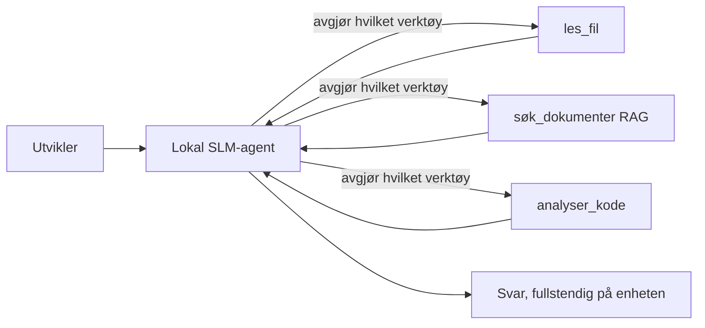
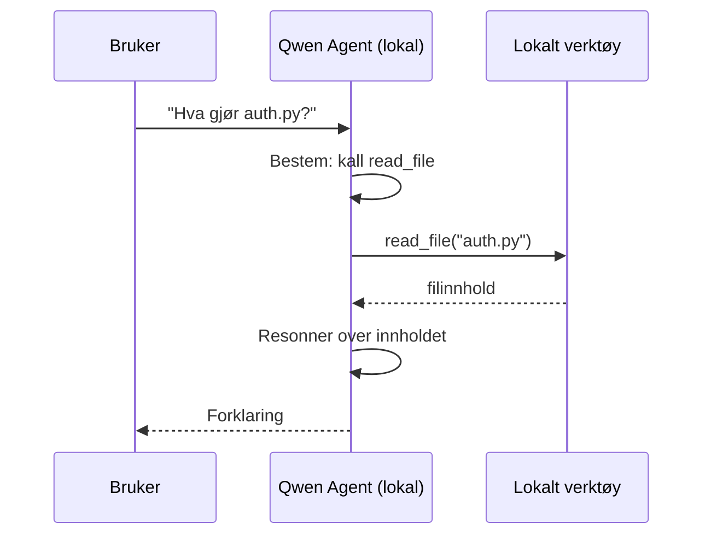
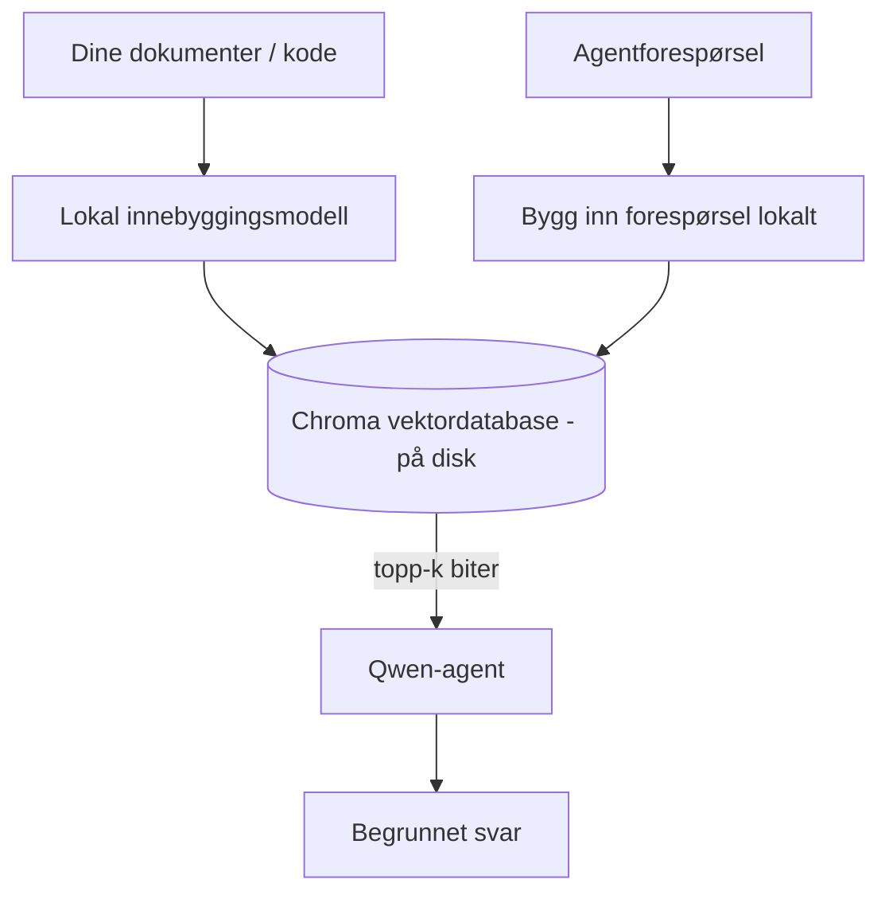
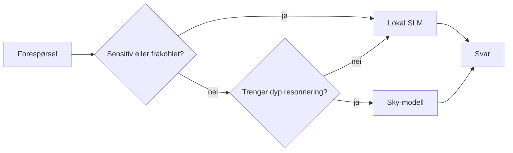

# Lage lokale AI-agenter med Microsoft Foundry Local og Qwen


Forrige leksjon skalerte agenter *opp* til skyen. Denne bringer dem *ned* på én enkelt maskin. På slutten vil du ha en fungerende ingeniørassistent som tenker, kaller verktøy, leser filene dine, og søker i dokumentasjonen din — **uten én eneste forespørsel til skyen.**

Hvorfor skulle du ønske det? Tre grunner som stadig dukker opp i reelt ingeniørarbeid:

- **Personvern.** Kode og dokumenter forlater aldri maskinen. Ingen prompt, utdrag eller kundedata krysser nettverksgrensen.
- **Kostnad.** Lokal inferens har ingen kostnad per token. Du kan iterere hele dagen for prisen av strøm.
- **Offline.** På fly, i en sikker avdeling eller under strømbrudd, fungerer agenten fortsatt.

Fangsten er at du bytter en topptung skyløsning mot en **Small Language Model (SLM)** som kjører på CPU, GPU eller NPU på maskinen din. Denne leksjonen handler om å bygge agenter som er *gode* innenfor den begrensningen i stedet for å late som om den ikke finnes.

## Introduksjon

Denne leksjonen dekker:

- **Small Language Models (SLMer)** — hva de er, hvor de fungerer godt og hvor de ikke gjør det.
- **Microsoft Foundry Local** — et runtime-miljø som laster ned og server modeller lokalt gjennom en **OpenAI-kompatibel API**.
- **Qwen funksjonskall-modeller** — SLMer som pålitelig produserer verktøysanrop, noe som gjør lokale *agenter* (ikke bare lokal chat) mulig.
- **Lokale verktøy, lokal RAG og lokal MCP** — som gir agenten evner uten skyen.
- **Hybridmønstre** — når du skal holde ting lokalt og når du skal sette bort til skyen.

## Læringsmål

Etter å ha fullført denne leksjonen vil du kunne:

- Forklare avveiningene ved SLM og velge passende lokale agent-brukstilfeller.
- Serve en Qwen-modell lokalt med Foundry Local og koble til den via OpenAI-kompatibelt endepunkt.
- Bygge en verktøysanropende agent som kjører helt på din arbeidsstasjon.
- Legge til lokal RAG over dine egne dokumenter ved bruk av en lokal vektordatabase (Chroma).
- Koble agenten til en lokal MCP-server og ta stilling til hybride lokale/sky-løsninger.

## Forutsetninger

Denne leksjonen forutsetter at du har fullført tidligere leksjoner og er komfortabel med:

- [Bruk av verktøy](../04-tool-use/README.md) (Leksjon 4) og [Agentisk RAG](../05-agentic-rag/README.md) (Leksjon 5).
- [Agentiske protokoller / MCP](../11-agentic-protocols/README.md) (Leksjon 11).
- [Microsoft Agent Framework](../14-microsoft-agent-framework/README.md) (Leksjon 14).

Du vil også trenge:

- En utviklerarbeidsstasjon. **8 GB RAM er et realistisk minimum**; 16 GB+ er behagelig. En GPU eller NPU hjelper, men er ikke påkrevd.
- **Microsoft Foundry Local** installert (se oppsettdelen nedenfor).
- Python 3.12+ og pakkene i repoets [`requirements.txt`](../../../requirements.txt), pluss `foundry-local-sdk`, `openai` og `chromadb` for denne leksjonen.

## Small Language Models: Det riktige verktøyet for lokal bruk

En topptung skyløsning har hundrevis av milliarder parametere og et datasenter bak seg. En SLM har noen få milliarder parametere og må få plass i laptopens RAM. Den forskjellen setter klare forventninger.

**SLMer er gode på:**

- Strukturerte, avgrensede oppgaver — klassifisering, ekstraksjon, oppsummering av et kjent dokument.
- **Verktøysanrop** — avgjøre hvilken funksjon som skal kalles og med hvilke argumenter.
- Rask, billig, privat iterasjon på egne data.

**SLMer er svakere på:**

- Åpent, flertrinns resonnering over stort kontekst.
- Bred verdensforståelse (de har sett mindre og glemmer mer).

Den vinnende strategien for lokale agenter er derfor: **la SLM orkestrere, og la verktøyene gjøre det tunge arbeidet.** Modellen trenger ikke å *kunne* kodebasen din — den trenger å vite når den skal kalle `read_file` og `search_docs`. Det spiller rett på en SLMs styrker.



## Microsoft Foundry Local

**Microsoft Foundry Local** er et lettvekts runtime-miljø som laster ned, administrerer og server modeller helt lokalt på maskinen din. Den viktigste egenskapen for oss er at den eksponerer et **OpenAI-kompatibelt HTTP-endepunkt** — noe som betyr at OpenAI SDK og Microsoft Agent Frameworks OpenAI-klient fungerer mot det med bare en endring av `base_url`. Alt du har lært om å bygge agenter overføres direkte; kun endepunktet flyttes fra skyen til `localhost`.

Foundry Local velger også automatisk den beste byggingen av en modell for maskinvaren din — CPU-versjon, CUDA/GPU-versjon eller NPU-versjon — så du slipper å optimalisere manuelt per maskin.

### Oppsett

Installer Foundry Local (se [dokumentasjonen](https://learn.microsoft.com/azure/ai-foundry/foundry-local/) for ditt OS), og bekreft at det fungerer:

```bash
# Installer (for eksempel; følg dokumentasjonen for din plattform)
winget install Microsoft.FoundryLocal      # Windows
# brew install microsoft/foundrylocal/foundrylocal   # macOS

# Last ned og kjør en Qwen-modell, start deretter den lokale tjenesten
foundry model run qwen2.5-7b-instruct
foundry service status
```

Når tjenesten kjører har du et lokalt, OpenAI-kompatibelt endepunkt (typisk `http://localhost:PORT/v1`). Notatboken bruker `foundry-local-sdk` til å oppdage endepunktet automatisk, så du trenger ikke hardkode porten.

## Qwen funksjonskall: Hvorfor det betyr noe

En agent er bare en agent hvis den kan kalle verktøy. Mange SLMer kan chatte, men produserer upålitelige, feilformede verktøysanrop. **Qwen**-modeller er trent for funksjonskall og produserer konsekvent velformede verktøysostrukturer — som er akkurat det som gjør en lokal chatmodell til en lokal *agent*.

Flyten er den standard verktøysanrop-sløyfen du allerede kjenner, bare at den kjører lokalt:



## Lokal RAG

Dokumentasjonssøk er der lokale agenter virkelig har verdi. I stedet for å håpe at SLM har memorert rammeverkets dokumentasjon, embedder du dokumentene i en **lokal vektordatabase** og lar agenten hente relevante utdrag etter behov.

Vi bruker **Chroma**, et innebygd vektorlager som kjører i prosess uten server. Hele kjeden er lokalt: lokal embeddemodell → lokale vektorer → lokal henting → lokal SLM.



Dette er det samme Agentic RAG-mønsteret fra Leksjon 5 — eneste forskjell er at alle komponentene kjører på maskinen din.

## Lokale MCP-servere

[MCP](../11-agentic-protocols/README.md) er et transportlag, ikke en skytjeneste. En MCP-server kan kjøre som en lokal prosess på `stdio` og eksponere verktøy til agenten over standardprotokollen. Dette lar deg gjenbruke det voksende økosystemet av MCP-servere — tilgang til filsystem, git-operasjoner, databaseforespørsler — helt offline.

Sikkerhetsinnstillingen er annerledes enn i skyen, men ikke fraværende: en lokal MCP-server kjører fortsatt med brukertillatelser, så avgrens hva den kan berøre (et prosjektkatalog, ikke hele hjemmemappen) og behandle utdata som input som må verifiseres.

## Hybrid skylokale mønstre

Lokal-først betyr ikke bare lokalt. Modne systemer ruter etter sensitivitet og vanskelighetsgrad:

| Situasjon | Hvor det kjører |
| --- | --- |
| Sensitiv kode/data, eller offline | **Lokal SLM** |
| Enkelt, avgrenset oppgave | **Lokal SLM** (rimelig, rask) |
| Vanskelig flertrinns resonnering på ikke-sensitiv data | **Sky-modell** |
| Alt, under strømbrudd | **Lokal SLM** (grasiøs degradering) |

Dette speiler **modell-rutingen** fra Leksjon 16 — bortsett fra at en av "modellene" nå er din egen maskin. Et robust design faller tilbake på lokalt når skyen er utilgjengelig, slik at agenten degraderer i kvalitet i stedet for å feile helt.



## Praktisk lab: En lokal ingeniørassistent

Åpne [`code_samples/17-local-agent-foundry-local.ipynb`](./code_samples/17-local-agent-foundry-local.ipynb) og følg gjennom. Du vil bygge en **lokal ingeniørassistent** som kjører helt på din arbeidsstasjon og kan:

1. **Kalle verktøy** — via Qwen funksjonskall gjennom Foundry Local.
2. **Utføre lokale filoperasjoner** — liste opp og lese filer i et prosjektkatalog.
3. **Analysere kode** — rapportere grunnleggende metrikker på en kildefil.
4. **Søke i dokumentasjon** — lokal RAG over en dokumentasjonsmappe med Chroma.
5. **Bruke MCP** — koble til en lokal MCP-server (med en grasiøs hopp hvis ingen er konfigurert).

Ingen skybassert inferens brukes på noe tidspunkt.

### Gjennomgang

Assistenten kobler seg til Foundry Local via OpenAI-kompatibelt endepunkt, så agentkoden ser nesten identisk ut med skylærdommene — bare klienten endres:

```python
from foundry_local import FoundryLocalManager
from openai import OpenAI

# Foundry Local oppdager/nedlaster modellen og gir oss et lokalt endepunkt.
manager = FoundryLocalManager(\"qwen2.5-7b-instruct\")
client = OpenAI(base_url=manager.endpoint, api_key=manager.api_key)  # api_key er en lokal plassholder
```

Verktøyene er vanlige Python-funksjoner avgrenset til et prosjektkatalog:

```python
def read_file(path: str) -> str:
    \"\"\"Read a file, but only inside the sandboxed project directory.\"\"\"
    full = (PROJECT_ROOT / path).resolve()
    if PROJECT_ROOT not in full.parents and full != PROJECT_ROOT:
        return \"Access denied: path is outside the project directory.\"
    return full.read_text(encoding=\"utf-8\")
```

Merk sandbox-sjekken — selv lokalt er et verktøy som leser vilkårlige stier en risiko. Notatboken holder hvert verktøy avgrenset til én prosjektrot.

## Kunnskapssjekk

Test forståelsen din før du går videre til oppgaven.

**1. Gi to konkrete grunner til å kjøre en agent lokalt i stedet for i skyen.**

<details>
<summary>Svar</summary>

To av følgende: **personvern** (kode og data forlater aldri maskinen), **kostnad** (ingen token-basert pris), og **offline-funksjonalitet** (fungerer uten nettverk – på fly, i sikkert miljø, eller under strømbrudd). Regulatoriske/kompatibilitetsbegrensninger som forbyr dataoverføring utenfor enheten er en vanlig driver av personverngrunn.
</details>

**2. Hva er anbefalt arbeidsdeling mellom en SLM og dens verktøy i en lokal agent, og hvorfor?**

<details>
<summary>Svar</summary>

La SLM **orkestrere** (bestemme hvilket verktøy som skal kalles og med hvilke argumenter) og la **verktøyene gjøre det tunge arbeidet** (lese filer, hente dokumenter, beregne resultater). SLMer er sterke på avgrensede valg som verktøyvalg, men svakere på bred kunnskap og lang flertrinns resonnering, så å støtte seg på verktøy spiller på deres styrker.
</details>

**3. Hva gjør det mulig å gjenbruke sky-agentkode med Foundry Local?**

<details>
<summary>Svar</summary>

Foundry Local eksponerer et **OpenAI-kompatibelt HTTP-endepunkt**. OpenAI SDK og Agent Frameworks OpenAI-klient fungerer mot det ved å endre bare `base_url` (og bruke en lokal plassholder-API-nøkkel). Alt annet i agentkoden forblir det samme.
</details>

**4. Hvorfor bruker vi spesielt en Qwen funksjonskall-modell i stedet for hvilken som helst SLM?**

<details>
<summary>Svar</summary>

Fordi en agent må produsere pålitelige, velformede **verktøysanrop**. Mange SLMer kan chatte, men sender ut feilformede eller inkonsistente verktøyskallstrukturer. Qwen-modeller er trent for funksjonskall og produserer konsekvente verktøysanrop, noe som gjør en lokal chatmodell til en fungerende lokal agent.
</details>

**5. I den lokale RAG-pipelinen, hvilke komponenter kjører på maskinen?**

<details>
<summary>Svar</summary>

Alle: embeddemodellen, vektordatabasen (Chroma, på disk), uthentingssteget og SLM. Dokumenter embeddes lokalt, lagres lokalt, hentes lokalt og resonerers over av en lokal modell — ingen komponent berører skyen.
</details>

**6. En lokal MCP-server kjører på maskinen din. Gjør det automatisk serveren trygg? Hvilket forholdsregel bør du fortsatt ta?**

<details>
<summary>Svar</summary>

Nei. En lokal MCP-server kjører med brukerens tillatelser, så den kan gjøre alt du kan. Begrens den til det den trenger (for eksempel ett prosjektkatalog, ikke hele hjemmemappen) og behandle utdata som input som må valideres før bruk.
</details>

**7. Beskriv en fornuftig hybrid ruterregel som inkluderer en lokal modell.**

<details>
<summary>Svar</summary>

Ruter sensitive eller offline forespørsler til lokal SLM; ruter enkle avgrensede oppgaver til lokal SLM for fart og kostnad; ruter vanskelig flertrinns resonnering på ikke-sensitiv data til sky-modell; og faller tilbake på lokal SLM om skyen er utilgjengelig, slik at agenten degraderer grasiøst i stedet for å feile. Dette er modellrutingen (Leksjon 16) med lokal maskin som en av modellene.
</details>

**8. Hva er et realistisk minimum RAM-beløp for å kjøre lokal agent i denne leksjonen, og hva får du ut av mer RAM?**

<details>
<summary>Svar</summary>

Rundt **8 GB** er et realistisk minimum; 16 GB+ er komfortabelt. Mer RAM lar deg kjøre større, mer kapable modeller og beholde mer kontekst i minnet. En GPU eller NPU gjør inferens raskere, men er ikke nødvendig — Foundry Local velger CPU-bygget når akselerator ikke er tilgjengelig.
</details>

## Oppgave

Utvid den lokale ingeniørassistenten til en **lokal dokumentasjonsgjennomgåer** for et lite prosjekt du velger (bruk gjerne en av leksjonsmappene i dette repoet).

Innleveringen din skal:

1. **Indeksere en ekte dokumentasjons-/kode-mappe** i Chroma (minst fem filer).
2. **Legge til et `find_todos` verktøy** som søker gjennom prosjektet etter `TODO`/`FIXME`-kommentarer og returnerer disse med fil- og linjenummer — med samme sandbox-sjekk som `read_file`.

3. **Still agenten tre spørsmål** som tvinger den til å kombinere verktøy: ett rent RAG-spørsmål, ett som krever å lese en spesifikk fil, og ett som krever å finne TODOer.
4. **Mål det**: tid hver av de tre svarene og noter dem i en markdown-celle. Kommenter om latenstiden er akseptabel for din tiltenkte arbeidsflyt.

Skriv deretter et kort avsnitt om **hva du ville flyttet til skyen og hva du ville beholdt lokalt** for denne vurdereren, og hvorfor. Du vurderes på om de lokale komponentene er koblet riktig sammen og om din hybride resonnering er solid — ikke på modellkvalitet.

## Sammendrag

I denne leksjonen bygde du en agent som kjører helt på din egen maskin:

- **SLM-er** bytter bredde mot personvern, kostnad og offline-operasjon — og skinner når de **orkestrerer verktøy** heller enn å bære all kunnskap selv.
- **Foundry Local** betjener modeller på enheten bak et **OpenAI-kompatibelt endepunkt**, slik at koden for skyagenten din overføres med én linjes endring.
- **Qwen-funksjonskallingsmodeller** gjør pålitelig lokal verktøysanrop — og dermed lokale *agenter* — mulig.
- **Lokal RAG** (Chroma) og **lokal MCP** gir agenten kapasitet uten å forlate maskinen.
- **Hybride mønstre** lar deg rute etter sensitivitet og vanskelighetsgrad, med lokal som en smidig fallback.

Dette fullfører distribusjonsbuen: Leksjon 16 skalerte agenter opp i Microsoft Foundry, og denne leksjonen skalerte dem ned til en enkelt arbeidsstasjon. Neste leksjon handler om å holde distribuerte agenter sikre.

## Ytterligere ressurser

- <a href="https://learn.microsoft.com/azure/ai-foundry/foundry-local/" target="_blank">Microsoft Foundry Local-dokumentasjon</a>
- <a href="https://learn.microsoft.com/azure/ai-foundry/what-is-azure-ai-foundry" target="_blank">Microsoft Foundry-dokumentasjon</a>
- <a href="https://learn.microsoft.com/en-us/agent-framework/overview/?wt.mc_id=youtube_26688_organicsocial_reactor&pivots=programming-language-python" target="_blank">Microsoft Agent Framework</a>
- <a href="https://qwen.readthedocs.io/en/latest/framework/function_call.html" target="_blank">Qwen funksjonskallingsdokumentasjon</a>
- <a href="https://modelcontextprotocol.io/" target="_blank">Model Context Protocol (MCP)</a>
- <a href="https://docs.trychroma.com/" target="_blank">Chroma vektordatabasen</a>

## Forrige leksjon

[Deploying Scalable Agents](../16-deploying-scalable-agents/README.md)

## Neste leksjon

[Securing AI Agents](../18-securing-ai-agents/README.md)

---

<!-- CO-OP TRANSLATOR DISCLAIMER START -->
**Ansvarsfraskrivelse**:
Dette dokumentet er oversatt ved hjelp av AI-oversettelsestjenesten [Co-op Translator](https://github.com/Azure/co-op-translator). Selv om vi streber etter nøyaktighet, vær oppmerksom på at automatiske oversettelser kan inneholde feil eller unøyaktigheter. Det opprinnelige dokumentet på originalspråket skal betraktes som den autoritative kilden. For kritisk informasjon anbefales profesjonell menneskelig oversettelse. Vi er ikke ansvarlige for eventuelle misforståelser eller feiltolkninger som oppstår ved bruk av denne oversettelsen.
<!-- CO-OP TRANSLATOR DISCLAIMER END -->