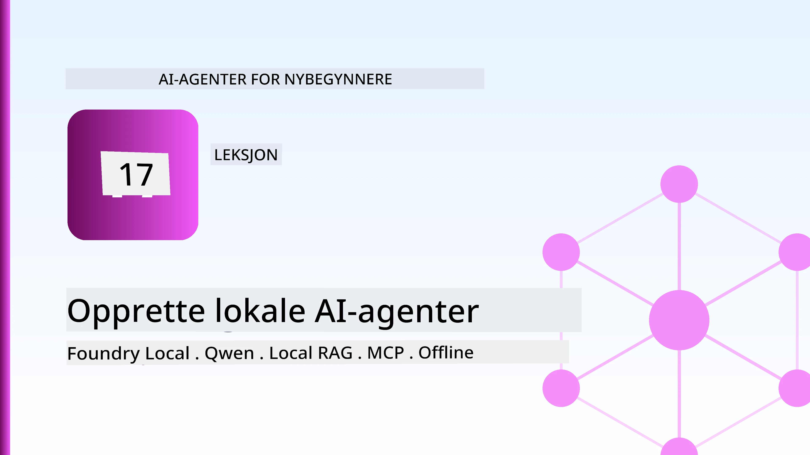
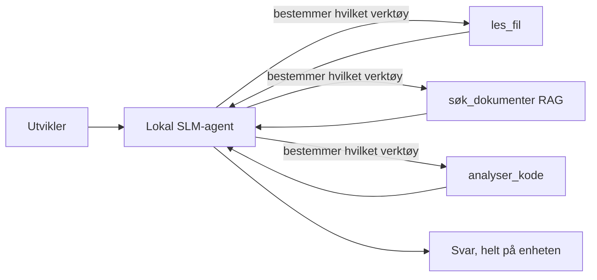
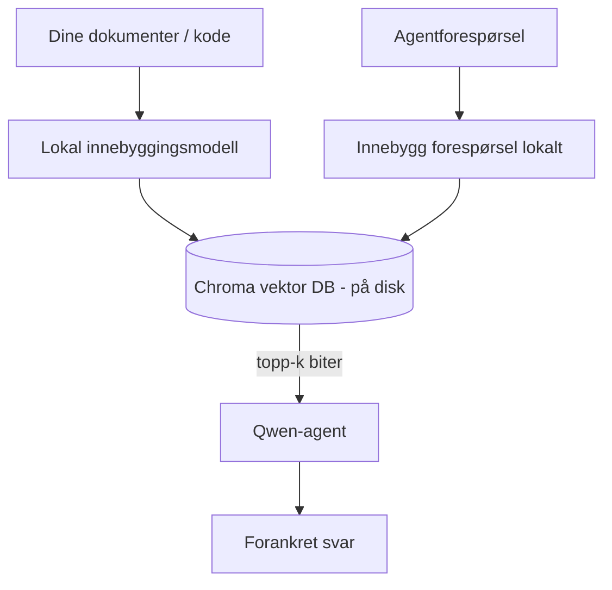
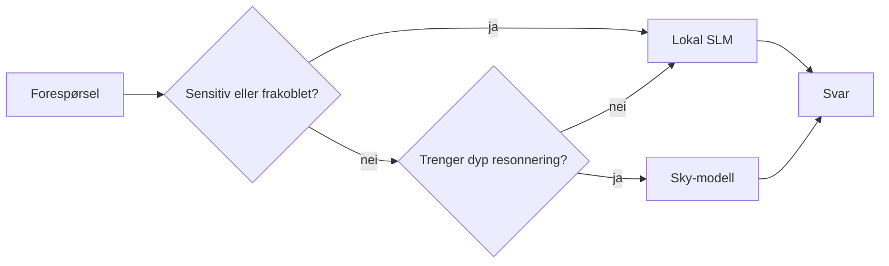

# Lage lokale AI-agenter ved hjelp av Microsoft Foundry Local og Qwen



Den forrige leksjonen skalerte agenter *opp* i skyen. Denne bringer dem *ned* til en enkelt maskin. Mot slutten vil du ha en fungerende ingeniørassistent som resonerer, kaller verktøy, leser filene dine og søker i dokumentasjonen din — **uten et eneste skybasert inferenskall.**

Hvorfor skulle du ønske det? Tre grunner som stadig dukker opp i virkelig ingeniørarbeid:

- **Personvern.** Kode og dokumenter forlater aldri maskinen. Ingen prompt, utdrag eller kundedata krysser nettverksgrensen.
- **Kostnad.** Lokal inferens har ingen kostnad per token. Du kan iterere hele dagen til prisen av strøm.
- **Frakoblet.** På et fly, i en sikker installasjon eller under en strømutkopling fungerer agenten fortsatt.

Fangsten er at du bytter en frontlinjemodell i skyen med en **Small Language Model (SLM)** som kjører på CPU, GPU eller NPU. Denne leksjonen handler om å bygge agenter som er *gode* innenfor den begrensningen i stedet for å late som om begrensningen ikke finnes.

## Introduksjon

Denne leksjonen vil dekke:

- **Small Language Models (SLMs)** — hva de er, hvor de skinner og hvor de ikke gjør det.
- **Microsoft Foundry Local** — en runtime som laster ned og server modeller på enheten gjennom en **OpenAI-kompatibel API**.
- **Qwen funksjonskallmodeller** — SLM-er som pålitelig produserer verktøyskall, noe som gjør lokale *agenter* (ikke bare lokal chat) mulig.
- **Lokale verktøy, lokal RAG og lokal MCP** — gir agenten evne uten skyen.
- **Hybridmønstre** — når man skal holde ting lokalt og når man skal nå ut til skyen.

## Læringsmål

Etter å ha fullført denne leksjonen vil du vite hvordan du skal:

- Forklare avveiningene ved SLM-er og velge passende bruksområder for lokale agenter.
- Servere en Qwen-modell lokalt med Foundry Local og koble til den gjennom OpenAI-kompatibelt endepunkt.
- Bygge en verktøyskallagent som kjører helt på arbeidsstasjonen din.
- Legge til lokal RAG over dine egne dokumenter ved hjelp av en lokal vektordatabaseserver (Chroma).
- Koble agenten til en lokal MCP-server og tenke rundt hybride lokale/sky-design.

## Forutsetninger

Denne leksjonen antar at du har fullført tidligere leksjoner og er komfortabel med:

- [Verktøybruk](../04-tool-use/README.md) (Leksjon 4) og [Agentic RAG](../05-agentic-rag/README.md) (Leksjon 5).
- [Agentic Protocols / MCP](../11-agentic-protocols/README.md) (Leksjon 11).
- [Microsoft Agent Framework](../14-microsoft-agent-framework/README.md) (Leksjon 14).

Du trenger også:

- En utviklerarbeidsstasjon. **8 GB RAM er et realistisk minimum**; 16 GB+ er behagelig. GPU eller NPU hjelper, men er ikke påkrevd.
- **Microsoft Foundry Local** installert (se oppsettseksjonen under).
- Python 3.12+ og pakkene i depotets [`requirements.txt`](../../../requirements.txt), i tillegg til `foundry-local-sdk`, `openai` og `chromadb` for denne leksjonen.

## Small Language Models: Det riktige verktøyet for lokalt arbeid

En frontlinjemodell i skyen har hundrevis av milliarder parametere og et datasenter bak seg. En SLM har noen få milliarder parametere og må få plass i RAM-en på laptoppen din. Den forskjellen setter klare forventninger.

**SLM-er er gode på:**

- Strukturerte, avgrensede oppgaver — klassifisering, utvinning, oppsummering av et kjent dokument.
- **Verktøyskall** — avgjøre hvilken funksjon som skal kalles og med hvilke argumenter.
- Rask, billig og privat iterasjon på dine egne data.

**SLM-er er svakere på:**

- Åpent, flerhoppet resonnement over stor kontekst.
- Bred verdenskunnskap (de har sett mindre, og glemmer mer).

Den vinnende strategien for lokale agenter er derfor: **la SLM-en orkestrere, og la verktøyene gjøre det tunge løftet.** Modellen trenger ikke å *kjenne til* kodebasen din — den må vite når den skal kalle `read_file` og `search_docs`. Det spiller direkte på styrkene til en SLM.



## Microsoft Foundry Local

**Microsoft Foundry Local** er en lettvekts runtime som laster ned, administrerer og server modeller helt på maskinen din. Dens viktigste funksjon for oss er at den eksponerer et **OpenAI-kompatibelt HTTP-endepunkt** — som betyr at OpenAI SDK og Microsoft Agent Frameworks OpenAI-klient fungerer med det ved bare å endre `base_url`. Alt du lærte om å bygge agenter overføres direkte; bare endepunktet flyttes fra skyen til `localhost`.

Foundry Local velger også automatisk den beste byggversjonen av en modell for maskinvaren din — en CPU-versjon, en CUDA/GPU-versjon eller en NPU-versjon — så du slipper å optimalisere for hver maskin.

### Oppsett

Installer Foundry Local (se [dokumentasjonen](https://learn.microsoft.com/azure/ai-foundry/foundry-local/) for ditt OS), og bekreft at det fungerer:

```bash
# Installer (eksempel; følg dokumentasjonen for din plattform)
winget install Microsoft.FoundryLocal      # Windows
# brew install microsoft/foundrylocal/foundrylocal   # macOS

# Last ned og kjør en Qwen-modell, start deretter den lokale tjenesten
foundry model run qwen2.5-7b-instruct
foundry service status
```

Når tjenesten kjører har du et lokalt, OpenAI-kompatibelt endepunkt (typisk `http://localhost:PORT/v1`). Notebooken bruker `foundry-local-sdk` for å finne endepunktet automatisk, så du trenger ikke hardkode porten.

## Qwen funksjonskalling: Hvorfor det betyr noe

En agent er bare en agent hvis den kan kalle verktøy. Mange SLM-er kan chatte, men produserer upålitelige, feilformede verktøyskall. **Qwen**-modellene er trent for funksjonskalling og sender konsekvent godt formede verktøyskallstrukturer — det som gjør en lokal chatmodell til en lokal *agent*.

Flyten er den vanlige verktøyskallsløyfen du kjenner, bare at den kjører på enheten:


## Lokal RAG

Dokumentasjonssøk er der lokale agenter virkelig viser sin verdi. I stedet for å håpe at SLM-en har memorisert rammens dokumentasjon, legger du inn dokumentene i en **lokal vektordatabaseserver** og lar agenten hente relevante biter etter behov.

Vi bruker **Chroma**, en innebygd vektorlager som kjører i prosessen uten en server å administrere. Pipen er helt lokal: lokal embeddermodell → lokale vektorer → lokal henting → lokal SLM.



Dette er det samme Agentic RAG-mønsteret fra Leksjon 5 — den eneste forskjellen er at alle komponentene kjører på maskinen din.

## Lokale MCP-servere

[MCP](../11-agentic-protocols/README.md) er transport, ikke en skytjeneste. En MCP-server kan kjøre som en lokal prosess på `stdio`, og eksponere verktøy til agenten din over standardprotokollen. Dette lar deg gjenbruke det voksende økosystemet av MCP-servere — filsystemtilgang, git-operasjoner, databaseforespørsler — helt offline.

Sikkerhetsinnstillingen er annerledes enn i skyen, men ikke fraværende: en lokal MCP-server kjører fortsatt med brukerens rettigheter, så avgrens hva den kan få tilgang til (en prosjektmappe, ikke hele hjemmeområdet ditt) og behandle utdata som input du validerer.

## Hybride sky- og lokal-mønstre

Lokal-først betyr ikke bare lokal. Modne systemer ruter forespørsler basert på sensitivitet og vanskelighetsgrad:

| Situasjon | Hvor det kjører |
| --- | --- |
| Sensitiv kode/data eller frakoblet | **Lokal SLM** |
| Enkel, avgrenset oppgave | **Lokal SLM** (billig, rask) |
| Vanskelig flerhoppet resonnement på ikke-sensitive data | **Sky-modell** |
| Alt under utfall | **Lokal SLM** (grasiøs degradering) |

Dette speiler **modellruting**-ideen fra Leksjon 16 — bortsett fra at en av "modellene" nå er din egen maskin. Et robust design faller tilbake til lokal når skyen ikke er tilgjengelig, slik at agenten degraderer i kvalitet i stedet for å feile helt.



## Praktisk lab: En lokal ingeniørassistent

Åpne [`code_samples/17-local-agent-foundry-local.ipynb`](./code_samples/17-local-agent-foundry-local.ipynb) og arbeid deg gjennom det. Du vil bygge en **lokal ingeniørassistent** som kjører helt på arbeidsstasjonen din og kan:

1. **Kalle verktøy** — via Qwen funksjonskalling gjennom Foundry Local.
2. **Utføre lokale filoperasjoner** — liste opp og lese filer i en prosjektmappe.
3. **Analysere kode** — rapportere grunnleggende målinger på en kildefil.
4. **Søke i dokumentasjon** — lokal RAG over en dokumentasjonsmappe med Chroma.
5. **Bruke MCP** — koble til en lokal MCP-server (med en elegant hopp hvis ingen er konfigurert).

Ingen skylinferens brukes til noe tidspunkt.

### Gjennomgang

Assistenten kobler til Foundry Local gjennom det OpenAI-kompatible endepunktet, så agentkoden ser nesten identisk ut med sky-leksjonene — bare klienten endres:

```python
from foundry_local import FoundryLocalManager
from openai import OpenAI

# Foundry Local finner/nedlaster modellen og gir oss et lokalt endepunkt.
manager = FoundryLocalManager(\"qwen2.5-7b-instruct\")
client = OpenAI(base_url=manager.endpoint, api_key=manager.api_key)  # api_key er en lokal plassholder
```

Verktøyene er vanlige Python-funksjoner avgrenset til en prosjektmappe:

```python
def read_file(path: str) -> str:
    \"\"\"Read a file, but only inside the sandboxed project directory.\"\"\"
    full = (PROJECT_ROOT / path).resolve()
    if PROJECT_ROOT not in full.parents and full != PROJECT_ROOT:
        return \"Access denied: path is outside the project directory.\"
    return full.read_text(encoding=\"utf-8\")
```

Merk sjekken av sandkasse — selv lokalt er et verktøy som leser vilkårlige stier en risiko. Notebooken holder hvert verktøy avgrenset til en enkelt prosjektrot.

## Kunnskapstest

Test din forståelse før du går videre til oppgaven.

**1. Gi to konkrete grunner til å kjøre en agent lokalt i stedet for i skyen.**

<details>
<summary>Svar</summary>

Hvilke som helst to av: **personvern** (kode og data forlater aldri maskinen), **kostnad** (ingen kostnad per token inferens), og **frakoblet evne** (fungerer uten nettverk — på et fly, i en sikker installasjon eller under utfall). Regulatoriske og samsvarsbegrensninger som forbyr å sende data utenfor enheten er en vanlig driver for personverngrunn.
</details>

**2. Hva er den anbefalte arbeidsfordelingen mellom en SLM og dens verktøy i en lokal agent, og hvorfor?**

<details>
<summary>Svar</summary>

La SLM-en **orkestrere** (bestemme hvilket verktøy som skal kalles og med hvilke argumenter), og la **verktøyene gjøre det tunge løftet** (lese filer, hente dokumenter, regne ut resultater). SLM-er er sterke på avgrensede beslutninger som verktøyvalg, men svakere på bred kunnskap og lang flerhoppet resonnement, så å støtte seg på verktøy spiller på deres styrker.
</details>

**3. Hva gjør det mulig å gjenbruke skyagentkode med Foundry Local?**

<details>
<summary>Svar</summary>

Foundry Local eksponerer et **OpenAI-kompatibelt HTTP-endepunkt**. OpenAI SDK og Agent Frameworks OpenAI-klient fungerer mot det ved å bare endre `base_url` (og bruke en lokal plassholder for API-nøkkel). Alt annet i agentkoden forblir det samme.
</details>

**4. Hvorfor bruker vi spesifikt en Qwen funksjonskallmodell og ikke bare en hvilken som helst SLM?**

<details>
<summary>Svar</summary>

Fordi en agent må produsere pålitelige, godt formede **verktøyskall**. Mange SLM-er kan chatte, men sender feilaktige eller inkonsekvente verktøyskallstrukturer. Qwen-modeller er trent for funksjonskalling og produserer konsistente verktøyskall, noe som gjør en lokal chatmodell til en fungerende lokal agent.
</details>

**5. I den lokale RAG-pipelinen, hvilke komponenter kjører på maskinen?**

<details>
<summary>Svar</summary>

Alle: embeddermodellen, vektordatabasen (Chroma, på disk), hentetrinnet og SLM-en. Dokumenter embeddes lokalt, lagres lokalt, hentes lokalt og resonerers over av en lokal modell — ingen komponent berører skyen.
</details>

**6. En lokal MCP-server kjører på maskinen din. Gjør det den automatisk trygg? Hvilke forholdsregler bør du fortsatt ta?**

<details>
<summary>Svar</summary>

Nei. En lokal MCP-server kjører med brukerrettighetene dine, så den kan få tilgang til alt du kan. Avgrens den til det den trenger (for eksempel en enkelt prosjektmappe fremfor hele hjemmeområdet ditt) og behandle utdata som inndata du validerer før du handler på dem.
</details>

**7. Beskriv en fornuftig hybrid ruterregel som inkluderer en lokal modell.**

<details>
<summary>Svar</summary>

Rute sensitive eller frakoblede forespørsler til lokal SLM; rute enkle, avgrensede oppgaver til lokal SLM for hastighet og kostnad; rute vanskelige flerhoppede resonnementer på ikke-sensitive data til en skymodell; og fall tilbake til lokal SLM hvis skyen ikke er tilgjengelig, slik at agenten degraderer grasiøst i stedet for å feile. Dette er modellruting (Leksjon 16) med lokal maskin som en av modellene.
</details>

**8. Hva er et realistisk minimum RAM-tall for å kjøre lokal agent i denne leksjonen, og hva gir mer RAM deg?**

<details>
<summary>Svar</summary>

Omtrent **8 GB** er et realistisk minimum; 16 GB+ er behagelig. Mer RAM lar deg kjøre større, mer kapable modeller og holde mer kontekst i minnet. GPU eller NPU fremskynder inferens men er ikke påkrevd — Foundry Local velger en CPU-versjon når ingen akselerator er tilgjengelig.
</details>

## Oppgave

Utvid den lokale ingeniørassistenten til en **lokal dokumentasjonsanmelder** for et lite prosjekt etter eget valg (bruk gjerne en av leksjonsmappene i depotet).

Innleveringen din skal:

1. **Indekser en faktisk dokumentasjons-/kodemappe** i Chroma (minst fem filer).
2. **Legg til et `find_todos` verktøy** som skanner prosjektet etter `TODO`/`FIXME`-kommentarer og returnerer dem med fil og linjenummer — med samme sandkasse-sjekk som `read_file`.

3. **Still agenten tre spørsmål** som tvinger den til å kombinere verktøy: ett rent RAG-spørsmål, ett som krever å lese en spesifikk fil, og ett som krever å finne TODOs.
4. **Mål det**: tidfest hver av de tre responsene og noter dem i en markdown-celle. Kommenter på om latency er akseptabel for din tiltenkte arbeidsflyt.

Skriv deretter et kort avsnitt om **hva du ville flyttet til skyen og hva du ville beholdt lokalt** for denne anmelderen, og hvorfor. Du vurderes på om de lokale komponentene er koblet riktig sammen og om din hybride resonnering er god — ikke på modellkvalitet.

## Sammendrag

I denne leksjonen bygde du en agent som kjører helt på din egen maskin:

- **SLMer** bytter bredde mot personvern, kostnad og offline operasjon — og skinner når de **orkestrerer verktøy** i stedet for å bære all kunnskap selv.
- **Foundry Local** server modeller på enheten bak en **OpenAI-kompatibel endepunkt**, slik at skyagentkoden din overføres med en endring på én linje.
- **Qwen funksjonskallmodeller** gjør pålitelig lokal verktøyskalling — og dermed lokale *agenter* — mulig.
- **Lokal RAG** (Chroma) og **lokal MCP** gir agenten kapasitet uten å forlate maskinen.
- **Hybride mønstre** lar deg rute etter sensitivitet og vanskelighetsgrad, med lokal som en elegant fallback.

Dette fullfører deployeringsbuen: Leksjon 16 skalerte agenter opp i Microsoft Foundry, og denne leksjonen skalerte dem ned til en enkelt arbeidsstasjon. Neste leksjon handler om å holde distribuerte agenter sikre.

## Ytterligere ressurser

- <a href="https://learn.microsoft.com/azure/ai-foundry/foundry-local/" target="_blank">Microsoft Foundry Local dokumentasjon</a>
- <a href="https://learn.microsoft.com/azure/ai-foundry/what-is-azure-ai-foundry" target="_blank">Microsoft Foundry dokumentasjon</a>
- <a href="https://learn.microsoft.com/en-us/agent-framework/overview/?wt.mc_id=youtube_26688_organicsocial_reactor&pivots=programming-language-python" target="_blank">Microsoft Agent Framework</a>
- <a href="https://qwen.readthedocs.io/en/latest/framework/function_call.html" target="_blank">Qwen funksjonskall dokumentasjon</a>
- <a href="https://modelcontextprotocol.io/" target="_blank">Model Context Protocol (MCP)</a>
- <a href="https://docs.trychroma.com/" target="_blank">Chroma vektordatabasen</a>

## Forrige leksjon

[Distribuere skalerbare agenter](../16-deploying-scalable-agents/README.md)

## Neste leksjon

[Sikre AI-agenter](../18-securing-ai-agents/README.md)

---

<!-- CO-OP TRANSLATOR DISCLAIMER START -->
**Ansvarsfraskrivelse**:
Dette dokumentet er oversatt ved hjelp av AI-oversettelsestjenesten [Co-op Translator](https://github.com/Azure/co-op-translator). Selv om vi streber etter nøyaktighet, vær oppmerksom på at automatiske oversettelser kan inneholde feil eller unøyaktigheter. Det opprinnelige dokumentet på originalspråket skal betraktes som den autoritative kilden. For kritisk informasjon anbefales profesjonell menneskelig oversettelse. Vi er ikke ansvarlige for eventuelle misforståelser eller feiltolkninger som oppstår ved bruk av denne oversettelsen.
<!-- CO-OP TRANSLATOR DISCLAIMER END -->